# Subscriptions

If you have chosen the subscription option for your journal \(see Journal Setup [Step 4: Management](https://docs.pkp.sfu.ca/learning-ojs-2/en/step_four_management)\), a link to manage your subscriptions will appear on your Journal Management Pages menu.

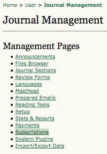

After selecting **Subscriptions** from the menu, you will see an overview of the subscription activity for your journal, and a set of choices to configure and manage your subscriptions, including Subscription Types, Subscription Policies, Payments, Individual Subscriptions and Institutional Subscriptions. From this page you can also create a new subscription.

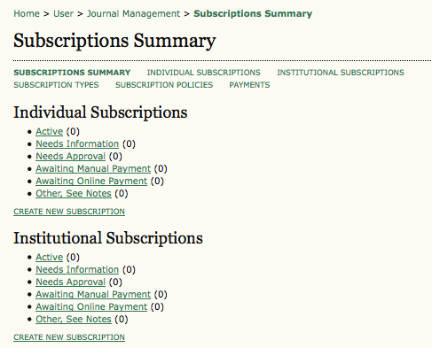

### Subscription Types

The first step in setting up subscription management is to designate the types of subscriptions the journal offers. Journals typically offer individual subscription and institutional subscription rates. Some journals may have special offers for members of an organization or students. OJS will support the management of print and/or online subscriptions. More than one type of subscription can be created to cover longer periods of time \(e.g. 12 months, 36 months\).

To begin, select **Subscription Type **and from the resulting page, click **Create New Subscription Type**.

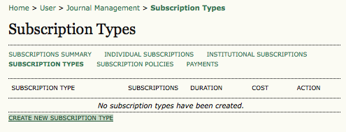

Next, fill in the details, including a unique name, a description, cost, and currency. You can also determine if it is for online, print, or online + print. You can also set the duration of the subscription, and whether it is individual \(login required\) or institutional \(access via IP address or domain name -- e.g., sfu.ca\). Lastly, you can require a membership for the subscription \(perhaps for a reduced fee\) and hide the subscription type from being published on the About page.

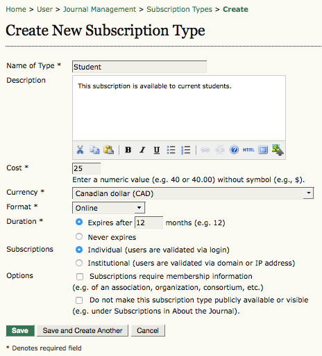

### Subscription Policies

Under the Subscription Policies heading you will enter information in several sections.

* **Subscription Manager**: Add the contact information for the journal's Subscription Manager. This will appear on the About page.

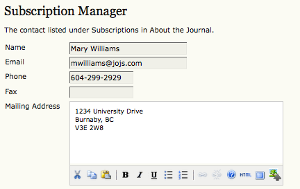

* **Subscription Information**: The Subscription Types and fee structure will be automatically placed under Subscriptions on the About the Journal page, along with the name and contact information for the Subscription Manager. Additional information about subscriptions, such as methods of payment or support for subscribers in developing countries, can be added here.

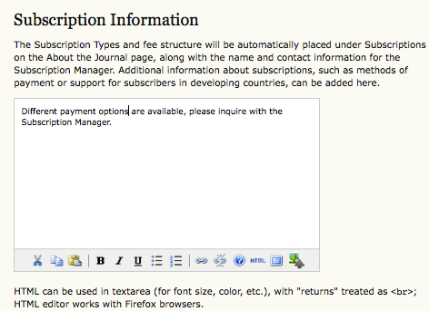

* **Subscription Expiry**: Upon subscription expiry, readers may be denied access to all subscription content, or to those published after subscription expiry date. Useful reminders can be sent out to your subscribers, informing them of expiry dates. The Site Administrator will need to enable and configure `scheduled_tasks` within `config.inc.php`to allow for these options to be enabled.

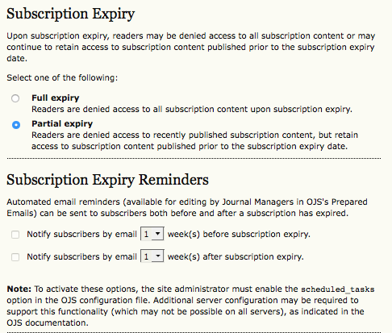

* **Online Payment Notifications**: Use this option to allow for automatic notification of online payments for the Subscription Manager.

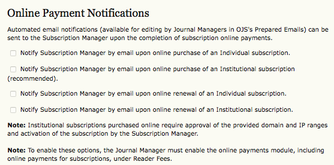

* **Delayed Open Access**: Although a journal may wish to limit their content to subscribers, it is also possible to allow for back issues to become openly accessible over time. You can set the number of months to pass before content is opened. It is also possible to send readers a notice when content becomes open, and to add a statement about delayed open access to your About the Journal page.

```
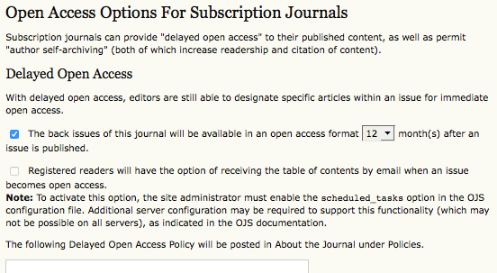  
```

* **Author Self-Archiving Policy**: This section allows you to also post a statement about your journal's author self-archiving policy. A default statement is provided, but can be changed to best suit your needs.

```
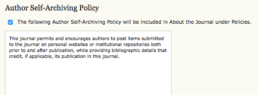
```

### Payments

Returning to the Subscriptions Summary page you will see an option to select **Payments**.

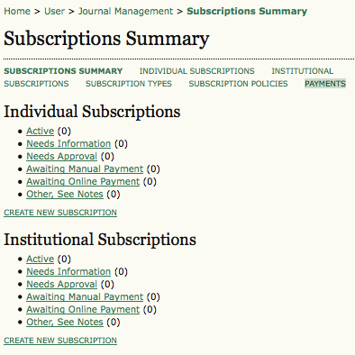

Selecting the **Payments** here will take you to the **Fee Payment Option** page configured in the [Payments](https://docs.pkp.sfu.ca/learning-ojs-2/en/payments) page in the previous section.

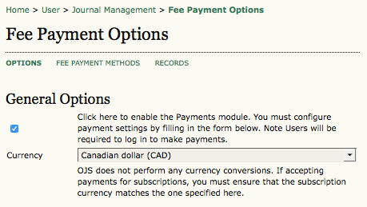

### Subscription Content

When you publish content in your journal that you want to be accessible only to subscribers, mark it as subscription-only in the Table of Contents.

