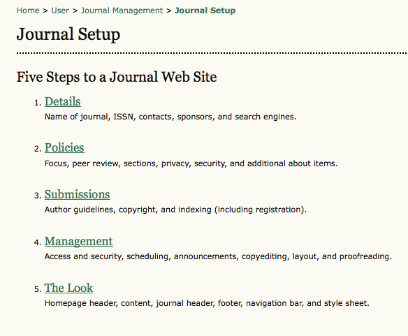

# The Five-Step Setup Process

The Journal Manager sets up the journal, after the system has been installed on a web server, by working through five steps which requires filling in web-based forms. The setup does not have to be done all at once; the forms can be filled in and saved, and you can return to Setup to complete the task or make changes at any time.

Setting up the journal's web site will require decisions and text for the  sections below, which can be prepared in advance in consultation with the Editors or added at a later point.

Complete as many of the sections in the five steps as possible, but remember that you can always go back and fill in additional details as they become available. Default options are often pre-selected for common functions.

You can get started quickly by filling in the most important information first (journal name, principal contact, etc.) and returning to the details later.