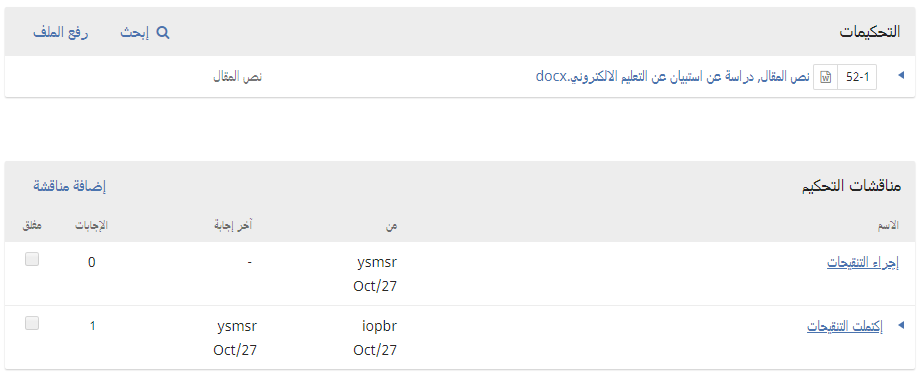

# الفصل 10: التأليف

في هذا الفصل، ستتعلم عن كيفية تعامل المؤلف مع نظام المجلات المفتوحة بدءً من التسجيل وانتهاءً بالقراءة التصحيحية للوح الطباعي النهائي.

## التسجيل في المجلة

لتقديم طلب نشر إلى مجلة تعمل بنظام المجلات المفتوحة، عليك أولاً التسجيل بمثابة مؤلف \(أنظر [التسجيل في مجلة](./user-accounts.md#التسجيل-في-مجلة)\). بعد ذلك، وعند تسجيل الدخول في الموقع، سيتم أخذك إلى لوحة القيادة.

وهي حالياً خالية حيث أنك لم تقدم أي طلبات بعد.

## تقديم مقالة

إبدأ بتقديم طلب جديد عبر النقر على زر **طلب جديد** في الجانب الأيمن من النافذة.  سيتم أخذك إلى الخطوة الأولى من عملية تستغرق خمس خطوات لرفع وتوصيف طلبك.

### الخطوة 1

في **الخطوة 1** ستقدم معلومات أولية عن طلب تقديمك.

للبدء، إختر القسم الأنسب لتقديم طلبك \(أي، مقالة، مراجعة... إلخ\). إن لم تكن متأكداً من القسم المناسب، رجح القسم الأقرب في المعنى إلى موضوع مقالتك.

إقرأ الفقرات الموجودة ضمن قائمة تقديم الطلب ووافق عليها عبر تأشير خانة الاختيار إزاء كل منها. ضمِّن أي ملاحظات موجهة إلى المحرر، واقرأ بيان الخصوصية للمجلة ومن ثم انقر على زر **إحفظ واستمر** للانتقال إلى **الخطوة 2**.

### الخطوة 2

في **الخطوة 2**، ستفتح لك نافذة تسمح لك برفع ملف تقديمك.

أولاً عليك اختيار مكون المقالة. هذا سيسمح للنظام بمعرفة فيما لو أن الملف الذي ترفعه هو متن العمل، صورة، جداول بيانات... إلخ. **ينبغي تحديد ذلك قبل الشروع برفع الملف**.

بمجرد اتخاذ هذا الاختيار، سيكون بإمكانك رفع ملفك الأول. من المهم ملاحظة أنك تستطيع رفع ملف **واحد فقط** في كل عملية رفع. يمكن رفع ملفات إضافية لاحقاً خلال هذه العملية. عادة ما يكون الملف الأول هو متن مؤلَّفك. أنقر على زر **استمر** بمجرد رفع الملف.

بعد رفع الملف، ستتم مطالبتك بمراجعة تسميته. استعمل رابط التعديل لإجراء أي تعديلات.

أنقر على زر **استمر**.

بعدها سيكون لك خيار إعادة العملية لرفع ملفات إضافية \(مثل جدول بيانات أو صورة\).

بمجرد إكمال رفع كل ملفاتك، أنقر **أكمل**؛ هذا سيغلق نافذة الرفع.

ستتم إعادتك إلى نافذة _تقديم مقالة_ حيث ستعاين الملفات التي سبق لك رفعها. إذا أردت إجراء تعديلات، قم بتوسيع السهم الأزرق في يمين الملف المعني وأجر أي تعديلات مستعملاً رابط _تعديل_.

أنقر ‘إحفظ واستمر’ للانتقال إلى الخطوة 3.

### الخطوة 3

في **الخطوة 3**، ستتم مطالبتك بإضافة المزيد من المعلومات عن تقديمك، بما في ذلك عنوانه \(مجزئاً إياه إلى بادئة، عنوان، وعنوان ثانوي\)، وملخص، ومن ثم عبر النزول في النافذة...

...أي مساهمين آخرين.

يمكنك إضافة المزيد من المساهمين \(أي المؤلفين المشاركين\)، عبر النقر على رابط **إضافة مساهمين**. هذا سيفتح نافذة جديدة تتضمن حقولاً لإدخال بياناتهم.

أنقر **إحفظ**، ليظهر المساهم المضاف على النافذة.

إعتماداً على المجلة التي تقدم طلبك إليها، قد تشاهد حقولاً إضافية عليك إدخالها، مثل: الكلمات المفتاحية.

لإدخال كلمة مفتاحية، ببساطة أكتب الكلمة أو العبارة ثم اضغط مفتاح الرجوع في لوحة المفاتيح. ستتم نمذجة الكلمة أو العبارة بمثابة كلمة مفتاحية.

أنقر **إحفظ واستمر** للمضي قدماً.

### الخطوة 4

في الخطوة 4، سيتم سؤالك فيما لو أنك راضٍ عن تقديم طلبك.

أنقر **إنهاء التقديم**.

ستظهر نافذة منبثقة تطالبك بتأكيد رغبتك في إنهاء التقديم. أنقر **تمام**.

### الخطوة 5

طلب تقديمك الآن مكتمل! لقد تم إشعار المحرر بشأنه. في هذه المرحلة، يمكنك الحصول على الروابط الآتية:

* مراجعة طلب التقديم
* إنشاء طلب تقديم جديد
* العودة إلى لوحة القيادة

بمجرد إكمالك لطلب التقديم، لن يكون بإمكانك إجراء أي تعديلات عليه. إذا أردت استبدال أي ملف أو القيام بأي تعديلات أخرى، سيكون عليك مراسلة المحرر عبر أداة مناقشات ما قبل التحكيم.

### لوحة القيادة

ها هو طلب تقديمك في لوحة القيادة. يمكنك مشاهدة أنه لا يزال في مرحلة _التقديم_.

خلال الأيام القادمة، سيتم نقله إلى مرحلة التحكيم، وإذا تم قبوله، إلى مراحل التدقيق ومن ثم الإنتاج قبل أن يحصل على النشر.

## الاستجابة للتنقيحات

بمجرد انتهاء عملية التحكيم، سيتم إشعارك عبر البريد الالكتروني من قبل المحرر بقراره.

بعد استلامك للرسالة، أدخل إلى لوحة القيادة.

إختر رابط *التحكيم* المجاور لطلب تقديمك لمعاينة القرار.

من هنا، يمكنك مشاهدة القرار (التنقيحات مطلوبة) مع رابط يذهب إلى ملاحظات المحرر.

استناداً إلى المعطيات الواردة في رسالة المحرر، عليك الآن تحضير تنقيحاتك.

### رفع الملف المنقح

عبر تقليب الصفحة إلى الأسفل، ستجد لوحة **التنقيحات**.

إستعمل رابط *رفع الملف* لرفع نسختك المنقحة.

إستعمل القائمة المنسدلة واختر منها ما يشير إلى أنك ترفع نسخة منقحة من ملف موجود سابقاً.

ثم إرفع الملف المنقح وانقر **إستمر**.

تحقق من تفاصيل الملف ثم انقر **إستمر** مرة أخرى.

إذا كان لديك أي ملفات إضافية لرفعها، إرفعها الآن، وإلا، أنقر **أكمل**.

ملفك المنقح ظاهر الآن في لوحة التحكيم.

### إبلاغ المحرر

خطوتك الآتية هي إبلاغ المحرر بأن ملفك المنقح صار متوفراً. للقيام بذلك، إذهب إلى لوحة مناقشات التحكيم.

من هناك، إختر رابط *إضافة مناقشة*.

إستعمل *خانات التأشير* لإضافة المحرر.

أدخل موضع المناقشة ونص رسالتك.

أنقر **تم** لإرسال الرسالة.

بذلك، سيتم إرسال رسالة الكترونية إلى المحرر وإليك، وسيكون بإمكان المحرر معاينة الرسالة في لوحة مناقشات التحكيم.

في هذه المرحلة، على المؤلف انتظار الرد من المحرر فيما لو أن التنقيحات مقبولة.

### قبول التنقيحات

ستصلك رسالة بأن تنقيحاتك مقبولة.

فضلاً عن ذلك، ستظهر لك إشعارات في لوحة القيادة.

الإشعار الأخير هو الإشعار الحالي. أنقر عليه لفتح الرسالة (والتي ستكون مطابقة للرسالة الالكترونية التي ستتلقاها).

إستعمل علامة الضرب **×** في الزاوية العليا اليمنى لإغلاق النافذة.

فضلاً عن ذلك، وفي نهاية لوحة القيادة، ستلاحظ وجود رد على المناقشة من قبل المحرر.

النقر على عنوان المناقشة سيؤدي إلى فتحها.

تهانينا! لقد تم قبول عملك، وملفك سيذهب إلى مرحلة التدقيق.

## إعادة التقديم إلى التحكيم

إذا كان قرار المحرر هو إعادة التقديم إلى التحكيم، سيكون عليك تسجيل الدخول إلى الموقع واختيار المقالة في صفحة طلبات تقديمك. إعادة التقديم يجري في مرحلة التحكيم، وليس عليك أن تبدأ بطلب تقديم جديد.

في مرحلة التحكيم، سيكون عليك القيام بأمرين لإعادة التقديم إلى المحكم بعد إجرائك للتنقيح:

إرفع الملف الجديد في مقطع التنقيحات. للقيام بذلك، أنقر على ‘رفع ملف.’ ستظهر لك نافذة جديدة تتيح رفع ملف/ملفات. إختر من القائمة المنسدلة ما تراه مناسباً للإشارة إلى أنك ترفع نسخة معدلة من ملف موجود سابقاً.

أضف المناقشة لإشعار المحرر بأنك قد أعدت تقديم طلبك.

عملية التحكيم المناظر ستأخذ مجراها مرة أخرى، ومن المرجح أن تتلقى المزيد من التماسات التنقيح. بمجرد إكمالها وقبولها، سيتم أخذك إلى الخطوة التالية.

## الاستجابة لالتماس التدقيق

الخطوة التالية في المخطط الانسيابي هي فحص ملفات تقديمك والتي تكون قد خضعت للتدقيق.

ستتلقى رسالة الكترونية تشعرك بأن ملفاتك صارت جاهزة. لمعاينتها، أدخل موقع المجلة واذهب إلى لوحة القيادة.

ستجد إدخالاً ضمن لوحة مؤلفاتي. إختر رابط التدقيق للذهاب إلى سجل التقديم الكامل، متضمناً الإشعار الخاص به في لوحة مناقشات التدقيق.

أنقر رابط المناقشة لفتحه وقراءة الرسالة، ثم افتح الملف المرفق.

بمجرد قراءتك للملف المرفق، يمكنك الاستجابة برغبتك في إجراء أي تعديلات ضرورية أو مصادقتك على العمل.

إذا تطلب الأمر، يمكنك إرفاق نسخة منقحة، ولكن سنقتصر هنا على أنك قد وافقت على النتائج. أنقر **تمام**.

في لوحة القيادة، ستجد أنك آخر من أجاب على الرسالة.

دورك في مرحلة التدقيق قد انتهى الآن، ويمكنك انتظار إلتماس بإجراء القراءة التصحيحية للألواح الطباعية النهائية (أي ملفات PDF، HTML، إلخ.) ما قبل النشر.

## الاستجابة لالتماس القراءة التصحيحية

الخطوة التالية في المخطط الانسيابي هي أن تفحص ملفاتك التي تحولت إلى ألواح طباعية (أي ملفات PDF، HTML، إلخ.).

ستتلقى رسالة الكترونية تشعرك بأن الملفات صارت جاهزة. لمعاينتها، أدخل موقع المجلة واذهب إلى لوحة القيادة.

ستجد إدخالاً ضمن لوحة مؤلفاتي. إختر رابط الإنتاج، لعرض سجل التقديم بالكامل، متضمناً إشعاراً في لوحة مناقشات الإنتاج.

أنقر رابط المناقشة لفتحه وقراءة الرسالة، ثم افتح الملف المرفق.

بمجرد قراءتك للملف المرفق، يمكنك الاستجابة برغبتك في إجراء أي تعديلات ضرورية تطلبها من المصمم أو مصادقتك على العمل.

هذا كل شيء! دورك ضمن مجريات التحرير قد انتهى الآن.
