# الفصل 11: المخطط الانسيابي للتحرير

في هذا الفصل، ستتابع سيرة طلب التقديم خلال مجريات عمليات التحرير وانتهاءً بالنشر.

المخطط الانسيابي مقسم إلى أربعة مراحل:

**التقديم**: حيث تحط طلبات التقديم ويتم تعيينها إلى محرر القسم من أجل الشروع بمرحلة التحكيم.

بعض طلبات التقديم قد تكون غير مناسبة بشكل واضح، وبالتالي فهي لا تتعدى هذه المرحلة.

**التحكيم**: هنا يجري التحكيم المناظر، فضلاً عن أي تنقيحات مطلوبة من المؤلف.

بعض الطلبات لن تجتاز مرحلة التحكيم لتقف عند هذه المرحلة. الطلبات التي يتم قبولها تتابع طريقها قدماً إلى المرحلة الآتية.

**التدقيق**: المقالات المقبولة تصل إلى هذه المرحلة، حيث يتم تحسينها بجهود المدقق. يمكن منح المؤلفين الفرصة لتنقيح التصحيحات.

**الإنتاج**: بمجرد إكتمال التصحيحات والمصادقة عليها، ينتقل العمل إلى هذه المرحلة. عند الإنتاج، الملفات المدققة يجري تحويلها إلى ألواح طباعية بتنسيقات - HTML، XML، PDF، إلخ. أيضاً، للمؤلف فرصة مراجعة تلك الألواح. بمجرد أن يكون الجميع راضين عن النتيجة، تتم جدولة العمل للنشر في أحد الأعداد القادمة.

## المهام

مهامك متوفرة في القائمة العلوية اليمنى من لوحة القيادة. لاحظ الرقم "1" في الصورة أدناه. هذا يشير إلى وجود مهمة واحدة حالياً في قائمتك.

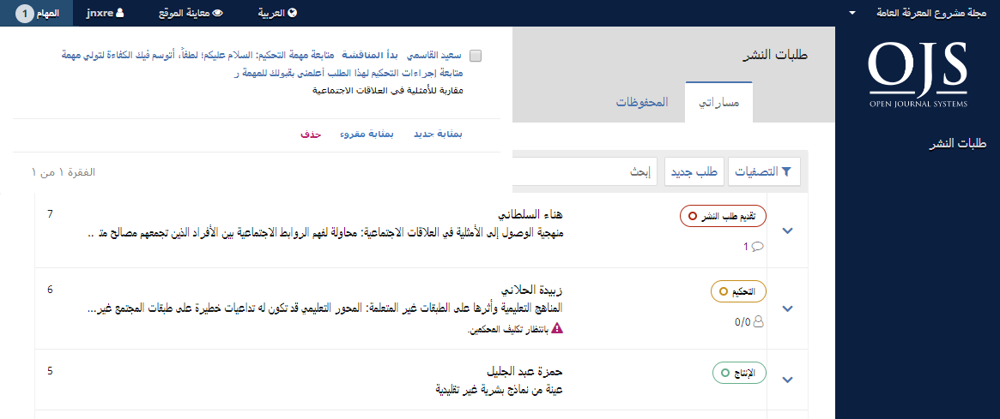

المهام تعطي نظرة سريعة على الفقرات التي تتطلب الاطلاع عليها. المدخلات الغامقة هي غير المقروءة، والعادية هي ما سبقت لك قراءته.

إستعمل خانات الاختيار لتحديد المهام التي تريد حذفها \(رابط الحذف موجود عند نهاية القائمة\).

## طلبات التقديم

عندما يقدم مؤلفٌ طلباً جديداً إلى مجلتك، يتم إشعار مدير التحرير تلقائياً عبر البريد الالكتروني. عندما تسجل دخولك إلى لوحة القيادة، يمكنك العثور عليه إما عبر معاينة المهام، أو ضمن أحد الطوابير \(مساراتي، غير المعينة، كل ما هو نشط، والمحفوظات\).

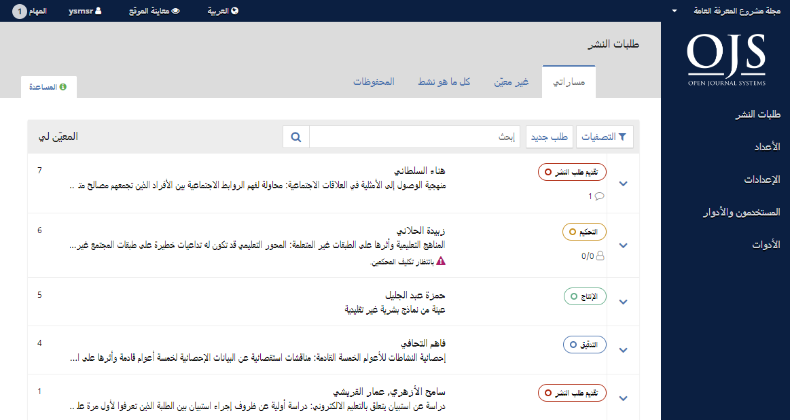

### مساراتي

**المعينة لي**: هذه اللوحة تتضمن طلبات التقديم المضافة إلى أي من الأقسام التي تقع ضمن مسؤولياتك كمحرر قسم أو ضمن طلباتك أنت إذا كنت مؤلفاً في تلك المجلة.

إن أداة **البحث** في كل طابور قد تكون مفيدة لتتبع التقديمات والوصول إليها بسرعة.

أداة **التصفية** تتيح لك حصر نتائج بحثك ضمن إطار معين \(مثلاً، غير مكتملة، مستوجبة\) أو حسب المراحل \(التقديم، التحكيم، التدقيق، الإنتاج\)، أو الأقسام \(مثلاً، المقالات، المراجعات\) لأغراض تسريع عمليات البحث.

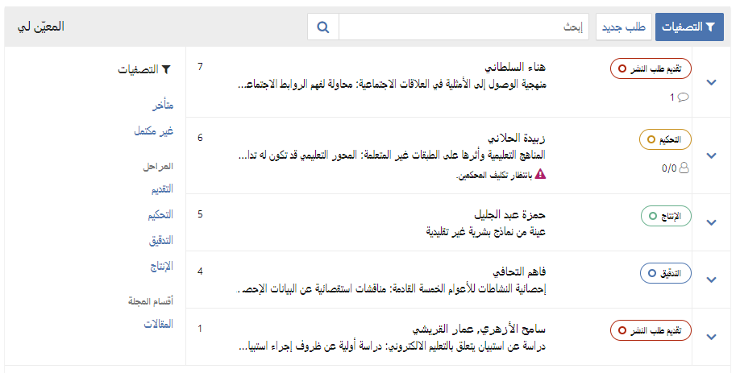

لاحظ أن بإمكانك استعمال السهم الأزرق عند يمين أي طلب تقديم لكشف المزيد من التفاصيل، بضمنها عدد التحكيمات الجارية، المناقشات الجديدة، وما شابه ذلك. كما أن ذلك يكشف أزراراً لتأخذك إلى سجل التقديم، معاينة سجل الوقوعات، والملاحظات، إضافة إلى حذف التقديم.

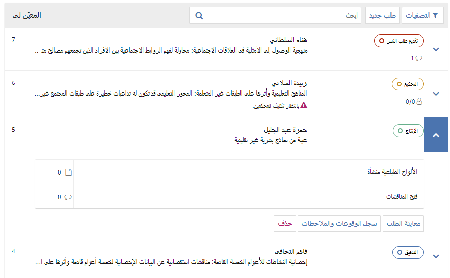

### غير المعينة

هذه اللوحة تتضمن طلبات التقديم المحولة إلى أقسام ليس فيها محررو أقسام.

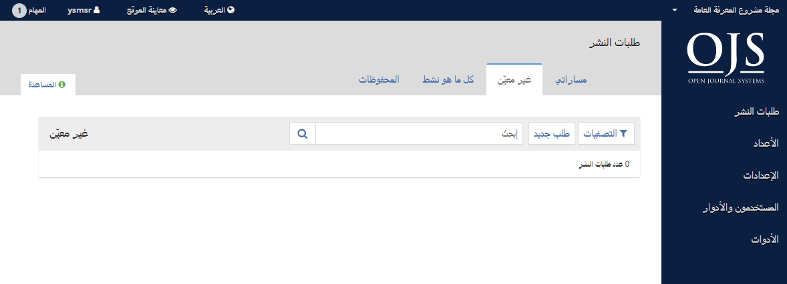

في المثال أعلاه، ليس هناك طلبات تقديم غير معينة، ولذلك فالوحة خالية.

### كل ما هو نشط

هذا المقطع يتضمن كل طلبات التقديم بدون تنظيمها في طوابير.

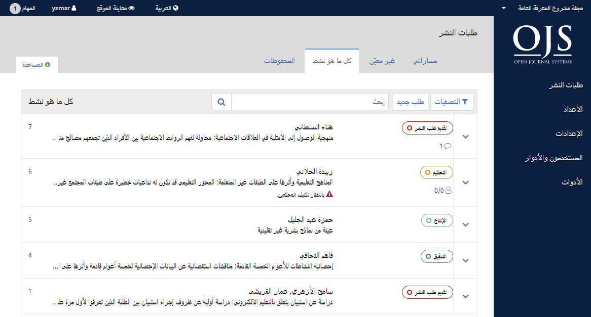

### المحفوظات

هذا المقطع يتضمن طلبات التقديم المرفوضة أو التي سبق نشرها من قبل المجلة.

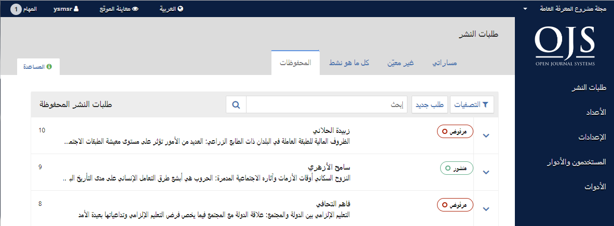

### استعراض طلب تقديم

لأغراض العرض، نحن نبحث عن طلب التقديم الخاص بكل من سامح الأزهري وعمار القريشي، المعنون _دراسة عن استبيان يتعلق بالتعليم الالكتروني_. يمكن العثور عليه في الطابور **مساراتي**، وكذلك ضمن طابور **كل ما هو نشط**.

بمجرد عثورك على طلب التقديم، يمكنك استعمال السهم الأزرق لكشف الخيارات الأخرى من أجل معرفة فيما كانت هناك أي مناقشات \(لا يوجد أي منها\)، فضلاً عن معاينة طلب التقديم، معاينة سجل الوقوعات والملاحظات، أو لحذف طلب التقديم.

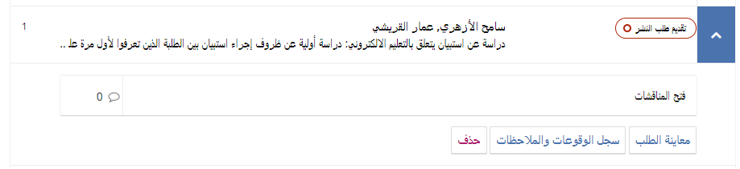

**حذف** سيقوم بنقل طلب التقديم إلى المحفوظات وعليه فإن **سجل الوقوعات والملاحظات** هما من سيحتفظ بالأحداث السابقة لطلب التقديم.

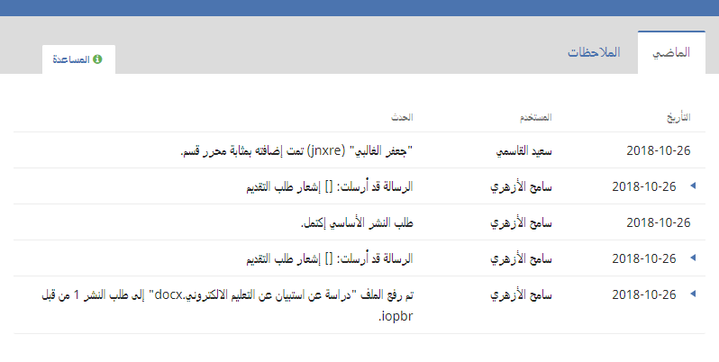

### سجل طلب التقديم

لمعاينة طلب التقديم بمزيد من التفصيل، إختر زر **معاينة طلب التقديم**. هذا من شأنه أخذك إلى سجله.

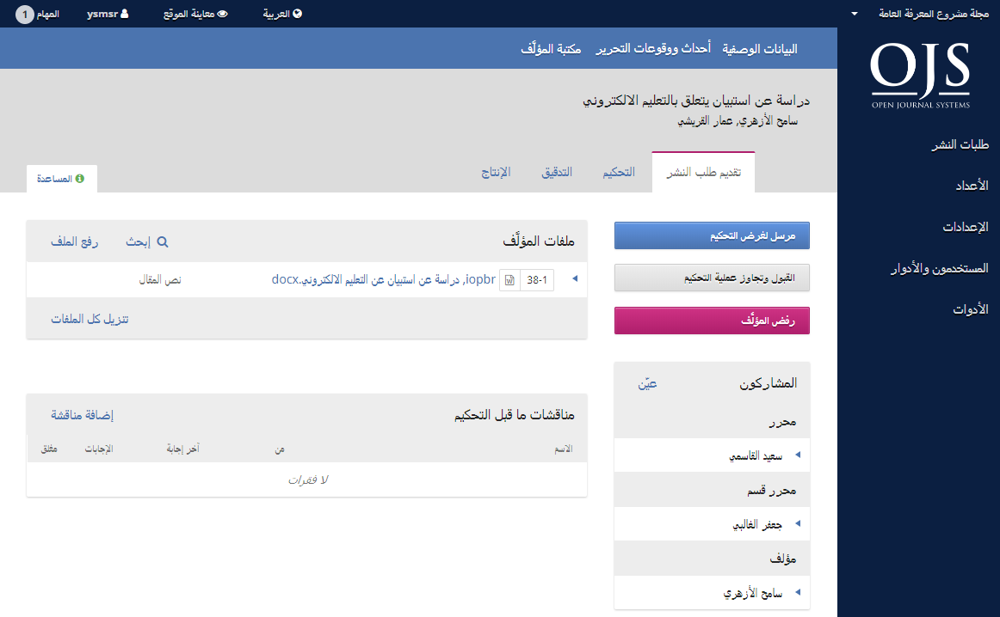

من هنا يمكنك معاينة:

**ملفات المؤلَّف**: هذه اللوحة تدرج الملفات التي سبق تقديمها. في هذا العرض، هناك ملف واحد فقط، لكن يمكن تقديم عدة ملفات مع بعض.

**مناقشات ما قبل التحكيم**: هذه اللوحة تسمح للمحرر بالتواصل مع المؤلف أو مع الآخرين في طاقم التحرير. على سبيل المثال، لمطالبة المؤلف بمزيد من المعلومات، أو لتوجيه أحد محرري القسم بتولي مهمة طلب التقديم هذا.

**أزرار الإجراءات**: هذه تتضمن الإرسال إلى التحكيم، القبول وتخطي التحكيم، ورفض طلب التقديم.

> ملاحظة: إذا لم تكن قادراً على مشاهدة هذه الأزرار، فمن المرجح أنك لم تعين طلب التقديم بعد إلى أي محرر.

**المشاركون**: هذه اللوحة التي تشاهد فيها قائمة المشاركين في أعمال طلب التقديم، بضمنهم مدير التحرير، محررو القسم، والمؤلف. الأفراد الآخرون \(المدققون، المحررون الطباعيون، إلخ.\) سيظهرون هنا بمجرد إضافتهم خلال المراحل اللاحقة.

إضافة إلى ذلك، ضمن الشريط الأزرق في الأعلى يمكنك مشاهدة:

**البيانات الوصفية**: حيث يمكنك معاينة البيانات الوصفية لطلب التقديم وتنقيحها.

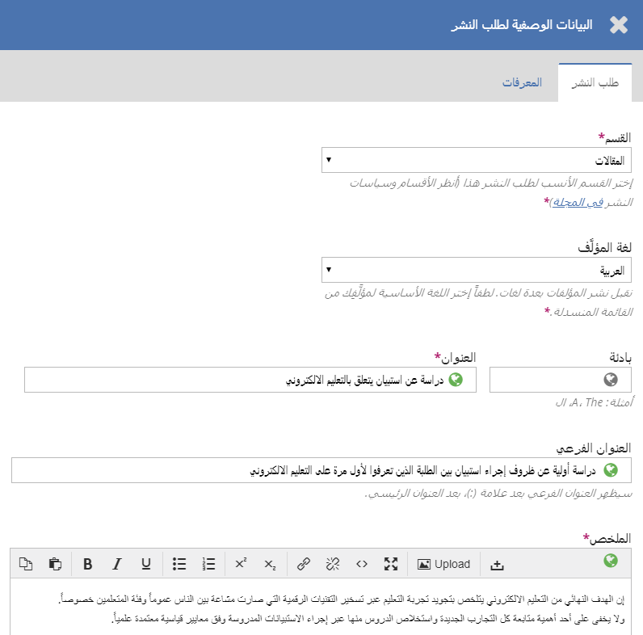

إستعمل علامة تبويب المعرفات لمعاينتها وإضافة المعرف الفريد فيها.

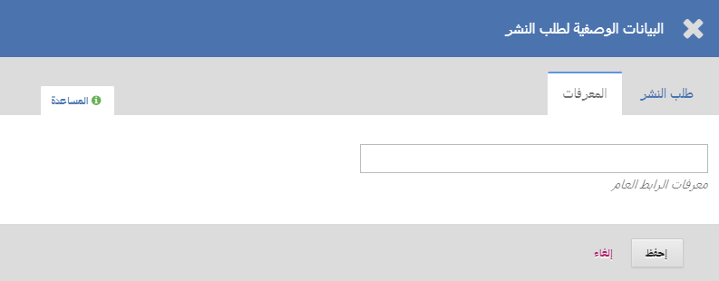

**أحداث ووقوعات التحرير**: حيث يمكنك معاينة النشاطات التحريرية السابقة وأي ملاحظات تتعلق بطلب التقديم.

إستعمل علامة تبويب الملاحظات لمعاينة تلك الملاحظات أو إضافة المزيد منها.

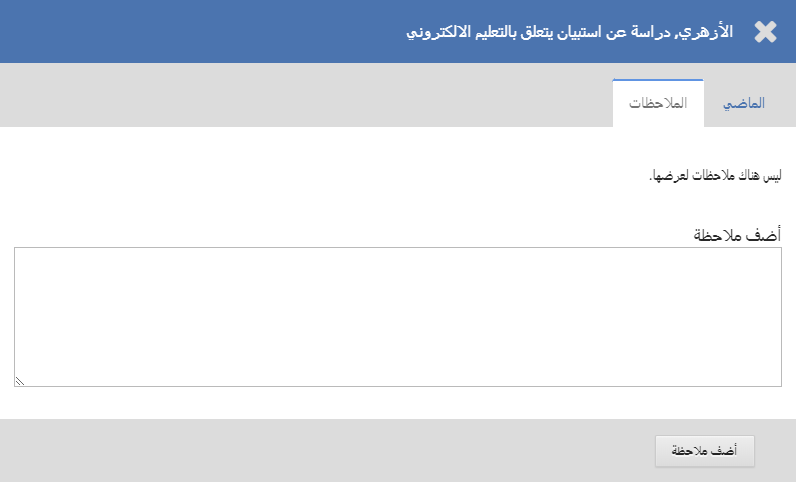

**مكتبة المؤلَّف**: حيث يمكنك إضافة أي مستندات ذات صلة بطلب التقديم.

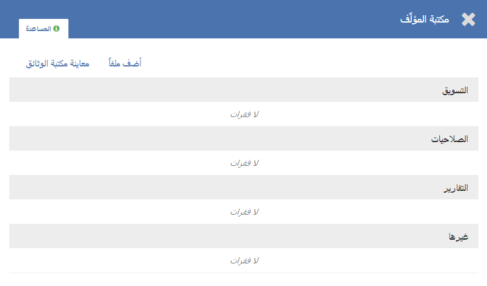

### تعيين طلب التقديم

إعتماداً على الكيفية التي جرى فيها تعريف أقسام مجلتك، قد تكون بعض طلبات التقديم غير معينة لأي من المحررين. في تلك الحالة، الخطوة الآتية هي تعيين أحد المحررين أو محرري الأقسام لهذا التقديم. للقيام بذلك، إختر رابط _التعيين_ في لوحة **المشاركين**.

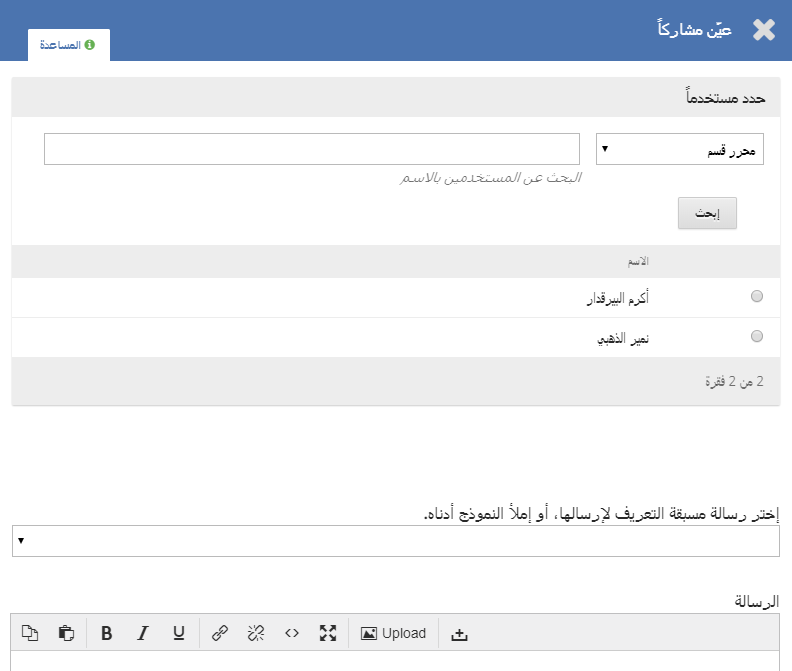

سيكون لك خيار تحديد المستخدمين حسب أدوارهم. إختر أحدهم، وأرسل له رسالة تلتمس فيها إبداء المساعدة.

> ملاحظة: إن كنت غير متأكد من أسماء محرري الأقسام، ببساطة إختر ذلك الدور من القائمة المنسدلة، ومن ثم أنقر زر البحث. كل محرري الأقسام سيكونون مدرجين أمامك وجاهزين لاختيار أحدهم.

أنقر زر **تمام** لإجراء التعيين وإرسال الرسالة.

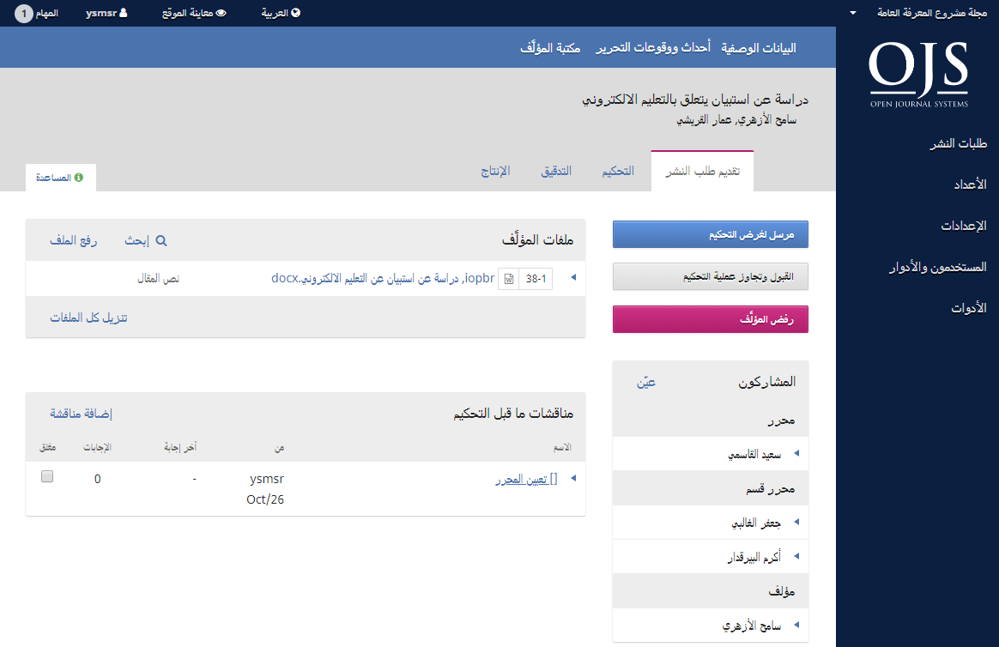

> لاحظ مناقشة ما قبل التحكيم التي تمت إضافتها تلقائياً كجزء من عملية التعيين.

يمكنك الآن ملاحظة أن محرر القسم قد تمت إضافته إلى قائمة المشاركين، وأن أزرار الإجراءات صارت جاهزة له:

**الإرسال إلى التحكيم**: نقل طلب التقديم إلى الخطوة التالية.

**القبول وتخطي التحكيم**: تخطي مرحلة التحكيم ونقل طلب التقديم مباشرة إلى مرحلة التدقيق.

**رفض طلب التقديم**: رفض طلب التقديم قبل تمريره إلى عملية التحكيم. هذا الطلب سيتم حفظه في الأرشيف.

في مثالنا هذا، رغم أن مدير التحرير قد عين محرر قسم، سيكون من الممكن له أيضاً تعيين نفسه لطلب التقديم.

### محرر القسم

الآن وبعد تعيين محرر القسم، فبإمكانه تسجيل الدخول إلى الموقع ومعاينة لوحة القيادة. طلب التقديم يمكن العثور عليه في قائمة مساراتي.

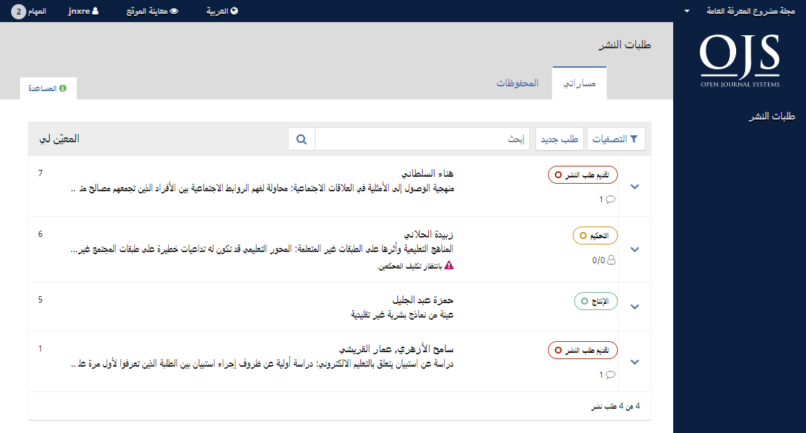

النقر على عنوان التقديم يفتح سجله بالكامل.

#### قبول التعيين

ولو أن ذلك ليس ضرورياً، فبإمكان محرر القسم الرد على رسالة مناقشة ما قبل التحكيم لإبلاغ مدير التحرير بقبوله للمهمة وأنه مستعد للمضي بها قدماً.

#### التواصل مع المؤلف

إذا كانت لدى محرر القسم أية استفسارات، فبإمكانه مراسلة المؤلف عبر مناقشات ما قبل التحكيم.

#### الإرسال إلى التحكيم

بمجرد أن يكون محرر القسم مطمئناً إلى كون طلب التقديم ملائم للمجلة، فله أن يختار زر **الإرسال إلى التحكيم** لتمرير التقديم إلى المرحلة التالية.

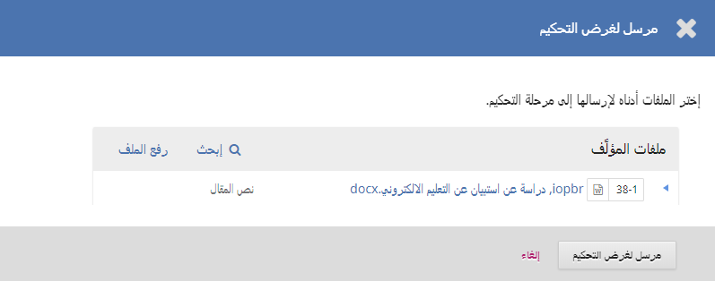

أبق الملفات التي من المفترض تحكيمها مؤشرة.

## التحكيم

عندما يدخل طلب التقديم مرحلة التحكيم، سيظهر إشعار للإشارة إلى ضرورة انتخاب المحكمين.

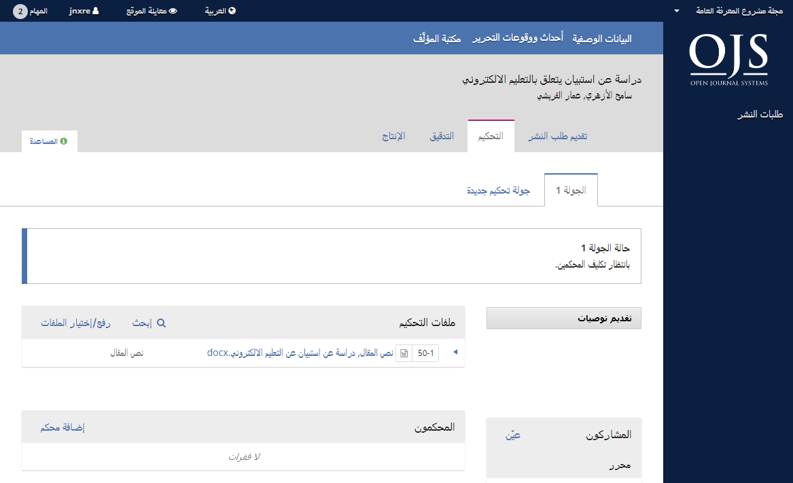

> ملاحظة: في اللقطة أعلاه، نحن نشاهد ما يشاهده محرر القسم. لاحظ أن أزرار الإجراءات مقننة \(تقديم توصيات هو المتاح منها فقط\). لو سجلنا دخولنا بصفة مدير التحرير، سنرى المزيد من أزرار الإجراءات \(إلتماس التنقيحات، التقديم إلى التحكيم، الإرسال إلى التدقيق، رفض طلب التقديم\).

من قائمة المحكمين، يمكنك اختيار إضافة محكم لتعيين محكم جديد.

هذا سيفتح نافذة جديدة حيث يتم إدراج المحكمين في قائمة ويمكن منها انتخاب أحدهم.

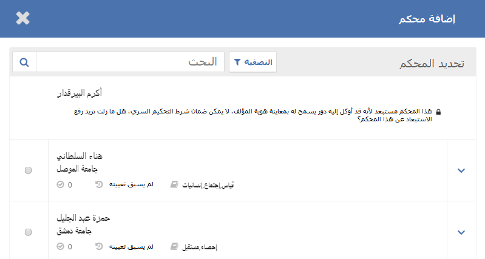

لاحظ التفاصيل المتاحة عن المحكمين، بضمنها اهتماماتهم، ماضيهم التحكيمي، إلخ.

في إصدارات نظام المجلات المفتوحة 3.0 إلى 3.1.0، لا يمكنك تعيين أي مستخدم بمثابة محكم إذا كان في نفس الوقت محرراً لنفس طلب التقديم. إذا فعلت ذلك، لن يكون المحرر قادراً على الوصول إلى طلب التقديم بعد إكمال المحكمين لأعمالهم، وهذا كله من أجل الالتزام بمبادئ التحكيم السري. مع ذلك، وبدءً من الإصدار 3.1.1 من نظام المجلات المفتوحة، فبإمكانك تعيين مستخدم لإجراء أعمال التحكيم حتى وإن كان له دور محرر لنفس الطلب.

عند أسفل هذا النموذج، سترى الخيارات الآتية:

**إختيار المحكم**: إستعمل ذلك لتأكيد رغبتك في تعيين المحكم الذي اخترته من القائمة.

**إنشاء محكم جديد**: إذا لم يكن أي من المحكمين مناسباً للمهمة، يمكنك استعمال هذا الزر لإنشاء محكم جديد. سيكون هذا عبر إنشاء حساب مستخدم جديد في النظام.

**تعيين مستخدم موجود**: إذا لم يكن أي من المحكمين مناسباً، يمكنك تعيين أحد المسجلين في النظام لتولي مهمة التحكيم.

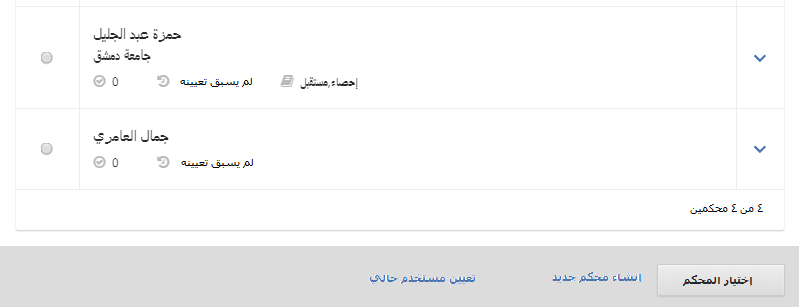

لأغراض هذا العرض، سنقوم باختيار حمزة عبد الجليل كمحكم، ومن ثم النقر على زر **إختيار المحكم**.

هذا سيأتي بنافذة جديدة فيها رسالة إلى المحكم.

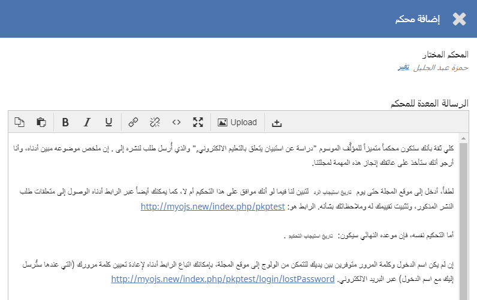

يمكنك تنقيح ما تريده من نصها.

إذا كنت تستعمل طريقة التحكيم السري، تأكد أولاً بأن الملفات التي سترسلها إلى المحكم منزوعة من أي معلومات تشير إلى هوية المؤلف.

عند أسفل النموذج، ستشاهد التفاصيل الأخرى التي ستذهب إلى المحكم، بضمنها العنوان، الملخص، التواريخ الهامة، مع رابط إلى الملفات المطلوب تحكيمها.

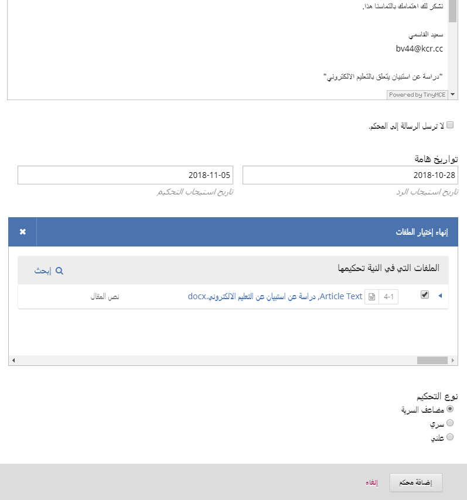

إفتراضياً، سيتم تجهيز المحكمين بمربع نص موسع ليقدموا فيه ملاحظاتهم. مع ذلك، يمكن لمدير التحرير إنشاء نماذج ضمن [**إعدادات المخطط الانسيابي،  التحكيم**](./journal-setup.md#التحكيم) لمطالبة المحكم بالإجابة على أسئلة أكثر تحديداً. إذا أردت من المحكم إملاء نموذج تحكيم، إختره من **نموذج التحكيم**.

أنقر زر **إضافة المحكم** لإرسال الرسالة وتعيين المحكم.

عوداً إلى مرحلة التحكيم، يمكننا مشاهدة أن المحكم قد تم إدراجه في القائمة.

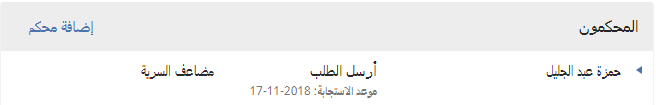

يمكنك إجراء المزيد من التعديلات مستعملاً الزر الأزرق المجاور لاسم المحكم.

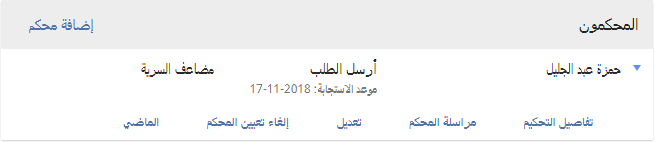

**تفاصيل التحكيم**: تقدم تفاصيلاً عن عملية التحكيم.

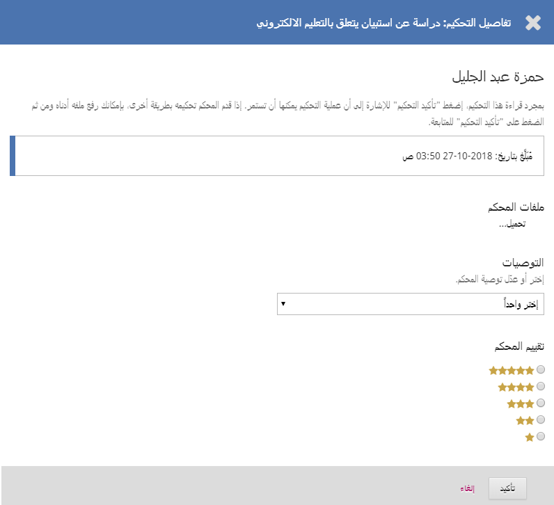

**مراسلة المحكم**: تسمح لك بإرسال رسالة إلى المحكم.

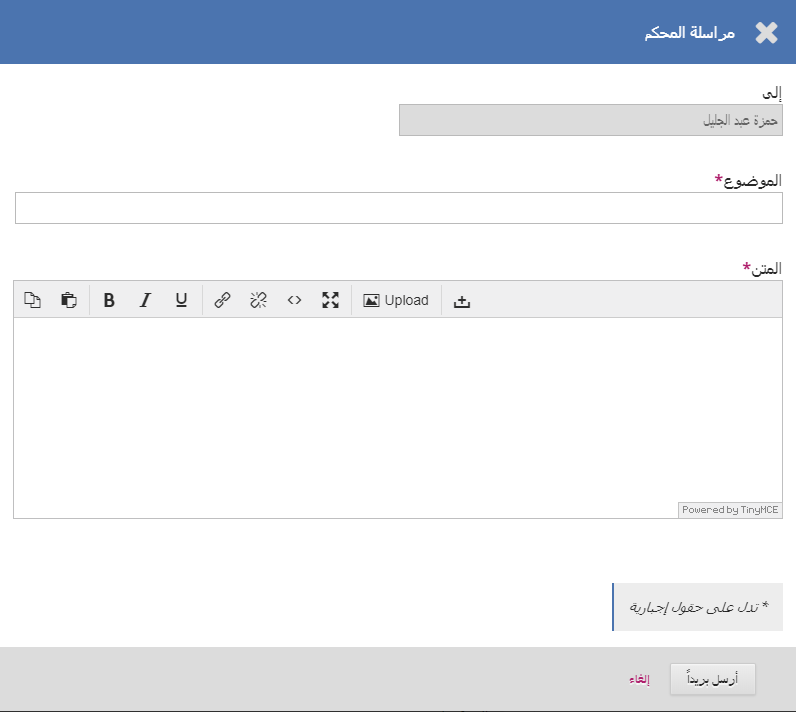

**تعديل التحكيم**: تسمح لك بتعديل تواريخ التحكيم وملفاته.

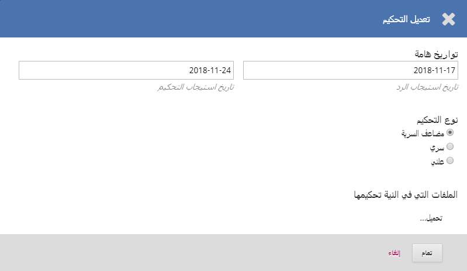

**إزالة المحكم**: تسمح لك بإلغاء تعيين المحكم.

**الماضي**: تقدم سرداً تأريخياً لسيرة التحكيم.

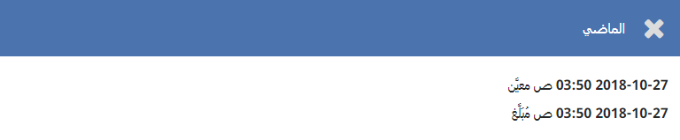

في هذا الوقت، يمكننا تعيين المزيد من المحكمين، ومن ثم انتظار توصياتهم.

### الاستجابة إلى التحكيمات

بمجرد إكمال المحكمين لأعمالهم، يمكن لمحرر القسم معاينة النتائج في لوحة القيادة. هناك ستظهر إشعارات بورود التحكيمات وما إذا كانت قد وردت جميعاً.

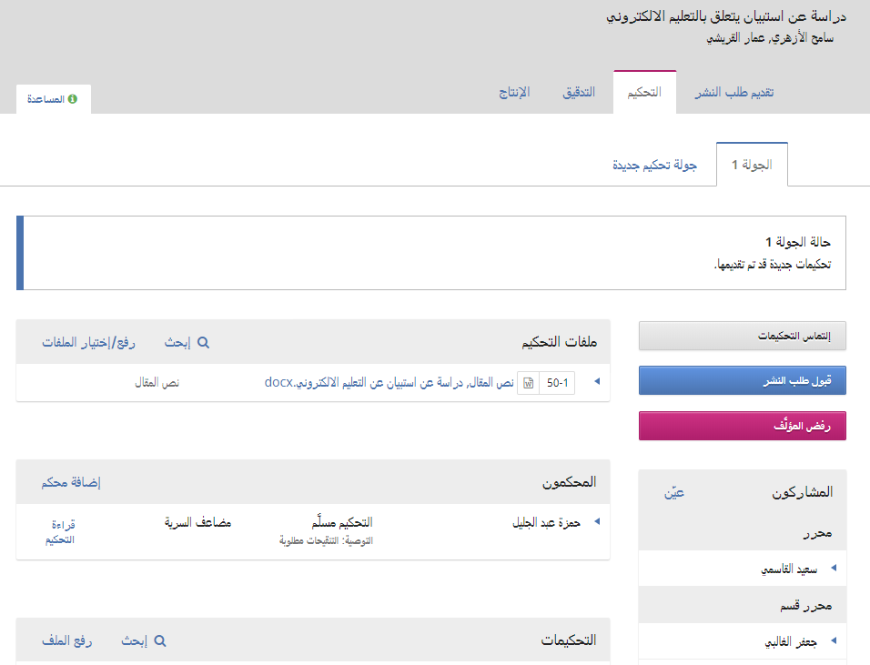

إستعمل رابط _قراءة التحكيم_ في لوحة المحكمين لقراءة تعليقاتهم، بضمنها ما كانت معنونة إلى المحرر والمؤلف أو المعنونة إلى المحرر فقط

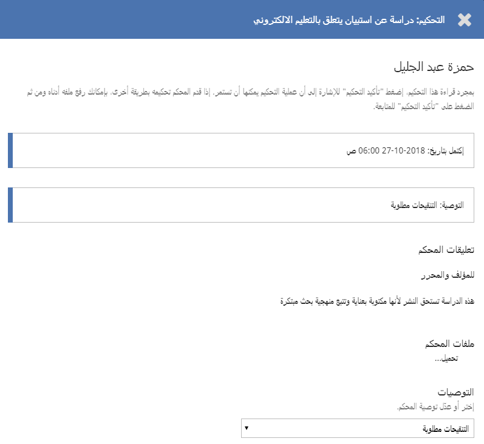

إختر رابط _التأكيد_ عند أسفل الشاشة.

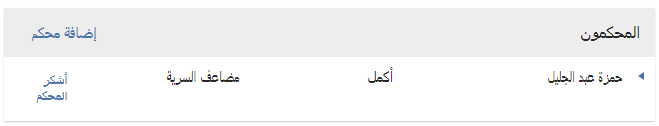

عند لوحة المحكمين، يمكنك الآن معاينة رابط _شكر المحكم_. إختره لتقديم الشكر والعرفان للمحكم.

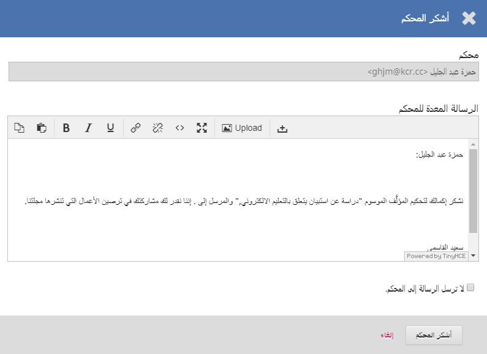

أنقر زر **شكر المحكم** لإرسال رسالة الشكر.

### اتخاذ القرار

استناداً إلى توصيات المحكمين، يمكنك استعمال أزرار الإجراءات لاتخاذ القرار المناسب.

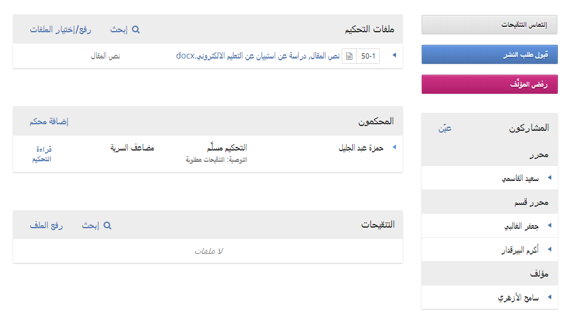

الخيارات تتضمن:

**إلتماس التنقيحات**: هذا يعني مطالبة المؤلف بإجراء تعديلات طفيفة، دون الحاجة إلى معاودة التحكيم السري.

**إعادة التقديم للتحكيم**: هذا يعني مطالبة المؤلف بتعديلات رئيسية مع الحاجة إلى تمرير العمل مجدداً إلى دورة تحكيم أخرى.

**الإرسال إلى التدقيق**: معناه قبول العمل بشكله الحالي وأن بإمكانه الانتقال إلى مرحلة التدقيق.

**رفض طلب التقديم**: هذا معناه أن طلب التقديم فشل في عبور مرحلة التحكيم وأنه غير مناسب للنظر فيه مجدداً. طلب التقديم سينتقل تلقائياً إلى قائمة المحفوظات.

### إلتماس التنقيحات

في عرضنا هذا، سنقوم بمطالبة المؤلف بإجراء تعديلات طفيفة قبل الموافقة على عمله.

للقيام بذلك، إختر زر **إلتماس التنقيحات**. هذا سيفتح نافذة رسالة جديدة.

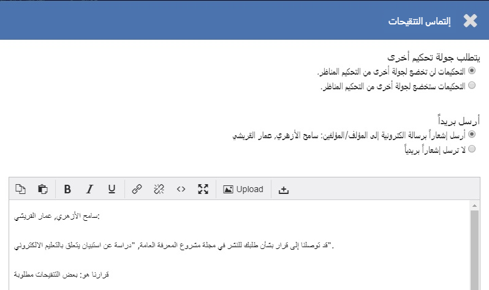

يمكنك تعديل ما تريده في النص قبل إرسال الرسالة.

إستعمل زر **إضافة التحكيمات** لاستيراد تعليقات المحكم الموجهة إلى المحرر والمؤلف. التعليقات المعنونة إلى المحرر حصراً لن يتم استيرادها هنا.

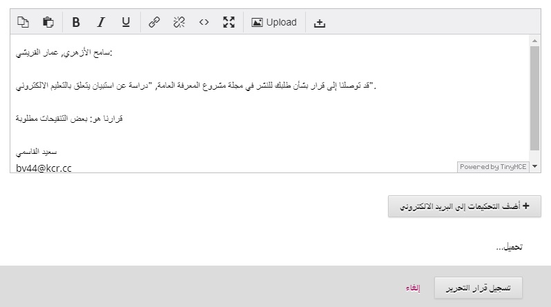

إذا كانت هناك أي مرفقات، مثل الملفات المعلمة والمقدمة من قبل المحكم، يمكنك إرفاقها هنا أيضاً \(طالما أنها منزوعة من البيانات الشخصية\).

أنقر زر **تسجيل قرار التحرير** لإرسال الرسالة.

لا بد لك الآن من انتظار ما سيأتي من المؤلف كرد.

### إجابة المؤلف

بمجرد قيام المؤلف بالتنقيحات، لا بد أن تتلقى منه رسالة \(عبر البريد الالكتروني، وتظهر لك في لوحة القيادة أيضاً\).

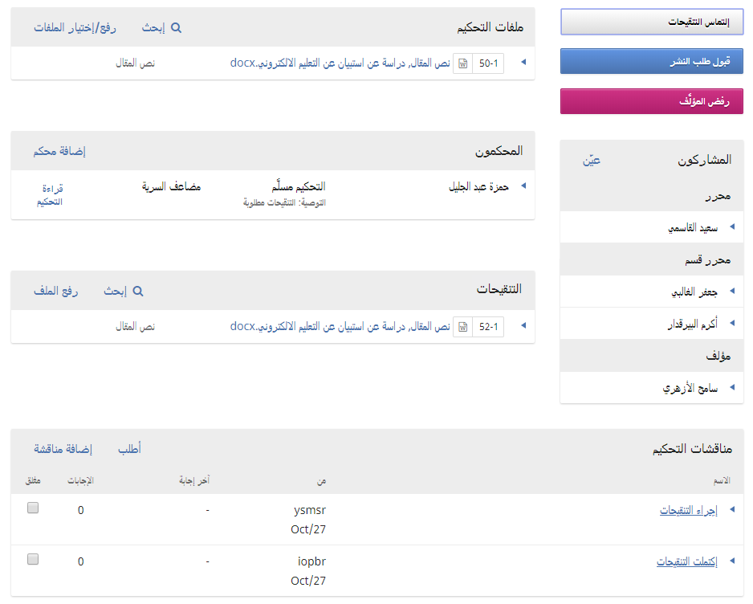

ستشاهد الملف المنقح أيضاً في لوحة التنقيحات.

عندها، يمكنك تنزيل الملف المعدل، التحقق من كونه صار جاهزاً، والتواصل مع المؤلف عبر لوحة مناقشات التحكيم.

في مثالنا الحالي، سنقوم بإبلاغ المؤلف بقبولنا لعمله. للقيام بذلك، أنقر على عنوان المناقشة. هذا سيفتح نافذة المراسلة.

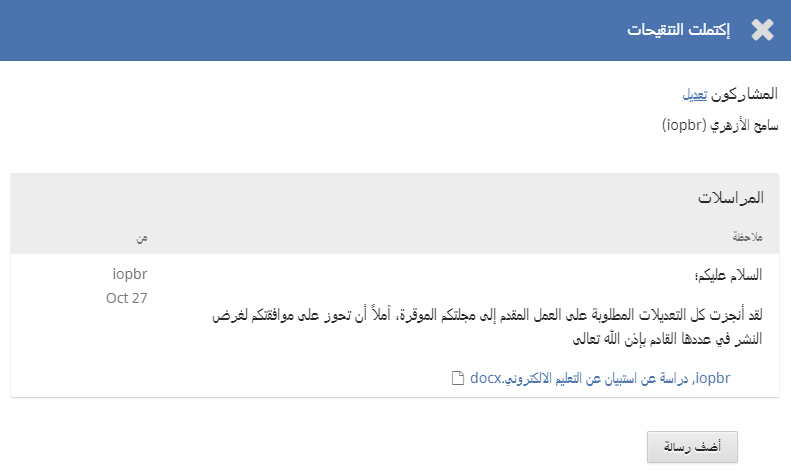

إستعمل زر **إضافة رسالة** للرد.

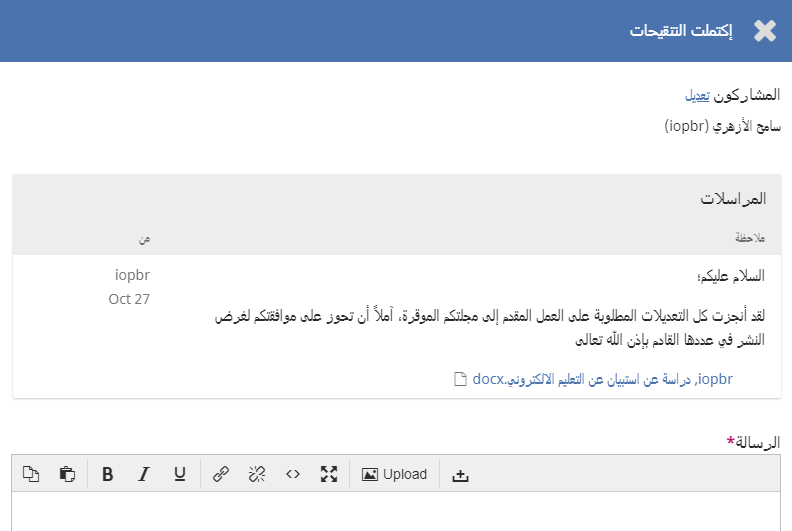

لديك خيار آخر يتمثل بالمطالبة بالمزيد من التنقيحات، ولكننا حالياً جاهزون للمتابعة.

### الانتقال إلى مرحلة التدقيق

طلب التقديم جاهز حالياً لينتقل إلى التدقيق. للقيام بذلك، إستعمل زر **قبول طلب النشر** الأزرق.

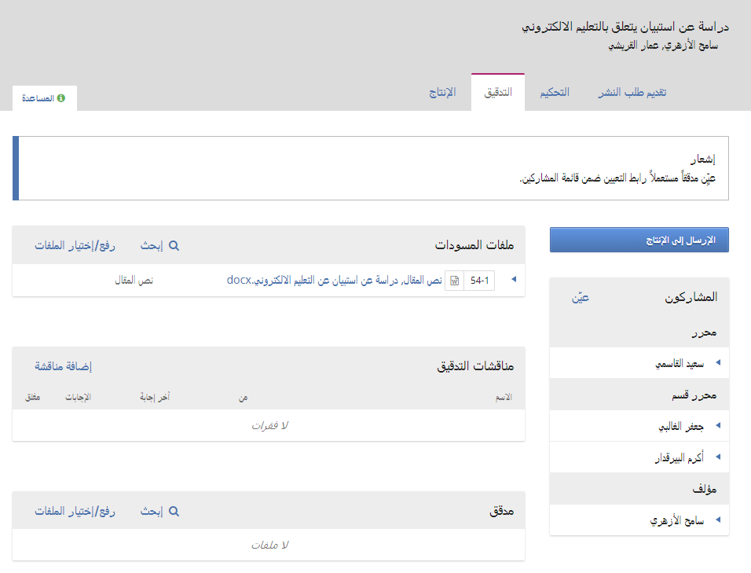

هذا سيفتح نافذة جديدة.

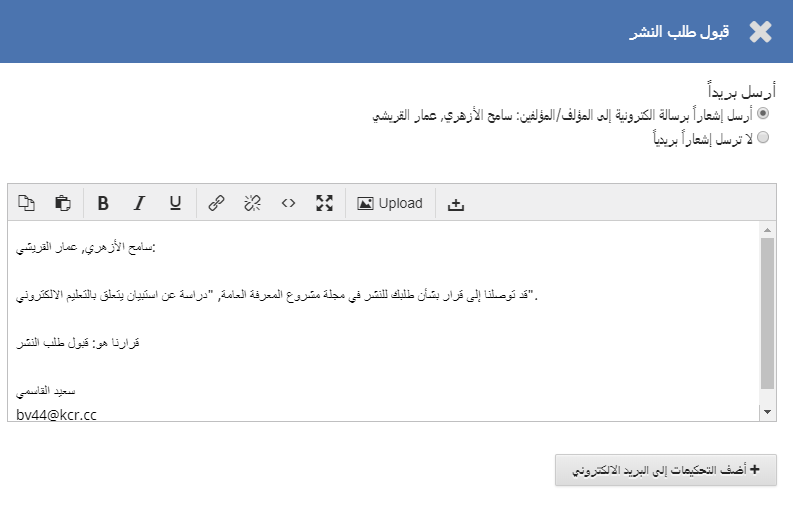

أنقر زر **تسجيل قرار التحرير** عند أسفل النافذة.

طلب التقديم سينتقل تلقائياً إلى مرحلة التدقيق.

## التدقيق

عندما يجتاز طلب التقديم مرحلة التحكيم، سينتقل إلى مرحلة التدقيق.

### إضافة المدقق

عندما يدخل طلب التقديم إلى مرحلة التدقيق، سيظهر إشعار بضرورة تعيين المدقق. يمكن تعيين أي من هؤلاء عبر رابط *التعيين* في لوحة المشاركين.

هذا سيفتح نافذة جديدة.

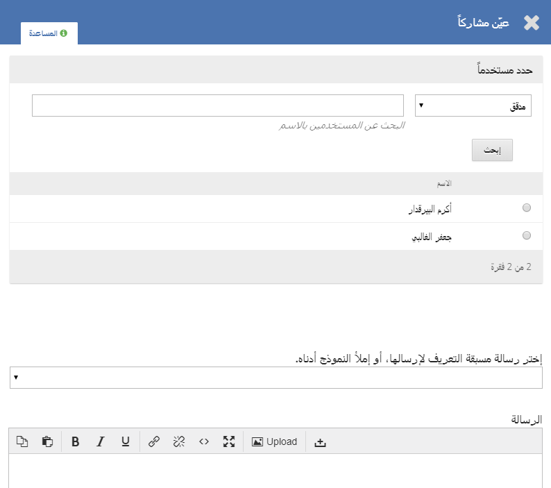

يمكنك استعمال قائمة الأدوار المنسدلة واختيار مدقق، والنقر على زر **بحث**. هذا سيعرض قائمة بكل المدققين المتاحين.

إختر أحدهم ليتولى العمل على طلب التقديم.

إختر رسالة محضرة.

قم بأي تعديلات تريدها على الرسالة.

أنقر **إرسال**.

يمكنك الآن معاينة الإشعار الجديد بأن طلب التقديم ينتظر التدقيق، وأن المدقق قد ظهر اسمه ضمن قائمة المشاركين. إلتماس التدقيق صار ظاهراً ضمن مناقشات التدقيق.

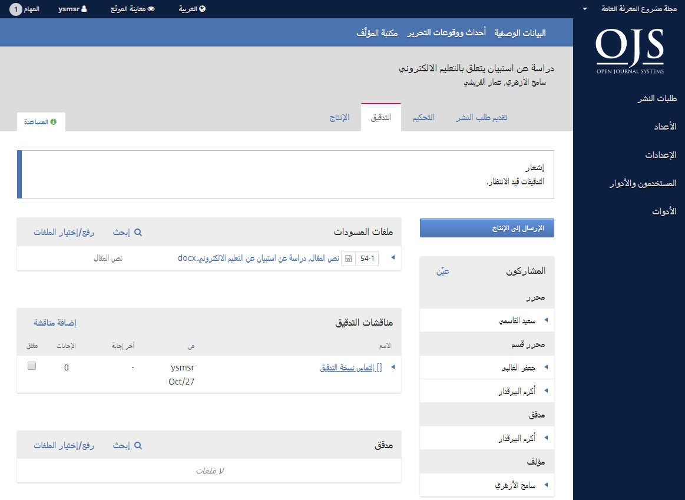

يمكنك الآن انتظار قيام المدقق بعمله.

### المدقق

سيتلقى المدقق رسالة الكترونية من محرر القسم تتضمن إلتماساً بتدقيق العمل المقدم إلى المجلة.

للشروع في ذلك، عليه تسجيل دخوله إلى الموقع والوصول إلى طلب التقديم عبر لوحة القيادة.

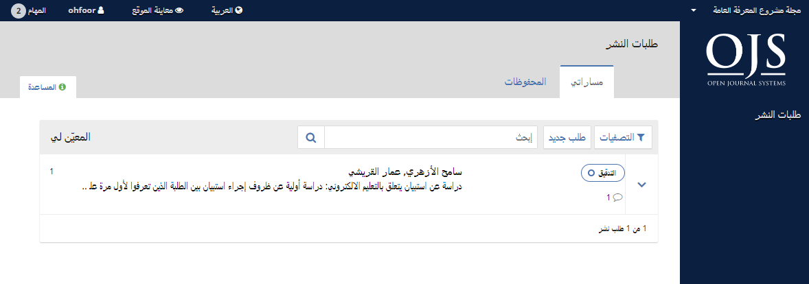

عندها، يمكن النقر على رابط التدقيق المجاور لعنوان طلب التقديم. هذا سيأخذه مباشرة إلى مرحلة التدقيق الخاصة به.

من هنا، يمكنه معاينة الملفات التي تتطلب التدقيق. النقر على العنوان سيؤدي إلى تنزيل الملف إلى حاسبته.

خارج نظام المجلات المفتوحة، سيقوم المدقق بمهمته.

للتحقق من البيانات الوصفية لطلب التقديم، إستعمل رابط البيانات الوصفية عند الشريط الأزرق في الأعلى.

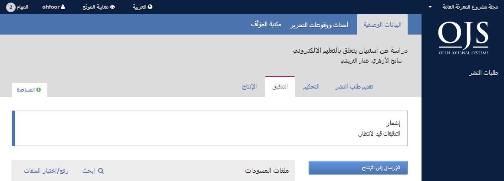

هذا سيتضمن تدقيق عنوان المؤلَّف، الملخص، أسماء المؤلفين، الكلمات المفتاحية، إلخ.

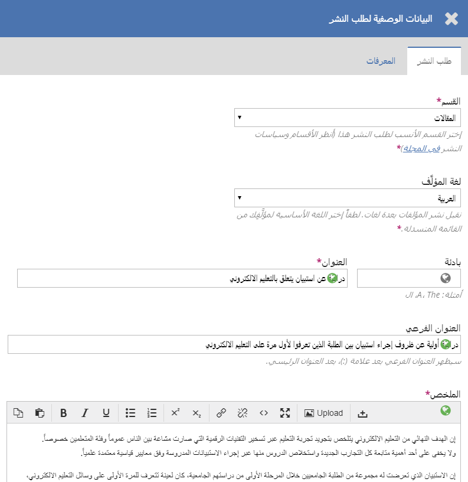

إذا قمت بإجراء أي تعديلات، أنقر زر **حفظ** قبل الخروج من هذه النافذة.

#### استشارة المؤلف

بمجرد إكمال التدقيق، سيتم تمرير النتائج إلى المؤلف عبر لوحة المناقشة، بالنقر على رابط *إضافة مناقشة*.

من النافذة الناتجة، على المدقق اختيار المؤلف وإضافة سطر الموضوع ثم متن الرسالة.

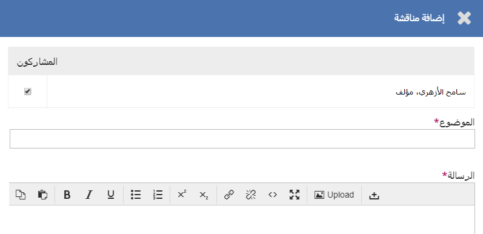

كذلك، وعند أسفل تلك النافذة، على المدقق رفع نسخة من الملف المنجز.

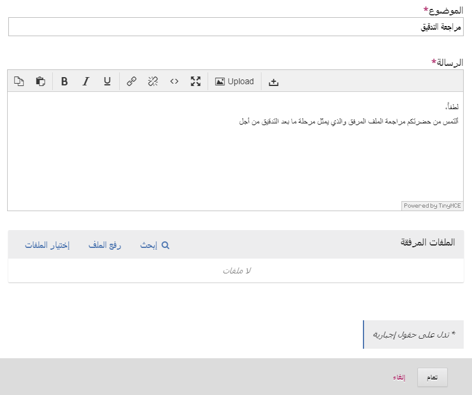

للقيام بذلك، إستعمل رابط *رفع ملف*. هذا سيفتح نافذة جديدة حيث عليك اختيار *مكون المؤلَّف* (مثلاً، نص المقالة) ثم ارفع الملف.

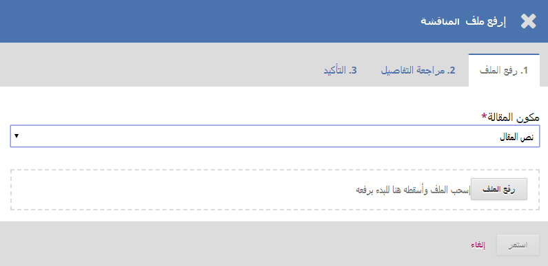

أنقر **إستمر** للمتابعة.

هذا من شأنه فتح الطريق أمام الخطوة الآتية، حيث يمكنك تعديل اسم الملف لو تطلب الأمر.

لاحقاً، يمكنك رفع المزيد من الملفات حسب الضرورة، أو النقر على **أكمل**.

عوداً إلى نافذة الإضافة، يمكنك الآن معاينة الملف المرفق.

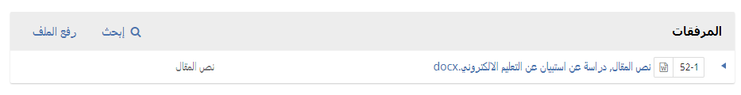

أنقر **تمام** لإرسال الرسالة إلى المؤلف.

هي الآن متاحة ضمن مناقشات التدقيق.

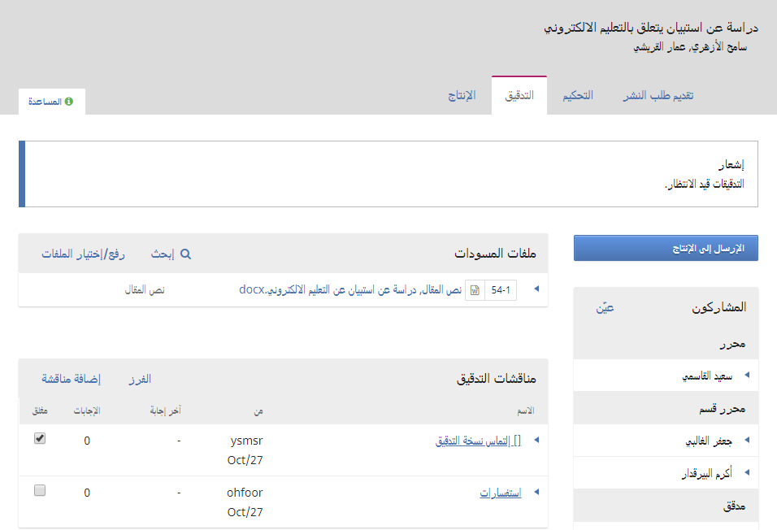

يمكنك الآن أن تنتظر رد المؤلف عليها.

### استجابة المؤلف

بمجرد أن حصلت على إجابة المؤلف، يمكنك مراجعة رأيه عبر التحقق منه في لوحة المناقشات.

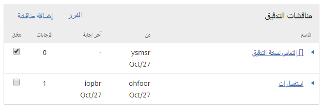

من هنا، يمكنك إدراك أنه لا حاجة إلى مزيد من التعديلات.

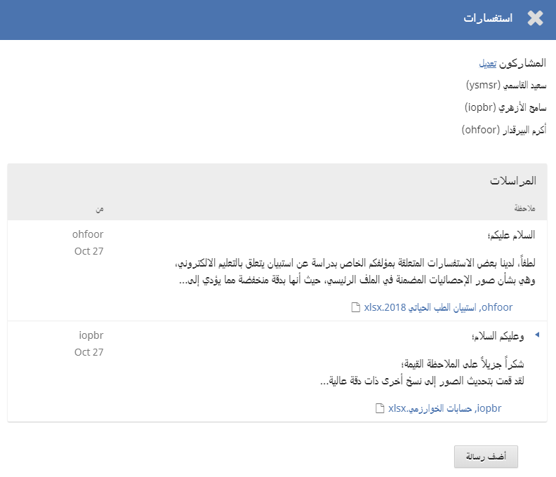

### الملف المدقق النهائي

يمكنك الآن المضي قدماً ورفع النسخة النهائية المدققة إلى لوحة التدقيق، عند نهاية الشاشة.

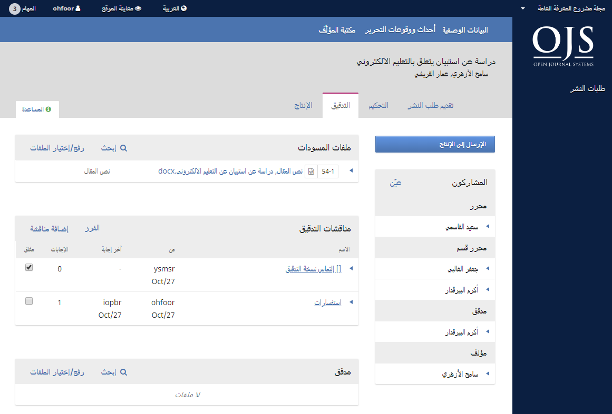

إستعمل رابط رفع/اختيار الملفات لرفع النسخة المدققة النهائية.

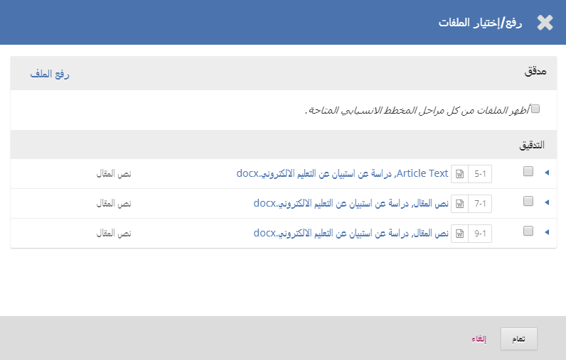

من المهم أن تلاحظ هنا أن لديك بعض الخيارات.

1. يمكنك استعمال رابط رفع الملفات لرفع ملف جديد (مثلاً، ملف فيه بعض التعديلات الأخيرة بعد أن أرسلته إلى المؤلف).
2. يمكنك اختيار نسخة المؤلف الأصلية (غير مرجح).
3. يمكنك اختيار النسخة المدققة، وهي النسخة التي أرسلتها إلى المؤلف (فيما لو لم تقم بأي تعديلات إضافية، إختر هذه).

لأغراض هذا العرض، سنختار النسخة المدققة **عبر تأشير خانة التأشير** المحاذية لذلك الملف.

أنقر **تمام**.

الملف الآن ظاهر في لوحة *المدقق* (قرب نهاية الشاشة)، ما يعني بالنسبة إلى مدير التحرير بأن هذه هي النسخة النهائية، والتي صارت جاهزة لدخول مرحلة الإنتاج.

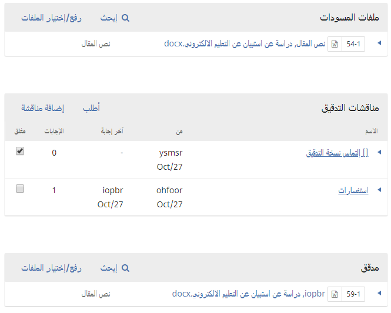

### إبلاغ محرر القسم

الخطوة الأخيرة بالنسبة لك هي إبلاغ محرر القسم بأن عملية التدقيق قد اكتملت.

للقيام بذلك، إبدأ مناقشة جديدة ضمن مناقشات التدقيق عبر استعمال رابط *إضافة مناقشة*.

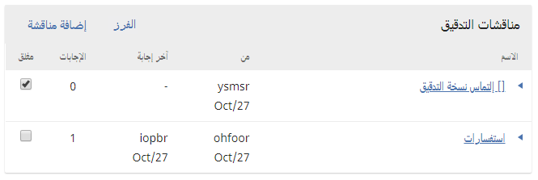

في نافذة المناقشة، أضف محرر القسم، الموضوع، ونص الرسالة.

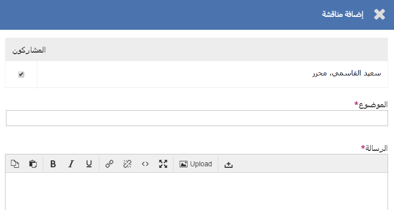

أنقر **تمام** لإرسال الرسالة.

بالعودة إلى مرحلة التدقيق، يمكنك مشاهدة الرسالة وقد ظهرت في اللوحة.

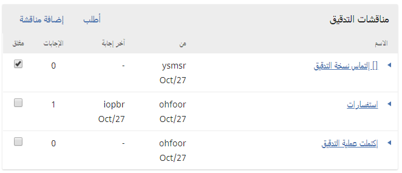

عملك بصفة مدقق قد اكتمل الآن!

### الانتقال إلى الإنتاج

محرر القسم سيتلقى رسالة الكترونية تخبره بأن التدقيق قد اكتمل، كما سيشاهد إشعاراً بذلك في لوحة القيادة.

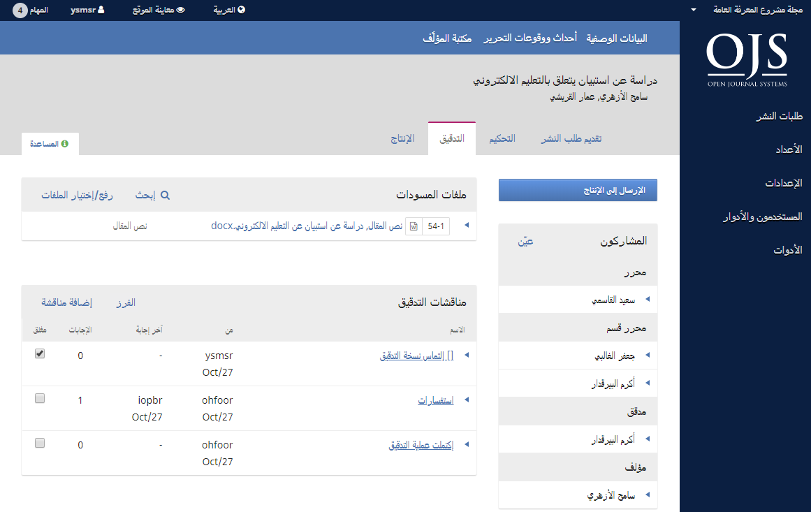

يمكنك تنزيل ومراجعة النسخة المدققة النهائية من لوحة التدقيق.

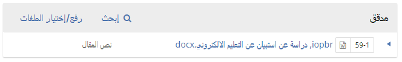

في ذلك الوقت، يمكنك التواصل مع المدقق، أو إذا كنت راضياً، الانتقال إلى مرحلة الإنتاج.

للقيام بذلك، إختر الزر **الإرسال إلى الإنتاج** الأزرق.

هذا من شأنه توليد إشعار رسمي إلى المؤلفين بأن عملهم يتابع مسيرته إلى المرحلة التالية.

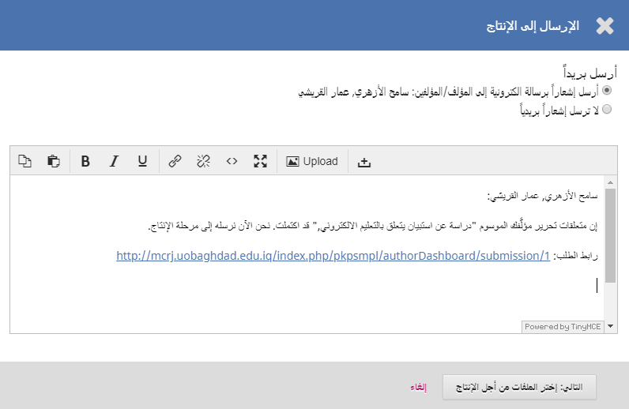

لاحظ بأن الملفات الصحيحة، من لوحة التدقيق، قد جرى تضمينها لتذهب تلقائياً إلى مرحلة الإنتاج.

أنقر **تسجيل قرار التحرير** للمتابعة.

مرحلة التدقيق قد اكتملت الآن.

## الإنتاج

بعد إكمال مرحلة التدقيق، ينتقل طلب التقديم الآن إلى مرحلة الإنتاج. من هنا، الملفات المدققة \(عادة ما تكون بصيغة Microsoft Word\) سيتم تحويلها إلى صيغ قابلة للنشر \(مثل، PDF، HTML\) ثم تخضع للقراءة التصحيحية قبل النشر.

للشروع بالإنتاج، على محرر القسم تسجيل دخوله إلى النظام واختيار طلب التقديم من لوحة القيادة.

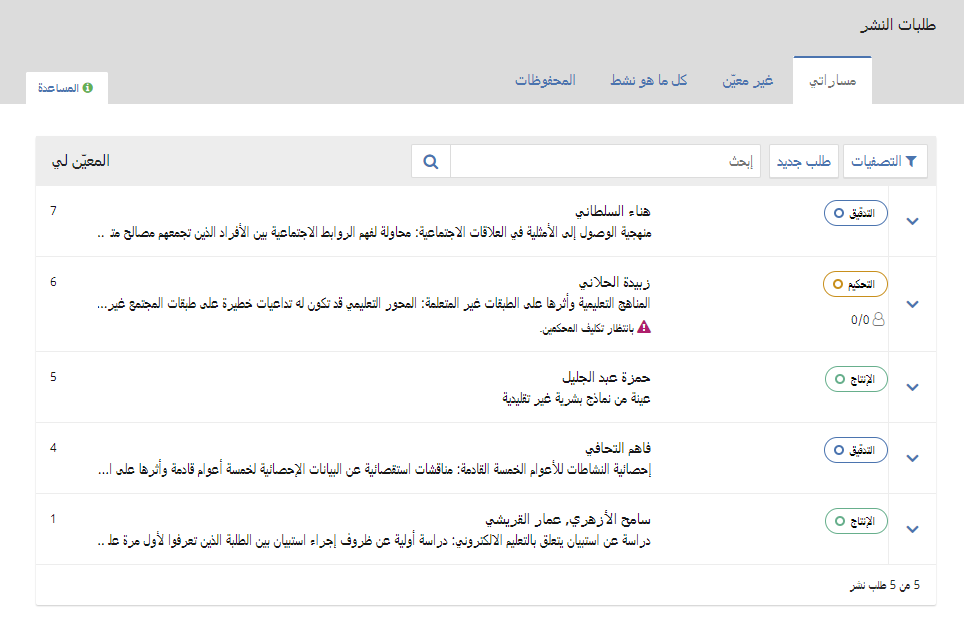

إختيار رابط الإنتاج سيفتح سجل ملف التقديم.

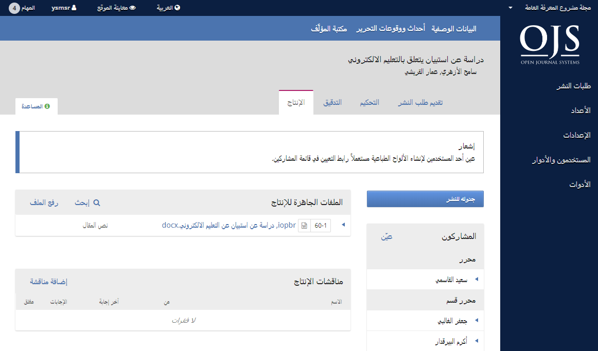

ستشاهد أن الملفات المدققة موجودة في لوحة _الملفات الجاهزة للانتاج_.

شريط الإشعار سيخبرك أيضاً بضرورة قيامك بتعيين أحدهم لإنشاء ملفات الألواح الطباعية \(أي ملفات PDF، HTML، إلخ.\) من تلك الملفات الجاهزة للإنتاج.

هذا الأمر قد يتباين ما بين مجلة وأخرى - قد يكون لديك مصممين طباعيين أو مساعدي إنتاج للقيام بهذا العمل.

لتعيين أحدهم، إستعمل رابط _التعيين_ في قائمة المشاركين. هذا سيفتح نافذة جديدة.

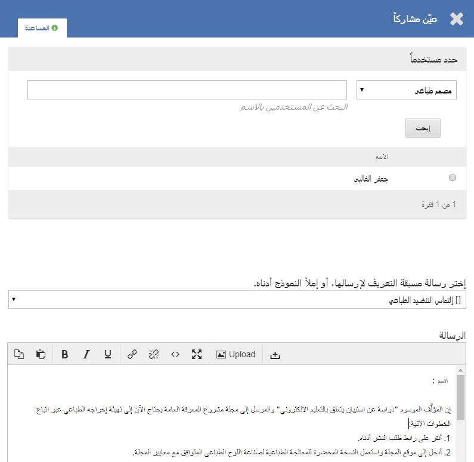

إستعمل منتقِ الأدوار للبحث عن المستخدمين المناسبين، إختر واحداً منهم، إختر الرسالة المحضرة، ثم انقر على زر **تمام** لإرسالها.

المستخدم إياه سيتلقى إشعاراً عبر البريد الالكتروني وعبر لوحة القيادة.

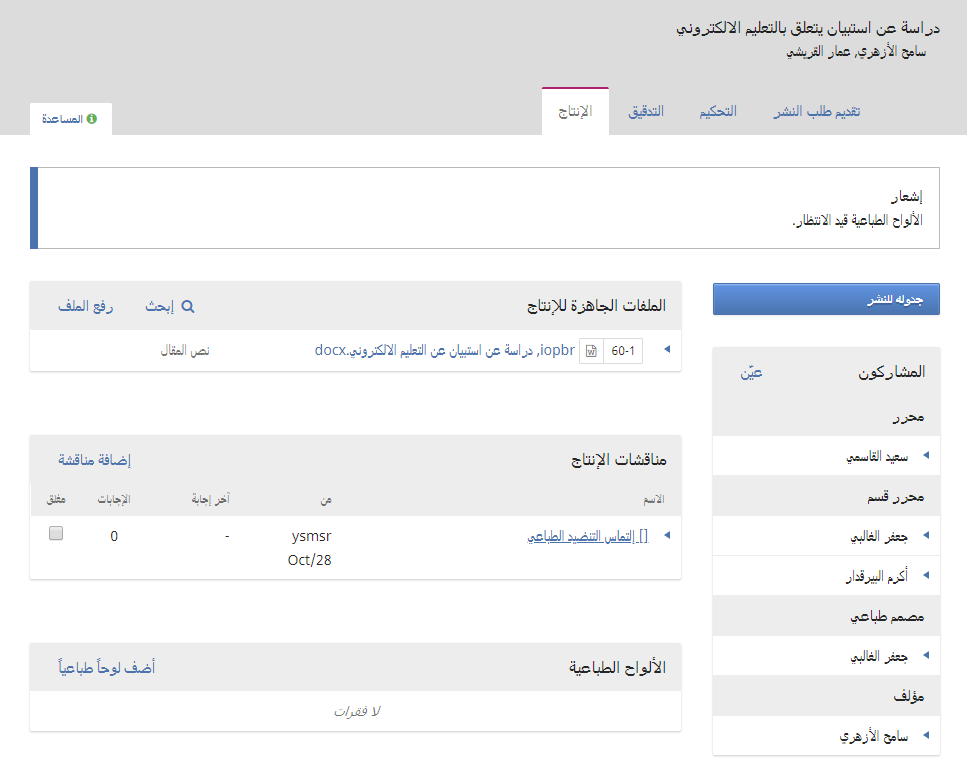

لاحظ بأن هناك إشعاراً بأن طلب التقديم "ينتظر التصميم الطباعي". يمكنك مشاهدة المصمم الطباعي ضمن قائمة المشاركين، وكذلك الالتماس الموجه إليه في لوحة مناقشات الإنتاج.

يمكنك الآن انتظار المصمم الطباعي ليكمل عمله.

### التصميم الطباعي

بصفتك المصمم الطباعي، ستتلقى رسالة تدعوك إلى المساهمة عبر إنشاء الألواح الطباعية لهذا العمل.

للبدء، سجل دخولك إلى النظام واذهب إلى لوحة القيادة.

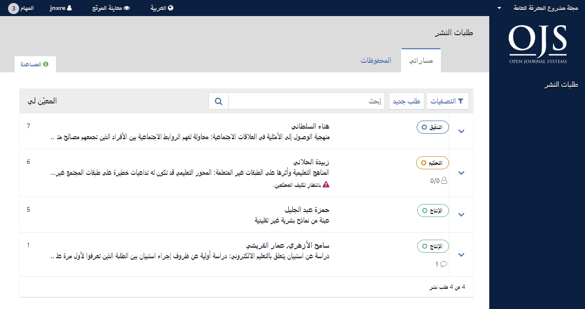

من هنا، إبحث عن طلب التقديم واختر رابط الإنتاج.

هذا سيأخذك إلى سجل طلب التقديم.

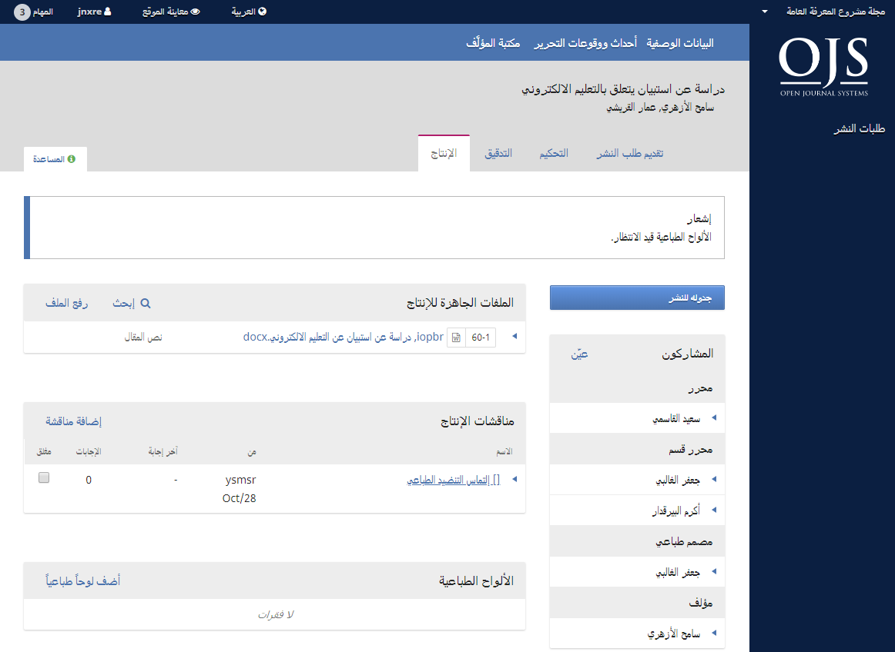

من لوحة الملفات الجاهزة للإنتاج، قم بتنزيل الملفات إلى حاسبتك لتعمل عليها خارج نظام المجلات المفتوحة من أجل تحويلها إلى الصيغ الملائمة للنشر في المجلة \(مثلاً، HTML، PDF، إلخ.\).

> ملاحظة: مشروع المعرفة العامة يعمل حالياً على إنشاء برمجيات من شأنها أتمتة تحويل ملفات Microsoft Word إلى صيغ أخرى، بضمنها XML، HTML، PDF، EPUB، إلخ. ترقب التحديثات لاحقاً.

### اتخاذ القرار بشأن صيغ ملفات المقال

المجلات التي تنشر عبر الإنترنت هذه الأيام تقدم مقالاتها بصيغ متعددة. أكثرها شهرة هي صيغ PDF و HTML، ولكن صيغ أخرى يجري استعمالها بشكل متزايد، مثل ePub، MP3، و XML.

أغلب طلبات تقديم المؤلفين تأتي بصيغة مستندات Microsoft Word \(.doc أو .docx\)، وتتابع طريقها في المخطط الانسيابي لنظام المجلات المفتوحة \(التحكيم، التنقيح، التدقيق\) بهذه الصيغة. الصيغ الأخرى قد تشمل ملفات النصوص \(.txt\)، صيغة rich text \(.rtf\)، أو ملفات Open Office \(.odt\). كل تلك الصيغ غير مناسبة للنشر النهائي، ومن أجل ذلك تأتي ضرورة تحويلها إلى صيغ ملائمة للقراءة.

#### العمل بالقوالب

يستدعي ذلك أن تكون كل طلبات التقديم مستعملة لقالب محضر سلفاً يحاكي تنسيقات النشر في المجلة \(أي، نوع الخط، حجم الخط، التضخيم، التموضع، إلخ. مسافات الرأس والتذييل، المتن، إلخ.\) فإن ذلك سيجعل مهمة تحويل المستندات أسهل بكثير.

شركة Microsoft توفر شرحاً وافياً عن كيفية صناعة القوالب [هنا](https://support.office.com/en-us/article/create-a-template-86a1d089-5ae2-4d53-9042-1191bce57deb).

بمجرد صناعتك للقالب المحاكي لأنماط إخراج مجلتك، عليك وضع رابط له ضمن صفحة دليل المؤلف جنباً إلى جنب توضيح مقنع عن أسباب استعماله. هذا من شأنه أن يضمن أن كل التقديمات الموجهة إلى مجلتك ستكون مسبقة التنسيق، مما يوفر على المصمم الطباعي الكثير من الوقت والجهد.

إليك نموذج من مجلة تعمل بنظام المجلات المفتوحة تلزم مؤلفيها بتنزيل القالب واستعماله: [Paideusis](https://journals.sfu.ca/pie/index.php/pie#authorGuidelines).

نموذجياً، لا بد لقالبك من استعمال الأنماط بدلاً من التنسيق المباشر. هذا لا يضمن التكاملية على امتداد الملف فحسب، بل هو سيساعد عند التحويل إلى الصيغ الأخرى أيضاً \(مثل HTML\). إليك [توضيحاً عن الفرق ما بين الأنماط والتنسيق المباشر في ملفات Word](https://support.office.com/en-us/article/Style-basics-in-Word-d382f84d-5c38-4444-98a5-9cbb6ede1ba4?CorrelationId=1b00844c-a9dc-4d62-98df-a966f30d4b20&ui=en-US&rs=en-US&ad=US&ocmsassetID=HA010230882).

#### إنشاء ملفات PDF

إن صيغة ملف PDF هي أسهل صيغة يمكن إنشاؤها من مستند Word. النسخ الحالية من Microsoft Word \(وغيره من معالجات النصوص\) تسمح لك ببساطة أن تحفظ الملف بصيغة PDF عبر استعمال "الحفظ باسم". الغالبية العظمى من المجلات العاملة بنظام المجلات المفتوحة تنشر مقالاتها بصيغة PDF.

صيغة PDF شائعة أيضاً مع العديد من برامج القراءة، حيث أنها غالباً ما تقوم بإعادة إنشاء الصفحة الطباعية. مع ذلك، فإن صيغة PDF عادة ما تكون غير مرنة في الأجهزة المحمولة ولا تدعم أحياناً الروابط أو الوسائط المضمنة \(كملفات الأفلام والصوتيات\) بشكل جيد. مع التصاعد المستمر في أهمية الأجهزة المحمولة، فإن إيجاد ضمانات لتحسين تعاطي جمهورك الذي يستعمل الأجهزة المحمولة مع المحتوى الذي تنشره أمر تزداد أهميته حالياً.

مثال \(أنظر رابط PDF عند نهاية الصفحة\): [Irish Journal of Technology Enhanced Learning](http://www.journal.ilta.ie/index.php/telji/article/view/22/51)

#### إنشاء ملفات HTML

ملفات HTML لديها ميزة المرونة. هي تتعاطى مع الروابط ومتعددات الوسائط بشكل جيد، ويمكنها ملائمة أي شاشة عرض تقريباً - بضمنها الهواتف الذكية واللوحيات. مع ذلك، هي تبدو مختلفة عن الصفحة المطبوعة، لذلك فإن بعض القراء لا زالوا يفضلون صيغة PDF. الوضع النموذجي هو في توفير كل من الصيغتين من أجل تلبية أفضل لحاجات المستخدمين.

لقد تبين لنا من المقطع السابق بإن إنشاء ملفات PDF من ملف Word أمر يسير. مع الأسف، إنشاء ملفات HTML قد يكون مهمة تتطلب وقتاً أكبر. معالجات النصوص لا تتضمن الأدوات الفاعلة من أجل "الحفظ باسم" HTML. يحاول Microsoft Word القيام بذلك، لكن النتائج غير ملائمة للاستعمال من قبل نظام المجلات المفتوحة. عوضاً عن ذلك، حاول اتباع الخطوات الآتية:

1. حول مستند Word. يمكنك استعمال هذه [الأداة المجانية](https://word2cleanhtml.com/) لإجراء تحويل أولي.
2. إفتح ملفات HTML الناتجة بمعالج نصوص \(مثل، NotePad في Windows\) أو محرر HTML \(مثل، Adobe Dreamweaver\). من هنا، ستكون بحاجة إلى إجراء تنقية نهائية أو تنسيقات. الأمر يتطلب دراية بأساسيات لغة HTML. هذا ليس صعباً، وهناك العديد من [الدروس التكميلية](https://www.w3schools.com/html/)، ولكن الأمر يستغرق وقتاً.
3. أبق على تنسيقات HTML بشكلها المبسط. ليكن تركيزك على الفقرات، فواصل الأسطر، العناوين، والروابط. لا تقلق بشأن الخطوط، الألوان، أو غيرها من عناصر التنسيق - نظام المجلات المفتوحة سيقوم بمعالجة ذلك تلقائياً كجزء من التصميم العام لمحتوى المجلة.
4. إرفع الملف إلى نظام المجلات المفتوحة بمثابة لوح طباعي بصيغة HTML.

مثال \(أنظر رابط HTML عند نهاية الصفحة\): [Forum Qualitative Sozialforschung](http://www.qualitative-research.net/index.php/fqs/article/view/2577)

#### إنشاء ملفات ePUB

بشكل يشابه ملفات HTML، فإن ملفات ePub نموذجية للأجهزة المحمولة، لكنها تتطلب برمجة متخصصة لإنشائها. أدوات التحويل متوفرة، مثل [Calibre](https://calibre-ebook.com/). المزيد من المعلومات عن كيفية إنشاء ملفات ePub [تتوفر هنا](https://www.wikihow.com/Convert-a-Word-Document-to-Epub).

كما هو الحال مع ملفات HTML، بعض التنظيفات النهائية قد تكون ضرورية بعد التحويل و [تتطلب بعض المعرفة](http://www.jedisaber.com/eBooks/Introduction.shtml) بأساسيات هذه الصيغة من الملفات.

مثال \(أنظر رابط EPUB عند نهاية الصفحة\): [International Review of Research in Open and Distance Learning](http://www.irrodl.org/index.php/irrodl/article/view/2895)

#### إنشاء ملفات صوتية

رغم أن ذلك غير شائع، فإن بعض المجلات تنشر محتوى صوتي لمقالاتها، للسماح للمستخدمين بالاستماع له. هذا مفيد بشكل خاص للمعاقين بصرياً، لكن قد يكون الآخرون مفضلين لذلك وبخاصة لمن يستمع لمحتوى الكتب خلال السفر أو خلال إنجاز أعمالهم اليومية.

إنشاء الملفات الصوتية قد يمكن إنجازه يدوياً عبر الاستعانة بشخص ما مستعد لقراءة المقالات وتسجيل قراءته بمسجل صوتي، أو تلقائياً عبر الاستعانة ببرامج تحويل النصوص إلى أصوات.

مثال \(أنظر رابط MP3 عند نهاية الصفحة\): [International Review of Research in Open and Distance Learning](http://www.irrodl.org/index.php/irrodl/article/view/3279)

#### إنشاء ملفات XML

إنشاء ملفات XML طريقة فعالة جداً للنشر بصيغ متعددة. عندما تُنشئ ملف XML، يمكنك بعدها تلقائياً إنشاء الصيغ PDF، HTML، ePub، وغيرها. إن مشروع المعرفة العامة يقوم بتطوير أداة تحويل ذاتية إلى صيغة XML تسمى [Open Typesetting Stack](https://pkp.sfu.ca/open-typesetting-stack/)، والتي تتوفر حالياً بشكلها التجريبي. يمكنك أيضاً أن تتعلم كيفية إنشاء ملفات XML بنفسك. [دروس ممتازة](https://www.w3schools.com/xml/) تتوفر عبر الإنترنت، لكن عليك استثمار وقت طويل لتكتسب خبرات المحترفين.

مثال \(أنظر رابط XML في أعلى يسار الصفحة\): [Journal of Medical Research and Innovation](https://jmri.org.in/jmri/article/view/e000084)

### الاتصال بالمؤلف

بعدها، قد ترغب بمشاركة ملف PDF مع المؤلف ليأخذ نظرة نهائية عليه ويقر به.

للقيام بذلك، إستعمل رابط _إضافة مناقشة_ في لوحة مناقشات الإنتاج. هذا سيفتح نافذة جديدة.

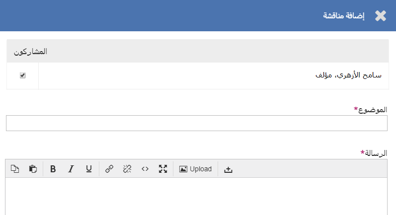

تذكر أن تضيف المؤلف في أعلى النافذة، ومن ثم أضف الموضوع ومتن الرسالة.

بعد الإرسال، لك أن ترفق نسخة من ملف PDF مستعملاً رابط _رفع ملف_. هذا سيجعله متاحاً للمؤلف.

تذكر أن تختار مكون المقالة الصحيح، ومن ثم ارفع ملف PDF.

أنقر **إستمر**.

بعدها، أجر أي تعديلات تريدها على اسم الملف \(غالباً، لا تحتاج إلى القيام بأي شيء هنا\).

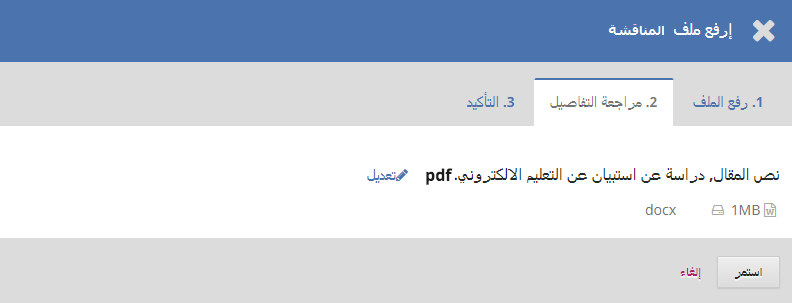

وبعدها، يمكنك رفع ملفات إضافية، إذا لزم الأمر.

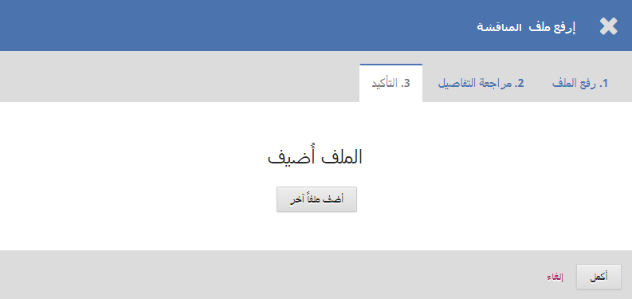

بمجرد إكمالك، أنقر **أكمل**.

الملف الآن مرفق، ويمكنك إرسال الرسالة مستعملاً زر **تمام**.

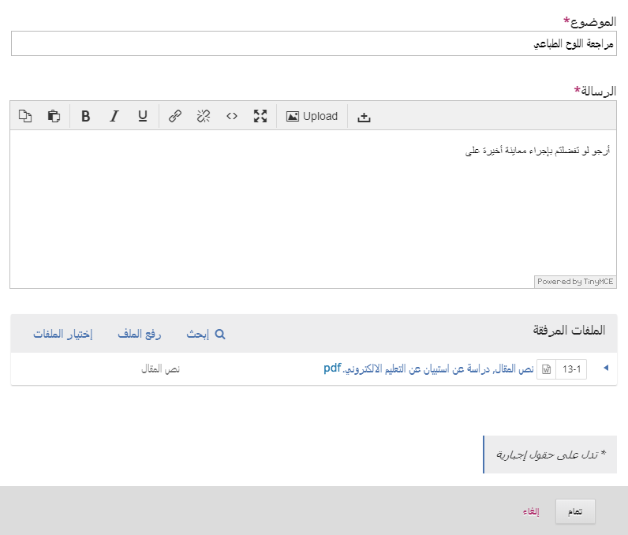

لقد تم الآن إشعار المؤلف ويمكنك انتظار الرد منه.

### استجابة المؤلف

بمجرد أن أتيحت للمؤلف فرصة معاينة الألواح الطباعية وقدم لك رده، ستتلقى رسالة الكترونية كما ستجد إدخالاً لها في لوحة مناقشات الإنتاج.

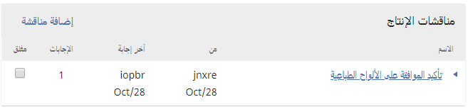

### إضافة الألواح الطباعية

الآن وبعد أن قام المؤلف بالقراءة التصحيحية للألواح الطباعية، يمكنك إجراء أي تعديلات نهائية، ومن ثم رفعها إلى لوحة الألواح الطباعية.

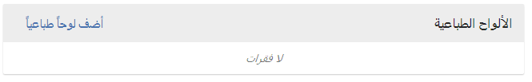

للقيام بذلك، إستعمل رابط _إضافة لوح طباعي_، والذي سيفتح نافذة جديدة.

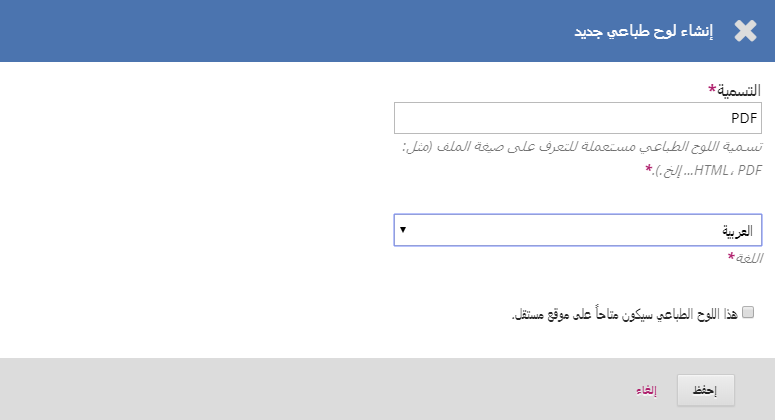

أضف ملصقاً مناسباً \(أي ملفات PDF، HTML، إلخ.\) ثم أنقر **حفظ**.

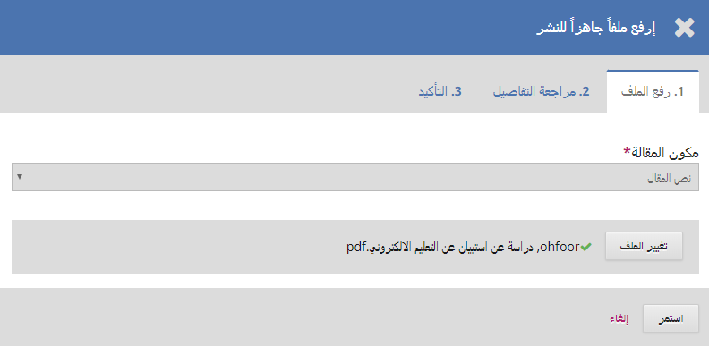

من هذه النافذة، إختر مكون المقالة الصحيح \(مثلاً، نص المقالة\) ومن ثم ارفع ملف اللوح الطباعي. أنقر **إستمر**.

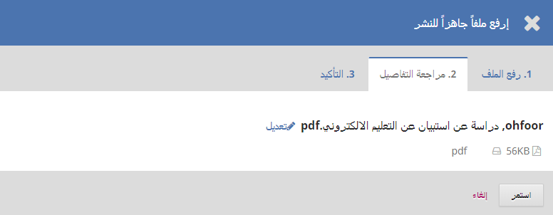

إذا لزم الأمر، غير اسم الملف. أنقر **إستمر**.

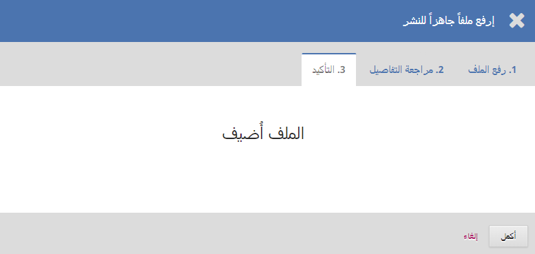

إذا كان لديك المزيد من الملفات، قم برفعها الآن. وإلا، أنقر **تمام**.

يمكنك الآن معاينة الألواح الطباعية في لوحة الألواح الطباعية.

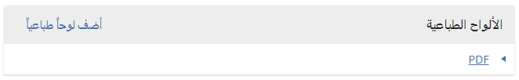

يمكنك إجراء تعديلات على ما قمت برفعه عبر اختيار السهم الأزرق المحاذي لملصق اللوح الطباعي، الذي سيكشف خيارات التعديل، تغيير الملف، والحذف.

### إبلاغ محرر القسم

أخيراً، سيكون عليك إبلاغ محرر القسم بأن الألواح الطباعية قد اكتملت. للقيام بذلك، إستعمل لوحة مناقشات الإنتاج واختر رابط _إضافة مناقشة_.

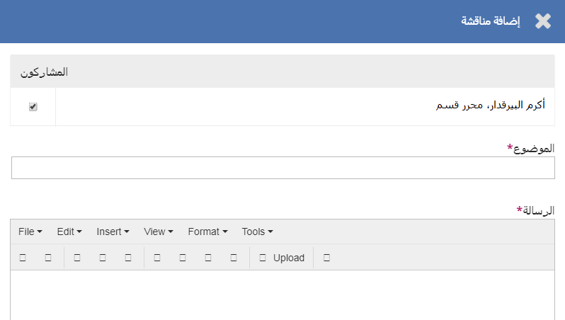

أضف محرر القسم إلى أعلى النافذة، وضع للرسالة موضوعاً ومتناً. أنقر **تمام** لإرسال الرسالة.

يمكنك الآن مشاهدة هذه المناقشة الأخيرة في اللوحة.

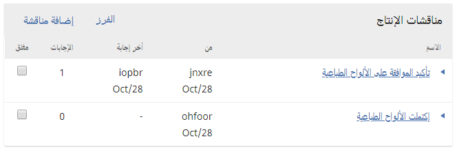

### محرر القسم يبلغ مدير التحرير

في هذا الوقت، محرر القسم يتلقى الإشعار من المصمم الطباعي ويراجع ملفات اللوح الطباعي.

يمكنه إما مطالبة المصمم الطباعي بإجراء المزيد من التعديلات \(مستعملاً مناقشات الإنتاج\) أو إبلاغ مدير التحرير بأن الألواح الطباعية جاهزة للنشر.

لإبلاغ مدير التحرير، إستعمل لوحة مناقشات الإنتاج عبر الرابط _إضافة مناقشة_.

### الجدولة للنشر

عند استلام الإشعار بإكمال الألواح الطباعية، يقوم مدير التحرير بتسجيل دخوله إلى النظام ويبحث عن سجل طلب التقديم، ثم يدقق ملفات الألواح الطباعية.

إذا كانت تبدو جاهزة، يمكن لمدير التحرير النقر على زر الإجراء الأزرق **جدوله للنشر**.

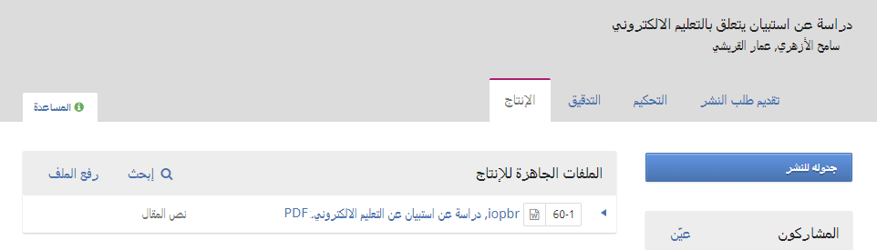

النقر على هذا الزر يفتح نافذة النشر.

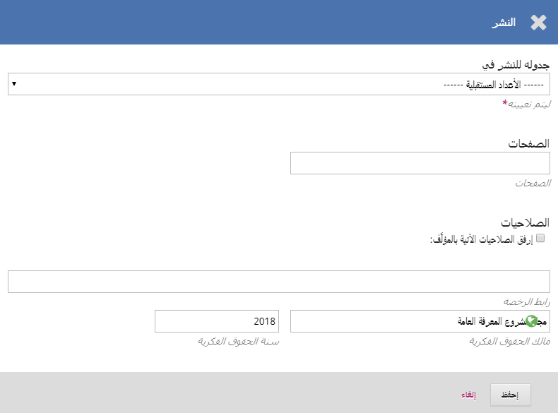

إستعملها لإضافة طلب التقديم إلى أي عدد تريده من أعداد المجلة.

لديك أيضاً خيار إضافة أرقام الصفحات، الصلاحيات، ومعلومات الترخيص.

النقر على **إحفظ** يعني نشر المؤلَّف ضمن العدد المحدد. إذا سبق لهذا العدد وأن تم نشره، فإن المقالة ستكون ظاهرة للقراء بشكل فوري.

تهانينا! لقد وصلت إلى نهاية مجريات عملية التحرير.
