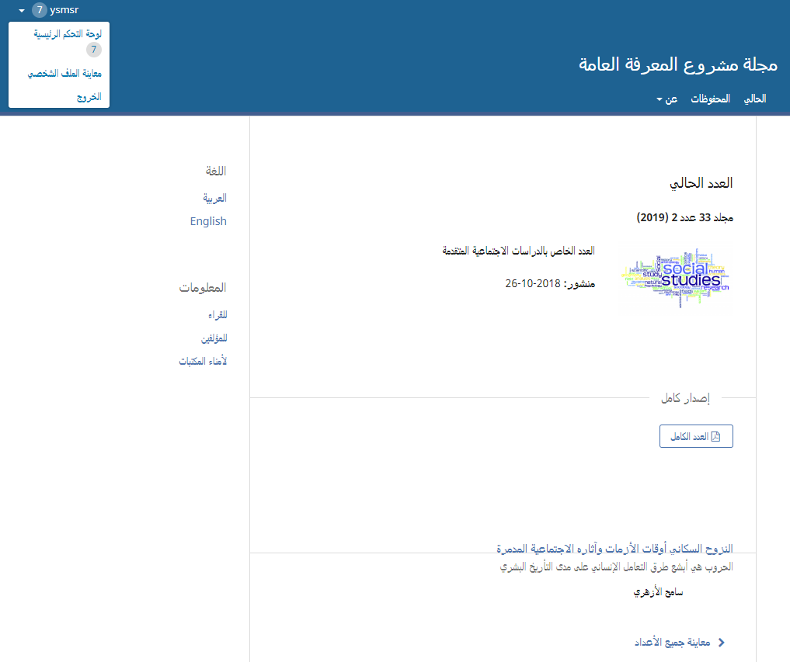
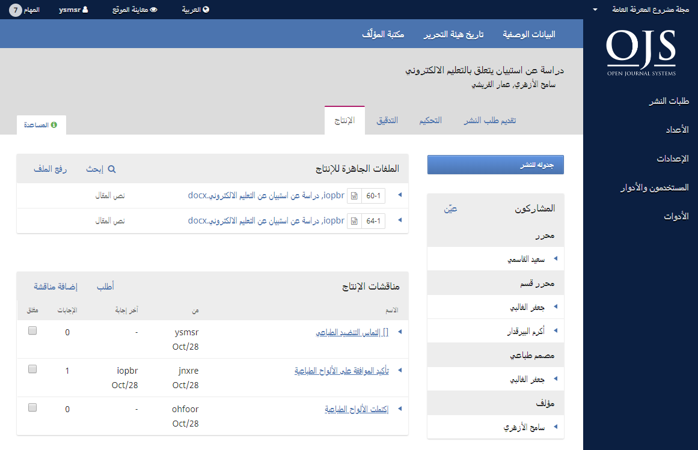

# الفصل 1: المقدمة

نظام المجلات المفتوحة \(OJS\) هو برنامج مفتوح المصدر لإدارة ونشر الإنتاج العلمي على الإنترنت. هذا النظام يمتاز بالمرونة العالية فيما يتعلق بأعمال هيئة التحرير ويمكن تنزيله مجاناً وتنصيبه على ملقم محلي.

لقد تم تصميم النظام لتقليل الوقت والجهد المصاحبين للأعمال المكتبية والإدارية من طرف هيئة التحرير، مع تحسين إمكانيات حفظ السجلات وتعزيز كفاءة عمليات التحرير. إنه يهدف إلى رفع كفاءة ومستوى الناتج العلمي الذي تنشره المجلة عبر عدد من التجديدات، من ضمنها تحسين الخدمات المقدمة للقراء، جعل سياسات المجلة أكثر شفافية، وتحسين الفهرسة.

هذا الكتيب يغطي متعلقات نظام المجلات المفتوحة بنسخته الثالثة، والتي تم إطلاقها في تشرين الأول/أكتوبر 2017، وهذه النسخة تشتمل على تحسينات هائلة قياساً بالنسخ السابقة من النظام. نحن نأمل أن تجدوها ملائمة لمشاريع النشر الخاصة بكم.

## خلفية النظام

*نظام المجلات المفتوحة هو نظام مخصص للإدارة/النشر للمجلات التي تصدر على الإنترنت*. هذا النظام يتكفل بكل جوانب النشر على الإنترنت، بدءً من تأسيس موقع المجلة إلى المهام التشغيلية مثل عملية تقديم طلبات النشر من قبل المؤلفين، التحكيم المناظر، التحرير، النشر، الحفظ، والفهرسة لمحتوى المجلة. يساعد النظام أيضاً في تنظيم جوانب عمل القائمين على تشغيل المجلة، مثل متابعة أعمال المحررين، المحكمين، والمؤلفين، إشعار القراء، مع تقديم العون للجميع حيثما تطلب ذلك.

*نظام المجلات المفتوحة مرن وقابل للتوسع*. تنصيب واحد من نظام المجلات المفتوحة يمكنه أن يدعم تشغيل مجلات عديدة. لكل مجلة رابطها الفريد ومظهرها الخاص. يمكن لمحرر واحد يستعمل نظام المجلات المفتوحة أن يقوم بكل أعباء إدارة المجلة وموقعها، أو أن يتمكن فريق من المحررين الدوليين تتوزع بينهم مهام التحرير المختلفة من تشغيل أقسام متنوعة في المجلة.

*نظام المجلات المفتوحة يدعم مبدأ تعدد طرق الوصول*. هذا النظام لا يهدف إلى المساعدة في نشر المجلة فحسب، بل إلى الاسهام في تقليل نفقات عملية النشر إلى الحد الذي يمكنها فيه من تقديم محتواها العلمي مجاناً إلى القراء وجعل ذلك خياراً مهماً. مبدأ الوصول المفتوح موضح في طيف واسع من المقالات النابعة من هذا المشروع والتي يمكن الحصول عليها مجاناً عبر زيارة Research > Publications في موقع [Public Knowledge Project](https://pkp.sfu.ca/).

*أصل نظام المجلات المفتوحة*. تم إطلاقه لأول مرة عام 2001 كمبادرة بحثية في جامعة British Columbia، بدعم من مجلس العلوم الاجتماعية والبحوث الإنسانية في كندا، مؤسسة Max Bell، منحة Pacific Press، ومؤسسة MacArthur. التطوير المستمر للنظام تتكفل به حالياً مكتبة جامعة Simon Fraser. للمزيد من المعلومات، أنظر [موقع مشروع المعرفة العامة](http://pkp.sfu.ca).

## مزايا نظام المجلات المفتوحة

نظام المجلات المفتوحة يتضمن المزايا الآتية:
1. نظام المجلات المفتوحة يمكن تنصيبه والسيطرة عليه محلياً.
2. المحررون يحددون المتطلبات، الأقسام، عملية التحكيم... إلخ.
3. التقديم عبر الإنترنت، التحكيم السري على الطرفين، مع إدارة المحتوى بالكامل.
4. فهرسة شاملة للمحتوى.
5. واجهة متجاوبة متعددة الأنماط للقراء.
6. إشعارات بريدية للقراء.
7. يدعم رسوم معالجة المؤلفات، الاشتراكات، والدفع عبر الإنترنت.
8. إرشادات متكاملة عبر الإنترنت وحسب سياق العمل.
9. يدعم الظهور بلغات عديدة.

## ما الجديد في الإصدار 3.1

نظام المجلات المفتوحة 3.1 مبني على التعديلات المضافة إلى  نظام المجلات المفتوحة 3، وهو مغاير تماماً لسابقه، نظام المجلات المفتوحة 2. فهو يتضمن تحسينات مع مزايا جديدة تم تطويرها استناداً إلى آراء المجتمع، إختبارات الأداء المكثفة، فضلاً عن إمكانيات برامجيات حديثة التصميم.

## واجهة القارئ

إفتراضياً، نظام المجلات المفتوحة يظهر بعد تنصيبه بواجهة وظائف بسيطة جداً. هي تشتمل على رأس علوي، شريط تنقل، كتل تنقل على اليسار، مع كتلة محتوى رئيسية وسط الصفحة.

الصورة الآتية هي لقطة تمثل استعراضاً لجدول المحتويات في موقع يعمل بنظام المجلات المفتوحة.

يمكن لك أن تشاهد بأن وظائف المستخدم موجودة حالياً في قائمة ملفك الشخصي على الزاوية العليا اليسرى من الشاشة. هذا من شأنه أن يبعد المحتوى القابل للإدارة في نظام المجلات المفتوحة 3.x بعيداً عن أنظار المستخدم الخارجي. معلومات الشريط الجانبي مفصلة بشكل واضح، مع شريط التنقل العلوي حيث توجد قوائم قابلة للطي مخصصة لوظائف مثل "عن". وكما في نظام المجلات المفتوحة 2, لكل مقالة رابط في عنوانها لمعاينة بياناتها الوصفية وملخصها، كما أن الألواح الطباعية حالياً معلمة بوضوح تحت العناوين مع شعارات أكثر وضوحاً.

## واجهة التحرير

_أو ما يعرف بـ "لوحة القيادة"_

نظام المجلات المفتوحة 3.x حالياً لديه واجهة مختلفة بمجرد الدخول إلى نظام التحرير. هذا لا يجعله قادراً على تخصيص واجهة زوار الموقع فحسب، وإنما يمكنه من أن يقدم لمستعملي مجلات مختلفة، انطباعات متمايزة لكل منها.

واجهة التحرير تعرف بأنها **لوحة القيادة** وتتضمن المكونات الآتية:

1. **شريط التنقل العلوي**: على اليمين، ستجد اسم المجلة التي تعمل بها حالياً \(مثلاً، مجلة مشروع المعرفة العامة\). إن كنت مرتبطاً بأكثر من مجلة، ضمن هذا التنصيب من نظام المجلات المفتوحة، بإمكانك استعمال تلك القائمة للتنقل فيما بين المجلات. في الجانب الآخر من هذا الشريط تجد مهامك \(الفقرات التي تتطلب معالجة حالياً\). كذلك، وعلى الجانب الأيسر، يمكنك التبديل ما بين اللغات إذا كانت المجلة مصممة لتظهر بلغات متعددة، معاينة واجهة القراء، أو النقر على اسم دخولك لمعاينة [ملفك الشخصي](./user-accounts.md#معاينة-ملفك-الشخصي-وتعديله) أو حتى تسجيل الخروج.
2. **لوحة القائمة اليمنى**: هذه هي المقاطع الرئيسية في لوحة القيادة، والتي تضم طلبات التقديم، إدارة الأعداد، إدارة الاشتراكات \(إذا كنت تدير مجلة تستعمل الاشتراكات\)، الإعدادات، إدارة المستخدمين والأدوار، والأدوات. المستخدمون الذين لديهم صلاحيات أقل \(مثل المؤلفين، المحكمين، المدققين... إلخ.\) سيعاينون روابط أقل هنا.
3. **شريط التنقل الأزرق**: خيارات القائمة هذه مخصصة لمقاطع مختلفة ضمن المخطط الانسيابي لعملية التحرير. البيانات الوصفية، عمليات التحرير السابقة، ومكتبة طلبات التقديم صارت جميعها جزءً من سجلات التقديمات الظاهرة أدناه.
4. **اللوحة الرئيسية**: في هذه اللوحة ستعاين مساحة العمل الحالي. في الصورة أعلاه، ترى سجلاً لطلب تقديم وصل إلى مرحلة الإنتاج.
5. **القوائم الفرعية للوحة الرئيسية**: ضمن اللوحة الرئيسية، غالباً ما سترى علامات تبويب تتيح لك معاينة معلومات مختلفة عن المحتوى الذي تعمل عليه. في هذا المثال، سجل التقديم مجزأ إلى أربعة مقاطع \(التقديم، التحكيم، التدقيق، الإنتاج\). لاحظ علامة التبويب "المساعدة" على اليسار، والتي تقدم شروحات مساعدة ذات صلة بالصفحة التي أنت فيها حالياً.
6. **اللوحة اليمنى**: من هنا، يمكنك معاينة أزرار الوظائف، مثلاً، الجدولة للنشر. تختلف أزرار الوظائف باختلاف الصفحات. تحت أزرار الوظائف يوجد جدول المساهمين والذي يدرج أسماء الجميع \(ما عدا المحكمين\) ذوي العلاقة بطلب التقديم.

## مساهمات المجتمع

إن فريق عمل نظام المجلات المفتوحة يشجع مساهمات مجتمع المطورين. إذا كنت مهتماً بجعل نظام المجلات المفتوحة أفضل، نحن نرحب بمساهماتك.

أفضل مثال على مساهمات المجتمع يظهر في الطيف الواسع من اللغات التي يزخر بها نظام المجلات المفتوحة، والإضافات المنسوبة إلى أطراف ثالثة والمقدمة إلى [منتدى المجتمع](https://forum.pkp.sfu.ca/) مع صفحة المنتدى المؤرشف.

نحن نرحب أيضاً بإجراء اختبارات التشغيل والإبلاغات عن المشاكل والأخطاء.

## الدعم

يمكن الوصول إلى [منتدى المجتمع](https://forum.pkp.sfu.ca/) و [نظام الإبلاغ عن المشاكل](https://github.com/pkp/pkp-lib/#issues) والمخصص للمشاكل التقنية من [موقع مشروع المعرفة العامة](https://pkp.sfu.ca).

للحصول على إجابات بشأن موقع مجلة معين، مثل متطلبات التقديم، راسل تلك المجلة مباشرة مستعملاً بيانات الاتصال المدرجة ضمن صفحة **عن**.
