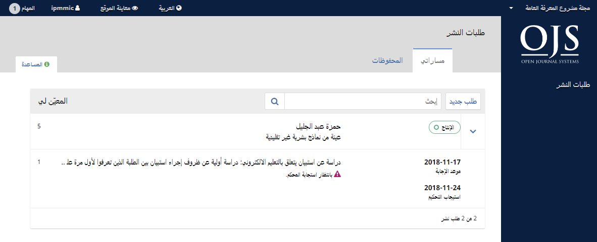
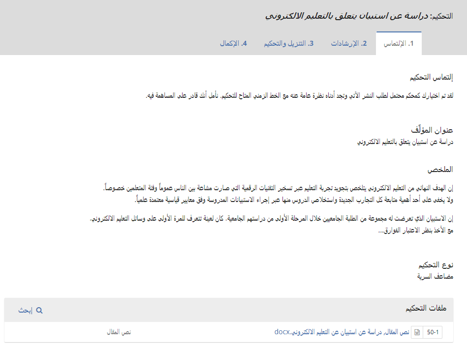
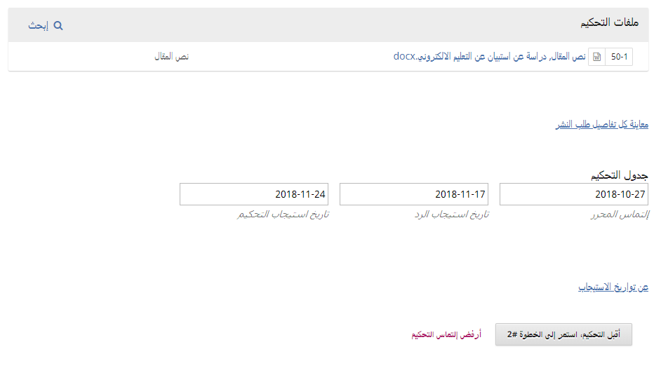
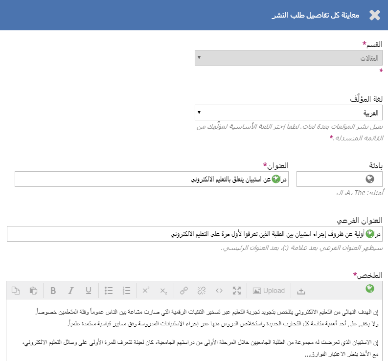
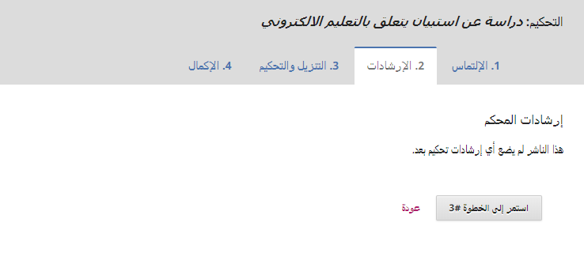
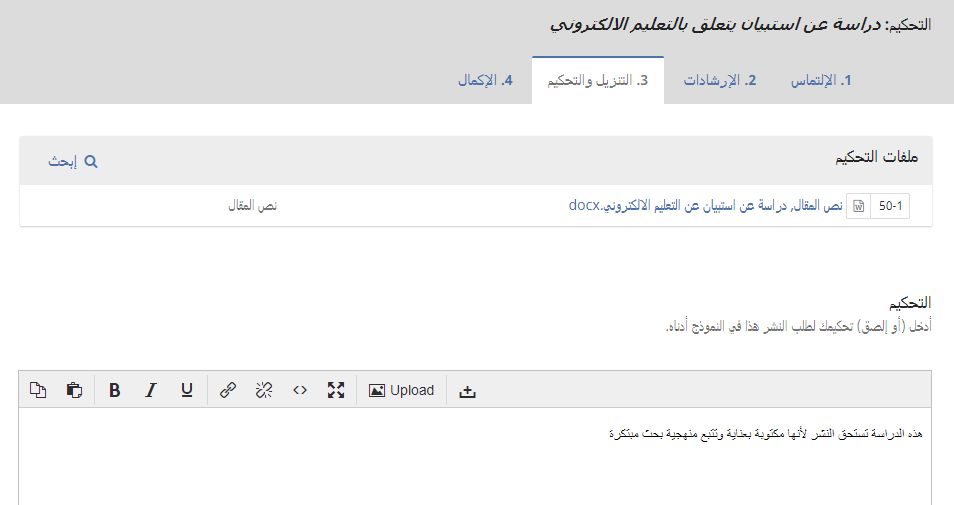
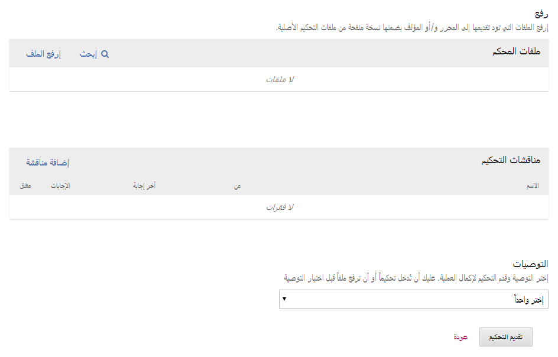
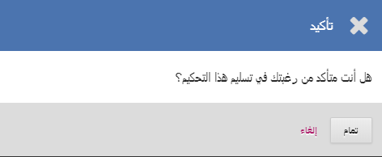
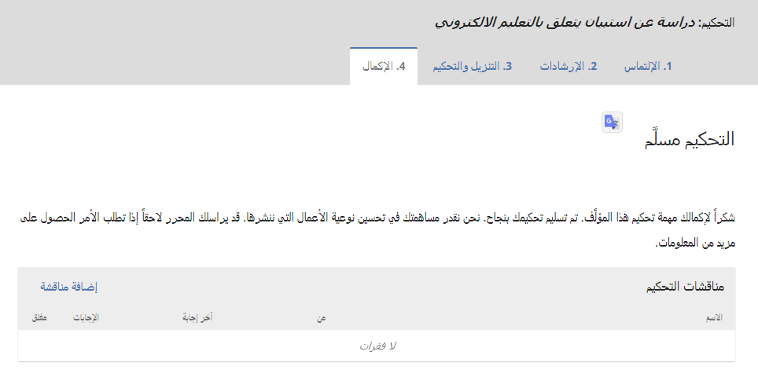

# الفصل 12: التحكيم

بصفتك محكماً، ستتلقى التماساً للتحكيم عبر البريد الالكتروني أو عند مراجعتك للوحة القيادة:

من قائمة مساراتي، إبحث عن العنوان ورابط التحكيم. لاحظ غياب أي معلومات إضافية في عملية التحكيم السري التي عادة ما تكون سرية من طرفي المؤلف والمحكم على حد سواء.

عند اختيارك لرابط التحكيم، ستذهب إلى الخطوة الأولى منه بالنسبة إلى طلب التقديم، والذي يكون بمحددات عرض بخلاف ما يراه المحرر، ما يجعله مقتصراً على معطيات قليلة جداً.

هذه الخطوة الأولى تتضمن المقاطع الآتية:

**إلتماس التحكيم**: تتضمن نصاً يدعوك لأخذ دور المحكم.

**عنوان المقالة**: يقدم لك عنوان المؤلَّف.

**الملخص**: يعرض لك نص الملخص.

مزيداً في أسفل النافذة، ستجد المزيد من المعلومات.

إن رابط **معاينة كل تفاصيل طلب التقديم** سيفتح نافذة فيها معلومات إضافية، من ضمنها كل البيانات الوصفية للعمل ما عدا ما يختص بالمؤلف:

لاحظ أن تلك الحقول جميعها غير قابلة للتعديل من قبل المحكم، وهي مقدمة لك فقط من أجل إعطائك فكرة متكاملة عن العمل.

أغلق هذه النافذة واستمر أكثر أسفل الشاشة. من هنا يمكنك معاينة جدولة التحكيم، بضمنها كل توقيتات الاستيجاب ذات الصلة.

من هنا يمكنك رفض التحكيم أو قبوله. إذا اعتذرت عنه، سيتم إقصاؤك من العملية. أما إذا قبلت المهمة، ستنتقل إلى الخطوة 2، وعندها ستكون قادراً على قراءة أي إرشادات تحكيم قد تقدمها لك المجلة.

أنقر **إستمر** للتقدم إلى الخطوة 3. من هنا يمكنك تنزيل نسخة من ملفات التحكيم وإدخال تعليقاتك بشأنه. النافذة الأولى معدة للتعليقات الموجهة إلى المحرر والمؤلف على حد سواء; النافذة الثانية مخصصة إلى المحرر فقط.

بمجرد أن قرأت العمل وأدخلت تعليقاتك بصدده، استعرض إلى أسفل الصفحة حيث يمكنك إختيارياً رفع نسخة معلمة من ملف التحكيم \(تذكر أن تزيل منها أي معلومات شخصية قبل أن تبدأ برفعها\).

بعدها، عليك أن تقدم توصياتك مستعملاً القائمة المنسدلة.

إختياراتك تتضمن:

**قبول طلب التقديم**: هو جاهز للانتقال إلى عملية التدقيق كما هو.

**التنقيحات مطلوبة**: يتطلب تعديلات طفيفة يمكن للمحرر مراجعتها وقبولها.

**إعادة التقديم إلى التحكيم**: يتطلب تعديلات كبيرة وجولة تحكيم أخرى.

**التقديم في مكان آخر**: لا يبدو أنه يتناسب مع توجهات المجلة ومجال تخصصها.

**رفض طلب التقديم**: فيه من الضعف ما يحول دون قبوله.

**أنظر التعليقات**: إذا لم يكن أي من التوصيات أعلاه متوافقاً مع رأيك، يمكنك أن تترك للمحرر تعليقاً توضح فيه بالتفصيل ما يجول في خاطرك.

أخيراً، أنقر على زر تقديم التحكيم لإكمال مهمتك. ستتم مطالبتك بتأكيد ذلك.

أنقر تمام. سيتم أخذك إلى نافذة التأكيد الأخيرة التي ستشكر لك مساهمتك في إنجاح عمل المجلة.

هذا كل شيء! مهمة التحكيم قد انتهت بالنسبة لك.
