# الفصل 4: الإشراف على الموقع

كجزء من عملية تنصيب نظام المجلات المفتوحة، ستكون قد أنشأت حساب المشرف على الموقع. عندما تقوم بتسجيل الدخول إلى نظام المجلات المفتوحة مستعملاً هذا الحساب، سيكون متاحاً لك الوصول إلى إعدادات المشرف عبر لوحة القيادة.

سيكون لك إمكانية إنشاء مجلة مستضافة جديدة، إدارة اللغات المتاحة في النظام، مع إجراء أعمال إدارية أخرى في الموقع.

المزيد من المعلومات التقنية الأخرى عن أعمال الإشراف على موقع نظام المجلات المفتوحة، بضمنها الترقية، الرسائل الالكترونية، الإحصائيات، والاستيراد والتصدير تتوفر في [دليل المشرف على الموقع](https://docs.pkp.sfu.ca/admin-guide/en/).

## إدارة الموقع

للوصول إلى إدارة الموقع، سجل دخولك بمثابة المشرف، واختر الوظائف الإدارية من القائمة اليمنى.

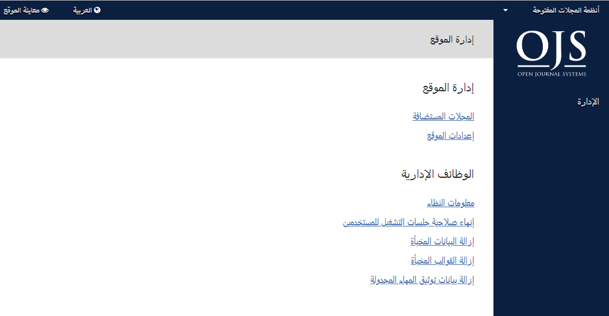

### المجلات المستضافة

من هنا، إختر المجلات المستضافة. عند تلك الصفحة، ستشاهد كل المجلات المستضافة في هذا التنصيب من نظام المجلات المفتوحة. في المثال أدناه، هناك مجلة واحدة فقط.

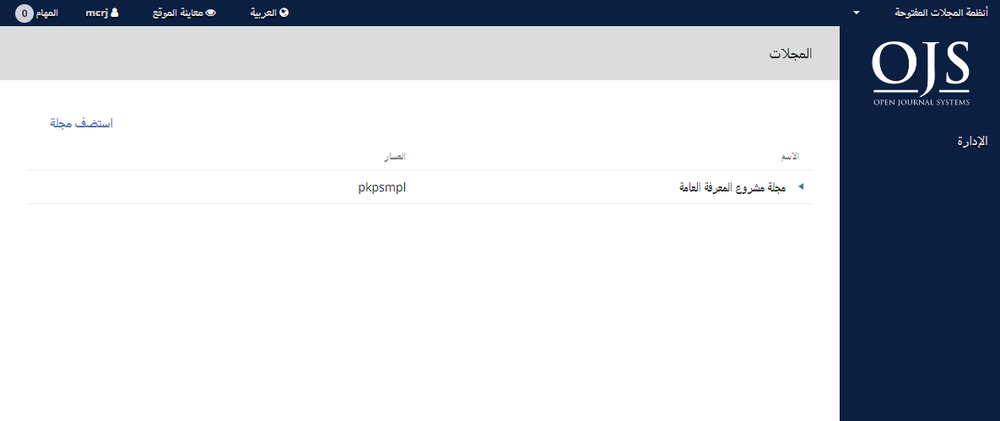

لتعديل المجلة، أنقر السهم الأزرق يمين اسم المجلة. ستشاهد خيارات؛ التعديل، الإزالة، أو تحديث الإعدادات.

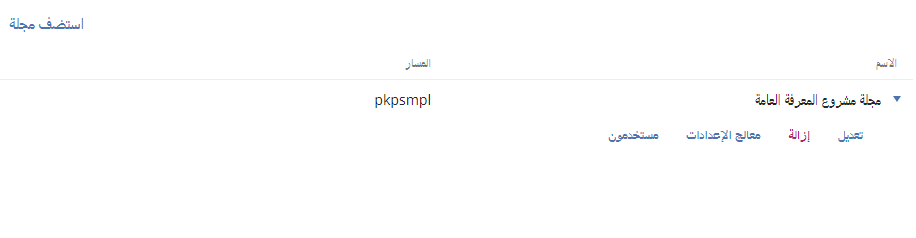

**التعديل** تسمح لك بتغيير العنوان، الوصف، أو المسار.

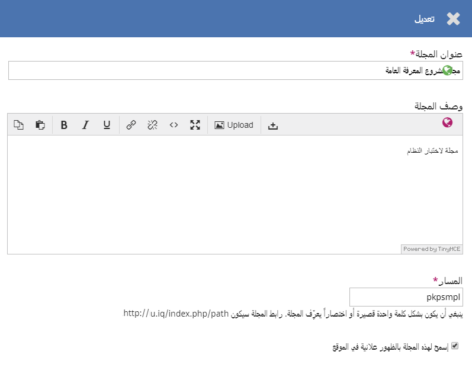

**الإزالة** تسمح لك بحذف المجلة من التنصيب. ستتم مطالبتك بتأكيد رغبتك في حذف المجلة، حيث أن هذا الأمر لا يمكن التراجع عنه.

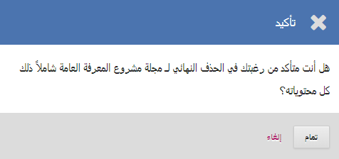

**معالج الإعدادات** سيأخذك إلى مختلف إعدادات المجلة. هناك شرح تفصيلي لها في الفصل 5.

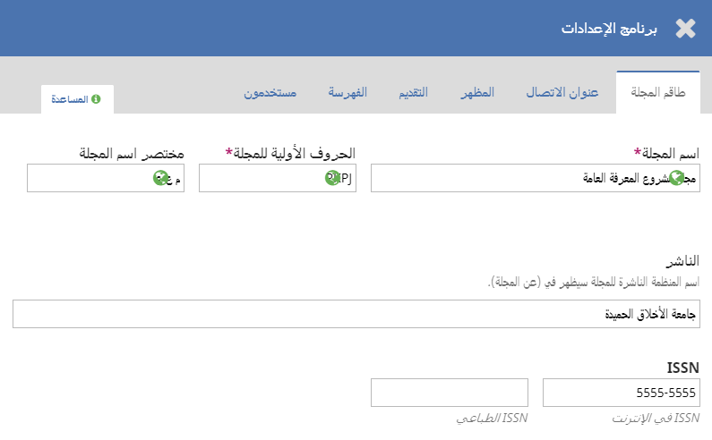

**المستخدمون** يسمح لك بإضافة المستخدمين المرتبطين بهذه المجلة وإدارتهم.

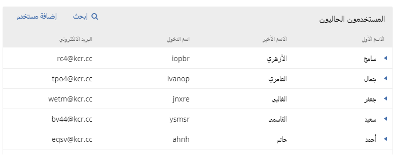

عودة إلى صفحة المجلات المستضافة، يمكنك استعمال رابط إنشاء مجلة لإضافة مجلة أخرى إلى هذا التنصيب من نظام المجلات المفتوحة. في النموذج الذي سيظهر، أدخل المعلومات المطلوبة في الحقول المخصصة لها.

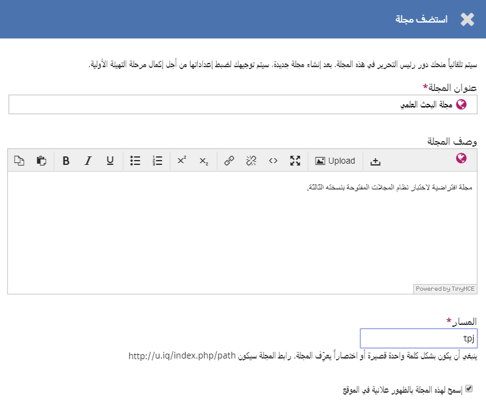

> ملاحظة: إذا أردت للمجلة الجديدة أن لا تكون ظاهرة على الموقع، أزل تأشيرة _إسمح لهذه المجلة بالظهور علانية في الموقع_ من خانة التأشير.

### إعدادات الموقع

هذا المقطع سيظهر إذا كان لديك مجلتان أو أكثر في الموقع، ويسمح لك بإضافة معلومات تخص نسختك المنصبة من نظام المجلات المفتوحة بالكامل، وليس لمجلة معينة فيه.

#### تهيئة الموقع

هذا يضم تسمية موقعك، صورته الرمزية، عبارة افتتاحية له، شريطه التحتاني، خيار إعادة التوجيه \(إذا كنت تخطط للإبقاء على مجلة واحدة في هذا التنصيب\)، معلومات الاتصال، الحد الأدنى لطول كلمة المرور المسموح به للمسجلين في الموقع، خيارات ملف الأنماط والمظهر العام، وإدارة الشريط الجانبي.

ستكون لك الفرصة لتقديم معلومات تفصيلية عن المجلة/المجلات المستضافة في الموقع في مرحلة لاحقة.

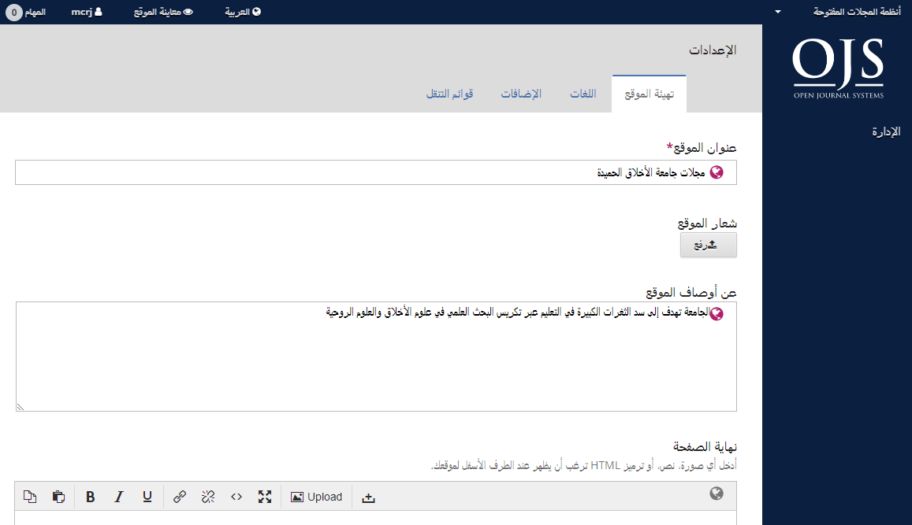

#### اللغات

إن نظام المجلات المفتوحة يدعم التشغيل بلغات متعددة في ذات الوقت وضمن تنصيب واحد. فعند التنصيب، يمكنك اختيار لغة واحدة أو أكثر لموقعك.

المشرف على الموقع يمكنه اختيار اللغة الافتراضية فيه، وإضافة المزيد من اللغات إليه من هنا، مما يجعلها متاحة لكل المجلات المستضافة. بعدها، يمكن لرؤساء التحرير إدارة اللغات في مجلاتهم وفقاً لمتطلباتهم الخاصة ضمن إعدادات المجلة > اللغات. أنظر [الفصل 5](./journal-setup.md) لمزيد من التفاصيل.

ضمن الإدارة > إعدادات الموقع > اللغات، يمكنك معاينة قائمة اللغات المنصبة في موقعك، تمكين أي لغة منها، وتحديد إحداها بمثابة اللغة الافتراضية، ما يعني أنها ستكون اللغة التي سيظهر بها الموقع للزائرين غير المسجلين فيه.

لإضافة لغة أخرى:

1. أنقر تنصيب لغة.
2. ضع تأشيرة لأي لغات تريد تنصيبها.
3. أنقر إحفظ

بعد تنصيب اللغات الجديدة، سيكون عليك تفعيلها عبر الذهاب إلى صفحة إعدادات الموقع > اللغات. المزيد من الإعدادات المتعلقة بتوفير اللغات في الموقع يمكن إجراؤها عبر إعدادات الموقع > اللغات من قبل رؤساء تحرير المجلات. أنظر [الفصل 5](./journal-setup.md) لمزيد من التفاصيل.

النسخة الثالثة من نظام المجلات المفتوحة لا تحتوي حالياً على كل ما كان يزخر به الإصدار الثاني من لغات، لكننا نتطلع إلى تزايد المساهمين معنا بمرور الوقت. المساهمات مرحب بها دائماً.

#### الإضافات

من هنا، يمكنك تمكين أو تعطيل الإضافات المتنوعة، مما يجعلها متاحة، \(أو العكس\) لكل المجلات المتواجدة في هذا التنصيب من نظام المجلات المفتوحة.

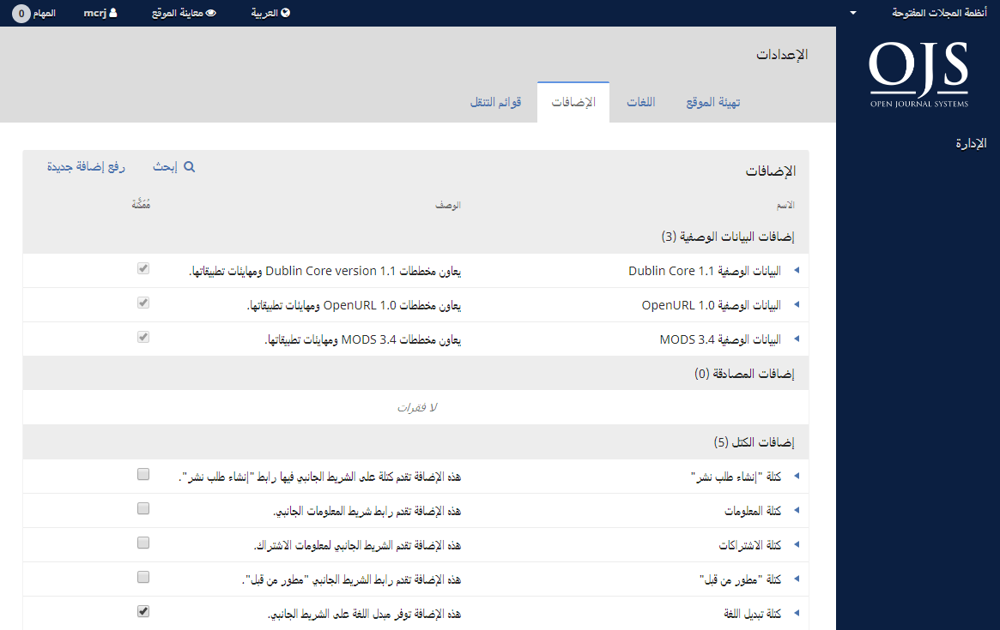

#### قوائم التنقل

إستعمل هذا المقطع لتعديل القوائم على مستوى الموقع. يمكنك تعلم المزيد عن تهيئة القوائم في [الفصل 5](./journal-setup.md).

### الخطوات اللاحقة

بمجرد إنشائك للمجلة وتهيئتك لإعدادات الموقع، قد ترغب بإنشاء حساب لرئيس تحريرها أو مديره - أنظر [الفصل 7](./users-and-roles.md) لمعرفة التفاصيل.

## الوظائف الإدارية

هذا المقطع يقدم معلومات تفصيلية عن الملقم الذي يعمل عليه نظام المجلات المفتوحة حالياً.

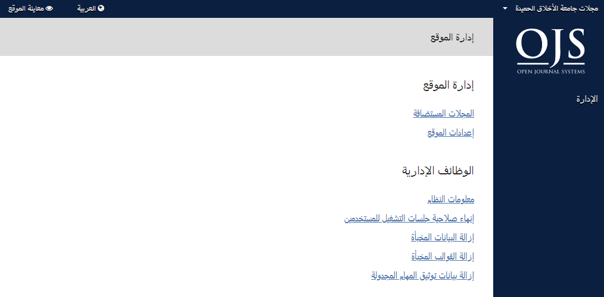

### معلومات النظام

استعمل هذا المقطع للحصول على معلومات تفصيلية عن الملقم الذي يعمل عليه نظام المجلات المفتوحة.

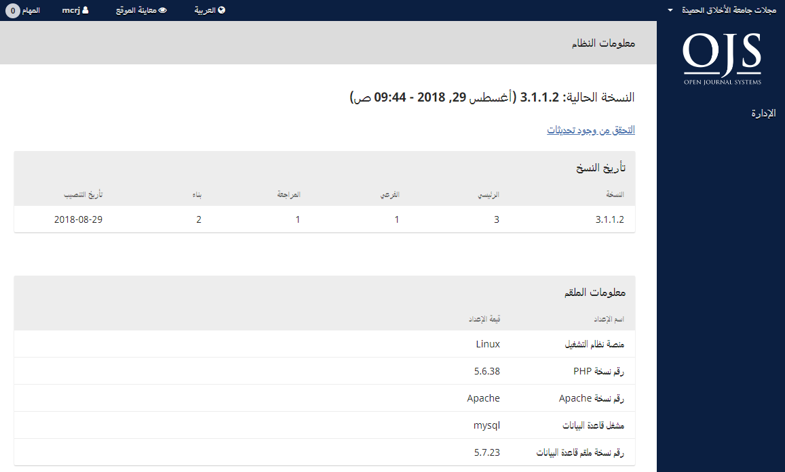

رقم نسخة نظام المجلات المفتوحة يعطيك فكرة عن النسخة التي قمت بتنصيبها منه، مع ماضيها وما إذا كانت قد تعرضت إلى ترقيات. يمكنك النقر على رابط التحقق من وجود تحديثات للتأكد فيما لو أنك تستعمل الإصدار الأحدث من نظام المجلات المفتوحة.

معلومات النظام تقدم تفاصيل فنية عن بيئة نظام التشغيل حيث تعمل نسختك المنصبة من نظام المجلات المفتوحة.

إن مقطع معلومات النظام يعرض كل خيارات التهيئة وقيمها كما هي مسجلة في ملف الإعدادات _config.inc.php_.

يمكنك معرفة المزيد عن عوامل التشغيل المعرفة في الملف _config.inc.php_ من الملف نفسه.

المقطع الأخير في هذه الصفحة يعرض معلومات إضافية عن الملقم: نظام التشغيل، رقم نسخة PHP، ملقم قاعدة البيانات. كما يمكنك معاينة معلومات موسعة عن PHP عبر النقر على رابط المعلومات الموسعة لـ PHP (هذا سيعرض ما تقدمه الدالة ``phpinfo()``)

كل من تلك المعلومات ستكون مفيدة عند محاولة تشخيص المشاكل.

### إنهاء صلاحية جلسات التشغيل للمستخدمين

النقر على _إنهاء صلاحية جلسات التشغيل للمستخدمين_ سيقوم فوراً بإخراج المستخدمين الحاليين للنظام، مما يتطلب من كل ممن يعمل حالياً عليه، تسجيل دخوله إلى الموقع مجدداً. هذا قد يكون مفيداً قبيل الشروع بترقية النظام من أجل ضمان أن جميع المستخدمين خارجه.

### إزالة البيانات المخبأة

النقر على _إزالة البيانات المخبأة_ سيزيل كل البيانات المخفية، بضمنها المعلومات المحلية، مخزونات المساعدة، مخزونات البحث. هذه الوظيفة قد تكون مفيدة لإجبار تلك البيانات على إعادة التحميل بعد إجراء تخصيصات في الموقع.

### إزالة القوالب المخبأة

النقر على _إزالة القوالب المخبأة_ سيزيل كل النسخ المخزونة من قوالب HTML. هذه الوظيفة قد تكون مفيدة لإجبار تلك القوالب على إعادة التحميل بعد إجراء التخصيصات في الموقع.

### إزالة بيانات توثيق المهام المجدولة

إذا تم تمكين المهام المجدولة في الموقع للمجلة، فإن النقر على _إزالة بيانات توثيق المهام المجدولة_ سيقوم بحذف ملفات وقوعات المهام المجدولة المنفذة من ملقمك. تلك الملفات تتضمن تواريخ ما تم تنفيذه سابقاً من مهام مجدولة \(مثل إرسال تذكير تلقائي للمحكم أو ما شابه\).
