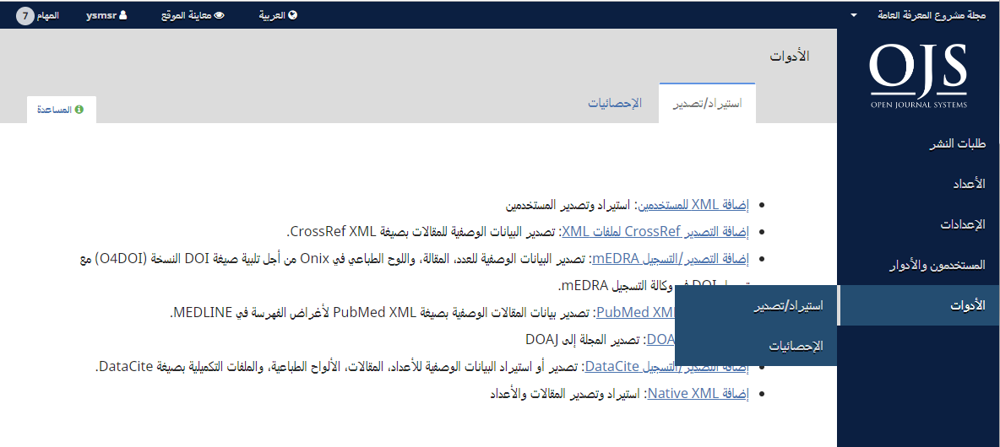
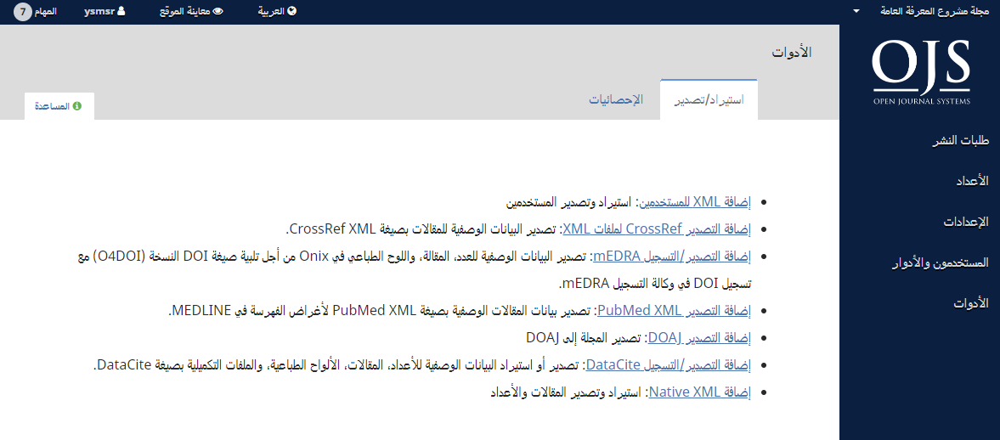
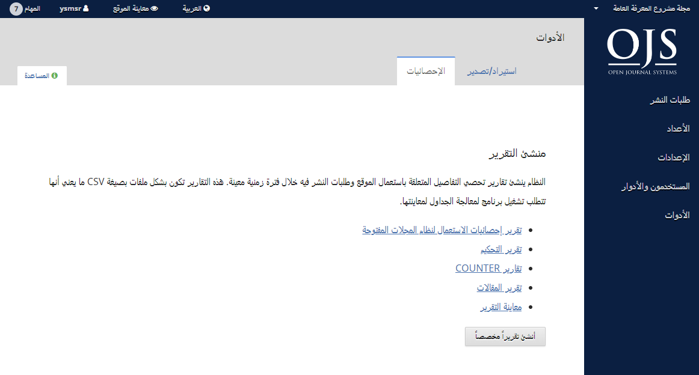
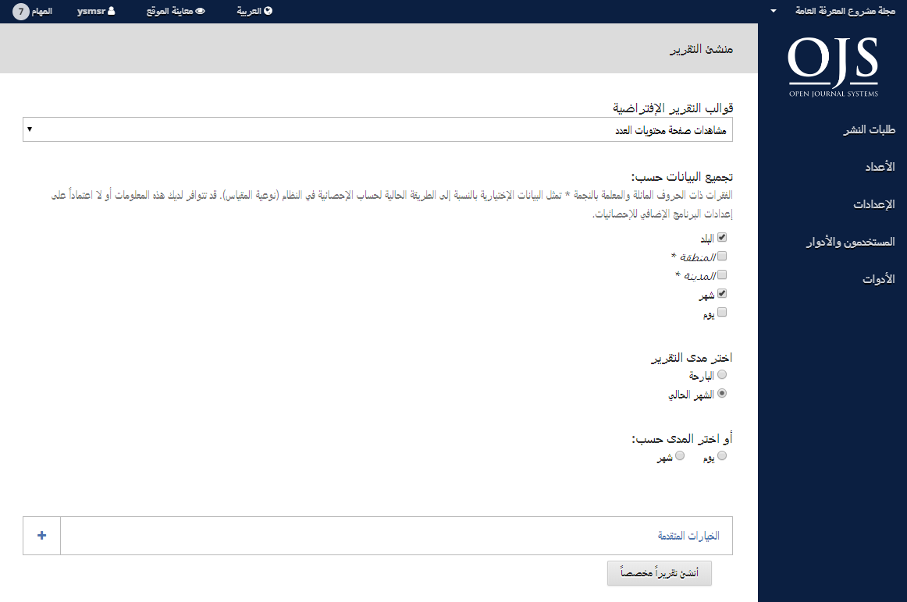

# الفصل 8: الأدوات

مقطع الأدوات يمكن الوصول إليه من الشريط الجانبي الأيمن.

الأدوات تتضمن تبويب الاستيراد/التصدير وتبويب الاحصائيات.

## الاستيراد/التصدير

الاستيراد/التصدير تتيح لك إدخال البيانات إلى نظام المجلات المفتوحة فضلاً عن إخراجها منه.

بعض الأدوات تسمح لك بالتصدير إلى  طرف ثالث من الأنظمة مثل PubMed أو DOAJ. وغيرها يسمح باستيراد وتصدير بيانات المستخدمين والمقالات.

للحصول على تعليمات تفصيلية عن الاستيراد والتصدير، أنظر [دليل المشرف](https://docs.pkp.sfu.ca/admin-guide/en/data-import-and-export).

للمزيد من المعلومات عن إضافة التصدير Crossref XML، أنظر [دليل مشروع المعرفة العامة عن Crossref](https://docs.pkp.sfu.ca/crossref-ojs-manual/en/).

## الإحصائيات

صفحة الاحصائيات تتيح الوصول إلى العديد من التقارير لمجلتك.

يقوم النظام بإنشاء التقارير التي تتابع التفاصيل المتعلقة باستعمال الموقع وطلبات التقديم عبر فترة زمنية محددة.  يتم إنشاء التقارير بصيغة CSV والتي تتطلب تطبيقاً لمعالجة الجداول لمعاينتها.

- **تقرير المعاينة**: توفر تقريراً عن معاينات اللوح الطباعي والملخص من قبل القراء \(أي، كم مرة تمت معاينة ملف PDF لمقالة معينة\).
- **تقرير التحكيم**: توفر جدولاً عن كل نشاطات التحكيم.
- **تقرير الاشتراكات**: توفر جدولاً عن نشاط الاشتراكات.
- **تقارير COUNTER**: توفر بيانات COUNTER.
- **تقرير المقالات**: توفر جدولاً عن كل المقالات المنشورة.
- **تقرير إحصائيات استعمال مشروع المعرفة العامة**: توفر الإحصائيات الأساسية عن استعمال مجلتك.

### إنشاء تقرير مخصص

إستعمل هذه الميزة لإنشاء تقاريرك الخاصة.

مزيد من المعلومات عن كيفية إنشاء وإدارة الاحصائيات في نظام المجلات المفتوحة تتوفر في [دليل المشرف](https://docs.pkp.sfu.ca/admin-guide/en/statistics).
