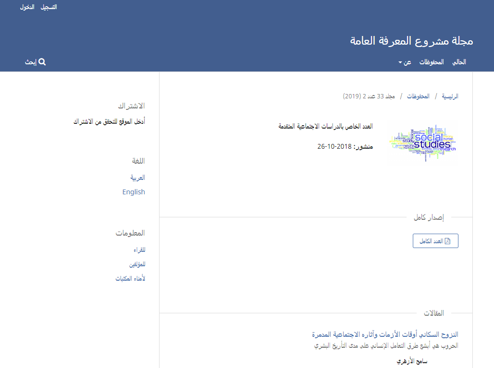
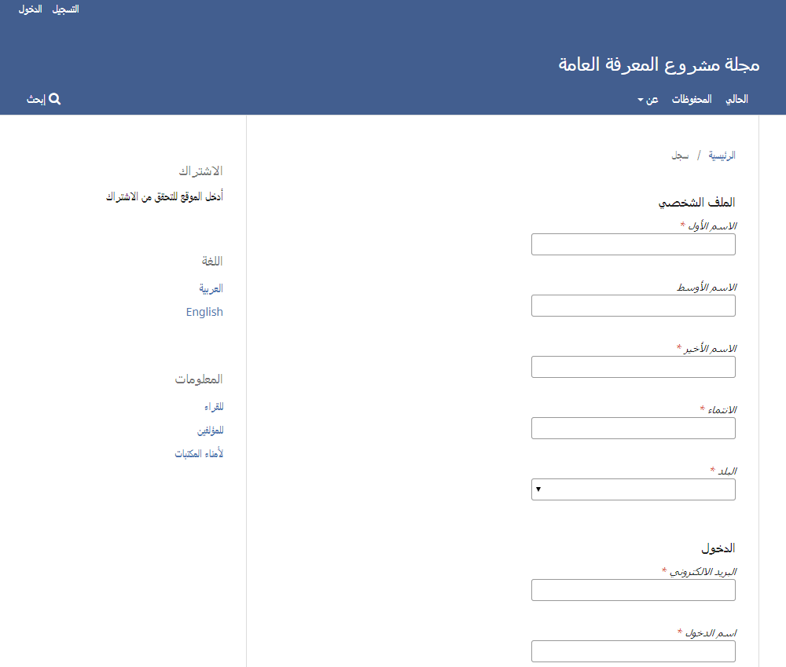
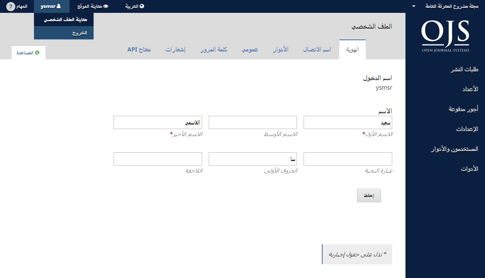
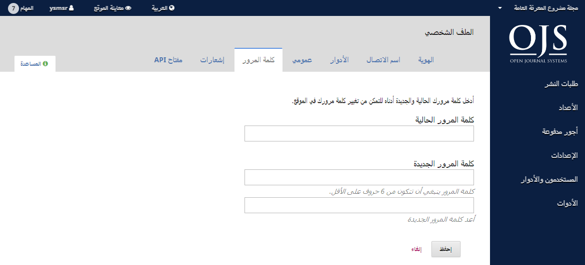

# الفصل 3: حسابات المستخدمين

نظام المجلات المفتوحة يستعمل نظام أدوار شامل لتوزيع الأعمال بين المستخدمين، توجيه انسيابية العمل، وتقنين صلاحيات الوصول إلى أجزاء النظام.

بما أن تنصيباً واحداً لنظام المجلات المفتوحة يمكنه استضافة عدة مجلات، يمكن أن يكون للمستخدمين أدوار متباينة عبر تلك المجلات. على سبيل المثال، يمكن لمستخدم واحد أن يكون محرراً ومؤلفاً ضمن نفس المجلة، مع كونه مؤلفاً فقط ضمن مجلة أخرى، ومحكماً في ثالثة، ومحرراً في رابعة... وهكذا.

عندما يقوم المستخدم بتسجيل دخوله إلى النظام، يأخذه الأخير إلى لوحة القيادة. من هنا، سيقدم له النظام كل الوظائف المتاحة له. على سبيل المثال، المحكم يستطيع معاينة طلبات التقديم التي تم تعيينه لها حصراً، بينما المحرر يستطيع رؤية كل طلبات التقديم ضمن مجريات أعمال التحرير.

## أدوار النظام

المخطط الانسيابي لنظام المجلات المفتوحة يتداول أدواراً مختلفة لطيف من المستخدمين، مما يسمح لهم بالوصول إلى أجزاء متباينة من ذلك المخطط، مع صلاحيات ومسؤوليات مختلفة أيضاً.

الأدوار الرئيسية تشمل المشرف على الموقع، رئيس التحرير، مدير التحرير، محرر القسم، المؤلف، المحكم، المدقق، المحرر الطباعي، مصحح القراءة، والقارئ.

نظام المجلات المفتوحة 3 يحتوي أيضاً على أدوار إضافية مثل: المترجم والمصمم. بإمكانك أيضاً إنشاء أدوار جديدة أو تعديل تسمية ما موجود منها. المزيد من المعلومات عن تعريف الأدوار تتوفر في [الفصل 5](./journal-setup.md).

### المشرف على الموقع
إن المشرف هو المسؤول عن التنصيب العام لنظام المجلات المفتوحة، ومن مسؤوليته ضمان صحة إعدادات الملقم، إضافة حزم اللغات، وإنشاء أي مجلات جديدة في ذلك التنصيب. حساب المشرف على الموقع يتم إنشاؤه كجزء من عملية التنصيب. بخلاف جميع الأدوار الأخرى في نظام المجلات المفتوحة، لا يمكن أن يكون للموقع أكثر من مشرف واحد.

أنظر [الفصل 4: الإشراف على الموقع](./site-administration.md) للمزيد من التفاصيل.

### رئيس التحرير
رئيس التحرير في المجلة مسؤول عن تهيئة موقعها، تحديد خيارات التشغيل المناسبة لها، وإدارة حسابات المستخدمين. هذا لا يتطلب أي مهارات تقنية متقدمة، بل يقتصر على تعبئة بعض النماذج ورفع بعض الملفات.

رئيس التحرير يقوم أيضاً بمنح الأدوار لمدير التحرير، ومحرري الأقسام، المدققين، المصممين الطباعيين، مصححي القراءة، المؤلفين، وأخيراً المحكمين.

يكون لرئيس التحرير أيضاً صلاحية الوصول إلى بعض المزايا الإدارية في المجلة، كما يمكنه إنشاء أقسام جديدة لها، تهيئة نماذج التحكيم، تعديل قوالب الرسائل البريدية المحضرة، إدارة أدوات القراءة، معاينة الإحصائيات والتقارير، وغير ذلك.

العديد من رؤساء التحرير ينخرطون في العمل بمثابة مدراء تحرير، مما يسمح لهم بسهولة التعامل مع إعدادات المجلة وكذلك معالجة طلبات التقديم ضمن مجريات أعمال التحرير.

> **ملاحظة**
>
> على الرغم من كون دور رئيس التحرير لمجلة معينة هو دور مختص بتلك المجلة، إلا أن رؤساء تحرير المجلات في الموقع يعتبرون مستخدمين موثوقين على مستوى الموقع بالكامل، بما أن لهم قابلية التكهن بهوية المستخدمين الآخرين الذين قد تكون لهم أدوار في تلك المجلات.
>

أنظر [الفصل 5: تهيئة المجلة](./journal-setup.md) للمزيد من التفاصيل.

### المؤلف

المؤلفون يمكنهم تقديم المؤلفات إلى المجلة بشكل مباشر عبر موقعها. تتم مطالبة المؤلف برفع ملفات التقديم فضلاً عن توفير البيانات الوصفية أو معلومات الفهرسة لها (البيانات الوصفية تعزز إمكانيات البحث عن الأبحاث والمقالات المنشورة على الإنترنت بالنسبة إلى المجلة). يمكن للمؤلف رفع ملفات متعددة، وبشكل جداول بيانات، أدوات بحثية، أو مصادر نصية من شأنها إغناء مقالته، وكل ذلك من أجل الإسهام بنتاج علمي وبحثي يتميز بالأصالة والانفتاح.

يمكن للمؤلف تتبع طلبه خلال مرحلتي التحكيم والتحرير — كما له أن يشارك في أعمال التدقيق والقراءة التصحيحية لأعماله المقبولة للنشر — عبر تسجيل دخوله إلى موقع المجلة.

أنظر [الفصل 10: التأليف](./authoring.md) للمزيد من التفاصيل.

### مدير التحرير

مدير التحرير لديه نظرة شمولية على مهام التحكيم، التحرير، والنشر. إنه يعمل مع رئيس التحرير لوضع السياسات ورسم ملامح الإجراءات في المجلة.

خلال عملية التحرير، يقوم مدير التحرير بتعيين طلبات التقديم إلى محرري الأقسام في المجلة لتمشية متعلقات التحكيم وما بعدها من متعلقات التحرير. مدير التحرير يراقب تطورات العمل عن كثب ويقدم العون حيثما تطرأ المشاكل والمعوقات.

بمجرد إكتمال التحكيم، يتولى مدير التحرير متابعة طلب النشر في مراحل التحرير اللاحقة (بضمنها التدقيق، الإنتاج، والقراءة التصحيحية) رغم أن تلك المهام في بعض المجلات قد تبقى على عاتق محرري الأقسام المسؤولين عن طلبات التقديم المعينين لها.

يقوم مدير التحرير أيضاً بإنشاء أعداد المجلة، جدولة طلبات التقديم للنشر، إعداد جدول المحتويات، وأخيراً نشر العدد باعتباره جزءً من عملية التحرير. يمكن لمدير التحرير أيضاً استعادة طلبات النشر المحفوظة وإدراجها ضمن طابور التحكيم أو التحرير.

العديد من مدراء التحرير يكونون أيضاً رؤساء تحرير في مجلاتهم، مما يتيح لهم بسهولة إدارة مجريات التحرير والتحكم بإعدادت المجلة في آنٍ واحد.

أنظر [الفصل 11: المخطط الانسيابي للتحرير](./editorial-workflow.md) للمزيد من التفاصيل.

### محرر القسم

محرر القسم يدير متعلقات التحكيم وأمور التحرير بالنسبة إلى طلبات التقديم التي يجري تعيينه لها. في بعض الأحيان، محرر القسم الذي يتولى متابعة إجراءات التحكيم سيكون متكفلاً أيضاً بأعمال التحرير اللاحقة فيما لو حصل الطلب على القبول (أي خلال مراحل التدقيق، الإنتاج والقراءة التصحيحية).

مع ذلك، عادة ما يعمل محررو الأقسام ضمن مرحلة التحكيم، بينما يتكفل مدير التحرير بباقي الإجراءات ضمن عملية التحرير. بالطبع، الأمر تابع لسياسة توزيع المهام على طاقم التحرير في المجلة.

أنظر [الفصل 11: المخطط الانسيابي للتحرير](./editorial-workflow.md) للمزيد من التفاصيل.

### المحكم

المحكم يتم انتخابه من قبل مدير التحرير أو محرر القسم لتحكيم طلب التقديم. المحكمون يطلب منهم تقديم توصياتهم عبر موقع المجلة وينبغي أن يكونوا قادرين على رفع المرفقات لصالح المحرر والمؤلف. قد يصار إلى تقييم المحكمين من قبل محرري الأقسام، أيضاً بالاعتماد على سياسات عمل المجلة.

أنظر [الفصل 12: التحكيم](./reviewing.md) للمزيد من التفاصيل.

### المدقق

المدقق يراجع المقالات لتحسين محتواها قواعدياً وبلاغياً، وهو يعمل مع المؤلف ليضمن بقاء كل شيء في محله، مع الحرص على اتباع المنحى النصي الخاص بالمجلة، من أجل الخروج بنسخة نظيفة قابلة للتعديل لصالح المحرر الطباعي أو مساعد الإنتاج، وبالتالي تحويل المؤلَّف إلى ألواح طباعية وفقاً للتنسيق الذي تتبعه المجلة عند النشر.

بعض المجلات يقوم فيها مدير التحرير أو محرر القسم بلعب هذا الدور.

أنظر [الفصل 11: المخطط الانسيابي للتحرير](./editorial-workflow.md) للمزيد من التفاصيل.

### المحرر الطباعي

هو من يقوم بتحويل النسخة المدققة من العمل إلى ألواح طباعية بصيغ ملفات HTML، PDF، XML... إلخ. - والتي عادة ما تنتخبها المجلات لأغراض النشر عبر الإنترنت.

>ملاحظة
>
>نظام المجلات المفتوحة لا يمتلك حالياً البرنامج الذي يقوم تلقائياً بتحويل ملفات بصيغة مستندات word إلى ألواح طباعية بصيغ أخرى، (إلا أن هناك مشروعاً جارياً بهذا الصدد)، ولهذا لا بد لمصمم الألواح الطباعية من الوصول إلى تلك الملفات واستعمال برامجيات خارجية لصناعتها.
>

في بعض الأحيان، يمكن للمحرر أو لمحرر القسم أن يتوليا مهمة المحرر الطباعي.

أنظر [الفصل 11: المخطط الانسيابي للتحرير](./editorial-workflow.md) للمزيد من التفاصيل.

### المصحح

المصحح يقرأ الألواح الطباعية بعناية وبصيغها المختلفة التي تنشرها المجلة (كما يفعل ذلك المؤلف). يسجل المصحح (والمؤلف) أي أخطاء طباعية أو تنسيقية من أجل أن يقوم المحرر الطباعي بتصحيحها.

في بعض المجلات، يقوم مدير التحرير أو محرر القسم بتأدية مهمة المصحح.

أنظر [الفصل 11: المخطط الانسيابي للتحرير](./editorial-workflow.md) للمزيد من التفاصيل.

### القارئ

دور القارئ هو أبسط الأدوار في نظام المجلات المفتوحة، ولديه أقل الإمكانيات المتاحة. يتلقى القراء إشعارات بريدية عند نشر أي عدد، تتضمن جدول المحتويات الخاص بذلك العدد.

## التسجيل في مجلة

الزوار غير المسجلين في موقع المجلة يمكنهم بطبيعة الحال التسجيل بصفة قراء، مؤلفين، و/أو محكمين. رئيس التحرير يمكنه منع الزوار من ميزة التسجيل الذاتي، وعند ذلك، ستظهر على الموقع ملحوظة تشير إلى أن التسجيل فيه معلق حالياً (أنظر إعدادات المجلة)، لكن يمكن لرؤساء التحرير تسجيل المستخدمين دائماً وفي أي وقت ومنحهم أي أدوار.

للتسجيل في مجلة، أنقر رابط التسجيل في الزاوية العليا اليسرى.

هذا من شأنه أن يفتح نموذج التسجيل لإكمال ما يتضمنه من حقول.

كل الحقول المعلمة بنجمة هي حقول إجبارية (الاسم الأول، الاسم الأخير، الانتماء، البلد، البريد الالكتروني، اسم المستخدم، كلمة المرور مع إعادتها). إذا كانت المجلة متعددة اللغات، سيكون عليك اختيار لغتك المفضلة.

سيتم تسجيلك تلقائياً بمثابة قارئ ومؤلف. سيكون لك خيار التسجيل بمثابة محكم أيضاً.

لكن لن يكون متاحاً لك التسجيل في أدوار التحرير (أي، مدير التحرير، محرر القسم، المدقق، المحرر الطباعي، المصحح، أو رئيس التحرير). إذا كنت تريد الحصول على أدوار من هذا المستوى، راسل رئيس التحرير الحالي للمجلة أو المشرف على موقعها.

## معاينة ملفك الشخصي وتعديله

لمعاينة ملفك الشخصي وتعديله، سجل دخولك في الموقع وانقر على رابط اسم المستخدم في الزاوية العليا اليسرى. إختر رابط معاينة الملف الشخصي.

من هنا، وعبر التنقل بين علامات التبويب المختلفة، يمكنك تعديل معلوماتك الشخصية، معلومات الاتصال، تغيير أدوارك، إضافة صورتك الشخصية \(حيث أن بعض المجلات تقوم بنشرها مع أعمالك أو ضمن قائمة المحررين\)، تحديد إعدادات إشعاراتك، أو تغيير كلمة مرورك.

إن علامة التبويب API ضمن صفحة الملف الشخصي تسمح للمستخدم في نظام المجلات المفتوحة بالاستفادة من خدمة REST API للتعامل مع تطبيقات خارجية. مع ذلك، معظم المستخدمين لن يبادروا إلى استعمال API ويمكن لهم تجاهل علامة التبويب تلك.

## إعادة تعيين كلمة مرورك

يمكنك إعادة تعيين كلمة مرورك عبر:

1. تسجيل الدخول إلى الموقع
2. إختيار اسم دخولك ومعاينة ملفك الشخصي من الزاوية العليا اليسرى من الشاشة
3. إختيار علامة التبويب الخاصة بكلمة المرور
4. إدخال كلمة مرورك الحالية، من ثم كلمة المرور الجديدة مرتين
5. النقر على حفظ

كلمة مرورك قد تغيرت الآن.
