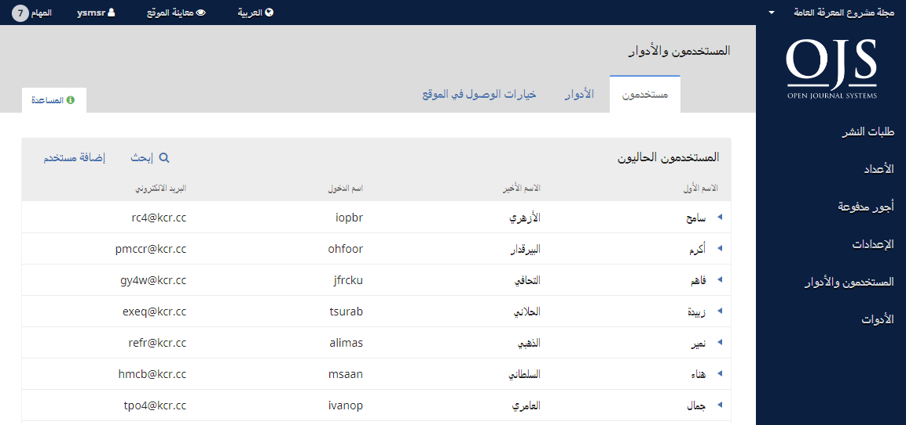
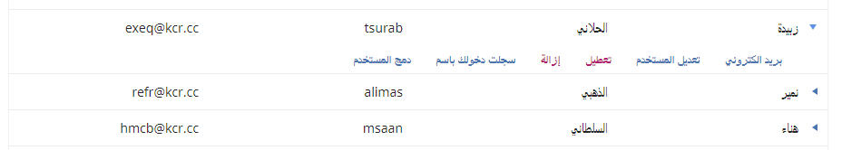
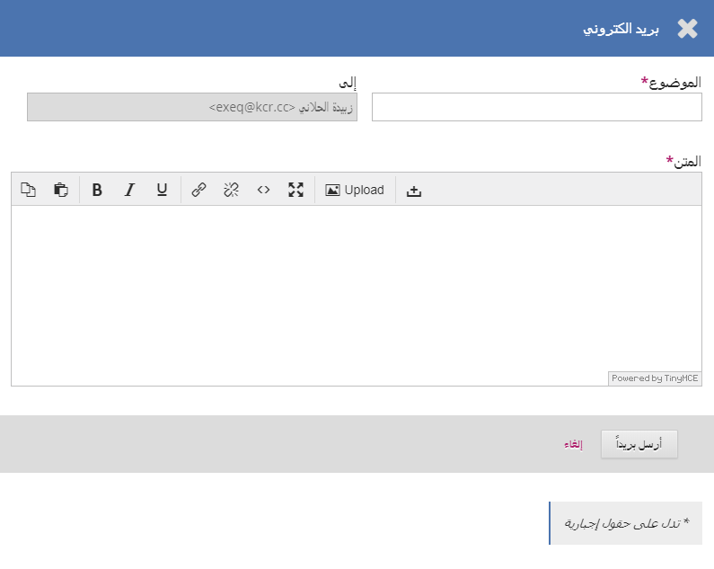
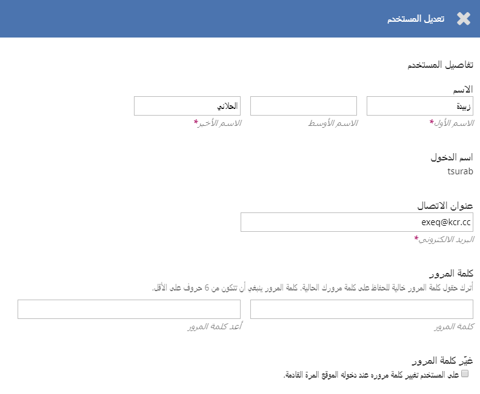
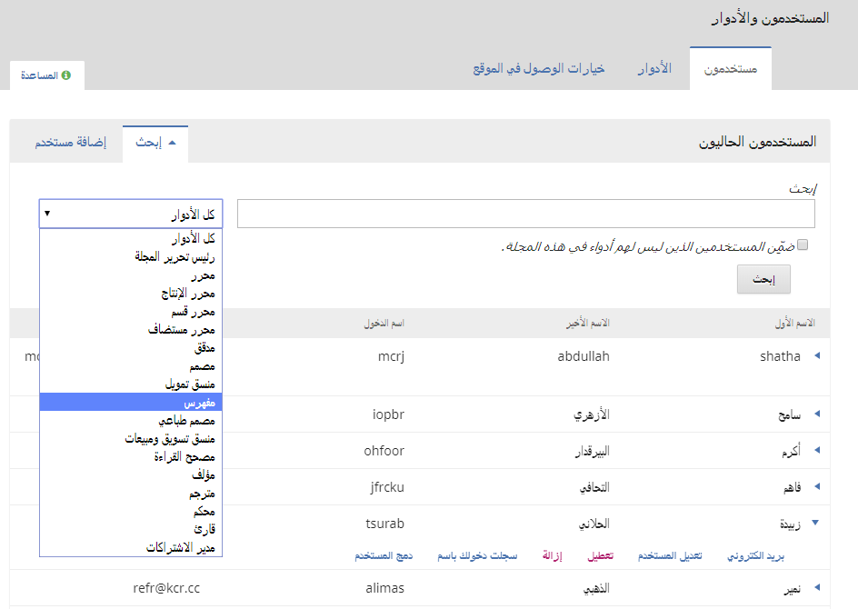
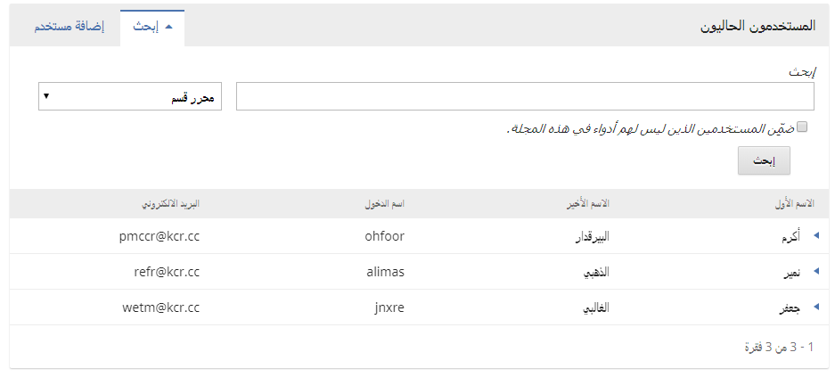
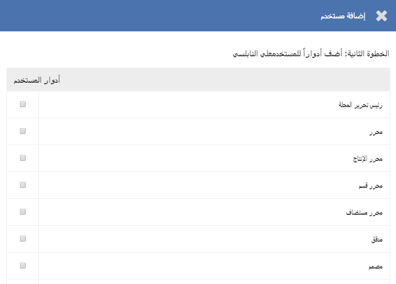
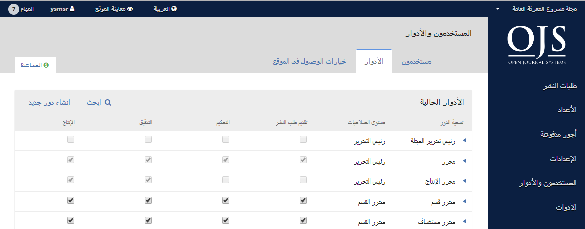
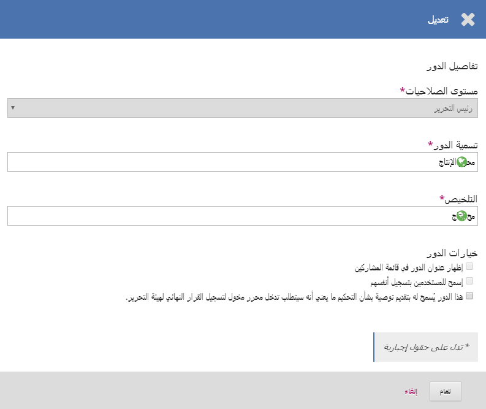
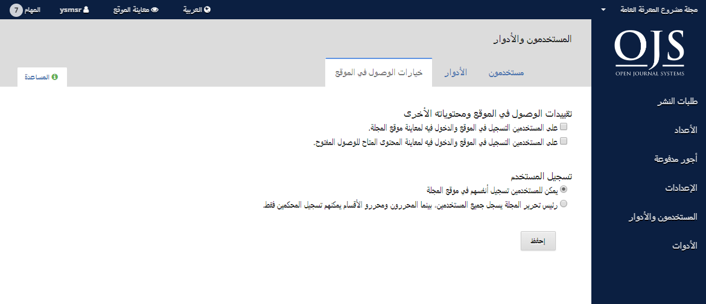

# الفصل 7: المستخدمون والأدوار

هذا المقطع يتيح الوصول إلى جميع حسابات المستخدمين المرتبطين بمجلتك، فضلاً عن إمكانية إدارة الأدوار والصلاحيات.

## المستخدمون

بالإضافة إلى إدارة موقع المجلة، فإن رئيس التحرير مسؤول عن كل حسابات المستخدمين في النظام.

لمعاينة حسابات المستخدمين، إختر المستخدمون والأدوار من القائمة اليمنى.

### المستخدمون

المستخدمون مرتبون هجائياً حسب الاسم الأخير.

يمكنك تعديل حساب أي مستخدم عبر اختيار السهم الأزرق إلى اليمين من اسمه.

هذا يفتح المجال لمراسلته، تعديل بيانته، تعطيله، إزالته، تسجيل الدخول بصفته، ودمجه مع مستخدم آخر.

**المراسلة** تفتح نافذة تتيح لك إنشاء رسالة سريعة لذلك المستخدم.

**تعديل المستخدم** تسمح لك بإجراء تعديلات على حساب ذلك المستخدم.

**التعطيل** تبقي الحساب في محله، لكن تمنع صاحبه من استعماله في الموقع.

**الإزالة** يزيل الحساب من سجلات المستخدمين لهذه المجلة ما يعني تعذر دخول صاحبه لها مستقبلاً، لكن الحساب يبقى ضمن النظام.

**الدخول بصفة** تسمح لك بانتحال صفة المستخدم المعني مؤقتاً. على سبيل المثال من أجل إكمال مهمة معلقة.

**دمج المستخدمين** تسمح لك بلملمة الحساب المعني، وما يتعلق به من طلبات تقديم ومهام وضمه إلى حساب آخر في النظام.

> **ملاحظة**: هذه هي الطريقة الوحيدة للتخلص نهائياً من حساب مستخدم في النظام.

قد ترغب في إنشاء حساب فائض في النظام \(أي بتسمية المستخدمون المحذوفون\)، واستعماله من أجل دمج أي حسابات غير مرغوب بها فيه.

#### البحث

عندما تكون عندك قائمة طويلة من المستخدمين، قد يكون من المفيد استعمال وظيفة البحث.

هذا يساعدك في العثور سريعاً على أي مستخدم عبر الاسم الأول، الاسم الأخير، أو البريد الالكتروني، أو لعرض جميع المستخدمين المنسبين إلى دور معين.

**ملاحظة**: إذا تركت حقل البحث فارغاً، واخترت دوراً من الأدوار ثم نقرت على البحث، ستحصل على قائمة بكل المستخدمين الحاصلين على ذلك الدور \(مثلاً، جميع المدققين\).

#### إضافة مستخدم

لإضافة مستخدم جديد إلى مجلتك، إختر رابط إضافة مستخدم. هذا سيفتح نافذة جديدة فيها مجموعة من الحقول تنتظر إملاءها.

بمجرد إكمال تلك الحقول والنقر على _حفظ_، ستتم مطالبتك بتعيين أدوار المستخدم الجديد. إستعمل رابط _إضافة دور_ لفتح منتقِ الأدوار.

بمجرد إضافتك لجميع الإدوار المطلوبة، أنقر زر **حفظ** .

## الأدوار

المستخدمون في النظام لا بد أن يكون لهم دور واحد فيه أو أكثر.

 الأدوار تعرف ما يمكن أن يقوم به المستخدم ضمن النظام. المؤلف يمكنه تقديم طلبات النشر وبعض الأمور الصغيرة الأخرى. المحرر له أن يدير تلك الطلبات، رئيس التحرير يمكنه تهيئة إعدادات المجلة.

يمكن لمستخدم واحد أن يكون له أكثر من دور. على سبيل المثال، أن يكون رئيساً للتحرير، ومدير التحرير ومؤلفاً في الوقت نفسه.

نظام المجلات المفتوحة 3 تتوفر فيه أدوار متعددة، لكل منها مستوى صلاحيات خاص بها.

من هذه الصفحة، يمكنك معاينة كل دور وما يمكن له أن يصل إليه من مهام التحرير في المجلة. أفضل مثال على ذلك دور المدقق، الذي يمكنه الوصول حصرياً إلى مرحلة التدقيق. المدققون لا يتسنى لهم القفز إلى مرحلة التحكيم لمعاينة مجرياته. أنظر [الفصل 11:](./editorial-workflow.md) للمزيد من المعلومات عن مختلف أدوار عمليات التحرير.

### تعديل الأدوار

إزالة التأشيرة من خانة التأشير معناه منع ذلك الدور من الوصول إلى تلك المرحلة، وهذا الأمر يشمل بطبيعة الحال كل المستخدمين المنضوين تحته.

عبر اختيارك السهم الأزرق من يمين تسمية الدور، ستكشف رابط التعديل. النقر عليه يفتح لك نافذة تعديل الدور المعني.

**مستوى الصلاحيات**: هذا يشير إلى ما يمكن للمستخدم أن يقوم به ضمن أي مرحلة. مساعد المجلة يمكنه التواصل مع المستخدمين الآخرين فضلاً عن رفع الملفات وتنقيحها.

**تسمية الدور**: يمكنك استعمال هذا الحقل لإعادة تسمية أي دور.

**المختصر**: لا بد لأي دور أن تكون له تسمية مختصرة.

**تعيين المراحل**: هذا يسمح لك بتحديد المراحل التي يمكن لأفراد ذلك الدور الوصول إليها.

**خيارات الدور**: إستعمل خانة الاختيار الأولى لإظهار من تريده ضمن ذلك الدور في قائمة المساهمين \(مثلاً، قائمة المؤلفين\).

إستعمل الخيار الثاني لتحديد فيما لو كان بإمكان المستخدمين منح أنفسهم ذلك الدور. المؤلفون والمحكمون مرشحون جيدون لمن يُسمح له بالحصول على هذه الميزة. بالتأكيد، لا تريد السماح للمستخدمين بتسجيل أنفسهم بمثابة رؤساء التحرير أو مدرائه!

الخيار الثالث مفيد للمحررين المستضافين أو ربما لمحرري الأقسام، اعتماداً على ما تفضله من انسيابية العمل وسلسلة المراجع.

### إنشاء أدوار جديدة

إستعمل رابط _إنشاء دور جديد_ لفتح نافذة تسمح لك بإنشاء دور جديد لمجلتك، وما يتضمن ذلك من تعريف المراحل التي يمكنه الوصول إليها ومستوى الصلاحيات التي يمتلكها.

## خيارات الوصول في الموقع

هذه الصفحة تسمح لك بتحديد كيفية وصول القراء إلى مجلتك.

**محددات وصول إضافية إلى الموقع ومقالاته**: إختر ما تريده من تلك الخيارات لتقييد الوصول.

> تذكر دوماً أن الإلزام بالتسجيل في الموقع من أجل الوصول إلى المحتوى المفتوح قد يكون مفيداً لأغراض المتابعة والإحصاء، إلا أنه قد يصرف بعض الأشخاص عن الاطلاع على ما تنشره. تخيَّر بعناية ما يناسبك.

**تسجيل المستخدم**: هذا يحدد فيما لو كان بإمكان المستخدمين إنشاء حساباتهم الخاصة بأنفسهم، أو لا بد لهم من الحصول عليها بواسطة رئيس تحرير المجلة.

> إن السماح للمستخدمين بالتسجيل والحصول على دور القارئ، المؤلف و/أو المحكم فقط، هو خيار جيد.
