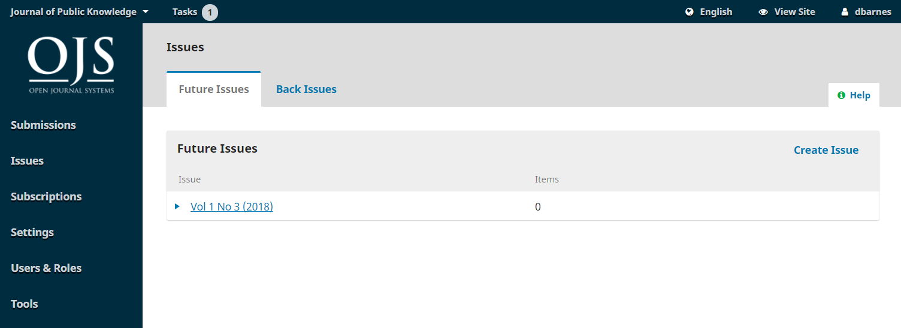
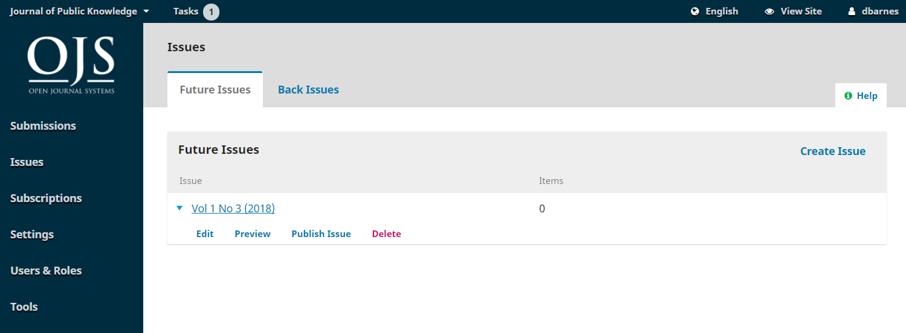
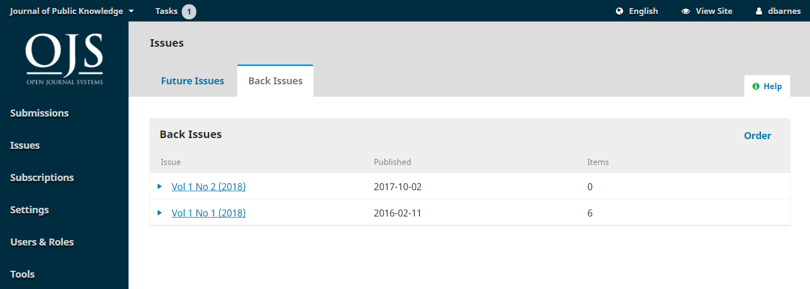

# Chapter 9: Issues

From the left menu, select Issues to manage all of the issues for your journal.

## Future Issues

Future Issues are all of your unpublished issues. You can create as many of these as you wish, and schedule submissions to any of them.

### Create Issue

To create a new issue, use the **Create Issue** link and fill in the form.

There are spaces to add volume, number, year, and title information \(e.g., Special Issue \#1\), as well as a description and a cover image \(if needed\).

### Edit Issue

You can also edit an existing future issue by selecting the blue arrow to the left of the issue entry on the Future Issues page.

This will reveal an Edit link, which will open a new window of information.

**Table of Contents**: For a new issue, this will be empty, but for issues that have had submissions scheduled, they will be listed here.

Use the blue arrow next to each submission to reveal links to go directly to the submission record \(more about this in Chapter 10\) or remove it.

You can also use the Order link to reorder the entries.

**Issue Data**: This provides access to the volume, issue, number data you entered when first creating the issue.

**Issue Galleys**: This allows you to upload galley of the complete issue -- e.g., one PDF containing all articles. This will be linked from the issue web page.

**Identifiers**: Use this space to add a DOI for the issue, if your journal supports issue-level identifiers.

### Preview Issue

Using that same blue arrow will also reveal a Preview link, letting you get a look at the issue before publishing it.

### Publish Issue

Once you are happy with the issue hit the Publish Issue link to publish it on your journal website.

By default, all registered users will be notified via email when a new issue is published from the list of Future Issues. To not send a notification of a new issue published, uncheck the box beside “Send notification email to all registered users” before pressing OK.

### Delete Issue

You can use the Delete link to remove the issue. Any assigned articles will revert to their unpublished status.

## Back Issues

This tab lists all of your published issues.

As with Future Issues, using the blue arrow will reveal similar options as described above \(Edit, Preview, etc.\).
