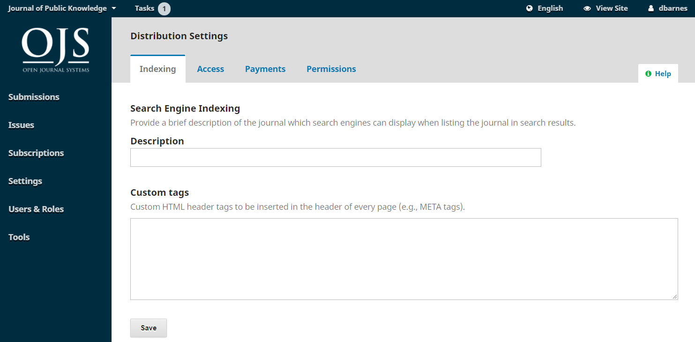
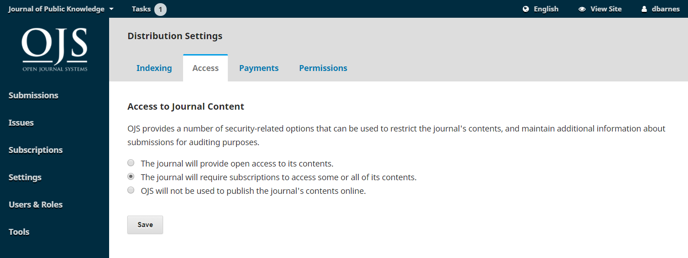
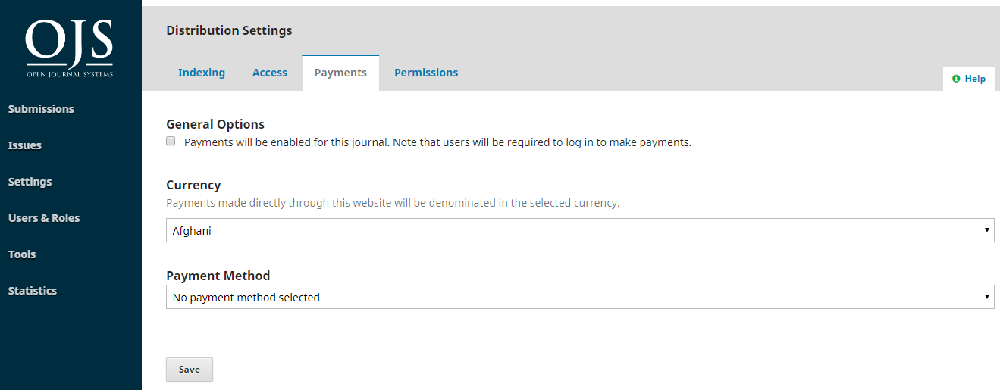
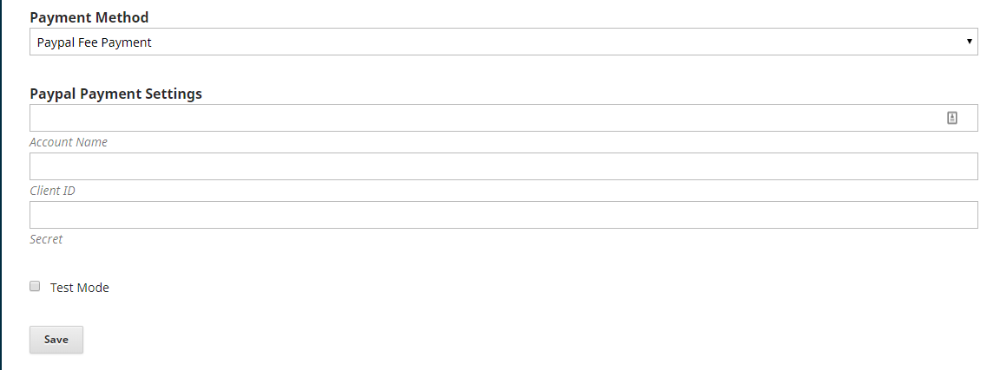
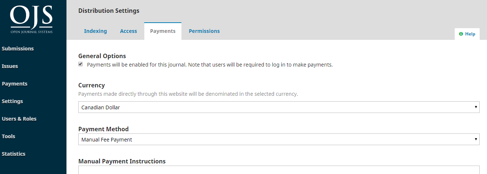
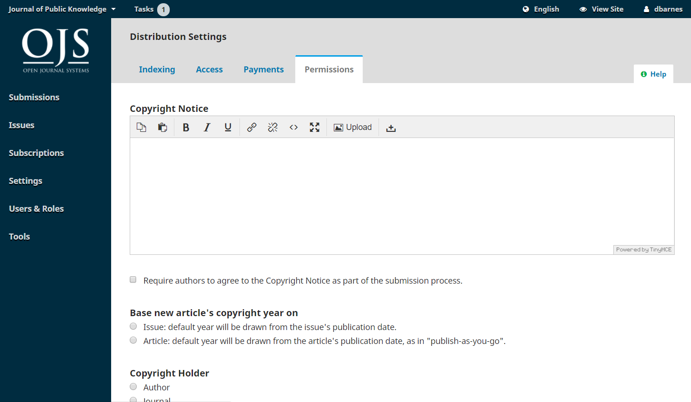

# Chapter 8: Distribution Settings

The Distribution Settings focus on helping to raise the visibility of your journal. The tabs consist of Indexing, Access, Payments, and Permissions.

## Indexing

This section helps you enhance your search engine optimization.



Use **Description** to provide a brief description of your journal for search engines.

Use **Custom Tags** to add custom HTML header tags to the header of every page of your journal, which can help your site get indexed by search engines. Tags need to be added as HTML elements. If you simply enter words they will appear at the top of every page of your site instead of in the site's metadata. Here is an example of text that could be entered in this field:

```
<meta name="description" content="The Journal of Public Knowledge. Publication of the Public Knowledge Project - PKP and Simon Fraser University - SFU" /><meta name="keywords" content="open access, scholarly publishing, open source software, non-profit organizations, scholarly journals, free software" /><meta name="author" content="metatags generator"><meta name="robots" content="index, follow"><meta name="revisit-after" content="3 month">
```

## Access

Under the Access tab you can configure whether you want your journal contents to be open access, available by subscription, or a combination. By default, the open access option is selected. However, if you wish to use OJS for a subscription journal, choose the second option (see next section on Payments for further information).



If you are only using OJS to manage your submission workflow and not publish your content, you can select "OJS will not be used to publish the journal's contents online."

OJS allows you to configure how and when content can be accessed at an article and issue level. When you create an issue, there is a tab called **Access** under which you can set the **Access Status** as **Subscription** or **Open Access**.

If you set it as **Subscription**, underneath that a box will appear where you can optionally enter an **Open Access Date**, at which the content will become open access.

Once you set it as **Subscription**, on the **Table of Contents** tab, a checkbox will appear beside each article under **Open Access**, where you can optionally set individual articles as open access, even if the rest of the issue remains available by subscription.

## Payments

OJS provides the ability to collect online payments and manage subscriptions and author fee payments.

Using the Paypal plugin, you can accept payments through Paypal, or you can accept manual payments (such as cheque, email transfer, etc.), but they must be made outside of OJS and are not automatically recorded in OJS.  If you would like to use a different payment service you will have to create your own plugin.

### Enable Payments

To use payments and subscriptions features, you first have to enable payments.

If you plan to accept Paypal and/or manual payments, go to Website Settings > Plugins and enable the Paypal Fee Payment Plugin and Manual Fee Payment Plugin.

If you plan to make your journal or articles available by subscription, go to Distribution Settings > Access and check off “The journal will require subscriptions to access some or all of its contents.”


Then go to Payments (the next tab) and check off “Payments will be enabled for this journal. Note that users will be required to log in to make payments.”



Select the currency you will use.

Select a fee payment method.

If you select Paypal Fee Payment, additional fields will appear.  You need to get this information from your Paypal account which you’ll set up on the Paypal website with the Paypal API. See the [Paypal Plugin Guide](https://docs.pkp.sfu.ca/using-paypal-for-ojs-and-ocs/en/) for more information.



If you select Manual Fee Payment, a field will appear where you can enter instructions that will appear to users who are making a manual payment.  For example, “Send a cheque payable to the Public Knowledge Project” to )))))”

Click Save.

A new menu item will appear on the main dashboard menu called “Payments” (or “Subscriptions,” depending on which version of OJS you are using).



Go to the [Subscriptions Chapter](./subscriptions.md) for further instructions on managing subscriptions and payments.

### Donations

In OJS 3.x there is not an option to set up a payment type for donations, to manage donations with the Payments module, or to use the Paypal plugin to accept donations. You can add the Donations block to your sidebar, but it will have to link to an external site where donation payments can be made.

## Permissions

This section covers copyright issues for your journal.



**Copyright Notice**: Add your journal's copyright statement here. It will be visible on the journal website.

Check the box to require authors to agree to your copyright statement.

**Base new article's copyright year on**: Choose whether the copyright date is based on the issue \(under a traditional, issue-based publishing model\) or on the article \(based on a continuous publishing model\).

**Copyright Holder**: Select who holds copyright to the articles published by your journal. The trend in open access publishing is to allow authors to retain copyright of their work.

**License**: Select the license for your journal. CC Attribution 4.0 is a widely used license for open access journals, allowing for maximum sharing and reuse.

**Reset Article Permissions**: If you journal later changes its licensing policy, use this button to reset the copyright on all published content.
