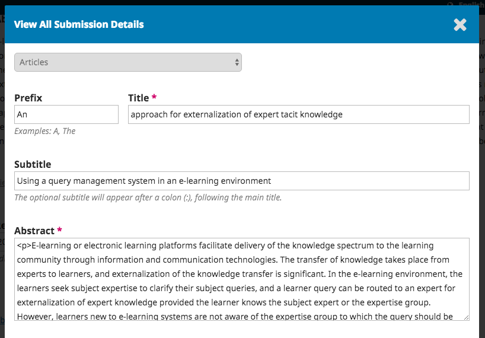

# Capítulo 15. Revisión
Como revisor, usted se enterará de la solicitud de revisión por correo electrónico o revisando su panel de control:

En la lista **Mis asignados**, busque el título y el enlace Revisar. Note la falta de información del autor en este proceso de revisión por pares doble-ciego.

Al seleccionar el enlace **Revisar**, accederá al primer paso de revisión del registro de envío, que es mucho más limitado que la vista del editor y no contiene información del autor.

Este primer paso consiste en las siguientes secciones:

* **Solicitud de revisión**: proporciona un texto que le invita a actuar como revisor.

* **Título del artículo**: proporciona el título del artículo.

* **Resumen**: proporciona el texto del resumen.

Más abajo en la pantalla, encontrará información adicional.

El enlace **Ver todos los detalles del envío** abrirá una ventana con información adicional, incluyendo todos los metadatos de no-autores:

Tenga en cuenta que ninguno de estos campos es editable por el revisor, y sólo se proporcionan para ayudarle a realizar una revisión exhaustiva.

Cierre esta ventana y desplácese más abajo en la pantalla. Desde aquí puede ver el Calendario de Revisión, incluyendo todas las fechas de vencimiento relevantes.

Desde aquí, puede rechazar o aceptar la revisión. Si lo rechaza, será eliminado del proceso. Si acepta, pasará al paso 2 de revisión, donde podrá leer cualquier guía para revisores proporcionada por la revista.

Presione **Continuar al paso 3**. Desde aquí puede descargar una copia de los archivos de revisión e introducir sus comentarios de revisión. La primera ventana es para comentarios al editor y al autor; la segunda ventana es sólo para el editor.

Una vez que haya leído el documento y agregado sus comentarios, desplácese hacia abajo por la página para cargar opcionalmente una copia marcada del archivo de revisión (recuerde quitar cualquier identificación personal del archivo antes de cargarlo).

A continuación, debe hacer su recomendación utilizando el menú desplegable.

Sus opciones incluyen:

* **Aceptar Envío**: está listo para pasar a Edición tal cual.
* **Revisiones Requeridas**: requiere cambios menores que pueden ser revisados y aceptados por el editor.
* **Reenvío para revisión**: requiere cambios importantes y otra ronda de revisión por pares.
* **Reenviar a otro lugar**: no parece ser una buena opción para el enfoque y alcance de esta revista.
* **Declinar el Envío**: tiene demasiada debilidad para ser aceptada.
* **Vea Comentarios**: si ninguna de las recomendaciones anteriores tiene sentido, puede dejar un comentario para el editor detallando sus preocupaciones.

Por último, pulse el botón **Enviar revisión** para completar la tarea. Se le pedirá que lo confirme.

Pulse **Ok** y aparecerá la pantalla de confirmación final agradeciéndole su trabajo.

¡Eso es todo! La revisión ya está completa.
