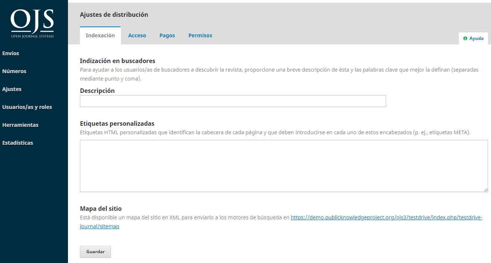
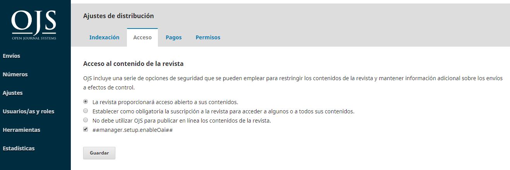
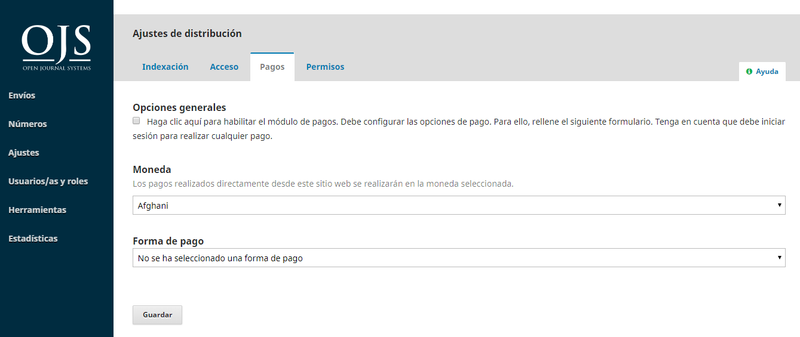
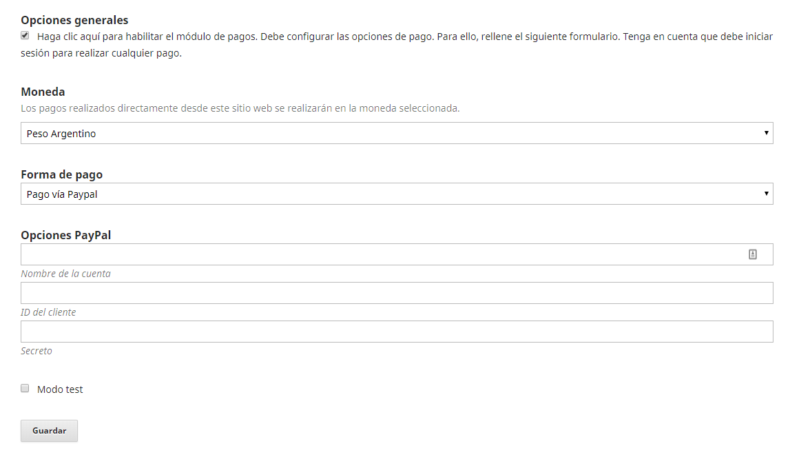
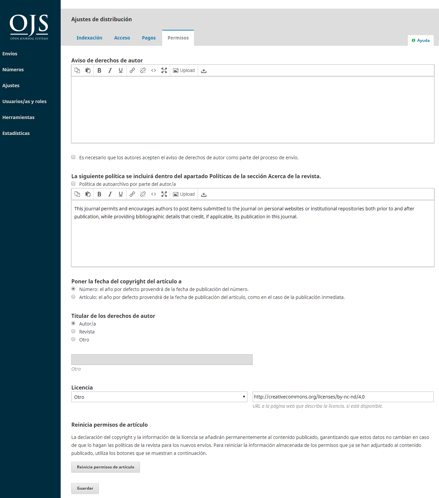

# Capítulo 8: Configuración de la distribución

La configuración de la distribución le ayuda a incrementar la visibilidad de su revista. Las pestañas incluyen Indización, Acceso, Pagos y Permisos.

## Indización

Esta sección le ayuda a mejorar su optimización de los motores de búsqueda.



Utilice la opción **Descripción** para proporcionar una descripción breve de su revista para los motores de búsqueda.

Utilice **Etiquetas personalizadas** para agregar etiquetas de encabezado HTML personalizadas al encabezado de cada página de su revista, lo cual puede ayudar a que su sitio web sea indizado por los motores de búsqueda. Las pestañas deben añadirse como elementos HTML. Si simplemente introduce palabras, estas aparecerán en la parte superior de cada página de su sitio web en lugar de en los metadatos del sitio. Aquí está un ejemplo de texto que puede ser introducido en este campo:

```
<meta name="description" content="The Journal of Public Knowledge. Publication of the Public Knowledge Project - PKP and Simon Fraser University - SFU" /><meta name="keywords" content="open access, scholarly publishing, open source software, non-profit organizations, scholarly journals, free software" /><meta name="author" content="metatags generator"><meta name="robots" content="index, follow"><meta name="revisit-after" content="3 month">
```

## Acceso

OJS proporciona una serie de opciones relacionadas con la seguridad que pueden ser utilizadas para restringir el contenido de la revista y mantener información adicional acerca de las presentaciones para fines de auditoría.



La opción de acceso abierto está seleccionada como la opción predeterminada. Sin embargo, si solo desea utilizar OJS para una revista de suscripción, elija la segunda opción. Esto también activará la sección de Suscripción en la barra lateral izquierda (se describirá información adicional sobre la Gestión de Suscripciones en un próximo capítulo).

Para la gestión editorial y no para la publicación, seleccione la última opción.

## Pagos

OJS proporciona la capacidad de recolectar pagos en línea. Utilice esta sección para determinar el tipo de **moneda** predeterminada (por ejemplo, Dólares Canadienses, Euros, etc.) y el **método de pago** (por ejemplo, Paypal).



La elección del **Pago manual de la cuota** le permitirá escribir algunas instrucciones para los usuarios (por ejemplo, dónde enviar un cheque por correo).

La elección de **Pago de Cuota con Paypal** le permitirá realizar algunos ajustes adicionales mediante los cuales usted puede agregar los detalles de su cuenta Paypal.



## Permisos

Esta sección cubre aspectos de derechos de autor para su revista.



**Aviso de Copyright**: Agregue aquí la declaración de derechos de autor de su revista. Esta declaración se mostrará en el sitio web de la revista.

Marque la casilla para pedir a los autores que declaren su acuerdo con su declaración de derechos de autor.

**Base el año de los derechos de autor de un artículo nuevo en**: Elija si la fecha de derechos de autor se basa en el número de publicación (bajo un modelo de publicación tradicional basado en números de publicaciones) o en el artículo (basado en un modelo de publicación continua).

**Titular de los derechos de autor**: Seleccione quién es el titular de los derechos de autor de los artículos publicados en su revista. La tendencia en la publicación de acceso libre es permitir a los autores conservar los derechos de autor de su trabajo.

**Licencia**: Seleccione la licencia para su revista. CC Attribution 4.0 es una licencia utilizada ampliamente para revistas de acceso libre, lo que permite maximizar la reutilización y el uso compartido.

**Restablecer los permisos del artículo**: Si su revista cambia su política de licencias posteriormente, utilice este botón para restablecer los derechos de autor de todo el contenido publicado.
