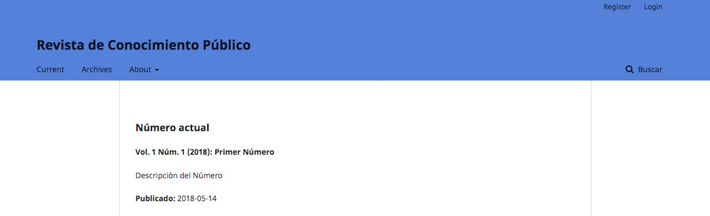
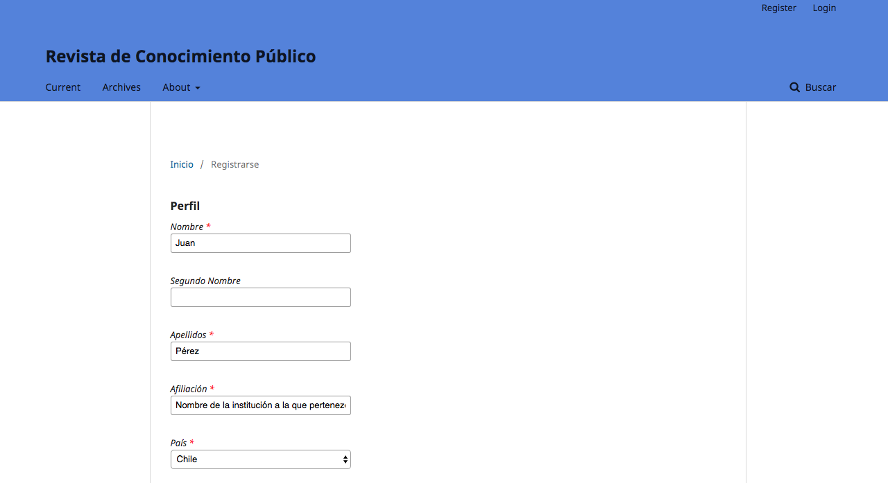
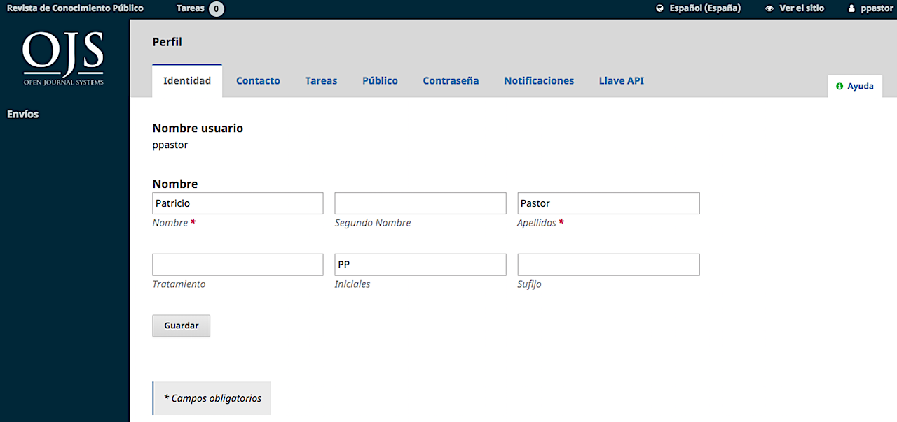
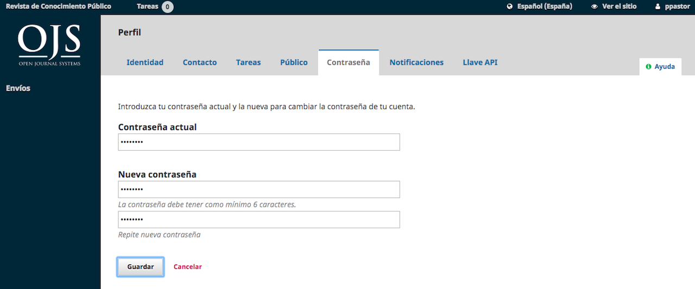

# Capítulo 3: Cuentas de usuario
OJS utiliza un sistema completo de roles para dividir el trabajo entre los usuarios, asignar flujos de trabajo y limitar el acceso a diferentes partes del sistema.

Dado que una instalación de OJS puede alojar varias revistas, los usuarios pueden inscribirse en diferentes funciones para más de una revista. Por ejemplo, una persona podría ser editora y autora de la misma revista, además de ser sólo autora en una revista, revisora en otra y editora en una tercera.

Cuando un usuario inicia sesión en el sistema, será llevado a su Tablero de Control. Desde aquí, verán todas las funciones del sistema al que tienen acceso. Por ejemplo, un Revisor sólo verá el envío que se le ha asignado, mientras que un Editor verá todos los envíos en el flujo de trabajo editorial.

## Roles en OJS
El flujo de trabajo de OJS gira en torno a diferentes roles para diferentes usuarios, permitiéndoles el acceso a diferentes partes del flujo de trabajo, y diferentes permisos y responsabilidades.

Los roles principales incluyen Administrador de Sitio, Administrador de la revista, Editor, Editor de Sección, Autor, Revisor, Copiador, Editor de Maquetación, Corrector y Lector.

OJS 3 también incluye funciones adicionales como traductor y diseñador. También puede crear nuevos roles o renombrar los existentes. Más información sobre la configuración de roles está disponible en el Capítulo 7.

### Administrador del Sitio
El Administrador del Sitio es responsable de la instalación general de OJS, asegurándose de que la configuración del servidor sea correcta, añadiendo archivos de idioma y creando nuevas revistas en la instalación. La cuenta del Administrador del Sitio se crea como parte del proceso de instalación. A diferencia de todas las demás funciones de OJS, sólo puede haber un Administrador del Sitio.

Consulte el Capítulo 4: Administración del sitio para obtener más detalles.

### Administrador de la revista
El Administrador de la revista es responsable de configurar el sitio web de la revista, configurar las opciones del sistema y administrar las cuentas de usuario. Esto no implica ningún conocimiento técnico avanzado, sino que implica rellenar formularios basados en la web y subir archivos.

El Administrador de la revista también inscribe a los Editores, Editores de Sección, Editores de Copiado, Editores de Maquetación, Correctores, Autores y Revisores.

El Administrador de la revista también tiene acceso a otras funciones de administración de la revista y puede crear nuevas secciones para la revista, configurar formularios de revisión, editar los mensajes de correo electrónico predeterminados, administrar las herramientas de lectura, ver estadísticas e informes y mucho más.

Muchos administradores de revistas también se inscriben como editores, lo que les permite administrar fácilmente tanto la configuración de la revista como los envíos en el flujo de trabajo editorial.

> Aunque el Administrador de revistas es una función específica de una revista, los administradores de revistas deben ser considerados generalmente como usuarios de confianza en todo el sistema, ya que tienen la capacidad de asumir las identidades de otros usuarios que pueden estar inscritos en otras revistas.

Consulte el Capítulo 5: Configuración de una revista para obtener más detalles.
### Autor
Los autores pueden enviar los manuscritos a la revista directamente a través del sitio web de la revista. Se pide al autor que cargue los archivos de envío y que proporcione metadatos o información de indexación (los metadatos mejoran la capacidad de búsqueda para la investigación en línea y para la revista). El Autor puede cargar múltiples archivos, en forma de conjuntos de datos, instrumentos de investigación o textos fuente que enriquecerán el artículo, así como también contribuir a formas más abiertas y robustas de investigación y erudición.

El autor puede hacer un seguimiento de la presentación a través del proceso de revisión y redacción, así como participar en la edición y corrección de las presentaciones aceptadas para su publicación, iniciando sesión en el sitio web de la revista.

Consulte el Capítulo 10: Autoría para obtener más detalles.

### Editor
El Editor supervisa todo el proceso de revisión, edición y publicación. El Editor, trabajando con el Administrador de la Revista, típicamente establece las políticas y procedimientos para la revista.

En el proceso editorial, el Editor asigna las presentaciones a los Editores de Sección para ver a través de la Revisión de las Presentaciones y la Edición de las Presentaciones. El Editor mantiene un ojo en el progreso de la presentación y ayuda con cualquier dificultad.

Una vez que se ha completado la revisión, el Editor típicamente ve el envío a través del proceso de Edición (incluyendo la corrección de estilo, producción y revisión) aunque en algunas revistas esto sigue siendo responsabilidad del Editor de Sección a cargo del proceso de revisión del envío.

El Editor también crea los números de la revista, programa los envíos para su publicación, organiza el Índice y publica el número como parte del Proceso de Publicación. El Editor puede restaurar los envíos archivados en las listas En revisión o En edición.

Muchos editores también se inscriben como gestores de revistas, lo que les permite gestionar fácilmente tanto el flujo de trabajo editorial como la configuración de la revista.

Consulte el Capítulo 11: Flujo de trabajo editorial para obtener más detalles.

### Editor de sección
El Editor de la Sección gestiona la revisión y edición de los envíos a los que han sido asignados. En algunos casos, un Editor de Sección que es asignado para ver los envíos a través del Proceso de Revisión también será responsable de ver los envios que son aceptados a través del proceso de Edición (es decir, a través de la edición, producción y corrección).

A menudo, sin embargo, los Editores de Sección sólo trabajan con el proceso de revisión, y un Editor, actuando en el papel de Editor de Sección, ve las presentaciones a través del proceso de Edición. La revista tendrá una política sobre cómo se dividen las tareas.

Consulte el Capítulo 11: Flujo de trabajo editorial para obtener más detalles.

### Revisor
El Revisor es seleccionado por el Editor o el Editor de Sección para revisar un envío. Se pide a los revisores que envíen sus reseñas al sitio web de la revista y pueden subir archivos adjuntos para uso del Editor y el Autor. Los revisores pueden ser calificados por los Editores de Sección, de nuevo dependiendo de las políticas de esta revista.

Consulte el Capítulo 8: Revisión para obtener más detalles.

### Corrector
El corrector edita las presentaciones para mejorar la gramática y la claridad, trabaja con los autores para asegurar que todo esté en su lugar, garantiza la estricta adhesión al estilo bibliográfico y textual de la revista y produce una copia limpia y editada para que un editor de maquetación o asistente de producción la convierta en las galeras que estarán en el formato publicado de la revista.

Algunas revistas tienen un editor o un editor de sección que desempeña este rol.

Consulte el Capítulo 11: Flujo de trabajo editorial para obtener más detalles.
### Editor de maquetas
El Editor de Maquetación transforma las versiones corregidas de la presentación en galeradas en HTML, PDF, XML, etc., archivos que la revista ha decidido utilizar para su publicación en línea.

> OJS no proporciona actualmente software para la conversión automática de documentos procesados por palabras a formatos de galeradas (aunque un proyecto está en desarrollo), por lo que el editor de maquetas debería tener acceso y poder utilizar paquetes de software de terceros para la creación de galeradas.

En algunos casos, el Editor o Editor de Sección también actuará como Editor de Maquetación.

Consulte el Capítulo 11: Flujo de trabajo editorial para obtener más detalles.
### Corrector de pruebas
El corrector lee atentamente las galeras en los diversos formatos en los que la revista publica (al igual que el autor). El Corrector (y el Autor) registran cualquier error tipográfico y de formato para que el Editor de Maquetación lo corrija.

En el caso de algunas revistas, el Editor o Editor de Sección también actuará como Corrector.

Consulte el Capítulo 11: Flujo de trabajo editorial para obtener más detalles.
### Lector
El rol Lector es el rol más simple en OJS, y tiene menos capacidades. Los lectores reciben un correo electrónico de notificación con la publicación de cada número, que incluye la Tabla de Contenidos para ese número en particular.

## Registro en una revista
Los visitantes no registrados de una revista normalmente pueden registrarse como Lectores, Autores y/o Revisores. Los administradores de revistas pueden eliminar la posibilidad de que los visitantes se registren por sí mismos, en cuyo caso aparecerá un aviso que indica que el registro está actualmente cerrado (consulte Configuración de revistas), pero los administradores de revistas siempre pueden registrar usuarios en cualquier momento y para cualquier función.

Para registrarse en una revista, haga clic en el enlace **Registrar** en la esquina superior derecha.

Esto abrirá el Formulario de Inscripción para que usted complete con toda la información requerida.

Todos los campos marcados con un asterisco (Nombre, Apellido, Afiliación, País, Correo electrónico, Nombre de usuario, Contraseña, Repetir contraseña) son obligatorios. Si la revista es multilingüe, deberá seleccionar el idioma que prefiera.

Usted se registrará automáticamente como Lector y Autor. También tendrá la opción de registrarse como Revisor.

Usted no podrá auto-registrarse para un rol editorial (por ejemplo, Editor, Editor de Sección, Copiador, Editor de Maquetación, Corrector, o Gerente de Revista). Si necesita inscribirse en ese nivel, póngase en contacto con un administrador de Revista o un administrador del sitio actual.

## Cómo ver y cambiar su perfil
Para ver y editar tu perfil, inicia sesión y haz clic en el enlace de tu nombre de usuario en la esquina superior derecha. Seleccione el enlace **Ver perfil**.

Desde aquí, seleccionando las diferentes pestañas, puede actualizar sus datos personales, información de contacto, cambiar sus funciones, añadir una imagen personal (que algunas revistas pueden publicar junto con su artículo o en una lista de editores), determinar su configuración de notificación o actualizar su contraseña.

## Restablecimiento de la contraseña
Puede restablecer su contraseña mediante:

* Inicio de sesión en la revista
* Seleccionando su nombre de usuario y Ver perfil en la esquina superior derecha de la pantalla
* Selección de la ficha Contraseña
* Introducir la contraseña actual y luego la nueva dos veces
* Presionando Guardar

Su clave está cambiada.
