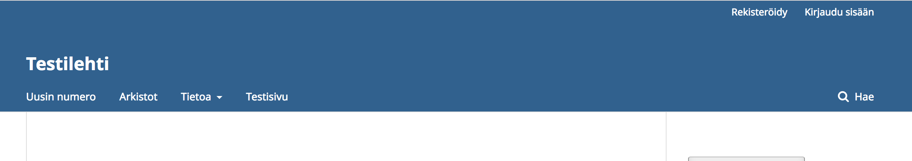
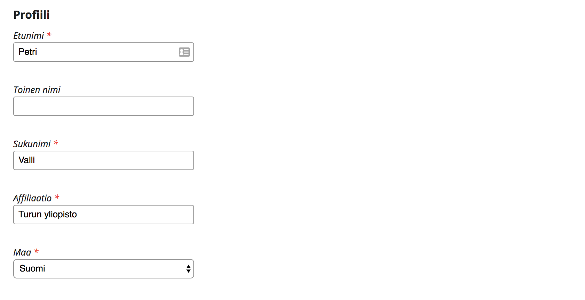
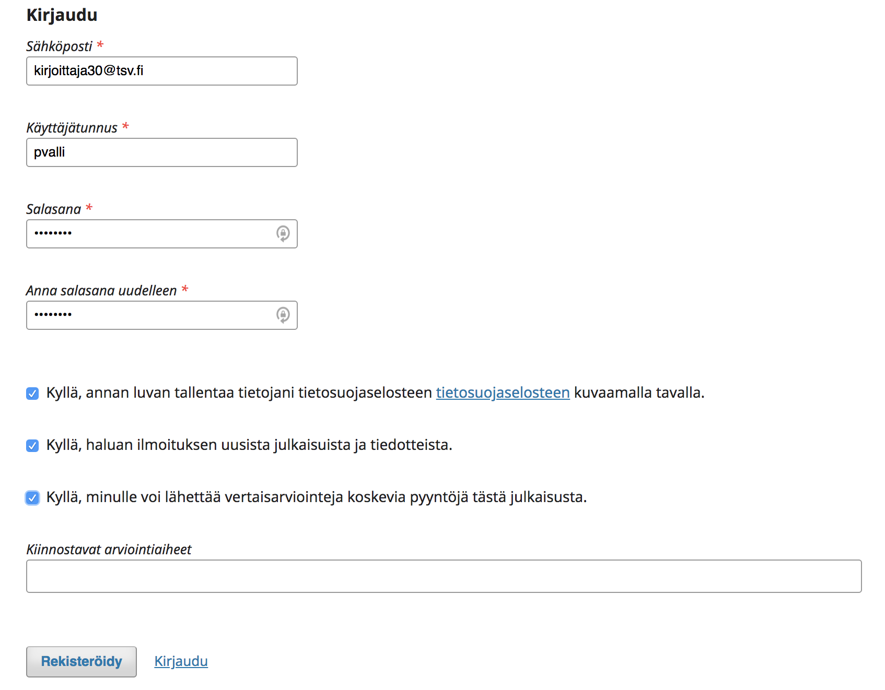
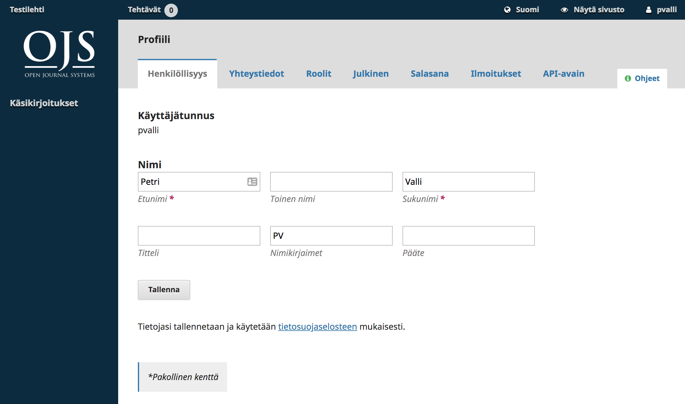
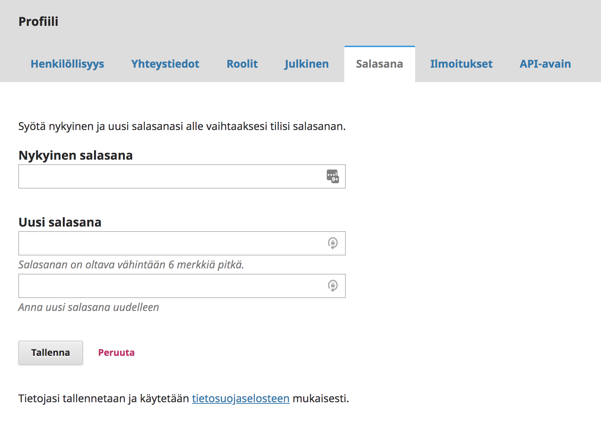

# Luku 3: Käyttäjätilit

OJS-järjestelmän käyttäjätilit ovat aina sivustokohtaisia. Jos samalla sivustolla ylläpidetään useita julkaisuja, kelpaa sama käyttäjätunnus kaikkiin lehtiin, eli käyttäjän ei tarvitse rekisteröityä uudelleen.

OJS-järjestelmän käyttöoikeuksia ja pääsyä erilaisiin järjestelmän toimintoihin hallitaan käyttäjäroolien avulla. Sama käyttäjä voi olla kirjoittajan roolissa yhdessä julkaisussa ja samaan aikaan toimittajan roolissa toisessa julkaisussa. 

Kun käyttäjä on kirjautunut sisään järjestelmään ja siirtyy omaan Hallintapaneeliin, näkymä riippuu niistä rooleista, joita käyttäjälle on annettu.

## Rekisteröityminen

Rekisteröityminen julkaisuun voi olla joissakin tilanteissa suljettu. Kun käyttäjä rekisteröityy OJS-järjestelmän johonkin julkaisuun, hän saa tavallisesti Lukija-roolin. Jotkin julkaisut antavat käyttäjälle mahdollisuuden tarjoutua myös arvioijaksi.

Kirjoittaja-roolin käyttäjä saa, kun hän lähettää ensimmäisen käsikirjoituksen julkaisuun.

Rekisteröityminen julkaisuun alkaa painamalla kohtaa **Rekisteröidy**, joka löytyy tavallisesti lehden kotisivun oikeasta yläkulmasta.

Linkistä avautuu rekisteröitymislomake, johon tulee täyttää pyydetyt tiedot.

Kaikki tähdellä merkityt kentät ovat pakollisia tietoja. Näitä ovat tavallisesti etunimi, sukunimi, affiliaatio, mmaa, sähköposti, käyttäjätunnus sekä salasana. Mikäli lehti on monikielinen, valitset lisäksi ensisijaisen kielen.

Tämän julkaisun tapauksessa saat automaattisesti Lukija-roolin ja voit myös halutessaisi valita Arvioija-roolin. Lomakkeen kautta ei voi rekisteröityä muihin rooleihin. Mikäli tarvitse jonkin toisen roolin julkaisussa, ota yhteyttä lehden toimittajaan.

## Käyttäjäprofiilin muokkaus

Käyttäjätilin luomisen jälkeen voit muokata omaa profiilia kirjautumalla sisään järjestelmään ja viemällä hiiren oikeaan yläkulmaan oman käyttäjätunnuksen päälle. Valitse avautuvasta vetovalikosta **Näytä profiili**.

Välilehdistä löytyvät kohdat mm. henkilötiedoille, yhteystiedoille, roolivalinnoille, julkiselle profiilille, salasanan vaihdolle sekä järjestelmän lähettämien ilmoitusten hallinnalle.

Rooleja ja ilmoituksia koskevat asetukset koskevat sitä lehteä, jonka sivuilla olet parhaillaan.

## Salasanan vaihtaminen

Jos unohdat salasanan, voit pyytää uuden valitsemalla lehden kotisivun oikeasta yläkulmasta linkin **Kirjaudu** ja avautuvalta sivulta linkin **Unohditko salasanasi?**. Avautuvaan lomakkeeseen annetaan oma sähköpostiosoite, johon järjestelmä lähettää uuden salasanan.

Jos haluat muuttaa salasanaasi, kirjaudu sisään järjestelmään, siirry käyttäjäprofiiliin ja sieltä Salasana-välilehdelle. Anna lomakkeeseen nykyinen salasana ja tämän jälkeen uusi salasana kahdesti ja paina **Tallenna**.

## Roolit OJS-järjestelmässä

OJS-järjestelmän käyttäjien käyttöoikeudet perustuvat käyttäjärooleihin.

Järjestelmän keskeisimmät rooli ovat sivuston hallinnoija, julkaisun hallinnoija, toimittaja, osastotoimittaja, kirjoittaja, arvioija, tekninen toimittaja, taittaja, oikolukija ja lukija.

Julkaisun ylläpitäjä voi luoda myös uusia rooleja omaan julkaisuun ja olemassaolevia rooleja voi nimetä uudelleen.

### Sivuston hallinnoija
Sivuston hallinnoija ylläpitää koko OJS-järjestelmän asennusta. Sivustolla on vain yksi hallinnoija.

### Julkaisun hallinnoija
Julkaisun hallinnoija vastaa yksittäisen julkaisun asetuksista ja käyttäjätilien ylläpidosta. Hallinnoija voi esimerkiksi luoda käyttäjätileja ja antaa rooleja oman julkaisun käyttäjille, muokata julkaisun osastoja, vaihtaa julkaisun kieliasetuksia, muokata sähköpostipohjia ja arviointilomakkeita sekä lukuisia muita julkaisun toimintaan liittyviä asetuksia.

Julkaisun hallinnoijan käyttöoikeustaso on *Julkaisun Hallinnoija*.

### Kirjoittaja

Käyttäjä saa käsikirjoituksen lähetyksen yhteydessä Kirjoittaja-roolin. Kirjoittaja pääsee lähettämään käsikirjoitustiedostoja ja lisäämään käsikirjoitusta koskevia kuvailutietoja. Kirjoittaja toimii käsikirjoituksen lähetyksen jälkeen kontaktihenkilönä, jolle toimittaja lähettää tietoja käsikirjoituksen etenemisestä toimitusprosessissa OJS-järjestelmä kautta. Toimitusprosessin aikana kirjoittaja voi lähettää käsikirjoituksesta uusia versioita ja vastata erilaisiin toimituskunnan kysymyksiin käsikirjoitukseensa liittyen.

Kirjoittajan käyttöoikeustaso on *Kirjoittaja*.

Katso tarkemmin [Luku 10: Kirjoittaja](./editorial-workflow.md).

### Editor

Toimittajilla on pääsy kaikkiin oman julkaisunsa käsikirjoituksiin ja niiden työnkulkuun. Toimittaja vastaa oman lehden toimituksellisesta linjasta määrittelemällä julkaisun asetukset yhteistyössä julkaisun hallinnoijan kanssa.

Toimittaja voi osoittaa käsikirjoituksia osastotoimittajille tai voi toimia itse käsikirjoituksen vastaavana toimittajana. Toimittaja vastaa myös julkaisun numeroiden hallinnoinnista ja julkaisusta.

Toimittajan käyttöoikeustaso on *Julkaisun Hallinnoija*.

Katso tarkemmin [Luku 11: Toimittajat](./editorial-workflow.md).

### Osastotoimittaja

Osastotoimittajat huolehtivat heille osoitettujen käsikirjoitusten toimitusprosessista. Joissakin julkaisuissa tämä koskee vain arviointivaihetta, mutta toisissa kaikkia vaiheita aina tuotantoon asti. Osastotoimittaja voi joissakin julkaisuissa antaa pelkästään ehdotuksia päätöksistä, jolloin toimittaja tekee kaikki lopulliset päätökset. Työtavat riippuvat lehden toimituksellisesta linjasta.

Osastotoimittajan käyttöoikeustaso on *Osastotoimittaja*.

Katso tarkemmin [Luku 11: Toimittajat](./editorial-workflow.md).

### Arvioija

Käyttäjä voi päätyä arviojaksi joko ilmoittamalla halukkuutensa rekisteröitymisen yhteydessä tai saamalla kutsun julkaisun toimittajalta tai osastotoimittajalta. Arvioija pääsee lukemaan OJS-järjestelmän kautta arviotavan tekstin ja voi lähettää arviointilomakkeen kautta sitä koskevat kommentit. Arvioija voi myös lähettää arvioon liittyviä liitetiedostoja.

Jotkin julkaisut ylläpitävät tietokantaa, johon he keräävät tietoja saamiensa arvioiden laadusta. Tämä arvio esitetään yksinkertaisena tähtiarviointina, johon on pääsy ainoastaan lehden toimituskunnalla.

Arvioijan käyttöoikeustaso on *Arvioija*.

Katso tarkemmin [Luku 12: Arvioijat](./reviewing.md).

### Tekninen toimittaja

Tekniset toimittajat vastaavat käsikirjoituksen oikeinkirjoituksesta, selkeydestä sekä teknisistä yksityiskohdista, kuten viitteistä. Kun käsikirjoitus siirtyy teknisen toimituksen vaiheeseen, toimittaja kutsuu teknisen toimittajan hoitamaan omaa osuuttaan. Tekninen toimittaja ei pääse käsikirjoituksen muihin työvaiheisiin. Joissakin julkaisuissa toimittaja tai osastotoimittaja huolehtii itse teknisestä toimittamisesta.

Teknisen toimittajan käyttöoikeustaso on *Avustaja*.

Katso tarkemmin [Luku 11: Toimittajat](./editorial-workflow.md).

### Taittaja

Taittaja muuntaa teknisen toimituksen läpikäyneen käsikirjoitukseen siihen muotoon, jossa se halutaan julkaista. Tämä voi olla esimerkiksi HTML-, PDF- tai XML-tiedosto. Taittotyö tapahtuu OJS-järjestelmän ulkopuolella.

Kun käsikirjoitus siirtyy tuotantovaiheeseen, toimittaja kutsuu taittajan hoitamaan omaa osuuttaan. Taittaja ei pääse käsikirjoituksen muihin työvaiheisiin. Joissakin julkaisuissa toimittaja tai osastotoimittaja huolehtii itse taittamisesta.

Taittajan käyttöoikeustaso on *Avustaja*.

Katso tarkemmin [Luku 11: Toimittajat](./editorial-workflow.md).

### Oikolukija

Oikolukija tarkistaa taitettujen käsikirjoitusten oikeinkirjoituksen ja esittää korjauspyynnöt taittajalle tai toimittajalle. Joidenkin julkaisujen tapauksessa oikuluvun suorittaa kirjoittaja ja/tai toimittaja.

Oikolukijan käyttöoikeustaso on *Avustaja*.

Katso tarkemmin [Luku 11: Toimittajat](./editorial-workflow.md).

### Lukija

Lukija-rooli on OJS-järjestelmän perusrooli, joka ei sisällä suoranaisesti mitään käyttöoikeuksia. Rooli annetaan kuitenkin kaikille julkaisuun rekisteröityville käyttäjille. Roolin valinta toisessa julkaisussa mahdollistaa esimerkiksi kyseisen julkaisun julkisten tiedotteiden vastaanoton sähköpostitse. Samat ilmoitukset on mahdollista saada myös valitsemalla myös jokin toinen rooli julkaisussa.

Lukijan käyttöoikeustaso on *Lukija*.

