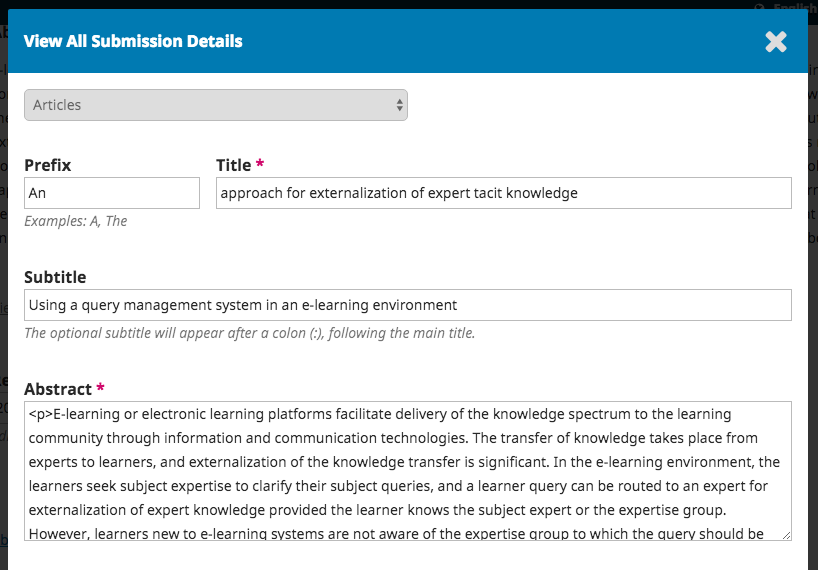
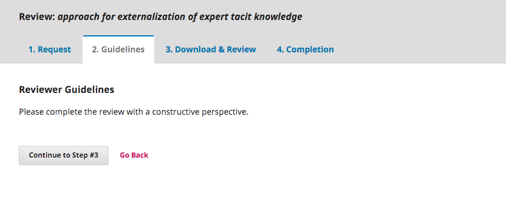

# Reviewing

As a reviewer, you will learn of the review request via email or by checking your dashboard:

From the My Assigned list, find the title and Review link. Notice the lack of any author information in this double-blind peer review process.

Selecting the Review link will take you to the first review step in the submission record, which is much more limited than the editor’s view, and contains no author information.

This first step consists of the following sections:

**Request for Review**: provides some text inviting you to act as a reviewer.

**Article Title**: provides the title of the article.

**Abstract**: provides the abstract text.

Further down the screen, you will find additional information.

The **View All Submission Details** link will open a window with additional information, including all of the non-author metadata:

Note that none of these fields are editable by the reviewer, and are only provided to help you conduct a thorough review.

Close this window and move further down the screen. From here you can see the Review Schedule, including all of the relevant due dates.

From here, you can decline or accept the review. If you decline, you will be dropped from the process. If you accept, you will move to review step 2, where you would be able to read any reviewer guidelines provided by the journal.

Hit **Continue** to move to step 3. From here you can download a copy of the review files and enter your review comments. The first window is for comments to the editor and the author; the second window is just for the editor.

Once you have read the paper and added your comments, scroll down the page to optionally upload a marked up copy of the review file (remember to strip any personal identification from the file before uploading it).

Next, you must then make your recommendation using the dropdown menu.

Your choices include:

**Accept Submission**: it is ready to go to Copyediting as is.

**Revisions Required**: it requires minor changes that can be reviewed and accepted by the editor.

**Resubmit for Review**: it requires major changes and another round of peer review.

**Resubmit Elsewhere**: it doesn’t seem like a good fit for the focus and scope of this journal.

**Decline Submission**: it has too many weakness to ever be accepted.

**See Comments**: if none of the above recommendations make sense, you can leave a comment for the editor detailing your concerns.

Finally, hit the Submit Review button to complete your task. You’ll be asked to confirm.

Hit OK. You will be taken to the final confirmation screen thanking you for your work.

That's it! The review is now complete.
