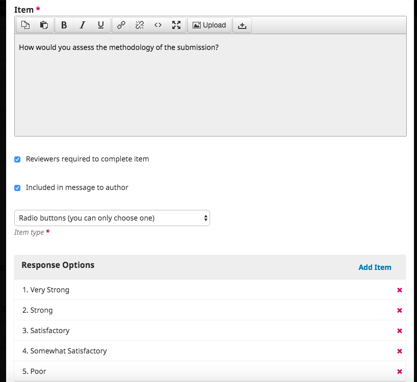

# Paramètres du flux des travaux

Les paramètres de flux des travaux vous permettent de configurer diverses parties du flux des travaux éditoriaux de la revue. The workflow setting has 4 main tabs.

## Apparence

Utilisez cette section pour configurer le processus de soumission.

### Éléments

This section determines what types of metadata will be collected during the submission process, such as keywords and references.

### Liste de vérifications

Les éléments sont les types de fichiers que les auteurs peuvent téléverser sur le site. En règle générale, un fichier sera le texte de l'article, et d'autres peuvent inclure des transcriptions d'entrevue, des données, des images, etc. Les éléments disponibles pour l'auteur au moment de sa soumission sont répertoriés ici.

En utilisant les liens fournis, vous pouvez modifier l' **ordre** des éléments (comment ils seront répertoriés pour l'auteur soumissionnaire), **ajouter un élément** (si quelque chose dont vous avez besoin n'est pas inclus par défaut - par exemple, vidéo), ou **restaurer les valeurs par défaut** ( si quelqu'un a fait trop de modifications et que vous voulez simplement tout réinitialiser).

#### Modifier un élément

Vous pouvez également modifier chaque élément en sélectionnant la flèche bleue à gauche du nom de l'élément. Cela révélera un lien pour Modifier et un lien pour Supprimer.

- **Nom** : il s'agit du nom de l'élément, tel que présenté à l'auteur.

- **Options**: Choose how the files associated with this component will be treated and displayed. Tout ce qui est marqué comme fichier dépendant ne sera pas publié.

- **File Type Grouping**: Determine whether this component is associated with the submission document, artwork, or is a supplementary file.

- **Clé** : symbole court facultatif pour l'élément.

### Directives aux auteurs-es

Dans la liste de vérifications  pour la préparation des soumissions, les auteurs doivent cocher leur accord avec chaque élément de cette liste. Utilisez le lien *Commander* pour modifier l'ordre des articles, utilisez le lien *Ajouter un article* pour créer un nouvel article et utilisez la flèche bleue à gauche du nom de l'article pour *modifier* un article existant.

### Configuration

Utilisez ce champ pour ajouter des informations pour vos auteurs qui seront utiles pendant le processus de soumission. Ces informations seront affichées sur le site Web de la revue.
-  Directives aux auteurs: Les directives recommandées incluent les types de fichiers requis pour le document de soumission, le format de citation préféré ou tout élément qui devrait être présent dans la soumission.

-  Avis de droit d'auteur: Il s'agit de l'accord de droit d'auteur entre l'auteur et la revue, et l'auteur accepte ces conditions au moment de la soumission.

## Installation

Cet onglet vous permet de configurer le processus d'évaluation  de votre revue.

### Installation

**Default Review Mode**: Select whether your journal will follow a double blind, blind, or open review process.

Utilisez le menu déroulant pour sélectionner le nombre de jours ou "Ne jamais rappeler" sous "Envoyer un rappel si un évaluateur n'a pas répondu à une demande d'examen dans le délai (jours) suivant la date d'échéance de la réponse" pour définir le nombre de jours qui peut passer après la date d'échéance avant que les examinateurs ne soient rappelés de faire une recommandation pour une soumission.

**Activer l'accès en un clic pour l'évaluateur-trice** : activez (par défaut) la première option pour fournir aux réviseurs un accès en un clic à la révision, en évitant d'avoir à accéder au site Web, à se connecter et à trouver la soumission. Pour des raisons de sécurité avec cette option, les éditeurs ne sont pas en mesure de modifier les adresses e-mail ou d'ajouter des CC ou des CCI avant d'envoyer des invitations aux évaluateurs-trices.

**Délai de réponse par défaut** : indiquez combien de temps les évaluateurs-trices ont pour décider d'accepter ou de refuser une demande d'évaluation de l'éditeur, et combien de temps ils ont pour faire une recommandation.

**Rappels automatisés par e-mail** : les évaluateurs seront automatiquement informés lorsqu'ils seront affectés à un examen; cependant, vous pouvez activer ou désactiver les e-mails de rappel pour les évaluateurs. Utilisez le menu déroulant pour sélectionner le nombre de jours ou "Ne jamais rappeler" sous "Envoyer un rappel si un évaluateur n'a pas répondu à une demande d'examen dans le délai (jours) suivant la date d'échéance de la réponse" pour définir le nombre de jours qui peut passer après la date d'échéance avant que les évaluateurs ne soient rappelés d'accepter ou de rejeter une demande d'examen.

**Directives pour l'évaluation** : fournissez à vos évaluateurs des critères pour juger de l'aptitude d'une soumission à être publiée dans la presse, qui peuvent inclure des instructions pour préparer une évaluation efficace et utile.

**Intérêts divergents** : ajoutez votre déclaration de politique de divulgation des intérêts divergents ici.

Notez que certains paramètres du système doivent être configurés par l'administrateur du site pour être en mesure d'envoyer des emails .Consultez le [Guide de l'Administrateur ](/admin-guide/fr/email) pour plus d'information. Voir le [Guide de l'Administrateur](/admin-guide/fr/email) pour plus d'information.

### Formulaire d'évaluation

**Créer un formulaire d'évaluation** : utilisez le lien "Créer un formulaire de révision" pour créer un nouveau formulaire.

**Type** : Sélectionnez Marketing, Permission, Rapports, Autre

### Configuration

Les formulaires d'évaluation fournissent aux évaluateurs un ensemble de questions auxquelles répondre. Cela peut aider à concentrer leurs commentaires de manière plus utile pour vous.

Appuyez sur le bouton **Enregistrer** pour enregistrer vos modifications.

La section "Description et instructions" fournit des informations sur le formulaire et quand l'utiliser pour les gestionnaires de journaux et les éditeurs. Ce contenu n'est pas inclus dans le formulaire que voient les évaluateurs. Vous pouvez ajouter des instructions et des directives pour les évaluateurs dans la section "Directives de révision" (ci-dessous).

**Les éléments de formulaire** sont des questions de formulaire.

Vous pouvez ensuite choisir le type de réponse, notamment:

N'oubliez pas de cliquer sur le bouton **Enregistrer** pour enregistrer vos modifications.

Utilisez l'onglet **Prévisualiser ** pour tester le formulaire.

You can then choose the type of response, including:

* case de saisi pour un seul mot
* zone de texte simple ligne
* zone de texte élargie  (pour des réponses plus longues)
* cases à cocher (dans lesquelles le réviseur peut sélectionner plusieurs réponses possibles)
* boutons radio (où l'évaluateur ne peut sélectionner qu'une seule réponse possible)
* case déroulante (également dans lequel les évaluateurs ne peuvent sélectionner qu'une seule réponse possible)

**Options de réponse** sont les sélections que vous rendez disponibles pour les cases à cocher, les boutons radio ou les cases déroulantes. Un bon exemple de réponse pour une case à cocher est une [échelle de Likert](https://en.wikipedia.org/wiki/Likert_scale) , où l'évaluateur ne doit choisir qu'une seule option: par exemple, bon, neutre, mauvais.

**Evaluation à l'aveugle** : cochez cette case pour afficher un lien vers des instructions permettant de garantir que tous les fichiers de soumission sont anonymisés.

Use the **Preview** tab to test out the form.

Une fois que vous avez envoyé le formulaire à un évaluateur, vous ne pourrez plus le modifier car cela modifierait l'enregistrement des évaluations existants à l'aide de ce formulaire. Si vous souhaitez apporter des modifications au formulaire d'évaluation à ce stade, vous pouvez copier le formulaire existant et créer une nouvelle version mise à jour.

**Blind Review**: Check this box to display a link for instructions on ensuring all submission files are anonymized.

## Bibliothèque de l'éditeur

Le/la dirécteur-trice de la revue et les rédacteurs peuvent télécharger des documents qu'ils aimeraient partager avec les autres utilisateurs de la bibliothèque de l'éditeur. Tout document ajouté dans cette zone sera visible dans la bibliothèque de documents d'un utilisateur dans la bibliothèque de soumission de son manuscrit.

Vous pouvez également télécharger ici un fichier que vous souhaitez rendre accessible au public via une URL, vers lequel vous pouvez créer un lien à partir d'autres parties de votre site, y compris les directives de l'auteur, la liste de contrôle de soumission ou une page statique.

**Nom** : titre du document que vous souhaitez voir apparaître à l'utilisateur

**Accès public** : l'activation de cette option permettra aux utilisateurs de télécharger ce fichier à l'aide du lien hypertexte fourni s'il est associé à un lien hypertexte dans d'autres parties de votre site de revue.

**Groupement par type de fichier** : déterminez si cet élément est associé au document de soumission, à l'illustration ou s'il s'agit d'un fichier supplémentaire.

**Signature** : Les informations de ce champ seront ajoutées au bas de chaque courriel envoyé par le système.

**Adresse de courriel pour les messages non remis** : une notification sera envoyée à cette adresse e-mail pour tout e-mail envoyé par le système qui ne parvient pas à être livré, par exemple lorsque l'adresse e-mail ciblée n'est plus valide.

## Courriels

### Installation

La section vous permet de configurer les courriels envoyés depuis le système.

Pour modifier un modèle:

**Bounce Address**: A notice will be sent to this email address of any system-sent emails that fail to deliver, such as when the targeted email address is no longer valid.

### Email Templates

OJS facilites la communication du flux des travaux via l'utilisation de courriels préparés. You can view and modify these prepared email templates here. Notez que certaines configurations sont obligatoires pour envoyer un e-mail. Voir le [Guide de l'Administrateur](/admin-guide/fr/email) pour plus d'information.

#### Modifier les modèles de courriel

Lorsque vous modifiez un modèle de courriel, vous modifiez ce qu'il dit à chaque fois qu'il est utilisé.  Pour les courriels envoyés volontairement, comme un message envoyé à un évaluateur lui demandant d'évaluer une soumission, vous pouvez également modifier le contenu du message au moment de son envoi. Cela modifie le contenu de ce message uniquement.

Pour désactiver un modèle:
1. Accédez aux Paramètres de flux de travail> Courriel> Modèles de courriel préparés
2. Cliquez sur la flèche bleue à côté du nom du modèle pour afficher les liens en dessous
3. Cliquez sur Modifier
4. Apportez des modifications au sujet et au corps du texte. Veillez à ne pas supprimer aucune balise telle que "{$ authorName}:" qui insèrent automatiquement le contenu d'une soumission.
5. Lorsque vous avez terminé les modifications, cliquez sur Enregistrer.

#### Désactiver les modèles de courriel

Tous les modèles sont activés par défaut lorsque vous installez OJS, mais vous pouvez désactiver certains modèles en cliquant sur le bouton Désactiver. La plupart des modèles qui peuvent être désactivés sont des messages envoyés automatiquement par OJS. La désactivation du modèle signifie que la notification automatique ne sera pas envoyée.

To disable a template:
1. Accédez aux Paramètres du flux de travail> Courriel> Modèles de courriel préparés
2. Cliquez sur la flèche bleue à côté du nom du modèle pour afficher les liens en dessous
3. Cliquez sur Désactiver (si le bouton n'apparaît pas, ce modèle ne peut pas être désactivé)

#### Recharger les modèles de courriel par défaut

Si vous avez modifié des modèles de courriel mais que vous souhaitez annuler les modifications et les restaurer à leur contenu par défaut, vous pouvez les réinitialiser:
1. Accédez aux Paramètres du flux de travail> Courriels> Modèles de courriel préparés
2. Cliquez sur Réinitialiser tous les modèles
3. Lorsque le message de confirmation apparaît, cliquez sur OK.

#### Ajouter un modèle de courriel

Cliquez sur le bouton **Ajouter un modèle de courriel** pour créer un modèle de courriel personnalisé que vous pouvez utiliser lors de la notification d'un utilisateur ou de l'ajout d'un participant à une soumission. Notez que dans les versions antérieures à OJS 3.1.2, vous pouvez créer un modèle de courriel personnalisé, mais il ne pourra être utilisé à aucun stade du flux de travail.

#### Filtres

Cliquez ici pour filtrer les modèles de courriel en fonction des éléments suivants: Activé, Désactivé, Modèle personnalisé. Vous pouvez également filtrer les modèles de courriel en fonction de la personne à partir de laquelle ils ont été envoyés et à qui ils sont envoyés.

#### Ajouter une pièce jointe à un courriel

There is no direct email attachment option in OJS 3, but you can upload and share public files via the Publisher Library:

1. Dans Paramètres> Flux des Travaux> Bibliothèque de l'éditeur> Ajouter un fichier, téléverser votre document et cochez la case "Accès public"
2. Cliquez sur "OK" pour l'URL à générer
3. Insérez l'URL dans votre courriel

Vous pouvez également choisir de modifier un modèle de courriel existant avec cette URL ou de le partager publiquement sur le site Web.

#### Descriptions des modèles

OJS 3.2 now provides a description for every template outlining the sender and recipient, stage of workflow.

Le tableau ci-dessous donne un aperçu des modèles de courriel préparés dans OJS 3.2. Notez que "Rédacteur" fait référence à tout type de rédacteur (par exemple rédacteur de journal, rédacteur de production, etc.). Les colonnes suivantes apparaissent dans le tableau:

- **Modèle** : le nom du modèle de courriel.
- **Description** : une description du modèle.
- **Expéditeur** : le nom ou la signature qui apparaîtra à la fin du message. Dans certains cas, le système envoie le message automatiquement mais l'expéditeur apparaît comme un utilisateur particulier.
- **Destinataire** : à qui le courriel peut être envoyé.
- Étape du **flux des travaux** : l'étape du flux des travaux dans laquelle ce modèle est utilisé.

| Modèle                                  | Description                                                                                                                                                                                                                                                                                                                                                                                                                                                                                                                                                        | Expéditeur                      | Destinataire                    | Flux de travail                 |
| --------------------------------------- | ------------------------------------------------------------------------------------------------------------------------------------------------------------------------------------------------------------------------------------------------------------------------------------------------------------------------------------------------------------------------------------------------------------------------------------------------------------------------------------------------------------------------------------------------------------------ | ------------------------------- | ------------------------------- | ------------------------------- |
| CITATION_EDITOR_AUTHOR_QUERY          | This email allows copyeditors to request additional information about references from authors.                                                                                                                                                                                                                                                                                                                                                                                                                                                                     | Réviseur/euse                   | Author                          | Ajouter l'article à une édition |
| COPYEDIT_REQUEST                        | Cet e-mail est envoyé par un rédacteur de rubrique au rédacteur d'une soumission pour lui demander de commencer le processus de révision. Il fournit des informations sur la soumission et comment y accéder.                                                                                                                                                                                                                                                                                                                                                      | Rédacteur/trice de Section      | Réviseur/euse                   | Ajouter l'article à une édition |
| EDITOR_ASSIGN                           | Ce courriel informe un rédacteur de rubrique quelle rédacteur lui a confié la tâche de superviser une soumission tout au long du processus d'édition. Il fournit des informations sur la soumission et comment accéder au site de la revue.                                                                                                                                                                                                                                                                                                                        | Rédacteur/Rédacteur de rubrique | Rédacteur/trice de Section      | Apparence                       |
| EDITOR_DECISION_ACCEPT                | Cet e-mail du rédacteur ou du rédacteur de rubrique à un auteur les informe d'une décision finale de «refus» concernant leur soumission.                                                                                                                                                                                                                                                                                                                                                                                                                           | Rédacteur/Rédacteur de rubrique | Author                          | Installation                    |
| EDITOR_DECISION_DECLINE               | Cet e-mail est envoyé à l'auteur si le rédacteur refuse sa soumission dans un premier temps, avant l'étape d'évaluation                                                                                                                                                                                                                                                                                                                                                                                                                                            | Rédacteur/Rédacteur de rubrique | Author                          | Installation                    |
| EDITOR_DECISION_INITIAL_DECLINE       | Cet e-mail du rédacteur ou du rédacteur de rubrique à un auteur les informe d'une décision finale de "re-soumettre" concernant leur soumission.                                                                                                                                                                                                                                                                                                                                                                                                                    | Rédacteur/Rédacteur de rubrique | Author                          | Apparence                       |
| EDITOR_DECISION_RESUBMIT              | Cet e-mail du rédacteur ou du rédacteur de rubrique à un auteur les notifie d'une décision finale de «révisions requises» concernant leur soumission.                                                                                                                                                                                                                                                                                                                                                                                                              | Rédacteur/Rédacteur de rubrique | Author                          | Installation                    |
| EDITOR_DECISION_REVISIONS             | Cet e-mail du rédacteur ou du rédacteur de rubrique à un auteur l'informe que sa soumission est envoyée à une évaluation externe.                                                                                                                                                                                                                                                                                                                                                                                                                                  | Rédacteur/Rédacteur de rubrique | Author                          | Installation                    |
| EDITOR_DECISION_SEND_TO_EXTERNAL    | Cet e-mail du rédacteur ou du rédacteur de rubrique à un auteur l'informe que sa soumission est envoyée en production.                                                                                                                                                                                                                                                                                                                                                                                                                                             | Rédacteur/Rédacteur de rubrique | Author                          | Installation                    |
| EDITOR_DECISION_SEND_TO_PRODUCTION  | Cet e-mail du rédacteur de recommandation ou du rédacteur de rubrique aux rédacteurs décisionnaires ou aux rédacteurs de rubrique les notifie d'une recommandation finale concernant la soumission.                                                                                                                                                                                                                                                                                                                                                                | Rédacteur/Rédacteur de rubrique | Author                          | Production                      |
| EDITOR_RECOMMENDATION                   | Cet e-mail du rédacteur ou du rédacteur de rubrique à un auteur les informe d'une décision finale «d'accepter la soumission» concernant leur soumission.                                                                                                                                                                                                                                                                                                                                                                                                           | Directeur/trice de la Revue     | Rédacteur/Rédacteur de rubrique | Installation                    |
| EMAIL_LINK                              | Ce modèle de courriel offre à un lecteur inscrit la possibilité d'envoyer des informations sur un article à quelqu'un qui pourrait être intéressé. Il est disponible via les outils de lecture et doit être activé par le/la directeur-trice de la revue dans la page d'administration des outils de lecture.                                                                                                                                                                                                                                                      | Éditeur de Mise en Page         | Rédacteur                       |                                 |
| LAYOUT_COMPLETE                         | Cet e-mail du rédacteur de mise en page aux rédacteurs de rubrique les informe que le processus de mise en page est terminé.                                                                                                                                                                                                                                                                                                                                                                                                                                       | Rédacteur                       | Rédacteur/Rédacteur de rubrique | Production                      |
| LAYOUT_REQUEST                          | Cet e-mail du rédacteur de rubrique aux rédacteurs de mise en page les informe qu'ils ont reçu la tâche de modifier la mise en page d'une soumission. Il fournit des informations sur la soumission et comment y accéder.                                                                                                                                                                                                                                                                                                                                          | Rédacteur/Rédacteur de rubrique | Rédacteur                       | Production                      |
| LOCKSS_EXISTING_ARCHIVE               | Cet e-mail demande au détenteur d'une archive LOCKSS d'envisager d'inclure cette revue dans ses archives. Il fournit l'URL du manifeste de l'éditeur LOCKSS de la revue.                                                                                                                                                                                                                                                                                                                                                                                           | LOCKSS                          | Éditeur de Mise en Page         | Post-production / indexation    |
| LOCKSS_NEW_ARCHIVE                    | Cet e-mail encourage le destinataire à participer à l'initiative LOCKSS et à inclure cette revue dans les archives. Il fournit des informations sur l'initiative LOCKSS et les moyens de s'impliquer.                                                                                                                                                                                                                                                                                                                                                              | LOCKSS                          | Directeur/trice de la Revue     | Post-production / indexation    |
| MANUAL_PAYMENT_NOTIFICATION           | Ce modèle d'e-mail est utilisé pour notifier le rédacteur d'un article OFR réservé.                                                                                                                                                                                                                                                                                                                                                                                                                                                                                | Author                          | Rédacteur                       |                                 |
| NOTIFICATION                            | The email is sent to registered users that have selected to have this type of notification emailed to them.                                                                                                                                                                                                                                                                                                                                                                                                                                                        | System                          | Système                         |                                 |
| NOTIFICATION_CENTER_DEFAULT           | Ce modèle de courriel est utilisé pour collecter les identifiants ORCID des auteurs.                                                                                                                                                                                                                                                                                                                                                                                                                                                                               |                                 |                                 |                                 |
| OFR_CANCEL_RESERVATION                | This email template is used to notify the editor for a cancelled OFR item reservation.                                                                                                                                                                                                                                                                                                                                                                                                                                                                             | Rédacteur/Rédacteur de rubrique | Rédacteur/Rédacteur de rubrique | Installation                    |
| OFR_NEW_RESERVATION                   | This email template is used to notify the editor for a reserved OFR item.                                                                                                                                                                                                                                                                                                                                                                                                                                                                                          | Rédacteur/Rédacteur de rubrique | Rédacteur/Rédacteur de rubrique | Installation                    |
| OPEN_ACCESS_NOTIFY                    | Cet e-mail est envoyé à un utilisateur enregistré lorsqu'il a réussi à réinitialiser son mot de passe en suivant le processus décrit dans l'e-mail PASSWORD_RESET_CONFIRM.                                                                                                                                                                                                                                                                                                                                                                                       | Système                         | System                          | Évaluation                      |
| ORCID_COLLECT_AUTHOR_ID               | This email template is used to collect the ORCID id's from authors.                                                                                                                                                                                                                                                                                                                                                                                                                                                                                                | Système                         | Author                          | Apparence                       |
| ORCID_REQUEST_AUTHOR_AUTHORIZATION    | Ce modèle de courriel est utilisé pour informer un directeur de revue qu'un paiement manuel a été demandé.                                                                                                                                                                                                                                                                                                                                                                                                                                                         | Système                         | Author                          | Apparence                       |
| PASSWORD_RESET                          | Cet e-mail est envoyé à un évaluateur nouvellement inscrit pour l'accueillir dans le système et lui fournir un enregistrement de son nom d'utilisateur et de son mot de passe.                                                                                                                                                                                                                                                                                                                                                                                     | System                          | Système                         |                                 |
| PASSWORD_RESET_CONFIRM                | Cet e-mail est envoyé à un utilisateur enregistré lorsqu'il indique qu'il a oublié son mot de passe ou ne parvient pas à se connecter. Il fournit une URL qu'ils peuvent suivre pour réinitialiser leur mot de passe.                                                                                                                                                                                                                                                                                                                                              | System                          | Système                         |                                 |
| New Issue Published                     | This email is sent to registered readers via the "Notify Users" link in the Editor's User Home. It notifies readers of a new issue and invites them to visit the journal at a supplied URL.                                                                                                                                                                                                                                                                                                                                                                        | System                          | Rédacteur/Rédacteur de rubrique | Évaluation                      |
| REVIEWER_REGISTER                       | Cet e-mail est envoyé par un évaluateur au rédacteur de rubrique en réponse à une demande d'évaluation pour informer le rédacteur de rubrique que la demande d'évaluation a été acceptée et sera complétée à la date spécifiée.                                                                                                                                                                                                                                                                                                                                    | System                          | Rédacteur/Rédacteur de rubrique |                                 |
| REVIEW_ACK                              | Cet e-mail est envoyé par un évaluateur au rédacteur de rubrique en réponse à une demande d'évaluation pour informer le rédacteur de rubrique que la demande de évaluation a été refusée.                                                                                                                                                                                                                                                                                                                                                                          | Évaluateur                      | Rédacteur/Rédacteur de rubrique | Installation                    |
| REVIEW_CANCEL                           | Cet e-mail est envoyé par le rédacteur de rubrique à un évaluateur qui a une évaluation de soumission en cours pour l'informer qu'une évaluation annulée a été rétablie.                                                                                                                                                                                                                                                                                                                                                                                           | Rédacteur/Rédacteur de rubrique | Rédacteur/Rédacteur de rubrique | Installation                    |
| REVIEW_CONFIRM                          | Cet e-mail est envoyé par un rédacteur de rubrique pour rappeler à un évaluateur que son évaluation est due.                                                                                                                                                                                                                                                                                                                                                                                                                                                       | Rédacteur/Rédacteur de rubrique | Rédacteur/Rédacteur de rubrique | Installation                    |
| REVIEW_DECLINE                          | Cet e-mail est envoyé par un rédacteur de rubrique pour confirmer la réception d'une évaluation terminée et remercier l'évaluateur pour ses contributions.                                                                                                                                                                                                                                                                                                                                                                                                         | Rédacteur/Rédacteur de rubrique | Rédacteur/Rédacteur de rubrique | Installation                    |
| REVIEW_REINSTATE                        | Cet e-mail est automatiquement envoyé au rédacteur affecté lorsque l'auteur télécharge une version révisée d'un article.                                                                                                                                                                                                                                                                                                                                                                                                                                           | Rédacteur/Rédacteur de rubrique | Rédacteur/Rédacteur de rubrique | Installation                    |
| REVIEW_REMIND                           | Cet e-mail est envoyé par un rédacteur de rubrique pour rappeler à un évaluateur que son évaluation est due.                                                                                                                                                                                                                                                                                                                                                                                                                                                       | Rédacteur/Rédacteur de rubrique | Rédacteur/Rédacteur de rubrique | Installation                    |
| REVIEW_REMIND_AUTO                    | Cet e-mail est automatiquement envoyé lorsque la date d'échéance d'un évaluateur est écoulée (voir Options d'évaluation  sous Paramètres> Flux des travaux> Évaluation) et que l'accès en un clic est désactivé. Les tâches planifiées doivent être activées et configurées (voir le fichier de configuration du site).                                                                                                                                                                                                                                            | System                          | Rédacteur/Rédacteur de rubrique | Installation                    |
| REVIEW_REMIND_AUTO_ONECLICK           | Cet e-mail est automatiquement envoyé lorsque la date d'échéance d'un évaluateur est écoulée (voir Options d'évaluation  sous Paramètres> Flux des travaux> Évaluation) et que l'accès en un clic est désactivé. Les tâches planifiées doivent être activées et configurées (voir le fichier de configuration du site).                                                                                                                                                                                                                                            | System                          | Évaluateur                      | Installation                    |
| REVIEW_REMIND_ONECLICK                | Cet e-mail est envoyé par un rédacteur de rubrique pour rappeler à un évaluateur que son évaluation est due.                                                                                                                                                                                                                                                                                                                                                                                                                                                       | Rédacteur/Rédacteur de rubrique | Rédacteur/Rédacteur de rubrique | Installation                    |
| REVIEW_REQUEST                          | Cet e-mail envoyé par le rédacteur de rubrique à un évaluateur demande à l'évaluateur d'accepter ou de refuser la tâche d'évaluation d'une soumission. Il fournit des informations sur la soumission telles que le titre et le résumé, une date d'échéance de la révision et comment accéder à la soumission elle-même. Ce message est utilisé lorsque le processus d'évaluation standard est sélectionné dans Gestion> Paramètres> Flux des Travaux> Évaluation. (Sinon, voir REVIEW_REQUEST_ATTACHED.)                                                         | Rédacteur/Rédacteur de rubrique | Rédacteur/Rédacteur de rubrique | Installation                    |
| REVIEW_REQUEST_ATTACHED               | Cet e-mail est envoyé par le rédacteur de rubrique à un évaluateur pour lui demander d'accepter ou de refuser la tâche d'évaluation d'une soumission. Il comprend la soumission en pièce jointe. Ce message est utilisé lorsque le processus d'évaluation des pièces jointes aux e-mails est sélectionné dans Gestion> Paramètres> Flux des travaux>Évaluation. (Sinon, consultez REVIEW_REQUEST.)                                                                                                                                                                 | Rédacteur/Rédacteur de rubrique | Rédacteur/Rédacteur de rubrique | Installation                    |
| REVIEW_REQUEST_ATTACHED_SUBSEQUENT    | Cet e-mail est envoyé par le rédacteur de rubrique à un évaluateur pour lui demander d'accepter ou de refuser la tâche de évaluation d'une soumission pour un deuxième cycle de révision ou plus. Il comprend la soumission en pièce jointe. Ce message est utilisé lorsque le processus d'évaluation des pièces jointes aux e-mails est sélectionné dans Gestion> Paramètres> Flux des travaux>Évaluation. (Sinon, consultez REVIEW_REQUEST_SUBSEQUENT.)                                                                                                        | Rédacteur/Rédacteur de rubrique | Rédacteur/Rédacteur de rubrique | Installation                    |
| REVIEW_REQUEST_ONECLICK               | Cet e-mail envoyé par le rédacteur de rubrique à un évaluateur demande à l'évaluateur d'accepter ou de refuser la tâche d'évaluation d'une soumission. Il fournit des informations sur la soumission telles que le titre et le résumé, une date d'échéance de la révision et comment accéder à la soumission elle-même. Ce message est utilisé lorsque le processus d'évaluation standard est sélectionné dans Gestion> Paramètres> Flux des Travaux> Évaluation et que l'accès de l'évaluateur en un clic est activé.                                             | Rédacteur/Rédacteur de rubrique | Rédacteur/Rédacteur de rubrique |                                 |
| REVIEW_REQUEST_ONECLICK_SUBSEQUENT    | Cet e-mail du rédacteur de rubrique adressé à un évaluateur demande à l'évaluateur d'accepter ou de refuser la tâche d'évaluation d'une soumission pour un deuxième cycle de révision ou plus. Il fournit des informations sur la soumission telles que le titre et le résumé, une date d'échéance de la révision et comment accéder à la soumission elle-même. Ce message est utilisé lorsque le processus d'évaluation standard est sélectionné dans Gestion> Paramètres> Flux des Travaux> Évaluation et que l'accès de l'évaluateur en un clic est activé.     | Rédacteur/Rédacteur de rubrique | Rédacteur/Rédacteur de rubrique | Installation                    |
| REVIEW_REQUEST_REMIND_AUTO            | Cet e-mail est automatiquement envoyé lorsque la date d'échéance de la confirmation d'un évaluateur est écoulée (voir Options de révision sous Paramètres> Flux des Travaux> Évaluateur) et que l'accès en un clic de l'évaluateur est activé. Les tâches planifiées doivent être activées et configurées (voir le fichier de configuration du site).                                                                                                                                                                                                              | System                          | Rédacteur/Rédacteur de rubrique | Installation                    |
| REVIEW_REQUEST_REMIND_AUTO_ONECLICK | Cet e-mail est automatiquement envoyé lorsque la date d'échéance de la confirmation d'un évaluateur est écoulée (voir Options de révision sous Paramètres> Flux des travaux> Évaluation) et que l'accès de l'évaluateur en un clic est désactivé. Les tâches planifiées doivent être activées et configurées (voir le fichier de configuration du site).                                                                                                                                                                                                           | System                          | Rédacteur/Rédacteur de rubrique | Installation                    |
| REVIEW_REQUEST_SUBSEQUENT             | Cet e-mail du rédacteur de rubrique adressé à un évaluateur demande à l'évaluateur d'accepter ou de refuser la tâche d'évaluation d'une soumission pour un deuxième cycle de révision ou plus. Il fournit des informations sur la soumission telles que le titre et le résumé, une date d'échéance de la révision et comment accéder à la soumission elle-même. Ce message est utilisé lorsque le processus d'évaluation standard est sélectionné dans Gestion> Paramètres> Flux des Travaux> Évaluation. (Sinon, consultez REVIEW_REQUEST_ATTACHED_SUBSEQUENT.) | Rédacteur/Rédacteur de rubrique | Rédacteur/Rédacteur de rubrique | Installation                    |
| REVISED_VERSION_NOTIFY                | Cet e-mail, lorsqu'il est activé, est automatiquement envoyé aux autres auteurs qui ne sont pas des utilisateurs dans OJS spécifié lors du processus de soumission.                                                                                                                                                                                                                                                                                                                                                                                                | System                          | Rédacteur/Rédacteur de rubrique | Installation                    |
| STATISTICS_REPORT_NOTIFICATION        | Cet e-mail est automatiquement envoyé tous les mois aux rédacteurs  et aux directeurs de la revue pour leur fournir un aperçu de l'intégrité du système.                                                                                                                                                                                                                                                                                                                                                                                                           | System                          | Abonné                          |                                 |
| SUBMISSION_ACK                          | Cet e-mail, lorsqu'il est activé, est automatiquement envoyé à un auteur lorsqu'il termine le processus de soumission d'un manuscrit à la revue. Il fournit des informations sur le suivi de la soumission tout au long du processus et remercie l'auteur pour la soumission.                                                                                                                                                                                                                                                                                      | System                          | Author                          | Apparence                       |
| SUBMISSION_ACK_NOT_USER               | This email, when enabled, is automatically sent to the other authors who are not users within OJS specified during the submission process.                                                                                                                                                                                                                                                                                                                                                                                                                         | System                          | Abonné                          | Apparence                       |
| SUBSCRIPTION_AFTER_EXPIRY             | Cet e-mail informe un abonné que son abonnement a expiré. Il fournit l'URL du journal ainsi que les instructions d'accès.                                                                                                                                                                                                                                                                                                                                                                                                                                          | System                          | Responsable des abonnements     |                                 |
| SUBSCRIPTION_AFTER_EXPIRY_LAST        | Cet e-mail informe un abonné que son abonnement a expiré. Il fournit l'URL du journal ainsi que les instructions d'accès.                                                                                                                                                                                                                                                                                                                                                                                                                                          | System                          | Responsable des abonnements     |                                 |
| SUBSCRIPTION_BEFORE_EXPIRY            | Cet e-mail informe un abonné que son abonnement va bientôt expirer. Il fournit l'URL du journal ainsi que les instructions d'accès.                                                                                                                                                                                                                                                                                                                                                                                                                                | System                          | Responsable des abonnements     |                                 |
| SUBSCRIPTION_NOTIFY                     | Cet e-mail informe un lecteur inscrit que le Manager a créé un abonnement pour lui. Il fournit l'URL du journal ainsi que les instructions d'accès.                                                                                                                                                                                                                                                                                                                                                                                                                | System                          | Responsable des abonnements     |                                 |
| SUBSCRIPTION_PURCHASE_INDL            | Cet e-mail informe le responsable des abonnements qu'un abonnement individuel a été acheté en ligne. Il fournit des informations récapitulatives sur l'abonnement et un lien d'accès rapide à l'abonnement acheté.                                                                                                                                                                                                                                                                                                                                                 | System                          | Utilisateur                     |                                 |
| SUBSCRIPTION_PURCHASE_INSTL           | Cet e-mail informe le responsable des abonnements qu'un abonnement individuel a été acheté en ligne. Il fournit des informations récapitulatives sur l'abonnement et un lien d'accès rapide à l'abonnement acheté.                                                                                                                                                                                                                                                                                                                                                 | System                          | Utilisateur                     |                                 |
| SUBSCRIPTION_RENEW_INDL               | Cet e-mail informe le gestionnaire d'abonnements qu'un abonnement individuel a été renouvelé en ligne. Il fournit des informations récapitulatives sur l'abonnement et un lien d'accès rapide à l'abonnement renouvelé.                                                                                                                                                                                                                                                                                                                                            | System                          | Utilisateur                     |                                 |
| SUBSCRIPTION_RENEW_INSTL              | Cet e-mail informe le gestionnaire d'abonnements qu'un abonnement individuel a été renouvelé en ligne. Il fournit des informations récapitulatives sur l'abonnement et un lien d'accès rapide à l'abonnement renouvelé.                                                                                                                                                                                                                                                                                                                                            | System                          | Utilisateur                     |                                 |
| USER_REGISTER                           | Cet e-mail est envoyé à un utilisateur nouvellement enregistré pour l'accueillir dans le système et lui fournir un enregistrement de son nom d'utilisateur et de son mot de passe.                                                                                                                                                                                                                                                                                                                                                                                 | System                          | Utilisateur enregistré          |                                 |
| USER_VALIDATE                           | Cet e-mail est envoyé à un utilisateur nouvellement enregistré pour valider son compte de messagerie.                                                                                                                                                                                                                                                                                                                                                                                                                                                              | System                          | Utilisateur enregistré          |                                 |
