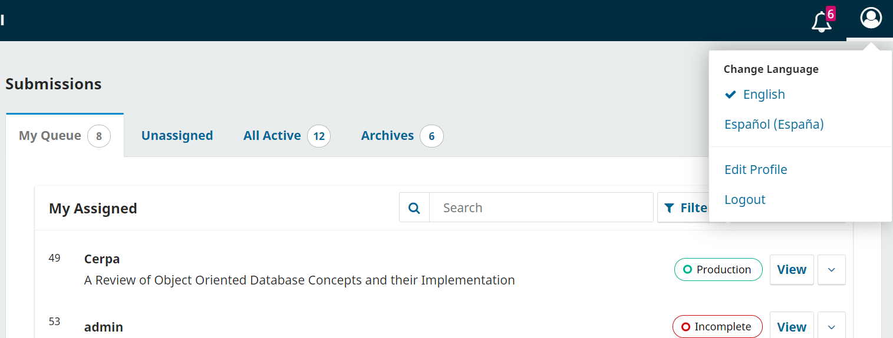

# Über Open Journal Systems (OJS) {#about-ojs}

Open Journal Systems (OJS) ist eine Open-Source-Lösung für die Verwaltung und Veröffentlichung wissenschaftlicher Zeitschriften im Internet. Die OJS-Software kann kostenlos heruntergeladen und auf einem lokalen Webserver installiert werden.

Es wurde entwickelt, um den Verwaltungsaufwand bei der Herausgabe einer Zeitschrift zu verringern und gleichzeitig die Dokumentation sowie die Effizienz der redaktionellen Prozesse zu optimieren. Es soll die wissenschaftliche und publizistische Qualität der Zeitschrift verbessern, indem beispielsweise die Lesefreundlichkeit erhöht, Zeitschriftenrichtlinien transparent kommuniziert und die Indexierung erleichtert werden.

Dieser Leitfaden bezieht sich auf die OJS Version 3.3, welche im Februar 2021 veröffentlicht wurde und gegenüber den Vorgängerversionen der Software erhebliche Verbesserungen aufweist. Wir hoffen, dass er Ihnen bei Ihren Zeitschriftenprojekten hilfreich ist.

## Hintergrund

Dieses englischsprachige Video der PKP School erklärt den Hintergrund zu PKP und OJS. Weitere Videos dieser Reihe finden Sie auf [PKPs YouTube-Kanal](https://www.youtube.com/playlist?list=PLg358gdRUrDVTXpuGXiMgETgnIouWoWaY).



_OJS ist ein Zeitschriftenverwaltungs- und Publikationssystem_. OJS deckt alle Aspekte des Publizierens von Online-Zeitschriften ab, von der Erstellung einer Webseite bis hin zu operationellen Aufgaben wie dem Einreichungsprozess, dem Begutachtungsprozess, der redaktionellen Bearbeitung, Veröffentlichung, Archivierung und Indexierung der Zeitschrift. OJS hilft auch, die personenbezogenen Aspekte der Organisation einer Zeitschrift zu verwalten, einschließlich der Dokumentation der Arbeit von Redakteur/innen, Gutachter/innen und Autor/innen, der Benachrichtigung der Leser/innen und der Unterstützung bei der Korrespondenz.

_OJS ist flexibel und skalierbar_. Eine einzelne Installation von OJS kann den Betrieb einer oder mehrerer Zeitschriften unterstützen. Jede Zeitschrift hat eine eigene URL sowie ein individuelles Design. OJS kann eine/r einzelnen Redakteur/in die Verwaltung aller Aspekte einer Zeitschrift und der entsprechenden Webseite ermöglichen oder unterstützt ein internationales Team von Redakteur/innen mit unterschiedlicher Verantwortung für die verschiedenen Rubriken einer Zeitschrift.

_OJS unterstützt das Prinzip des freien Zugangs_. Dieses System soll nicht nur bei der Herausgabe von Zeitschriften helfen, sondern auch zeigen, wie dabei die Kosten so reduziert werden können, dass die Bereitstellung der Inhalte im Open Access für die Leser/innen möglich wird. Die Gründe für das Open-Access-Publizieren werden in einer Reihe von Artikeln aus diesem Projekt dargelegt, die unter Research auf der [Public Knowledge Project](https://pkp.sfu.ca/) Webseite frei verfügbar sind.

_Die Ursprünge von OJS_. Das System wurde 2001 erstmals als Forschungs- und Entwicklungsinitiative an der University of British Columbia veröffentlicht mit Unterstützung des kanadischen Forschungsrates für Sozialwissenschaften und Geisteswissenschaften, der Max Bell Foundation, der Pacific Press Endowment und der MacArthur Foundation. Die Weiterentwicklung wird derzeit von der Simon Fraser Universitätsbibliothek betreut. Weitere Informationen finden Sie auf der [Public Knowledge Project Webseite](https://pkp.sfu.ca).

## OJS-Funktionen

Besuchen Sie unsere Webseite, um mehr über [Open Journal Systems](https://pkp.sfu.ca/software/ojs) zu erfahren und darüber, wie es dem gesamten Weg von den Forscher/innen zu den Leser/innen unterstützt - von der Einreichung über die Begutachtung bis hin zur Produktion und Veröffentlichung.

## Installation und Upgrade

OJS ist einfach zu installieren und zu konfigurieren. Der Betrieb eines Webdienstes erfordert jedoch Systemadministrator/innen, die wissen, wie man Webanwendungen bereitstellt. Unsere Administrator/innen-Dokumentation enthält vollständige Anweisungen zum [Herunterladen, Installieren und Konfigurieren von OJS](/admin-guide/en).

> Wenn Sie nicht das Fachwissen, das Personal oder den Bedarf haben, OJS selbst zu installieren und zu verwalten, bietet [PKP Publishing Services](https://pkp.sfu.ca/hosting-services) komplette Hosting-Lösungen zu verschiedenen Preisen an.
> {:.tip}

## Was ist neu in OJS 3.3 {#whats-new}

OJS 3.3 verfügt über ein vereinfachtes Dashboard-Navigationsmenü und neue Funktionen für die Verwaltung von Einreichungen, Kommunikation mit Benutzer/innen und zur Barrierefreiheit. Dieser Abschnitt beschreibt die wichtigsten Änderungen, damit Sie wissen, was Sie erwartet, wenn Sie auf OJS 3.3 upgraden. Sie können sich auch [ein (englischsprachiges) Video ansehen, das neue Funktionen in OJS 3.3](https://youtu.be/3D_hS4Bd-Y8) vorstellt, erstellt von [PKP Publishing Services](https://pkpservices.sfu.ca).

Viele dieser Änderungen gelten auch für Open Monograph Press (OMP) und Open Preprint Systems (OPS).

Wenn Sie von OJS 2 upgraden und sich einen Überblick über die Änderungen in OJS 3.X verschaffen wollen, lesen Sie (englischsprachig) [What’s New In OJS 3 in a previous version of this guide](https://docs.pkp.sfu.ca/learning-ojs/3.1/en/introduction#whats-new-in-ojs-3) und PKP’s Leitfaden (englischsprachig) [Upgrading from OJS 2 to OJS 3](https://docs.pkp.sfu.ca/upgrading-ojs-2-to-3/). Bitte beachten Sie, dass Sie zunächst von OJS 2 auf OJS 3.2 upgraden müssen, um von dort auf OJS 3.3 upzugraden.

Für eine Zusammenfassung der Änderungen in OJS 3.3 die für Entwickler/innen und die Entwicklung relevant sind, siehe (englischsprachig) [Release Notebook for OJS OJS/OMP/OPS v3.3](https://docs.pkp.sfu.ca/dev/release-notebooks/en/3.3-release-notebook)

### Dashboard-Oberfläche und Navigationsmenüs

Nach der Anmeldung gibt es einige Änderungen an der Dashboard-Oberfläche und den Navigationsmenüs in OJS 3.3.

Das Navigationsmenü auf der linken Seite hat sich für die Rollen "Zeitschiftenverwalter/in", "Redakteur/in", "Autor/in" und andere verändert. In 3.3 sehen nur die Rollen in Zeitschriftenverwaltung und Redaktion, die Zugriff auf die Einstellungsmenüs haben, das Navigationsmenü auf der linken Seite. Außerdem sind die Menüpunkte "Ausgaben", "Mitteilungen" und "Zahlungen" hinzugekommen und einige der Menülinks wurden verschoben.

Andere Rollen werden das Menü auf der linken Seite nicht sehen, da sie nur auf den Bereich der Einreichungen zugreifen können.

Es kann jetzt auf das eigene Profil zugegriffen werden und in mehrsprachigen Zeitschriften eine Sprache ausgewählt werden, indem man auf das Personensymbol oben rechts klickt.

Der Link vom Dashboard auf die öffentliche Homepage der Zeitschift wurde verschoben. Zeitschriftenverwalter/innen und Redakteur/innen können jetzt die öffentliche Webseite der Zeitschrift dadurch erreichen, indem sie auf den Namen der Zeitschrift in der oberen linken Ecke klicken. Bei Installationen mit mehreren Zeitschriften können Sie auf das Symbol in der oberen linken Ecke klicken. Anschließend erscheint eine Liste der Zeitschriften, aus der Sie wählen können.

### Redaktioneller Workflow

#### Einreichungsdateien hochladen

Im Verlauf der Einreichung können die Autor/innen mehrere Dateien gleichzeitig hochladen sowie auch Dateien per Drag-and-Drop verschieben. Sie werden nicht mehr zur Eingabe von Metadaten wie beispielsweise Beschreibung, Lizenz usw. aufgefordert. Diese Angaben können während des Workflows eingegeben werden, bei dem das bisherige Datei-Upload-Tool weiterhin verwendet wird. Weitere Anleitungen finden Sie im Kapitel [Beitragserstellung](./authoring#step-2).

<figure class="video_container">
  <video controls="true" allowfullscreen="true">
    <source src="./assets/learning-ojs3.3-upload-submission-files.mp4" type="video/mp4">
  </video><figcaption>Ein kurzes englischsprachiges Video, dass das Hochladen von Dateien in OJS 3.3 demonstriert.</figcaption>
</figure>

#### Einreichungen filtern

Alle aktiven und archivierten Einreichungen können nun nach zugewiesener Ausgabe und dem/der zugewiesenen Redakteur/in gefiltert werden. Nur Zeitschriftenverwalter/innen können nach zugewiesenen Redakteur/innen filtern. Weitere Anweisungen finden Sie im Kapitel [Redaktioneller Workflow](./editorial-workflow#submission-dashboard).

#### Eine Ablehnung rückgängig machen

Eine neue Funktion ermöglicht es Redakteur/innen, eine erfolgte Ablehnung in der Einreichungs- und Begutachtungsphase rückgängig zu machen. Nachdem die Ablehnung rückgängig gemacht wurde, wird die Einreichung in die vorherige Phase und ggf. in die letzte aktive Begutachtungsrunde zurückversetzt. Weitere Anweisungen finden Sie im Kapitel [Redaktioneller Workflow](./editorial-workflow#assigning-the-submission).

#### Nur abgelehnte Einreichungen löschen

Nur abgelehnte Beiträge können aus der Liste der Einreichungen gelöscht werden. Weitere Anweisungen finden Sie im Kapitel [Redaktioneller Workflow](./editorial-workflow#archives).

#### Varianten des Begutachtungsprozesses

In vorherigen Versionen von OJS waren die Review-Typen „Doppelblind“, „Einfachblind“ und „Offen“. In OJS 3.3 wurden diese in „Anonymer Gutachter/Anonymer Autor“, „Anonymer Gutachter/Offengelegter Autor“ und „Offen“ geändert.

#### Auf Artikelseite angezeigte Kategorie

Die zugewiesenen Kategorien eines Artikels erscheinen nun auf der Artikelseite. Weitere Informationen finden Sie im Kapitel [Zeitschrifteneinstellungen](./journal-setup#categories).

#### Einreichungen deaktivieren

Zeitschriftenverwalter/innen und Redakteur/innen können die Workflow-Einstellungen so konfigurieren, dass Einreichungen für eine Zeitschrift deaktiviert werden. Dies kann von Zeitschriften genutzt werden, die neue Inhalte nicht mehr akzeptieren. Weitere Informationen finden Sie im Kapitel [Zeitschrifteneinstellungen](./journal-setup#sections).

### Benutzer/innenverwaltung und -kommunikation

#### Nutzer/innen exportieren

Unter Werkzeuge > Import/Export ist nun eine Exportfunktion verfügbar, um Benutzer/innen in eine CSV-Datei zu exportieren. Damit lassen sich Benutzer/innen in Mailing-Dienste von Drittanbietern importieren. Weitere Anweisungen finden Sie im Kapitel [Benutzer/innen und Rollen](./users-and-roles#email-users).

#### Benutzer/innen benachrichtigen

OJS 3.3 verfügt über eine häufig nachgefragte Funktion zur Benachrichtigung bzw. zum Senden einer Nachricht an alle Benutzer/innen einer Rolle. Siehe [Benutzer/innen und Rollen](./users-and-roles#email-users) für weitere Details.

#### E-Mail-Vorlagen nach Workflow-Phase filtern

Bei der Verwaltung und Bearbeitung von E-Mail-Vorlagen unter Workflow-Einstellungen > E-Mails können Zeitschriftenverwalter/innen und Redakteur/innen die E-Mail-Vorlagen nach Workflow-Phasen filtern. Weitere Anleitungen finden Sie im Kapitel [Workflow-Einstellungen](./settings-workflow#filters).

### Barrierefreiheit

OJS wurde 2019 auf Barrierefreiheit für Menschen mit Behinderungen und die Nutzung unterstützender Technologien geprüft. Alle im Audit empfohlenen Änderungen wurden in OJS 3 umgesetzt. Einschließlich des barrierearmen OJS Standard-Themes und verpflichtender Titel für benutzerdefinierte Blöcke. Weitere Informationen zu benutzerdefinierten Blöcken finden Sie im Kapitel [Website-Einstellungen](./settings-website#custom-block-plugin).

### Für mehrsprachige Zeitschriften

OJS 3.3 hat eine Reihe neuer Funktionen, welche die Nutzung von Zeitschriften verbessern, die in mehreren Sprachen arbeiten und/oder publizieren.

#### Format von Datum und Uhrzeit

Datums- und Zeitformate können nun für jede Zeitschrift und jede Sprache angegeben werden. Weitere Anweisungen finden Sie im Kapitel der [Website-Einstellungen](./settings-website#date-and-time).

#### Rechts-nach-links-Sprachen

Es gibt mit dem Rich-Text-Editor, der in vielen Formularfeldern in OJS erscheint, eine verbesserte Unterstützung für Sprachen, die von rechts nach links geschrieben werden, beispielsweise Arabisch, Farsi oder Hebräisch.

#### Remote-URLs

Einträge im Navigationsmenü mit Remote-URLs können nun unterschiedliche Remote-URLs für jede Sprache haben.

## Community-Beiträge

Das OJS-Team fördert Beiträge aus der Community der Entwickler/innen. Wenn Sie daran interessiert sind, OJS weiter zu verbessern, freuen wir uns über Ihre Beteiligung.

Hervorragende Beispiele für das Engagement der Community sind die große Anzahl von Sprachen, in denen OJS verfügbar ist, und die externen Drittanbieter-Plugins, die im [Community Forum](https://forum.pkp.sfu.ca/) und auf der archivierten Forumsseite veröffentlicht wurden.

Wir begrüßen auch Beiträge zu Software-Tests und Hinweise auf Software-Fehler.

## Unterstützung

PKP bietet folgende kostenlose englischsprachige Support-Ressourcen für OJS an:

- [PKP Docs Hub](https://docs.pkp.sfu.ca/) (englischsprachig): Benutzeranleitungen, Entwicklerdokumentation und Veröffentlichungshinweise für unsere gesamte Software. Enthält auch Links zu von der Community entwickelten Videos.
- [PKP Community Forum](https://forum.pkp.sfu.ca/): Ein Online-Forum, in dem Sie Fragen stellen und beantworten sowie Ideen austauschen können.
- [PKP School](https://pkpschool.sfu.ca/): Eine Sammlung frei verfügbarer Online-Kurse zum Selbststudium, die von PKP-Expert/innen auf Englisch und Spanisch bereitgestellt wurden. Enthält die englischsprachigen Video-Tutorials "Setting up Your Journal", "Editorial Workflow in OJS 3" und "Becoming an Editor".

Es gibt auch einen "Hilfe"-Link in der oberen rechten Ecke jeder Seite in OJS, OMP und OPS, auf der Sie Informationen über die aktuelle Seite und deren Funktionen finden können.

Bei Fragen zu einer bestimmten Zeitschriften-Seite, wie zum Beispiel den Einreichungsbedingungen, kontaktieren Sie die Redaktion direkt, indem Sie die auf der **Über uns**-Seite angegebenen Kontaktinformationen verwenden.
