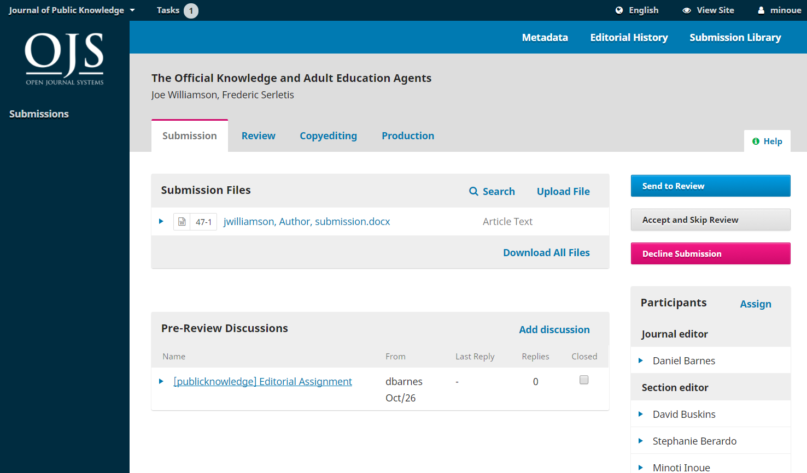
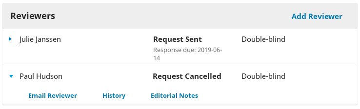
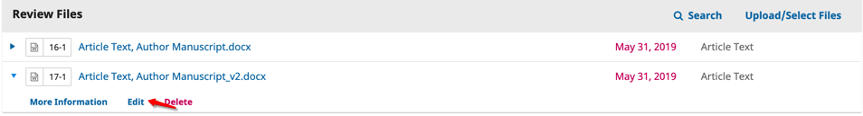
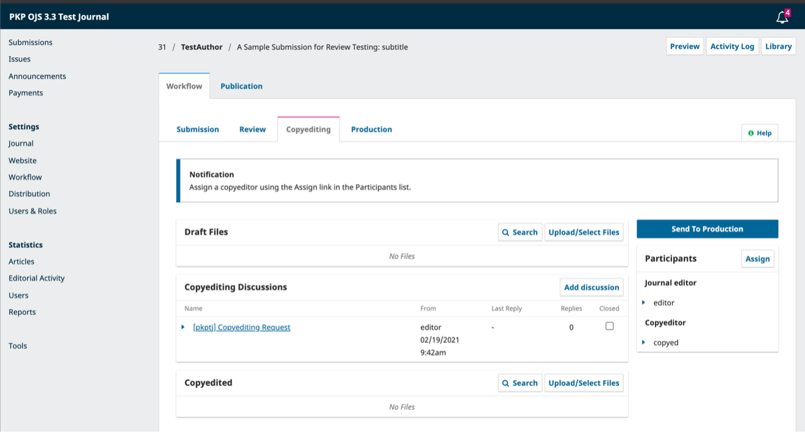
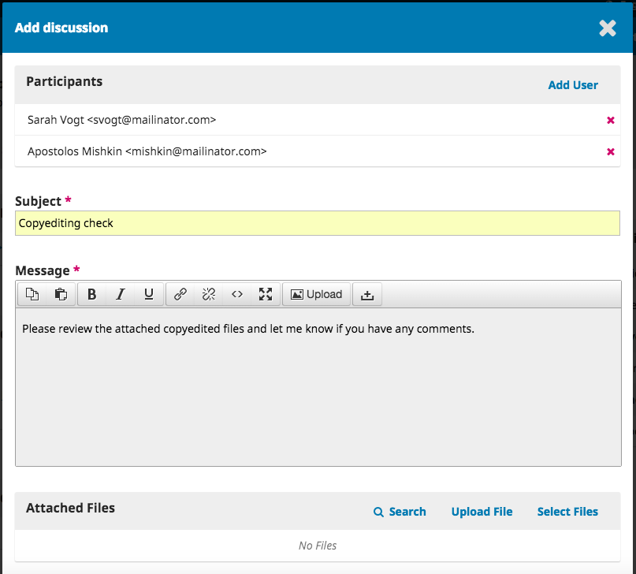
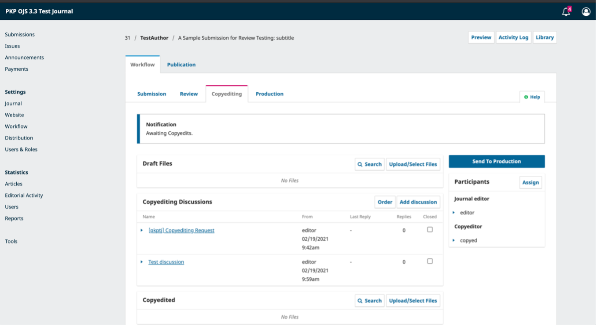

# Redaktioneller Workflow

In diesem Kapitel werden Sie eine Einreichung durch den gesamten Workflow von der initialen Einreichung bis zur endgültigen Veröffentlichung verfolgen.



Dieses englischsprachige Video von PKP School gibt einen Überblick über den redaktionellen Workflow in OJS 3.3. Weitere Videos dieser Reihe finden Sie auf [PKP's YouTube Kanal](https://www.youtube.com/playlist?list=PLg358gdRUrDUKJbWtr4bgy133_jwoiqoF).

Der Workflow ist in 4 Phasen unterteilt:

**Einreichung**: Hier erscheinen neue Einreichungen und werden Rubrikredakteur/innen zugewiesen. Die Einreichungen kommen für den Wechsel in die Begutachtungssphase in Betracht.

Einreichungen können auch unangemessen sein und es nicht über diese Phase hinaus schaffen.



Dieses englischsprachige Video von PKP School erklärt die Schritte, die der/die Redakteur/in unternimmt, um einem/r Rubrikredakteur/in eine neue Einreichung zuzuweisen. Weitere Videos dieser Reihe finden Sie auf dem [YouTube-Kanal von PKP](https://www.youtube.com/playlist?list=PLg358gdRUrDUKJbWtr4bgy133_jwoiqoF).

**Gutachten**: Hier erfolgt das Peer Review, sowie die geforderte Überarbeitung durch den/die Autor/in.

Manche Einreichungen werden das Peer Review nicht bestehen und enden hier. Diejenigen, die akzeptiert werden, werden zur nächsten Phase weitergeleitet.

**Lektorat**: Angenommene Artikel kommen in diese Phase, in der sie durch die Arbeit eines/einer Lektor/in überarbeitet werden. Autor/innen können die Möglichkeit erhalten, die lektorierten Dateien zu überprüfen.

**Produktion**: Sobald die redaktionellen Überarbeitungen fertiggestellt und angenommen sind, tritt die Einreichung in die Produktionsphase ein. In dieser Phase werden die bearbeiteten Dateien in Druckfahnen umgewandelt - HTML, XML, PDF, etc. Auch hier hat die/der Autor/in Gelegenheit, die Fahnen Korrektur zu lesen. Wenn alle Beteiligten einverstanden sind, wird der Beitrag in einer der nächsten Ausgaben veröffentlicht.



Dieses englischsprachige Video von PKP School erläutert die Produktionsphase. Weitere Videos dieser Reihe finden Sie auf dem [YouTube-Kanal von PKP](https://www.youtube.com/playlist?list=PLg358gdRUrDUKJbWtr4bgy133_jwoiqoF).

## Aufgaben {#tasks}

Ihre Aufgaben sind über das Menü oben links in Ihrem Dashboard verfügbar. Beachten Sie die Zahl „1“ in der Abbildung unten. Dies bedeutet, dass sich derzeit eine Aufgabe in Ihrer Liste befindet.

Aufgaben bieten einen schnellen Überblick über Elemente, die Ihre Aufmerksamkeit erfordern. Fett gedruckte Einträge sind ungelesen, und nicht fett gedruckte Einträge wurden gelesen.

Verwenden Sie das Kontrollkästchen, um Aufgaben zum Löschen zu markieren (der Link befindet sich am unteren Rand der Liste).

## Einreichungsbenachrichtigungen {#submission-notifications}

Wenn ein/e Autor/in eine neue Einreichung für Ihre Zeitschrift macht, erhalten die/der Autor/in und alle Beitragenden eine E-Mail zur Bestätigung. Die Redakteur/innen erhalten automatisch per E-Mail eine Benachrichtigung über die neue Einreichung. In einigen Fällen wird ein/e Redakteur/in automatisch der Einreichung zugeordnet. Welche Redakteur/innen die Benachrichtigung erhalten oder automatisch zugewiesen werden, hängt davon ab, wie Sie Ihr Journal eingerichtet haben (siehe [Rubrik bearbeiten](./journal-setup#edit-a-section)).

* Wenn nur einer Person die Rolle Redakteur/in oder Zeitschriftenverwalter/in zugewiesen ist, wird diese Person automatisch zugewiesen und benachrichtigt.
* Wenn ein oder mehrere Rubrikredakteur/innen der [Rubrik](https://docs.pkp.sfu.ca/learning-ojs/en/journal-setup#sections) zugeordnet sind, in der die Einreichung erfolgt ist, wird ihnen automatisch die Einreichung zugewiesen und sie werden benachrichtigt.
* Wenn ein oder mehrere Rubrikredakteur/innen der [Kategorie](https://docs.pkp.sfu.ca/learning-ojs/en/journal-setup#categories) zugeordnet sind, in der die Einreichung erfolgt ist, wird ihnen automatisch die Einreichung zugewiesen und sie werden benachrichtigt.

Sie können OJS auch so konfigurieren, dass eine Kopie der E-Mail-Benachrichtigung an den Hauptkontakt der Zeitschrift, der in den Zeitschrifteneinstellungen festgelegt wurde, gesendet wird, oder an eine andere Adresse.

Um Kopien der E-Mail zur Einreichungsbestätigung an den Hauptkontakt oder eine andere Adresse zu senden:

1. Gehen Sie im Dashboard der/des Zeitschriftenverwalter/in zu Einstellungen > Workflow > Einreichungen
2. Scrollen Sie nach unten zur Benachrichtigung über Autor/inneneinreichungen
3. Aktivieren Sie das Kontrollkästchen neben „Kopie an den Hauptkontakt senden“, wie in den Zeitschrifteneinstellungen definiert, wenn Sie eine Kopie an den Hauptkontakt senden möchten, und/oder
4. Geben Sie die E-Mail-Adresse ein, an die Sie eine Kopie senden möchten.

Die *Einreichungsbestätigung* kann in der Liste der vorbereiteten E-Mail-Vorlagen vollständig deaktiviert werden. Weitere Informationen über das Deaktivieren und Aktivieren von E-Mail-Vorlagen finden Sie unter *E-Mail-Vorlagen deaktivieren* im Kapitel [Workflow-Einstellungen](./settings-workflow).

Benutzer/innen können ihre individuellen Benachrichtigungseinstellungen in ihrem eigenen Profil unter Profil bearbeiten > Benachrichtigungen ändern.

## Dashboard für Einreichungen {#submission-dashboard}

Wenn Sie sich in Ihr Dashboard einloggen, finden Sie aktive Einreichungen entweder aus Ihren Aufgaben oder aus einer der Warteschlangen (Meine Warteschlange, Nicht zugewiesene Beiträge, Alle aktiven und Archiv). Der Zähler gibt Ihnen einen Überblick über die Gesamtzahl der Elemente in jeder Warteschlange.

### Meine Warteschlange

**Meine Warteschlange**: Diese Ansicht enthält Einreichungen, die in Rubriken hinzugefügt wurden, in denen Sie Rubrikredakteur/in sind bzw. Ihre eigenen Einreichungen, wenn Sie auch Autor/in dieser Zeitschrift sind.

Die **Suchen**-Funktion für jede Warteschlange kann helfen, um Einreichungen nachzuverfolgen.

Mit der **Filter**-Funktion können Sie Ihre Ansicht für eine schnellere Suche einschränken. Abhängig von ihrer Rolle sind Inhaber/innen redaktioneller Rollen in der Lage, folgende Filter anzuwenden:

- __Status:__ wählen Sie aus _Unvollständig_, _Verspätet_ und _Tage seit der letzten Aktivität_

- __Phasen:__ wählen Sie aus _Einreichung_, _Begutachtung_, _Lektorat_ und _Produktion_

- __Rubriken der Zeitschrift:__ wählen Sie aus Ihren vergebenen Rubriken.  Wenn es mehr als 5 Rubriken gibt, können Sie das Textfeld mit Autovervollständigung nutzen. Zum Beispiel filtern nach _Artikeln_ oder _Begutachtungen_.

- __Zugewiesene/r Redakteur/innen__: Diese Filteroption steht nur Zeitschriftenverwalter/innen und Zeitschriftenredakteur/innen zur Verfügung. Wie bei den Rubriken handelt es sich hier um ein Textfeld, das automatisch den Namen einer/s Rubrikenredakteur/in, einer/s Zeitschriftenredakteur/in oder einer/s Gastredakteur/in vorschlägt, sobald Sie beginnen, ihn einzugeben und dann alle der/dem Redakteur/in zugewiesenen Artikel anzeigt.

- __Zugewiesene Ausgabe__: Nur Zeitschriftenverwalter/innen können nach unveröffentlichten Ausgaben filtern, aber Redakteur/innen und Assistent/innen können nach veröffentlichten Ausgaben filtern. In diesem Feld wird zwischen Groß- und Kleinschreibung unterschieden. Die besten Ergebnisse erzielen Sie, wenn Sie nach Jahr oder Titel und nicht nach Band oder Nummer suchen. Dieser Filter wird meist verwendet, wenn die Zuordnung einer Einreichung zu einer Ausgabe in einer frühen Phase des Redaktionsprozesses erfolgt ist.

Einige Filter erlauben eine Mehrfachauswahl, d. h. die Benutzer/innen können nach mehreren Redakteur/innen, Rubriken oder Ausgaben filtern. Filter werden mit ODER-Bedingungen angewendet. Wenn ein/e Benutzer/in also nach Redakteur/in A und Redakteur/in B filtert, werden alle Beiträge zurückgegeben, die Redakteur/in A ODER Redakteur/in B zugewiesen sind.

Wenn Sie mehrere Filter verwenden, wird die UND-Bedingung zwischen den Filtern angewendet. Wenn Sie z. B. nach Begutachtungsphase UND Redakteur/in A filtern, werden nur Einsendungen angezeigt, die Redakteur/in A in der Begutachtungsphase zugewiesen wurden.

Beachten Sie, dass Sie die blauen Pfeile auf der rechten Seite jeder Einreichung verwenden können, um weitere Details anzuzeigen, z. B. wie viele Gutachten noch ausstehen, neue Diskussionen und Weiteres. Hier finden Sie ebenso Schaltflächen, mit denen Sie den Einreichungseintrag aufrufen, das Aktivitätsprotokoll, die Anmerkungen einsehen und die Einreichung löschen können.

### Nicht zugewiesen

Diese Ansicht enthält Einreichungen, die zu Rubriken ohne Rubrikredakteur/innen hinzugefügt wurden.

Im obigen Beispiel gibt es keine nicht zugewiesenen Einreichungen, daher ist das Feld leer.

### Alle aktiven

Diese Ansicht enthält eine Liste aller Einreichungen, die keiner Warteschlange zugeordnet sind.

### Archiv

Diese Ansicht enthält eine Liste aller Einreichungen, die entweder abgelehnt oder bereits in der Zeitschrift veröffentlicht wurden. Abgelehnte Einreichungen können aus der Liste der archivierten Einreichungen gelöscht werden. Wenn Sie eine abgelehnte Einreichung löschen, werden die Einreichung und alle dazugehörigen Dateien vollständig aus Ihrer Zeitschrift entfernt.

### Beispieleinreichung

Für diese Demonstration sehen wir uns die Cerpa-Einreichung mit dem Titel _A Review of Object Oriented Database Concepts and their Implementation_ an. Sie befindet sich oben in der Ansicht Warteschlange **Mir zugewiesene Beiträge** sowie **Alle aktiven**.

Wenn Sie die Einreichung gefunden haben, können Sie die Schaltfläche Ansicht verwenden, um die Einreichung anzusehen, oder den blauen Pfeil für die Anzeige von offenen Diskussionen (in diesem Fall gibt es keine) sowie die Anzahl der Dokumente und den Zugriff auf das Aktivitätsprotokoll & Notizen.

**Aktivitätsprotokoll & Notizen** zeigt den Verlauf der Einreichung an.

Im Reiter Notizen können Sie redaktionelle Notizen anzeigen oder hinzufügen.

### Einreichungseintrag

Um die Einreichung detaillierter zu betrachten, wählen Sie die Schaltfläche **Ansicht**. Dadurch gelangen Sie zur Einreichung.

Hier finden Sie Folgendes:

**Beitragsdateien**: In dieser Ansicht werden die eingereichten Dateien aufgelistet. In diesem Beispiel gibt es nur eine Datei, es könnten aber mehrere Dateien eingereicht worden sein. Die eingereichten Dateien behalten beim Herunterladen ihre ursprünglichen Namen.

Bei Zeitschriften, die eine anonyme Begutachtung verwenden, werden die/der Autor/in und die/der Gutachter/in (falls sie ein Dokument hochgeladen haben) nicht angezeigt. Ein Beispiel für die Struktur des Dateinamens für Dateien, die von Gutachter/innen heruntergeladen werden, ist `ojs-review-assignment-1-article-text-8.docx`. Die Nummer entspricht der Manuskriptnummer der zugewiesenen Einreichung.

**Diskussion vor der Begutachtung**: Hier kann die/der Redakteur/in mit der/dem Autor/in oder mit anderen Mitgliedern des Redaktionsteams kommunizieren. Zum Beispiel, um die/den Autor/in um zusätzliche Informationen zu bitten, oder um eine/n Redakteur/in der Rubrik zu bitten, die Verantwortung für diesen Beitrag zu übernehmen.

**Aktionsschaltflächen**: Dazu gehören "In Begutachtung schicken", "Annehmen und Begutachtung überspringen" und "Beitrag ablehnen".

> Hinweis: Wenn Sie diese Schaltflächen nicht sehen, haben Sie die Einreichung wahrscheinlich noch keinem/r Redakteur/in zugewiesen.

**Einreichungsstatus** Sobald ein/e Redakteur/in eine Entscheidung in einer Phase des Workflows von OJS 3.3 gefällt hat, erscheint die getroffene Entscheidung anstelle der Aktionsschaltflächen. Die Redakteur/innen können die gefällte Entscheidung immer noch ändern, indem sie auf „Entscheidung ändern“ klicken, wodurch die drei Optionen wieder aktiviert werden.

 *Die obige Abbildung zeigt die Schaltfläche für MS-Nr. 425 bevor eine Entscheidung gefällt wird. Die nachstehende Abbildung zeigt die Benachrichtigung über die getroffene Entscheidung.*

**Beteiligte**: Hier sehen Sie die Liste, der an der Einreichung Beteiligten, einschließlich der Herausgeber/innen, der Rubrikredakteur/innen und der Autor/innen. Andere Namen (Lektor/innen, Layout-Leiter/innen usw.) werden hier erscheinen, wenn sie in den folgenden Schritten hinzugefügt werden.

**Einreichungsbibliothek**: Die Einreichungsbibliothek ist ein allgemeiner Ablagebereich für Dokumente, die Formulare für Interessenkonflikte, Druckfahnengenehmigungen usw. enthalten können. Ein/e Nutzer/in kann das ausgefüllte Formular für ein Manuskript in die Einreichungsbibliothek hochladen. Die hochgeladenen Formulare stehen auch anderen Beteiligten (mit Ausnahme der Gutachter/innen) zur Verfügung, die während des Redaktions- oder Produktionsworkflows zugewiesen werden, um neue Versionen zu bearbeiten oder erneut hochzuladen.

**Dokumentenbibliothek**: Benutzer/innen im gesamten redaktionellen Arbeitsablauf können auf alle Dateien in der Bibliothek (siehe Kapitel [Workflow-Einstellungen](./settings-workflow.md)) zugreifen, die vom/von der Zeitschriftenverwalter/in oder der Redakteur/in zur Verfügung gestellt werden, indem sie die Einreichungsbibliothek öffnen und auf „Dokumentenbibliothek anzeigen“ klicken.

**Vorschau**: Klicken Sie auf Vorschau, um zu sehen, wie der Beitrag nach der Veröffentlichung mit den aktuellen Metadaten und den Fahnen-Dateien aussehen wird.

**Metadaten**: Hier können Sie die Metadaten der Einreichung einsehen und überarbeiten. Ab OJS 3.2 können Benutzer/innen die Erlaubnis erhalten, bestimmte Einreichungsmetadaten in jeder Phase des Workflows zu überarbeiten.

### Erteilung von Autor/innenrechten

Ab OJS 3.2 können Redakteur/innen den Autor/innen Zugriff gewähren, damit diese Änderungen an den Metadaten vornehmen können. Es gibt zwei Möglichkeiten, wie Redakteur/innen diese Art von Zugriff gewähren können.

**Globale Berechtigung** - gibt allen Benutzer/innen mit der Rolle „Autor/in“ die Berechtigung, Metadatenänderungen vorzunehmen.

Um dies zu aktivieren, gehen Sie zu Benutzer/innen & Rollen > Rollen. Klicken Sie auf den blauen Pfeil neben „Autor/in“ und dann auf „Bearbeiten“.

Aktivieren Sie unter Rollen-Einstellungen die Option „Änderung der Metadaten dieser Einreichung erlauben“ und klicken Sie auf OK.

**Beschränkte Berechtigung** - gewährt registrierten Autor/innen (in der Regel einer/m einzelnen Autor/in) die Berechtigung, Änderungen nur in bestimmten Phasen des redaktionellen Workflows vorzunehmen.

Um einer/m Autor/in die Möglichkeit zu geben, die Metadaten in einer bestimmten Phase des Workflows zu ändern, klicken Sie auf die entsprechende Phase des Workflows (z. B. Einreichung, Gutachten, Lektorat oder Produktion).

Klicken Sie unter der Liste der Beteiligten auf den Pfeil neben dem Namen der/s Autor/in und anschließend auf Bearbeiten.

Aktivieren Sie unter „Rechte“ die Option „Dieser Person das Ändern der Veröffentlichungsdetails erlauben“ und bestätigen Sie mit OK.

Sobald die/der Autor/in Zugriff auf die Bearbeitung erhält, können in der Ansicht „Veröffentlichung“ Änderungen an den folgenden Abschnitten vorgenommen werden: Titel und Zusammenfassung, Beitragende und Metadaten.

### Einreichung zuweisen

Je nachdem, [wie Sie Ihre Rubriken konfiguriert haben](./journal-setup#edit-a-section), können neue Einreichungen unter Umständen nicht zugewiesen sein. Wenn dies der Fall ist, ist der nächste Schritt die Zuweisung einer/s Redakteur/in oder Rubrikredakteur/in. Wählen Sie dazu den Link _Zuweisen_ im Bereich **Beteiligte**.

Sie haben die Möglichkeit, eine/n Benutzer/in nach der Rolle zu suchen, eine Person auszuwählen und ihr eine Nachricht mit der Bitte um Unterstützung zu senden.

> Hinweis: Wenn Sie sich nicht sicher sind, wie die Redakteur/innen der einzelnen Rubriken heißen, wählen Sie einfach die entsprechende Rolle aus dem Dropdown-Menü aus und klicken dann auf die Schaltfläche Suchen. Alle Rubrikredakteur/innen werden angezeigt und stehen zur Auswahl.

Drücken Sie **OK**, um die Zuweisung vorzunehmen und die Nachricht zu senden.

> Beachten Sie die neue Diskussion vor der Begutachtung, die automatisch als Teil der Zuweisung erstellt wurde.

Sie sehen nun, dass die/der Rubrikredakteur/in unter Beteiligte aufgelistet ist und die Aktionsschaltflächen verfügbar sind:

**In Begutachtung schicken**: Bringt die Einreichung in die nächste Phase.

**Annehmen und Begutachtung überspringen**: Überspringt die Begutachtungsphase und leitet die Einreichung direkt in das Lektorat über.

**Beitrag ablehnen**: Lehnt die Einreichung ab, bevor sie den Begutachtungsprozess durchlaufen hat. Die Einreichung würde dann archiviert werden. In OJS 3.3 gibt es jetzt die Möglichkeit, eine Ablehnungsentscheidung in der Einreichungs- und Begutachtungsphase rückgängig zu machen. Dazu klicken Sie auf **Entscheidung ändern** und anschließend auf **Ablehnung rückgängig machen**. Nachdem eine Ablehnungsentscheidung rückgängig gemacht wurde, wird die Einreichung wieder in die vorherige Phase und die vorherige Begutachtungsrunde zurückversetzt, sofern diese aktiv ist.

Obwohl in diesem Beispiel die/der Redakteur/in eine/n Rubrikredakteur/in zugewiesen hat, könnte die/der Redakteur/in die Einreichung auch sich selbst zuweisen.

Sobald die/der Redakteur/in eine Aktion ausgewählt hat, ändert sich der Status der Einreichung und die Aktionsschaltflächen werden deaktiviert.

### Rubrikredakteur/in

Nachdem die/der Rubrikredakteur/in zugewiesen wurde, kann diese/r sich anmelden und das Dashboard einsehen. Der Beitrag befindet sich oben in der Warteschlange "Mir zugewiesene Beiträge".

Wenn Sie auf den Titel des Artikels klicken, wird der vollständige Datensatz der Einreichung geöffnet.

#### Annehmen der Zuweisung

Es ist nicht erforderlich, aber die/der Rubrikredakteur/in kann auf die Diskussion vor der Begutachtung antworten, um der/dem Redakteur/in mitzuteilen, dass mit dem Auftrag fortgefahren werden kann.

#### Kommunikation mit der/dem Autor/in

Wenn die/der Rubrikredakteur/in Fragen an die/den Autor/in hat, kann sie/er die Diskussion vor der Begutachtung nutzen.

#### In Begutachtung schicken

Wenn die/der Rubrikredakteur/in überzeugt ist, dass die Einreichung für die Zeitschrift geeignet ist, kann sie/er die Schaltfläche **In Begutachtung schicken** wählen, um die Einreichung in die nächste Phase zu bringen.

Wählen Sie die Dateien, die begutachtet werden sollen, aus.

## Begutachtung {#review}



Dieses englischsprachige PKP School Video erklärt die Schritte, die der Abschnitt Editor unternimmt, um Reviewer der Einreichung zuzuweisen. Weitere Videos aus dieser Videoreihe finden Sie auf dem [YouTube-Kanal von PKP](https://www.youtube.com/playlist?list=PLg358gdRUrDUKJbWtr4bgy133_jwoiqoF).

Wenn eine Einreichung die Begutachtungsphase erreicht, wird eine  Benachrichtigung angezeigt, dass Gutachter/innen zugewiesen werden müssen.

> Hinweis: Im obigen Screenshot sehen Sie die Ansicht eines/r Rubrikredakteurs/in. In dieser Ansicht sind die Auswahlmöglichkeiten eingeschränkt (Empfehlungen machen). Wenn Sie als Redakteur/in eingeloggt wären, würden hier weitere Auswahlmöglichkeiten (Überarbeitung anfordern, Einreichung akzeptieren, Beitrag ablehnen) erscheinen.

Um eine/n neue/n Gutachter/in hinzuzufügen, klicken Sie im Bereich Gutachter/innen auf "Gutachter/innen hinzufügen".

Danach öffnet sich ein neues Fenster, in dem die Gutachter/innen aufgelistet sind und einzeln ausgewählt werden können.

Wenn Sie auf den blauen Pfeil klicken, werden weitere Informationen über ihren Begutachtungsverlauf angezeigt, einschließlich der Anzahl der aktiven zugewiesenen Gutachten, wie viele Bewertungen abgeschlossen oder abgelehnt wurden usw. Wenn der/die Benutzer/in einen Lebenslauf oder Begutachtungsinteressen angegeben hat, werden diese Informationen hier angezeigt.

Zusätzlich kann ein/e Zeitschriftenredakteur/in eine private Notiz über den/die Gutachter/in in seinem/ihrem Profil unter Benutzer/innen & Rollen > Benutzer/innen hinzufügen. Diese Notiz wird in den Details über die Gutachter/innen im Fenster "Gutachter/in hinzufügen" angezeigt, ist aber weder für die Gutachter/innen noch für die Öffentlichkeit sichtbar.

In den OJS Versionen 3.0 bis 3.1.0 können keine Benutzer/innen zur Begutachtung einer Einreichung zugewiesen werden, die zugleich Redakteur/innnen der Einreichung sind.  Wenn Letzteres der Fall ist, können die betroffenen Redakteur/innen nicht mehr auf die Einreichung zugreifen, sobald das Gutachten eingereicht wurde. Durch diese Einschränkung soll den Grundsätzen des anonymen Begutachtungsverfahrens entsprochen werden. Ab der Version OJS 3.1.1 können zur Begutachtung Benutzer/innen zugewiesen werden, die gleichzeitig Redakteure/innen der Einreichung sind.

Im Gutachter/innen-Fenster sehen Sie zudem folgende Optionen:

**Gutachter/in auswählen**: Sobald Sie eine/n Gutachter/in aus der Liste ausgewählt haben, können Sie hier Ihre Auswahl bestätigen.

**Neue/n Gutachter/in anlegen**: Wenn keine/r der Gutachter/innen geeignet erscheint, können über den Button Gutachter/innen neu angelegt werden. Damit wird ein neues Konto im System angelegt.

**Existierende/n Benutzer/in als Gutachter/in eintragen**: Wenn keine/r der Gutachter/innen geeignet ist, können bestehende Benutzer/innen als Gutachter/innen eingetragen werden.

Für diese Demonstration wählen wir eine/n Gutachter/in aus und klicken auf den Button **Gutachter/in auswählen**.

Dadurch wird ein neues Fenster mit einer Nachricht an die Gutachter/in geöffnet.

Sie können jeden der vorbereiteten Texte überarbeiten.

Wenn die Zeitschrift anonym begutachtet wird, stellen Sie sicher, dass die Dateien, die Sie an die Gutachter/innen senden, keine Informationen zur Identität der Autor/innen enthalten. Weitere Informationen dazu finden Sie in den Abschnitten [Unterschiedliche Begutachtungsverfahren verstehen](#understanding-different-types-of-review) und [Entfernen von Identifikationsinformationen](#removing-identifying-information).

Weiter unten sehen Sie, welche zusätzlichen Details an den/die Gutachter/in gesendet werden, einschließlich des Titels, des Abstracts, wichtiger Termine und einem Link zu den zu überprüfenden Dateien.

Standardmäßig wird den Gutachter/innen ein erweitertes Textfeld zur Eingabe ihrer Kommentare zur Verfügung gestellt. Allerdings kann der/die Zeitschriftenverwalter/in Begutachtungsformulare unter [**Workflow &gt; Begutachtung &gt; Begutachtungsformulare**](./settings-workflow#review) erstellen, um den Gutachter/innen spezielle Fragen zu stellen. Wenn Sie möchten, dass die Gutachter/innen ein Begutachtungsformular ausfüllen, wählen Sie dies unter **Begutachtungsformular** aus.

Klicken Sie auf **Gutachter/in hinzufügen**, um die Nachricht zu senden und den/die Gutachter/in zuzuweisen.

In der Begutachtungsphase werden die zugewiesenen Gutachter/innen jetzt aufgelistet.

Über den blauen Pfeil neben dem Namen des/der Gutachter/in können Sie zusätzliche Änderungen vornehmen.

**Gutachten-Details**: Hier finden sich weitere Details zu dem Gutachten.

**E-Mail an Gutachter/in**: Über diese Schaltfäche kann eine Nachricht an den/die Gutachter/in gesendet werden.

**Bearbeiten**: Hier können die Termine für das Gutachten und die zugewiesenen Dateien geändert werden.

**Zuteilung an Gutachter/in aufheben**: Über diesen Button kann die Zuteilung der Gutachter/innen aufgehoben werden.

**Gutachter streichen**: Ab OJS 3.2 können Sie eine Gutachtenanfrage stornieren. Dies kann notwendig sein, wenn ein/e Gutachter/in eine Gutachtenanfrage nicht akzeptiert oder ein Gutachten nie abgegeben wurde - und ist auch nur möglich, wenn die Einreichung noch nicht angenommen wurde.

Wenn Sie eine Gutachtenanfrage abbrechen, können Sie eine Vorlagen-E-Mail an den/die Gutachter/in senden. Die Anfrage wird dann in der Liste der Gutachter/innen als "abgebrochen" angezeigt.

Abgebrochene Begutachtungen werden in der Statistik des/der Gutachter/in aufgeführt, die Sie bei der Auswahl der Gutachter/innen sehen können.

**Diskussion zur Begutachtung**: Dies ist eine weitere Möglichkeit, eine/n Gutachter/in zu kontaktieren. In einer Diskussion zur Begutachtung haben Sie die Möglichkeit, Dateien hinzuzufügen.

Um eine Diskussion zu beginnen, klicken Sie auf „Diskussion hinzufügen“.

Wählen Sie dann die Gutachter/innen aus, mit denen Sie eine Diskussion beginnen möchten.

**Verlauf**: Hier wird ein kurzer Verlauf der Begutachtung angezeigt.

An dieser Stelle könnten Sie zusätzliche Gutachter/innen hinzufügen und dann auf ihre Empfehlungen warten.

### Die verschiedenen Begutachtungstypen

OJS ist für verschiedene Arten von Begutachtungstypen konzipiert und verfügt über eingebaute Mechanismen, um Anonymität zu gewährleisten.

Alle Informationen sind für die Zeitschriftenverwalter/innen und -redakteur/innen sichtbar, unabhängig von der Art der ausgewählten Begutachtung. Der Begutachtungstyp wird automatisch auf der Grundlage dessen ausgewählt, was unter _Einstellungen_ > _Workflow_ > _Begutachtung_ konfiguriert wurde. Die Zeitschriftenredakteur/innen können den Begutachtungstyp ändern, wenn sie eine Begutachtungsanfrage verschicken. Redakteur/innen bzw. Rubrikredakteur/innen müssen den jeweiligen Begutachtungstyp aus den folgenden Optionen auswählen, wenn sie eine Begutachtungsanfrage abschicken:

* Anonyme/r Gutachter/in / Anonyme/r Autor/in
* Anonyme/r Gutachter/in / Offengelegte/r Autor/in
* Offen

**Anonyme/r Gutachter/in / Anonyme/r Autor/in**: Die Identität sowohl der Autor/innen als auch der Gutachter/innen wird verborgen.

Die Autor/innen müssen im Modus "Anonyme/r Gutachter/in / Anonyme/r Autor/in" sicherstellen, dass personenbezogene Metadaten aus der Manuskriptdatei entfernt wurden. Weitere Informationen finden Sie unter [Identifizierende Informationen entfernen](#removing-identifying-information).

*Gutachter/in*: Die Gutachter/innen können die Autor/innen nicht in der Begutachtungs-Warteschlange sehen, wenn die Redakteur/innen den Typ "Anonyme/r Gutachter/in / Anonyme/r Autor/in" ausgewählt haben. Alle identifizierenden Informationen in den Metadaten der Einreichung werden automatisch vom System entfernt, wie in dem untenstehenden Beispiel zu sehen ist.

Soll am Ende der Begutachtung eine Gutachtendatei hochgeladen werden, sollten alle identifizierenden Informationen aus dieser vor dem Upload entfernt werden. Weitere Informationen finden Sie unter [Identifizierende Informationen entfernen](#removing-identifying-information).

*Autor/in*: Identifizierende Informationen sind über die Gutachter/innen für die Autor/innen in der Manuskriptansicht nicht sichtbar.

*Redaktionelle Entscheidung*: Die am Ende der Begutachtung an die Autor/innen versandte Mail enthält generische Bezeichnungen für die beteiligten Gutachter/innen.

**Anonyme/r Gutachter/in / Offengelegte/r Autor/in**: Die Identität der Gutachter/innen ist anonym. Die Gutachter/innen können die Autor/innen-Details sehen.

*Gutachter/in*: Gutachter/innen können die von den Autor/innen eingegebenen Metadaten sehen, indem sie auf _Alle Details der Einreichung anzeigen_ im Anfrage-Reiter der Begutachtung klicken. Die Namen der Autor/innen werden zudem in der Warteschlange der Gutachter/innen erscheinen.

*Autor/in*: In der Manuskriptansicht sind keine Informationen zu Gutachter/innen verfügbar.

*Redaktionelle Entscheidung*: Die am Ende der Begutachtung an die Autor/innen versandte Mail enthält generische Bezeichnungen für die beteiligten Gutachter/innen.

**Offene Begutachtung (Offengelegte Gutachter/innen / Offengelegte Autor/innen)** Die Identitäten der Autor/innen und der Gutachter/innen sind einander bekannt. Obwohl relativ neu und weniger verbreitet im wissenschaftlichen Publizieren, existiert [eine Reihe überzeugender Gründe](https://digitalpublishingworkshop.com/journal-publishing/new-perspectives-on-peer-review/#how) für Zeitschriften, einen offenen Begutachtungsprozess zu wählen. Wir empfehlen Zeitschriften, ihre Begutachtungsverfahren klar und transparent zu gestalten; einige englischsprachige Zeitschriften-Beispiele für offene Begutachtungsverfahren:

- [In the Library with the Lead Pipe: an open access, open peer-reviewed journal](https://www.inthelibrarywiththeleadpipe.org/about/)
- [Intersectional Apocalypse](https://journals.lib.sfu.ca/index.php/ifj/reviewpolicy)

*Gutachter/innen*: Gutachter/innen können die Namen der Autor/innen sehen, wenn sie auf  "Alle Details der Einreichung anzeigen" klicken. Sie müssen die Begutachtungsanfrage nicht akzeptieren, um diese Informationen zu sehen. Die Gutachter/innen können sich im Wissen um die Identität der Autor/innen für oder gegen eine Begutachtung entscheiden.

*Autor/innen*: Die Autor/innen können ebenso die Namen der Gutachter/innen sehen, aber erst nachdem die Begutachtungsanfrage angenommen wurde. Autor/innen können zugewiesene potentielle Gutachter/innen nicht sehen.

*Kommunikation*: Da die Begutachtung offen ist, können Autor/innen und Gutachter/innen mithilfe der Diskussionsfunktion miteinander kommunizieren. Auch wenn sie Redakteur/innen nicht als „Teilnehmer/innen“ in die Diskussion einbeziehen, können diese Diskussionen immer sehen.

Autor/innen, Gutachter/innen und Redakteur/innen können alle Nachrichten zwischen Gutachter/innen und Autor/innen sehen.

*Redakteur/innen*: Wie bei den anderen Begutachtungstypen können Redakteur/innen alle Aktivitäten sehen.  Zusätzlich haben Gutachter/innen die Möglichkeit, Nachrichten ausschließlich an Redakteur/innen zu verschicken.  Autor/innen können Mitteilungen, die im Feld "Nur für Redakteur/in" eingetragen wurden, nicht sehen.

Da Identitäten der Beteiligten nicht geheim sind, ist es nicht notwendig, die Schritte unter [Identifizierende Informationen entfernen](#removing-identifying-information) zu befolgen.

### Identifizierende Informationen entfernen

Obgleich OJS über integrierte Funktionen für die anonyme Begutachtung verfügt, kann es notwendig sein, zusätzliche Schritte außerhalb der Plattform vorzunehmen, um eine erfolgreiche Begutachtung des Typs "Anonyme/r Gutachter/in / Anonyme/r Autor/in" zu gewährleisten. Eine eingereichte Datei kann in den Dokumenteigenschaften Informationen enthalten, welche die Identität der Autor/innen offenlegen könnten.

Autor/innen Könnten außerdem ihre Namen im Artikeltext, den Fußnoten oder der Bibliographie angegeben haben; in diesen Fällen müssten Redakteur/innen diese Namensnennungen entfernen, bevor der Artikel in die Begutachtung gegeben wird. Alternativ können Autor/innen aufgefordert werden, vor der Einreichung identifizierende Informationen in den Fußnoten und der Bibliografie, wie z. B. ihren Namen und Publikationstitel, aus der Einreichungsdatei zu entfernen und durch "Autor/in", Jahr etc. zu ersetzen.

#### Microsoft Word für Windows

1. Gehen Sie zu _Datei_
2. Wählen Sie _Informationen_
3. Klicken Sie auf _Auf Probleme überprüfen_
4. Klicken Sie auf _Dokument überprüfen_
5. Im Dialogfeld _Dokumentprüfung_ wählen Sie die Kontrollkästchen aus, um die Art der versteckten Inhalte auszuwählen, die Sie untersuchen möchten, und klicken Sie auf "Prüfen"
6. Klicken Sie auf _Alle entfernen_
7. Klicken Sie auf _Schließen_
8. Speichern Sie das Dokument

#### Microsoft Word für MacOS

1. Gehen Sie zu _Extras_
2. Klicken Sie auf _Dokument schützen_
3. Wählen Sie _beim Speichern persönliche Daten aus dieser Datei entfernen_
4. Klicken Sie auf _OK_ und speichern Sie die Datei

### Datei erneut hochladen

Die Zeitschriftenverwalter/innen und Redakteur/innen können die anonymisierte Datei in den Gutachten-Dateien erneut hochladen, indem sie im Feld _Gutachten-Dateien_ auf **Dateien hochladen/auswählen** klicken.

Klicken Sie auf **Begutachtungsdatei hochladen**.

Bestimmen Sie den Artikel-Bestandteil und laden Sie die Datei hoch.

Gutachten-Details. Es kann hilfreich sein, die Datei zum Zeitpunkt des erneuten Hochladens umzubenennen. Die Datei kann auch umbenannt werden, indem Sie auf den Pfeil links neben dem Dateinamen klicken.

Klicken Sie auf Beenden und wählen Sie die Datei aus, die Sie für die Begutachtung verwenden möchten.

Die Datei (bzw. Dateien) wird unter den ursprünglich hochgeladenen Dateien angezeigt. Stellen Sie sicher, dass das Originalmanuskript beim Versenden der Anfrage an Gutachter/in aus den 'zu begutachtenden Dateien' entfernt ist.

Wählen Sie die Gutachten-Datei(en) aus und klicken Sie auf **OK**.

### Auf Gutachten reagieren



Dieses englischsprachige PKP School Video erklärt die Schritte, die die Rubrikredakteur/innen und die Autor/innen nach Abschluss der Begutachtung ergreifen. Weitere Videos dieser Reihe finden Sie auf dem [YouTube-Kanal von PKP](https://www.youtube.com/playlist?list=PLg358gdRUrDUKJbWtr4bgy133_jwoiqoF).

Sobald die Gutachter/innen ihre Arbeit abgeschlossen haben, werden dem/der Rubrikredakteur/in die Ergebnisse im Dashboard angezeigt. Dort sehen sie Mitteilungen darüber, dass neue Gutachten eingereicht wurden und ob alle Gutachten vorliegen.

Klicken Sie im Gutachter/innen-Fenster auf _Gutachten lesen_, um die Kommentare der Gutachter/innen zu lesen. Dies umfasst sowohl die Kommentare für Autor/innen und Redakteur/innen als auch diejenigen ausschließlich für Redakteur/innen.

Klicken Sie danach am unteren Rand des Bildschirms auf _Bestätigen_.

Im Gutachter/innen-Fenster sehen Sie jetzt einen _Dank an Gutachter/in_-Button. Wählen Sie diesen Button aus, um sich bei dem/der Gutachter/in zu bedanken.

Drücken Sie den **Dank an Gutachter/in**-Button um die Nachricht zu versenden.

### Entscheidung treffen

Basierend auf den Gutachter/in-Empfehlungen können Sie über die Action-Buttons eine Entscheidung treffen.

Die Optionen beinhalten:

**Überarbeitung anfordern**: In diesem Fall muss der/die Autor/in geringfügige Änderungen vornehmen. Der/die Redakteur/in kann dann entscheiden, ob eine neue Begutachtungsrunde erforderlich ist.

**Einreichung annehmen**: Diese Option bedeutet, dass die Einreichung ohne Änderungen akzeptiert wird und zum Lektorat übergehen kann.

**Beitrag ablehnen**: In diesem Fall hat die Einreichung den Begutachtungsprozess nicht bestanden und ist nicht für die Publikation geeignet. Die Einreichung würde dann in das Archiv verschoben werden. Nur abgelehnte Einreichungen im Archiv können gelöscht werden. In OJS 3.3 gibt es nun die Möglichkeit, die Entscheidung "Beitrag ablehnen" in der Einreichungs- und Gutachtenphase rückgängig zu machen. Klicken Sie dazu auf **Entscheidung ändern** und danach auf **Ablehnung rückgängig machen **. Nachdem die Ablehnung rückgängig gemacht wurde, wird die Einreichung in die vorherige Phase und ggf. in die zuletzt aktive Begutachtungsrunde zurückversetzt.

### Änderungen anfordern

Im Folgenden werden wir den/die Autor/in bitten, vor der Annahme einige kleinere Änderungen vorzunehmen.

Wählen Sie dazu den Button **Überarbeitung anfordern**. Dies öffnet ein neues Nachrichtenfenster.

Vor dem Senden der Nachricht können Sie den Text beliebig ändern.

Benutzen Sie den Button **Gutachten der E-Mail hinzufügen**, um die Kommentare der Gutachter/innen aus dem Redakteur/in- und Autor/innentextfeld in die Nachricht zu importieren. Kommentare, die der/die Gutachter/in in das Textfeld "nur für Redakteur/in" geschrieben hat, werden in der E-Mail-Nachricht nicht angezeigt.

Wenn es Anhänge gibt, wie zum Beispiel eine markierte Datei, die von einem/er Gutachter/in erstellt wurde, können Sie sie hier zu der Nachricht anhängen (solange die Datei anonymisiert wurde). Ab OJS 3.1.2 ist es möglich, eine neue Datei hochzuladen und sie als Anhang zur Nachricht hinzufügen.

Drücken Sie den **redaktionelle Entscheidung festhalten**-Button um die E-Mail-Nachricht abzuschicken.

Nun müssen Sie auf die Antwort mit den Änderungen von den Autor/innen warten.

### Antwort der Autor/innen

Sobald der/die Autor/in die Änderungen vorgenommen hat, sollten Sie eine Nachricht erhalten (per E-Mail und im Fenster "Diskussion zur Begutachtung").

Zudem können Sie die überarbeitete Datei im Überarbeitungen-Panel sehen.

An dieser Stelle können Sie die überarbeitete Datei herunterladen. Überprüfen Sie, dass die Datei fertig ist, und kontaktieren Sie den/die Autor/in über das Fenster "Diskussion zur Begutachtung".

In unserem Fall werden wir dem/der Autor/in mitteilen, dass wir die Änderungen akzeptieren. Klicken Sie hierzu auf den verlinkten Namen der Diskussion. Dies öffnet das Diskussionsfenster.

Benutzen Sie den **Nachricht hinzufügen**-Button um den Autor/innen zu antworten, entweder um weitere Änderungen anzufordern oder um die Autor/innen darüber zu informieren, dass die Einreichung bereit ist, zur nächsten Phase (dem Lektorat) überzugehen.

### Neue Begutachtungsrunde

Wenn Sie nach dem Eingang der Überarbeitungen der Autor/innen den überarbeiteten Artikel neu begutachten wollen, kann eine zweite (oder dritte oder weitere) Begutachtungsrunde begonnen werden.

Es ist ratsam, erst eine neue Begutachtungsrunde zu starten, **nachdem** die überarbeiteten Dateien durch die Autor/innen in den vorherigen Durchgang hochgeladen wurden. Eine neue Begutachtungsrunde zu starten, bevor die Autor/innen ihre Überarbeitungen hochgeladen haben, könnte Verwirrung stiften. Das Dashboard der Autor/innen und der Redaktion zeigt bei Auswahl der Begutachtungsphase immer den neuen Durchgang an. Autor/innen haben die Option, zu dem ersten Begutachtungsdurchgang zurückzukehren. Hier können auch noch Dateien hochgeladen werden. Diese Dateien müssen allerdings - um in der aktuellen Begutachtungsrunde angezeigt zu werden - im 1. Durchgang heruntergeladen und in Durchgang 2 hochgeladen werden.

Eine neue Runde sollte **nicht** gestartet werden, wenn Sie Probleme in der aktuellen Runde haben (z. B. wenn Sie nicht in der Lage, eine Begutachtungsentscheidung zu treffen, oder erneut eine/n abgelehnte/n oder entfernte/n Gutachter/in einladen).

Um eine neue Begutachtungsrunde nach Erhalt der überarbeiteten Dateien zu starten, klicken Sie auf die Registerkarte **Neue Begutachtungsrunde ** in der Gutachtenphase der Einreichung.

Daraufhin wird ein weiteres Menü geöffnet, in dem Sie auswählen können, welche (von den Autor/innen bereitgestellten) Dateien für die neue Begutachtungsrunde hinzugefügt werden sollen.

Zusätzliche Dateien aus vorherigen Durchgängen können über das Klicken auf **Dateien hochladen/auswählen** hochgeladen werden, wenn diese Dateien in der neuen Runde zur Verfügung stehen sollen.

Aktivieren Sie das Kästchen neben **Alle Dateien aus allen verfügbaren Workflow-Phasen berücksichtigen.** Die in Durchgang 1 verfügbaren Dateien sollten unter Einreichung erscheinen. In der Begutachtungsphase werden nur Dateien angezeigt, die von den Autor/innen in vorherigen Durchgängen hochgeladen wurden (d. h. überarbeitete Dateien aus Durchgang 1). Wenn Sie im 3. Durchgang (oder weiter) sind und Dateien aus dem 1. oder 2. Durchgang benötigen, müssen Sie diese auf Ihren lokalen Rechner herunterladen und mit **Datei hochladen/auswählen** erneut hochladen.

Wenn es weitere Dateien gibt, die die Autor/innen nach dem Hochladen der Neueinreichung zur Verfügung stellen wollen, können Sie diese Dateien unter **Datei hochladen/auswählen** hochladen.

Ein neuer Durchgang wird der Begutachtungsphase im Einreichung-Dashboard hinzugefügt.

Sobald Sie bereit sind, die neue Begutachtungsrunde zu starten, weisen Sie - wie in den vorigen Durchgängen - neue Gutachter/innen zu. Sie können dieselben oder andere Gutachter/innen zuordnen.

Gutachter/innen aus früheren Durchgängen haben keinen Zugriff auf ihre Kommentare der früheren Durchgänge. Wenn ein/e Gutachter/in seine/ihre Kommentare aus dem 1. Durchgang sehen möchte, können Redakteure/innen die Kommentare aus dem 1. Durchgang in eine neue Diskussion des 2. Durchgangs kopieren.

Diese Schritte können wiederholt werden, bis eine endgültige Entscheidung über das Annehmen oder Ablehnen der Einreichung getroffen wurde.

### Zum Lektorat weiterleiten

Die Einreichung kann nun ins Lektorat gegeben werden. Benutzen Sie dafür den blauen **Einreichung annehmen**-Button.

Es öffnet sich ein neues Fenster.

Beachten Sie, dass, wenn das Journal den Autor/innen Artikel-Bearbeitungsgebühren (APC) berechnet, Sie an dieser Stelle die Autor/innen um die Zahlung der APCs bitten können. Durch die Auswahl von "Fordere Veröffentlichungsgebühr" wird eine E-Mail mit Zahlungsanweisungen an die Autor/innen geschickt. Für Informationen zur Aktivierung von Veröffentlichungsgebühren konsultieren Sie bitte die Abschnitte [Abonnements > Zahlweisen](./subscriptions#payment-types) und [Vertrieb > Zahlung](./settings-distribution#enable-payments).

Drücken Sie den **redaktionelle Entscheidung festhalten**-Button am unteren Ende des Fensters.

Die Einreichung wird automatisch ins Lektorat verschoben.

Im Reiter "Gutachten" können Sie sehen, dass die Einreichung nun als akzeptiert gekennzeichnet ist.

## Lektorat {#copyediting}



Dieses englischsprachige Video von PKP School erläutert die Phase des Lektorats. Weitere Videos dieser Reihe finden Sie auf dem [YouTube-Kanal von PKP](https://www.youtube.com/playlist?list=PLg358gdRUrDUKJbWtr4bgy133_jwoiqoF).

Wenn eine Einreichung in der Begutachtungsphase akzeptiert wird, wird sie automatisch in die Lektoratsphase verschoben.

### Hinzufügen von Lektor/innen

Wenn die Einreichung in die Lektoratsphase eintritt, zeigt eine Benachrichtigung an, dass ein/e Lektor/in zugewiesen werden muss. Lektor/innen können über den Link *Hinzufügen* im Bereich "Beteiligte" zugewiesen werden.

Daraufhin wird ein neues Fenster geöffnet.

Wählen Sie im Dropdown-Menü die Rolle Lektor/in aus und klicken Sie auf die Schaltfläche **Suchen**. Daraufhin werden alle Lektor/innen angezeigt.

Wählen Sie eine/n der Lektor/innen für diese Einreichung aus.

Wählen Sie eine vorbereitete Nachricht.

Nehmen Sie alle erforderlichen Änderungen an der Nachricht vor.

Klicken Sie auf **Senden**.

Sie sehen nun die neue Benachrichtigung, dass die Einreichung zur Überarbeitung ansteht, der/die Lektor/in ist nun in der Liste der Beteiligten enthalten und die Anfrage ist in den Lektoratsdiskussionen sichtbar.

Sie können nun warten, bis der/die Lektor/in seine/ihre Arbeit erledigt hat.

### Lektor/in

Der/die Lektor/in erhält eine E-Mail-Nachricht vom Rubrikredakteur/von der Rubrikredakteurin, in der er/sie aufgefordert wird, den Beitrag zu übernehmen.

Um mit der Bearbeitung zu beginnen, muss er/sie sich anmelden und den Beitrag in seinem/ihrem Dashboard finden.

Dann kann er/sie auf den Link Lektorat neben dem Namen der Einreichung klicken. Dadurch werden die Lektor/innen direkt zur Lektoratsphase für diesen Beitrag weitergeleitet.

Von hier aus können sie die Entwürfe für das Lektorat sehen. Dies sind die Dateien, die überarbeitet werden müssen. Wenn Sie auf den verlinkten Titel klicken, wird die Datei auf Ihren Desktop heruntergeladen.

So können Sie das Lektorat außerhalb von OJS durchführen.

Um die Metadaten der Einreichung zu überprüfen, klicken Sie von der Registerkarte Workflow auf die Registerkarte Produktion.

Dazu gehört die Überprüfung des Artikeltitels, der Zusammenfassung, der Namen der Beitragenden, der Schlagworte etc.

Wenn Sie Änderungen vorgenommen haben, klicken Sie auf den Button **Speichern**, bevor Sie das Fenster verlassen.

Durch Klicken auf den Button "Vorschau" oben rechts auf der Seite können Sie sich eine Vorschau ansehen, die zeigt, wie die Artikelseite mit den aktuellen Metadaten aussehen würde.

#### Rücksprache mit dem/der Autor/in

Nach Abschluss der Überarbeitung werden die Änderungen mit dem/der Autor/in besprochen, indem eine neue Diskussion über den Link *Diskussion hinzufügen* im Bereich "Diskussion zum Lektorat" hinzugefügt wird.

Im Fenster „Diskussion hinzufügen“ müssen sie den/die Autor/in auswählen und eine Betreffzeile und eine Nachricht hinzufügen.

Weiter unten im gleichen Fenster müssen sie eine Kopie der bearbeiteten Datei hochladen.

Klicken Sie dazu auf den Link *Datei hochladen*. Daraufhin öffnet sich ein neues Fenster, in dem Sie den *Artikelbestandteil* (z. B. den Artikeltext) auswählen und die Datei hochladen müssen.

Klicken Sie auf **Weiter**, um fortzufahren.

Daraufhin wird der nächste Schritt geöffnet, in dem Sie den Dateinamen bei Bedarf bearbeiten können.

Anschließend können Sie bei Bedarf weitere Dateien hochladen oder auf **Beenden** klicken.

Zurück im Fenster Hinzufügen sehen Sie nun die angehängte Datei.

Klicken Sie auf **OK**, um die Nachricht an den/die Autor/in zu senden.

Sie ist nun in den Diskussionen zum Lektorat sichtbar.

Sie können nun auf die Antwort des Autors/der Autorin warten.

### Rückmeldung der Autor/innen

Sobald die Autor/innen sich zurückgemeldet haben, können Sie deren Feedback in der "Diskussion zum Lektorat" überprüfen.

Hier sehen Sie, dass keine weiteren Änderungen erforderlich sind.

### Die finale Lektoratsdatei

Nun können Sie die finale Version im Feld "Lektoriert" am unteren Rand des Bildschirms hochladen.

Klicken Sie auf "Dateien hochladen/auswählen", um die lektorierte Datei hochzuladen.

Hier ist es wichtig zu beachten, dass Sie einige Wahlmöglichkeiten haben.

1. Sie können "Datei hochladen" nutzen, um eine neue Datei hochzuladen (z.B. eine Datei, die seit Sie sie den Autor/innen gezeigt haben verändert wurde).
2. Sie können die Originalversion der Autor/innen auswählen (unwahrscheinlich).
3. Sie können die lektorierte Datei auswählen, die Sie an die Autor/innen geschickt haben. (Wenn Sie keine weiteren Änderungen vorgenommen haben, wählen Sie diese Version.)

Im folgenden Beispiel werden wir die lektorierte Datei verwenden, indem wir das **Kästchen** links von der Datei auswählen.

Klicken Sie **OK**.

Die Datei ist nun im Feld *Lektoriert* (im unteren Teil des Bildschirms) sichtbar und zeigt dem/derr Radakteur/in an, dass dies die finale Version ist, die bereit für die Produktionsphase ist.

### Rubrikredakteur/in informieren

Der letzte Schritt besteht darin, den/die Rubrikredakteur/in zu informieren, dass das Lektorat abgeschlossen ist.

Dafür beginnen Sie eine neue "Diskussion zum Lektorat", indem Sie auf *Diskussion hinzufügen* klicken.

Fügen Sie den/die Rubrikredakteur/in, einen Betreff und eine Nachricht in das Diskussionsfenster ein.

Klicken Sie **OK**, um die Nachricht zu senden.

Wenn Sie in den Lektoratsbereich zurückkehren, sehen Sie, dass die Nachricht verschickt wurde.

Ihre Arbeit als Lektor/in ist nun beendet!

### Der Übergang zur Produktionsphase

Der/die Rebrikredakteur/in wird eine E-Mail erhalten, dass der Lektoratsprozess abgeschlossen ist und eine Benachrichtigung in der Diskussion erhalten.

Im Bereich "Lektoriert", können Sie die finale Version herunterladen und überprüfen.

In diesem Schritt können Sie weiter mit dem/der Lektor/in kommunizieren oder, wenn Sie zufrieden sind, die Einreichung in die Produktionsphase verschieben.

Wählen Sie dafür den blauen Button "Zur Herstellung senden" aus.

Dies wird eine Benachrichtigung für die Autor/inenn auslösen, dass ihre Einreichung in die Produktionsphase übergeht.

Beachten Sie, dass die entsprechende Datei aus dem Bedienfeld „Lektoriert“ enthalten ist und automatisch in die Produktionsphase übertragen wird.

Wählen Sie "Redaktionelle Entscheidung festhalten" aus, um fortzufahren.

Die Lektoratsphase ist uns abgeschlossen und der Status der Einreichung wird nun angepasst. Das nächste Kapitel dreht sich um die Produktionsphase.

