# Zeitschrifteneinstellungen

Im Abschnitt Einstellungen kann die OJS-Installation den Veröffentlichungsanforderungen entsprechend konfiguriert werden.

Die Einstellungen befinden sich im linken Menüfenster, sobald man als Benutzer/in mit der Berechtigung "Journal Manager" angemeldet ist.

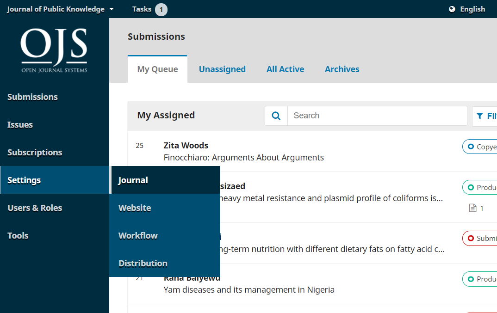

In dem Menü lassen sich Zeitschrifteneinstellungen, Website-Einstellungen, Workflow-Einstellungen und Vertriebseinstellungen vornehmen, die in den nächsten 4 Kapiteln behandelt werden.

Auf der Seite Zeitschrifteneinstellungen befinden sich Informationen über die Zeitschrift.

Über die Registerkarten kann man zu verschiedenen Abschnitten der Zeitschrifteneinstellungen navigieren: Impressum, Kontakt, Rubriken der Zeitschrift und Kategorien.

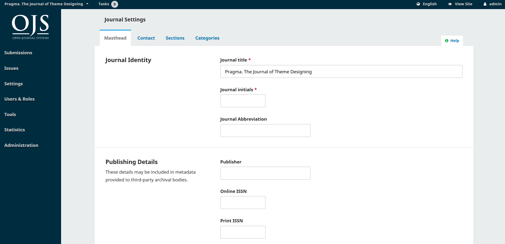

## Impressum {#masthead}

Dieses englischsprachige Video der PKP School erklärt, wie das Impressum in OJS verwaltet wird. Weitere Videos dieser Reihe finden Sie auf dem [PKP YouTube-Kanal](https://www.youtube.com/playlist?list=PLg358gdRUrDVTXpuGXiMgETgnIouWoWaY).



Der Titel der Zeitschrift ist der Name der Zeitschrift, wie z. B. Zeitschrift für Softwaredokumentation.

Das Kürzel der Zeitschrift bildet die Initialen der Zeitschrift wie z. B. ZfS.

Die Zeitschriftenabkürzung ist die Abkürzung Ihres Zeitschriftennamens, wie z. B. Z. f. Sd.

\*\*Unter Verlag, Organisation findet sich der Name des Verlages oder der Organisation, bei der die Zeitschrift publiziert wird.

Der hier eingegebene Verlagsname wird für die Metadaten verwendet, aber erscheint nicht auf der Website der Zeitschrift. Um den Namen des Verlags auf der Website anzeigen zu lassen, kann der Name in den Zeitschrifteneinstellungen unter Kontakt > E-Mail eingeben werden. Der Name kann zudem unter "Über die Zeitschrift" hinzugefügt werden.

**Die ISSN** (International Standard Serial Number) ist eine achtstellige Zahl, die Zeitschriften identifiziert. Sie wird von einem weltweiten Netzwerk von nationalen Zentren geleitet, das von einem internationalen Zentrum mit Sitz in Paris koordiniert wird, unterstützt von der UNESCO und der französischen Regierung. Eine Zahl kann von der [ISSN Website](https://www.issn.org/) bezogen werden. Dies kann jederzeit im Betrieb der Zeitschrift erfolgen.

OJS-Zeitschriften werden in der Regel eine Online-ISSN erhalten. Wenn eine Zeitschrift zudem eine Druckversion veröffentlicht, erfordert dies eine andere ISSN.

Der hier eingegebene Verlagsname wird für die Metadaten verwendet, erscheint aber nicht auf der Website der Zeitschrift. Es wird empfohlen, die ISSN in der Fußzeile der Website hinzuzufügen. Die Fußzeile kann unter Website-Einstellungen > Aussehen > Einrichtung angepasst werden.

**Die Zusammenfassung** der Zeitschrift ist eine kurze Beschreibung der Zeitschrift. Bei einer OJS-Installation mit mehreren Zeitschriften erscheint dieser Text in der Auflistung der Zeitschriften. Die Zeitschriftenübersicht kann auch in den Website-Einstellungen zur Zeitschriften-Homepage hinzugefügt werden.

Unter **Redaktion** lassen sich die Namen des Redaktionsteams hinzuzufügen. Dies wird auf der öffentlichen Website unter Über &gt; Redaktion erscheinen.

Unter **Über uns** lassen sich alle Informationen über die Zeitschrift hinzuzufügen, die für Leser/innen, Autor/innen oder Gutachter/innen von Interesse sind.

Dies könnten bspw. die Open-Access-Richtlinie, Schwerpunkte und der Umfang der Zeitschrift, der Copyright-Vermerk, die Offenlegung von Sponsoren, die Historie des Journals, eine Datenschutzerklärung oder die Aufnahme in das LOCKS- oder CLOCKSS-Archivsystem beinhalten.

Mit dem Speichern-Button lassen sich die vorgenommenen Änderungen speichern.

## Kontakt {#contact}

Dieses PKP School Video erklärt, wie man einen Zeitschriftenkontakt hinzufügt. Weitere Videos dieser Reihe finden Sie auf dem [PKP YouTube-Kanal](https://www.youtube.com/playlist?list=PLg358gdRUrDVTXpuGXiMgETgnIouWoWaY).



Dieser Bereich kann genutzt werden, um Kontaktinformationen der Zeitschrift einzutragen.

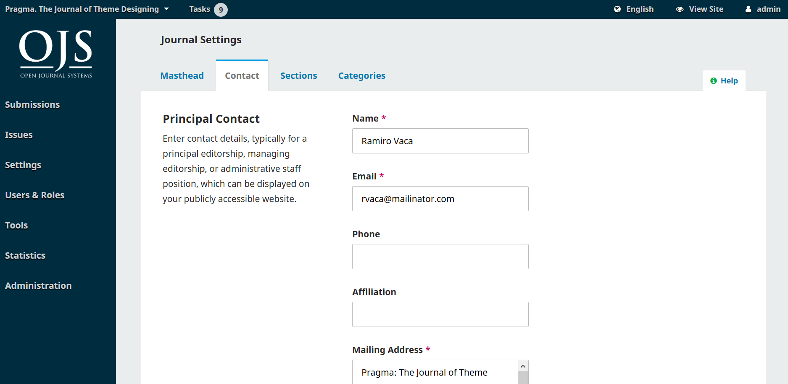

**Hauptkontakt**: Hier können Kontaktinformationen für die Hauptkontaktperson der Zeitschriften hinzugefügt werden, einschließlich Name, E-Mail, Telefon, Zugehörigkeit und Postanschrift der Zeitschrift. Diese Informationen erscheinen auf der Kontakt-Seite der Zeitschrift.

**Kontakt bei technischen Fragen**: Hier können Kontaktinformationen für den technischen Support der Zeitschrift hinzugefügt werden. Diese Informationen erscheinen auf der Kontakt-Seite der Zeitschrift und an verschiedenen Stellen des Workflows, um Benutzer/innen Unterstützung anzubieten.

Mit dem Speichern-Button lassen sich die vorgenommenen Änderungen speichern.

## Rubriken {#sections}

Dieses PKP School Video erklärt, wie man eine Rubrik in OJS konfiguriert. Weitere Videos dieser Reihe finden Sie auf dem [PKP YouTube-Kanal](https://www.youtube.com/playlist?list=PLg358gdRUrDVTXpuGXiMgETgnIouWoWaY).



Auf dieser Seite lassen sich die Rubriken der Zeitschrift anlegen und konfigurieren, wie zum Beispiel Artikel, Editorials, Reviews, Kommentare. wie zum Beispiel Artikel, Editorials, Rezensionen, Kommentare. OJS benötigt mindestens eine Rubrik und erstellt standardmäßig eine Rubrik "Artikel". Es lassen sich neue Rubriken erstellen, bestehende Rubriken bearbeiten oder Rubriken löschen. Über die Rubriken lassen sich Autor/innen einer Einreichung zuweisen. Zudem werden sie verwendet, um die Artikel in den veröffentlichten Ausgaben zu organisieren. Es lassen sich auch einzelne Redakteur/innen bestimmten Rubriken zuordnen. Dieser Teil der Anleitung erklärt, wie sich Sektionen konfigurieren lassen.

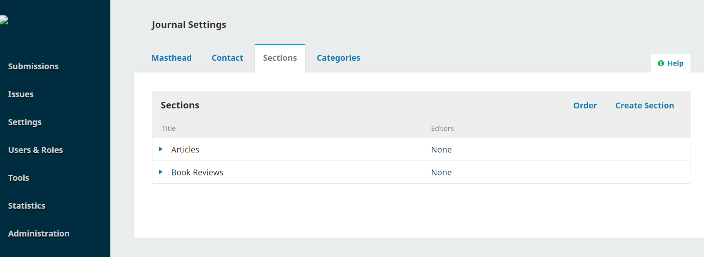

Einreichungen können für einzelne Rubriken deaktiviert werden. Das kann beispielsweise sinnvoll sein, wenn eine bestimmte Rubrik nicht mehr verwendet wird und verhindert werden soll, dass Artikel eingereicht werden.

Eine Rubrik kann in den Rubrikseinstellungen als „Inaktiv“ markiert werden:

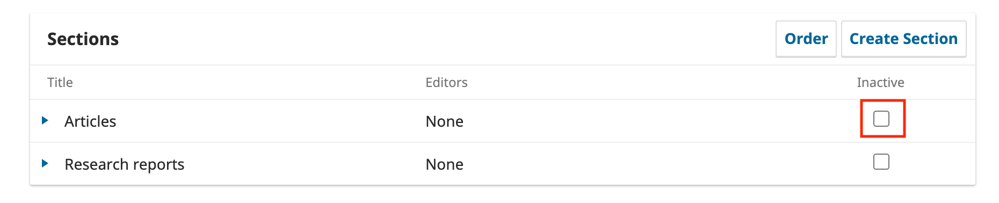

Rubriken lassen sich ändern, indem man auf den blauen Pfeil links neben dem Namen der Rubrik klickt. Dies zeigt Optionen zum Bearbeiten oder Löschen der Rubrik an.

### Rubrik bearbeiten

Der Link "Bearbeiten" öffnet ein neues Fenster mit verschiedenen Konfigurationsoptionen.

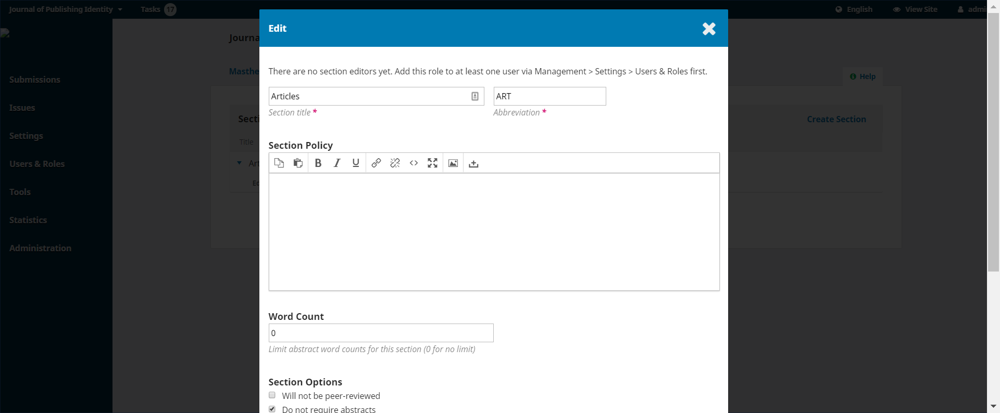

Hier kann der Name oder die Abkürzung der Rubrik verändert werden.

**Rubrikrichtlinie**: Hier lassen sich wichtige Details, wie Einreichungsvoraussetzungen, Begutachtung etc., hinzuzufügen.

**Wortzahl**: Hier lässt sich die Anzahl der Wörter für Zusammenfassungen von Artikeln in dieser Rubrik begrenzen.

**Rubrikenoptionen**: Jede Rubrik kann verschiedene Einstellungen haben. Das beinhaltet beispielsweise, ob die Rubrik indexiert wird, begutachtet wird, überhaupt Einreichungen akzeptiert werden oder ob die Rubrik in dem Inhaltsverzeichnis aufgelistet wird.

Das Editorial einer Zeitschrift wird zum Beispiel in der Regel nicht begutachtet.

Einreichungen können für einzelne Rubriken deaktiviert werden. Das kann beispielsweise sinnvoll sein, wenn eine bestimmte Rubrik nicht mehr verwendet wird und verhindert werden soll, dass Artikel eingereicht werden.

Die Option "Wird nicht in den Index der Zeitschrift aufgenommen" kann für Rubriken deaktiviert werden, die das Titelbild, Rückseiten oder andere Inhalte beinhalten, um den Suchindex nicht unnötig zu überladen.

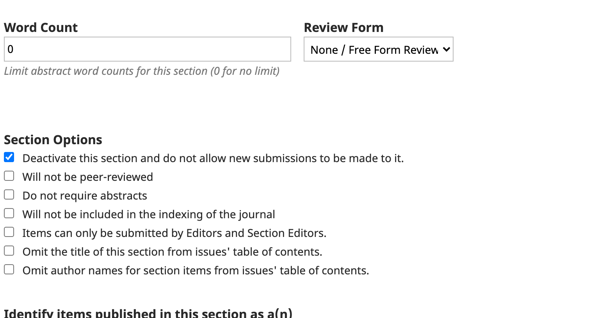

**Beiträge in der dieser Rubrik kennzeichnen als**: Dies wird nur von einigen Systemen verwendet  und ist daher kein Pflichtfeld.

**Rubrikredakteur/innen**: Hier werden die Redakteur/innen aufgelistet, die der Zeitschrift zugeordnet sind. Bei Aktivierung werden alle Einreichungen der Rubrik automatisch einer/einem Redakteur/in zugewiesen. Dadurch müssen Einreichungen einer Rubrik nicht manuell zugewiesen werden.

Mit dem **Speichern-Button** lassen sich die vorgenommenen Änderungen speichern und man kehrt zu der Rubrikübersicht zurück.

### Eine Rubrik erstellen

Auf der Rubrikübersicht kann der Button "Eine Rubrik erstellen" ausgewählt werden, um ein leeres Rubrikfenster zu öffnen. Das Fenster ist genau das gleiche wie das Fenster, das für die Bearbeitung einer Rubrik oben beschrieben wird.

Füllen Sie die Details aus und klicken Sie auf Speichern, um die Rubrik anzulegen.

### Rubrikeinreichung beschränken

Jeder Abschnitt erlaubt es, die Einreichungen einzuschränken, indem man auf das Kontrollkästchen "Beiträge können nur von Redakteur/innen und Rubrikredakteur/innen eingereicht werden" in der Bearbeitungsseite der Rubrik aktiviert.

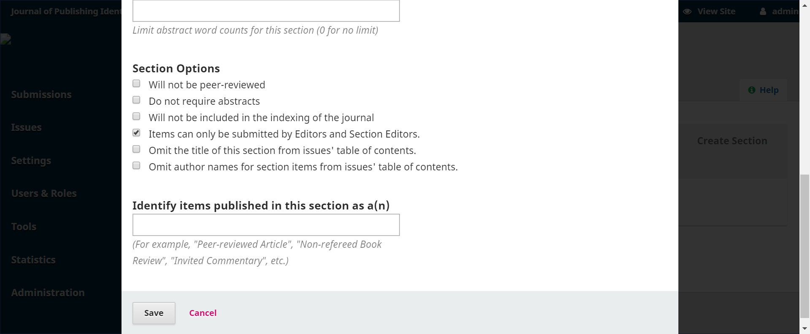

Wenn dieses Kontrollkästchen für alle Rubriken aktiviert ist, können Autor/innen keine Einreichungen in der Zeitschrift tätigen. Autor/innen, die den Link "Neue Einreichung" in ihrem Dashboard anklicken, werden nun die Nachricht "Diese Zeitschrift akzeptiert derzeit keine Einreichungen" sehen.

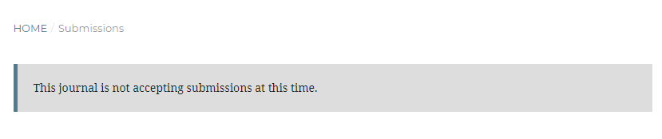

### Weitere Rubriken

Wenn mehr als eine Rubrik erstellt wurde, ist ein "Sortieren"-Link zu sehen. Über diesen Link kann die Darstellung der Sektionen auf der Webseite neu angeordnet werden.

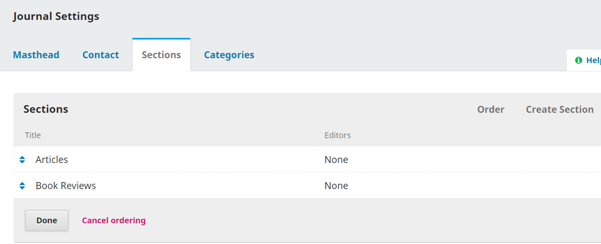

Durch Drücken auf den Button "Fertig" akzeptiert man die Sortierung.

### Rubriken löschen

Eine Rubrik kann nur gelöscht werden, wenn ihr keine Artikel zugewiesen sind. Um eine Rubrik zu löschen, der Artikel zugewiesen sind, müssen zuerst die Artikel in eine andere Rubrik verschoben werden. Nachdem man auf den blauen Pfeil neben dem Namen der Rubrik geklickt hat, erscheint der Link "Löschen". OJS wird fragen, ob die Rubrik dauerhaft gelöscht werden soll. Dies muss mit "Ja" bestätigt werden.

## Kategorien {#categories}

Dieses PKP School Video erklärt, wie man eine Kategorie in OJS anlegt. Weitere Videos dieser Reihe finden Sie auf dem [PKP YouTube-Kanal](https://www.youtube.com/playlist?list=PLg358gdRUrDVTXpuGXiMgETgnIouWoWaY).



In OJS 3 lassen sich Kategorien erstellen, durch die Artikel in thematischen Sammlungen organisiert werden können. Leser/innen wird dadurch die Möglichkeit gegeben, auf die Inhalte der Zeitschrift zuzugreifen. Kategorien können als Browse-Block auf der Zeitschriften-Webseite angezeigt werden und die Leser/innen können eine Kategorie wählen, um alle Artikel in dieser Kategorie anzeigen zu lassen. Ein Artikel lässt sich in einer Kategorie platzieren, indem dessen Metadaten bearbeitet werden. Dies wird im Kapitel [Produktion und Veröffentlichung](./production-publication). In diesem Abschnitt wird erläutert, wie man Kategorien anlegen und bearbeiten kann.

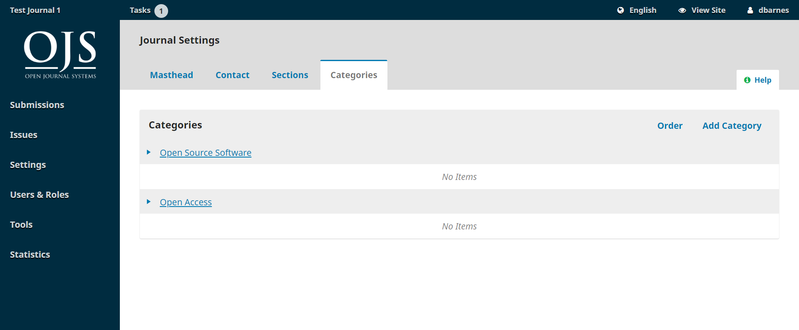

Um eine neue Kategorie zu erstellen:

- Auf "Kategorie hinzufügen" klicken
- Einen Namen für die Kategorie eingeben, der den Leser/innen angezeigt wird
- Einen Pfad für die URL der Kategorie auf der Seite eingeben
- Eine Beschreibung eingeben, die oberhalb der Liste der Artikel in der Kategorie erscheint
- Otional kann die die Reihenfolge der Artikel nach Datum oder Titel geändert werden
- Optional lässt sich ein Bild hinzufügen, das oben auf der Seite der Kategorie angezeigt wird
- "Speichern" klicken

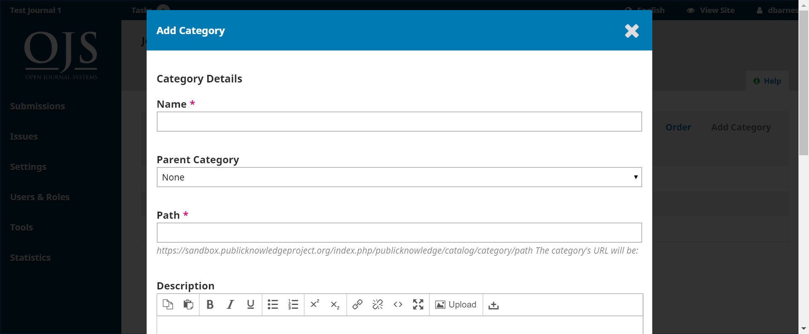

Um eine Kategorie zu bearbeiten:

- Auf den Namen der Kategorie, die bearbeitet werden soll, klicken
- Änderungen durchführen
- "OK" klicken

Um eine Kategorie zu löschen:

- Auf den blauen Pfeil neben der zu löschenden Kategorie klicken
- Auf den Entfernen-Link klicken, der erscheint
- Bestätigen, dass die Kategorie gelöscht werden soll

Um Kategorien auf der Website anzuzeigen, kann unter Website-Einstellungen Aussehen > Seitenleiste der Browser-Block in der Seitenleiste aktiviert werden.
