# Produktion und Veröffentlichung

Nach Abschluss des Lektorats geht die Einreichung nun in die Produktion über. Von hier aus werden die lektorierten Dateien in veröffentlichungsfähige Druckfahnen (z. B. PDF, HTML) konvertiert und vor der Veröffentlichung Korrektur gelesen. Eine neue Ausgabe der Zeitschrift wird erstellt und der Artikel wird für die Veröffentlichung in dieser Ausgabe vorgesehen. In diesem Kapitel werden die einzelnen Schritte dieses Prozesses erläutert. Außerdem wird erklärt, wie die Versionsverwaltung (die erstmals in OJS 3.2 eingeführt wurde) genutzt werden kann, um eine neue Version eines Artikels zu veröffentlichen, wenn wesentliche Änderungen vorgenommen wurden.

OJS bietet auch eine unkomplizierte Möglichkeit, den im vorigen Kapitel beschriebenen redaktionellen Arbeitsablauf zu umgehen und Inhalte direkt in die Erstellungsphase zu übertragen, wo sie einer Ausgabe hinzugefügt und veröffentlicht werden können. Sie können dies über das Quick Submit Plugin tun. Siehe dazu die ausführliche Anleitung zum [Quick Submit Plugin im Kapitel Import/Export](./tools.md/#importexport).

Um mit der Erstellung zu beginnen, muss eine Person der Rubriken- oder Zeitschriftenredaktion sich in das System einloggen und den Beitrag im Dashboard auswählen.

Wenn Sie auf den Artikel klicken, wird das Einreichungsprotokoll geöffnet.

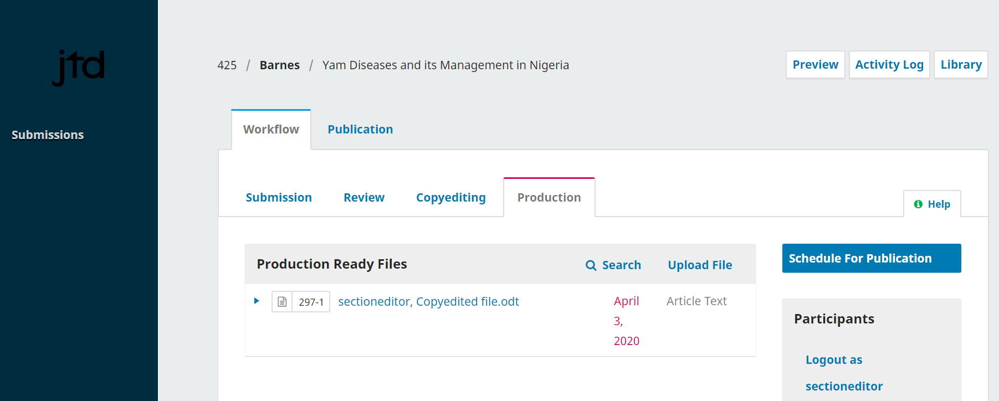

Sie werden die kopierten Dateien nun im Bereich Produktionsfertige Dateien finden.

Im Reiter **Produktion** können Sie Teilnehmer/innen (z. B. eine/n Layout-Leiter/in) der Produktionsphase des Workflows zuweisen und mit den Teilnehmer/innen im Bereich **Diskussion zur Herstellung** kommunizieren.



In diesem Video der PKP School werden die Schritte erläutert, die der/die Rubrikredakteur/in, der/die Produktionsredakteur/in und/oder der/die Designer/in in der Produktionsphase und auf der Registerkarte Veröffentlichung durchführen (englischsprachig). Um weitere Videos in dieser Reihe anzuschauen, besuchen Sie [PKPs YouTube-Kanal](https://www.youtube.com/playlist?list=PLg358gdRUrDUKJbWtr4bgy133_jwoiqoF).

## Reiter Veröffentlichung {#publication-tabs}

Alles, was mit der Veröffentlichung eines Beitrags zu tun hat, wird im Reiter Veröffentlichung erledigt. Auf dem Reiter Veröffentlichung können Sie Informationen über den Beitrag bearbeiten oder hinzufügen, einschließlich der Beitragenden, Metadaten und Identifikatoren. Außerdem können Sie hier die endgültigen Fahnen für die Veröffentlichung in der Zeitschrift hochladen.

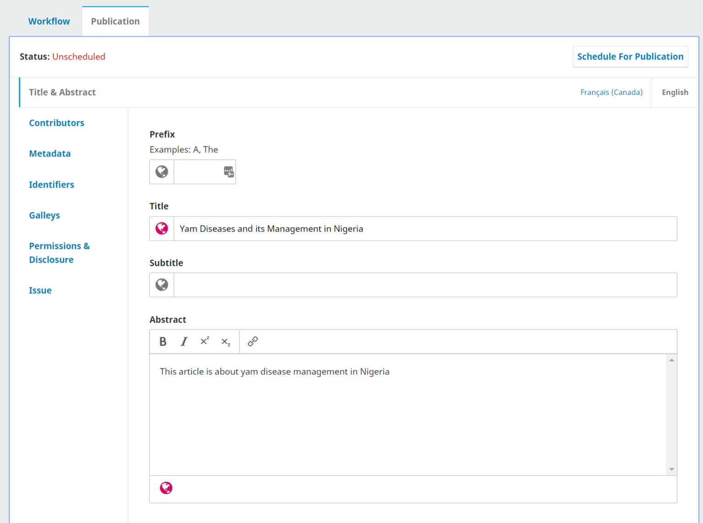

Im Folgenden finden Sie einen Überblick über die verschiedenen Reiter in diesem Bereich. Detaillierte Anleitungen zu einigen dieser Reiter finden Sie weiter unten in diesem Kapitel.

**Titel & Abstract** Auf diesem Reister können Sie den Titel, den Untertitel und die Zusammenfassung des Artikels bearbeiten.

Wenn Sie Änderungen vorgenommen haben, klicken Sie auf Speichern, bevor Sie das Fenster schließen.

**Beitragende** Auf dieser Registerkarte können Sie Beitragende zum Artikel hinzufügen, bearbeiten oder entfernen.

**Metadaten** Auf dieser Registerkarte können Sie Schlagworte hinzufügen oder bearbeiten.

Wenn Sie Änderungen vorgenommen haben, klicken Sie auf Speichern, bevor Sie das Fenster schließen.

**Identifikatoren** Verwenden Sie die Registerkarte Identifikatoren, um einen eindeutigen Identifikator, wie z. B. einen DOI, anzuzeigen oder hinzuzufügen. Weitere Informationen über die Zuweisung und Verwaltung von DOIs finden Sie im [DOI-Plugin-Leitfaden](/doi-plugin).

**Fahnen** Verwenden Sie die Registerkarte Fahnen, um die endgültige Datei für die Veröffentlichung hochzuladen. Dies wird weiter unten erklärt.

**Berechtigungen und Offenlegung** Fügen Sie Details über den/die Urheberrechtsinhaber/in und einen Link zur Artikellizenz ein, falls zutreffend. Diese Angaben werden automatisch entsprechend Ihren [Vertriebs-Einstellungen](./settings-distribution.md) ausgefüllt.

**Ausgabe** Verwenden Sie den Reiter Ausgabe, um den Artikel einer Zeitschriftenausgabe zuzuordnen. Dies wird weiter unten erklärt.

### Mehrsprachige Einreichungen

Die Reiter Titel & Abstract, Metadaten, Berechtigungen und Offenlegungen und Ausgabe bieten Optionen zum Hinzufügen und Bearbeiten von Metadaten in mehreren Sprachen. Die Sprachen müssen zunächst unter Website-Einstellungen - Einrichtung - Sprachen aktiviert werden.

Wählen Sie die gewünschte Sprache unter dem Button „Zur Veröffentlichung vorsehen“ aus und füllen Sie die Metadatenfelder in der ausgewählten Sprache aus.

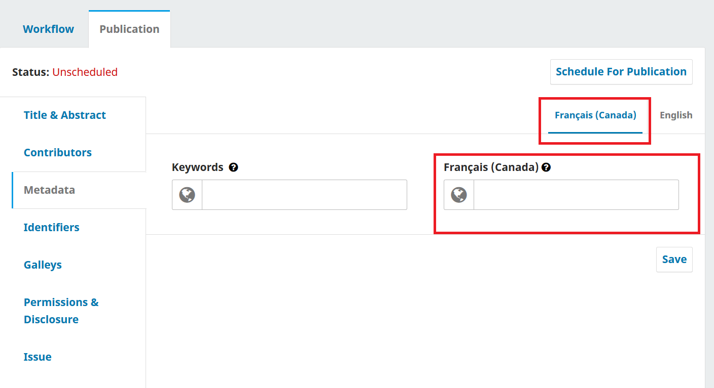

Unter dem Reiter „Ausgabe“ können Sie mehrere Titelbilder in ausgewählten Sprachen hochladen.

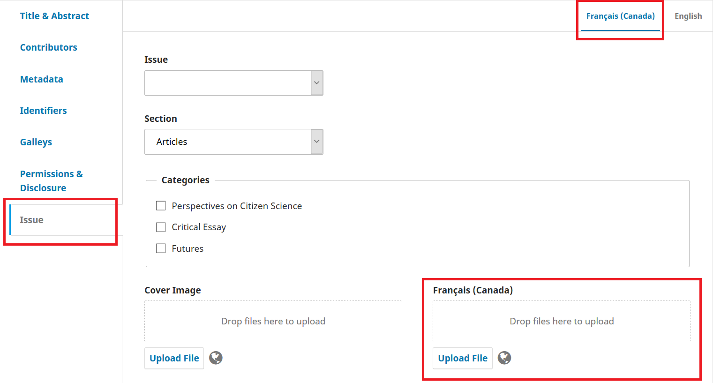

## Artikel für Veröffentlichung formatieren {#format-article-for-publication}

### Layout-Leiter/in zuweisen

Ein Hinweisbanner weist darauf hin, dass Sie jemanden zuweisen müssen, für die Erstellung der Fahnen (z. B. PDFs, HTML usw.) aus den produktionsfertigen Dateien.

Dies kann von Zeitschrift zu Zeitschrift unterschiedlich sein - möglicherweise haben Sie Layout-Leiter/innen oder Produktionsassistent/innen, die diese Arbeit erledigen. Einige Zeitschriften nutzen einen externen Anbieter für Grafikdesign oder Schriftsatz. Wenn Sie mit Ihrer/Ihrem Layout-Leiter/in, Produktionredakteur/in, Grafikdesigner/in oder Schriftsetzer/in über OJS kommunizieren und den Produktionsprozess mit ihnen in OJS verwalten möchten, stellen Sie sicher, dass sie über ein Benutzerkonto verfügen, und fügen Sie sie als Teilnehmer/in für die Einreichung hinzu.

Um die Zuordnung vorzunehmen, verwenden Sie den Button **Zuweisen** in der Teilnehmer/innenliste. Daraufhin wird ein neues Fenster geöffnet.

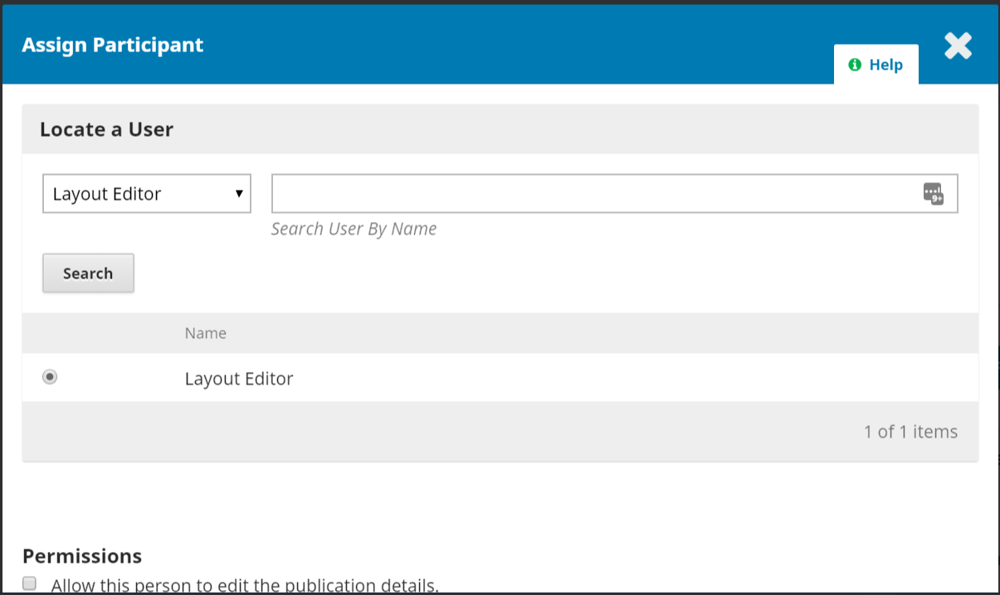

Verwenden Sie die Rollenauswahl und den Such-Button, um geeignete Benutzer/innen zu finden. Wählen Sie den/die Benutzer/in und eine vordefinierte Nachricht aus und klicken Sie zum Senden auf **OK**.

Die Benutzer/innen sind nun per E-Mail und im Dashboard benachrichtigt worden.

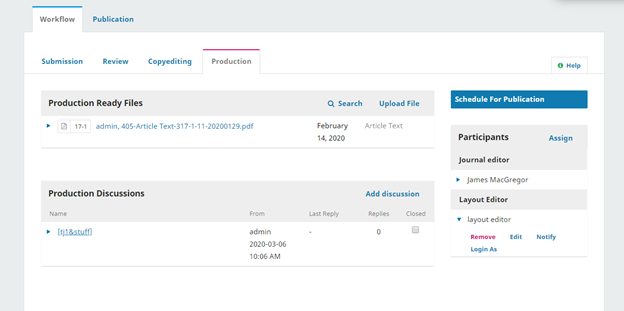

Der/die Layout-Leiter/in ist nun unter Beitragende zu sehen, und die Benachrichtigung über die Anfrage ist im Bereich Produktionsdiskussionen zu sehen.
Sie können nun warten, bis der/die Layout-Leiter/in seine/ihre Aufgaben erledigt hat.

### Layout-Bearbeitung

Als Layout-Leiter/in haben Sie eine Nachricht erhalten, in der Sie aufgefordert werden, die Druckfahnen für die Einreichung zu erstellen.
Um damit zu beginnen, melden Sie sich im System an und rufen Ihr Dashboard auf.

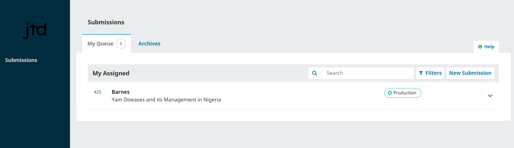

Suchen Sie von hier aus die Einreichung und wählen Sie den Link **Produktion**. Dies wird Sie zum Einreichungsprotokoll führen.

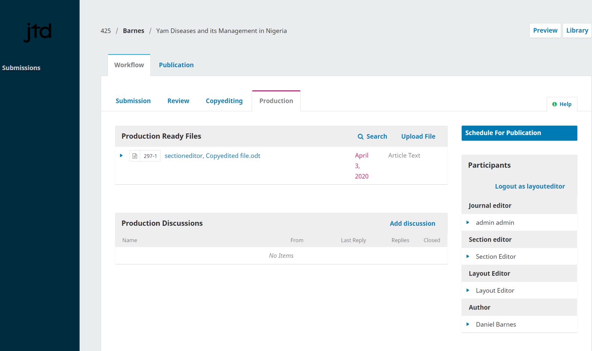

Laden Sie die Dateien vom Bereich Produktionsfertige Dateien auf Ihren Desktop herunter und konvertieren Sie sie außerhalb von OJS in die Druckfahnen. Im nächsten Abschnitt werden die Formate und die Vorbereitung von Fahnen erläutert.

> Hinweis: PKP arbeitet derzeit an einem Projekt zur Automatisierung der Konvertierung von Microsoft Word-Dokumenten in andere Formate, einschließlich XML, HTML, PDF, EPUB etc. Behalten Sie unseren Blog im Auge, um auf dem Laufenden zu bleiben.

### Fahnen vorbereiten und hinzufügen

Eine Fahne ist die endgültige, publikationsfertige Datei, die für die Leser/innen aufbereitet wurde und auf der Artikelseite veröffentlicht wird. Fahnen sollten in einem stabilen, nicht bearbeitbaren Format vorliegen (z. B. HTML, ePub oder XML) und den vollständigen Artikel enthalten. Fahnen können auch ergänzende Materialien wie Multimedia-Dateien und Forschungsdaten umfassen. Sie können Fahnen sowohl als einzelne Artikel als auch für eine gesamte Ausgabe veröffentlichen.

#### Fahnen-Bestandteiltypen

Wenn Sie eine Fahne hochladen, müssen Sie **Artikelbestandteile** auswählen. Diese entsprechen den Artikelbestandteilen, welche die Autor/innen beim Hochladen ihrer Einreichungsdateien auswählen. Sie können die Artikelbestandteile unter Workflow-Einstellungen > Einreichung > Bestandteile konfigurieren - je nachdem, ob der Artikelbestandteil veröffentlicht werden soll oder ob ein Link dazu auf der Artikelseite oder im Inhaltsverzeichnis erscheinen soll.

Die Konfigurationen sind wie folgt:

- Abhängig: Der Link wird nicht mit den veröffentlichten Inhalten angezeigt
- Ergänzend: Der Link wird auf der Startseite des Artikels angezeigt
- Weder zusätzlich noch abhängig: der Link erscheint sowohl auf der Artikelseite als auch im Inhaltsverzeichnis

Zum Beispiel, wenn Sie Multimedia-Dateien in HTML-Dateien einbetten möchten, sodass diese auf der Artikelseite, der Ausgabenseite und der Einreichungsseite angezeigt werden, nehmen Sie folgende Einstellungen vor:

- Gehen Sie zu Einstellungen > Workflow > Einreichung > **Bestandteile**
- Klicken Sie auf den blauen Pfeil neben **HTML Stylesheet** und wählen Sie **Bearbeiten aus**
- Deaktivieren Sie die Optionen „Dateien dieses Typs als abhängige Dateien markieren“ und „Dateien dieses Typs als ergänzende Dateien markieren“. Klicken Sie **Speichern**.
- Klicken Sie auf den blauen Pfeil neben **Multimedia** und wählen Sie **Bearbeiten**
- Deaktivieren Sie „Dateien dieses Typs als ergänzende Dateien markieren“. Lassen Sie „Abhängige Dateien“ aktiviert. Klicken Sie **Speichern**.

#### Fahnen-Formate

Online-Zeitschriften veröffentlichen ihre Artikel in verschiedenen Dateiformaten. Die gängigsten Formate sind PDF und HTML, aber zunehmend werden auch weitere Formate wie ePub, MP3 und XML genutzt.

In OJS ermöglichen Plugins die Anzeige von PDF-, HTML- und XML-Dateien direkt im Webbrowser oder den Download der Dateien. Falls die Dateien nur zum Download angeboten und nicht im Browser angezeigt werden, müssen Sie möglicherweise eines der folgenden Plugins unter Website-Einstellungen > Plugins aktivieren:

- PDF.JS PDF Viewer: Ermöglicht die Darstellung von PDF-Artikeldateien.
- eLife Lens Article Viewer: Unterstützt die Anzeige von JATS-XML-Artikeldateien mit eLife Lens.
- HTML Article Galley Plugin: Ermöglicht die Darstellung von HTML-Artikeldateien.

Andere Formate benötigen möglicherweise zusätzliche Plugins oder können nur zum Download angeboten werden. Alternativ können Sie den Volltext auf einer anderen Plattform hosten und eine externe URL einbetten, indem Sie die Option „Diese Fahne ist auf einer separaten Website verfügbar.“ aktivieren

#### Verwendung von Vorlagen

Es kann die Dokumentenkonvertierung erheblich erleichtern, wenn alle Einreichungen eine Dokumentvorlage verwenden, die mit den Publikationsstilen Ihrer Zeitschrift (z. B. Schriftart, Schriftgröße, Fettdruck, Platzierung von Kopfzeilen, Textkörper, Fußzeilen usw.)  vorformatiert ist.
[Microsoft bietet eine kurze Übersicht zum Erstellen von Vorlagen in MS Word](https://support.microsoft.com/en-us/topic/create-a-template-86a1d089-5ae2-4d53-9042-1191bce57deb?ui=en-us&rs=en-us&ad=us) (englischsprachig).

Sobald Sie eine Vorlage erstellt haben, die dem Stil Ihrer Zeitschrift entspricht, kann diese für einreichende Autor/innen, Layout-Redakteur/innen oder andere Benutzer/innen nützlich sein.
Hier ist ein Beispiel für eine OJS-Zeitschrift, in der Autoren aufgefordert werden, eine Vorlagendatei herunterzuladen und zu verwenden: [Paideusis](https://journals.sfu.ca/pie/index.php/pie/about/submissions) (englischsprachig).

Idealerweise sollte Ihre Vorlage mit Stilen und nicht mit direkter Formatierung erstellt werden. Dies gewährleistet nicht nur Konsistenz in Ihren Dokumenten, sondern erleichtert auch die Konvertierung in andere Formate (z. B. HTML). Hier ist eine [Erklärung für den Unterschied zwischen Stilen und direkter Formatierung in Word](https://support.microsoft.com/en-us/office/customize-or-create-new-styles-d38d6e47-f6fc-48eb-a607-1eb120dec563?redirectSourcePath=%252fen-us%252farticle%252fStyle-basics-in-Word-d382f84d-5c38-4444-98a5-9cbb6ede1ba4&ui=en-US&rs=en-US&ad=US) (englischsprachig)

#### PDF-Dateien

Ein PDF ist die einfachste Art von Datei, die aus einem Word-Dokument erstellt werden kann. Aktuelle Versionen von Microsoft Word (und anderen Textverarbeitungsprogrammen) ermöglichen es Ihnen, eine Datei als PDF zu „Speichern “ oder zu „Exportieren“. Die Mehrheit der OJS-Zeitschriften veröffentlicht ihre Artikel als PDFs.

PDFs sind bei vielen Leser/innen beliebt, da sie die gedruckte Seite am besten nachbilden. Allerdings sind PDFs auf mobilen Geräten oft weniger flexibel und unterstützen Links oder eingebettete Medien (wie Audio- oder Videodateien) nicht immer gut. Angesichts der weit verbreiteten Nutzung von mobilen Geräten wird es zunehmend wichtiger, sicherzustellen, dass Ihre Zielgruppe Ihre Artikel auf ihren Smartphones oder Tablets lesen kann.

Beispiel (siehe PDF-Link unten auf der Seite): [Irish Journal of Technology Enhanced Learning](http://www.journal.ilta.ie/index.php/telji/article/view/22/51) (englischsprachig)

#### HTML-Dateien

HTML-Dateien haben den Vorteil der Flexibilität. Sie unterstützen Verlinkungen und Multimedia sehr gut und passen auf fast jeden Bildschirm – einschließlich Smartphones und Tablets. Allerdings sehen sie anders aus als eine gedruckte Seite, weshalb einige Leser/innen ein PDF bevorzugen. Die ideale Lösung ist es, sowohl PDF- als auch HTML-Dateien anzubieten, um den Bedürfnissen unterschiedlicher Nutzer/innen gerecht zu werden.

Das Erstellen einer HTML-Datei kann mehr Zeit und Aufwand erfordern als das Erstellen von PDF-Dateien. Textverarbeitungsprogramme bieten keine effektiven Werkzeuge, um diese als HTML-Dateien zu speichern. Microsoft Word versucht es, aber die Ergebnisse sind nicht ausreichend für den Upload auf OJS. Stattdessen sollten Sie diesen Arbeitsablauf ausprobieren:

- Konvertieren Sie das Word-Dokument. Sie können [dieses kostenlose Online-Tool](https://word2cleanhtml.com/) verwenden, um eine erste Umwandlung durchzuführen.
- Öffnen Sie die resultierenden HTML-Dateien in einem Texteditor (z. B. Notepad in Windows) oder HTML-Editor (z. B. Adobe Dreamweaver). Hier müssen Sie eventuell noch letzte Bereinigungen oder Formatierungen vornehmen. Grundkenntnisse in HTML sind erforderlich. Es gibt viele [freie Tutorials](https://www.w3schools.com/html/), aber es dauert einige Zeit.
- Halten Sie die HTML-Formatierung einfach. Konzentrieren Sie sich nur auf Absätze, Zeilenumbrüche, Überschriften und Links. Sorgen Sie sich nicht um Schriftarten, Farben oder andere Designelemente – OJS kümmert sich automatisch um diese Aspekte im Rahmen des Gesamtlayouts der Zeitschrift.
- Laden Sie die Datei als HTML-Fahne in OJS hoch
- Der HTML-Viewer zeigt HTML-Dateien in einem iframe an, was die Navigation zu verlinkten Webseiten beeinträchtigen kann. Sie können dieses Problem umgehen, indem Sie Links in einem neuen Browser-Tab öffnen, indem Sie das Attribut `target="_blank"` zu Ihren href-Tags hinzufügen.

Einige Beispiel-HTML-Vorlagen können aus folgenden Quellen gefunden und angepasst werden:

- [Ressource von U von A](https://drive.google.com/file/d/1mCP0tguFJf7jJn_CNceEwvRn5eCJrvxP/view) - Lizenz: CC0 1.0 Universal (CC0 1.0)

Beispiele (siehe HTML-Link am Ende der Seite):

- [Cultural Anthropology](https://journal.culanth.org/index.php/ca/article/view/4434)
- [Evidence Based Library & Information Practice](https://journals.library.ualberta.ca/eblip/index.php/EBLIP/article/view/29621)

##### HTML-Fahnen gestalten

Es ist möglich, das Design Ihrer HTML-Fahnen entweder in großen Mengen oder einzeln pro Artikel zu gestalten. Eine Gestaltung in großen Mengen kann nur durchgeführt werden, wenn Sie ein benutzerdefiniertes Theme verwenden.

Um eine einzelne HTML-Fahne zu gestalten:

- Stellen Sie sicher, dass die HTML-Fahne beim Erstellen einen Verweis auf das Stylesheet im `<head>` -Bereich enthält, z. B. `<link rel="stylesheet" href="./article_styles.css" type="text/css" />`
- Laden Sie die HTML-Fahne hoch (siehe unten für Anweisungen zum **Hinzufügen von Fahnen**)
- Bearbeiten Sie die Fahne
- Laden Sie die CSS-Stylesheets mit dem entsprechenden **Artikel-Bestandteil – HTML Stylesheet** hoch

Um alle HTML-Fahnen zu gestalten: Wenn Sie ein benutzerdefiniertes Theme-Plugin verwenden, können Sie eine Zeile Code schreiben, um einen benutzerdefinierten Stil für alle HTML-Fahnen einzufügen. Dies gilt nur für HTML-Fahnen, denen kein individueller Stil zugewiesen wurde. Anweisungen sind im [PKP Theming Guide](https://docs.pkp.sfu.ca/pkp-theming-guide/en/) (englischsprachig) verfügbar.

##### Bilder und Multimedia zu einer HTML-Fahne hinzufügen

Wenn Sie Bilder oder Multimediadateien in eine HTML-Fahne einfügen möchten, können Sie diese als abhängige Dateien zu dieser Einreichung hochladen und innerhalb der Datei einen Link zu ihnen setzen, um sie anzuzeigen.

Bevor Sie mit dem Hochladen des Elements beginnen, benötigen Sie eine HTML-Seite,  die eines der folgenden Elemente enthält:

- `<audio controls>` Element (für MP3)
- `<video>` Element (für MP4) oder
- `` Tag für Bilder

Die HTML-Seite sollte auch den genauen Namen der Datei enthalten, die sie verknüpfen wollen.

Sie müssen die Audio-/Video-/Bilddatei im MP3-/MP4-/JPEG-/GIF-Format unter dem Namen der in der HTML-Seite genutzt wird speichern.

Ihre HTML-Datei muss mindestens den folgenden Code enthalten (für Audiodateien). Für den zugehörigen Video- oder Bilddateicode lesen Sie die w3school-Anweisungen zu [Einbetten von Videos in HTML](https://www.w3schools.com/html/html5_video.asp) oder Anweisungen zu [Einbetten von Bildern in HTML](https://www.w3schools.com/html/html_images.asp) (englischsprachig).

```html
<html>
<head>
<title>MP3 upload</title>
</head>
<body>
<audio controls>
  <source src="filename.mp3" type="audio/mpeg">
Your browser does not support the audio element.
</audio>
</body>
</html>
```

In OJS müssen Sie vor dem Hinzufügen von Multimediadateien die Einstellungen für Ihre Bestandteiltypen konfigurieren. Siehe **Fahnen-Bestandteiltypen** oben für Details zur Anpassung dieser Einstellungen.

Vergewissern Sie sich, dass Sie „Multimedia“- und/oder „Bild“-Dateien als „abhängige Dateien“ in den Bestandteiltyp-Einstellungen konfiguriert haben.

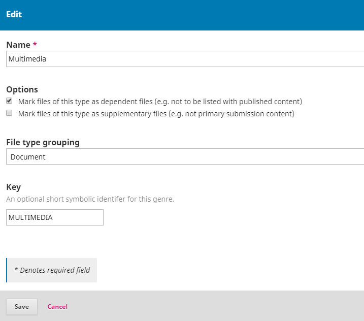

Gehen Sie nun zurück zur Einreichung und laden Sie ein HTML-Stylesheet hoch, um Ihre Multimediadatei anzuzeigen. Siehe weiter unten für Anweisungen zum **Hinzufügen von Fahnen**. Zusätzlich wenn Sie die Datei hochladen:

- Beschriften Sie die Fahne nach dem Typ der Multimedia-Datei (z. B. MP3/MP4)
- Wählen Sie **HTML Stylesheet** aus der **Artikelbestandteile** Dropdown-Liste
- Laden Sie die von Ihnen vorbereitete HTML-Datei hoch, die zumindest den Mindestcode enthält (siehe Anweisungen oben).
- Klicken Sie auf **Weiter**
- Im Reiter Metadaten können sie abhängige Dateien hochladen. Hier laden Sie die MP3/MP4/Bilddatei hoch.

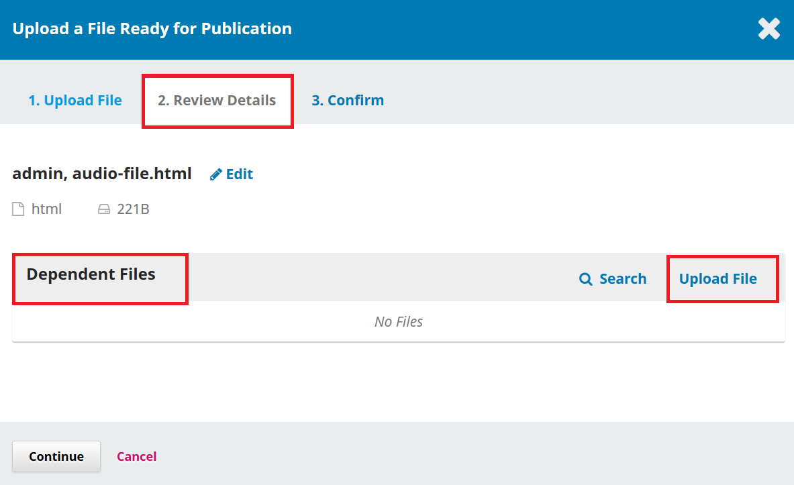

Wählen Sie **Multimedia** oder **Bild** aus dem Dropdown-Menü **Artikebestandteile** und laden Sie die MP3, MP4 oder Bilddatei hoch.

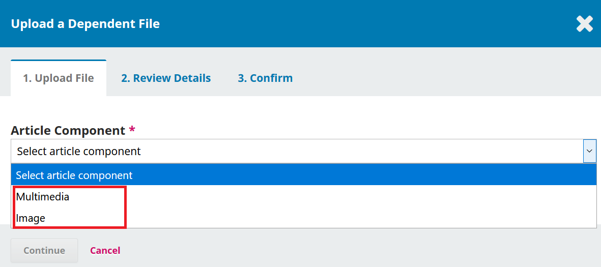

Wenn Sie eine Bilddatei hochladen, werden Sie aufgefordert, eine Bildunterschrift, einen Bildnachweis, einen Urheberrechtsinhaber und ggf. Genehmigungsbedingungen anzugeben.

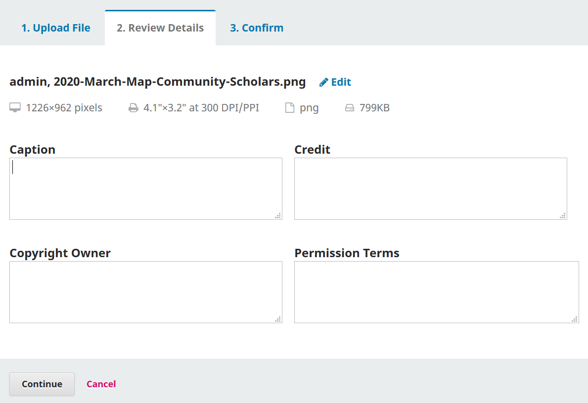

Klicken Sie auf **Weiter** um das Hochladen abzuschließen, die Details zu überprüfen und zu bestätigen. Ihre Multimediadatei wurde nun als abhängige Datei zusammen mit dem HTML-Code hinzugefügt und in den HTML-Code eingebettet, wenn der Artikel veröffentlicht wird.

#### ePUB-Dateien

Ähnlich wie HTML-Dateien sind ePUB-Dateien ideal für mobile Geräte geeignet, erfordern aber eine spezielle Programmsprache zur Erstellung. Es stehen Konvertierungswerkzeuge zur Verfügung, wie zum Beispiel [Calibre](https://calibre-ebook.com/). Ausführlichere Anleitungen zur Erstellung von ePub-Dateien sind [hier](https://www.wikihow.com/Convert-a-Word-Document-to-Epub) (englischsprachig) verfügbar.

Ähnlich wie bei HTML-Dateien kann nach der Konvertierung eine zusätzliche Nachbearbeitung erforderlich sein, die ein [gewisses Wissen](http://www.jedisaber.com/eBooks/Introduction.shtml) (englischsprachig) über das Format voraussetzt.

Beispiel (siehe EPUB-Link am Ende der Seite): [International Review of Research in Open and Distance Learning](http://www.irrodl.org/index.php/irrodl/article/view/2895) (englischsprachig)

#### XML Dateien

XML-Dateien sind strukturierte Dateien, in denen jeder Teil des Artikels als eigenständiges Element getaggt wird. Dies ermöglicht dem/der Leser/in eine einfache Navigation und den Zugriff auf Abbildungen, Bilder, Metadaten, Referenzen und Teile des Artikeltextes. Die Erstellung von XML-Dateien ist eine sehr effiziente Methode zur Veröffentlichung in verschiedenen Formaten. Wenn Sie eine XML-Datei erstellen, können Sie anschließend automatisch PDFs, HTML, ePub und andere Formate erzeugen.

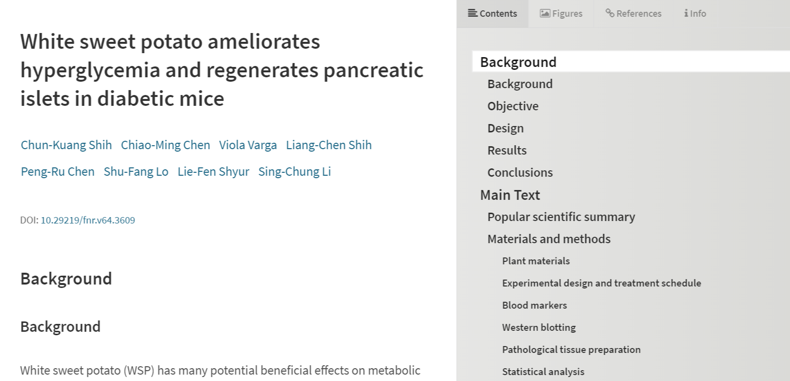

PKP entwickelt Tools, mit denen Sie XML-Dateien in OJS erstellen, konvertieren und bearbeiten können. Derzeit müssen Sie die Dateien außerhalb von OJS erstellen und bearbeiten. Wenn Sie XML-Fahnen für Ihre Zeitschrift erstellen möchten, können Sie die Dienste eines/einer Grafikers/in oder Satzbearbeiters/in Anspruch nehmen, oder Sie können die Dateien selbst erstellen, wenn Sie über einige XML-Kenntnisse verfügen. W3schools hat ausgezeichnete Tutorials zu XML.

Beispiel [Food and Nutrition Research](https://foodandnutritionresearch.net/index.php/fnr/article/view/3609/10173)

#### Multimedia-Dateien

Es wird immer beliebter, dass Zeitschriften neben textbasierten Artikeln auch multimodale Inhalte, einschließlich Audio- und Videodateien, veröffentlichen. Zusätzlich zur Bereitstellung von Audio- und visuellen Formaten für textbasierte Artikel – die zur Verbesserung der Zugänglichkeit von Zeitschrifteninhalten beitragen können – wird multimodaler Inhalt zunehmend als [alternative Form wissenschaftlicher Arbeit geschätzt](https://www.tandfonline.com/doi/full/10.1080/07294360.2017.1389857?casa_token=QlJ8xBTQUEMAAAAA%3AWDkOV6R-qfZxJBimLv_Jv4iB3o2XYeA-Cym7uxHoCww9THLVmZFVfKmRP3dtqq098HvYG6kqTl_v), da er unterschiedliche Ausdrucksweisen und Erkenntnisformen repräsentiert und reflektiert. Zeitschriften, die sich dafür entscheiden, Audioversionen von textbasierten Artikeln zu erstellen, können dies manuell tun, indem sie jemanden den Artikel in ein Diktiergerät einlesen lassen, oder automatisch mit Hilfe von Text-to-Speech-Software.

Multimedia-Dateien können in die Artikelseite auf Ihrer Zeitschriftenseite eingebettet oder von einer externen Website wie YouTube oder SoundCloud verlinkt werden. Wenn Sie eine externe Website verwenden, kann die Qualität besser sein, aber es werden keine Statistiken über die Ansichten oder das Herunterladen von Fahnen erhoben, und die Langzeitbewahrung des Inhalts hängt von der externen Website ab.

Wenn Sie eine Multimedia-Datei hochladen, können Sie „Artikeltext“ aus der Artikel-Bestandteil Liste auswählen und die Datei (MP3, MP4, Bild-Datei usw.) direkt hochladen. Dadurch kann der/die Nutzer/in mit der auf seinem/ihrem Gerät installierten Bildbetrachtungs- oder Audio-/Video-Wiedergabesoftware auf die Datei zugreifen.

Beispiel (siehe MP3 Link im Seitenmenü unten auf der Seite): [International Review of Research in Open and Distance Learning](http://www.irrodl.org/index.php/irrodl/article/view/3279)

Alternativ können Sie die Audio-, Video- oder Bilddatei auch in eine HTML-Seite einbetten, so dass die Benutzer/innen die Datei direkt in ihrem Browser sehen können. Siehe **Bilder und Multimedia zu einer HTML-Fahne** hinzufügen für Anweisungen, wie dies zu tun ist.

Beispiel: [Intersectional Apocalypse](https://journals.lib.sfu.ca/index.php/ifj/article/view/673)

##### Hochladen von Multimedia-Dateien externer Webseiten

Laden Sie die Multimedia-Fahne in der Produktionsphase des Workflows hoch. Siehe weiter unten für Anweisungen zum **Hinzufügen von Fahnen**. Zusätzlich wenn Sie die Datei hochladen:

- Labeln Sie die Fahne nach dem Typ der Multimedia-Datei (z. B. MP3/MP4)
- Markieren Sie das Kästchen „Diese Fahne wird an einem externen Ort bereitgestellt werden.“

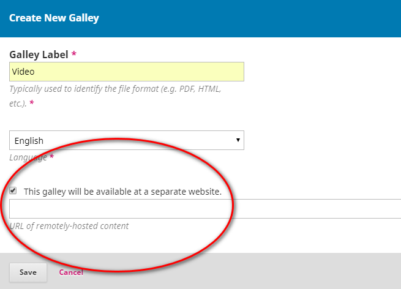

Um die URL zu erhalten, suchen Sie das Video oder Audio in YouTube, SoundCloud usw., klicken dann auf **Teilen** und kopieren die URL.

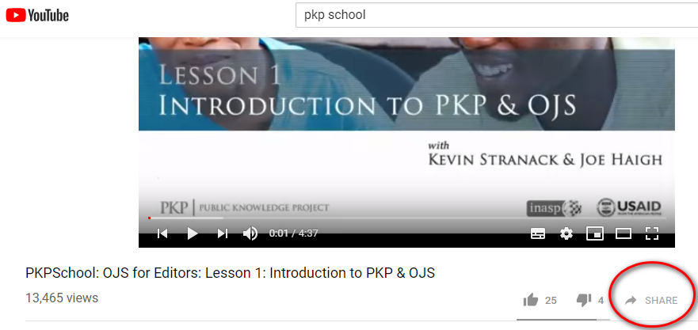

Fügen Sie die URL in das Eingabefeld der externen Fahne ein und klicken Sie dann auf **Speichern**.

Das Video sollte nun in der veröffentlichten Einreichung erscheinen.

### Die Autor/innen kontaktieren

Als Nächstes sollten Sie die PDF an den/die Autor/in weitergeben, damit er/sie diese abschließend prüfen und freigeben kann. Dazu können Sie den Link **Diskussion hinzufügen** im Bereich Diskussion zur Herstellung verwenden. Daraufhin wird ein neues Fenster geöffnet.

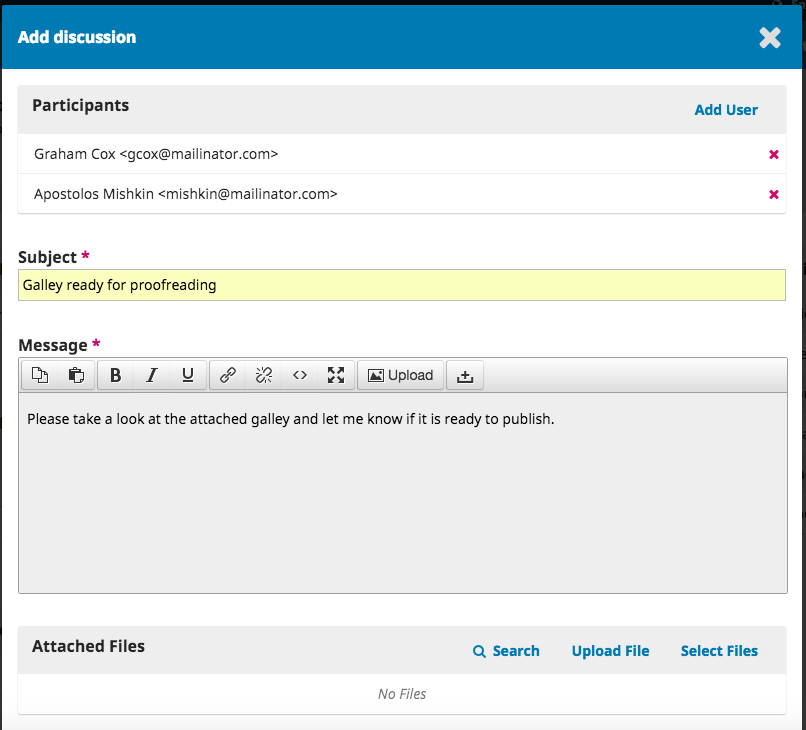

Vergessen Sie nicht, oben im Fenster den/die Autor/in anzugeben und dann einen Betreff und eine Nachricht hinzuzufügen.

Fügen Sie vor dem Versand eine Kopie der PDF über den Link "Datei hochladen" an. Dadurch wird sie dem/der Autor/in zur Verfügung gestellt.

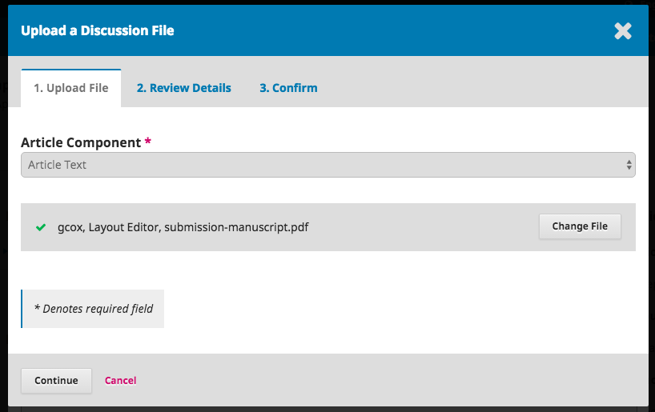

Denken Sie daran, den richtigen Artikel-Bestandteil auszuwählen und dann die PDF hochzuladen.

Klicken Sie auf **Weiter**.

Nehmen Sie als Nächstes eventuelle Änderungen am Dateinamen vor (normalerweise müssen Sie hier nichts tun).

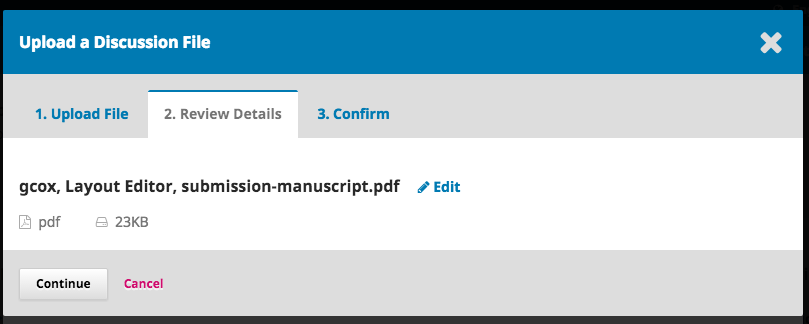

Anschließend können Sie bei Bedarf weitere Dateien hochladen.

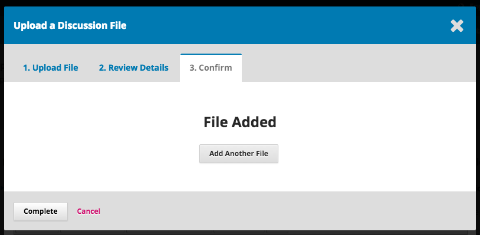

Sobald Sie fertig sind, klicken Sie auf **Beenden**.

Die Datei ist nun angehängt und Sie können die Nachricht über den Button **OK** versenden.

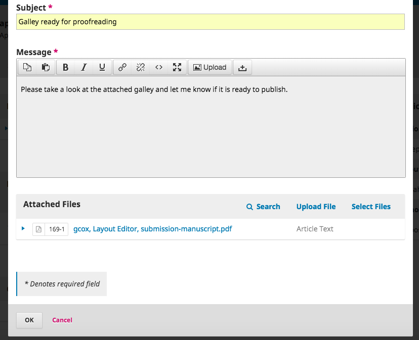

Der/die Autor/in wurde nun benachrichtigt und Sie können seine/ihre Antwort abwarten.

### Antwort des/der Autor/in

Sobald der/die Autor/in Gelegenheit hatte, die Fahnen zu prüfen und zu antworten, erhalten Sie eine E-Mail-Benachrichtigung und sehen eine Antwort im Bereich Diskussion zur Herstellung.

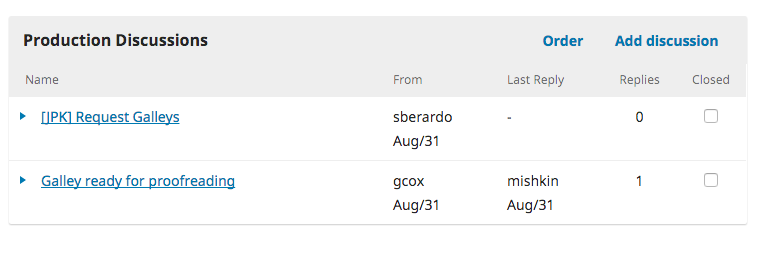

### Hinzufügen von Fahnen

Nachdem der/die Autor/in die Fahnen Korrektur gelesen hat, können Sie letzte Änderungen vornehmen und diese dann in der Einreichung hochladen. Um Fahnen hochzuladen, gehen Sie zum Reiter Veröffentlichung, dann Fahnen.

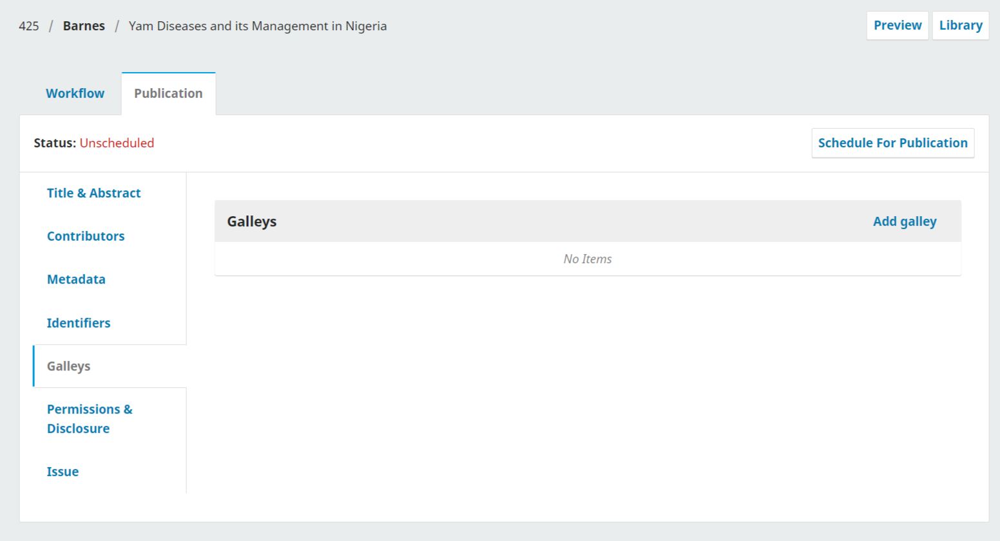

Klicken Sie dann auf **Fahne hinzufügen**. Dadurch öffnet sich ein neues Fenster.

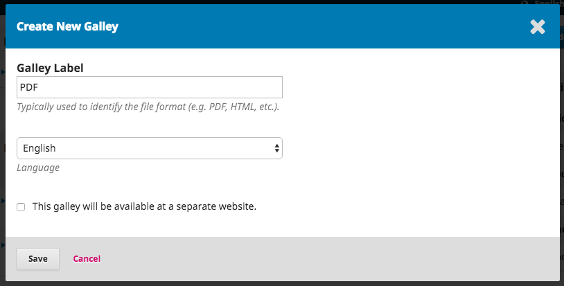

Fügen Sie ein entsprechendes Label (z. B. PDF, HTML etc.) hinzu  und klicken Sie auf **Speichern**.

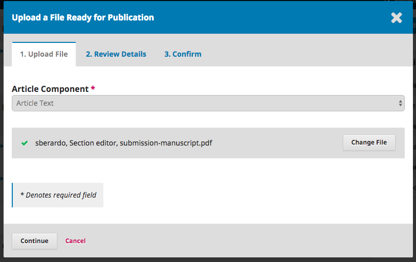

Wählen Sie in diesem Fenster den entsprechenden Artikel-Bestandteil (z. B. Artikeltext) und laden Sie die Fahnen hoch. Klicken Sie auf **Weiter**.

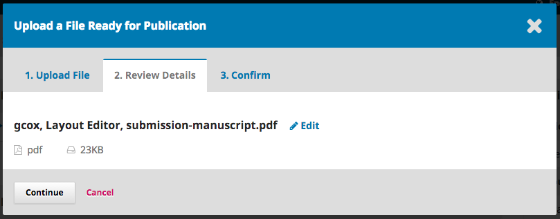

Falls erforderlich, können Sie den Dateinamen ändern. Klicken Sie auf **Weiter**.

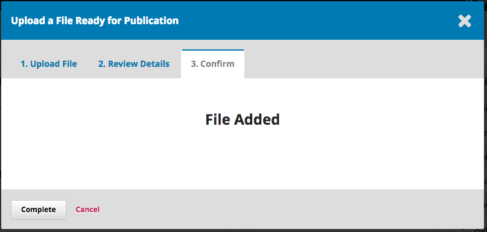

Wenn Sie weitere Dateien haben, laden Sie diese jetzt hoch. Andernfalls klicken Sie auf **Beenden**.

Sie können nun die Fahnen im Fahnen-Reiter sehen.

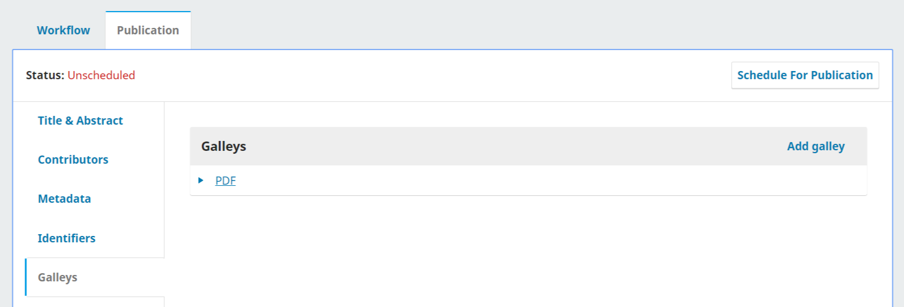

Sie können Änderungen am Upload vornehmen, indem Sie auf den blauen Pfeil links neben dem Fahnen-Label klicken, der Optionen zum Bearbeiten, Ändern der Datei oder Löschen enthält.

### Fahnen bearbeiten

Sie können eine Fahnen-Datei oder ein Fahnen-Label auch nachdem Sie es hochgeladen haben bearbeiten. Bitte beachten Sie: Wenn der Artikel bereits veröffentlicht wurde, müssen Sie ihn entweder depublizieren oder eine neue Version erstellen (siehe Versionierung von Artikeln unten). Nur dann können Sie Änderungen an den Fahnen vornehmen. Vor der Veröffentlichung können Sie jedoch sehr einfach Änderungen vornehmen.

1. Öffnen Sie die Einreichung im Einreichungs-Dashboard
2. Gehen Sie zum Reiter Veröffentlichung und dann auf den Reiter Fahnen
3. Klicken Sie auf den blauen Pfeil neben der Datei, die Sie bearbeiten möchten
4. Wenn Sie das Fahnen-Label bearbeiten möchten, klicken Sie auf den Button Bearbeiten und ändern Sie dann das Fahnen-Label
5. Wenn Sie die Datei austauschen möchten, klicken Sie auf Datei ändern und laden Sie eine neue Datei hoch
6. Klicken Sie auf Speichern, wenn Sie fertig sind

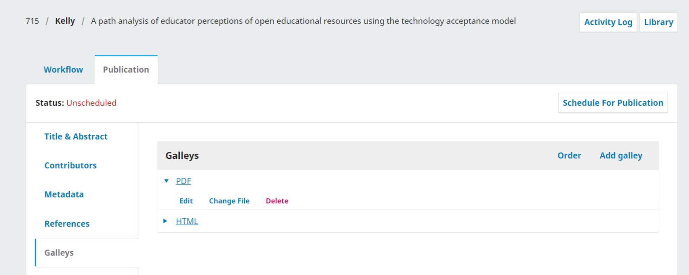

### Rubrikredakteur/in benachrichtigen

Schließlich sollten Sie dem/der Rubrikredakteur/in mitteilen, dass die Fahnen fertiggestellt sind. Verwenden Sie dazu das Panel Diskussion zur Herstellung und wählen Sie den Link Diskussion hinzufügen.

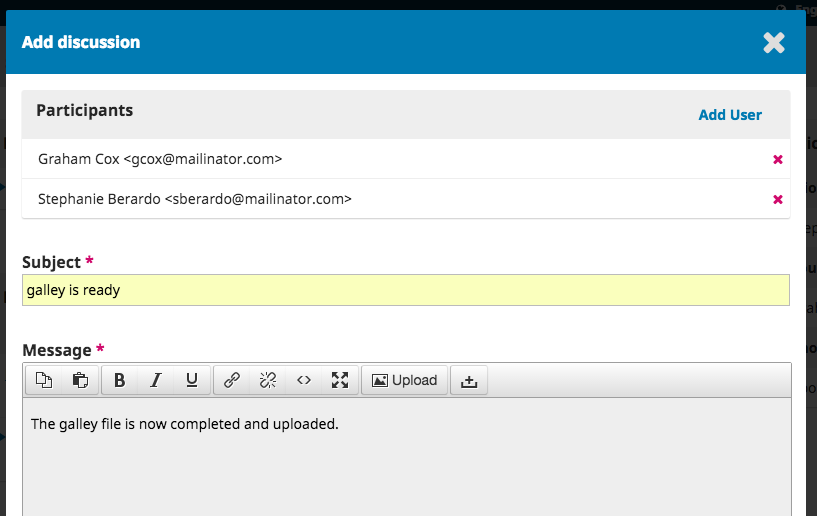

Fügen Sie den/die Rubrikredakteur/in oben auf der Seite ein, und geben Sie eine Betreffzeile und eine Nachricht ein. Drücken Sie **OK** um die Nachricht zu senden.

Sie sehen jetzt die fertige Diskussion.

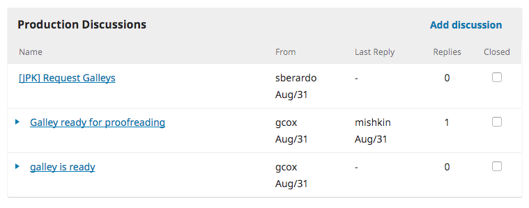

### Rubrikredakteur/in benachrichtigt Redakteur/innen

Zu diesem Zeitpunkt erhält der/die Rubrikredakteur/in die Benachrichtigung vom/von der Layout-Leiter/in und überprüft die Fahnen.

Sie können entweder den/die Layout-Leiter/in bitten, zusätzliche Änderungen \(unter Verwendung der Diskussion zur Herstellung\) vorzunehmen oder den/die Redakteur/in darüber informieren, dass die Druckfahnen bereit zur Veröffentlichung sind.

Um den/die Redakteur/in zu benachrichtigen, verwenden sie in dem Bereich **Diskussion zur Herstellung** den Button **Diskussion hinzufügen**.

Der nächste Schritt bei der Veröffentlichung der Einreichung ist die Überprüfung und Fertigstellung der Metadaten.

## Metadaten finalisieren {#finalize-metadata}

Bevor Sie den Beitrag veröffentlichen, sollten Sie überprüfen, ob die Metadaten für den Artikel in OJS vollständig und korrekt sind und mit den Metadaten im PDF übereinstimmen. Dies ist wichtig, um sicherzustellen, dass der Inhalt von Google Scholar indiziert wird, von anderen Diensten gefunden werden kann und für die Leser/innen zugänglich ist. Um mehr über das Erstellen von Metadaten zu erfahren, lesen Sie [die besseren Praktiken Metadaten-Leitfaden für Zeitschriften](/metadata-practices/en/).

Sie können die Metadaten für die Einreichung überprüfen, indem Sie auf **Einreichungen** klicken, die Einreichung öffnen, den Reiter **Veröffentlichung** öffnen und die Reiter **Titel**, **Beitragende** und **Metadaten** überprüfen.

An dieser Stelle können Sie den Artikel auch einer Kategorie hinzufügen, um ihn auf einer thematischen Kategorieseite auf Ihrer Website anzuzeigen und Referenzen zu extrahieren und zu speichern (falls Sie dies noch nicht getan haben).

### Artikel zu einer Kategorie hinzufügen

Kategorien können verwendet werden, um Ihre Artikel in thematischen Sammlungen zu organisieren. Wenn Sie in Ihrer Zeitschrift Kategorien verwenden, können Sie den Artikel optional zu einer oder mehreren Kategorien hinzufügen. Eine Anleitung zum Erstellen von Kategorien finden Sie im [Kapitel Zeitschrifteneinstellungen](./journal-setup). Sie können den Artikel zu einer Kategorie hinzufügen, indem Sie seine Metadaten bearbeiten.

- Wechseln Sie in der Artikel-Einreichung zum Reiter **Veröffentlichung**
- Klicken Sie auf "Ausgabe"
- Markieren Sie im Feld **Kategorien** die Kategorien, zu denen Sie den Artikel hinzufügen möchten
- Klicken Sie auf **Speichern**

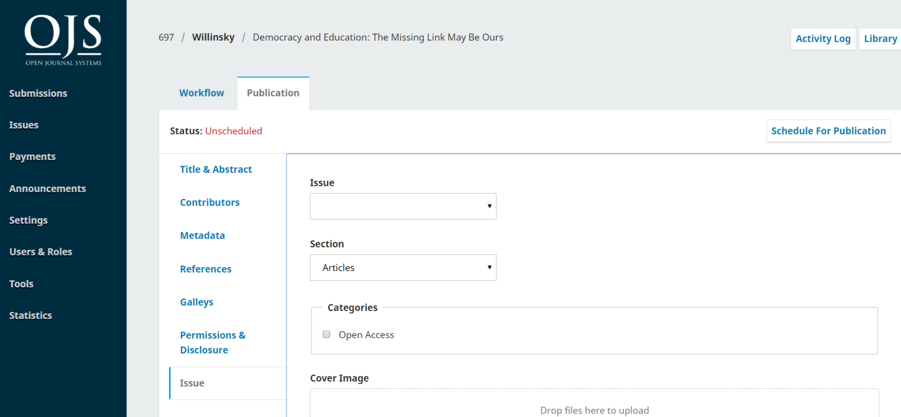

### Referenzen extrahieren und speichern

Wenn Sie die bibliografischen Referenzen des Artikels auf der Artikelseite mit verlinkten DOIs anzeigen und die Referenzen zusammen mit den übrigen Metadaten des Artikels an Crossref übermitteln möchten, können Sie die Funktion „Referenzen extrahieren und speichern“ verwenden. Diese Funktion kann nur verwendet werden, wenn Sie das DOI-Plugin und das Crossref-Plugin verwenden, um Ihre Metadaten an Crossref zu exportieren. Die Funktion speichert jeden Literaturhinweis in der Datenbank als separaten Eintrag und fügt den DOI zu dem Hinweis auf der Artikelseite hinzu. Außerdem erleichtert es Indexierungsdiensten, wie Google Scholar, die Identifizierung und Indexierung der zitierten Artikel.

Als Erstes müssen Sie Referenzen als Metadatenfeld für Beiträge aktivieren.

1. Gehen Sie zu Workflow-Einstellungen > Einreichung > Metadaten
2. Scrollen Sie nach unten zu **Referenzen** und deaktivieren Sie die Option **Metadaten für Referenzen aktivieren**
3. Darunter werden neue Optionen angezeigt, aus denen Sie auswählen können

- fordern Sie bei der Einreichung keine Referenzen von den Autor/innen an - das Feld „Referenzen“ wird nicht auf dem Einreichungsformular erscheinen, stattdessen können die Referenzen von den Redakteur/innen hinzugefügt werden
- fordern Sie die Autor/innen auf, bei der Einreichung Referenzen anzugeben - das Feld „Referenzen“ befindet sich auf dem Einreichungsformular, und die Autor/innen können dort optional ihre Referenzen hinzufügen, oder ein/e Redakteur/in kann die Referenzen zu einem späteren Zeitpunkt der Einreichung hinzufügen
- fordern Sie die Autor/innen auf, dass sie Referenzen angeben, bevor der Beitrag angenommen wird - das Feld „Referenzen“ wird auf dem Antragsformular zu finden sein, und die Autor/innen werden aufgefordert, ihre Referenzen dort einzutragen

4. Klicken Sie auf **Speichern**

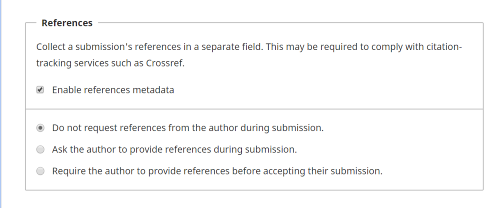

Wenn Sie nun den Reiter **Veröffentlichung** eines einreichten Datensatzes aufrufen, sehen Sie darunter einen Reiter **Referenzen**. Ein/e Redakteur/in kann den Reiter öffnen und die Referenzen des Artikels kopieren und in das Feld einfügen. Wenn Sie die zweite oder dritte der oben aufgeführten Optionen ausgewählt haben, gibt es außerdem ein Feld **Referenzen**, wenn ein/e Autor/in einen Beitrag einreicht. Der/die Autor/in kann dort seine/ihre Referenzen hinzufügen.

Jeder Verweis sollte in einer eigenen Zeile stehen, und Sie sollten sicherstellen, dass der Text, den Sie in das Feld einfügen, unformatiert ist und keine zusätzlichen Zeilenumbrüche oder Leerzeichen enthält. Entfernen Sie alle DOIs in den Referenzen, wenn Sie diese später mit dem Plugin Crossref Reference Linking hinzufügen möchten.

Wenn der Artikel veröffentlicht wird, erscheinen die Referenzen auf der Artikelseite und die Referenzen werden an CrossRef übermittelt.

Nachdem Sie die Metadaten des Artikels zu Crossref exportiert haben, können Sie die DOIs für die Artikelreferenzen von Crossref einfügen, indem Sie das Plugin Crossref Reference Linking verwenden.  Anweisungen zur Verwendung des Plugins finden Sie in der [Crossref Plugin Anleitung](https://docs.pkp.sfu.ca/crossref-ojs-manual/en/references).

Sobald Sie das Plugin eingerichtet und die Metadaten des Artikels zu Crossref exportiert haben, können Sie die DOIs aus Crossref wieder in die Referenzen einfügen:

1. Öffnen Sie die Einreichung
2. Gehe zum Reiter **Veröffentlichung** und **Referenzen**
3. Klicken Sie auf **Crossref DOIs prüfen**
4. Einige DOIs werden nun zu den Referenzen hinzugefügt

## Ausgabe erstellen {#create-issue}



In diesem Video der PKP School wird erklärt, wie man Ausgaben erstellt, bearbeitet, veröffentlicht und verwaltet. Weitere Videos dieser Reihe finden Sie auf dem [PKP YouTube-Kanal](https://www.youtube.com/playlist?list=PLg358gdRUrDVTXpuGXiMgETgnIouWoWaY).

Wenn Sie den Artikel veröffentlichen möchten, müssen Sie zunächst eine Ausgabe erstellen, in der dieser veröffentlicht werden soll. Dann planen Sie die Artikel für die Veröffentlichung in dieser Ausgabe. Die Artikel werden erst dann veröffentlicht, wenn Sie die Ausgabe als Ganzes veröffentlichen. In diesem Abschnitt wird erklärt, wie Sie Ausgaben erstellen und bearbeiten können.

Unter Ausgaben im linken Menü können Sie alle Ausgaben Ihrer Zeitschrift verwalten.

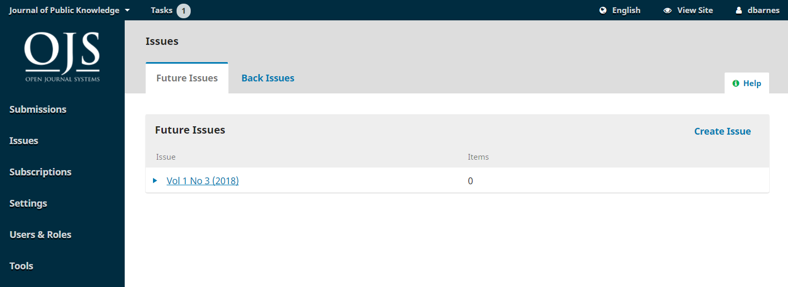

Sie sehen Reiter für zukünftige Ausgaben und frühere Ausgaben.

**Zukünftige Ausgaben** sind alle Ihre unveröffentlichten Ausgaben. Sie können so viele davon erstellen, wie Sie möchten, und Einreichungen für jede dieser Ausgaben planen.

**Frühere Ausgaben** listet alle Ihre veröffentlichten Ausgaben auf.

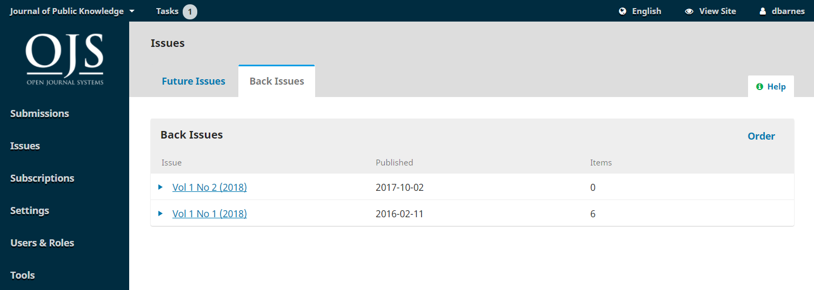

Um eine neue Ausgabe zu erstellen, klicken Sie auf den Link **Ausgabe erstellen** und füllen Sie das Formular aus.

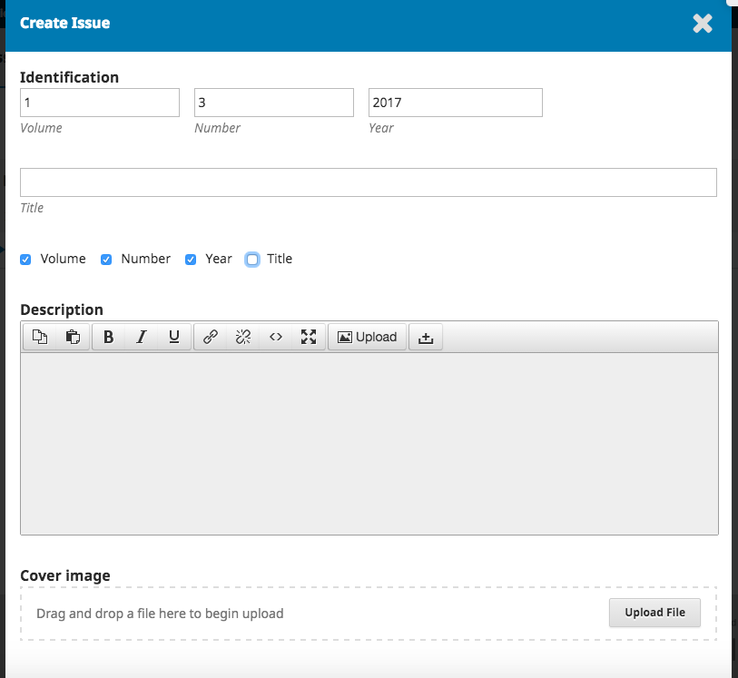

Es gibt Felder zum Hinzufügen von Band, Nummer, Jahr und Titelinformationen (z. B. Sonderausgabe Nr. 1) sowie eine Beschreibung, ein Titelbild und eine eigene URL. Wenn Sie ein Titelbild und eine Beschreibung hinzufügen, erscheinen diese oben auf der Seite der Ausgabe auf Ihrer Website. Wenn Sie Band, Nummer und Titel unten ausgewählt haben, müssen Sie in jedes Feld etwas eintragen.

Wenn Sie fertig sind, klicken Sie auf **Speichern**.

### Ausgabe bearbeiten

Sie können eine bestehende Ausgabe auch bearbeiten, indem Sie auf der Seite Zukünftige Ausgaben auf den blauen Pfeil links neben dem Ausgabeneintrag klicken.

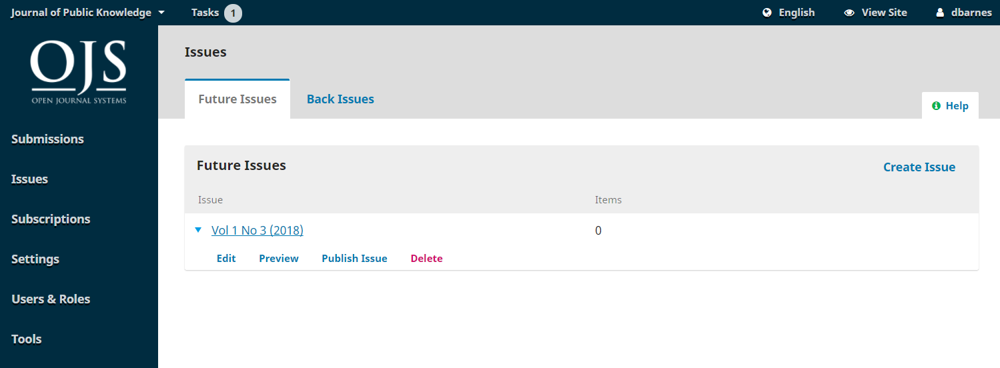

Dadurch wird ein Link zum **Bearbeiten** angezeigt, der ein neues Fenster mit Informationen öffnet.

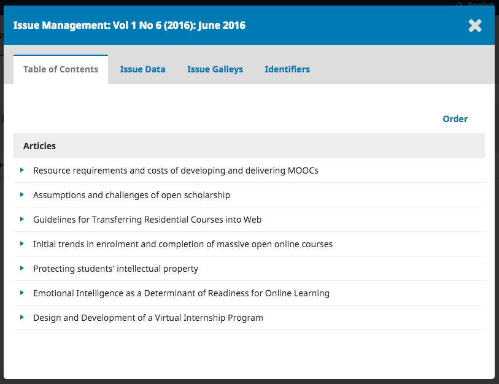

**Inhaltsverzeichnis**: Bei einer neuen Ausgabe ist dieses Feld leer, aber bei Ausgaben, für die Beiträge vorliegen, werden diese hier aufgeführt.

Verwenden Sie den blauen Pfeil neben jedem Beitrag, um Links anzuzeigen, über die Sie direkt zum Datensatz gelangen oder den Beitrag entfernen können.

**Daten der Ausgabe**: Hier haben Sie Zugriff auf die Daten zu Ausgabe, Band und Nummer, die Sie bei der ersten Erstellung der Ausgabe eingegeben haben.

**Druckfahnen der Ausgabe**: Hier können Sie eine Druckfahne der gesamten Ausgabe hochladen - z. B. eine PDF-Datei mit allen Artikeln. Diese wird auf der Webseite der Ausgabe angezeigt.

**Identifikatoren**: Fügen Sie hier einen DOI für die Ausgabe ein, wenn Ihre Zeitschrift Identifikatoren auf Ausgabenebene unterstützt.

### Reihenfolge der Rubriken und Artikel

Wenn Sie eine Ausgabe veröffentlichen, werden die Artikel unter den Rubriken Ihrer Zeitschrift angezeigt.

Wenn Sie zu Zeitschrifteneinstellungen > Rubriken gehen und eine Rubrik bearbeiten, können Sie konfigurieren, wie sie auf der Seite Ihrer veröffentlichten Ausgabe angezeigt wird, einschließlich der Angabe, ob der Titel der Rubrik angezeigt wird.

Sie können die Abschnitte auch per Drag & Drop verschieben, um die Reihenfolge zu ändern, in der sie in Ihrer veröffentlichten Ausgabe erscheinen.

Wenn Sie die Reihenfolge der Abschnitte pro Ausgabe oder die Reihenfolge der Artikel innerhalb eines Abschnitts ändern möchten:

- Gehen Sie zu **Ausgaben** und öffnen Sie die Ausgabe, die Sie bearbeiten möchten
- Klicken Sie auf **Sortieren**
- Ziehen Sie die Abschnitte und Artikel an die gewünschte Stelle
- Klicken Sie auf **Fertig**, wenn Sie damit fertig sind

### Vorschau von Ausgaben und Artikeln

Wenn Sie vor der Veröffentlichung sehen möchten, wie Ihre Artikel aussehen werden, klicken Sie auf den Button Vorschau im Reiter Veröffentlichung der Einreichung. Benutzer/innen mit der Berechtigung zur Vorschau sehen den Button ab der Phase Lektorat.

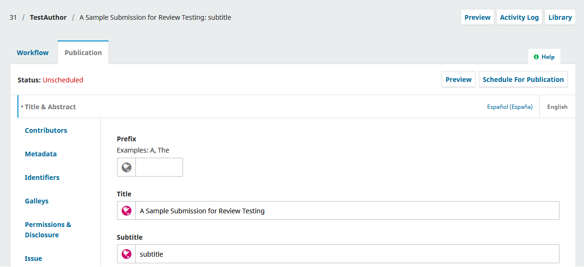

Wenn Sie vor der Veröffentlichung sehen möchten, wie Ihre Artikel im Rahmen einer Ausgabe aussehen werden, können Sie die Funktion Ausgabenvorschau verwenden:

- Klicken Sie auf den blauen Pfeil neben der zukünftigen Ausgabe
- Klicken Sie auf **Vorschau**
- Die Seite mit der Ausgabenvorschau wird geöffnet. Um einen Artikel in der Vorschau anzuzeigen, klicken Sie auf den Titel des Artikels im Inhaltsverzeichnis.

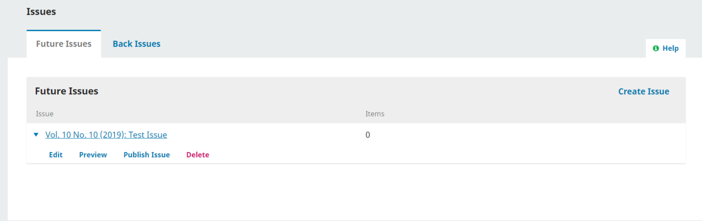

### Ausgabe veröffentlichen

Wenn Sie mit der Ausgabe zufrieden sind, klicken Sie auf den Link **Ausgabe veröffentlichen**, um die Ausgabe auf der Website Ihrer Zeitschrift zu veröffentlichen.

### Leser/innen benachrichtigen

Sie haben die Möglichkeit, eine Benachrichtigung über die neue Ausgabe an die Benutzer/innen zu senden.

Um keine Benachrichtigung über eine neue Ausgabe zu versenden, deaktivieren Sie das Kästchen neben „Benachrichtigungs-E-Mail an alle registrierten Benutzer/innen senden“, bevor Sie auf **OK klicken**.

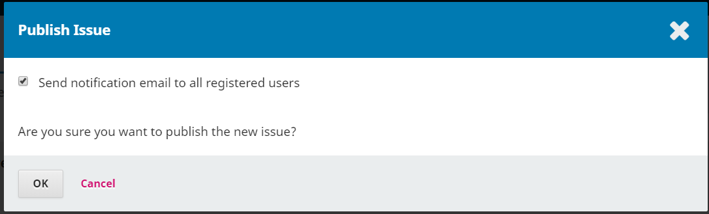

Der Inhalt der Ankündigung wird automatisch erstellt und kann nicht bearbeitet werden. Sie können alternativ die Funktion [Ankündigungen](./settings-website.md#announcements) verwenden, um eine Ankündigung zur Veröffentlichung mit individuellem Inhalt zu versenden.

### Ausgabe zurückziehen

Verwenden Sie den Link **Ausgabe zurückziehen**, um die Ausgabe und ihren gesamten Inhalt aus der öffentlichen Ansicht zu entfernen. Die Ausgabe wird auf die Registerkarte Zukünftige Ausgaben zurückgesetzt.

### Ausgabe löschen

Sie können den Link **Löschen** verwenden, um die Ausgabe vollständig zu entfernen. Dabei wird die Ausgabe nicht nur depubliziert, sondern es werden auch die organisatorische Struktur und alle Metadaten der Ausgabe entfernt. Alle zugewiesenen Artikel werden auf ihren unveröffentlichten Status zurückgesetzt.

## Artikel zu einer Ausgabe hinzufügen {#add-the-article-to-an-issue}

Nachdem Sie nun eine Ausgabe erstellt haben, können Sie den Artikel zu dieser Ausgabe hinzufügen. Bitte beachten Sie, dass der Artikel erst veröffentlicht wird, wenn die entsprechende Ausgabe veröffentlicht wird. In diesem Schritt ordnen Sie den Artikel einer Ausgabe zu.

- Gehen Sie zurück zu **Einreichungen**
- Suchen und öffnen Sie die Einreichung, die Sie veröffentlichen möchten
- Gehen Sie zum Reiter **Veröffentlichung** und dann auf **Ausgabe**
- Wählen Sie im Feld **Ausgabe** die Ausgabe aus, in der Sie den Artikel veröffentlichen möchten
- Der **Abschnitt** wird automatisch auf der Basis der Metadaten der Einreichung ausgefüllt, Sie können ihn jedoch bei Bedarf ändern
- Sie können eine **Kategorie** auswählen, falls Sie dies noch nicht getan haben (siehe oben)
- Wenn Sie möchten, dass ein Bild auf der Artikelseite erscheint, laden Sie es unter **Titelbild** hoch
- Sie können **Seitenzahlen** hinzufügen, die in die Metadaten und das Inhaltsverzeichnis aufgenommen werden
- Das **Veröffentlichungsdatum** wird automatisch gesetzt, wenn die Ausgabe veröffentlicht wird. Geben Sie kein Veröffentlichungsdatum ein, es sei denn, der Artikel wurde bereits an anderer Stelle veröffentlicht und Sie müssen ihn rückdatieren.
- Klicken Sie auf **Speichern**, wenn Sie fertig sind

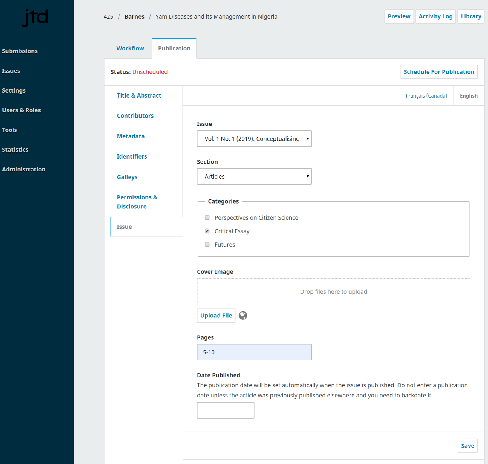

## Zur Veröffentlichung vorsehen{#schedule-for-publication}

Der nächste Schritt besteht darin, den Artikel für die Veröffentlichung vorzusehen. Obwohl der Artikel erst veröffentlicht wird, wenn die Ausgabe, der er zugewiesen ist, erscheint, ist der Schritt „Zur Veröffentlichung vorsehen“ der letzte Schritt, um zu bestätigen, dass der Artikel zur Veröffentlichung bereit ist.

Nur eine Redakteur/in der Zeitschrift kann einen Artikel zur Veröffentlichung vormerken, nicht aber ein/e Rubrikredakteur/in oder Gastredakteur/in.

Der Artikel muss einer Ausgabe zugewiesen worden sein und die Begutachtung durchlaufen haben, damit er zur Veröffentlichung geplant werden kann.

Wenn Sie bereit sind, den Artikel zu veröffentlichen:

- Öffnen Sie die Einreichung
- Gehen Sie zum Reiter **Veröffentlichung**
- Klicken Sie auf den blauen Button Zur **Veröffentlichung vorsehen**.

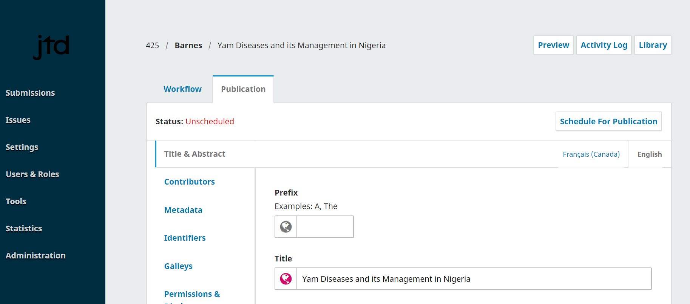

Es wird eine Meldung angezeigt, bei der Sie bestätigen müssen, dass Sie den Artikel für die Veröffentlichung vorsehen möchten. Klicken Sie auf **Veröffentlichen**.

### Planung von einzelnen Veröffentlichungen

In früheren Versionen von OJS wurde ein Artikel einer Ausgabe zugeordnet und zum Zeitpunkt der Veröffentlichung dieser Ausgabe veröffentlicht. Ab OJS 3.2 ist es möglich, ein bestimmtes Veröffentlichungsdatum für jede Veröffentlichung festzulegen.

Gehen Sie dazu im Reiter **Veröffentlichung** des jeweiligen Artikels auf **Ausgaben**.

Unter **Veröffentlichungsdatum** können Sie das Veröffentlichungsdatum eingeben, wenn es sich vom Veröffentlichungsdatum der Ausgabe unterscheidet. Wenn nicht, lassen Sie dieses Feld leer.

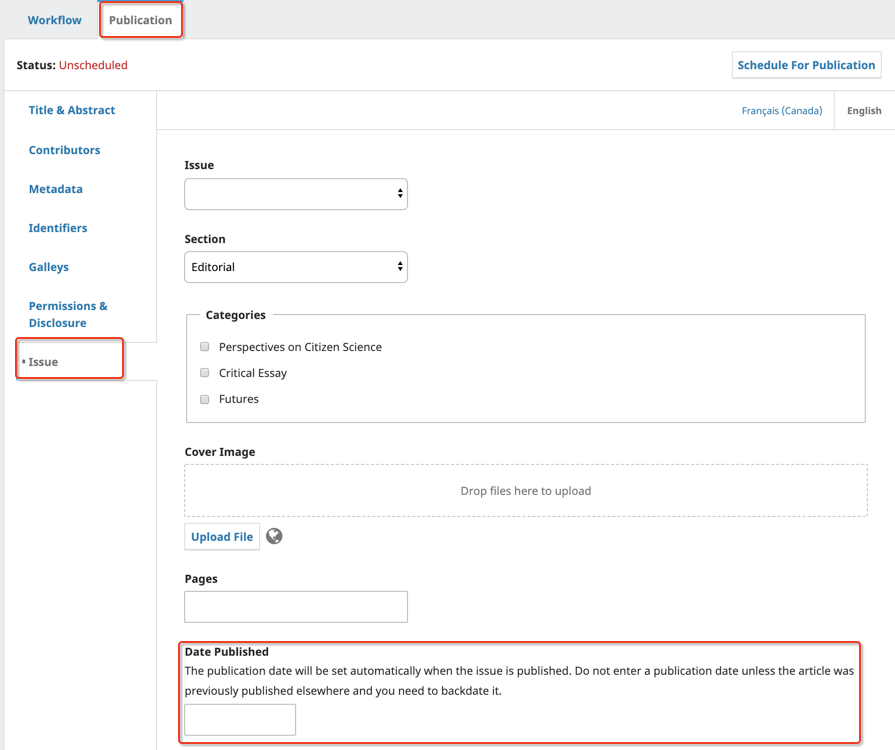

Damit eine einzelne Veröffentlichung geplant werden kann, muss sie einer Ausgabe zugeordnet sein und die Begutachtung durchlaufen haben.

Ist das Datum auf ein zukünftiges Datum festgelegt, sollte die Veröffentlichung an dem eingetragenen Datum erfolgen.

Wenn das geplante Manuskript aus der Ausgabe herausgenommen wird, sollte das zuvor geplante Datum nicht verändert werden.

## Versionierung von Artikeln

Die Möglichkeit, Versionen von Artikeln zu veröffentlichen, ist eine der wichtigsten Neuerungen in OJS 3.2. Diese Funktion unterstützt die Veröffentlichung von Preprints und die Veröffentlichung neuer Versionen von Artikeln, wenn eine Korrektur oder wesentliche Änderung vorgenommen wurde. Mit der Versionierungsfunktion können Sie verschiedene Versionen eines Artikels verwalten und klar angeben, welche die aktuellste ist.

Sobald ein Artikel veröffentlicht ist, können weder Metadaten noch Druckfahnen bearbeitet werden. Wenn eine Überarbeitung eines veröffentlichten Artikels oder der Metadaten erforderlich ist, kann dies auf zwei Arten geschehen:

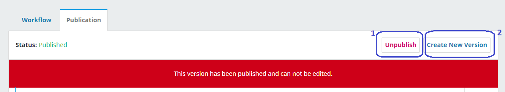

**Option 1: Veröffentlichung zurückziehen und neu veröffentlichen**

Das Zurückziehen eines Artikels ermöglicht es Ihnen, Änderungen vorzunehmen, ohne eine neue Version zu erstellen. Nach der Rücknahme der Veröffentlichung können Sie die Metadaten aktualisieren und/oder die Druckfahne ersetzen und den Artikel erneut zur Veröffentlichung vorsehen. Wenn der Artikel für eine veröffentlichte Ausgabe vorgesehen ist, wird er sofort verfügbar sein. Die Leser/innen werden nicht benachrichtigt, da die Benachrichtigung bei der Veröffentlichung einer Ausgabe und nicht für einen einzelnen Artikel erfolgt.

**Option 2: Neue Version erstellen**

Wenn Sie eine neue Version erstellen, können Sie Änderungen an den Metadaten und/oder den Druckfahnen vornehmen. Achten Sie darauf, dass Sie unten rechts auf **Speichern** klicken, um die Änderungen zu speichern.

Sie können die Aktualisierungen der Versionen unter **Alle Versionen** verfolgen. Jede Version ist durch eine Nummer und das Veröffentlichungsdatum gekennzeichnet. Die Version, die gerade aktualisiert wird, ist mit einer Nummer und **Unveröffentlicht** gekennzeichnet.

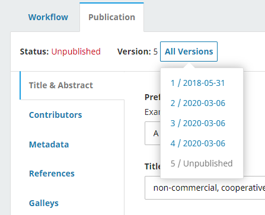

Sobald Ihre Änderungen abgeschlossen sind, können Sie die neue Version veröffentlichen, indem Sie oben rechts auf **Veröffentlichen** klicken. Wenn der Artikel einer veröffentlichten Ausgabe zugewiesen ist, wird er sofort verfügbar sein. Die Leser/innen werden nicht benachrichtigt, da die Benachrichtigung bei der Veröffentlichung einer Ausgabe und nicht bei der Veröffentlichung einzelner Artikel erfolgt.

Die Liste der früheren Versionen und die Aktualisierungsdaten werden auf der Seite des veröffentlichten Artikels aufgeführt.

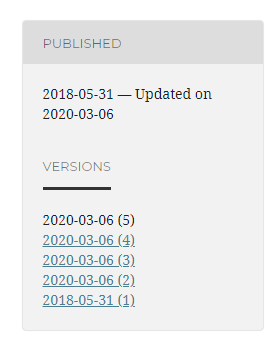

Die Leser/innen können auf frühere Versionen zugreifen. Auf den Artikel- und Druckfahnenseiten wird eine Meldung angezeigt, die darauf hinweist, dass es sich um eine veraltete Version handelt, und die auf die neueste Version verweist.

Beispiel für eine Meldung über eine veraltete Version auf der Artikelseite:

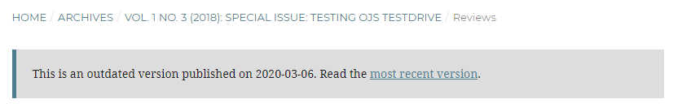

Beispiel für eine Meldung über eine veraltete Version auf der PDF- Druckfahnenseite:

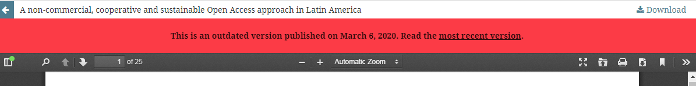

Die URL des Artikels verweist immer auf die neueste Version, wobei frühere Versionen unter der gleichen URL mit der Version am Ende der URL verfügbar sind (z. B. /version/1234/).

### DOIs und Indexierung von Versionen

Wenn der Originalversion ein DOI zugewiesen wurde, wird dieser nicht automatisch geändert. Zuvor hinterlegte CrossRef-Metadaten werden nicht automatisch aktualisiert. Wenn die Metadaten eines Artikels geändert wurden, empfehlen wir, die CrossRef-Metadaten im CrossRef XML Export Plugin zu aktualisieren, indem der aktualisierte Artikel manuell hinterlegt wird. Informationen zum manuellen Einlegen eines Artikels finden Sie im [CrossRef Plugin Leitfaden - manuelle Eingabe](https://docs.pkp.sfu.ca/crossref-ojs-manual/en/config#manual-deposits) (englischsprachig) von PKP.

Indexierungsdienste und Repositorien, die die OAI zur Erfassung von Metadaten verwenden, müssen die Metadaten des Artikels erneut erfassen, um die neue Version zu aktualisieren.

Die neue Version wird ausreichend gekennzeichnet sein, damit der Google-Scholar-Index sie erkennt und aktualisiert, aber der Harvester muss Ihre Website erneut abrufen, um die neue Version zu finden.

Erkundigen Sie sich am besten bei einem bestimmten Repositorium oder Index, um zu erfahren, wie der Prozess abläuft und welche Anforderungen an eine Neuindexierung gestellt werden.

## Kontinuierliches Veröffentlichen & Vorschau

Kontinuierliches Publizieren - auch bekannt als kontinuierlicher Veröffentlichungsplan - ist eine Art des Publizierens, bei der die direkte Veröffentlichung von Artikeln priorisiert wird. Bei dem kontinuierlichen Publizieren werden die Artikel veröffentlicht, sobald sie fertig sind. Zeitschriften können auch eine Vorabsicht vor dem Layout anbieten (auch bekannt als online first, in-press, post-print, first view usw.).

Häufigere Veröffentlichungen können einigen Zeitschriften bei der [Suchmaschinenoptimierung (SEO)](https://docs.pkp.sfu.ca/getting-found-staying-found/en/getting-found-visibility#search-engines) (englischsprachig) helfen und Zeitschriften eine Möglichkeit bieten, häufiger Beiträge in sozialen Medien zu veröffentlichen.

Der Inhalt des Artikels sollte als abgeschlassen gelten und bereits begutachtet sowie lektoriert worden sein. Da die Arbeit sofort zitiert werden kann, sollten Abbildungen und Anhänge vorhanden sein. Um Verwirrung zu vermeiden, sollten Seitenzahlen, die sich noch ändern können, vermieden werden.

OJS ist derzeit für ein traditionelles Veröffentlichungsmodell konzipiert, bei dem die Artikel in Ausgaben veröffentlicht werden. Es gibt jedoch eine Möglichkeit, ein kontinuierliches Veröffentlichungsmodell innerhalb von OJS zu übernehmen.

### Aktuelle Ausgabe für kontinuierliches Publizieren verwenden

- Erstelle eine [neuen Ausgabe](https://docs.pkp.sfu.ca/learning-ojs/en/production-publication#create-issue) (englischsprachig). Ausgaben können in den Ausgabedaten mit einem Titel versehen werden. Es wird empfohlen, einen Titel zu verwenden, der den fortlaufenden Charakter der Ausgabe verdeutlicht.
- Veröffentlichen Sie die neue Ausgabe: Es ist zwar möglich, eine Ausgabe mit 0 Artikeln zu veröffentlichen, aber eine leere Ausgabe kann für die Leser/innen verwirrend sein. Wir empfehlen, die neue Ausgabe zu veröffentlichen, nachdem mindestens ein Artikel zugewiesen wurde.
- Wenn der nächste Artikel fertig ist, ordnen Sie ihn der **Aktuellen Ausgabe** zu. Dieser Artikel wird dann sofort auf der Seite der aktuellen Ausgabe veröffentlicht. Wenn Sie DOIs verwenden, stellen Sie sicher, dass Sie die Aktion DOI **zuweisen** vor der Veröffentlichung vornehmen. Wenn Ihre DOI-Registrierung nicht automatisiert ist, registrieren Sie Ihren neuesten DOI manuell.
- Bitte beachten Sie, dass die Standard-DOI-Muster auf der Grundlage von Heftnummern erstellt werden:
  - Wenn Sie vorhaben, ein DOI-Suffix auf der Grundlage der Band-/Ausgabennummerierung zu erzeugen, ändern Sie die Band-/Ausgabennummer später nicht.
  - Wenn Sie beabsichtigen, die Nummerierung der Jahrgänge/Ausgaben zu ändern, generieren Sie kein Suffix unter Verwendung der Standardmuster. Erzeugen Sie stattdessen ein benutzerdefiniertes Muster. Siehe Dokumentation zur [DOI Konfigurierung](https://docs.pkp.sfu.ca/doi-plugin/en/) (englischsprachig) für weitere Details.
- Nachdem die aktuelle Ausgabe abgeschlossen ist, möchten Sie jene möglicherweise nach der Standard-Namenskonvention der Zeitschrift umbenennen (z. B. Bd. 2, Nr. 5), indem Sie die [Ausgabe bearbeiten](https://docs.pkp.sfu.ca/learning-ojs/en/production-publication#edit-issue).
- Wenn Sie nur den Titel der Ausgabe geändert haben:
  - Dieses Feld wird nicht in CrossRef, DOAJ oder PubMed exportiert, aber es wird für DataCite verwendet. Wenn Sie DataCite verwenden, denken Sie daran, diesen Datensatz zu aktualisieren, indem Sie die Metadaten über das DataCite-Plugin erneut einreichen.
- Wenn Sie das [Plugin Citation Style Language](https://docs.pkp.sfu.ca/learning-ojs/en/settings-website#citation-style-language-plugin) in Ihrer Zeitschrift aktiviert haben, sollten Sie dieses Plugin deaktivieren, da Sie aufgrund der sich ändernden Ausgabenummern falsche Zitate im Block „How to Cite“ in Ihren Artikeln haben werden.
- Erwägen Sie die [Versionierung von Artikeln](https://docs.pkp.sfu.ca/learning-ojs/en/production-publication#versioning-of-articles) zu verwenden, wenn Sie die Vorabversion des Artikels veröffentlichen möchten. Wenn die endgültige Version fertig ist, erstellen Sie eine neue Version und veröffentlichen Sie diese.

Da neue Artikel sofort veröffentlicht werden, kontrollieren Sie die Metadaten und Fahnen auf Korrektheit, indem Sie die [Vorschaufunktion](https://docs.pkp.sfu.ca/learning-ojs/en/production-publication#preview-issue-and-articles) des Artikels verwenden.

### Forthcoming-Plugin für kontinuierliches Publizieren

Mit dem [Forthcoming-Plugin](https://github.com/ajnyga/forthcoming) können Zeitschriften eine Version eines Artikels unter Verwendung der OJS-Versionierungsfunktion veröffentlichen, bevor eine ganze Ausgabe veröffentlicht wird. Es handelt sich um ein externes Plugin eines Drittanbieters, das für OJS 3.2.1 und höher verfügbar ist. Da es sich um ein Plugin handelt, das nicht von PKP gewartet wird, können wir seine Funktionalität oder Kompatibilität mit allen Softwareversionen nicht garantieren.

In der [README-Datei des Forthcoming-Plugins](https://github.com/ajnyga/forthcoming#readme) (englischsprachig) finden Sie Einzelheiten zur Funktionsweise. Wenden Sie sich an Ihre/n OJS-Administrator/in, um zu erfahren, ob Support für dieses Plugin verfügbar ist.

### Benutzerdefinierte Seiten verwenden für kontinuierliches Publizieren und Vorabansicht

Erstellen Sie eine eigene Seite unter [Navigationsmenü](https://docs.pkp.sfu.ca/learning-ojs/en/settings-website#navigation) (englischsprachig) und fügen Sie Artikel hinzu.

Diese Option ist völlig unabhängig vom regulären Workflow für die Einreichung von Artikeln und erfordert ein manuelles Hinzufügen und Entfernen von Artikel-Metadaten und/oder Volltext auf der angelegten Seite.

Auf der leeren benutzerdefinierten Seite können Folgendes angegeben werden:

- Eine Liste von Artikeln mit einigen Metadaten und ohne Volltextartikel
- Eine Liste von Artikeln mit vollständigen Metadaten und ohne Volltextartikel
- Eine Liste von Artikeln mit Hyperlinks zu den Artikel-Volltexten oder Vorabversionen (die Dateien müssen an anderer Stelle gehostet werden wie in der [Publisher Library](https://docs.pkp.sfu.ca/learning-ojs/en/settings-workflow#publisher-library) (englischsprachig))

Wenn ein neuer Artikel zur Veröffentlichung bereit ist, fügen Sie ihn manuell zu der benutzerdefinierten Seite hinzu. Sobald die gesamte Ausgabe mit dem Artikel oder die endgültige Version des Artikels zur Veröffentlichung bereit ist, entfernen Sie ihn manuell von der benutzerdefinierten Seite.

Der Inhalt benutzerdefinierter Seiten erscheint nicht in der Stichwortsuche von Zeitschriften und Artikel, die zu benutzerdefinierten Seiten hinzugefügt wurden, erscheinen nicht in der Artikelsuche und erhalten keine DOIs.

### Zeitschrifteneinstellungen für kontinuierliches Publizieren

Möglicherweise möchten Sie einige Zeitschrifteneinstellungen ändern, um den geänderten Veröffentlichungszeitplan abzubilden:

- [Jahr des Copyrights](https://docs.pkp.sfu.ca/learning-ojs/en/settings-distribution) (englischsprachig): Wählen Sie für ein kontinuierliches Veröffentlichungsmodell das Veröffentlichungsdatum des Artikels. Diese Vorgabe kann in einzelnen Artikeln überschrieben werden.
- [Richtlinien der Zeitschrift](https://docs.pkp.sfu.ca/learning-ojs/en/journal-setup): Kommunizieren Sie den Veröffentlichungsplan innerhalb von "Über die Zeitschrift".
- [Anpassen der Bezeichnung „Aktuelle Ausgabe“ auf der Homepage](https://docs.pkp.sfu.ca/translating-guide/en/customize-locale#example-customize-the-current-issue-label-on-homepage): Wenn Sie die Bezeichnung „aktuelle Ausgabe" auf der Startseite auf „aktuelle Publikationen“ oder „aktuelle Artikel“ ändern möchten, können Sie dies über das Custom Locale Plugin tun (in OJS 3. oder neuer).

### Kommunikation

Wenn Sie Ihre Leser/innen beim Erscheinen eines neuen Artikels benachrichtigen möchten, erstellen Sie eine individuelle Ankündigung, da die automatische Benachrichtigung über eine neue Veröffentlichung nur bei der Veröffentlichung einer neuen Ausgabe gesendet werden kann. Informationen über Ankündigungen finden Sie im Kapitel [Website-Einstellungen](https://docs.pkp.sfu.ca/learning-ojs/en/settings-website.html#announcements).

Wenn Ihre Zeitschrift zuvor ein traditionelles, auf Ausgaben basierendes Modell verwendet hat und nun zu einem Modell der kontinuierlichen Veröffentlichung übergegangen ist, müssen Sie möglicherweise die Daten von Drittanbietern aktualisieren, einschließlich:

- ISSN: Um den ISSN Datensatz zu aktualisieren, kontaktiere dein [Nationales ISSN-Zentrum](https://www.issn.org/services/requesting-an-issn/contact-an-issn-national-centre/) (englischsprachig)
- Verzeichnisse, die die Erscheinungshäufigkeit enthalten
- Verzeichnisse, die Informationen über den Zeitraum zwischen Einreichung und Veröffentlichung enthalten
