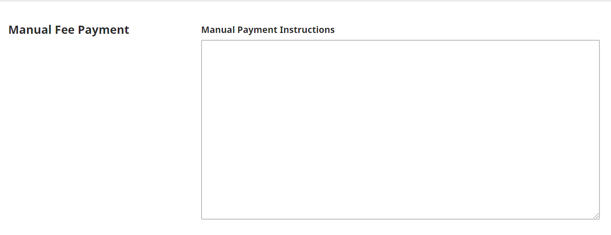

# Vertriebs-Einstellungen

Bei den Vertriebs-Einstellungen liegt der Schwerpunkt auf dem Zugriff auf das Journal und dessen Sichtbarkeit. Es gibt die Reiter Lizenz, Für Suchmaschinen indizieren, Zahlungen, Zugriff und Archivierung.

Bitte beachten Sie: Wenn Ihr Journal mehrsprachig ist und Sie in den Spracheinstellungen Formulare für mehrere Sprachen aktiviert haben, müssen Sie einige dieser Informationen für jede Sprache separat konfigurieren. Sie können zu einer anderen Sprache unter dem Hilfe-Link oben rechts wechseln.

## Lizenz {#license}

Dieses PKP-School-Video erklärt, wie Copyright- und Lizenzbestimmungen in OJS konfiguriert werden (in englischer Sprache). Weitere Videos dieser Reihe finden Sie auf dem [PKP YouTube-Kanal](https://www.youtube.com/playlist?list=PLg358gdRUrDVTXpuGXiMgETgnIouWoWaY).



In diesem Abschnitt können Sie Copyright- und Lizenzbestimmungen für die Inhalte Ihres Journals festlegen.


**Copyright-Inhaber/in**: Wählen Sie aus, wer das Copyright an den in Ihrer Zeitschrift veröffentlichten Artikeln hat. Bei Open-Access-Veröffentlichung ist es üblich, dass Autor/innen das Copyright an ihrem Werk behalten.

**Lizenz**: Wählen Sie die Lizenz für Ihr Journal aus. CC Attribution 4.0 ist eine weit verbreitete Lizenz für Open-Access-Zeitschriften, die eine bestmögliche Verbreitung und Nachnutzung ermöglicht. Die Definitionen verschiedener Creative-Commons-Lizenzen finden Sie auf der [Creative-Commons-Webseite](https://creativecommons.org/).

Die von Ihnen ausgewählte Lizenz wird automatisch zu den Metadaten jedes Artikels hinzugefügt und auf der Artikelseite jedes veröffentlichten Artikels angezeigt.

**Jahr des Copyrights**: Wählen Sie aus, ob das Jahr des Copyrights standardmäßig vom Veröffentlichungsdatum des Artikels oder der Ausgabe übernommen wird.

Wenn Sie ein kontinuierliches Veröffentlichungs-Modell verwenden, wählen Sie das Veröffentlichungsdatum des Artikels aus. Wenn Sie ein traditionelles, auf Ausgaben basierendes Veröffentlichungsmodell verwenden, wählen Sie "Veröffentlichungsdatum der Ausgabe" aus.

Diese Vorgabe kann auf Einzelfall-Basis überschrieben werden.

**Lizenzbestimmungen**: Hier können zusätzliche Lizenzbestimmungen eingegeben werden, die neben der oben gewählten Lizenz auf der Artikelseite angezeigt werden sollen.

## Such-Indizierung  {#search-indexing}

Dieses PKP-School-Video erklärt, wie die Such-Indizierung in OJS verbessert werden kann (in englischer Sprache). Weitere Videos dieser Reihe finden Sie auf dem [PKP YouTube-Kanal](https://www.youtube.com/playlist?list=PLg358gdRUrDVTXpuGXiMgETgnIouWoWaY).



In diesem Abschnitt erfahren Sie, wie Sie Ihre Suchmaschinenoptimierung verbessern und Ihre Inhalte leichter auffindbar machen können.


Verwenden Sie **Beschreibung**, um eine kurze Beschreibung Ihrer Zeitschrift für Suchmaschinen bereitzustellen.

Verwenden Sie **Benutzerdefinierte Tags**, um benutzerdefinierte HTML-Header-Tags zum Header jeder Seite Ihres Journals hinzuzufügen. Diese helfen bei der Indizierung der Website durch Suchmaschinen. Tags müssen als HTML-Elemente hinzugefügt werden. Wenn Sie einfachen Text eingeben, erscheint dieser oben auf jeder Seite Ihrer Website statt in den Metadaten der Website. Hier ist ein Beispiel für eine Eingabe in diesem Feld:

```html
<meta name="description" content="The Journal of Public Knowledge. Publication of the Public Knowledge Project - PKP and Simon Fraser University - SFU" />
<meta name="keywords" content="open access, scholarly publishing, open source software, non-profit organizations, scholarly journals, free software" />
<meta name="author" content="metatags generator">
<meta name="robots" content="index, follow">
<meta name="revisit-after" content="3 month">
```

## Zahlungen {#payments}

Dieses PKP-School-Video erklärt, wie Zahlungen in OJS konfiguriert werden (in englischer Sprache). Weitere Videos dieser Reihe finden Sie auf dem [PKP YouTube-Kanal](https://www.youtube.com/playlist?list=PLg358gdRUrDVTXpuGXiMgETgnIouWoWaY).



OJS bietet die Möglichkeit, Online-Zahlungen zu erhalten und Abonnements und Autor/innengebühren zu verwalten.

Mit dem PayPal-Plugin können Sie Zahlungen über PayPal ermöglichen. Manuelle Zahlungen (wie Scheck, E-Mail-Überweisung, usw.) sind ebenfalls möglich. Diese müssen jedoch außerhalb von OJS abgewickelt werden und werden nicht automatisch in OJS dokumentiert.  Zur Einbindung anderer Zahlungsdienste müssen zunächst separate Plugins entwickelt werden.

### Zahlungen aktivieren

Die Funktionen für Zahlungen und Abonnementfunktionen müssen unter dem Reiter "Zahlungen" aktiviert werden. Nachdem Sie die Option **Aktivieren** aktiviert haben, werden weitere Einstellungen unten angezeigt.


Wählen Sie die Währung aus, die Sie verwenden wollen.

Unter **Plugins für Zahlungsweisen** wählen Sie die Zahlungsmethode aus, die Sie nutzen möchten.

Wenn Sie **PayPal-Zahlung** wählen, erscheinen weitere Felder.

Um PayPal-Zahlungen zu akzeptieren, gehen Sie unter Website-Einstellungen auf Plugins und aktivieren das PayPal-Plugin. Dann führen Sie zusätzliche Einstellungen und Konfigurationen durch, die im [PayPal Plugin Guide erklärt werden](https://docs.pkp.sfu.ca/using-paypal-for-ojs-and-ocs/en/) (in englischer Sprache). Während dieses Prozesses erhalten Sie Werte für die Felder **Account Name**, **Client ID** und **Secrets**.


Wenn unter **Plugins für Zahlungsweisen** die Option **Manuelle Zahlung** ausgewählt ist, erscheint ein Feld, in das Hinweise für Benutzer/innen eingegeben werden können, die eine manuelle Zahlung durchführen.  Zum Beispiel „Senden Sie einen für das Public Knowledge Project ausgestellten Scheck an ______.”



Sie müssen auch das Plugin für manuelle Zahlungsweisen unter Website-Einstellungen > Plugins aktivieren, um manuelle Zahlungen zu akzeptieren.

Klicken Sie auf **Speichern**.

Ein neuer Menüpunkt erscheint im Hauptmenü mit dem Namen **Zahlungen**.

Gehen Sie zum [Abschnitt Abonnements](./subscriptions.md) für weitere Hinweise zur Verwaltung von Abonnements und Zahlungen.

Wenn das Journal oder Artikel nur per Abonnement zur Verfügung gestellt werden sollen, gehen Sie zu Vertriebs-Einstellungen > Zugriff und aktivieren Sie „Einige oder alle Inhalte der Zeitschrift sind nur für Abonnent/innen zugänglich.“


### Spenden

In OJS 3.x gibt es keine Möglichkeit, eine Zahlungsart für Spenden einzurichten, um Spenden mit dem Zahlungsmodul zu verwalten oder um mit dem PayPal-Plugin Spenden zu akzeptieren. Sie können den Block "Spenden" zu Ihrer Seitenleiste hinzufügen. Dieser muss jedoch auf eine externe Seite verlinken, über die Spenden für ihre Publikation abgewickelt werden.

## Zugriff {#access}

Dieses PKP-School-Video erklärt, wie Zugriffsoptionen in OJS verwaltet werden (in englischer Sprache). Weitere Videos dieser Reihe finden Sie auf dem [PKP YouTube-Kanal](https://www.youtube.com/playlist?list=PLg358gdRUrDVTXpuGXiMgETgnIouWoWaY).



Auf dem Reiter Zugriff können Sie einstellen, ob Ihre Journalinhalte Open Access, über ein Abonnement oder eine Kombination von beiden verfügbar sein sollen. Standardmäßig ist die Option "Open Access" ausgewählt. Wenn Sie OJS für eine Abonnement-basierte Zeitschrift verwenden möchten, wählen Sie die zweite Option (siehe Abschnitt "Zahlungen" für weitere Informationen). Wenn Sie die zweite Option wählen, können Sie unterschiedliche Embargo-Zeiträume einrichten, nach denen die Inhalte Open Access verfügbar sein sollen.


Wenn Sie OJS nur für den Einreichungs-Workflow nutzen, nicht für die Veröffentlichung des Inhalts, wählen Sie aus "OJS wird nicht verwendet, um die Zeitschrifteninhalte online zu veröffentlichen."

In OJS kann konfiguriert werden, wie und wann Inhalte auf Artikel- und Ausgabenebene abgerufen werden können. Wenn Sie eine Ausgabe erstellen, erscheint eine Registerkarte mit dem Namen **Zugriff**, unter der Sie den **Zugriffs-Status** als **Abonnement oder Open Access** festlegen können.


Wenn Sie **Abonnement gewählt** haben, erscheint ein Feld, in dem optional ein **Open-Access-Zugriffsdatum** angegeben werden kann, ab dem die Inhalte frei verfügbar sind.

Wenn Sie **Abonnement** gewählt haben, erscheint auf dem Reiter **Inhaltsverzeichnis** ein Kontrollkästchen **Open Access** neben jedem Artikel. Einzelne Artikel können optional Open Access gestellt werden, während der Rest der Ausgabe im Abonnement verfügbar bleibt.


**OAI-Zugang** zu den Inhalten aktivieren ist standardmäßig aktiviert. OAI ist ein wichtiges Protokoll, das von Publikationsdatenbanken und anderen Anwendungen verwendet wird, um Metadaten von Journals zu harvesten. Wenn Sie den Inhalt Ihres Journals nicht mit OJS veröffentlichen, sollten Sie OAI deaktivieren.


## Archivierung {#archiving}

Dieses PKP-School-Video erklärt, wie man die Archivierung in OJS aktiviert (in englischer Sprache). Weitere Videos dieser Reihe finden Sie auf dem [PKP YouTube-Kanal](https://www.youtube.com/playlist?list=PLg358gdRUrDVTXpuGXiMgETgnIouWoWaY).



Wenn Sie Mitglied eines LOCKS- oder CLOCKSS-Netzwerkes sind, können Sie hier die Archivierung Ihres Journal aktivieren. Das PKP PN Plugin, das Ihre Inhalte über das PKP Preservation Network (PN) archiviert, ist ab OJS 3.1.2 verfügbar.

Weitere Informationen zum Aktivieren des PKP PN finden Sie im [PKP Preservation Network Guide](/pkp-pn/en/) (in englischer Sprache).

Wenn Sie ein anderes Netzwerk für die Archivierung verwenden, können Sie Ihre Inhalte dem Netzwerk zur Verfügung stellen, indem Sie es hier aktivieren. Hierzu muss jedoch auch das jeweilige Netzwerk informiert werden.


