# Website-Einstellungen

In den Website-Einstellungen können Sie einstellen, wie die Website Ihrer Zeitschrift aussieht und funktioniert. Die Einstellungen bestehen aus drei Registerkarten für Aussehen, Einrichtung und Plugins.

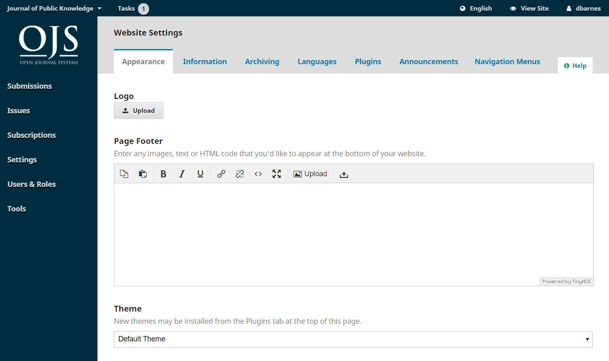

## Aussehen {#appearance}

Dieses englischsprachige Video der PKP School erklärt, wie das Aussehen in OJS verwaltet wird. Weitere Videos dieser Reihe finden Sie auf dem [PKP YouTube-Kanal](https://www.youtube.com/playlist?list=PLg358gdRUrDVTXpuGXiMgETgnIouWoWaY).



### Grafisches Thema

Das Grafische Thema bestimmt das Gesamtdesign oder Layout der Zeitschriften-Website. Es stehen verschiedene Grafische Themen zur Verfügung und Sie können diese ausprobieren, ohne den Inhalt oder die Konfiguration Ihrer Website zu beeinträchtigen.

Sie können sicherstellen, dass alle verfügbaren Grafischen Themen auf Ihrer Seite aktiviert wurden.

1. Gehen Sie in die Registerkarte Plugins unter Website-Einstellungen.
2. Scrollen Sie nach unten bis zur Überschrift Designvorlagen-Plugins.
3. Aktivieren Sie das Kästchen neben dem Plugin, das Sie aktivieren möchten.

Sie können auch in der Plugin-Galerie nach weiteren Grafischen Themen suchen und diese installieren sowie aktivieren.

Da Sie nun alle verfügbaren Grafischen Themen aktiviert haben, klicken Sie auf den Reiter "Grafisches Thema", um verschiedene Grafische Themen auszuprobieren.

1. Unter "Grafisches Thema" sehen Sie eine Dropdown-Liste der Grafischen Themen. Wählen Sie ein Grafisches Thema aus.
2. Scrollen Sie zum Ende der Seite und klicken Sie auf "Speichern".
3. Das Grafische Thema kann über zusätzliche Unterthemen oder Konfigurationsoptionen verfügen. Um ein Grafisches Thema auf der Website anzeigen zu lassen, muss die Seite in Ihrem Browser aktualisiert werden.
4. Wenn Sie ein anderes Grafisches Unterthema auswählen oder das Farbschema oder andere Designfunktionen ändern, klicken Sie erneut auf Speichern am Ende der Seite.
5. Öffnen Sie die Startseite Ihrer Website in einem neuen Reiter oder Fenster Ihres Browsers, um zu sehen, wie die Seite mit dem neuen Grafischen Thema oder Unterthema und mit verschiedenen Konfigurationsoptionen aussieht.
6. Wenn Sie die Änderungen nicht auf Ihrer Seite sehen, müssen Sie den Cache Ihres Browsers löschen.

Ab OJS/OMP/OPS 3.3 wurde das Standardthema extern auf Barrierefreiheit geprüft. Das **Standardthema** hält sich an Best Practices, Farbkontrast, Tastaturnavigation und Formular-/Linkfokus. [PKP Barrierefreiheitserklärung](https://docs.pkp.sfu.ca/accessibility-statement/) (englischsprachig) enthält weitere Details.

Wenn Sie das Design und Layout Ihrer Website geringfügig ändern möchten, können Sie ein **Style sheet** unter Website-Einstellungen > Aussehen > Fortgeschritten hochladen.

- **Typographie**: Wählen Sie die Schriftarten für Ihre Zeitschrift aus. Diese Option kann je nach dem gewählten Grafischen Thema verfügbar sein oder nicht.

- **Farbe**: Ändern Sie die Farbe des Headers Ihrer Zeitschrift. Diese Option kann je nach dem gewählten Grafischen Thema verfügbar sein oder nicht.

- **Zusammenfassung der Zeitschrift**: Aktivieren Sie diese Option, um die Zusammenfassung der Zeitschrift auf der Startseite anzuzeigen. Sie können die Zusammenfassung unter Zeitschrift > Impressum hinzufügen oder ändern. Diese Option kann je nach dem gewählten Grafischen Thema verfügbar sein oder nicht.

- **Header Hintergrundbild**: Aktivieren Sie diese Option, wenn Sie möchten, dass das hochgeladene Homepage-Bild als Hintergrund angezeigt werden soll.

Weitere Optionen zur Anpassung von graphischen Themen finden Sie in der Anleitung [Journalgestaltung](https://docs.pkp.sfu.ca/designing-your-journal/en/) (englischsprachig). Beachten Sie, dass Änderungen an den Grafischen Themen Auswirkungen auf die Barrierefreiheit von Zeitschriften haben können.

### Einrichtung {#setup-1}

Hier können Sie Bilder (Logo, Vorschaubild der Zeitschrift, Startseitengrafik) hochladen. Zusätzlich können Sie Fußzeileninformationen eingeben und Ihr Seitenleistenmenü konfigurieren.

- **Vorschaubild der Zeitschrift**: Laden Sie ein kleines Logo oder ein Bild der Zeitschrift hoch, das in der Liste der Zeitschriften dieser OJS-Installation verwendet wird. Dieses Bild wird nur bei OJS-Installationen mit mehreren Zeitschriften verwendet.

- **Startseitengrafik**: Das hochgeladene Bild wird auf der Startseite Ihrer Zeitschrift platziert.

- **Fußzeile**: Geben Sie Bilder, Texte oder HTML-Code ein, die am unteren Ende Ihrer Website erscheinen sollen.

- **Seitenleiste**: Hier können Sie verschiedene Blöcke aus der Seitenleiste verschieben und aktivieren bzw. deaktivieren. Du kannst auch einen benutzerdefinierten Block mit dem [Custom Block plugin](./settings-website.md#custom-block-plugin) erstellen

### Fortgeschritten

Hier können Sie Ihr Zeitschriften-Stylesheet, Favicon und weiteren Inhalt hochladen.

- **Style sheet der Zeitschrift**: Verwenden Sie diese Option, um ein individuelles Stylesheet für Ihre Zeitschrift hochzuladen. Anweisungen zur Änderung des CSS sind in der [Gestaltung Ihres Journals: Erstellen eines Stylesheet](https://docs.pkp.sfu.ca/designing-your-journal/en/creating-stylesheet) (englischsprachig) Anleitung verfügbar.

Wenn Sie umfangreichere Anpassungen am Design vornehmen oder Ihrer Website ein vollkommen individuelles Erscheinungsbild verleihen möchten, können Sie ein eigenes Grafisches Thema oder ein "Child-Theme" entwickeln. Anweisungen sind im [PKP Theming Guide](https://docs.pkp.sfu.ca/pkp-theming-guide/en/) (englischsprachig) verfügbar.

- **Zeitschrift Favicon**: Füge ein [favicon](https://en.wikipedia.org/wiki/Favicon) hinzu, um es in der Browser-Adressleiste des Lesers anzuzeigen.

- **Weiterer Inhalt**: Jeder hier eingegebene Text wird auf der Startseite Ihrer Zeitschrift angezeigt.

Klicken Sie auf **Speichern**, um Ihre Änderungen zu übernehmen.

## Einrichtung

### Information

Dieses PKP School-Video erklärt, wie Sie die Informations-Einstellungen in OJS konfigurieren (in englischer Sprache). Weitere Videos dieser Reihe finden Sie auf dem [PKP YouTube-Kanal](https://www.youtube.com/playlist?list=PLg358gdRUrDVTXpuGXiMgETgnIouWoWaY).



Verwenden Sie diese Felder, um die Texte auf den Seiten „Für Leser/innen“, „Für Autor/innen“ und „Für Bibliothekar/innen“ auf der Zeitschriften-Website anzupassen.

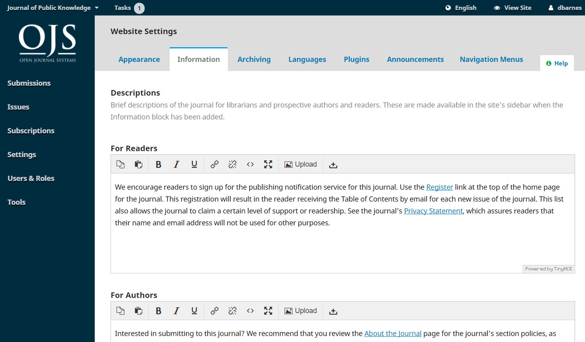

Vergessen Sie nicht, auf **Speichern** zu klicken, um die Änderung zu übernehmen.

Um diese Felder und deren Inhalte aus der öffentlichen Ansicht der Website zu entfernen, deaktivieren Sie den Informationen-Block unter Website-Einstellungen > Einrichtung > Seitenleiste.

### Sprachen

Dieses PKP School-Video erklärt, wie Sie die Spracheinstellungen in OJS konfigurieren. (in englischer Sprache). Weitere Videos dieser Reihe finden Sie auf dem [PKP YouTube-Kanal](https://www.youtube.com/playlist?list=PLg358gdRUrDVTXpuGXiMgETgnIouWoWaY).



OJS ist mehrsprachig, das heißt, die Benutzeroberfläche, E-Mails und veröffentlichte Inhalte können in mehreren Sprachen verfügbar sein. Autor/innen können zudem Einreichungen in einer oder mehreren Sprachen auf einer einzelnen Seite oder Zeitschrift vornehmen. Bei der Installation von OJS können Sie eine oder mehrere Sprachen für Ihre Seite auswählen.

Unter Website-Einstellungen Einrichtung > Sprachen sehen Sie eine Liste der auf Ihrer Seite installierten Sprachen oder Sprachvarianten und können konfigurieren, wie die Sprachen in Ihrer Zeitschrift verwendet werden. Überlegen Sie sorgfältig, wie Sie die Sprachen in Ihrer Zeitschrift konfigurieren und verwenden möchten, da erhebliche Probleme auftreten können, wenn Sie die Einstellungen später ändern.

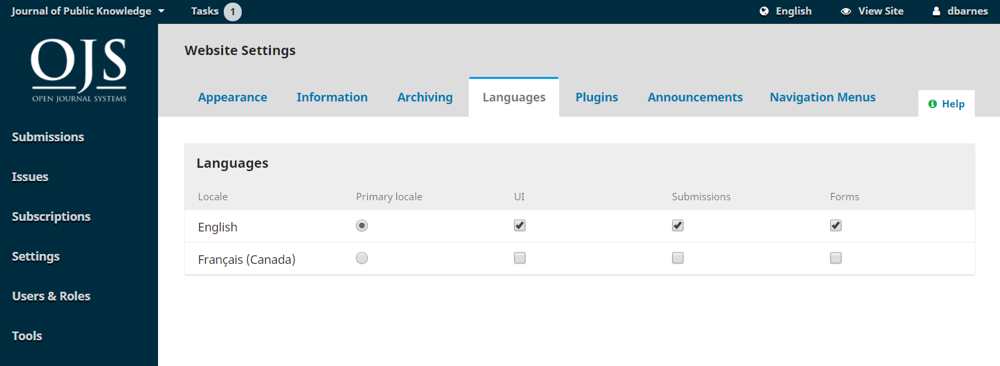

- **Primäre Regionaleinstellung**: Es muss eine Sprache als primäre Sprache festgelegt werden, also die Sprache, in der die Zeitschrift standardmäßig angezeigt wird.

- **UI**: Wenn die Frontend- und Backend-Oberfläche der Zeitschrift in weiteren Sprachen verfügbar sein soll, wählen Sie diese hier aus. Wenn eine Sprache für die UI aktiviert ist, können Nutzer/innen die Sprache der Anwendungsoberfläche auswählen. Beispielsweise werden Buttons, Seitentitel und Meldungen auf dem Bildschirm in der von der Nutzer/in gewählten Sprache angezeigt.

- **Formulare**: Dadurch stehen alle ausgewählten Sprachen beim Ausfüllen von Online-Formularen zur Verfügung. Wenn eine Sprache für Formulare aktiviert ist, unterstützen Textfelder die mehrsprachige Dateneingabe, einschließlich des Reiters „Veröffentlichung“ bei Einreichungen. Beispielsweise können Konfigurationseinstellungen und Metadaten in mehreren Sprachen eingegeben werden.

- **Beträge**: Wenn Autor/innen Beiträge in weiteren Sprachen einreichen können sollen, wählen Sie diese hier aus. Dadurch können Autor/innen beim Einreichen eines Beitrags eine Sprache auswählen und beim Hochladen der Einreichung Metadaten in den ausgewählten Sprachen hinzufügen.

Zusätzliche Sprachen können von einer Administratorin oder einem Administrator auf Ihrer Seite installiert werden – weitere Informationen finden Sie im Kapitel [Verwaltung der Webseite](./site-administration).

Wenn Sie mehrere Sprachen in der Benutzeroberfläche aktivieren, stellen Sie sicher, dass unter Website-Einstellungen > Aussehen > Einrichtung > Seitenleiste der Sprachwechsel-Block ausgewählt ist, damit diese Funktion den Nutzer/innen zur Verfügung steht.

### Navigationsmenüs

Dieses PKP School-Video erklärt, wie Sie die Navigationseinstellungen in OJS konfigurieren (in englischer Sprache). Weitere Videos dieser Reihe finden Sie auf dem [PKP YouTube-Kanal](https://www.youtube.com/playlist?list=PLg358gdRUrDVTXpuGXiMgETgnIouWoWaY).



In diesem Abschnitt können Sie Ihre Navigationsmenüs konfigurieren, beispielsweise neue Links hinzufügen.

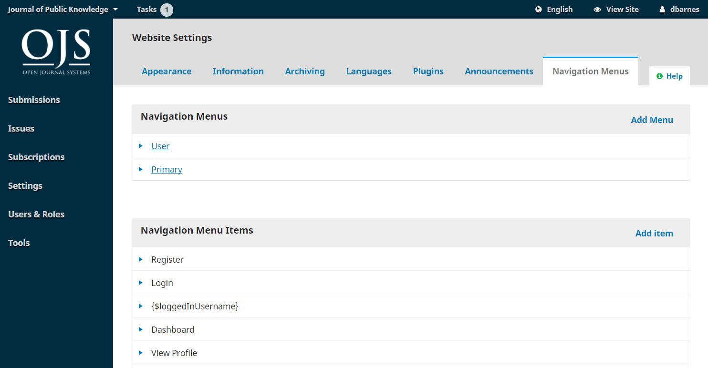

- **Navigationsmenüs**: Konfigurieren Sie das Benutzer/innen-Menü und/oder das Hauptmenü.

Einige Menüpunkte werden nur unter bestimmten Bedingungen angezeigt. Zum Beispiel verlinkt der Menüpunkttyp „Einloggen“ auf Ihre Login-Seite, erscheint jedoch nur im Menü, wenn die Besuchenden Ihrer Website ausgeloggt sind. Ebenso erscheint der Menüpunkttyp „Ausloggen“ nur, wenn ein Besuchender der Website eingeloggt ist.

Wenn Sie einem Menüeintrag mit Anzeigebedingungen ein Menü zuweisen, sehen Sie ein Symbol eines durchgestrichenen Auges. Sie können auf dieses Symbol klicken, um mehr darüber zu erfahren, wann der Menüeintrag angezeigt oder ausgeblendet wird.

- **Einträge im Navigationsmenü**: Dabei handelt es sich um vordefinierte Links, die Sie dem oben genannten Menü hinzufügen können und die auf vorprogrammierte Bereiche der Website verweisen. Sie können jede dieser Seiten umbenennen, indem Sie auf **Bearbeiten** klicken. Beispielsweise können Sie „Archive“ in „Frühere Ausgaben“ umbenennen.

- **Einträge im Navigationsmenü: Menüeintrag hinzufügen**: Sie können dem Menü neue Elemente hinzufügen. Klicken Sie auf **Menüeintrag hinzufügen** und wählen Sie aus dem Dropdown-Menü aus. Zusätzlich zu den vorprogrammierten Links können Sie auch eine unbegrenzte Anzahl eigener Links hinzufügen. Es gibt zwei Arten von eigenen Links:

Eigene Seite: Wenn Sie eine neue Webseite (z. B. „Zeitschriftengeschichte“) zum Hauptmenü von OJS hinzufügen möchten, wählen Sie Eigene Seite, um eine statische Seite zu erstellen. Geben Sie Ihrer neuen Seite einen Titel und wählen Sie einen URL-Pfad, wobei Sie darauf achten sollten, dass der Pfad eindeutig ist. Eigene Seiten können für zusätzliche Inhalte genutzt werden, die sonst auf Ihrer Website nicht verfügbar sind. Sie müssen manuell aktualisiert werden, indem Sie die entsprechende Bearbeiten-Schaltfläche in der Liste der Einträge im Navigationsmenü verwenden.

Remote URL: Wenn Sie einen Link zu einer externen Website außerhalb von OJS (z. B. „Unsere Gesellschaft“) hinzufügen möchten, wählen Sie **Remote URL** und geben Sie die vollständige URL ein. Es ist eine gute Praxis, die Remote URL regelmäßig zu überprüfen, um sicherzustellen, dass sie weiterhin funktioniert.

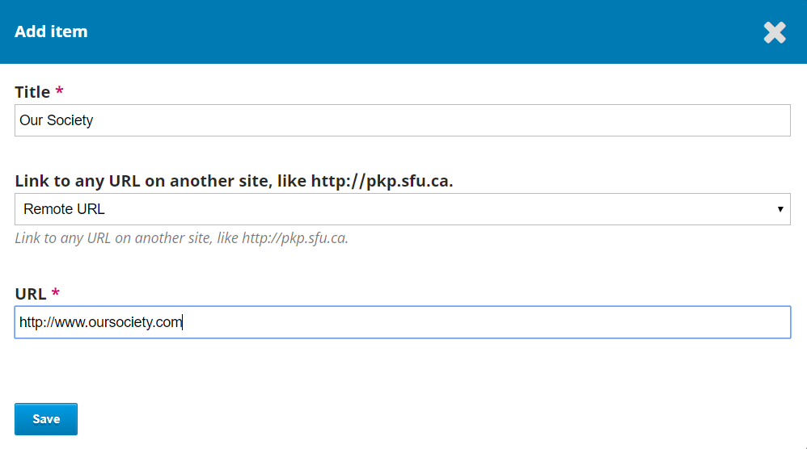

Sobald erstellt, erscheinen eigene Links in der Liste der Einträge im Navigationsmenü. Gehen Sie als Nächstes zum gewünschten Navigationsmenü (z. B. "Primary Navigation Menu"), klicken Sie auf den blauen Pfeil, um die Optionen anzuzeigen, und wählen Sie „Bearbeiten“. Sie können den Eintrag nun per Drag & Drop von „Nicht zugewiesenen Menüeinträge“ zu „Zugewiesene Menüeinträge“ und an die gewünschte Stelle im Menü ziehen.

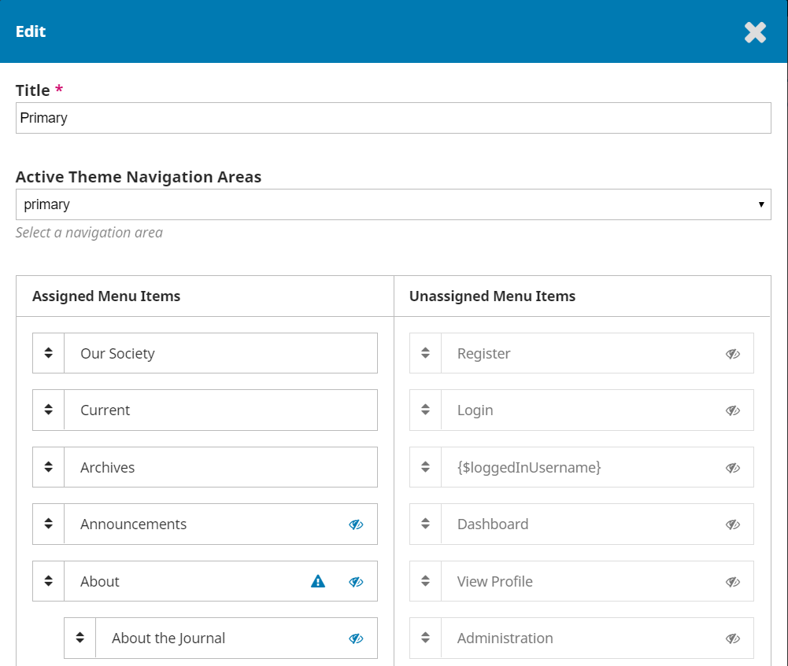

Drücken Sie auf Speichern, um die Änderung zu übernehmen.

### Mitteilungen

Dieses PKP School-Video erklärt, wie Sie die Einstellungen für Ankündigungen in OJS konfigurieren (in englischer Sprache). Weitere Videos dieser Reihe finden Sie auf dem [PKP YouTube-Kanal](https://www.youtube.com/playlist?list=PLg358gdRUrDVTXpuGXiMgETgnIouWoWaY).



In diesem Abschnitt können Sie Mitteilungen auf der Website der Zeitschrift erstellen und anzeigen.

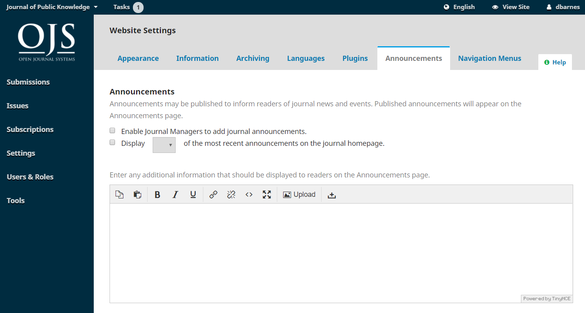

- **Mitteilungen**: Aktivieren Sie diese Option, wenn Sie Mitteilungen auf Ihrer Website verwenden möchten.
  - **Zusätzliche Informationen**: Geben Sie allgemeine Informationen ein, die auf Ihrer Mitteilungsseite angezeigt werden sollen.
  - **Auf der Homepage anzeigen**: Geben Sie die Anzahl der Mitteilungen ein, die auf der Startseite angezeigt werden sollen. Wenn dieses Feld leer bleibt, werden keine Mitteilungen angezeigt.

Sobald die Mitteilungsfunktion aktiviert ist, klicken Sie auf „Speichern“. Ein Menüpunkt „Mitteilungen“ erscheint nun in der Hauptnavigation auf der linken Seite. Klicken Sie auf diesen Menüpunkt und wählen Sie „Mitteilung hinzufügen“. Hier können Sie den Titel der Mitteilung, eine kurze Beschreibung und/oder den vollständigen Text der Mitteilung sowie ein optionales Ablaufdatum angeben.

Wenn Sie eine E-Mail-Benachrichtigung an alle Nutzer/innen senden möchten (die dem Erhalt solcher Benachrichtigungen nicht widersprochen haben), wählen Sie „Benachrichtigungs-E-Mail an alle angemeldeten Nutzer/innen schicken“. Beachten Sie, dass diese Option nur beim Versenden einer neuen Mitteilung funktioniert. Sie können eine zuvor erstellte Mitteilung bearbeiten, jedoch wird beim Speichern an dieser Stelle keine E-Mail versendet, auch wenn Sie die Option „E-Mail senden“ auswählen.

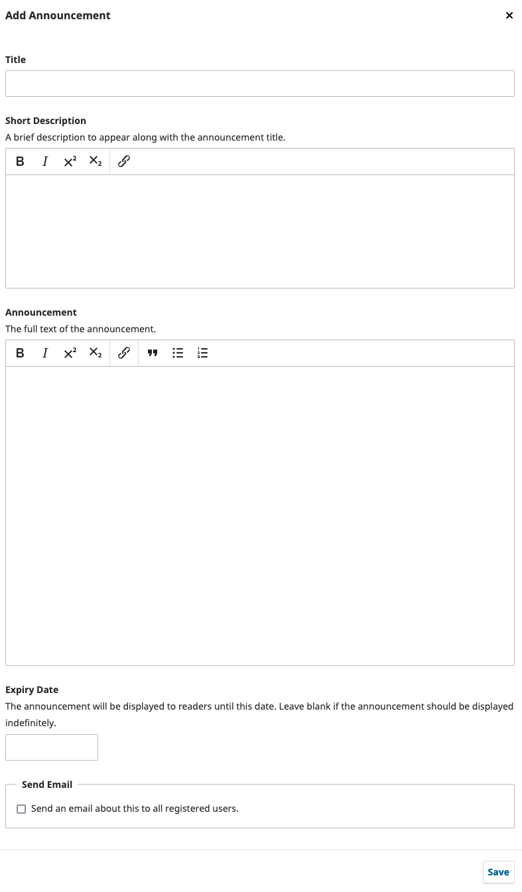

Die Mitteilung sollte nun auf einem Reiter „Mitteilungen“ auf der öffentlichen Zeitschriften-Website erscheinen.

.



### Listen

Begrenzen Sie die Anzahl der Einträge (z. B. Einreichungen, Nutzer/innen oder Bearbeitungsaufträge), die in einer Liste angezeigt werden, bevor weitere Einträge auf einer folgenden Seite dargestellt werden. Begrenzen Sie außerdem die Anzahl der Links, die zu den Folgeseiten der Liste angezeigt werden.

### Schutz personenbezogener Daten

Geben Sie die Datenschutzerklärung ein, die auf Ihrer Website angezeigt werden soll.

### Datum & Uhrzeit

Diese Option ermöglicht die Konfiguration unterschiedlicher Datums- und Uhrzeitformate für jede Zeitschrift und jedes Schema, die zuvor nur in der Datei „config.inc.php“ eingerichtet werden konnten. Beachten Sie, dass die Datei `config.inc.php` weiterhin verwendet werden kann, um Zeit- und Datumsformate für mehrere Zeitschriften festzulegen. Die Einstellungen für das primäre Zeitschema dienen als Standard für andere Zeitschemata, sofern nicht anders konfiguriert.  Ein benutzerdefiniertes Format kann mit den [Sonderformat-Zeichen](https://www.php.net/manual/en/function.strftime.php#refsect1-function.strftime-parameters) eingegeben werden.

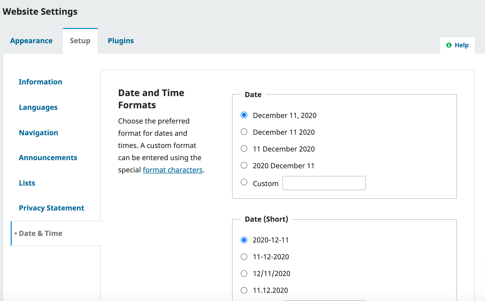

## Plugins {#plugins}

Dieses PKP School Video erklärt, wie man Plugins in OJS konfiguriert. Weitere Videos dieser Reihe finden Sie auf dem [PKP YouTube-Kanal](https://www.youtube.com/playlist?list=PLg358gdRUrDVTXpuGXiMgETgnIouWoWaY).



Verwenden Sie diese Seite, um alle installierten Plugins zu sehen und neue Plugins zu finden.

Weitere Informationen über verfügbare Plugins finden Sie im [Plugin Inventory](/plugin-inventory/en/).

### Installierte Plugins

Alle hier aufgeführten Plugins sind in Ihrer OJS-Installation verfügbar. Markieren Sie "Aktiviert", um sie zu verwenden.

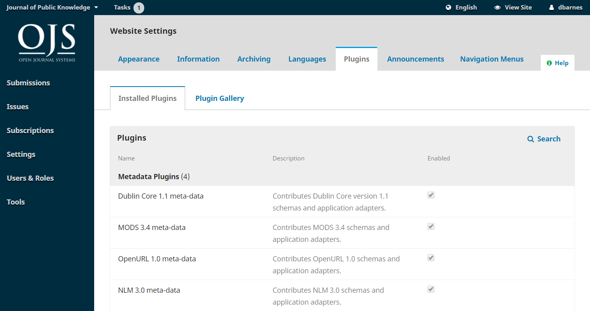

Sie werden feststellen, dass einige Plugins für das System erforderlich sind und nicht deaktiviert werden können.

Klicken Sie auf den blauen Pfeil neben dem Plugin-Namen, um Links zum Löschen, Aktualisieren oder Konfigurieren des Plugins anzuzeigen.

### Plugin-Galerie

Die Plugin-Galerie bietet Zugriff auf externe Plugins, die möglicherweise nicht in Ihrer OJS-Installation enthalten sind, aber zum Download und zur Aktivierung zur Verfügung stehen. Nur ein/e Administrator/in kann ein neues Plugin installieren.

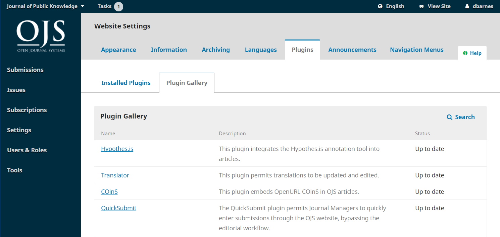

Die Auswahl des Plugin-Titels enthält zusätzliche Details, einschließlich Autor/in, Status, Beschreibung und Kompatibilität.

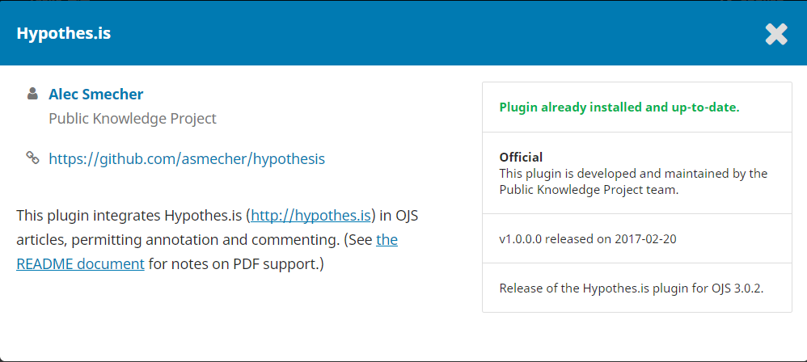

### Externe Plugins

Manchmal erscheinen neue Plugins oder Plugins, die außerhalb von PKP entwickelt werden, nicht in der Plugin-Galerie. Sie müssen separat installiert werden.

1. Laden Sie die tar.gz-Datei des Plugins aus dem Repositorium unter dem Reiter Releases herunter.
2. Gehen Sie zum Reiter Installierte Plugins.
3. Klicken Sie oben rechts auf Neues Plugin hochladen.
4. Laden Sie die Plugin-Datei hoch.
5. Klicken Sie auf Speichern, wenn der Upload beendet ist. Die Installation braucht etwas Zeit.

Wenn der Upload fehlgeschlagen ist, erhalten Sie möglicherweise eine Fehlermeldung mit dem Text „Das hochgeladene Plugin-Archiv enthält keinen zum Plugin-Namen passenden Ordner.“ In der Regel bedeutet dies, dass der Name des Plugin-Ordners innerhalb des Zip-Ordners in einen einfacheren Namen abgeändert werden muss. Ändern Sie beispielsweise „translator-ojs-3_0_0-0“ in „translator“.

Vergessen Sie nicht, auf Speichern zu klicken, um die Änderung zu übernehmen.

### Plugins zur Verbesserung und zum Auffinden von Inhalten

OJS 3 verfügt über eine Reihe von Plugins, mit denen Sie die Benutzererfahrung und die Auffindbarkeit Ihrer Inhalte bzw. der Zeitschrift verbessern können. Dieser Abschnitt beschreibt die verschiedenen Plugins, die in OJS zur Verfügung stehen, und wie man sie konfiguriert und benutzt.

Da einige der folgenden Plugins Drittanbieter-Plugins sind, kann es erforderlich sein, dass Sie die Zip-Datei von GitHub herunter- und in Ihrer Zeitschrift hochladen. Allgemeine Informationen zu Plugins und wie man Plugins installiert und aktiviert, finden Sie unter [Learning OJS 3 - Plugins](./settings-website#plugins).

Da PKP die Plugins von Drittanbietern nicht selbst pflegt, können wir nicht garantieren, dass diese mit Ihrer OJS-Version funktionieren.

#### Browse-Plugin

Dieses Plugin implementiert ein Block-Plugin, das es dem/der Benutzer/in ermöglicht, Inhalte nach Kategorien auszuwählen. Der Browse-Block erscheint in der Seitenleiste des Journals.

Das Plugin kann in der Plugin-Galerie aktiviert werden.

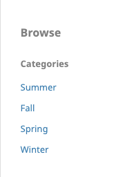

#### "Citation Style Language"-Plugin

Das "Citation Style Language"-Plugin fügt der Artikelseite einen "Zitationsvorschlag"-Block hinzu, der eine bibliographische Angabe für den Artikel im Format Ihrer Wahl enthält. Darunter kann optional die bibliographische Angabe in einem anderen Format erzeugt werden.

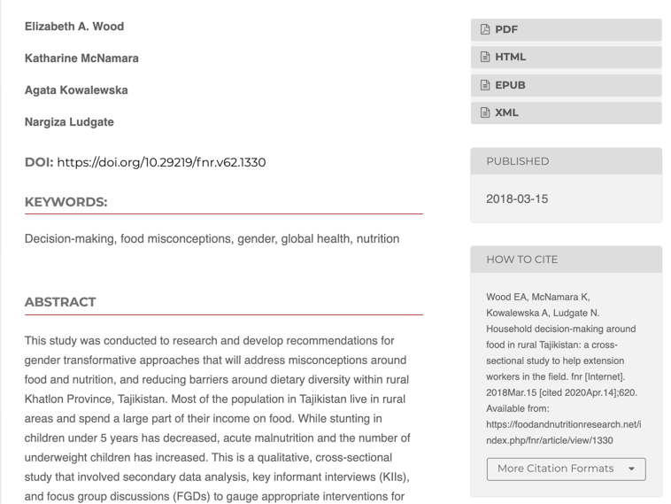

Dies ist ein installiertes Plugin, das unter Website-Einstellungen > Plugins > Installierte Plugins aktiviert werden muss.

Um das Plugin zu konfigurieren:

- Klicken Sie auf den blauen Pfeil neben dem Namen des Plugins.
- Klicken Sie auf den Link **Einstellungen**, der unten erscheint.

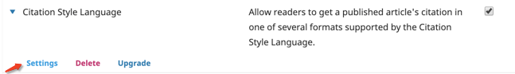

- Wählen Sie das primäre Format für bibliographische Angaben aus, das Sie von der ersten Liste verwenden möchten, gefolgt von den zusätzlichen Formaten für bibliografische Angaben, die über die zweite Liste verfügbar sein sollen.
- Als Nächstes können Sie optional ein herunterladbares Format auswählen, das den Leser/innen für den Export in eine Literaturverwaltungssoftware zur Verfügung gestellt werden soll.
- Für bibliographische Angaben, die dies erfordern, können Sie auch den Standort Ihrer Publikation/Ihres Verlags hinzufügen.
- Klicken Sie auf **OK**, wenn Sie die Konfiguration abgeschlossen haben.

Der Block "Zitationsvorschlag" erscheint nun auf jeder Artikelseite Ihrer Zeitschrift.

_Bitte beachten Sie: Die bibliographischen Angaben werden von einem externen Repositorium generiert. Wenn Sie einen Fehler in einem Format der bibliographischen Angaben bemerken, können Sie ihn über das [Citation Style Language styles repository auf GitHub](https://github.com/citation-style-language/styles) melden._

_Sie können auch eine benutzerdefinierte bibliographische Angabe durch eigene Programmierung hinzufügen._

#### Plugin "Verwaltung benutzerdefinierter Blöcke"

Benutzerdefinierte Blöcke konfigurieren und hinzufügen:

- Klicken Sie unter dem Plugin-Namen auf Benutzerdefinierte Blöcke verwalten.
- Klicken Sie auf "Block hinzufügen", um einen neuen Block zu erstellen, oder klicken Sie auf Bearbeiten oder Löschen unter dem Blocknamen, um bestehende Blöcke zu verwalten.
- Beim Hinzufügen eines neuen Blocks ist die Angabe eines Namens für den Block erforderlich. In den aktuelleren Versionen können Sie Leerzeichen in den Namen einfügen sowie auswählen, ob der Name über dem Blockinhalt angezeigt wird oder nicht.
- Die Anzeige und die Reihenfolge der Blöcke können in der Seitenleiste im Dashboard > Einstellungen > Website > Aussehen > Einrichtung bearbeitet werden.

#### Plugin "Angepasste Header"

Das Plugin "Angepasste Header" kann verwendet werden, um benutzerdefiniertes JavaScript zu einem Header oder Block hinzuzufügen. JavaScript ist oft erforderlich, um Ihre Website mit externen Diensten zu verknüpfen, kann aber aus Sicherheitsgründen nicht direkt in ein Feld eingefügt werden.

Das Plugin kann in der Plugin-Galerie aktiviert werden.

**Beispiel: Verwenden Sie das Plugin "Angepasste Header", um einen Twitter-Feed zu Ihrer Seitenleiste hinzuzufügen.**

Sie können einen X-Feed für Ihr Journal, Ihren Verlag oder Ihre Organisation in der Seitenleiste von OJS oder OMP hinzufügen.

Zuerst müssen Sie das "Angepasste Header"-Plugin aktivieren und konfigurieren, um JavaScript-Code zu einem benutzerdefinierten Block hinzufügen können:

1. Gehen Sie zu den Website-Einstellungen > Plugins und stellen Sie sicher, dass das "Angepasste Header"-Plugin installiert und aktiviert ist.
2. Klicken Sie auf den blauen Pfeil neben dem Plugin-Namen und auf die **Einstellungen** Schaltfläche, die unten angezeigt wird.
3. Fügen Sie Folgendes in das Header-Inhaltsfeld ein:

```html
<script async src="https://platform.twitter.com/widgets.js" charset="utf-8"></script>
```

4. Klicken Sie **OK** um es zu speichern

Als Nächstes erstellen Sie einen benutzerdefinierten Block:

1. Gehen Sie erneut zu Installierte Plugins und aktivieren Sie das Plugin "Verwaltung benutzerdefinierter Blöcke".
2. Klicken Sie auf den blauen Pfeil neben dem Plugin-Namen und auf **Benutzerdefinierte Blöcke** verwalten.
3. Klicke **Block hinzufügen**
4. Benennen Sie den Block, z.B. "X".
5. Über dem **Inhalt** Feld klicke auf den **Source Code** Button
6. Fügen Sie in das Pop-up-Fenster den folgenden Code ein - angepasst mit Link und Namen ihres eigenen Twitter-Accounts:

```html
<a class="twitter-timeline" href="https://twitter.com/asmecher?ref_src=twsrc%5Etfw">Tweets by asmecher</a>
```

7. Zusätzliche Parameter für die Timeline können hinzugefügt werden, z. B.:

```html
<a class="twitter-timeline" "data-tweet-limit="3" ...
```

8. Klicken Sie auf **Speichern**

Schließlich muss der benutzerdefinierte Block, der gerade erstellt wurde, der Seitenleiste hinzugefügt werden.

1. Gehen Sie zu den Website-Einstellungen > Aussehen und scrollen Sie nach unten zu **Seitenleiste**
2. Der Twitter-Block sollte unter Nicht ausgewählt erscheinen.
3. Ziehe den Block per Drag and drop in die **Seitenleiste**. Alle Blöcke können in der gewünschten Reihenfolge verschoben werden.

Eine weitere Option stellt das [Twitter Sidebar plugin](https://github.com/RBoelter/ojs3-twitter-sidebar) dar. Dieses Plugin erstellt einen Twitter-Block für die Seitenleiste.

#### Disqus-Plugin

Das [Disqus plugin](https://github.com/ajnyga/disqus) integriert sich mit [Disqus](https://disqus.com) und erlaubt Benutzer/innen Kommentare zu den Artikelseiten hinzuzufügen.

Das Disqus-Plugin ist ein Drittanbieter-Plugin, das aus dessen Github-Repository installiert werden muss.

Nachdem Sie das Plugin installiert und aktiviert haben, müssen Sie sich auf der [Disqus-Website](https://disqus.com) registrieren. Bei der Registrierung wählen Sie die Option "Use Disqus on your website". Bei der Registrierung entscheiden Sie sich für einen der kostenlosen und kostenpflichtigen Tarife von Disqus.

Wenn Sie gebeten werden, Ihren **Website-Namen** zu registrieren, erstellen Sie einen Namen basierend auf Ihrem Journalnamen. Dieser erscheint in Disqus-Feeds, E-Mail-Benachrichtigungen und in Ihrem Community-Tab. Zum Beispiel "pkpworkshopsjournal".

Überspringen Sie den Schritt **Install Disqus** und gehen Sie zu **Configure Disqus**. Geben Sie Ihre Journal-URL in das Feld **Website URL** ein. Geben Sie Ihre Kommentar-Richtlinie an, soweit zutreffend.

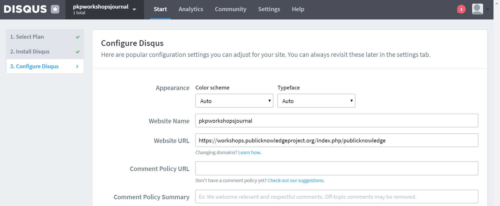

Jetzt können Sie das Disqus-Plugin auf Ihrer Journal-Seite konfigurieren:

1. Gehe zu Website-Einstellungen > Plugins.
2. Gehe zum Disqus-Plugin.
3. Klicken Sie auf den blauen Pfeil neben dem Plugin-Namen und auf die **Einstellungen** Schaltfläche, die unten angezeigt wird.
4. Geben Sie den Namen der Webseite aus Ihrem Disqus-Konto in das Feld **Disqus Forum Kurzname** ein.
5. Klicken Sie auf **OK**

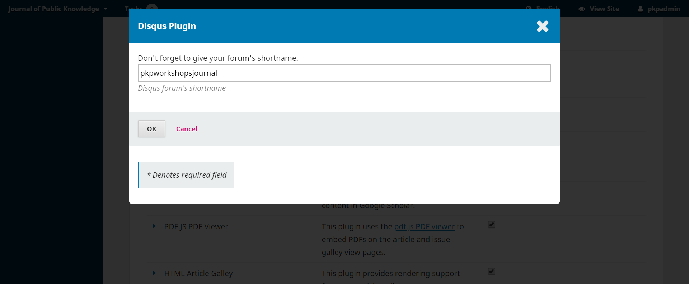

Nach der Konfiguration des Plugins sollten unten auf den Artikelseiten die Kommentare von Disqus zu sehen sein. Benutzer/innen müssen sich bei Disqus registrieren, um die Funktion nutzen zu können.

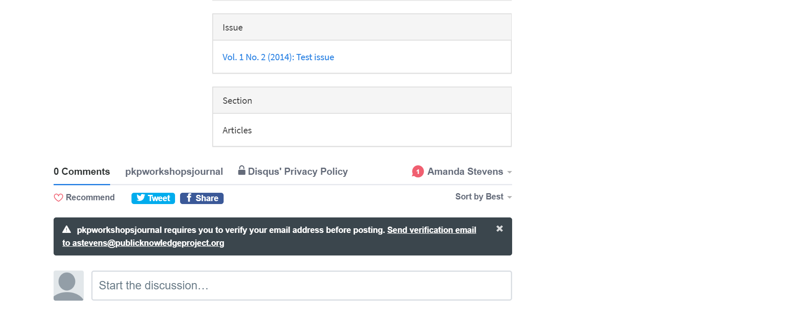

#### Hypothes.is-Plugin

Dieses Plugin fügt Hypothes.is zur öffentlichen Artikelansicht von OJS hinzu, sodass Anmerkungen und Kommentare ermöglicht werden. Zur Zeit ist nur das Kommentieren von HTML-Fahnen möglich.

Das Plugin kann in der Plugin-Galerie aktiviert werden.

Wenn das Plugin aktiviert ist, sehen Leser/innen die Hypothes.is-Tools auf der rechten Seite der HTML-Fahne.

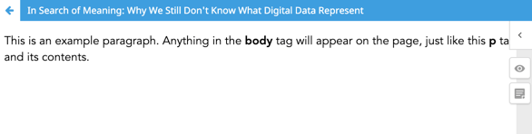

Es wird ein kostenloses Hypothes.is-Konto benötigt, um sich an der öffentlichen Kommentierung zu beteiligen. Spezifische/private Kommentargruppen können ebenfalls eingerichtet werden. [Siehe hypothes.is](https://web.hypothes.is/help/how-to-create-a-private-group/) für eine Anleitung.

Öffentliche Anmerkungen und Highlights (sofern vorhanden) werden nach Anmeldung angezeigt.

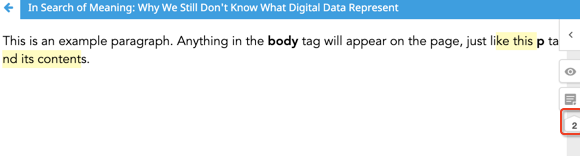

#### "Schlagwortwolke"-Plugin

Dieses Plugin zeigt eine Tag-Cloud von Schlüsselwörtern in der Seitenleiste Ihres Journals oder Verlags an.


Dies ist ein Plugin von Drittanbietern und die Datei muss [von GitHub](https://github.com/lepidus/keywordCloud) heruntergeladen werden.

Sobald Sie die Datei von GitHub heruntergeladen haben, laden Sie sie bei Ihrer Zeitschrift hoch und aktivieren Sie das Plugin. Es ist möglich, dass Sie dies nur in der Administrator/innen-Rolle durchführen können. Dadurch wird eine Schlagwort-Wolke als Block zur Verfügung gestellt, den Sie zur Seitenleiste Ihres Journals hinzufügen können.

Um die Keyword-Cloud-Anzeige zur Seitenleiste hinzuzufügen:

1. Gehen Sie zu Einstellungen > Webseite > Aussehen > Seitenleiste.
2. Ziehen Sie den Schlagwortwolke-Block aus der **Nicht selektiert-Spalte** in die **Spalte Seitenleiste**.
3. Ordnen Sie die Reihenfolge der Blöcke bei Bedarf neu an.
4. Klicken Sie auf **Speichern**.

Der Block erscheint nun in der Seitenleiste Ihrer Zeitschrift.

#### Most-Read-Plugin

Dieses Plugin erstellt einen „Most read articles“-Abschnitt in der Seitenleiste des Journals mit den fünf meistbesuchten Artikeln (mit Links) der letzten Woche, zusammen mit der Anzahl der Ansichten pro Artikel.

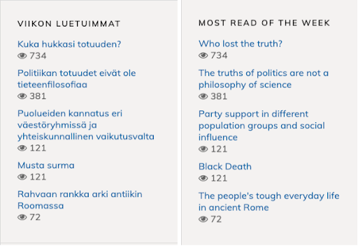

Dies ist ein Plugin von Drittanbietern und die Datei muss [von GitHub](https://github.com/ajnyga/mostRead) heruntergeladen werden.

_Dieses Plugin ist kompatibel mit den OJS-Versionen 3.1.2 oder höher. Es wird gerade für OJS 3.2._ angepasst

Sobald Sie die Datei von GitHub heruntergeladen haben, laden Sie sie bei Ihrer Zeitschrift hoch und aktivieren Sie sie. Es ist möglich, dass Sie dies nur in der Administrator/innen-Rolle durchführen können. Dadurch wird ein „Most Read"-Block erzeugt, den Sie zur Seitenleiste Ihrer Zeitschrift hinzufügen können.

Um diesen Block zu Ihrer Seitenleiste hinzuzufügen:

1. Gehen Sie zu Einstellungen > Webseite > Aussehen > Seitenleiste.
2. Ziehen Sie den "Most Read"-Block aus der **Spalte Nicht ausgewählt** in die **Spalte Seitenleiste**.
3. Ordnen Sie die Reihenfolge der Blöcke bei Bedarf neu an.
4. Klicken Sie auf **Speichern**.

Der Block erscheint nun in der Seitenleiste Ihrer Zeitschrift.

#### "Recommend Articles by Author"-Plugin

Dieses Plugin fügt eine Liste von Artikeln desselben Autors/derselben Autorin (mit entsprechenden Links) auf der Abstract-Seite eines Artikels ein.

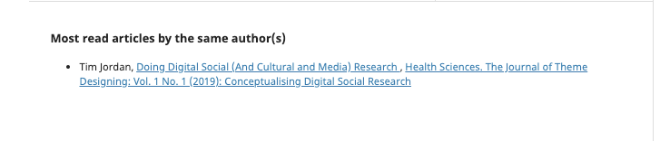

Das Plugin kann in der Plugin-Galerie aktiviert werden.

Sobald diese Option aktiviert ist, ist keine zusätzliche Konfiguration erforderlich.

#### "Ähnliche Artikel empfehlen"-Plugin

Dieses Plugin fügt eine Liste ähnlicher Artikel zur Abstract-Seite hinzu.

Das Plugin kann in der Plugin-Galerie aktiviert werden.

Sobald diese Option aktiviert ist, ist keine zusätzliche Konfiguration erforderlich.

#### Nutzungsstatistik-Bericht-Plugin

Dieses Plugin zeigt die Anzahl der Downloads eines Artikels auf der Artikelseite an.

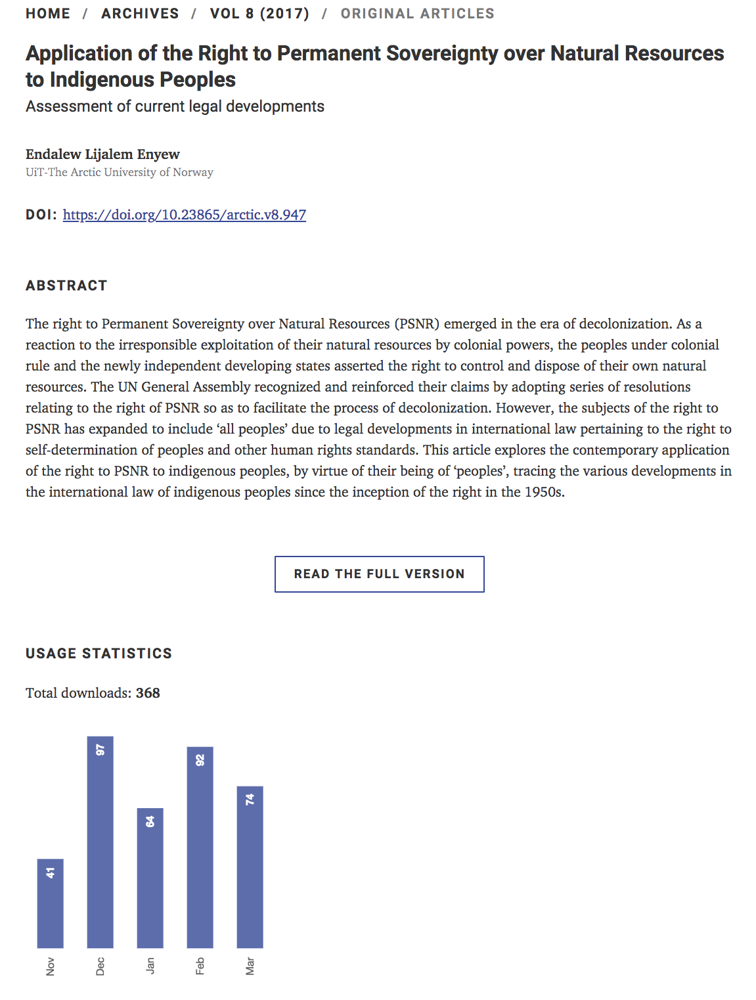

Um das Nutzungsstatistik-Bericht-Plugin zu konfigurieren, werden **Adminstrator/innen-Rechte** benötigt.

1. Gehen Sie zu Einstellungen > Website > Plugins.
2. Unter Generische Plugins finden Sie das Nutzungsstatistik-Bericht-Plugin.
3. Klicken Sie auf den blauen Pfeil links neben dem Plugin-Namen.
4. Klicken Sie auf Einstellungen.
5. Scrollen Sie zum unteren Rand des Pop-up-Fensters, das sich im Abschnitt Statistikanzeige-Optionen öffnet.
6. Aktivieren Sie das Kontrollkästchen neben dem Einreichungsstatistikdiagramm für Leser/innen.
7. Darunter können Sie auswählen, ob Sie die Statistiken als Balken- oder Liniendiagramm anzeigen wollen, sowie die maximale Anzahl von Monaten, für die die Nutzung angezeigt werden soll.
8. Klicken Sie Speichern.

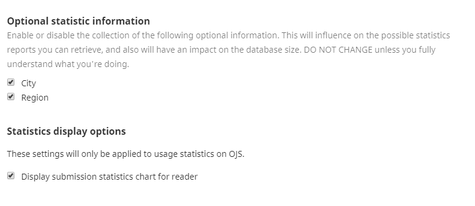

Hinweis:

- Nutzungsstatistiken können nur für das laufende Jahr angezeigt werden. Das Plugin wird zu Beginn jedes Jahres zurückgesetzt.
- Die angezeigten Statistiken geben an, wie oft ein Artikel heruntergeladen wurde.
