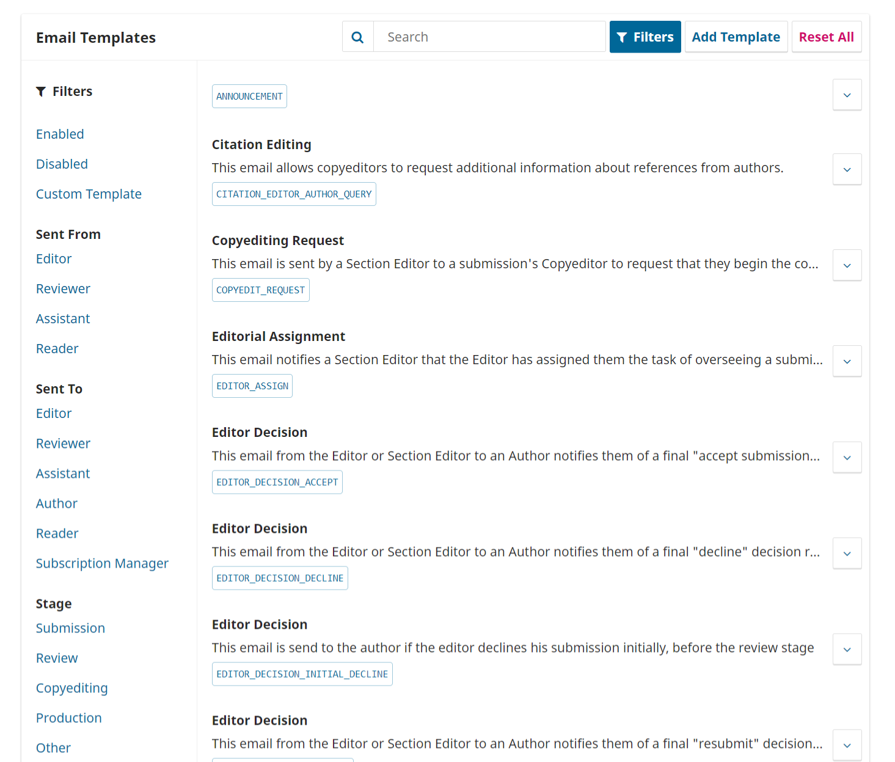

# Workflow-Einstellungen

Mit den Workflow-Einstellungen können Sie verschiedene Teile des redaktionellen Workflows der Zeitschrift konfigurieren. Die Workflow-Einstellungen haben 4 Reiter.

## Einreichung {#submission}

Dieses Video der PKP-School erklärt, wie der Einreichungsprozess in OJS konfiguriert wird. Weitere Videos dieser Reihe finden Sie auf dem [PKP YouTube-Kanal](https://www.youtube.com/playlist?list=PLg358gdRUrDVTXpuGXiMgETgnIouWoWaY).



Verwenden Sie diese Rubrik, um den Einreichungsprozess zu konfigurieren.

### Einreichungen deaktivieren

Ein/e Zeitschriftenverwalter/in kann Einreichungen für den gesamten Bereich oder für einen bestimmten Bereich oder für die gesamte Zeitschrift deaktivieren.

Sobald die Einstellung aktiviert ist, wird eine Benachrichtigung angezeigt, die darauf hinweist, dass die Beiträge deaktiviert wurden. Wenn diese Einstellung aktiviert ist, können Benutzer/innen keine Beiträge mehr für die Zeitschrift einreichen.

### Metadaten

In diesem Abschnitt wird festgelegt, welche Arten von Metadaten während des Einreichungsprozesses erfasst werden, z. B. Schlagwörter und Literaturhinweise.

### Bestandteile

Dieses Video der PKP School erklärt, wie Bestandteile in OJS verwaltet werden. Weitere Videos dieser Reihe finden Sie auf dem [PKP YouTube-Kanal](https://www.youtube.com/playlist?list=PLg358gdRUrDVTXpuGXiMgETgnIouWoWaY).



Bestandteile sind die Dateitypen, die Autor/innen auf die Website hochladen können. In der Regel besteht eine Datei aus dem Artikeltext, andere können Interviewprotokolle, Daten, Bilder usw. enthalten. Die Bestandteile, aus denen der/die Autor/in bei der Einreichung seines Beitrags wählen kann, sind hier aufgelistet.

Über die bereitgestellten Links können Sie die **Reihenfolge** der Bestandteile ändern (wie sie dem/der einreichenden Autor/in angezeigt werden), einen **Bestandteil hinzufügen** (wenn etwas, das Sie benötigen, nicht standardmäßig enthalten ist, z. B. ein Video) oder die **Standardeinstellungen wiederherstellen** (wenn jemand zu viele Änderungen vorgenommen hat und Sie einfach alles zurücksetzen möchten).

#### Bestandteile bearbeiten

Sie können jeden Bestandteil auch bearbeiten, indem Sie auf den blauen Pfeil links neben dem Namen des Bestandteils klicken. Daraufhin wird ein Link zum Bearbeiten und ein Link zum Löschen angezeigt.

- **Name**: Dies ist der Name des Bestandteils, wie er dem/der Autor/in angezeigt wird.

- **Dateityp**: Wählen Sie, wie die mit diesem Bestandteil verbundenen Dateien behandelt und angezeigt werden sollen. Alles, was als abhängige Datei markiert ist, wird nicht veröffentlicht.

- **Datei-Metadaten**: Wählen Sie die Art der Metadaten, die diese Dateien bekommen können. Für die Hauptdateien der Publikation, z. B. die herunterladbare PDF-Datei, sollte Dokument gewählt werden, damit diese Dateien ihre Metadaten von der Publikation übernehmen. Andernfalls wählen Sie für die meisten Dateitypen Ergänzende Inhalte. Illustration ist für Dateien geeignet, die eindeutige Metadaten für die Urheber/innen, Bildunterschriften und Lizenzen benötigen.

- **Schlüssel**: Optionale Abkürzung für den Bestandteil.

### Checkliste

In der Checkliste für die Beitragseinreichung müssen die Autor/innen ankreuzen, dass sie mit jedem Punkt auf dieser Liste einverstanden sind. Verwenden Sie den Link _Sortieren_, um die Reihenfolge der Punkte zu ändern, verwenden Sie den Link _Eintrag hinzufügen_, um einen neuen Eintrag zu erstellen, und verwenden Sie den blauen Pfeil links neben dem Namen des Eintrags, um einen vorhandenen Eintrag zu _Bearbeiten_.

### Autoren/innen-Richtlinien

Verwenden Sie dieses Feld, um Informationen für Ihre Autor/innen hinzuzufügen, die während des Einreichungsprozesses nützlich sein werden. Diese Informationen werden auf der Website der Zeitschrift angezeigt.

- Autor/innen-Richtlinien: Zu den empfohlenen Richtlinien gehören erforderliche Dateitypen für das Beitragsdokument, das bevorzugte Zitierformat oder andere Elemente, die in der Einreichung vorhanden sein sollten.
- Copyright-Vermerk: Dies ist die Lizenzvereinbarung zwischen dem/der Autor/in und der Zeitschrift, und der/die Autor/in erklärt sich zum Zeitpunkt der Einreichung mit diesen Bedingungen einverstanden.

## Begutachtung {#review}

Dieses Video der PKP-School demonstriert, wie der Begutachtungsprozess in OJS konfiguriert werden kann. Weitere Videos dieser Reihe finden Sie auf dem [PKP YouTube-Kanal](https://www.youtube.com/playlist?list=PLg358gdRUrDVTXpuGXiMgETgnIouWoWaY).



In diesem Reiter können Sie den Begutachtungsprozess für Ihre Zeitschrift konfigurieren.

### Einrichtung

**Standard-Reviewmodus**: Wählen Sie aus, ob Ihre Zeitschrift einen anonymen Gutachter/anonymen Autor, einen anonymen Gutachter/offenen Autor oder ein offenes Begutachtungsverfahren verwenden soll.

**Eingeschränkter Dateizugriff**: Aktivieren Sie dieses Kontrollkästchen, wenn Sie möchten, dass der/die Gutachter/in auf die Anfrage antwortet, bevor er/sie auf die Einreichungsdateien zugreift.

**Gutachter/innen-Zugang mit einem Klick**: Aktivieren Sie die erste Option (Standardeinstellung), um Gutachter/innen mit einem Klick Zugriff auf den Beitrag zu gewähren, ohne dass sie auf die Website gehen, sich anmelden und den Beitrag suchen müssen. Aus Sicherheitsgründen können Redakteur/innen bei dieser Option keine E-Mail-Adressen ändern oder CCs oder BCCs hinzufügen, bevor sie Einladungen an die Gutachter/innen senden.

**Standard-Begutachtungsfristen**: Geben Sie an, wie lange die Gutachter/innen Zeit haben, eine Begutachtungsanfrage der Redaktion anzunehmen oder abzulehnen, und wie lange sie Zeit haben, ein Gutachten abzugeben. Diese Fristen werden ab dem Datum berechnet, an dem die Anfrage gesendet wird.

**Automatisierte E-Mail-Erinnerungen**: Die Gutachter/innen werden automatisch benachrichtigt, wenn sie einem Beitrag zugewiesen werden; Sie können jedoch Erinnerungs-E-Mails für Gutachter/innen aktivieren oder deaktivieren. Verwenden Sie das Dropdown-Menü, um entweder die Anzahl der Tage oder „Nie erinnern“ unter „Eine Erinnerung senden, wenn ein/e Gutachter/in nicht innerhalb der folgenden Zeit (Tage) nach dem Fälligkeitsdatum der Antwort auf eine Begutachtungsanfrage geantwortet hat“ auszuwählen, um die Anzahl der Tage festzulegen, die nach dem Fälligkeitsdatum vergehen können, bevor Gutachter/innen daran erinnert werden, eine Begutachtungsanfrage anzunehmen oder abzulehnen.

Verwenden Sie das Dropdown-Menü, um entweder die Anzahl der Tage oder „Nie erinnern“ unter „Eine Erinnerung senden, wenn ein/e Gutachter/in nicht innerhalb der folgenden Zeit (Tage) nach dem Fälligkeitsdatum der Antwort auf eine Begutachtungsanfrage geantwortet hat“ auszuwählen, um die Anzahl der Tage festzulegen, die nach dem Fälligkeitsdatum vergehen können, bevor Gutachter/innen daran erinnert werden, ein Gutachten für einen Beitrag abzugeben.

Klicken Sie auf den Button **Speichern**, um Ihre Änderungen abzuspeichern.

Beachten Sie, dass einige Systemeinstellungen vom Website-Administrator/von der Webseite-Administratorin konfiguriert werden müssen, um E-Mails zu versenden. Weitere Informationen finden Sie im [Administrator's Guide](https://docs.pkp.sfu.ca/admin-guide/en/email) (englischsprachig).

### Richtlinien für die Begutachtung

**Richtlinien für die Begutachtung**: Geben Sie Ihren Gutachter/innen Kriterien an die Hand, anhand derer sie die Eignung eines Beitrags für die Veröffentlichung in der Zeitschrift beurteilen können; dazu können auch Anweisungen für die Erstellung eines effektiven und hilfreichen Gutachtens gehören.

**Konkurrierende Interessen**: Fügen Sie hier Ihre Erklärung zur Offenlegung konkurrierender Interessen ein.

### Begutachtungsformulare

Die Begutachtungsformulare geben den Gutachter/innen eine Reihe von Fragen vor, die sie zu beantworten haben. Dies kann dazu beitragen, ihre Beurteilung so zu schärfen, dass sie für Sie zielführender ist.

**Begutachtungsformular erstellen**: Verwenden Sie den Link Begutachtungsformular erstellen, um ein neues Formular zu erstellen.

In der Beschreibung und den Anweisungen finden Sie Informationen über das Formular und die Verwendung für Zeitschriftenverwalter/innen und Redakteur/innen. Dieser Inhalt ist nicht in dem Formular enthalten, das die Gutachter/innen sehen. Unter Begutachtungsrichtlinien \(unten\) können Sie Anweisungen und Richtlinien für Gutachter/innen hinzufügen.

Zurück auf der Seite Begutachtungsformulare klicken Sie auf den blauen Pfeil links neben dem Formularnamen, um den Link Bearbeiten anzuzeigen.

Wählen Sie den Link Bearbeiten und füllen Sie das Formular aus.

**Formularelemente** sind Formularfragen.

Sie können wählen, ob die Frage für Gutachter/innen obligatorisch und für Autor/innen sichtbar sein soll.

Sie können dann die Art der Antwort auswählen:

- ein Textfeld für ein einzelnes Wort
- ein Textfeld für eine einzelne Zeile
- ein erweitertes Textfeld \(für längere Antworten\)
- Kontrollkästchen \(bei denen der/die Gutachterin mehrere mögliche Antworten auswählen kann\)
- Optionsfelder \(bei denen der/die Gutachterin nur eine mögliche Antwort auswählen kann\)
- Dropdown-Menü \(bei denen der Überprüfer ebenfalls nur eine mögliche Antwort auswählen kann\)

**Antwortoptionen** sind die Auswahlmöglichkeiten, die Sie für die Kontrollkästchen, Optionsfelder oder Dropdown-Menüs zur Verfügung stellen. Ein gutes Beispiel für eine Checkbox-Antwort ist eine [Likert-Skala](https://en.wikipedia.org/wiki/Likert_scale), bei der die Gutachter/innen nur eine Option auswählen muss: z. B. Gut, Neutral, Schlecht.

Vergessen Sie nicht, Ihre Änderungen mit dem Button **Speichern** abzuspeichern.

Verwenden Sie den Reiter **Vorschau**, um das Formular zu testen.

Sobald Sie das Formular an eine/n Gutachter/in gesendet haben, können Sie es nicht mehr bearbeiten, da dies den Datensatz für bestehende Begutachtungsverfahren mit diesem Formular ändern würde. Wenn Sie zu diesem Zeitpunkt Änderungen am Beguachtungsformular vornehmen möchten, können Sie das vorhandene Formular kopieren und eine neue, aktualisierte Version erstellen.

**Anonymer Rezensent/versteckter Autor**: Aktivieren Sie dieses Kontrollkästchen, um einen Link anzuzeigen, der Anweisungen zur Anonymisierung aller eingereichten Dateien enthält.

## Bibliothek {#publisher-library}

Dieses Video der PKP-School erklärt, wie die Bibliothek in OJS genutzt werden kann. Weitere Videos dieser Reihe finden Sie auf dem [PKP YouTube-Kanal](https://www.youtube.com/playlist?list=PLg358gdRUrDVTXpuGXiMgETgnIouWoWaY).



Der/die Zeitschriftenverwalter/in und die Redakteur/innen können Dokumente hochladen, die sie den anderen Benutzer/innen in der Bibliothek zur Verfügung stellen möchten. Jedes in diesem Bereich hinzugefügte Dokument wird in der Dokumentenbibliothek der Benutzer/innen sichtbar.

Sie können hier auch eine Datei hochladen, die Sie über eine URL öffentlich zugänglich machen möchten, auf die Sie von anderen Teilen Ihrer Website aus verlinken können, z. B. von den Autor/innenrichtlinien, der Checkliste für die Einreichung oder einer statischen Seite.

Mögliche Formulare, die in diesem Bereich hochgeladen werden können, sind z. B. das Formular zur Genehmigung der Druckfahne, das Deckblatt für zusätzliches Material und andere Formulare, die mit dem Arbeitsablauf Ihrer Zeitschrift zusammenhängen.

Um eine Datei hier hinzuzufügen, klicken Sie auf „Datei hinzufügen“ in der oberen rechten Ecke des Feldes Bibliothek.

**Name**: Titel des Dokuments, das dem/der Benutzer/in angezeigt werden soll

**Typ**: Wählen Sie Marketing, Rechte, Berichte, Anderes

**Öffentlicher Zugang**: Wenn Sie diese Option aktivieren, können die Benutzer/innen diese Datei über den angegebenen Hyperlink herunterladen, wenn sie in anderen Teilen Ihrer Zeitschriften-Website verlinkt ist.

## E-Mails {#emails}

Dieses Video der PKP-School erklärt, wie die E-Mail-Benachrichtigungen in OJS konfiguriert werden können. Weitere Videos dieser Reihe finden Sie auf dem [PKP YouTube-Kanal](https://www.youtube.com/playlist?list=PLg358gdRUrDVTXpuGXiMgETgnIouWoWaY).



### E-Mail-Einrichtung

In dieser Rubrik können Sie die E-Mails konfigurieren, die vom System verschickt werden.

**Signatur**: Die Informationen in diesem Feld werden am Ende jeder vom System gesendeten E-Mail hinzugefügt.

**Bounce-Adresse**: An diese E-Mail-Adresse wird eine Benachrichtigung über alle vom System versendeten E-Mails geschickt, die nicht zugestellt werden konnten, z. B. wenn die E-Mail-Adresse nicht mehr gültig ist.

### E-Mail-Vorlagen

OJS erleichtert die Workflow-Kommunikation durch die Verwendung von vorbereiteten E-Mail-Nachrichten. Bitte beachten Sie, dass für den Versand von E-Mails eine gewisse Konfiguration erforderlich ist. Weitere Informationen finden Sie im [Administrator's Guide](https://docs.pkp.sfu.ca/admin-guide/en/email) (englischsprachig).

Sie können die vorbereiteten E-Mail-Vorlagen hier anzeigen und ändern. Eine Auflistung der E-Mail-Vorlagen finden Sie im Reiter „E-Mails“. Der Titel und die Zusammenfassung jeder E-Mail-Vorlage werden in der Liste angezeigt.

Wenn Sie auf den Pfeil neben jeder E-Mail-Vorlage klicken, können Sie den Betreff und den Inhalt der Nachricht sowie den Standardabsender und -empfänger der Nachricht anzeigen.

Sie können nach einer E-Mail-Vorlage mit einem Schlagwort suchen, indem Sie etwas in die **Suche** eingeben.

Sie können auf **Filter** klicken, um Optionen zum Filtern der Vorlagen nach Status, Absender und Empfänger sowie nach der Workflow-Phase, in der die Vorlage verwendet wird, anzuzeigen. Diese Filter können Ihnen helfen, Vorlagen zu finden, die Sie bearbeiten möchten.

Unter [Vorlagenbeschreibungen](#template-descriptions) am Ende dieses Kapitels finden Sie eine Tabelle mit allen E-Mail-Vorlagen sowie deren Absender, Empfänger und Workflow-Stufe.

#### E-Mail-Vorlagen bearbeiten

Wenn Sie eine E-Mail-Vorlage bearbeiten, ändern Sie den Inhalt, der jedes Mal, wenn sie verwendet wird, ausgegeben wird.  Bei E-Mails, die freiwillig gesendet werden, z. B. eine Nachricht an eine/n Gutachter/in mit der Bitte, einen Beitrag zu prüfen, können Sie auch den Inhalt der Nachricht zum Zeitpunkt des Sendens ändern. Dadurch wird der Inhalt nur für diese Nachricht geändert.

So bearbeiten Sie eine Vorlage:

1. Gehen Sie zu Workflow-Einstellungen > E-Mails > Vorbereitete E-Mail-Vorlagen
2. Klicken Sie auf den blauen Pfeil neben dem Vorlagennamen, um die Links darunter anzuzeigen
3. Klicken Sie auf Bearbeiten
4. Nehmen Sie Änderungen am Betreff und am Text vor. Achten Sie darauf, dass Sie keine Tags wie „{$authorName}:“ löschen, die automatisch Inhalte aus einem Beitrag einfügen.
5. Wenn Sie mit der Bearbeitung fertig sind, klicken Sie auf Speichern.

#### E-Mail-Vorlagen deaktivieren

Alle Vorlagen sind bei der Installation von OJS standardmäßig aktiviert, aber Sie können einige Vorlagen deaktivieren, indem Sie auf die Schaltfläche Ausschalten klicken. Bei den meisten Vorlagen, die deaktiviert werden können, handelt es sich um Nachrichten, die automatisch von OJS gesendet werden. Die Deaktivierung der Vorlage bedeutet, dass die automatische Benachrichtigung nicht gesendet wird.

So deaktivieren Sie eine Vorlage:

1. Gehen Sie zu Workflow-Einstellungen > E-Mails > Vorbereitete E-Mail-Vorlagen
2. Klicken Sie auf den blauen Pfeil neben dem Vorlagennamen, um die Links darunter anzuzeigen
3. Klicken Sie auf Ausschalten (wenn die Schaltfläche nicht erscheint, kann diese Vorlage nicht deaktiviert werden)

#### Standard-E-Mail-Vorlagen neu laden

Wenn Sie E-Mail-Vorlagen bearbeitet haben, die Bearbeitungen aber rückgängig machen und die Standardinhalte wiederherstellen möchten, können Sie sie zurücksetzen:

1. Gehen Sie zu Workflow-Einstellungen > E-Mails > Vorbereitete E-Mail-Vorlagen
2. Klicken Sie auf Alle Vorlagen zurücksetzen
3. Wenn die Bestätigungsmeldung erscheint, klicken Sie auf OK.

#### E-Mail-Vorlage hinzufügen

Klicken Sie auf den Button **Vorlage hinzufügen**, um eine benutzerdefinierte E-Mail-Vorlage zu erstellen, die Sie verwenden können, wenn Sie eine/n Benutzer/in benachrichtigen oder weitere Beteiligte zu einer Einreichung hinzufügen. Beachten Sie, dass Sie in Versionen vor OJS 3.1.2 zwar eine benutzerdefinierte E-Mail-Vorlage erstellen können, diese aber in keiner Phase des Workflows verwendet werden kann.

#### Filter

Klicken Sie hier, um E-Mail-Vorlagen nach den folgenden Kriterien zu filtern: Aktiviert, Deaktiviert, Benutzerdefinierte Vorlage. Sie können E-Mail-Vorlagen auch danach filtern, von wem sie gesendet wurden und an wen sie gesendet werden.

#### Hinzufügen eines E-Mail-Anhangs

In OJS 3 gibt es keine direkte Funktion für einen E-Mail-Anhang, aber Sie können öffentliche Dateien über die Bibliothek hochladen und freigeben:

1. Unter Einstellungen > Workflow > Bibliothek > Datei hinzufügen laden Sie Ihr Dokument hoch und markieren das Kontrollkästchen "Öffentlicher Zugang"
2. Klicken Sie auf "OK", damit die URL generiert wird
3. Fügen Sie die URL in Ihre E-Mail ein

Sie können auch eine bestehende E-Mail-Vorlage mit dieser URL ändern oder sie auf der Website öffentlich zugänglich machen.

#### Vorlagenbeschreibungen

OJS 3.2 enthält nun für jede Vorlage eine Beschreibung, in der Absender/in und Empfänger/in sowie die Phase des Workflows angegeben sind.

Die folgende Tabelle gibt einen Überblick über die vorbereiteten E-Mail-Vorlagen in OJS 3.2. Beachten Sie, dass sich "Redakteur/in" auf jede Art von Redakteur/in bezieht (z. B. Zeitschriftenredakteur/in, Produktionsredakteur/in, usw.). Die folgenden Spalten sind in der Tabelle enthalten:

- **Vorlage**: Der Name der E-Mail-Vorlage.
- **Beschreibung**: Eine Beschreibung der Vorlage.
- **Absender/in**: Der Name oder die Signatur, die am Ende der Nachricht erscheint. In einigen Fällen sendet das System die Nachricht automatisch, aber der/die Absender/in erscheint als ein/e bestimmte/r Benutzer/in.
- **Empfänger/in**: An wen die E-Mail gesendet werden kann.
- **Workflow-Stufe**: Die Workflow-Stufe, in der diese Vorlage verwendet wird.

| Vorlage                                                                                                                                                                            | Beschreibung                                                                                                                                                                                                                                                                                                                                                                                                                                                                                                                                                                                                                                                                                                                                                                        | Absender/in                                    | Empfänger/in                                           | Workflow                   |
| ---------------------------------------------------------------------------------------------------------------------------------------------------------------------------------- | ----------------------------------------------------------------------------------------------------------------------------------------------------------------------------------------------------------------------------------------------------------------------------------------------------------------------------------------------------------------------------------------------------------------------------------------------------------------------------------------------------------------------------------------------------------------------------------------------------------------------------------------------------------------------------------------------------------------------------------------------------------------------------------- | ---------------------------------------------- | ------------------------------------------------------ | -------------------------- |
| Ankündigung - ANNOUNCEMENT                                                                                                                                                         | Diese E-Mail wird verwendet, um Nutzer über eine neue Ankündigung der Zeitschrift zu informieren.                                                                                                                                                                                                                                                                                                                                                                                                                                                                                                                                                                                                                                                                   | System                                         | Registrierte Benutzer/innen                            |                            |
| Bearbeitung von Zitaten - CITATION_EDITOR_AUTHOR_QUERY                                                              | Mit dieser E-Mail können die Redakteur/innen zusätzliche Informationen über Referenzen von den Autor/innen anfordern.                                                                                                                                                                                                                                                                                                                                                                                                                                                                                                                                                                                                                                               | Lektor/in                                      | Autor/in                                               | Lektorat                   |
| Lektoratsanfrage - COPYEDIT_REQUEST                                                                                                                           | Diese E-Mail wird von einer/einem Rubrikredakteur/in an den/die Lektor/in einer Einreichung geschickt, um sie/ihn aufzufordern, mit dem Lektorat zu beginnen. Sie enthält Informationen über die Einreichung und den Zugang zu dieser.                                                                                                                                                                                                                                                                                                                                                                                                                                                                                                              | Rubrikredakteur/in                             | Lektor/in                                              | Lektorat                   |
| Redaktionelle Aufgabe - EDITOR_ASSIGN                                                                                                                         | Diese E-Mail benachrichtigt eine/n Rubrikredakteur/in, dass der/die Redakteur/in ihm/ihr die Aufgabe zugewiesen hat, eine Einreichung durch den Bearbeitungsprozess zu begleiten. Sie enthält Informationen über die Einreichung und wie man auf die Website der Zeitschrift zugreifen kann.                                                                                                                                                                                                                                                                                                                                                                                                                                                        | Redakteur/in                                   | Rubrikredakteur/in                                     | Einreichung                |
| Entscheidung der Redaktion - EDITOR_DECISION_ACCEPT                                                                                      | Diese E-Mail der Redaktion oder der Rubrikredaktion an eine/n Autor/in benachrichtigt diese/n über die endgültige Entscheidung über die Annahme der Einreichung.                                                                                                                                                                                                                                                                                                                                                                                                                                                                                                                                                                                                    | Redakteur/in, Rubrikredakteur/in               | Autor/in                                               | Begutachtung               |
| Entscheidungd der Redaktion - EDITOR_DECISION_DECLINE                                                                                    | Diese E-Mail der Redaktion oder der Rubrikredaktion an eine/n Autor/in benachrichtigt diese/n über die endgültige Entscheidung über die Ablehnung der Einreichung.                                                                                                                                                                                                                                                                                                                                                                                                                                                                                                                                                                                                  | Redakteur/in, Rubrikredakteur/in               | Autor/in                                               | Begutachtung               |
| Entscheidung der Redaktion - EDITOR_DECISION_INITIAL_DECLINE                                                        | Diese E-Mail wird an den/die Autor/in gesendet, wenn die Redaktion seine/ihre Einreichung zunächst ablehnt, bevor die Überprüfung stattfindet                                                                                                                                                                                                                                                                                                                                                                                                                                                                                                                                                                                                                                       | Redakteur/in, Rubrikredakteur/in               | Autor/in                                               | Einreichung                |
| Entscheidung der Redaktion - EDITOR_DECISION_RESUBMIT                                                                                    | Diese E-Mail der Redaktion oder der Rubrikredaktion an den/die Autor/in informiert sie/ihn über die endgültige Entscheidung über die Wiedervorlage des Beitrags.                                                                                                                                                                                                                                                                                                                                                                                                                                                                                                                                                                                                    | Redakteur/in, Rubrikredakteur/in               | Autor/in                                               | Begutachtung               |
| Entscheidung der Redaktion - EDITOR_DECISION_REVISIONS                                                                                   | Diese E-Mail der Redaktion oder Rubrikredaktion an den/die Autor/in informiert sie/ihn über die endgültige Entscheidung „Überarbeitung erforderlich“ bezüglich des Beitrags.                                                                                                                                                                                                                                                                                                                                                                                                                                                                                                                                                                                        | Redakteur/in, Rubrikredakteur/in               | Autor/in                                               | Begutachtung               |
| Entscheidung der Redaktion - EDITOR_DECISION_SEND_TO_EXTERNAL                                  | Diese E-Mail des/der Redakteur/in oder des/der Rubrikredakteur/in an eine/n Autor/in informiert diesen darüber, dass sein/ihr Beitrag zur externen Prüfung weitergeleitet wird.                                                                                                                                                                                                                                                                                                                                                                                                                                                                                                                                                                                     | Redakteur/in, Rubrikredakteur/in               | Autor/in                                               | Begutachtung               |
| Entscheidung der Redaktion - EDITOR_DECISION_SEND_TO_PRODUCTION                                | Diese E-Mail des/der Redakteur/in oder des/der Rubrikredakteur/in an eine/n Autor/in informiert diesen darüber, dass sein/ihr Beitrag an die Produktion weitergeleitet wurde.                                                                                                                                                                                                                                                                                                                                                                                                                                                                                                                                                                                       | Redakteur/in, Rubrikredakteur/in               | Autor/in                                               | Veröffentlichung           |
| Entscheidung der Redaktion - EDITOR_RECOMMENDATION                                                                                                            | Diese E-Mail des/der Redakteur/in oder Rubrikredakteur/in an die entscheidungsbefugten Redakteur/innen oder Rubrikredakteur/innen informiert diese über eine endgültige Empfehlung bezüglich der Einreichung.                                                                                                                                                                                                                                                                                                                                                                                                                                                                                                                                                       | Empfehlende/r Redakteur/in, Rubrikredakteur/in | Redakteur/in, Rubrikredakteur/in                       | Begutachtung               |
| Artikel von möglichem Interesse - EMAIL_LINK                                                                                                                  | Diese E-Mail-Vorlage bietet registrierten Leser/innen die Möglichkeit, Informationen über einen Artikel an eine Person zu senden, die daran interessiert sein könnte. Sie ist über die Lesewerkzeuge verfügbar und muss vom Zeitschriftenverwalter/in auf der Seite Lesetool-Verwaltung aktiviert werden.                                                                                                                                                                                                                                                                                                                                                                                                                                           | Zeitschriftenverwalter/in                      | Leser/in                                               |                            |
| Druckfahnen komplett - LAYOUT_COMPLETE                                                                                                                        | Diese E-Mail vom Layout-Leiter/in an den/die Rubrikredakteur/in benachrichtigt diese/n, dass der Layout-Prozess abgeschlossen ist.                                                                                                                                                                                                                                                                                                                                                                                                                                                                                                                                                                                                                                  | Layout-Leiter/in                               | Redakteur/in                                           | Veröffentlichung           |
| Anfrage Druckfahnen - LAYOUT_REQUEST                                                                                                                          | In dieser E-Mail des/der Rubrikredakteur/in an den/die Layout-Leiter/in wird dieser darüber informiert, dass er/sie mit dem Layout eines Beitrags beauftragt wurde. Sie enthält Informationen über die Einreichung und den Zugang zu dieser.                                                                                                                                                                                                                                                                                                                                                                                                                                                                                                        | Redakteur/in                                   | Layout-Leiter/in                                       | Veröffentlichung           |
| Archivierungsanfrage für {$contextName} - LOCKSS_EXISTING_ARCHIVE                                                                        | In dieser E-Mail wird der/die Verwalter/in eines LOCKSS-Archivs gebeten, die Aufnahme dieser Zeitschrift in das Archiv zu erwägen. Sie enthält die URL zum LOCKSS-Publisher-Manifest der Zeitschrift.                                                                                                                                                                                                                                                                                                                                                                                                                                                                                                                                               | LOCKSS                                         | Zeitschriftenverwalter/in                              | Postproduktion/Indexierung |
| Archivierungsanfrage für {$contextName} - LOCKSS_NEW_ARCHIVE                                                                             | In dieser E-Mail wird der/die Empfänger/in aufgefordert, sich an der LOCKSS-Initiative zu beteiligen und diese Zeitschrift in das Archiv aufzunehmen. Sie enthält Informationen über die LOCKSS-Initiative und Möglichkeiten, sich zu beteiligen.                                                                                                                                                                                                                                                                                                                                                                                                                                                                                                   | LOCKSS                                         | Zeitschriftenverwalter/in                              | Postproduktion/Indexierung |
| Fehler bei der Indexierung von Artikeln - LUCENE_ARTICLE_INDEXING_ERROR_NOTIFICATION           | Diese E-Mail-Vorlage wird verwendet, um den technischen Kontakt einer Zeitschrift zu benachrichtigen, dass bei der Indizierung eines Artikels ein Fehler aufgetreten ist.                                                                                                                                                                                                                                                                                                                                                                                                                                                                                                                                                                                           | Lucene search Plugin                           | Zeitschriftenverwalter/in                              | Postproduktion/Indexierung |
| Fehler bei der Indexierung der Zeitschrift - LUCENE_JOURNAL_INDEXING_ERROR_NOTIFICATION        | Diese E-Mail-Vorlage wird verwendet, um den technischen Kontakt einer Zeitschrift zu benachrichtigen, dass bei der Indizierung der Zeitschrift ein Fehler aufgetreten ist.                                                                                                                                                                                                                                                                                                                                                                                                                                                                                                                                                                                          | Lucene search Plugin                           | Zeitschriftenverwalter/in                              | Postproduktion/Indexierung |
| Fehler bei der Suche der Zeitschrift - LUCENE_SEARCH_SERVICE_ERROR_NOTIFICATION                | Diese E-Mail-Vorlage wird verwendet, um den technischen Kontakt einer Zeitschrift zu benachrichtigen, dass beim Zugriff auf die Solr-Suche ein Fehler aufgetreten ist                                                                                                                                                                                                                                                                                                                                                                                                                                                                                                                                                                                                               | Lucene search Plugin                           | Zeitschriftenverwalter/in                              | Postproduktion/Indexierung |
| Manuelle Zahlungsbenachrichtigung - MANUAL_PAYMENT_NOTIFICATION                                                                          | Diese E-Mail-Vorlage wird verwendet, um eine/n Zeitschriftenverwalter/in zu benachrichtigen, dass eine manuelle Zahlung angefordert wurde.                                                                                                                                                                                                                                                                                                                                                                                                                                                                                                                                                                                                                          | Autor/in                                       | Zeitschriftenverwalter/in                              |                            |
| Eine Nachricht über {$siteTitle} - NOTIFICATION                                                                                                                                    | Die E-Mail wird an registrierte Benutzer/innen gesendet, die diese Art von Benachrichtigung per E-Mail ausgewählt haben. Dazu gehören Benachrichtigungen über Ankündigungen und neu veröffentlichte Ausgaben.                                                                                                                                                                                                                                                                                                                                                                                                                                                                                                                                       | System                                         | Registrierte Benutzer/in                               |                            |
| Eine Nachricht über {$contextName} - NOTIFICATION_CENTER_DEFAULT                                                                         | Die Standardmitteilung (leer), die im Benachrichtigungscenters verwendet wird.                                                                                                                                                                                                                                                                                                                                                                                                                                                                                                                                                                                                                                                                   |                                                |                                                        |                            |
| Willkommen auf der {$siteTitle} Mailingliste! - NOTIFICATION_MAILLIST_WELCOME                                                            | Diese E-Mail wird an eine/n nicht registrierte/n Benutzer/in gesendet, der/die sich gerade in der Benachrichtigungs-Mailingliste registriert hat.                                                                                                                                                                                                                                                                                                                                                                                                                                                                                                                                                                                                                   | System                                         | Registrierte Benutzer/in                               |                            |
| Ausgabe jetzt Open Access - OPEN_ACCESS_NOTIFY                                                                                           | Diese E-Mail wird an registrierte Leser/innen verschickt, die eine Benachrichtigung per E-Mail angefordert haben, wenn eine Ausgabe frei zugänglich wird.                                                                                                                                                                                                                                                                                                                                                                                                                                                                                                                                                                                                           | Registrierte Gutachter/in                      | System                                                 | Veröffentlichung           |
| Angabe der ORCID - ORCID_COLLECT_AUTHOR_ID                                                                          | Diese E-Mail-Vorlage wird verwendet, um die ORCID-Kennungen der Autor/innen einzuholen.                                                                                                                                                                                                                                                                                                                                                                                                                                                                                                                                                                                                                                                                             | Zeitschriftenverwalter/in; System              | Autor/in                                               | Einreichung                |
| Beantragung des Zugriffs auf ORCID-Datensätze - ORCID_REQUEST_AUTHOR_AUTHORIZATION                                  | Diese E-Mail-Vorlage wird verwendet, um den Zugriff auf ORCID-Einträge von Autoren zu erbitten.                                                                                                                                                                                                                                                                                                                                                                                                                                                                                                                                                                                                                                                                     | Zeitschriftenverwalter/in; System              | Autor/in                                               | Einreichung                |
| Passwort zurücksetzen - PASSWORD_RESET                                                                                                                        | Diese E-Mail wird an eine/n registrierte/n Benutzer/in gesendet, wenn er/sie sein Passwort nach dem in der E-Mail PASSWORD_RESET_CONFIRM beschriebenen Verfahren erfolgreich zurückgesetzt hat.                                                                                                                                                                                                                                                                                                                                                                                                                                                                                                                           | System                                         | Registrierte Benutzer/in                               |                            |
| Passwort zurücksetzen Bestätigung - PASSWORD_RESET_CONFIRM                                                                               | Diese E-Mail wird an eine/n registrierte/n Benutzer/in gesendet, wenn diese/r angibt, dass er/sie das Passwort vergessen hat oder sich nicht anmelden kann. Sie enthält eine URL, der sie folgen können, um ihr Passwort zurückzusetzen.                                                                                                                                                                                                                                                                                                                                                                                                                                                                                                            | System                                         | Registrierte Benutzer/in                               |                            |
| Neue Ausgabe veröffentlicht - PUBLISH_NOTIFY                                                                                                                  | Diese E-Mail wird in OJS 3 nicht verwendet.                                                                                                                                                                                                                                                                                                                                                                                                                                                                                                                                                                                                                                                                                                                         | System                                         | Registrierte Benutzer/innen                            | Veröffentlichung           |
| Registrierung als Gutachter/in mit {$contextName} - REVIEWER_REGISTER                                                                                         | Diese E-Mail wird an eine/n neu registrierte/n Gutachter/in gesendet, um ihn/sie im System willkommen zu heißen und ihm/ihr den Benutzer/innennamen und das Passwort mitzuteilen.                                                                                                                                                                                                                                                                                                                                                                                                                                                                                                                                                                                   | System                                         | Gutachter/in                                           |                            |
| Eingangsbestätigung für ein Gutachten - REVIEW_ACK                                                                                                            | Diese E-Mail wird von einem/einer Rubrikredakteur/in verschickt, um den Erhalt einer abgeschlossenen Begutachtung zu bestätigen und dem/der Gutachter/in für seinen/ihren Beitrag zu danken.                                                                                                                                                                                                                                                                                                                                                                                                                                                                                                                                                                        | Redakteur/in, Rubrikredakteur/in               | Gutachter/in                                           | Begutachtung               |
| Begutachtungsanfrage abgelehnt - REVIEW_CANCEL                                                                                                                | Diese E-Mail wird von der Rubrikredaktion an eine/n Gutachter/in gesendet, der/die eine laufende Prüfung einer Einreichung durchführt, um ihn/sie zu informieren, dass die Prüfung abgebrochen wurde.                                                                                                                                                                                                                                                                                                                                                                                                                                                                                                                                                               | Gutachter/in                                   | Redakteur/in, Rubrikredakteur/in                       | Begutachtung               |
| Gutachten möglich - REVIEW_CONFIRM                                                                                                                            | Diese E-Mail wird von einem/einer Gutachter/in an den/die Rubrikredakteur/in als Antwort auf eine Begutachtungsanfrage gesendet, um den/die Rubrikredakteur/in darüber zu informieren, dass die Begutachtungsanfrage angenommen wurde und bis zum angegebenen Datum abgeschlossen sein wird.                                                                                                                                                                                                                                                                                                                                                                                                                                                                        | Gutachter/in                                   | Redakteur/in, Rubrikredakteur/in                       | Begutachtung               |
| Gutachten nicht möglich - REVIEW_DECLINE                                                                                                                      | Diese E-Mail wird von einem/einer Gutachter/in an den/die Rubrikredakteur/in als Antwort auf eine Prüfanfrage gesendet, um den/die Rubrikredakteur/in zu informieren, dass die Begutachtungsanfrage abgelehnt wurde.                                                                                                                                                                                                                                                                                                                                                                                                                                                                                                                                                | Gutachter/in                                   | Redakteur/in, Rubrikredakteur/in                       | Begutachtung               |
| Wiederaufnahme eines abgebrochenen Gutachtens - REVIEW_REINSTATE                                                                                              | Diese E-Mail wird von der Rubrikredaktion an eine/n Gutachter/in gesendet, der/die eine laufende Begutachtung einer Einreichung durchführt, um sie/ihn darüber zu informieren, dass eine abgebrochene Begutachtung wieder aufgenommen wurde.                                                                                                                                                                                                                                                                                                                                                                                                                                                                                                                        | Redakteur/in, Rubrikredakteur/in               | Gutachter/in                                           | Begutachtung               |
| Erinnerung an das ausstehende Gutachten - REVIEW_REMIND                                                                                                       | Diese E-Mail wird von einem/einer Rubrikredakteur/in verschickt, um eine/n Gutachter/in daran zu erinnern, dass ihre/seine Begutachtung fällig ist.                                                                                                                                                                                                                                                                                                                                                                                                                                                                                                                                                                                                                 | Redakteur/in, Rubrikredakteur/in               | Gutachter/in                                           | Begutachtung               |
| automatisierte Erinnerung an das ausstehende Gutachten - REVIEW_REMIND_AUTO                                                              | Diese E-Mail wird automatisch verschickt, wenn das Fälligkeitsdatum eines Gutachtens abgelaufen ist (siehe Begutachtungsoptionen unter Einstellungen > Workflow > Begutachtung) und der Ein-Klick-Zugang für Gutachtende deaktiviert ist. Geplante Aufgaben müssen aktiviert und konfiguriert sein (siehe die Konfigurationsdatei der Website).                                                                                                                                                                                                                                                                                                                                                               | System                                         | Gutachter/in                                           | Begutachtung               |
| automatisierte Erinnerung an das ausstehende Gutachten (one click) - REVIEW_REMIND_AUTO_ONECLICK | Diese E-Mail wird automatisch verschickt, wenn das Fälligkeitsdatum eines Gutachtens abgelaufen ist (siehe Begutachtungsoptionen unter Einstellungen > Workflow > Begutachtung) und der Ein-Klick-Zugang für Gutachtende deaktiviert ist. Geplante Aufgaben müssen aktiviert und konfiguriert sein (siehe die Konfigurationsdatei der Website).                                                                                                                                                                                                                                                                                                                                                               | System                                         | Gutachter/in                                           | Begutachtung               |
| Erinnerung an das ausstehende Gutachten (one click) - REVIEW_REMIND_ONECLICK                                          | Diese E-Mail wird von einem/einer Rubrikredakteur/in verschickt, um eine/n Gutachter/in daran zu erinnern, dass ihre/seine Begutachtung fällig ist.                                                                                                                                                                                                                                                                                                                                                                                                                                                                                                                                                                                                                 | Redakteur/in, Rubrikredakteur/in               | Gutachter/in                                           | Begutachtung               |
| Bitte um Begutachtung eines Artikels - REVIEW_REQUEST                                                                                                         | Diese E-Mail des/der Rubrikredakteur/in an eine/n Gutachter/in fordert diese/n auf, die Aufgabe der Begutachtung eines Beitrags anzunehmen oder abzulehnen. Sie enthält Informationen über die Einreichung, wie z. B. den Titel und die Zusammenfassung, ein Fälligkeitsdatum für die Begutachtung und wie man die Einreichung selbst aufrufen kann. Diese Meldung wird verwendet, wenn der Standardbegutachtungsprozess in Verwaltung > Einstellungen > Workflow > Begutachtung ausgewählt ist. (siehe auch REVIEW_REQUEST_ATTACHED.)                                                                                 | Redakteur/in, Rubrikredakteur/in               | Gutachter/in                                           | Begutachtung               |
| Bitte um Begutachtung eines Artikels - REVIEW_REQUEST_ATTACHED                                                                           | Diese E-Mail wird vom/von der Rubrikredakteur/in an eine/n Gutachter/in geschickt, um ihn/die aufzufordern, die Aufgabe der Begutachtung eines Beitrags anzunehmen oder abzulehnen. Sie enthält die Einreichung als Anhang. Diese Meldung wird verwendet, wenn der E-Mail-Anhang-Begutachtung in Verwaltung > Einstellungen > Workflow > Begutachtung ausgewählt ist. (siehe auch REVIEW_REQUEST.)                                                                                                                                                                                                                                                                          | Redakteur/in, Rubrikredakteur/in               | Gutachter/in                                           | Begutachtung               |
| Bitte um Begutachtung eines Artikels - REVIEW_REQUEST_ATTACHED_SUBSEQUENT                                           | Diese E-Mail wird von der Rubrikedaktion an eine/n Gutachter/in gesendet, um sie/ihn zu bitten, die Aufgabe der Überprüfung einer Einreichung für eine zweite oder weitere Runde der Überprüfung anzunehmen oder abzulehnen. Sie enthält die Einreichung als Anhang. Diese Meldung wird verwendet, wenn der E-Mail-Anhang-Begutachtung in Verwaltung > Einstellungen > Workflow > Begutachtung ausgewählt ist. (sieht auch REVIEW_REQUEST_SUBSEQUENT.)                                                                                                                                                                                                 | Redakteur/in, Rubrikredakteur/in               | Gutachter/in                                           | Begutachtung               |
| Bitte um Begutachtung eines Artikels - REVIEW_REQUEST_ONECLICK                                                                           | Diese E-Mail des/der Rubrikredakteur/in an eine/n Gutachter/in fordert diese/n auf, die Aufgabe der Begutachtung eines Beitrags anzunehmen oder abzulehnen. Sie enthält Informationen über die Einreichung, wie z. B. den Titel und die Zusammenfassung, ein Fälligkeitsdatum für die Begutachtung und wie man die Einreichung selbst aufrufen kann. Diese Meldung wird verwendet, wenn unter Verwaltung > Einstellungen > Workflow > Begutachtung der Standardbegutachtungsprozess ausgewählt und der Ein-Klick-Zugriff für Gutachter/innen aktiviert ist.                                                                                                                                         | Redakteur/in, Rubrikredakteur/in               | Gutachter/in                                           |                            |
| Bitte um Begutachtung eines Artikels - REVIEW_REQUEST_ONECLICK_SUBSEQUENT                                           | Diese E-Mail des/der Rubrikredakteur/in an eine/n Gutachter/in fordert diese/n auf, die Aufgabe der Begutachtung eines Beitrags für eine zweite oder weitere Begutachtungsrunde anzunehmen oder abzulehnen. Sie enthält Informationen über die Einreichung, wie z. B. den Titel und die Zusammenfassung, ein Fälligkeitsdatum für die Begutachtung und wie man die Einreichung selbst aufrufen kann. Diese Meldung wird verwendet, wenn unter Verwaltung > Einstellungen > Workflow > Begutachtung der Standardbegutachtungsprozess ausgewählt und der Ein-Klick-Zugriff für Gutachter/innen aktiviert ist.                                                                                         | Redakteur/in, Rubrikredakteur/in               | Gutachter/in                                           | Begutachtung               |
| Bitte um Begutachtung eines Artikels - REVIEW_REQUEST_REMIND_AUTO                                                   | Diese E-Mail wird automatisch versendet, wenn das Fälligkeitsdatum für die Bestätigung eines/einer Gutachter/in abgelaufen ist (siehe Begutachtungsoptionen unter Einstellungen > Workflow > Begutachtung) und der Zugang für Gutachter/innen mit einem Klick deaktiviert ist. Geplante Aufgaben müssen aktiviert und konfiguriert sein (siehe die Konfigurationsdatei der Website).                                                                                                                                                                                                                                                                                                                          | System                                         | Gutachter/in                                           | Begutachtung               |
| Bitte um Begutachtung eines Artikels - REVIEW_REQUEST_REMIND_AUTO_ONECLICK                     | Diese E-Mail wird automatisch versendet, wenn das Fälligkeitsdatum für die Bestätigung eines/einer Gutachter/in abgelaufen ist (siehe Begutachtungsoptionen unter Einstellungen > Workflow > Begutachtung) und der Zugang für Gutachter/innen mit einem Klick deaktiviert ist. Geplante Aufgaben müssen aktiviert und konfiguriert sein (siehe die Konfigurationsdatei der Website).                                                                                                                                                                                                                                                                                                                          | System                                         | Gutachter/in                                           | Begutachtung               |
| Bitte um Begutachtung eines Artikels - REVIEW_REQUEST_SUBSEQUENT                                                                         | Diese E-Mail des/der Rubrikredakteur/in an eine/n Gutachter/in fordert diese/n auf, die Aufgabe der Begutachtung eines Beitrags für eine zweite oder weitere Begutachtungsrunde anzunehmen oder abzulehnen. Sie enthält Informationen über die Einreichung, wie z. B. den Titel und die Zusammenfassung, ein Fälligkeitsdatum für die Begutachtung und wie man die Einreichung selbst aufrufen kann. Diese Meldung wird verwendet, wenn der Standardbegutachtungsprozess in Verwaltung > Einstellungen > Workflow > Begutachtung ausgewählt ist. (siehe auch REVIEW_REQUEST_ATTACHED_SUBSEQUENT.) | Redakteur/in, Rubrikredakteur/in               | Gutachter/in                                           | Begutachtung               |
| Überarbeitete Version hochgeladen - REVISED_VERSION_NOTIFY                                                                               | Diese E-Mail wird automatisch an den/die zugewiesene/n Redakteur/in gesendet, wenn ein/e Autor/in eine überarbeitete Version eines Artikels hochlädt.                                                                                                                                                                                                                                                                                                                                                                                                                                                                                                                                                                                                               | System                                         | Redakteur/in, Rubrikredakteur/in                       | Begutachtung               |
| Statistik - STATISTICS_REPORT_NOTIFICATION                                                                                               | Diese E-Mail wird monatlich automatisch an Redakteur/innen und Zeitschriftenverwalter/innen versandt, um ihnen einen Überblick über den Systemstatus zu geben.                                                                                                                                                                                                                                                                                                                                                                                                                                                                                                                                                                                                      | System                                         | Redakteur/in; Zeitschriftenverwalter/in                |                            |
| Einreichungsbestätigung - SUBMISSION_ACK                                                                                                                      | Diese E-Mail wird, wenn sie aktiviert ist, automatisch an eine/n Autor/in gesendet, wenn er oder sie den Prozess der Einreichung eines Manuskripts bei der Zeitschrift abgeschlossen hat. Der Text enthält Informationen über den Verlauf der Einreichung und dankt dem/der Autor/in für die Einreichung.                                                                                                                                                                                                                                                                                                                                                                                                                                           | System                                         | Autor/in                                               | Einreichung                |
| Einreichungsbestätigung - SUBMISSION_ACK_NOT_USER                                                                   | Diese E-Mail wird, wenn sie aktiviert ist, automatisch an die anderen Autor/innen geschickt, die während des Einreichungsprozesses angegeben wurden und keine OJS-Benutzer/innen sind.                                                                                                                                                                                                                                                                                                                                                                                                                                                                                                                                                                              | System                                         | Autor/in (nicht in OJS registriert) | Einreichung                |
| Einreichung ungeeignet- SUBMISSION_UNSUITABLE                                                                                                                 | Diese E-Mail sendet eine Nachricht an eine/n Autor/in, der eine für die Zeitschrift ungeeignete Einreichung vornimmt, und empfiehlt ihm/ihr, den Beitrag woanders einzureichen.                                                                                                                                                                                                                                                                                                                                                                                                                                                                                                                                                                                     | Redakteur/in                                   | Autor/in                                               | Einreichung                |
| Abonnement abgelaufen - SUBSCRIPTION_AFTER_EXPIRY                                                                                        | Diese E-Mail benachrichtigt eine/n Abonnent/in, dass sein/ihr Abonnement abgelaufen ist. Sie enthält die URL der Zeitschrift und Anweisungen für den Zugriff.                                                                                                                                                                                                                                                                                                                                                                                                                                                                                                                                                                                       | System                                         | Abonnent/in                                            |                            |
| Abonnement abgelaufen - letzte Erinnerung - SUBSCRIPTION_AFTER_EXPIRY_LAST                                          | Diese E-Mail benachrichtigt eine/n Abonnent/in, dass sein/ihr Abonnement abgelaufen ist. Sie enthält die URL der Zeitschrift und Anweisungen für den Zugriff.                                                                                                                                                                                                                                                                                                                                                                                                                                                                                                                                                                                       | System                                         | Abonnent/in                                            |                            |
| Mitteilung über den Ablauf des Abonnements - SUBSCRIPTION_BEFORE_EXPIRY                                                                  | Diese E-Mail benachrichtigt eine/n Abonnent/in, dass sein/ihr Abonnement bald abläuft. Sie enthält die URL der Zeitschrift und Anweisungen für den Zugriff.                                                                                                                                                                                                                                                                                                                                                                                                                                                                                                                                                                                         | System                                         | Abonnent/in                                            |                            |
| Abonnement-Benachrichtigung - SUBSCRIPTION_NOTIFY                                                                                                             | Diese E-Mail benachrichtigt eine/n registrierte/n Leser/in, dass der/die Verwalter/in ein Abonnement für ihn/sie erstellt hat. Sie enthält die URL der Zeitschrift und Anweisungen für den Zugriff.                                                                                                                                                                                                                                                                                                                                                                                                                                                                                                                                                 | System                                         | Abonnent/in                                            |                            |
| Abonnement abschließen: individuell - SUBSCRIPTION_PURCHASE_INDL                                                         | Diese E-Mail benachrichtigt den/die Abonnementverwalter/in, dass ein individuelles Abonnement online erworben wurde. Sie enthält zusammenfassende Informationen über das Abonnement und einen Schnellzugriffslink zu dem erworbenen Abonnement.                                                                                                                                                                                                                                                                                                                                                                                                                                                                                                     | System                                         | Abonnementverwalter/in                                 |                            |
| Abonnement abschließen: institutionell - SUBSCRIPTION_PURCHASE_INSTL                                                     | Diese E-Mail benachrichtigt den/die Abonnementverwalter/in, dass ein institutionelles Abonnement online erworben wurde. Sie enthält zusammenfassende Informationen über das Abonnement und einen Schnellzugriffslink zu dem erworbenen Abonnement.                                                                                                                                                                                                                                                                                                                                                                                                                                                                                                  | System                                         | Abonnementverwalter/in                                 |                            |
| Abonnement abschließen: individuell - SUBSCRIPTION_RENEW_INDL                                                            | Diese E-Mail benachrichtigt den Abonnementverwalter/in, dass ein individuelles Abonnement online verlängert wurde. Sie enthält zusammenfassende Informationen über das Abonnement und einen Schnellzugriffslink zum erneuerten Abonnement.                                                                                                                                                                                                                                                                                                                                                                                                                                                                                                          | System                                         | Abonnementverwalter/in                                 |                            |
| Abonnement abschließen: institutionell - SUBSCRIPTION_RENEW_INSTL                                                        | Diese E-Mail benachrichtigt den Abonnementverwalter/in, dass ein institutionelles Abonnement online verlängert wurde. Sie enthält zusammenfassende Informationen über das Abonnement und einen Schnellzugriffslink zum erneuerten Abonnement.                                                                                                                                                                                                                                                                                                                                                                                                                                                                                                       | System                                         | Abonnementverwalter/in                                 |                            |
| Registrierung Zeitschrift - USER_REGISTER                                                                                                                     | Diese E-Mail wird an eine/n neu registrierte/n Benutzer/in gesendet, um ihn/sie im System willkommen zu heißen und ihm/ihr den Benutzer/innennamen und das Passwort mitzuteilen.                                                                                                                                                                                                                                                                                                                                                                                                                                                                                                                                                                                    | System                                         | Benutzer/in                                            |                            |
| Account validieren - USER_VALIDATE                                                                                                                            | Diese E-Mail wird an eine/n neu registrierte/n Benutzer/in gesendet, um sein/ihr E-Mail-Konto zu bestätigen.                                                                                                                                                                                                                                                                                                                                                                                                                                                                                                                                                                                                                                                        | System                                         | Benutzer/in                                            |                            |
