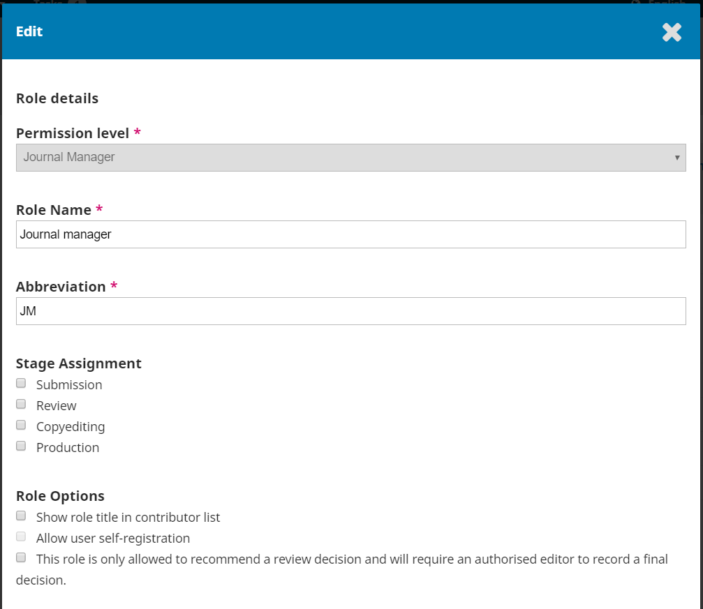

# Benutzer/innen und Rollen

Dieser Abschnitt enthält Informationen zum Zugriff auf alle Benutzer/innenkonten, die mit Ihrer Zeitschrift verbunden sind, sowie zur Verwaltung von Rollen und Berechtigungen.

## Benutzer/innen verwalten

Dieses englischsprachige Video der PKP School erklärt, wie man Benutzer/innen in OJS verwaltet. Weitere Videos dieser Reihe finden Sie auf dem [YouTube-Kanal von PKP](https://www.youtube.com/playlist?list=PLg358gdRUrDVTXpuGXiMgETgnIouWoWaY).



Zusätzlich zur Verwaltung der Zeitschriften-Website sind die Zeitschriftenverwalter/innen für alle Benutzer/innenkonten im System verantwortlich.

Wählen Sie **Benutzer/innen & Rollen** aus dem linken Menü, um die Benutzer/innenkonten anzusehen.

Um eine Liste mit allen registrierten Benutzer/innen als XML-Datei zu exportieren, gehen Sie bitte zu dem Menüpunkt **Werkzeuge**. Wenn Sie Ihre Benutzer/innendaten als Tabelle bevorzugen, können Sie unter **Statistiken > Benutzer/innen** eine CSV-Datei herunterladen.

### Benutzer/innen

Benutzer/innen werden nach dem Nachnamen sortiert angezeigt.

Sie können ein Benutzer/innenkonto bearbeiten, indem Sie den blauen Pfeil links von einem Eintrag anklicken.

Dies öffnet die Optionen E-Mail, Benutzer/in bearbeiten, Deaktivieren, Entfernen, Einloggen als, und Benutzer/in zusammenführen.

#### E-Mails an Benutzer/innen schreiben

Wenn Sie eine Nachricht zu einer bestimmten Einreichung an eine/n Benutzer/in schreiben möchten, können Sie die Diskussionsfunktion in der Einreichung verwenden. Dadurch bleibt die Kommunikation über eine Einreichung an einem Ort.

Um eine E-Mail an eine/n Benutzer/in zu schreiben, die nicht mit einer Einreichung zusammenhängt:

1. Als Zeitschriftenverwalter/in oder Redakteur/in navigieren Sie zu **Benutzer/innen & Rollen > Benutzer/innen**.
2. Finden Sie die Person, der Sie eine E-Mail senden möchten.
3. Klicken Sie auf den blauen Pfeil neben dem Namen des/der Benutzer/in, um die Links darunter anzuzeigen.
4. **E-Mail** anklicken. Es erscheint ein Pop-up-Fenster, in dem Sie Ihre Nachricht eingeben und versenden können.

##### Massenversand von E-Mails nach Rolle

In OJS 3.3 können Sie mehrere Benutzer/innen gleichzeitig mit dem Reiter "Benachrichtigen" anschreiben. Diese Funktion muss für jede Zeitschrift von dem/der Administrator/in unter **Einstellungen der Website > Massen-E-Mails** aktiviert werden. Administrator/innen Können unter **Zeitschriften auf dieser Website > Einstellungsassistent** auch einstellen, dass bestimmte Rollen einer Zeitschrift vom Erhalt von Massen-E-Mails ausgeschlossen sind.

Wenn dies für die Zeitschrift von den Administrator/innen aktiviert wurde, können E-Mails an alle Benutzer/innen einer oder mehrerer Rollen gesendet werden, z. B. alle Zeitschriftenverwalter/innen und/oder alle Rubrikredakteur/innen etc. Anweisungen zum Aktivieren dieser Funktion finden Sie unter [Site Administration > Site Settings](./site-administration#site-settings).

Wählen Sie im Reiter **Benachrichtigen** die Benutzer/innenrollen aus, denen Sie eine E-Mail senden möchten. Geben Sie Ihren Betreff und den Inhalt der E-Mail ein. Optional können Sie eine Kopie der E-Mail an Ihre eigene E-Mail-Adresse senden. Sie erhalten eine Statusbenachrichtigung, die angibt, dass die Nachricht erfolgreich gesendet wurde.

Diese E-Mail-Funktion kann verwendet werden, um Benutzer/innen, die aktiv an der Zeitschrift mitwirken, Handlungshinweise zu schicken. Sie könnten zum Beispiel eine E-Mail an alle Lektor/innen senden, um sie an interne Stilvorgaben der Zeitschrift (bestimmte Wörter, Schreibweise) zu erinnern. Vermeiden Sie, diese Funktion zur Benachrichtigung von einer großen Anzahl von Leser/innen zu verwenden; für diesen Zweck ist die Mitteilungen-Funktion besser geeignet. Mehr Details zu dieser Funktion finden Sie unter [Website Settings > Setup > Announcements](./settings-website#announcements).

Sollten mehrere Empfänger/innen Ihre Nachricht als Spam markieren, könnte dies dazu führen, dass alle E-Mails der Zeitschrift an den Spam-Ordner gesendet werden. Es muss darauf geachtet werden, diese Funktion nicht durch das Versenden exzessiver und unerwünschter E-Mails zu missbrauchen. Machen Sie sich mit Anti-Spam- und E-Mail-Datenschutzgesetzen in Ihrer Region vertraut, wie z. B. CASL in Kanada und die GDPR in der EU und Großbritannien. Beachten Sie, dass Benutzer/innen nicht die Option haben, diese E-Mails abzubestellen.

Es ist nicht möglich, CC- oder BCC-Adressen, außer Ihrer eigenen, oder Anhänge zu Nachrichten hinzuzufügen. Um Anhänge zu versenden, können Sie stattdessen die Diskussionsfunktion oder die Einreichungsbibliothek verwenden.

**Benutzer/in bearbeiten** erlaubt es Ihnen, Änderungen an diesem Benutzer/innenkonto vorzunehmen.

Mit **Deaktivieren** bleibt das Konto bestehen, aber die Benutzer/innen können nicht darauf zugreifen.

**Entfernen** hebt die Zuordnung der Benutzer/innen zu allen Rollen im Journal auf, aber das Benutzer/innenkonto bleibt im System. Die einzige Möglichkeit, ein Benutzer/innenkonto tatsächlich aus dem System zu entfernen, ist das **Zusammenführen** von Benutzer/innen (siehe unten).

Mit **Einloggen als** können Sie sich vorübergehend als diese/r Benutzer/in anmelden, um z. B. eine offene Aufgabe zu erledigen.

#### Benutzer/innen zusammenführen

Mit der Funktion Benutzer/in zusammenführen können Sie dieses Benutzer/innenkonto, einschließlich aller Einreichungen oder Zuweisungen, in ein anderes Benutzer/innenkonto in dem System einfügen.

> **Hinweis:** Dies ist die einzige Möglichkeit, ein Konto vollständig aus dem System zu löschen.

Sie können ein Dummy-Benutzer/innenkonto erstellen (z. B. Gelöschte Benutzer/innen) und unerwünschte Konten mit diesem zusammenführen.

Um Benutzer/innen zusammenzuführen:

1. Suchen Sie unter **Benutzer/innen & Rollen > Benutzer/innen** das Benutzer/innenkonto, das Sie entfernen möchten.
2. Klicken Sie auf den blauen Pfeil neben dem Benutzer/innennamen.
3. Klicken Sie in dem unten angezeigten Menü auf **Benutzer/in zusammenführen**.
4. Suchen Sie das Benutzer/innenkonto, in das Sie dieses Konto integrieren möchten (das Konto, das Sie beibehalten möchten).
5. Klicken Sie auf den blauen Pfeil neben dem Benutzer/innennamen.
6. Klicken Sie auf **Zusammenführen mit diesem Konto**.
7. Bestätigen Sie mit **OK**.

#### Benutzer/innen suchen

Wenn Sie eine große Anzahl von Benutzer/innen haben, werden Sie die Suchfunktion nutzen wollen.

Damit können Sie schnell Benutzer/innen anhand des Vornamens, Nachnamens oder der E-Mail-Adresse finden oder sich alle Benutzer/innen einer bestimmten Rolle anzeigen lassen.

**Hinweis:** Wenn Sie das Feld Suche leer lassen, eine Rolle auswählen und auf Suchen klicken, erhalten Sie eine Liste aller Benutzer/innen in dieser Rolle (z. B. alle Redakteur/innen).

#### Benutzer/in hinzufügen

Um neue Benutzer/innen zu Ihrer Zeitschrift hinzuzufügen, klicken Sie auf den Button **Benutzer/in hinzufügen**. Daraufhin öffnet sich ein neues Fenster mit einer Reihe von Feldern, die Sie ausfüllen müssen.

Sobald diese Felder ausgefüllt sind und Sie auf **Speichern** klicken, werden Sie aufgefordert, dem neuen Konto Rollen zuzuweisen. Klicken Sie auf den Button **Rolle hinzufügen**, um die Rollenauswahl zu öffnen.

Sobald Sie alle Rollen hinzugefügt haben, klicken Sie auf den Button **Speichern**.

#### Benutzer/innen aus einer anderen Zeitschrift registrieren

Bei Installationen mit mehreren Zeitschriften können Administrator/innen Benutzer/innen aus Zeitschrift A als Benutzer/innen für Zeitschrift B registrieren.

1. Melden Sie sich bei Zeitschrift B als Administrator/in an.
2. Gehen Sie zu **Benutzer/innen & Rollen > Benutzer/innen**.
3. Suchen Sie nach den Benutzer/innen aus Journal A, die Sie in Journal B registrieren möchten, und aktivieren Sie die Option **Nutzer/innen ohne Rolle in dieser Zeitschrift mit aufnehmen**.
4. Wenn die Benutzer/innen angezeigt werden, klicken Sie auf den blauen Pfeil neben dem Namen.
5. Klicken Sie auf **Benutzer/in bearbeiten**.
6. Scrollen Sie im angezeigten Fenster „Benutzer/in bearbeiten“ nach unten zu **Benutzer/innen-Rollen**.
7. Markieren Sie die Rolle, die die Benutzer/innen im Zeitschrift B haben sollen.
8. Klicken Sie am Ende des Formulars auf **Speichern**.

#### Wenn sich Benutzer/innen nicht anmelden können

Wenn sich Benutzer/innen nicht bei Ihrer Zeitschriftenseite anmelden können, sagen Sie ihnen, dass sie auf der Anmeldeseite **Passwort vergessen** auswählen sollen. Die Benutzer/innen erhalten per E-Mail einen Link zum Zurücksetzen des Passworts.

Wenn Benutzer/innen weitere Probleme haben, können Zeitschriftenverwalter/innen oder Redakteur/innen Folgendes tun:

1. Gehen Sie zu **Benutzer/innen & Rollen > Benutzer/innen**.
2. Suchen Sie das Konto, dessen Benutzer/in sich nicht anmelden kann, und klicken Sie auf den blauen Pfeil neben dem entsprechenden Namen.
3. Klicken Sie auf den Button **Benutzer/in bearbeiten**, der unten erscheint.
4. Geben Sie ein neues Passwort in das Feld **Passwort** ein und notieren Sie es sich.
5. Aktivieren Sie das Kontrollkästchen **Der/die Benutzer/in muss das Passwort beim nächsten Einloggen ändern**.
6. Klicken Sie am Ende des Formulars auf **Speichern**.
7. Senden Sie das neue Passwort an den/die Benutzer/in und weisen Sie darauf hin, dass dieses bei der nächsten Anmeldung zu nutzen ist.

Wenn sich die Benutzer/innen immer noch nicht anmelden können, wurde das Konto möglicherweise deaktiviert. Um es wieder zu aktivieren:

1. Gehen Sie zu **Benutzer/innen & Rollen > Benutzer/innen**.
2. Suchen Sie das Konto, dessen Benutzer/in sich nicht anmelden kann, und klicken Sie auf den blauen Pfeil neben dem Namen.
3. Suchen Sie unter dem Namen nach **Aktivieren** oder **Deaktivieren**. Wenn Deaktivieren angezeigt wird, ist das Konto bereits aktiviert. Wenn Aktivieren angezeigt wird, klicken Sie darauf, um das Konto wieder zu aktivieren.

## Berechtigungen und Rollen

Dieses englischsprachige Video der PKP School erklärt, wie Rollen in OJS verwaltet werden. Weitere Videos dieser Reihe finden Sie auf dem [PKP YouTube-Kanal](https://www.youtube.com/playlist?list=PLg358gdRUrDVTXpuGXiMgETgnIouWoWaY).



Der OJS-Workflow verwendet eine Vielzahl von Rollen, die Benutzer/innen anhand unterschiedlicher Berechtigungen und Verantwortlichkeiten ermöglichen, auf verschiedene Prozesse des Workflows zuzugreifen. Benutzer/innen muss dabei mindestens eine Rolle zugewiesen sein. Sie können aber auch mehrere Rollen gleichzeitig in einer Zeitschrift haben, d.h. sie können sowohl Zeitschriftenverwalter/in, Redakteur/in als auch Autor/in sein.

Jeder Rolle wird zunächst eine Berechtigungsstufe zugewiesen, die definiert, welche Zugriffsmöglichkeiten ein/e Benutzer/in auf eine Zeitschrift hat. Diese werden dann weiter angepasst, indem ein Rollenname angegeben und der Zugriff auf verschiedene Phasen des redaktionellen Workflows gewährt oder eingeschränkt wird.

Es gibt eine Reihe vordefinierter Rollen, die Sie in OJS verwenden und bearbeiten können. Diese werden im Folgenden aufgeführt. Kursiv gedruckte Rollen sind neu in OJS 3.

* Die **Administrator/innen** sind für die Verwaltung der gesamten OJS-Installation verantwortlich. Diese Berechtigungsstufe wird nicht in Benutzer/innenlisten oder Rolleneinstellungen angezeigt.
* Die **Zeitschriftenverwalter/innen** haben Zugriff auf den gesamten redaktionellen Workflow sowie auf alle anderen Zeitschrifteneinstellungen. Verfügbare vordefinierte Rollen sind: Zeitschriftenverwalter/in, Zeitschriftenredakteur/in (früher „Redakteur/in“ in OJS 2) und Produktionsredakteur/in.
* Die **Rubrikredakteur/innen** haben Zugriff auf den gesamten redaktionellen Workflow, können jedoch keine Änderungen an den Zeitschrifteneinstellungen vornehmen. Verfügbare vordefinierte Rollen sind: Rubrikredakteur/in und *Gastredakteur/in*.
* Die **Assistent/innen** können nur auf die Teile des redaktionellen Workflows zugreifen, die ihrer Rolle zugewiesen wurden. Verfügbare vordefinierte Rollen und ihre zugewiesenen redaktionellen Workflow-Phasen sind:
    * Einreichungs- und & Begutachtungsphase: *Finanzierungskoordinator/in*
    * Lektoratsphase: Lektor/in sowie *Marketing- und Vertriebskoordinator/in*
    * Produktionsphase: *Designer/in*, *Indizierer/in*, Layout-Leiter/in und Korrektor/in
* Die **Gutachter/innen** können nur auf die Gutachten von Einreichungen zugreifen, die Sie ihnen zur Überprüfung zuweisen.
* Die **Autor/innen** können neue Einreichungen vornehmen.
* Die **Leser/innen** können auf das Frontend zugreifen. Dies ist die Mindestberechtigungsstufe, die allen Benutzer/innen gewährt wird.
* Die **Abonnementverwalter/innen** können Site-Zugriffseinstellungen sowie Einstellungen für Abonnements bearbeiten. Dies ist eine neue Berechtigungsstufe in OJS 3 mit der vordefinierten Rolle *Abonnementverwalter/in*.

Vor- und benutzerdefinierte Rollen können über den Reiter **Rollen** überprüft werden.

Auf dieser Seite können Sie jede Rolle und die redaktionelle Phase sehen, auf die sie Zugriff hat. Ein gutes Beispiel hierfür ist die Rolle der Lektor/innen, die nur auf die Phase des Lektorats zugreifen können. Sie können nicht zur Begutachtungsphase wechseln, um zu sehen, was während des Peer-Review-Prozesses passiert ist. Weitere Informationen zu den verschiedenen redaktionellen Phasen finden Sie im Kapitel Redaktioneller Workflow.

Neben der Zuweisung und Bearbeitung vordefinierter Rollen können Administrator/innen und Zeitschriftenverwalter/innen auch neue Rollen erstellen oder vorhandene umbenennen.

### Rollen bearbeiten

Das Deaktivieren eines Kontrollkästchens entzieht Benutzer/innen mit dieser Rolle den Zugriff auf die Bearbeitungsphase.

Wenn Sie den blauen Pfeil links neben dem Rollennamen auswählen, wird der Button **Bearbeiten** angezeigt. Durch das Anklicken des Buttons öffnet sich das Bearbeitungsfenster.

**Berechtigungsstufe**: Diese gibt an, zu welchen Aktivitäten Benutzer/innen mit dieser Rolle in der jeweiligen Phase berechtigt sind.

Die Stufe Assistent/in kann mit anderen Benutzer/innen kommunizieren sowie Dateien hochladen und bearbeiten. In Zeitschriften, in denen es nur eine/n Assistent/in gibt, wird diesem/r eine neue Einreichung automatisch zugewiesen. Sobald einer zweiten Person diese Rolle zugewiesen wurde, wird dieses Vorgehen beendet.

**Rollenname**: Sie können dieses Feld verwenden, um jede Rolle umzubenennen.

**Abkürzung**: Jede Rolle muss eine einzigartige Abkürzung haben.

**Abschnittszuordnung**: Durch diese können Sie bestimmen, auf welche Phase Benutzer/innen mit dieser Rolle Zugriff haben.

**Rollen-Einstellungen**: Verwenden Sie diese Kontrollkästchen, um alle Benutzer/innen mit dieser Rolle in der Auflistung der Mitwirkenden anzuzeigen (z. B. in der Autor/innenliste). Ab OJS 3.2 kann den Rollen durch Aktivieren des Kontrollkästchens die Berechtigung zur Bearbeitung von Einreichungs-Metadaten zugewiesen werden.

Verwenden Sie die zweite Option, um festzulegen, ob Benutzer/innen sich für diese Rolle selbst registrieren können. Autor/innen und Gutachter/innen bieten sich für eine Selbstregistrierung an. Sie sollten Benutzer/innen keinesfalls erlauben, sich selbst als Zeitschriftenverwalter/in oder Redakteur/in zu registrieren!

Die dritte Option ist für Gutacher/innen oder möglicherweise Rubrikredakteur/innen nützlich, abhängig von Ihrem bevorzugten Workflow.

### Neue Rollen anlegen

Verwenden Sie den _Neue Rolle anlegen_-Button, um ein Bearbeitungsfenster zu öffnen, in welchem Sie eine neue Rolle für Ihre Zeitschrift erstellen können, einschließlich der Festlegung, auf welche Phasen die Rolle zugreifen kann und welche Berechtigungen sie haben soll.

## Zugriffsoptionen

Dieses englischsprachige Video der PKP School erklärt, wie Zugriffsoptionen in OJS verwaltet werden. Weitere Videos dieser Reihe finden Sie auf dem [YouTube-Kanal von PKP](https://www.youtube.com/playlist?list=PLg358gdRUrDVTXpuGXiMgETgnIouWoWaY).



Auf dieser Seite können Sie bestimmen, wie Leser/innen auf Ihre Zeitschrift zugreifen können.

**Zusätzliche Beschränkungen für Seiten- und Artikelaufrufe**: Wählen Sie aus diesen Optionen, um den Zugriff zu beschränken.

> Beachten Sie, dass eine verpflichtende Registrierung zum Lesen von Open Access-Inhalten zwar das Tracking erleichtern kann, es kann aber ebenso manche Personen davon abhalten, die Inhalte zu lesen. Diese Option sollte mit Vorsicht verwendet werden.

**Registrierung von Benutzer/innen **: Mit dieser Option können Sie festlegen, ob Benutzer/innen eigene Konten erstellen können oder von einem/r Zeitschriftenverwalter/in hinzugefügt werden müssen.

> Es ist ratsam, Benutzer/innen zu erlauben, sich selbst zu registrieren, aber nur für die Rollen Autor/in, Gutachter/in oder Leser/in.
