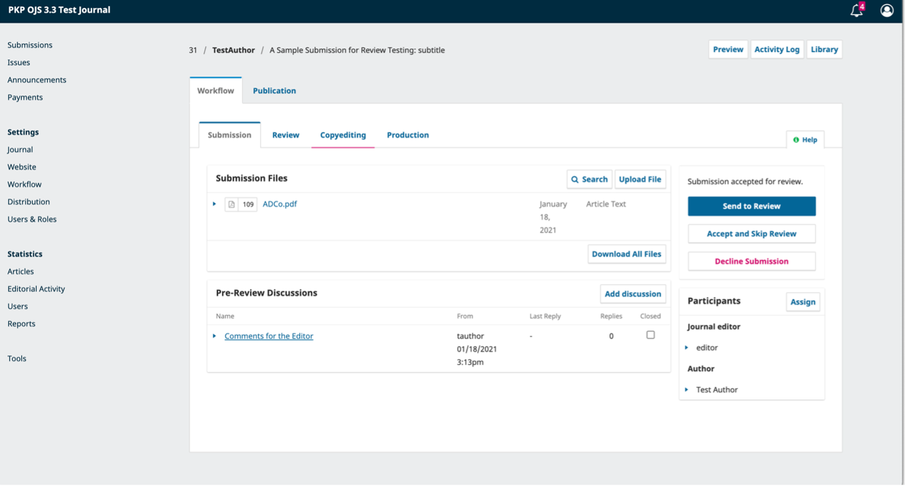
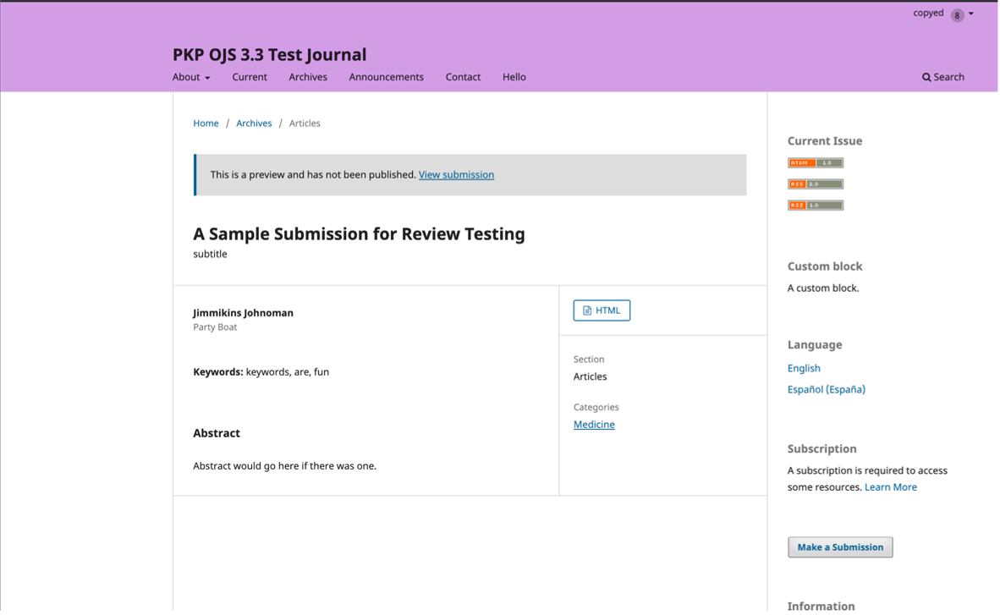

# Fluxo de Trabalho Editorial

Neste capítulo, você acompanhará todo o fluxo de trabalho de uma submissão, desde a primeira submissão até a publicação final.



Este vídeo da Escola do PKP fornece uma visão geral do fluxo de trabalho editorial em OJS 3.3. Para assistir a outros vídeos desta série, visite o [canal do PKP no YouTube](https://www.youtube.com/playlist?list=PLg358gdRUrDUKJbWtr4bgy133_jwoiqoF).

O fluxo de trabalho é dividido em 4 estágios:

**Submissão**: Nesta etapa, estão localizadas as novas submissões enquanto esperam pela atribuição aos Editores de Seção, que verificarão se têm condições de passar para o estágio de Avaliação.

Algumas submissões são claramente inadequadas e nunca passam desse estágio.



Este vídeo da Escola do PKP explica os passos que o Editor dá para atribuir uma nova submissão a um Editor de Seção. Para assistir a outros vídeos desta série, visite o [canal do PKP no YouTube](https://www.youtube.com/playlist?list=PLg358gdRUrDUKJbWtr4bgy133_jwoiqoF).

**Avaliação**: etapa em que ocorre a avaliação por pares, bem como quaisquer revisões exigidas pelo autor.

Algumas submissões não são aprovadas na avaliação e não passam desse estágio. Aquelas que são aceitas passam para o próximo estágio.

**Edição de texto**: Nesse estágio, os artigos aceitos são aprimorados pelo trabalho de um revisor. Os autores podem ter a oportunidade de revisar as edições.

**Editoração**: após a conclusão e aprovação das edições de texto, a submissão segue para essa fase. Na editoração, os textos editados são convertidos em provas (por exemplo, HTML, XML, PDF, etc.). Novamente, o autor tem a oportunidade de revisar as provas. Assim que todos estiverem satisfeitos, a submissão é agendada para publicação em uma edição futura.



Este vídeo da Escola do PKP explica o estágio de produção. Para assistir a outros vídeos desta série, visite o [canal do PKP no YouTube](https://www.youtube.com/playlist?list=PLg358gdRUrDUKJbWtr4bgy133_jwoiqoF).

## Tarefas

Suas tarefas estão disponíveis no menu superior esquerdo do seu painel. Observe o número “1” na imagem abaixo. Isso indica que há, no momento, uma tarefa em sua lista.

As tarefas fornecem uma visão rápida dos itens que precisam de sua atenção. Entradas em negrito não foram lidas e entradas sem negrito foram lidas.

Use a caixa de seleção para marcar tarefas para exclusão (o link está disponível na parte inferior da lista).

## Notificações de submissão

Quando um autor faz uma nova submissão ao seu periódico, o autor e todos os colaboradores receberão um e-mail reconhecendo a sua submissão e um editor receberá automaticamente uma notificação da nova submissão. Em alguns casos, um editor será automaticamente atribuído à submissão. Qual(is) editor(es) recebe(m) a notificação ou é automaticamente atribuído dependerá de como você configurou seu periódco (veja [Editar uma seção](./journal-setup#edit-a-section)).

* Se houver apenas um usuário atribuído a um papel de editor ou gerente de periódico, esse usuário será atribuído e notificado automaticamente.
* Se um ou mais editores de seção forem atribuídos à [seção](https://docs.pkp.sfu.ca/learning-ojs/en/journal-setup#sections) a qual a submissão foi feita, eles serão automaticamente atribuídos a esta submissão e notificados.
* Se um ou mais editores de seção são atribuídos a uma [categoria](https://docs.pkp.sfu.ca/learning-ojs/en/journal-setup#categories) que a submissão foi feita, eles serão automaticamente atribuídos a esta submissão e notificados.

Você também pode configurar o OJS para que uma cópia do e-mail de notificação seja enviada ao contato principal do periódico, definido nas Configurações do periódico, ou para outro endereço.

Para habilitar cópias do e-mail de confirmação de submissão a ser enviado para o contato primário ou outro endereço:

1. No painel de controle, vá a Configurações> Fluxo de trabalho> submissões;
2. Role para baixo até Notificação de submissão do autor;
3. Marque a caixa ao lado de “Enviar uma cópia para o contato principal, identificado nas Configurações da revista”, se desejar que uma cópia seja enviada para o e-mail de contato principal e/ou;
4. Digite o e-mail para o qual deseja que uma cópia seja enviada no campo de texto.

Se você quiser desativar os e-mails de Agradecimento pela Submissão, pode fazê-lo, desabilitando o modelo de e-mail na lista de modelos de e-mail. Para saber mais sobre como desabilitar e habilitar modelos de email, consulte *Desabilitar modelos de email*, no [capítulo Configurações de fluxo de trabalho](https://github.com/pkp/pkp-docs/blob/main/learning-ojs/en/settings-workflow).

Os usuários também podem alterar suas configurações de notificação individuais em seu próprio perfil, acessando Perfil> Notificações.

## Painel de submissões

Ao fazer login em seu Painel de Controle, você pode encontrar submissões ativas de suas tarefas ou de uma das filas (Fila, Submissões Não Designadas, Ativos e Arquivos). O contador oferece uma visão geral de quantos itens, no total, existem em cada fila.

### Minha Fila

**Minhas Submissões Designadas**: Esse painel inclui submissões adicionadas a seções onde você é um editor de seção ou as suas próprias submissões, se você também for um autor desse periódico.

A ferramenta **Buscar**, para cada fila, pode, às vezes, ser útil para rastrear as submissões.

A ferramenta **Filtro** permite limitar sua navegação a um status específico, a fim de se realizar uma pesquisa mais rápida. Dependendo de seu papel, as funções editoriais serão capazes de filtrar:

- **Status**: selecione entre *incompleto*, *atrasado* e *inativo por 30 dias*

- **Estágios**: selecione entre _submissão_, _avaliação_, _edição de texto_ e _editoração_

- __Seções__: essa opção só está disponível se houver mais de 5 seções. Após começar a inserir o texto, o filtro irá sugerir ações automaticamente. Por exemplo, filtre por _artigos_ ou _resenhas_

- **Editor(es) atribuído(s)**: apenas os gerentes de periódicos têm essas opções de filtro. Assim como as seções, esta é uma caixa de texto que irá sugerir automaticamente o nome de um Editor de Seção, Editor de Revista ou Editor Convidado quando você começar a digitar o nome do editor e, em seguida, exibir todos os artigos atribuídos ao editor.

- __Edição atribuída__: apenas gerentes de periódicos podem filtrar por fascículos não publicados, mas editores e assistentes poderão filtrar por fascículos publicados. Esse campo diferencia maiúsculas de minúsculas e requer correspondência exata. Para obter melhores resultados, pesquise por ano ou título, em vez de volume ou número. Esse filtro é usado principalmente se a atribuição de uma submissão a uma edição for feita em uma fase inicial do processo editorial.

Alguns filtros permitem várias seleções. Os usuários podem filtrar por mais de um editor, uma seção ou edição. Os filtros são aplicados com condições OU, portanto, quando um usuário selecionar filtrar pelo Editor A e Editor B, todas as submissões que são atribuídas ao editor A ou ao editor B serão retornadas.

Ao usar vários filtros, a condição E será aplicada entre os filtros. Por exemplo, ao filtrar por Estágio de avaliação E Editor A, apenas as submissões atribuídas ao Editor A no estágio de avaliação serão retornadas.

Observe que você pode usar as setas azuis à direita de cada submissão para revelar mais detalhes, incluindo quantas avaliações estão pendentes, novas discussões e muito mais. Ele também revela botões para levá-lo ao registro da submissão, visualizar o log de atividades e anotações e excluir a submissão.

### Submissões não designadas

Esse painel inclui submissões adicionadas a seções sem editores de seção.

No exemplo acima, não há submissões não designadas, então o painel está vazio.

### Ativos

Essa seção inclui uma lista de todas as submissões, sem ser organizada em filas.

### Arquivos

Essa seção inclui uma lista de todas as submissões rejeitadas ou já publicadas pela revista. As submissões rejeitadas ​​podem ser excluídas da lista de submissões arquivadas. A exclusão de uma submissão rejeitada removerá completamente a submissão e todos os arquivos de submissão de sua revista.

### Submissão de demonstração

Para esta demonstração, estamos procurando a submissão de Williamson e Serletis, intitulada *Os Agentes Oficiais de Conhecimento e Educação de Adultos*. Ela pode ser encontrada no topo de **Fila (Minhas Submissões Designadas)**, bem como em **Ativos**.

Após encontrar a submissão, você pode usar o botão visualizar, para ver a submissão, ou usar a seta azul, para revelar opções e ver se há alguma discussão aberta (não há nenhuma neste caso), o número de composições finais criadas e acesso ao registro de atividades e anotações.

O **Log de atividades e anotações** exibe o histórico da submissão.

Use a guia Notas para também visualizar ou adicionar quaisquer notas editoriais.

### Registro de submissão

Para ver a submissão com mais detalhes, selecione o botão ***Ver Submissão**. Isso levará você ao registro de submissão.

A partir daqui, você pode ver:

**Arquivos da submissão**: esse painel lista os arquivos que foram enviados. Na visualização acima, há apenas um arquivo, mas vários arquivos podem ser enviados. Os arquivos de submissão agora manterão os nomes originais quando baixados.

Para periódicos que usam avaliação anônima, os dados do autor e do avaliador (caso eles devam fazer upload de qualquer documento) ainda são removidos. Um exemplo de estrutura de nome de arquivo para arquivos baixados por avaliadores será `ojs-review-assignment-1-article-text-8.docx`. A numeração corresponde ao número do manuscrito da tarefa.

**Discussões da pré-avaliação** : Esse painel permite que o editor se comunique com o autor ou com outras pessoas da equipe editorial. Para exemplificar, o editor pode pedir ao autor algumas informações adicionais ou pedir a um editor de seção que se responsabilize por essa submissão.

**Botões de ação**: incluem Enviar para Avaliação, Aceitar e enviar para Edição de Texto, e Rejeitar submissão.

> Observação: se você não visualizar esses botões, provavelmente ainda não atribuiu a submissão a um editor.

**Status da submissão**: uma vez que um editor registrou uma decisão em um estágio do fluxo de trabalho, a partir do OJS 3.2, a decisão registrada aparecerá no lugar dos botões de decisão. Os editores ainda terão a capacidade de alterar a decisão registrada clicando em 'Alterar decisão', isso habilitará as 3 opções mais uma vez.

 *A captura de tela acima mostra o botão de decisão para o MS# 425 antes de uma decisão ser registrada. A captura de tela abaixo mostra a notificação da decisão registrada.*

**Participantes**: nesse painel, você verá a lista de participantes envolvidos na submissão, incluindo o editor, editores de seção e autor. Outros nomes (editores de texto, editores de layout, etc.) aparecerão aqui à medida que forem adicionados nas etapas subsequentes.

**Biblioteca da Submissão**: a Biblioteca da Submissão é uma área de armazenamento geral de documentos, que podem incluir formulários de conflito de interesses, formulários de aprovação de composição final, etc. Um usuário pode carregar o formulário preenchido para seu manuscrito em sua Biblioteca da Submissão. Um usuário pode enviar o formulário preenchido para seu manuscrito na sua Biblioteca de Submissões. Os formulários carregados também estarão disponíveis para outros participantes (com exceção dos avaliadores) atribuídos ao longo do fluxo de trabalho editorial ou de produção, para editar ou recarregar novas versões.

**Biblioteca da revista**: os usuários, em todo o fluxo de trabalho editorial, poderão acessar todos os arquivos na Biblioteca da revista (consulte [o capítulo Configurações do fluxo de trabalho](https://github.com/pkp/pkp-docs/blob/main/learning-ojs/en/settings-workflow.md)), disponibilizados pelo Gerente da revista ou Editor, abrindo a Biblioteca da Submissão e clicando em “Ver Biblioteca da Revista”.

**Pré-visualização**: mostra como a submissão ficará quando publicada, com seus metadados e arquivos de composição final atuais, clicando em Visualizar.

**Publicação (Metadados)**: painel onde você pode visualizar e revisar os metadados da submissão. No OJS 3.2 e posterior, os usuários podem receber permissão para revisar determinados metadados de submissão em qualquer estágio do fluxo de trabalho.

### Concessão de permissões de autor

A partir do OJS 3.2, os editores podem conceder acesso para permitir que os autores façam alterações nos metadados. Existem duas maneiras pelas quais os editores podem conceder esse tipo de acesso.

**Permissão global**: concederá a todos os usuários a permissão de 'autor' da função para fazer alterações nos metadados.

Para habilitar essa função, vá a Usuários & Papéis> Papéis. Em seguida, clique na seta azul ao lado de 'Autor' e clique em editar.

Em Opções de papéis, habilite “Permitir edição de metadados da submissão”, depois, clique em OK.

**Permissão limitada** - concederá aos autores registrados (normalmente um único autor) permissão para fazer alterações apenas em determinados estágios do fluxo de trabalho editorial.

Para permitir que um autor altere os metadados em um estágio específico do fluxo de trabalho, clique no estágio do fluxo de trabalho (isto é, Submissão, Avaliação, Edição de Texto ou Editoração).

Na lista de participantes, clique na seta ao lado do nome do autor e depois em Editar.

Em Permissões, ative 'Permitir que esta pessoa edite os detalhes da publicação' e, na sequência, em OK.

Assim que o autor tiver acesso às edições feitas, ele poderá fazer alterações nas seguintes seções na guia Publicação: Título e Resumo, Colaboradores e Metadados.

### Designando a Submissão

Dependendo de [como você configurou suas seções](./journal-setup#edit-a-section), alguns novos envios podem vir em não atribuídos. Se for esse o caso, a próxima etapa é designar um editor ou editor de seção. Para fazer isso, selecione o link _Designar_, no painel **Participantes**.

Você terá a opção de localizar um usuário por papel, escolher um indivíduo e enviar uma mensagem solicitando sua assistência.

> Observação: se você não tiver certeza dos nomes dos editores de seção, basta escolher esse papel no menu suspenso e clicar no botão Pesquisar. Todos os Editores de Seção serão exibidos e disponíveis para seleção.

Clique no botão **OK** para fazer a atribuição e enviar a mensagem.

> Observe a nova discussão de pré-avaliação que foi criada automaticamente como parte da tarefa.

Agora, você pode ver que o Editor de Seção está listado em Participantes e os botões de ação estão disponíveis:

**Enviar para avaliação**: avança a submissão para a próxima etapa.

**Aceitar e enviar para Edição de texto**: ignora o estágio de avaliação e move a submissão diretamente para a edição de texto.

**Rejeitar Submissão**: Rejeita a submissão antes de passar pelo processo de avaliação, a submissão seria então arquivada. A submissão seria então arquivada. No OJS 3.3, agora existe a opção de reverter uma decisão de Rejeitar Submissão na fase de Submissão e Avaliação. Isso pode ser feito clicando em **Alterar decisão** e, em seguida, em **Reverter recusa**. Depois que uma decisão declinada for revertida, a submissão é restaurada ao estágio prévio e a rodada de revisão torna-se ativa.

Embora, no exemplo que demos, o editor tenha designado um editor de seção, também seria possível que o editor se designasse para a submissão.

Assim que o editor selecionar uma ação, o status da submissão será alterado e os botões de ação serão desativados.

### Editor de seção

Agora que o Editor de Seção foi designado, ele pode fazer o login e visualizar seu painel. A submissão pode ser encontrada no topo da do painel Fila (Minhas Submissões Designadas).

Clicar em Visualizar abre o registro de submissão completo.

#### Aceitando a designação

Não é obrigatório, mas o Editor de Seção pode responder à Discussão da Pré-avaliação para informar ao editor que dará continuidade ao trabalho.

#### Comunicando-se com o autor

Se o Editor de Seção tiver alguma pergunta ao autor, pode usar as Discussões de pré-avaliação.

#### Enviando para avaliação

Uma vez que o Editor de Seção esteja satisfeito com a submissão apropriada ao periódico, ele pode selecionar o botão **Enviar para Avaliação** para mover a submissão ao próximo estágio.

Mantenha os arquivos que serão revisados ​​desmarcados.

## Comentário



Este vídeo da PKP School explica as etapas que o Editor de Seção leva para atribuir avaliadiores para o envio. Para assistir a outros vídeos desta série, visite o [canal do PKP no YouTube](https://www.youtube.com/playlist?list=PLg358gdRUrDUKJbWtr4bgy133_jwoiqoF).

Quando a submissão entra no Estágio de Avaliação, uma notificação indica que os Avaliadores precisam ser atribuídos.

> Nota: Na captura de tela acima, vemos a visualização do Editor de Seção. Observe os botões de ação limitados (apenas Fazer recomendação está disponível). Se estivéssemos logados como Editor, veríamos mais botões de ação (Enviar para avaliação, Aceitar submissão, Rejeitar submissão).

Essa ação abre uma nova janela, onde os avaliadores são listados e podem ser selecionados um de cada vez.

Essa ação abrirá uma janela para você selecionar quais arquivos (fornecidos pelo autor) serão incluídos na nova rodada de avaliação.

Clicar na seta azul revela mais informações sobre seu histórico de avaliação, incluindo quantas avaliações ativas estão atualmente atribuídas, quantas avaliações estão concluídas ou foram recusadas, etc. Se o usuário adicionou uma biografia ou avaliação de interesses, essas informações serão exibidas aqui.

Além disso, o Editor da Revista pode adicionar uma Nota Editorial sobre o avaliador em seu perfil por meio de Usuários & Papéis> Usuários. Essa nota aparece nos detalhes do avaliador na tela Adicionar avaliador, mas não estará visível para o avaliador ou para o público.

Nos releases 3.0 a 3.1.0 do OJS, você não pode designar um usuário para revisar uma submissão, se ele também for um editor da submissão.  Se você fizer isso, o editor não poderá mais acessar a submissão após enviar sua avaliação, a fim de manter os princípios da avaliação por pares anônima. No entanto, a partir do OJS 3.1.1, você pode designar um usuário para revisar uma submissão, se ele também for um editor da submissão.

Na parte inferior desse formulário, você verá opções para:

**Selecionar avaliador**: use para confirmar sua seleção depois de escolher um avaliador da lista.

**Criar novo avaliador**: se nenhum dos avaliadores for adequado, você pode usar esse botão para criar um novo avaliador. Essa é uma nova conta no sistema.

**Designar usuário existente**: se nenhum dos avaliadores for adequado, você pode inscrever um usuário existente como avaliador.

Para esta demonstração, escolhemos Adela como nosso avaliador e clicamos no botão **Selecionar avaliador**.

Essa ação abrirá uma nova janela.

Você pode editar qualquer texto padrão.

Se estiver usando um método de Avaliação Anônima, certifique-se de que os arquivos enviados ao Avaliador não tenham nenhuma informação de identificação sobre o Autor. Instruções adicionais para isto são fornecidas na [Compreensão de Diferentes Tipos de Revisão](#understanding-different-types-of-review) e [Removendo seções de Identificação de Informação](#removing-identifying-information).

Mais adiante, no formulário, é possível ver os detalhes adicionais que são enviados ao Avaliador, incluindo título, resumo, datas importantes e um link para os arquivos a serem avaliados.

É uma ação padrão, os avaliadores receberem uma caixa de texto estendida para digitar seus comentários. No entanto, o Editor Gerente pode criar formulários de avaliação em [Configurações> Fluxo de trabalho> Avaliação](https://github.com/pkp/pkp-docs/blob/main/learning-ojs/en/settings-workflow#review) para fazer perguntas mais específicas. Se desejar que o avaliador preencha um formulário de avaliação, selecione-o em **Formulário de avaliação**.

Em seguida, clique no botão **Adicionar avaliador**, para enviar a mensagem e atribuir o avaliador.

Voltando ao estágio de edição de texto, é possível ver que a mensagem foi postada.

Você pode fazer alterações adicionais, alternando a seta azul ao lado do nome do avaliador.

**Detalhes da avaliação**: fornece detalhes sobre a avaliação.

**E-mail ao avaliador**: Permite enviar uma mensagem ao avaliador.

**Editar**: Permite alterar as datas de avaliação e arquivos.

**Cancelar avaliador**: permite cancelar a atribuição do avaliador.

**Dispensar avaliador**: a partir do OJS 3.3, você pode cancelar uma solicitação de avaliação. Isso pode ser necessário quando um avaliador não respondeu a uma solicitação de avaliação ou aceitou fazer uma avaliação, mas nunca a entregou.

Cancelar uma solicitação de avaliação permitirá que você envie um modelo de e-mail para o avaliador. A solicitação aparecerá na lista de avaliadores do editor como “cancelada”.

A avaliação cancelada será registrada nas estatísticas do avaliador, que você pode ver ao selecionar um avaliador.

**Discussão da avaliação** : a discussão da avaliação é outra maneira de entrar em contato com um avaliador. Em uma discussão de avaliação, você tem a opção de anexar arquivos.

Para iniciar uma discussão, clique em “Adicionar comentário”.

Em seguida, selecione o(s) avaliador(es) com quem gostaria de iniciar uma discussão.

**Histórico**: fornece um breve histórico da avaliação.

Nesse ponto, é possível adicionar avaliadores adicionais e, em seguida, aguardar a chegada de suas recomendações.

### Compreendendo diferentes tipos de revisão

O OJS foi projetado para acomodar diferentes tipos de avaliações e possui etapas integradas para garantir o anonimato.

Todas as informações ficarão visíveis para os gerentes e editores da revista, independentemente do tipo de avaliação selecionada. O tipo de avaliação será selecionado automaticamente com base no que foi configurado em *Configurações > Fluxo de trabalho > Avaliação*. Os editores podem alterar o tipo de avaliação ao enviar a solicitação de avaliação. Editores/Editores de Seção devem selecionar o tipo de avaliação ao enviar a solicitação de avaliação, dentre as seguintes opções:

* Avaliador Anônimo/Autor Anônimo
* Avaliador Anônimo/Autor Divulgado
* Abrir.

**Avaliador Anônimo/Autor Anônimo**: a identidade do autor e do avaliador é mantida oculta.

O autor ou editor deve garantir que os metadados do arquivo do manuscrito sejam removidos na Duplo cega  (avaliador Anônimo/Autor Anônimo). Consulte [Removendo informações de identificação](https://github.com/pkp/pkp-docs/blob/main/learning-ojs/en/editorial-workflow.md#removing-identifying-information) para obter mais informações.

*Avaliador*: o avaliador não poderá ver o(s) autor(es) na fila de seu avaliador se o editor tiver selecionado Duplo Cega (Avaliador Anônimo/Autor Anônimo). Todas as informações de identificação nos metadados dos detalhes da submissão são retiradas automaticamente pelo sistema, conforme exemplo a seguir.

No final de uma avaliação, se um avaliador decidir fazer upload de um arquivo de avaliação, ele deve remover todas as informações de identificação antes de carregá-lo no sistema. Consulte [Removendo informações de identificação](https://github.com/pkp/pkp-docs/blob/main/learning-ojs/en/editorial-workflow.md#removing-identifying-information) para obter mais informações.

*Autor*: nenhuma informação de identificação sobre o avaliador ficará visível para o autor na visualização do manuscrito.

*Decisão Editorial*: o e-mail de decisão enviado ao(s) autor(es) ao final da avaliação terá títulos genéricos dos avaliadores.

**Avaliador Anônimo/Autor Divulgado**: a identidade do avaliador é mantida no anonimato para o(s) autor(es). Os avaliadores podem ver os detalhes do autor.

*Avaliador*: o avaliador pode ver todos os metadados inseridos pelo autor, clicando em *Exibir todos os detalhes da submissão* na guia de solicitação do manuscrito. O nome dos autores também aparecerá na fila do avaliador.

*Autor*: nenhuma informação de identificação sobre o avaliador ficará visível para o autor na visualização do manuscrito.

*Decisão Editorial*: o e-mail de decisão enviado ao(s) autor(es) ao final da avaliação terá títulos genéricos dos avaliadores.

**Revisão Aberta (Avaliador Anônimo/Autor Anônimo)**: As identidades tanto do autor quanto do avaliador são conhecidas. Embora seja relativamente novo e menos comum na publicação acadêmica, existem [várias razões convincentes](https://digitalpublishingworkshop.com/journal-publishing/new-perspectives-on-peer-review/#how) para que os periódicos optem por um processo de revisão aberto. Aconselhamos os periódicos a tornarem as suas políticas de revisão claras e transparentes; alguns exemplos dessas políticas:

- [Na biblioteca com o Lead Pipe: um acesso aberto, abrir um periódico revisado por pares](https://www.inthelibrarywiththeleadpipe.org/about/)
- [Intersectional Apocalypse](https://journals.lib.sfu.ca/index.php/ifj/reviewpolicy)

*Avaliador*: O avaliador poderá ver o nome do autor se clicar em "Ver Todos os Detalhes da Submissão" Não precisam de aceitar o pedido de revisão, a fim de visualizar essa informação. O avaliador pode tomar sua decisão sobre se quer revisar um manuscrito, com conhecimento sobre a identidade do autor.

*Autor*: O autor também pode ver o nome do avaliador, mas apenas após o avaliador ter aceitado a solicitação. O autor não pode ver o(s) avaliador potencial atribuído.

*Comunicações*: Como a revisão é aberta, autores e avaliadores podem se comunicar usando o recurso de discussão. Mesmo que não incluam o editor como um "participante" da discussão, os editores sempre podem ver as discussões.

O autor, avaliador e editor podem ver as mensagens entre o avaliador e o autor.

*Editor*: Como outros tipos de avaliações, os editores podem ver todas as atividades.  Além disso, o avaliador tem a opção de deixar as mensagens exclusivamente para o editor.  Os autores não podem ver notas enviadas em "Apenas para editor".

Uma vez que as identidades não são secretas, não é necessário seguir passos sob [removendo informações](#removing-identifying-information).

### Removendo Informações de Identificação

Embora o OJS tenha várias funções integradas para revisões anônimas, etapas adicionais podem precisar ser executadas fora da plataforma para garantir o Avaliador Anônimo/Autor Anônimo. Um arquivo de submissão pode conter informações que revelem a identidade dos autores nas propriedades do documento.

Os autores também podem incluir seu nome no artigo, notas de rodapé e referências. Nesse caso, o editor terá que remover tais informações antes de enviar para avaliação. Alternativamente, os autores podem ser solicitados a redigir seus nomes do arquivo de submissão, com “Autor” e ano usados ​​nas referências e notas de rodapé ao invés do nome dos autores, título do artigo, etc., antes da submissão.

#### Microsoft Word para Windows

1. Vá em _Arquivo_
2. Selecione _Informações_
3. Clique em _Verificar Problemas_
4. Clique em _Inspecionar Documento_
5. Na caixa de diálogo _Inspetor de Documento_, marque as caixas de seleção para escolher os tipos de conteúdo oculto que deseja inspecionar
6. Clique em *Remover tudo*
7. Clique em *Fechar*
8. Salve o documento

#### Microsoft Word para MacOS

1. Vá a *Ferramentas*
2. Clique em *Proteger Documento*
3. Selecione *Remover informações pessoais deste arquivo ao salvar*
4. Clique em *OK* e salve o arquivo

### Reenviando o documento

Os gerentes e editores de periódicos podem reenviar o documento anônimo nos arquivos para avaliação, clicando em **Enviar/Selecionar** arquivos, na caixa *Arquivos para avaliação*.

Clique em **Enviar arquivo para avaliação**.

Identifique o componente do artigo e carregue o arquivo.

Detalhes da avaliação. Pode ser útil renomear o arquivo para o momento do novo upload. O arquivo também pode ser renomeado ao clicar na seta à esquerda do nome do arquivo.

Clique em Concluir e selecione o arquivo que deseja usar para a avaliação.

O(s) arquivo(s) aparecerá(ão) no upload inicial. Ao enviar a solicitação de avaliação, certifique-se de que o manuscrito original não esteja selecionado em “Arquivos a serem revisados”.

Clique em **OK**.

### Solicitar revisões



Este vídeo da Escola do PKP explica as etapas que o Editor de Seção e o autor tomam assim que as análises estiverem completas. Para assistir a outros vídeos desta série, visite o [canal do PKP no YouTube](https://www.youtube.com/playlist?list=PLg358gdRUrDUKJbWtr4bgy133_jwoiqoF).

Assim que os avaliadores concluírem seu trabalho, o Editor de Seção pode ver os resultados em seu painel. Nesse espaço, eles verão notificações de que novos comentários foram enviados e se todos os comentários foram enviados.

Use o link *Ler avaliação*, no painel de avaliadores, para ler os comentários dos avaliadores, incluindo aqueles para o autor e o editor, bem como apenas para o editor.

Selecione o link *Confirmar* na parte inferior da tela.

No painel de avaliadores, será possível ver o link *Agradecer ao avaliador*. Escolha-o para agradecer ao avaliador.

Com base nas recomendações do avaliador, você pode usar os botões de ação para tomar uma decisão.

### Tomando a decisão

Com base nas recomendações do editor, você pode usar os botões de ação para tomar uma decisão.

As opções incluem:

**Aceitar submissão**: significa que a submissão foi aceita sem revisões e pode prosseguir para o estágio de Edição de Texto.

Use o botão **Adicionar mensagem** para responder, seja solicitando uma revisão adicional seja informando ao autor que a submissão está pronta para avançar à próxima etapa.

**Rejeitar submissão** : quer dizer que a submissão não foi aprovada na avaliação por pares e não é adequada a análise posterior. A submissão seria então transferida para os Arquivos. Apenas as submissões recusadas ​​nos Arquivos podem ser excluídas. No OJS 3.3, agora existe a opção de reverter uma decisão de recusa na fase de submissão e avaliação. Isso pode ser feito clicando em **Alterar decisão** e, em seguida, em **Reverter Decisão**. Depois que uma decisão de rejeitar é revertida, a submissão é restaurada ao estágio anterior e a rodada de avaliação se ativa.

### Solicitar Revisões

Nesta demonstração, solicitaremos que o autor faça algumas revisões menores antes da aceitação.

Para fazer isso, selecione o botão **Solicitar Modificações**. Essa ação resulta em uma nova janela de mensagem.

Você pode modificar qualquer texto antes de enviar a mensagem.

Use o botão **Adicionar comentários** para importar os comentários do avaliador dos campos Editor e Autor. Comentários no campo Somente para o Editor não serão exibidos.

Se houver algum anexo, como um arquivo marcado criado por um avaliador, é possível anexá-lo aqui (desde que seja anônimo). No OJS 3.1.2 e posterior, você também pode fazer upload de um novo arquivo e adicioná-lo como um anexo.

Clique no botão **Gravar Decisão Editorial** para enviar a mensagem.

Agora você deve esperar que o Autor responda com as suas revisões.

### Autor responde

Assim que o Autor fizer as revisões, você deverá receber uma mensagem (por e-mail e no painel Discussão da avaliação).

Você também verá o arquivo revisado no painel Revisões.

Neste ponto, você pode baixar o arquivo revisado, verificar se ele está pronto e se comunicar com o autor usando o painel de discussões de revisão.

No caso do exemplo que propomos, informaremos ao Autor que estamos aceitando as revisões. Para fazer isso, clique no link do título da discussão, abrindo, desse modo, a caixa de discussão. Isso vai abrir a caixa de discussão.

Use o botão **Adicionar mensagem** para responder, seja solicitando revisão adicional ou informando ao autor que a submissão está pronta para passar para a próxima etapa.

### Rodada Adicional de Avaliação

Se desejar submeter o artigo revisado a outra rodada de avaliação, você pode iniciar uma segunda (ou terceira ou subsequente) rodada de avaliação, após o recebimento das revisões do autor.

É melhor iniciar uma nova rodada de avaliação **depois** que o autor carrega os arquivos revisados ​​na rodada anterior. Criar uma nova rodada de avaliação antes que o autor carregue seus arquivos pode criar alguma confusão, pois o painel deles (e o seu) será padronizado para a nova rodada. O autor poderá, no entanto, voltar à Rodada 1 para fazer o upload de seus arquivos. Isso também resultará em ter que baixar o arquivo carregado da Rodada 1 e carregá-lo na Rodada 2.

Uma nova rodada **não** deve ser iniciada se você estiver enfrentando algum problema com a rodada atual (ou seja, incapaz de registrar a decisão, convidar novamente um revisor recusado ou removido).

Para iniciar uma rodada adicional de revisão após o recebimento dos arquivos revisados, clique na guia **Nova rodada de revisão** na guia de revisão do manuscrito.

Isto abrirá outro menu para que você selecione quais arquivos (fornecidos pelo autor) para incluir para a nova etapa de revisão.

Da mesma forma, se houver quaisquer arquivos adicionais que os autores fornecem depois de carregar o reenvio, é possível carregá-los usando **Carregar / Selecionar arquivos**.

Marque a caixa ao lado de **Mostrar arquivos de todos os estágios de fluxo de trabalho acessíveis**. Os arquivos disponíveis na Rodada 1 devem aparecer em submissão. Os arquivos que aparecem em Avaliação mostrarão apenas os arquivos carregados pelo autor da rodada anterior (ou seja, arquivos revisados ​​da rodada 1). Se você estiver na Rodada 3 (e em diante) e precisar de arquivos da Rodada 1 ou 2, precisará baixá-los para sua área de trabalho local e carregá-los novamente por meio de **Upload / Selecionar Arquivos**.

Da mesma forma, se houver arquivos adicionais fornecidos pelos autores após o caregamento do reenvio, você poderá carregá-los usando **Carregar/Selecionar arquivos**.

Uma nova rodada será adicionada ao painel Revisão no painel de envio.

Quando estiver pronto para iniciar a nova rodada de avaliação, atribua avaliadores, como fez na rodada anterior. Você pode atribuir os mesmos avaliadores ou avaliadores diferentes.

Os avaliadores das rodadas anteriores não terão acesso aos comentários que fizeram na rodada anterior. Se um avaliador solicitou seus comentários da rodada anterior, o editor pode copiá-los da Rodada 1 - Detalhes da Avaliação e iniciar uma discussão na Rodada 2. Alternativamente, o periódico pode optar por encorajar o envio de Resposta ao Avaliador como parte da reapresentação .

Essas etapas podem ser repetidas até que uma decisão final, de aceitar ou recusar o manuscrito, seja tomada.

### Movendo para a editoração

A submissão agora está pronta para ser movida para edição. Para fazer isso, use o botão azul **Enviar para Edição**.

Isso abrirá uma nova janela.

Observe que, se a revista habilitou uma taxa de processamento do artigo (APC) a ser cobrada dos autores, a opção aparecerá nessa fase, para notificar o autor sobre o pagamento devido. Selecionar “Solicitar taxa de publicação” fará com que um e-mail de notificação de pagamento seja enviado ao autor com as instruções para pagamento. Para obter informações sobre como habilitar taxas de autor, consulte o [capítulo Assinaturas> Tipos de pagamento](https://github.com/pkp/pkp-docs/blob/main/learning-ojs/en/subscriptions#payment-types) e [configurações de distribuição> Habilitar pagamentos](https://github.com/pkp/pkp-docs/blob/main/learning-ojs/en/settings-distribution#enable-payments).

Clique no botão **Gravar decisão editorial** na parte inferior da janela.

A submissão é movida automaticamente para o estágio de edição de texto.

De volta à guia de revisão, você notará que o status agora indica que a submissão foi aceita.

## Editor de texto



Este vídeo da Escola do PKP explica o estágio de produção. Para assistir a outros vídeos desta série, visite o [canal do PKP no YouTube](https://www.youtube.com/playlist?list=PLg358gdRUrDUKJbWtr4bgy133_jwoiqoF).

Quando uma submissão é aceita no estágio de avaliação, ela passa automaticamente ao estágio de edição de texto.

### Adicionando um Editor de Texto

Quando a submissão entra no Estágio de Edição de Texto, uma notificação indica que um Editor de Texto precisa ser atribuído. A atribuição de Editores de texto pode ser feita por meio do link *Designar*, no painel Participantes.

Isso abrirá uma nova janela.

Você pode usar o menu suspenso de funções para escolher copiar e apertar o botão **Pesquisar**. Isto irá abrir todos os Revisores.

Com isso, resta esperar que o Editor de Texto faça seu trabalho.

O Editor de Texto receberá uma mensagem do Editor de Seção por e-mail, solicitando que ele aceite a submissão.

Faça as alterações necessárias na mensagem.

Para fazer isso, selecione o botão azul **Enviar para editoração**.

Agora você pode ver a nova notificação de que a submissão está aguardando edição de cópias, o Editor de Texto está incluído na lista de Participantes e a solicitação está visível na Discussão de Edição de Texto.

Agora, você deve esperar que o Editor faça seu trabalho.

### Editor de Texto

O Editor de Texto receberá uma mensagem de e-mail do Editor de Seção solicitando que aceitem a submissão.

Para começar, eles devem fazer login e encontrar o envio em seu painel.

Em seguida, ele pode clicar no link Edição de texto ao lado do nome da submissão. Isso os levará diretamente ao estágio de edição de texto para esta submissão.

A partir desse ponto, é possível ver os arquivos para edição de texto. Estes são os arquivos que requerem edição de texto. Ao clicar no título com link será feito o download do arquivo para a área de trabalho.

Fora do OJS, eles farão o trabalho de edição.

Para verificar os metadados de envio, clique na guia Fluxo de trabalho para a guia Produção.

Isso incluiria a verificação do título do artigo, resumo, nomes dos colaboradores, palavras-chave, etc.

Se alguma alteração for feita, clique no botão **Salvar** antes de sair dessa janela.

Você pode visualizar como a página Resumo ficaria, se publicada com os metadados atuais, clicando no botão Visualizar, na parte superior direita da página.

#### Respostas do autor

Isso incluiria a verificação do título do artigo, resumo, nomes dos colaboradores, palavras-chave, etc. Assim que terminarem a edição de texto, eles executarão as alterações após o Autor, adicionando uma nova discussão, usando o Discussões de Edição de Texto do painel"<em x-id="3>Adicionar discussão</em> link.

Na janela Adicionar discussão, eles devem escolher o autor e adicionar uma linha de assunto e uma mensagem.

Mais adiante essa mesma janela, eles devem fazer o carregamento da cópia do arquivo editado.

Para fazer isso, basta usar o link *Carregar arquivo*. Será aberta uma nova janela onde deve ser escolhido o *componente do artigo* (por exemplo, o texto do artigo) e ser feito o carregamento do arquivo.

Pressione **Continuar** para continuar.

Isso abrirá a próxima etapa, onde você poderá editar o nome do arquivo, se necessário.

Em seguida, você pode enviar mais arquivos, se necessário, ou clicar em **Concluir**.

De volta à janela Adicionar, agora você pode ver o arquivo anexado.

Clique em **OK** para enviar a mensagem.

Ele agora está visível nas discussões de edição de texto.

Agora você pode esperar pela resposta do autor.

### Retorno do Autor

Assim que você tiver retorno do autor, você pode rever os seus comentários, verificando a resposta da discussão.

A partir daqui, você pode ver que nenhuma alteração adicional é necessária.

### O arquivo final de texto editado

Agora você pode ir em frente e carregar a versão final editada para o painel de de Edição, perto da parte inferior da tela.

Use o link Carregar/Selecionar arquivos para carregar a versão final editada.

É importante observar aqui a presença de algumas opções:

1. Você pode usar o link Enviar Arquivo para carregar um novo arquivo (por exemplo, um arquivo com algumas alterações recentes, realizadas depois que você o mostrou ao autor);
2. Você pode selecionar a versão original do Autor (improvável);
3. Você pode selecionar a versão do Editor de Texto, que é a versão que você enviou ao autor (se você não fez mais alterações, escolha esta).

Para esta demonstração, selecionaremos a versão do Editor de Texto**marcando a caixa** à esquerda desse arquivo.

Clique **OK**.

O arquivo agora está visível no painel *Editado* (perto da parte inferior da tela), indicando ao editor que esta é a versão final, que está pronta para a etapa de Produção.

### Informe o Editor de Seção

O último passo é informar ao Editor de Seção que a edição está completa.

Para fazer isso, inicie uma nova discussão de edição de texto usando o link *Adicionar discussão*.

Na janela de discussão, adicione o Editor de Seção, uma linha de assunto e uma mensagem.

Clique em **OK**.

Voltando ao estágio de edição de texto, você pode ver que a mensagem foi postada.

Seu trabalho como editor de texto agora está completo!

### Passando para a Produção

O Editor de Seção receberá um e-mail que a cópia foi concluída e verá uma notificação nas discussões.

Você pode baixar e revisar a versão final editada no painel Editado.

Neste momento, você pode comunicar-se mais rapidamente com o revisor, se você estiver satisfeito, mova a submissão para a fase de produção.

Para fazer isso, selecione o botão azul **Enviar para Produção**.

Isso irá gerar uma notificação oficial aos autores de que a submissão irá para a próxima etapa.

Observe que o arquivo apropriado, do painel Texto editado, está incluído e será automaticamente transferido para Editoração.

Clique no botão **Gravar Decisão Editorial** para enviar a mensagem.

O estágio de edição de texto agora está concluído e o status de submissão será atualizado. O próximo capítulo cobre a etapa de Editoração e Publicação.

