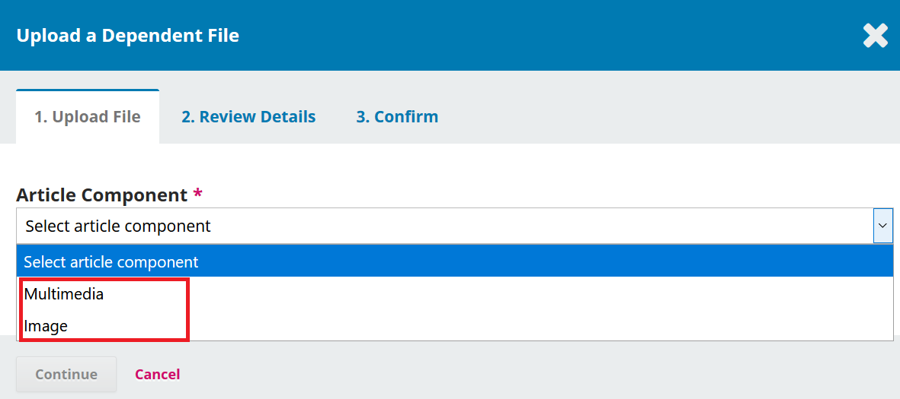
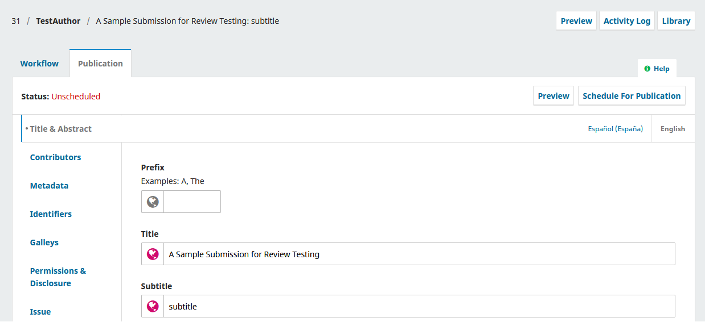

# Editoração e Publicação

Com a conclusão da etapa de Edição de Texto, a submissão agora segue para a Publicação. A partir daqui, os arquivos copiados serão convertidos em formatos publicáveis na forma de arquivos de leitura de prova (exemplo: PDF e HTML) e revisados antes da publicação. Uma nova edição será criada e o artigo será agendado para publicação no número a ser lançado. Este capítulo explica as etapas desse processo e ainda como usar o recurso de controle de versão (introduzido pela primeira vez no OJS 3.2) para publicar uma nova versão de um artigo, caso alterações significativas sejam realizadas.

O OJS também oferece uma forma direta de contornar o fluxo de trabalho editorial descrito no capítulo anterior e enviar o conteúdo diretamente à Publicação, fase em que pode ser adicionado a uma edição e publicado. Você pode fazer isso por meio do plugin Submissão Rápida. Consulte as instruções detalhadas do [plugin Submissão Rápida no capítulo Importação & Exportação de Dados](https://github.com/pkp/pkp-docs/blob/main/learning-ojs/en/tools.md#importexport).

Para começar a trabalhar na Editoração, o Editor de Seção ou Editor de Periódicos deve fazer o login no sistema e escolher a submissão em seu painel de controle.

Clicando no artigo, o registro da submissão será aberto.


Você verá que os arquivos editados agora estão disponíveis no painel **Arquivos Prontos para Publicação**.

Na aba **Editoração**, você pode atribuir participantes (como um Editor de Layout) ao estágio de Editoração do fluxo de trabalho e se comunicar com os participantes no painel de **Discussões de Editoração**.



Este vídeo da Escola do PKP explica os passos que o Editor de Seção ou Editor de Layout tomará na fase de Editoração e na aba Publicação. Para assistir a outros vídeos desta série, visite o [canal do PKP no YouTube](https://www.youtube.com/playlist?list=PLg358gdRUrDUKJbWtr4bgy133_jwoiqoF).

## Abas de Publicação

Todos os aspectos relacionados à publicação de uma submissão são feitos na aba Publicação. A aba Publicação permite editar ou adicionar informações sobre a submissão, incluindo colaboradores, metadados e identificadores. É também onde você fará o upload dos arquivos finais de prova para publicação na revista.


Aqui, tem-se uma visão geral da finalidade das diferentes abas desta seção. Instruções detalhadas sobre algumas delas estarão disponíveis posteriormente neste capítulo.

**Título & Resumo**: Use essa aba para editar título, subtítulo e resumo do artigo.

Se alguma alteração for feita, clique em Salvar antes de sair dessa janela.

**Contribuidores**: Use essa aba para adicionar, editar ou remover autores do artigo.

**Metadados** Use esta guia para adicionar ou editar palavras-chave do artigo.

Se alguma alteração for feita, clique em Salvar antes de sair dessa janela.

**Identificadores**: Use a aba Identificadores para visualizar ou adicionar um identificador exclusivo, como um DOI. Mais informações sobre como atribuir e gerenciar DOIs estão disponíveis no [DOI Plugin Guide](https://github.com/pkp/pkp-docs/blob/main/doi-plugin).

**Leitura de Prova**: Use a aba Leitura de Prova para carregar o arquivo final para publicação. Isso é explicado a seguir.

**Permissões & Divulgação** Inclua detalhes sobre o detentor dos direitos autorais e um link para a licença do artigo, se aplicável. A licença será automaticamente preenchida de acordo com suas [Configurações de Distribuição](./settings-distribution. md).

**Edição**: Use a aba Edição para atribuir o artigo a uma edição de periódico. Isso é explicado a seguir.

### Submissões multilíngues

As abas “Título e Resumo”, “Metadados”, “Permissões e Divulgação” e “Edição” têm opções para adicionar e editar metadados em múltiplos idiomas. Os idiomas devem, primeiro, ser ativados em Configurações do Website-> Configurar-> Idiomas.

Selecione a aba do idioma desejado abaixo do botão “Agendar para Produção” e preencha os campos de metadados no idioma selecionado.


A guia de "Edições" permite que você realize o upload de várias imagens de capa nos idiomas selecionados.


## Formatar Artigo para Publicação

### Designar Editor de Layout

Uma notificação indicará que você deve designar algum usuário para criar os arquivos da Leitura de Prova (por exemplo, os PDFs, HTML etc.) a partir dos arquivos prontos para produção.

Isso pode variar de periódico para periódico – você pode ter Editores de Layout ou Assistentes de Edição para fazer este trabalho. Alguns periódicos usam um design gráfico externo ou serviço de digitação. Se você quiser se comunicar com seu editor de layout, assistente de edição, designer gráfico ou digitador por meio do OJS e gerenciar o processo de editoração com eles, também no OJS, certifique-se de que tenham uma conta de usuário e adicione-os como participantes da submissão.

Para realizar a tarefa, use o link  **Designar** Participantes. Isso abrirá uma nova janela.


Use o filtro de papéis e o botão de pesquisa para encontrar usuários apropriados. Selecione o usuário e escolha uma mensagem predefinida. Clique em **OK** para enviar.

O usuário agora foi notificado por e-mail e no painel.


Você pode ver o editor de layout na lista de Participantes e o aviso de solicitação no painel Discussão da Editoração. Agora, você pode esperar que o Editor de Layout complete suas tarefas.

### Edição de Layout

Como editor de layout, você receberá uma mensagem convidando-o a criar os arquivos de leitura de prova para a submissão. Para começar, faça login no sistema e vá ao seu painel.


A partir daqui, encontre a submissão e selecione o link **Publicação**. Isso vai levá-lo para o registro de submissão.


No painel Arquivos prontos para editoração, baixe os arquivos para sua área de trabalho e trabalhe fora do OJS para convertê-los em arquivos de leitura de prova. A próxima seção explica os formatos e a preparação dos arquivos de leitura de prova.

> Nota: A PKP está atualmente trabalhando em um projeto para automatizar a conversão de documentos do Microsoft Word em outros formatos, incluindo XML, HTML, PDF, EPUB, etc. Fique de olho em nosso blog para atualizações. Fique de olho em nosso blog para novidades.

### Preparar e adicionar Composição Final

A prova é o arquivo final, pronto para publicação, que foi preparado para os leitores e será publicado na página do artigo. As provas devem estar em um formato estável não editável (por exemplo, HTML, PDF, ePub ou XML) com versões do artigo em texto completo. Os arquivos de leitura de prova também podem incluir material suplementar, como arquivos multimídia e dados de pesquisa. Você pode publicar um arquivo de prova para um artigo e para uma edição inteira.

#### Tipos de componentes de arquivo de prova

Quando você carregar um arquivo de leitura de prova, precisará selecionar um **Tipo de componente**. Estes são os mesmos tipos de componentes que os autores selecionam quando carregam arquivos de submissão. Você pode configurar os tipos de componentes em Configurações do fluxo de trabalho> Envio> Componentes, de acordo com o tipo de componente que deseja que seja publicado, e se desejar que um link apareça na página inicial do artigo ou no sumário.

As configurações são as seguintes:

* Dependente: o link não aparecerá com conteúdo publicado em tudo;
* Suplementar: o link aparecerá na página de desembarque do artigo;
* Nem suplementar nem dependente: o link aparecerá na página de desembarque do artigo e na tabela de conteúdos.

Por exemplo, se você quiser incorporar arquivos multimídia em arquivos HTML e fazer com que apareçam na página de destino, na página de edição e na página de submissão, você deverá efetuar as configurações da seguinte forma:

* Vá a Configurações > Fluxo de trabalho > Submissão > **Componentes**;
* Clique na seta azul ao lado de **HTML Stylesheet** e **Editar**;
* Desmarque "Marcar  arquivos desse tipo como arquivos dependentes" e "Marcar arquivos desse tipo como arquivos complementares". Clique em **Salvar**
* Clique na seta azul ao lado de **Multimídia** e **Editar**
* Desmarque "Marcar arquivos deste tipo como arquivos complementares". Deixe "Arquivos dependentes" verificados. Clique em **Salvar**.

#### Adicionar formatos de Leitura de prova

Revistas on-line publicam seus artigos em uma variedade de tipos de arquivos. Os mais comuns são PDF e HTML, mas cada vez mais formatos adicionais estão sendo usados, como ePub, MP3 e XML.

Plugins em OJS permitem que arquivos PDF, HTML e XML sejam visualizados em um navegador da Web ou baixados. Se os arquivos estiverem sendo baixados em vez de exibidos no navegador, talvez seja necessário habilitar um desses plugins em Configurações do site > Plugins:

* PDF.JS PDF Viewer fornece suporte de renderização para arquivos de artigos em PDF.
* ELife Lens Article Viewer fornece suporte de renderização para arquivos de artigos JATS XML usando o eLife Lens.
* O plugin HTML artigos de prova fornece suporte de renderização para arquivos de artigo HTML.

Outros formatos podem exigir plugins adicionais ou podem ser baixados diretamente. De maneira alternativa, você pode hospedar o conteúdo de texto completo em uma plataforma diferente e incorporar uma URL remota, escolhendo a caixa de seleção: "Esta prova estará disponível em um site separado."

#### Usando modelos

Exigir que todas as submissões utilizem um modelo de documento pré-formatado com os estilos de publicação do seu periódico (a exemplo da família da fonte, do tamanho da fonte, do negrito, do posicionamento, do cabeçalho, do corpo, dos rodapés, etc.) pode tornar a conversão do documento muito mais fácil. A [Microsoft fornece uma breve visão geral para a criação de modelos no MS Word](https://support.microsoft.com/en-us/topic/create-a-template-86a1d089-5ae2-4d53-9042-1191bce57deb?ui=en-us&rs=en-us&ad=us).

Depois de criar um modelo que corresponda ao estilo da sua revista, ele pode ser útil para enviar aos autores, aos editores de layout ou a outros usuários. Aqui está um exemplo de uma revista OJS que requer que os autores baixem e usem um arquivo de modelo: [Paideusis](https://journals.sfu.ca/pie/index.php/pie/about/submissions).

Idealmente, seu modelo deve ser criado usando estilos em vez de formatação direta. Isso não apenas garante a consistência em todos os seus documentos, mas também ajuda em quaisquer conversões para outros formatos (por exemplo, HTML). Aqui está uma [explicação da diferença entre estilos e formatação direta no Word](https://support.microsoft.com/en-us/office/customize-or-create-new-styles-d38d6e47-f6fc-48eb-a607-1eb120dec563?redirectSourcePath=%252fen-us%252farticle%252fStyle-basics-in-Word-d382f84d-5c38-4444-98a5-9cbb6ede1ba4&ui=en-US&rs=en-US&ad=US).

#### Arquivo em PDF

O PDF é o tipo de arquivo mais fácil de criar a partir de um documento do Word. As versões atuais do Microsoft Word (e outros processadores de texto) permitem “Salvar como” ou “Exportar como” um PDF. A maioria das revistas OJS publica seus artigos como PDFs.

Os PDFs também são populares com muitos leitores, pois recriam de forma mais próxima a página impressa. No entanto, os PDFs costumam ser menos flexíveis em dispositivos móveis e nem sempre lidam com links ou mídia incorporada (como arquivos de som ou vídeo) muito bem. Com o uso generalizado de dispositivos móveis, garantir que seu público possa ler seus artigos em seus telefones ou tablets é cada vez mais importante.

Exemplo: [Irish Journal of Technology Enhanced Learning](http://www.journal.ilta.ie/index.php/telji/article/view/22/51).

#### Arquivos HTML

Os arquivos HTML têm a vantagem da flexibilidade. Eles lidam muito bem com links e multimídia e podem caber em praticamente qualquer tela - incluindo telefones e tablets. No entanto, eles têm uma aparência diferente de uma página impressa, portanto, alguns leitores preferem PDF. A situação ideal é fornecer arquivos PDF e HTML para melhor atender às necessidades dos diferentes usuários.

A criação de um arquivo HTML pode exigir mais tempo e esforço do que a criação de arquivos PDF. Os processadores de texto não possuem ferramentas eficazes para “Salvar como” em HTML. O Microsoft Word tenta fazer isso, mas os resultados não são úteis para carregar no OJS. Em vez disso, tente seguir este fluxo de trabalho:

* Converta o documento do Word. Você pode usar esta [ferramenta on-line gratuita](https://word2cleanhtml.com/) para fazer uma conversão inicial.
* Abra os arquivos HTML resultantes em um editor de texto (por exemplo, bloco de notas no Windows) ou editor de HTML (por exemplo, Adobe Dreamweaver). A partir daqui, você precisará fazer qualquer limpeza ou formatação final. É necessário compreender os fundamentos do HTML. Existem muitos [tutoriais gratuitos](https://www.w3schools.com/html/), mas leva algum tempo.
* Mantenha a formatação HTML básica. Concentre-se apenas em parágrafos, quebras de linha, cabeçalhos e links. Não se preocupe com fontes, cores ou outros elementos de design - o OJS cuidará de tudo isso automaticamente como parte do design geral da revista.
* Faça upload para o OJS como um arquivo HTML de leitura de prova.
* O visualizador de HTML renderiza arquivos HTML em um iframe, o que pode afetar a navegação para páginas da web com hiperlinks. Você pode ignorar esse recurso abrindo hiperlinks em uma nova aba do navegador, adicionando o atributo `target = "_ blank"` às suas tags href.

Alguns exemplos de modelos HTML podem ser encontrados e adaptados a partir destas fontes:

* [Recurso da U of A](https://drive.google.com/file/d/1mCP0tguFJf7jJn_CNceEwvRn5eCJrvxP/view) - Licença: CC0 1.0 Universal (CC0 1.0)

Exemplos (veja o link HTML no final da página):

* [Antropologia Cultural](https://journal.culanth.org/index.php/ca/article/view/4434)
* [[Evidence Based Library & Information Practice](https://journals.library.ualberta.ca/eblip/index.php/EBLIP/article/view/29621).](https://journals.library.ualberta.ca/eblip/index.php/EBLIP/article/view/29621)

##### Estilizar arquivos em HTML

É possível definir o estilo do design de seus arquivos de leitura de prova HTML em massa ou individualmente, por artigo. O estilo em massa só pode ser feito se você estiver usando um tema personalizado.

Para estilizar um arquivo de prova HTML individual:

* Ao criar o arquivo HTML de leitura de prova, certifique-se de que inclui uma referência à folha de estilo no `<head>` seção, por exemplo  `<link rel="stylesheet" href="./article_styles.css" type="text/css" />`
* Faça upload do arquivo de HTML de leitura de prova (veja abaixo as instruções sobre como **adicionar arquivos de leitura de prova**)
* Edite o arquivo de leitura de prova
* Faça upload das folhas de estilo CSS com o tipo de **componente apropriado - folha de estilo HTML**.

Para estilizar todos os arquivos HTML de leitura de prova: se estiver usando um plugin de tema personalizado, você pode escrever uma linha de código para incluir um estilo personalizado para todos os arquivos HTML. Isso só se aplica a arquivos HTML de leitura de prova que não têm um estilo aplicado individualmente. Mais informações sobre temas personalizados estão disponíveis no [Guia de Temas do PKP](https://docs.pkp.sfu.ca/pkp-theming-guide/en/).

##### Adicionar imagens e multimídia a um componente HTML

Se você gostaria de incluir imagens ou arquivos multimídia em um arquivo de prova HTML, você pode carregá-los como Arquivos Dependentes para o envio e vinculá-los dentro do arquivo para exibi-los.

Antes de iniciar o upload do item, você precisará de uma página HTML contendo um dos seguintes itens:

* `<audio controls>` elemento para MP3
* `<video>` elemento para MP4; ou
* `` tag para imagens

O arquivo HTML também deve conter o nome exato do arquivo que você está se conectando.

Você precisará salvar o arquivo de áudio/vídeo/imagem no formato MP3/MP4/JPEG/GIF usando o nome no arquivo HTML.

Seu arquivo HTML deverá conter o seguinte código mínimo (para arquivos de áudio). Para o vídeo relacionado ou o código do arquivo de imagem, por favor, veja as instruções da w3schools sobre a [incorporação de vídeo em HTML](https://www.w3schools.com/html/html5_video.asp) ou as instruções sobre a [incorporação de imagens em HTML](https://www.w3schools.com/html/html_images.asp).

```html
<html>
<head>
<title>MP3 upload</title>
</head>
<body>
<audio controls>
  <source src="filename.mp3" type="audio/mpeg"> Seu navegador não suporta o elemento de áudio.
</audio>
</body>
</html>
```

No OJS, você precisará definir as configurações para seus Tipos de componentes antes de adicionar arquivos multimídia. Consulte **Tipos de componentes do arquivo de leitura de prova** acima para obter detalhes sobre como ajustar essas configurações.

Certifique-se de ter os arquivos “Multimídia” e/ou “Imagem” configurados como “arquivos dependentes” nas configurações de Tipo de Componente.


Agora volte ao envio para carregar uma folha de estilo HTML para exibir seu arquivo multimídia. Veja abaixo as instruções sobre como **adicionar arquivos de leitura de prova**. Além disso, ao fazer upload do arquivo:

* Rotule a prova de acordo com o tipo de arquivo multimídia (por exemplo, MP3, MP4, imagem)
* Selecione a **folha de estilo HTML** na lista suspensa do **componente do artigo**
* Faça upload do arquivo HTML que você preparou com pelo menos o código mínimo (instruções acima)
* Clique em **Continuar**
* Na aba **Detalhes da revisão**, você pode carregar arquivos dependentes. É aqui que fará o upload do arquivo MP3/MP4/imagem.


Selecione **Multimídia** ou **Imagem** no **Componente do artigo** menu suspenso e carregue o arquivo MP3, MP4 ou imagem.



Ao carregar um arquivo de imagem, você será solicitado a adicionar uma Legenda, Crédito, Proprietário de Direitos Autorais e Permissão, conforme a aplicabilidade.


Clique em **Continuar**, para concluir o upload, revise os detalhes e confirme. Seu arquivo multimídia agora foi adicionado como um arquivo dependente junto ao HTML e será incorporado ao HTML quando o item for publicado.

#### Arquivos ePUB

Semelhante aos arquivos HTML, os arquivos ePub são ideais para dispositivos móveis, mas requerem codificação especializada para serem criados. Ferramentas de conversão estão disponíveis, como [Calibre](https://calibre-ebook.com/). Instruções mais detalhadas de COMO FAZER para criar arquivos ePub estão [disponíveis aqui](https://www.wikihow.com/Convert-a-Word-Document-to-Epub).

Como arquivos HTML, alguma limpeza adicional pode ser necessária após a conversão e [requer algum conhecimento](http://www.jedisaber.com/eBooks/Introduction.shtml) sobre o formato.

Exemplo (ver link EPUB na parte inferior da página): [Revisão Internacional de Pesquisa em Ensino Aberto e a Distância](http://www.irrodl.org/index.php/irrodl/article/view/2895).

#### Arquivos XML

Os arquivos XML são arquivos estruturados nos quais cada parte do artigo é marcada como um elemento distinto. Isso permite ao leitor navegar e acessar facilmente figuras, imagens, metadados, referências e partes do texto do artigo. Criar arquivos XML é uma maneira muito eficiente de publicar em vários formatos. Ao criar um arquivo XML, você pode gerar PDFs, HTML, ePub e outros formatos automaticamente.


PKP está desenvolvendo ferramentas que lhe permitirão criar, converter e editar arquivos XML dentro do OJS. Atualmente, você precisa criar e editar os arquivos fora do OJS. Se deseja produzir arquivos XML de leitura de prova para a sua revista, pode usar os serviços de um designer gráfico ou tipógrafo ou, se tiver algum conhecimento em XML, pode criar os arquivos você mesmo. O W3schools tem excelentes tutoriais sobre XML.

Exemplo [Food and Nutrition Research](https://foodandnutritionresearch.net/index.php/fnr/article/view/3609/10173).

#### Arquivos multimídia

Está se tornando cada vez mais popular para as revistas publicar conteúdo multimodal, incluindo arquivos de áudio e vídeo, além de artigos baseados em texto. Mais do que fornecer formatos audiovisuais e visuais para artigos baseados em texto, o que pode ajudar a aumentar a acessibilidade do conteúdo de revistas, o conteúdo multimodal é cada vez mais [valorizado como forma alternativa de bolsa de estudos](https://www.tandfonline.com/doi/full/10.1080/07294360.2017.1389857?casa_token=QlJ8xBTQUEMAAAAA%3AWDkOV6R-qfZxJBimLv_Jv4iB3o2XYeA-Cym7uxHoCww9THLVmZFVfKmRP3dtqq098HvYG6kqTl_v) que representa e reflete diferentes modos de expressão e formas de saber. Os periódicos que optarem por criar versões em áudio de artigos baseados em texto podem optar por fazê-lo manualmente, tendo alguém lendo o artigo em um gravador de voz ou usando automaticamente o software Texto para fala.

Os arquivos multimídia podem ser incorporados à página do artigo no site do seu jornal ou podem ter um link de um site externo, como o YouTube ou SoundCloud. Se você usar um site externo, a qualidade pode ser melhor, mas as estatísticas não serão coletadas em visualizações de provas ou downloads, e a preservação do conteúdo depende do site externo.

Ao carregar um arquivo multimídia, você pode selecionar “texto do artigo” da lista de componentes e carregar o arquivo (MP3, MP4, arquivo de imagem, etc.) diretamente. Isso permitirá que o usuário acesse o arquivo usando o software de visualização de imagens ou o software de reprodução de áudio/vídeo instalado em seu dispositivo.

Exemplo (veja o link MP3 no menu lateral ao final da página): [International Review of Research in Open and Distance Learning](http://www.irrodl.org/index.php/irrodl/article/view/3279)

Como alternativa, você pode incorporar o arquivo de áudio, vídeo ou imagem em uma página HTML para que os usuários possam visualizar o arquivo diretamente em seu navegador. Consulte **Adicionar imagens e multimídia a uma prova HTML** acima para obter instruções sobre como fazer isso.

Exemplo: [Intersectional Apocalypse](https://journals.lib.sfu.ca/index.php/ifj/article/view/673)

##### Carregar um arquivo multimídia vinculado a um site externo

Faça upload do arquivo de leitura de prova multimídia no estágio de Editoração do fluxo de trabalho. Veja abaixo as instruções sobre como **adicionar arquivos de leitura de prova**. Além disso, ao fazer upload do arquivo:

* Rotule a prova de acordo com o tipo de arquivo multimídia (por exemplo, MP3 / MP4)
* Marque a caixa que indica “Esta prova estará disponível em um site separado”


Cole a URL no campo de prova remota e clique em **Compartilhar** e copie a URL.


Cole a URL no campo de galeria remota e clique em **Salvar**.

O vídeo agora deve aparecer na submissão publicada.

### Contate o Autor

Em seguida, você desejará compartilhar o PDF com o autor para um olhar final e confirmação de autoria. Para fazer isso, use o link **Adicionar discussão** no painel Discussão de Editoração. Ao fazer isso, será aberta uma nova janela.


Lembre-se de adicionar o autor na parte superior da janela e, em seguida, adicione um assunto e uma mensagem.

Antes de enviar, anexe uma cópia do arquivo PDF usando o link **Carregar arquivo**. Isso o tornará disponível para o autor.


Lembre-se de selecionar o componente correto do e depois carregar o PDF.

Clique no botão azul **Continuar**.

Na sequência, faça quaisquer mudanças no nome do arquivo (geralmente, você não precisa fazer nada aqui).


Então, você pode realizar o upload de arquivos adicionais, se necessário.


Uma vez que você tenha terminado, clique em **Completar**.

O arquivo agora está anexado e você poderá enviar a mensagem usando o botão **OK**.


O autor agora foi notificado e você pode aguardar a resposta.

### Resposta do Autor

Assim que o autor tiver a chance de revisar as provas e responder, você receberá uma notificação por e-mail e verá uma resposta nas Discussões de editoração.


### Adicionar Arquivos de Prova

Agora que o autor revisou as provas, você pode fazer as alterações finais e enviá-las à submissão. Para fazer upload de provas, vá à aba Publicação e, em seguida, Provas.


Em seguida, clique em **Adicionar Prova**, que abrirá uma nova janela.


Adicione um rótulo apropriado (por exemplo, PDF, HTML, etc.) e clique em **Salvar**.


Nessa janela, escolha o componente de artigo apropriado (por exemplo, texto do artigo) e carregue o arquivo de prova. Clique em **Continuar**.


Se necessário, altere o nome do arquivo. Clique em **Continuar**.


Se você tiver mais arquivos, envie-os neste momento. Caso contrário, clique em **Concluir**.

Agora você pode ver as provas no painel de Provas.


Você pode fazer alterações no upload selecionando a seta azul à esquerda do rótulo da prova, que exibirá as opções para editar, alterar o arquivo ou excluir.

### Editar Arquivos de Prova

Se quiser fazer uma alteração em um arquivo de leitura de prova ou rótulo de arquivo de leitura de prova depois de ter sido carregado, você pode editá-lo. Observe que, se o artigo já foi publicado, para fazer uma alteração no arquivo de leitura de prova, você, primeiro, terá que cancelar a publicação do artigo ou criar uma nova versão (consulte Controle de versão dos artigos na sequência). Mas, antes de o artigo ser publicado, você pode editar o arquivo de leitura de prova facilmente.

1. Abra a submissão no painel de submissões
2. Vá à aba Publicação e Provas
3. Clique na seta azul ao lado do arquivo que deseja editar
4. Se desejar editar o rótulo da leitura de prova, clique no botão Editar, que aparece na tela, e altere o rótulo da leitura de prova
5. Se desejar alterar o arquivo, clique em Alterar arquivo e carregue um novo arquivo
6. Quando terminar de editar, clique em Salvar.


### Informe o Editor de Seção

Finalmente, você precisará informar ao Editor de Seção que as leituras de prova foram concluídas. Para fazer isso, use o painel Discussão de Editoração e escolha o link **Adicionar Discussão**.


Adicione o Editor de Seção ao topo da página e, a seguir, inclua uma linha de assunto e uma mensagem. Clique em **OK** para enviar a mensagem.

Agora você pode ver a discussão final.


### Editor de Seção Informa Editor

Neste ponto, o Editor de Seção recebe a notificação do Editor de Layout e revisa os arquivos da prova de leitura.

Eles podem pedir ao Editor de Layout para fazer alterações adicionais \(usando as Discussões de Produção\) ou informar ao Editor que as provas estão prontas para publicação.

Para informar o Editor, use o link **Adicionar discussão** do painel de Discussão.

A próxima etapa na publicação do envio é verificar e finalizar os metadados.

## Finalizar metadados

Antes de publicar a submissão, você deve verificar se os metadados do artigo estão completos e precisos no OJS, e se correspondem aos metadados no PDF. Isso é importante para garantir que o conteúdo seja indexado pelo Google Scholar, detectável por outros serviços e acessível aos leitores. Para saber mais, veja [o guia de melhores práticas em metadados de periódicos](https://github.com/pkp/pkp-docs/blob/main/metadata-practices/en).

Você pode verificar os metadados da submissão acessando as **Submissões**, abrindo a submissão que será publicada, indo para a aba **Publicação**, e verificando as guias de **Título e Resumo**, **Contribuidores** e **Metadados**.

Neste ponto, você também pode adicionar o artigo a uma categoria para exibi-lo em uma página de categoria temática em seu site e extrair e salvar as referências (se ainda não o fez).

### Adicionar o artigo a uma categoria

As categorias podem ser usadas para organizar seus artigos em coleções temáticas. Se usar categorias em sua revista, você pode, opcionalmente, adicionar o artigo a uma categoria ou categorias. Para obter instruções sobre como criar categorias, consulte o [capítulo Configurações do diário](./journal-setup). Você pode adicionar o artigo a uma categoria editando seus metadados.

* Para a submissão do artigo, vá à aba **Publicação**
* Clique em **Edição**
* Na caixa **Categorias**, marque a categoria ou categorias às quais deseja adicionar o artigo
* Clique em **Salvar**.


### Extrair e salvar referências

Se desejar exibir as referências bibliográficas do artigo na página do artigo com DOIs vinculados e enviá-las para Crossref com o restante dos metadados do artigo, você pode usar o recurso “Extrair e salvar referências”. Este recurso só pode ser usado se você estiver usando o plugin DOI e o plugin Crossref para exportar seus metadados para o Crossref. O recurso armazenará cada referência no banco de dados como uma referência separada e adicionará o DOI à referência na página do artigo. Isso também tornará mais fácil a identificação e indexação das citações do artigo pelos serviços de indexação, como o Google Scholar.

A primeira coisa que você deve fazer é habilitar Referências como um campo de metadados de envio.

1. Vá a Configurações de fluxo de trabalho> Submissão > Metadados
2. Role para baixo até **Referências** e marque **Ativar metadados de referências**
3. Novas opções aparecerão abaixo e você pode selecionar uma das opções
  * não solicitar as Referências ao autor durante o processo de submissão - o campo Referências não estará disponível no formulário de submissão e, em vez disso, as Referências poderão ser adicionadas por um editor posteriormente a submissão
  * peça ao autor para fornecer referências durante a submissão - o campo Referências estará no formulário de submissão e os autores podem, opcionalmente, adicionar suas referências a ele, ou um editor pode adicionar referências à submissão posteriormente
  * exigir que o autor forneça referências antes de aceitar sua submissão - o campo Referências estará no formulário de submissão e os autores serão obrigados a adicionar suas referências a ele
4. Clique em **Salvar** quando terminar


Neste momento, se você acessar a aba **Publicação** de um registro de submissão, verá uma aba **Referências** abaixo. Um editor pode abri-la e copiar e colar as referências do artigo no campo. Além disso, se você marcou a segunda ou terceira opção acima, haverá um campo **Referências** quando um autor fizer uma submissão e o autor poderá adicionar suas referências a ela.

Cada referência deve estar em uma linha separada e você deve certificar-se de que o texto colado no campo não está formatado e não contém quebras de linha ou espaços extras. Remova quaisquer DOIs nas referências, se você planeja adicioná-los, posteriormente, com o plugin Crossref Reference Linking.

Quando o artigo for publicado, as referências aparecerão na página do artigo e as referências serão submetidas ao CrossRef.

Depois de exportar os metadados do artigo para Crossref, você pode inserir os DOIs para as referências do artigo do Crossref, se usar o plugin Crossref Reference Linking. As instruções sobre como usar o plugin estão disponíveis no [Guia de plugins do Crossref](https://docs.pkp.sfu.ca/crossref-ojs-manual/en/references).

Depois de configurar o plug-in e exportar os metadados do artigo para o Crossref, você pode inserir os DOIs do Crossref de volta nas referências:

1. Abra a submissão
2. Vá à aba **Publicação** e **Referências**
3. Clique em **Verificar Crossref DOIs**
4. Alguns DOIs agora serão adicionados às referências.

## Criar Edição



Este vídeo da PKP School explica como criar, editar, publicar e gerenciar Edições. Para assistir a outros vídeos desta série, visite [PKP’s YouTube channel](https://www.youtube.com/playlist?list=PLg358gdRUrDVTXpuGXiMgETgnIouWoWaY).

Quando você estiver pronto para publicar o artigo, deve criar uma edição para publicá-lo primeiro. Em seguida, agendará artigos para publicação na edição. Os artigos não serão publicados até que você publique o número como um todo. Esta seção explica como criar e editar edições.

No menu à esquerda, selecione Edições para gerenciar todas as edições de sua revista.


Para criar uma nova edição, use o link **Incluir edição** e preencha o formulário.

**Edições futuras** são todas as edições não publicadas. Você pode criar quantas quiser e agendar submissões para qualquer uma delas.

**Edições anteriores** são todas as edições já publicadas.


Para criar um novo problema, use o link **Criar |Edição** e preencha o formulário.


Existem espaços para adicionar informações de volume, número, ano e título (por exemplo, Edição especial nº 1), bem como uma descrição, imagem de capa e URL personalizada. A imagem da capa e a descrição aparecerão na parte superior da página da edição em seu site, se você adicioná-las. Se tiver o volume, o número e o título marcados abaixo, será necessário preencher algo em cada campo.

Quando finalizar, clique em **Salvar**.

### Editar Edição

Você também pode editar uma edição futura existente selecionando a seta azul à esquerda da entrada do problema na página de Edições Futuras.


Isso revelará um link **Editar**, que abrirá uma nova janela de informações.


**Índice**: para uma nova edição, estará vazio, mas para edições que tiveram envios agendados, eles serão listados aqui.

Use a seta azul ao lado de cada submissão para revelar links para ir diretamente ao registro de submissão ou removê-lo.

**Dados da Edição**: fornece acesso aos dados de volume, edição e número inseridos ao criar a edição pela primeira vez.

**Edição de Provas**: permite que você envie as provas da edição completa - por exemplo, um PDF contendo todos os artigos. Isso será vinculado a partir da página da web da edição.

**Identificadores**: Use este espaço para adicionar um DOI para o fascículo, caso seu periódico suporte identificadores em nível de edição.

### Ordenar seções e artigos

Ao publicar um número, os artigos serão exibidos nas seções do seu periódico.

Se você for para Configurações do diário > Seções e editar uma seção, você pode configurar como ela aparecerá na página do edição publicada, incluindo se o título da seção será exibido.

Você também pode arrastar e soltar as seções para alterar a ordem de como elas aparecerão na edição publicada.

Se você deseja alterar a ordem das seções por edição ou a ordem dos artigos em uma seção:

* Acesse **Edições** e abra a edição que deseja editar
* Clique em **Ordenar**
* Arraste e solte as seções e artigos onde quiser
* Clique em **Concluído** quando terminar.

### Pré-visualizar Edição e Artigos

Se você quiser ver como seus artigos ficarão antes da publicação, clique no botão Visualizar na aba Publicação do registro de submissão. Os usuários com permissão para visualizar verão este botão da fase de Edição de texto.



Se você quiser ver como seus artigos ficarão no contexto de uma edição antes de publicá-la, você pode usar o recurso Pré-visualização da edição:

* Clique na seta azul ao lado da edição futura
* Clique em **Visualizar**
* A página de visualização da edição será aberta. Para visualizar um artigo, clique no título do artigo no sumário.


### Publicar Edição

Quando estiver satisfeito com a edição, clique no link **Publicar edição** para publicá-la no site da revista.

### Notificar leitores

Você terá a opção de enviar uma notificação aos usuários sobre a nova edição.

Para não notificar os usuários sobre uma nova edição publicada, desmarque a caixa ao lado de “ Enviar e-mail de notificação para todos os usuários registrados” antes de clicar em **OK**.


O conteúdo do anúncio é gerado automaticamente e não pode ser editado. Como alternativa, você pode usar o recurso [Anúncios](./settings-website.md#announcements) para enviar um anúncio de publicação com conteúdo personalizado.

### Despublicar Edição

Use o link **Despublicar edição** para remover a edição e todo o seu conteúdo da exibição pública. A edição será revertida para a aba Edições Futuras.

### Excluir Edição

Você pode usar o link **Excluir** para remover totalmente a edição. Não apenas a publicação da edição será cancelada, como também a estrutura organizacional e quaisquer metadados da edição serão removidos. Todos os artigos atribuídos serão revertidos para o status não publicado.

## Adicionar o artigo a um problema

Neste momento em que você criou uma edição, pode adicionar o artigo a ela. Observe que o artigo não será publicado até que a edição seja publicada. Nesta etapa, você atribui o artigo a uma edição.

* Volte para **Envios**
* Encontre e abra o envio que deseja publicar
* Vá à aba **Publicação**;
* No campo **Edição**, selecione a edição em que deseja publicar o artigo
* A **seção** será preenchida automaticamente com base nos metadados da submissão, mas você pode alterá-la, se necessário
* Você pode selecionar uma **categoria**, se ainda não tiver feito isso (explicado acima)
* Se quiser que uma imagem apareça na página do artigo, carregue-a na **imagem da capa**
* Você pode adicionar **números de página**, que serão incluídos nos metadados e no sumário
* A **data de publicação** será definida automaticamente quando a edição for publicada. Não insira uma data de publicação, a menos que o artigo tenha sido publicado anteriormente em outro lugar e você precise retroceder
* Quando terminar, clique em **Salvar**.


## Cronograma de Publicação

A próxima etapa é o agendamento do artigo para publicação. Embora o artigo não seja publicado até que a edição à qual está atribuída seja publicada, a etapa do Cronograma de Publicação é a etapa final para confirmar que o artigo está pronto para ser publicado.

Apenas um Editor de Periódicos pode agendar um artigo para publicação, não um Editor de Seção ou Editor Convidado.

O artigo deve ter sido atribuído a um fascículo e ter passado pela etapa de Revisão para poder agendar sua publicação.

Quando estiver pronto para publicar o artigo:

* Abra a submissão
* Encontre e abra a submissão que deseja publicar
* Clique no botão azul **Agendar publicação**.


Uma mensagem aparecerá confirmando que você deseja agendar o artigo para publicação. Clique em **Publicar**.

### Cronograma para Publicações Individuais

Nas versões anteriores do OJS, um artigo era atribuído a uma edição e seria publicado no momento da publicação desta edição. No OJS 3.3, agora é possível definir uma data de publicação específica para cada publicação.

Para fazer isso, na guia **Publicação** do manuscrito, vá para **Edições**.

Em **Data de Publicação**, você pode inserir a data de publicação, se for diferente da data de publicação da edição. Se não, deixe em branco.


Para agendar uma publicação individual, ela deve estar vinculada a uma edição e ter passado pela etapa de revisão.

Se a data for definida para uma data futura, a publicação deverá ser publicada quando a tarefa agendada for executada nessa data.

Se o manuscrito agendado não estiver agendado para a edição, a data até então prevista não deve mudar.

## Versão dos Artigos

A capacidade de publicar versões de artigos é uma das principais novidades do OJS 3.3. Esse recurso oferece suporte à publicação de pré-impressão e à publicação de novas versões de artigos quando uma correção ou alteração significativa é feita. Com o recurso de controle de versão, você pode gerenciar diferentes versões de um artigo e indicar claramente qual é a mais atual.

Depois que um artigo é publicado, nem metadados nem provas podem ser editados. Quando uma revisão de um artigo publicado ou metadados é necessária, isso pode ser feito de duas maneiras:


**Opção 1: Despublicar e Republicar**

Cancelar a publicação de um artigo permite que você faça alterações sem criar uma nova versão. Após cancelar a publicação, você pode atualizar os metadados e/ou substituir o arquivo de leitura de prova e agendar o artigo para publicação novamente. Se programado para uma edição publicada, ele estará disponível imediatamente. Nenhuma notificação será enviada aos leitores, uma vez que a notificação é enviada quando uma edição é publicada, e não para um artigo individual.

**Opção 2: Criar nova versão**

Ao criar uma nova versão, você poderá fazer alterações nos metadados e/ou arquivos de leitura de prova. Certifique-se de clicar em **Salvar** no canto inferior direito para registrar as alterações.

Você pode acompanhar as atualizações de versão em **Todas as versões**. Cada versão é marcada por um número e data de publicação. A versão atual que está sendo atualizada é marcada por um número e também como **Não publicada**.


Assim que suas alterações forem concluídas, você pode publicar a nova versão clicando em **Publicar**, no canto superior direito. Se programado para uma edição publicada, ele estará disponível imediatamente. Nenhuma notificação será enviada aos leitores, pois a notificação é enviada quando uma edição é publicada, não quando se trata de um artigo individual.

A lista de versões anteriores e datas de atualização serão listadas na página do artigo publicado.


Os leitores ainda poderão acessar as versões anteriores. Eles verão uma mensagem no artigo e nas páginas da prova, avisando-os de que se trata de uma versão desatualizada e apontando-lhes a versão mais recente.

Exemplo de mensagem de versão desatualizada na página do artigo:


Exemplo de uma mensagem de versão desatualizada na página de prova em PDF:


A URL do artigo sempre apontará para a versão mais recente, estando as versões anteriores disponíveis na mesma URL com a versão no final da URL (por exemplo, /versão/1234/).

### DOIs e indexação de versões

Quando um DOI for atribuído à versão original, ele não será alterado automaticamente. Metadados CrossRef previamente depositados também não serão atualizados automaticamente. Se os metadados do artigo foram alterados, recomendamos atualizar os metadados CrossRef no Plugin de Exportação CrossRef XML, depositando manualmente o artigo atualizado. Para obter instruções sobre como depositar manualmente um artigo, consulte o [CrossRef Plugin Guide - Manual Deposits do PKP](https://docs.pkp.sfu.ca/crossref-ojs-manual/en/config#manual-deposits).

Indexandores e repositórios que usam a OAI para a coletar os metadados, precisarão ser atualizados, coletando novamente os metadados do artigo para atualizar para a nova versão.

A nova versão será marcada corretamente para ser reconhecida e atualizada pelo índice do Google Acadêmico, mas o colhedor precisará visitar seu site novamente para encontrar a nova versão.

É recomendado verificar com o indexador ou repositório específico para saber qual é o seu processo de atualização que eles exigem.

## Publicação contínua e Visualização antecipada

A publicação contínua – também conhecida como cronograma de publicação contínua – é uma forma de publicar que prioriza o imediato. Quando publicam continuamente, os artigos são liberados assim que estiverem prontos. Os periódicos também podem optar por fornecer uma visão prévia antes do layout (também conhecido como on-line primeiro, noticia, pós-impressão, primeira visão, etc.).

Alguns periódicos podem achar que um cronograma de publicação mais frequente também pode ajudar com a otimização de mecanismos de busca (SEO) e fornecer uma maneira de gerar saída de mídia social mais frequente.

O conteúdo deve ser considerado final e já foi submetido a revisão e edição de cópias. Uma vez que o trabalho pode ser citado de imediato, deveriam estar disponíveis números e anexos. Para evitar confusão, se os números das páginas estão sujeitos a mudanças, eles devem ser evitados.

OJS é atualmente projetado para um modelo de publicação tradicional, em que os artigos são publicados em edições. No entanto, há uma maneira de adotar um modelo de publicação contínuo no OJS.

### Usar Edição Atual - para publicação contínua

* Crie uma  nova edição. Edições podem receber um título nos Dados da edição. Recomendamos usar um título que comunica a natureza em andamento.
* Publique o novo problema: enquanto é possível publicar uma edição com 0 artigos, uma edição vazia pode ser confusa para os leitores. Recomendamos que você publique a nova edição depois que pelo menos 1 artigo for atribuído.
* Quando o próximo artigo estiver pronto, atribua-o a **Eduções Anteriores > Edição atual**. Este artigo será publicado imediatamente na página de edição atual. Se estiver usando DOIs, certifique-se de **Atribuir Identificador** antes de publicar. Se o seu registro no DOI não for automatizado, registre manualmente o seu DOI mais recente.
* Note que padrões DOI padrão são gerados usando números de edções:
     * Se você planeja gerar um sufixo do DOI com base na numeração vol/edição, não mude a questão mais tarde.
     * Se você pretende alterar a numeração de edições, não gere um sufixo usando os valores padrão. Escolha gerar um padrão personalizado em vez disso. Veja [ documentação de Configuração DOI ](https://docs.pkp.sfu.ca/doi-plugin/en/) para mais detalhes.
* Depois que a edição atual for concluída, você pode querer renomeá-la de acordo com a convenção de nome padrão (e. g., Volume 2, Edição 5), indo para [Editar](https://docs.pkp.sfu.ca/learning-ojs/en/production-publication#edit-issue).
* Se você mudou apenas o Título da edição:
    * Este campo não é exportado para CrossRef, DOAJ ou PubMed, mas é usado para DataCite. Se você usar DataCite, lembre-se de atualizar esse registro reenviando metadados através do plugin DataCite.
* Se você ativou [o plugin de Idioma do Estilo de Citação](https://docs.pkp.sfu.ca/learning-ojs/en/settings-website#citation-style-language-plugin) no seu diário, este plugin deve ser desativado, pois você terá citações incorretas no bloco "Como Citar" de seus artigos devido à alteração de números de issues.
* Considere o uso do recurso [recurso de versionamento de artigo](https://docs.pkp.sfu.ca/learning-ojs/en/production-publication#versioning-of-articles) para publicar a versão inicial da visualização antecipada do artigo. Quando a versão final estiver pronta, crie uma Nova Versão e a publique.

Uma vez que novos artigos serão publicados imediatamente, criar etapas de verificação no seu fluxo de trabalho usando o artigo [Pré-visualize recursos](https://docs.pkp.sfu.ca/learning-ojs/en/production-publication#preview-issue-and-articles) para verificar se há metadados e galerias precisas.

### Use o Plugin Forthcoming - para Publicação Contínua

O Plugin [Forthcoming](https://github.com/ajnyga/forthcoming) permite que os revistas publiquem uma versão de um artigo usando o recurso de versão do OJS antes que um problema inteiro seja publicado. Este é um plugin de terceiros externo disponível para OJS 3.2.1 ou superior. Como um plugin que não é mantido pelo PKP, não podemos garantir a sua funcionalidade ou compatibilidade com todas as versões de software.

Veja o arquivo [README do Forthcoming](https://github.com/ajnyga/forthcoming#readme) para mais detalhes sobre como ele funciona e entre em contato com o administrador do OJS para ver se o suporte está disponível para este plugin.

### Usar Páginas Customizadas - para Publicação Continuada e Visualização Antecipada

Crie uma Página personalizada em [Configurações de navegação](https://docs.pkp.sfu.ca/learning-ojs/en/settings-website#navigation) e adicione artigos a ela.

Esta opção é totalmente separada do fluxo de trabalho de Submissão regular, e requer adição e remoção manual de metadados do artigo e/ou texto completo.

Em uma página Personalizada em branco, os periódicos podem fornecer:

* Uma lista de artigos com um mínimo de metadados e sem artigos em texto integral
* Uma lista de artigos com metadados completos e sem artigos em texto integral
* Uma lista de artigos com hiperlinks para versões de texto completo/visualização antecipada (os arquivos devem ser hospedados em outro lugar, tal como na [Biblioteca de Publicador](https://docs.pkp.sfu.ca/learning-ojs/en/settings-workflow#publisher-library))

Quando um novo artigo estiver pronto para ser compartilhado, adicione-o manualmente à página personalizada. Então, quando a questão inteira do artigo ou da versão final do mesmo artigo estiver pronta para ser publicada, remova-o manualmente da página personalizada.

O conteúdo de páginas personalizadas não aparecerá nas buscas por palavra-chave do periódico, e os artigos adicionados a páginas personalizadas não aparecerão nas pesquisas de artigos nem receberão DOIs.

### Configurações de Periódico para Publicação Contínua

Você pode querer alterar algumas configurações do periódico para refletir a alteração no horário de publicação:

* [Ano de Direitos Autorais Padrão](https://docs.pkp.sfu.ca/learning-ojs/en/settings-distribution): para um modelo de publicação contínuo, selecione a data de publicação do artigo. Esse padrão pode ser substituído caso a caso.
* [Políticas de Periódico](https://docs.pkp.sfu.ca/learning-ojs/en/journal-setup): claramente comunica a programação e a frequência de publicação em "Sobre o Diário".
* [Personalize o rótulo “Edição atual” na página inicial](https://docs.pkp.sfu.ca/translating-guide/en/customize-locale#example-customize-the-current-issue-label-on-homepage): se você quiser alterar o rótulo "edição atual" na página inicial para "publicações atuais" ou "artigos atuais", você pode fazer isso através do plugin Custom Locale (em OJS 3.2 ou mais recente).

### Comunicações

Se quiser avisar seus leitores quando cada novo artigo for publicado, você terá que criar um Comunicado individual, pois a mensagem de notificação automática de uma nova publicação só pode ser enviada quando uma nova edição é publicada. Veja o capítulo [Configurações do Site](https://docs.pkp.sfu.ca/learning-ojs/en/settings-website.html#announcements) para informações sobre Avisos.

Se o seu periódico havia usado anteriormente um modelo baseado em problemas tradicionais e agora mudou para um modelo de publicação contínua. Talvez você precise atualizar as agências de terceiros, incluindo:

* Centro ISSN: para atualizar o registro ISSN, entre em contato com o [Centro Nacional](https://www.issn.org/services/requesting-an-issn/contact-an-issn-national-centre/)
* Índices que incluem frequência de publicação
* Índices que incluem informações sobre o tempo entre a submissão e a publicação
