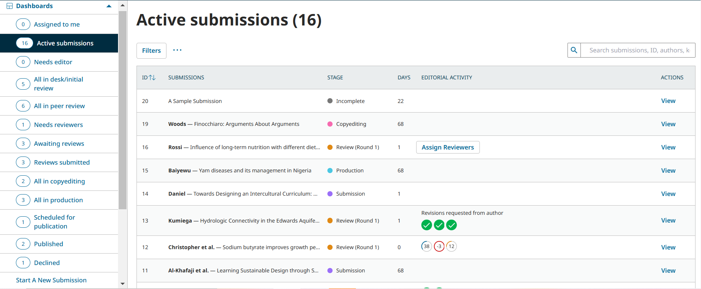
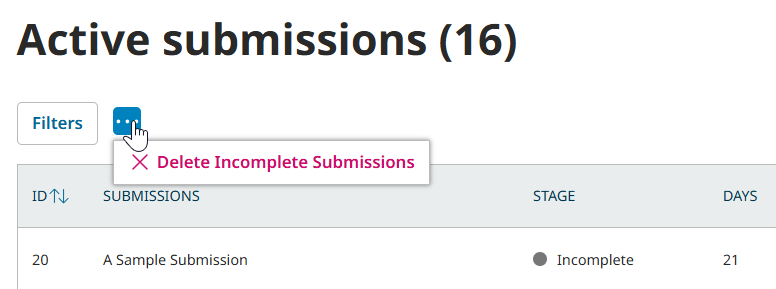
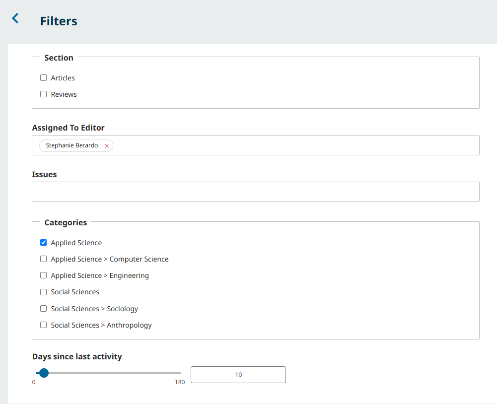
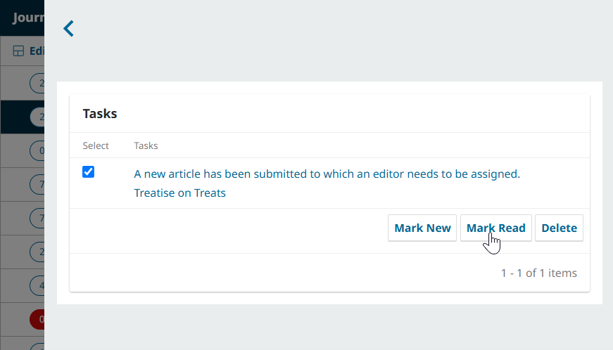
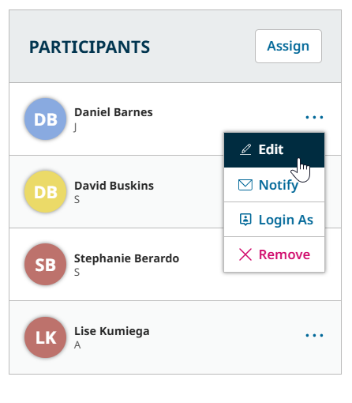
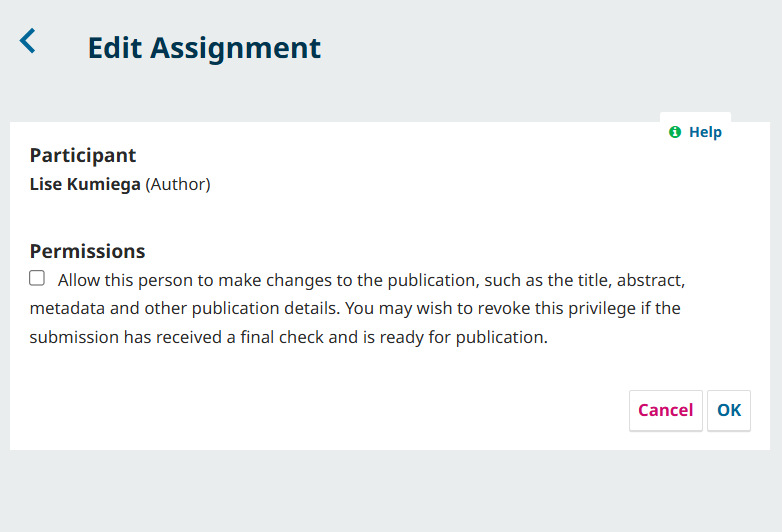
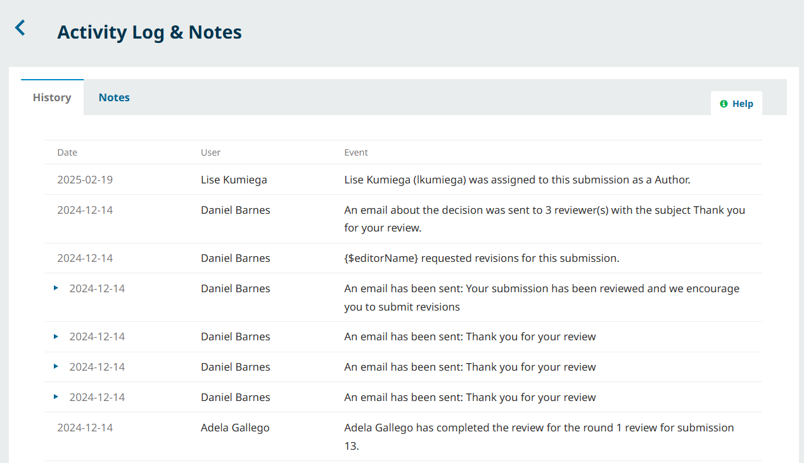
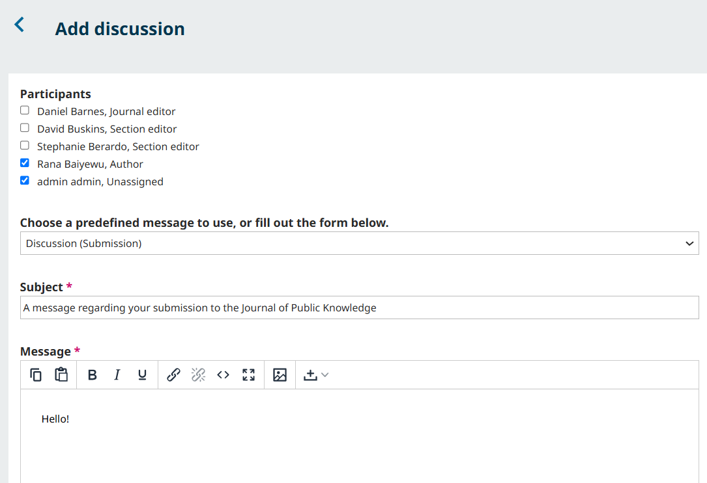

# The Editorial Dashboard

The Dashboard is where users manage their assignments and submissions. Understanding the Dashboard will allow you to quickly understand what tasks are outstanding and ongoing in your journal.

When you log in and access the Dashboard from your user menu, you can view your assignments either from your Tasks, or from the Assigned to Me Dashboard view. You can also access different Dashboard views that filter assignments by stage and status. The counter on the left will provide an overview of how many total items are in each view.

You will also see the “Start a New Submission” button under the list of Dashboard views. You can use this to make a new submission as an author. Learn about making a submission in [Learning OJS for Authors](../../authors/en/).

### Get to Know the Dashboard Layout {#dashboard}

When you open the Editor Dashboard menu, you will automatically be taken to the “Assigned to Me” Dashboard view. Let’s look at this example of a Dashboard to understand how it is organized.

The list of submissions on this Dashboard are displayed by **ID**, **Submission** (a short version of the author(s) and title), **Stage**, **Days** (representing how many days the submission has been in its current stage), **Editorial Activity**, and **Actions** (containing a View button).

The dashboard allows you to see where submissions are in the Editorial workflow and sort your tasks accordingly.

#### Understand Submission Stages {#understand-stages}

Each submission will be marked with a colored dot and a status in the “Stage” column. A brief explanation of each stage status is as follows:

**Incomplete**: The author has not completed the submission. *New in 3.5*: Journal Managers and Journal Editors can remove submissions with the Incomplete status by pressing the three dots next to the “Filter” button and choosing “Delete Incomplete Submissions”. 

**Submission**: The submission either requires an editor to be assigned, or requires the assigned editor to review and make a decision (i.e., reject [desktop rejection], discuss with other editors or forward for review).

**Review**: The submission is currently undergoing review. The review round will be indicated in the stage. Submissions in this stage will either contain a button directing the assigned Editor to assign reviewers, icons indicating the status of the review, a prompt to enter an editorial decision, or the final editorial decision.

**Copyediting**: The submission is ready to undergo or is currently undergoing copyediting.

**Production**: The submission is ready to be prepared for or is currently being prepared for publication.

**Scheduled for Publication**: The submission has been finalized and added to an issue for future publication.

**Published**: The submission is published in an issue and available to readers.

**Declined**: The submission was declined. Note that this status is only viewable to Journal Managers and Journal Editor roles. 

You can use the various views under the Dashboards menu to filter submissions by these statuses.

> Note: The “Needs Editor” and “Declined” Dashboard views are only accessible to roles with the Journal Manager permission level. Section Editors see the rejected manuscripts that were assigned to them, Journal Managers see all manuscripts.
{.:tip}

#### Search and Refine Your Results With Filters {#search-filters}
You can use the Search and Filters options to further refine the submissions you see in a given dashboard view. 

Use the **Search** tool to search by submission ID, partial or full title, or partial or full author name.

Use **Filters** to further narrow down your search.

- __Sections:__ Narrow your search to submissions made to a specific section or multiple specific sections.

- __Assigned to Editor:__ only roles with the Journal Manager permission level have this filter option. Begin typing the name of a Section Editor, Journal Editor, or Guest Editor's name and choose the correct name from the suggestion to display all articles assigned to the editor.

- __Issues:__ Only Journal Manager level roles can filter by unpublished issues, but other editors will be able to filter by published issues. This field is case-sensitive and requires an exact match. For best results, search by year or title, rather than volume or number. 

- __Categories:__ Choose a submission assigned to a specific category. This option is only available if the Journal Manager has set up at least one customized [category](../../journal-managers/en/policies.md#categories).

- __Days Since Last Activity:__ Specify the number of days since the last activity using the slider or the textbox.

## View Your Tasks {view-tasks}

In addition to the Assigned to Me Dashboard view, you can also access your Tasks from the Bell icon in the upper right corner, next to your user menu. The number beside the bell icon represents the number of unread tasks.

Click the bell to open the Tasks window.

Click the text of the task to jump to the relevant submission. Use the checkbox to mark tasks as new (unread), read, or to delete tasks.

Editors receive a weekly email summary of submissions which require editorial actions, including notifications for:

* Items in the submission stage
* Submissions in the review stage with no reviewer assigned
* Submissions with one or more reviews overdue
* Submissions for which all reviews are completed
* Newly submitted revisions
* Submissions in the copyediting or production stages which have been inactive for 30 or more days

An editor can opt out of email notifications by changing [notification settings in their profile](../../about-ojs/en/#edit-profile) or clicking on the unsubscribe link.

### Get to Know the Submission Record {#submission-record}

When you’re ready to take a look at a specific submission, select the **View** button. This will take you to the submission record. In our example, the submission is in the Submission stage (i.e. it has not yet been sent to review).

In addition to the author(s) and title at the top of the window, you will see a three column layout. The actions available to you will change at each stage, but the general layout will remain the same. Below, you’ll get to know each of the columns.

#### The Left Sidebar Menus: View Stages and Prepare for Publication {#left-sidebar}

On the left side of the Submission Record, you will see:

The **Workflow menu**: This where you can view the work for this Submission in each of the four stages of Submission, Review, Copyediting, and Production. You can click “Workflow” to expand or collapse these options.

> Note: Depending on your role, you may only have access to a limited number of workflow stages. For example, Copyeditors typically only have access to the Copyediting stage. 

The **Publication menu**: This where you will make edits to information and files related to the final published version of a submission. For example, you can edit the title and abstract, list of contributors, keywords and other metadata, as well as schedule the issue for publication. This menu is covered in depth in the [Publication section of this guide](./#publication.md). You can click “Publication” to expand or collapse these options.

#### The Central Panel: Files and Discussions {#central-panel}

In the central panel of the Submission Record, you will see:

**Workflow Stage**: The name of the workflow stage you are currently looking at. In our case, the submission is in the Submission stage.

**Current Submission Language**: Indicates the current language of the submission. Useful for multilingual journals to ensure they are working in the right language.

**Submission Status**: A notice of the current status of the submission. You can generally view stages that the submission has not entered or has already completed, but this will always show the current status of the submission.

**Files**: This panel lists the files associated with the stage. The title of this panel will change between stages—for example, in the Submission stage, it will include any files uploaded with the submission, while in the Copyediting stage, there will be two panels: one for draft files needing copyediting, and one for files that have been fully copyedited.

**Discussions**: This panel allows participants in a stage to communicate with the author, or with others on the editorial team. Using discussions to communicate with authors, reviewers, and other members of your editorial team will be an important part of using OJS effectively, so we will cover them in-depth in [a dedicated section further below](./#discussions).

The content of the central panel will change between stages. Please consult the chapter for your current stage for further information.

#### The Right Sidebar Menu: Make Decisions and Assign Participants {#right-sidebar}

On the right side of the Submission Record, you will see:

**Action Buttons**: If there are decisions to make in a stage, you’ll find your options here. This might include recording an editorial decision after reviews are sent in, advancing to the Copyediting or Production stages, or even moving the submission back to a previous stage. In our example, as an Editor in the Submission stage, we have the option Send to Review, Accept and Skip Review, and Decline Submission.

**Participants**: This panel is where you will see the list of participants involved in the submission, for example, any Editors and Authors. Other roles and participants (e.g. copyeditors, layout editors, etc.) will appear here as they are added in subsequent steps. 

If your role allows, you can use the “Assign” button to assign a participant and notify them of their assignment. This option will be explained in detail for each stage.

You can also click the three dots next to a participant's name to access options to Edit, Notify, Login As (this option is only accessible to Journal Managers), or Remove them. 

> Note: All actions taken when logged in as another user will be logged.
{:.warning}

Clicking Edit will allow you to change the participant’s privileges related to the submissions. For example, you can disallow or allow Editors and Authors to make changes to the publication, such as the title, abstract, or other information.

Enabling this option and clicking OK will allow the author to make edits to the following sections in the Publication tab: Title & Abstract, Contributors, and Metadata.

Using the “Notify” option in the Participants menu allows you to send a user an email about the submission. You can choose to write your own email or select from relevant email templates. 

#### The Top Right: View the Activity Log and File Storage Library {#top-right}

The **Activity Log** is accessible to Editors on the top right of the submission record. The Activity Log keeps a record of all decisions and actions taken during the editorial workflow, including any sent emails.

The **Notes** tab of the Activity Log can be used to add editorial notes. These notes are only visible to assigned Section Editors, Journal Editors, Journal Managers, and Site Administrators.

**Library**: The Library is accessible to Authors and Editors from the top right of every submission page. It is a general file storage for documents that may include conflict-of-interest forms, galley approval forms, etc. 

This submission-specific Library is distinct from the journal-wide [Publisher Library](../../journal-managers/en/other-tools.md#publisher-library), which can generate public links for uploaded content.

Users throughout the editorial workflow can access all the files in the Publisher Library by opening the submission-specific Library and clicking "View Document Library".

You can select these files as attachments when sending notification emails as the submission moves through each stage.

## Use Discussions to Communicate {#discussions}

OJS allows participants in each stage to use discussions to communicate about the work. Each stage has its own distinct discussion panel, and only participants assigned in that stage will have access to the stage’s discussion panel. In addition to sending messages, discussions can also be used to upload and share related files. 

All roles should understand how to effectively use discussions.

### Create a Discussion {#create-discussion}

Click the “Add discussion” button in the stage’s discussion panel to begin a new discussion. Be sure to use the Discussion panel corresponding to the current stage to ensure that communications are relevant.

This opens the Add discussion window.

Choose the participants you would like to include in the discussion. 

> **Who can access discussions?**
> As a general rule, roles with Journal Manager level permissions (Journal Manager, Journal Editor) can see all discussions in a stage. 
> Other roles, such as Section Editors, Reviewers, Authors, Copyeditors, etc., will *only see discussions where they have been selected as participants*.
> Authors and Reviewers will not be able to use discussions to communicate with each other in Anonymous review.

You can then choose a predefined message template, or choose the generic “Discussion” template to write a custom message.

You can also use the Upload File button in the Attached files panel to upload a file.

To upload a file:
1. Click Upload File
2. Identify the file you are uploading. If you are uploading a revision of the manuscript or a data set, choose the corresponding type. You can use “Other” for unrelated attachments.
3. Drag and drop the file you wish to upload, or press Upload File to use the File Browser. Click Continue.
4. Rename the file and fill out the optional information fields as necessary. Click continue.
5. Press the Complete button after your file has been successfully uploaded.

You can edit or delete any attached files by clicking the blue arrow next to the file name in the Attached Files panel and selecting Delete.

When you are ready to send the message and any attachments, click OK at the bottom of the Add discussion window.

> Creating discussions will send an email containing the message and attachment to participants. However, replying to this email from your inbox *will NOT log the communication in OJS*. If you wish to have a complete log of communication in OJS, users should be encouraged to use the Discussions panel to reply.
{:.tip}

### Read and Reply to a Discussion

Any Discussions will be added to the Discussions panel for the relevant stage. 

You can easily see who sent the most recent reply, when the reply was sent, and the number of replies. 

Editors also have the option to mark a discussion as closed, which can be useful when tracking tasks that result from discussions. Only Editors can reply to closed discussions.

> Editors can edit and delete discussions by pressing the blue arrow next to the discussion and clicking the Edit or Delete links. Note that deleted discussions will **still be logged in the Activity Log**. This means the content of deleted discussion will still be accessible to Editors.
{:.notice}

To open a discussion, click the subject of the discussion in the Discussions panel.

All participants in the discussion as well as all messages will be displayed in the window. Attached files are displayed below their messages. You can download the file by clicking the filename.

To reply, click the Add Message button. You can include an attachment in a reply just as you would when starting a discussion.
