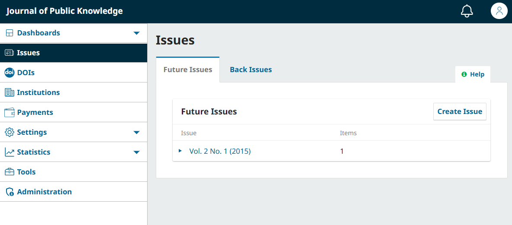
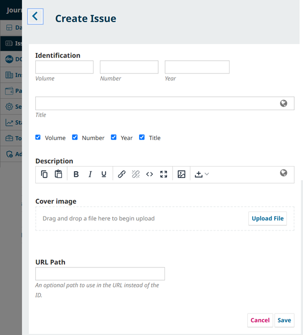
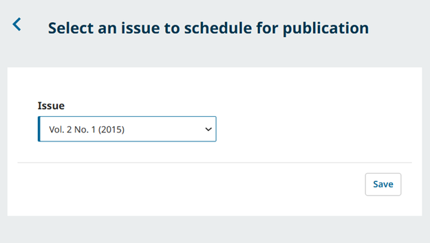
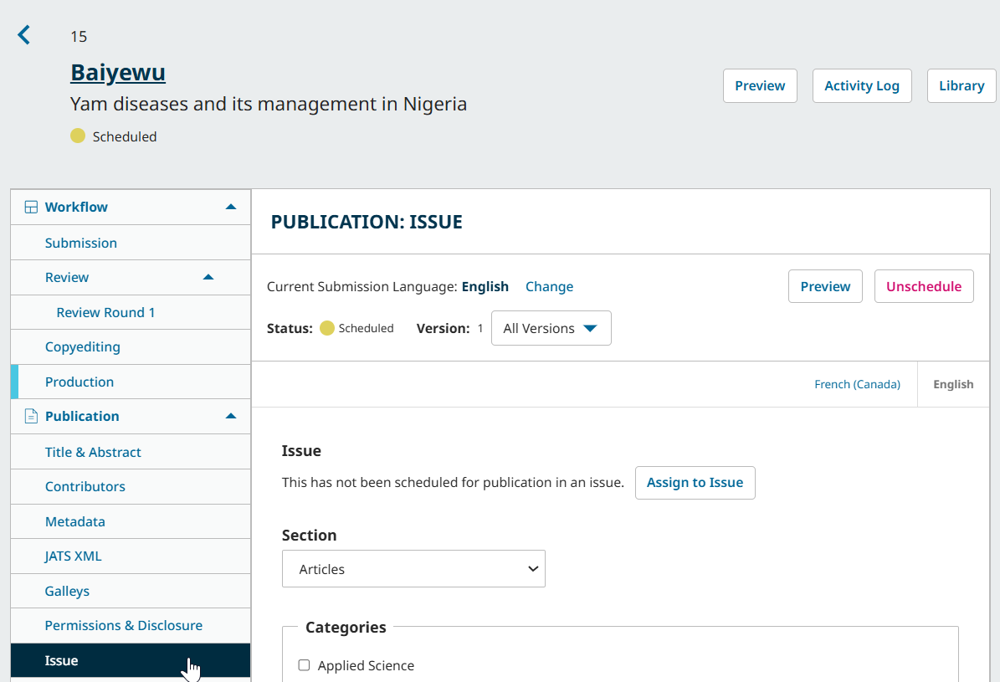
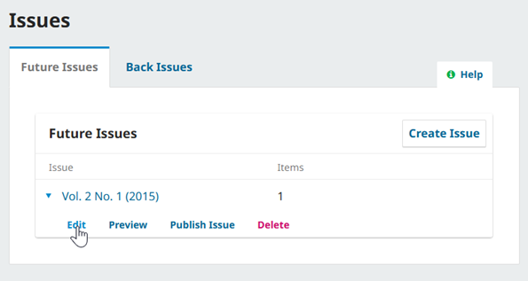
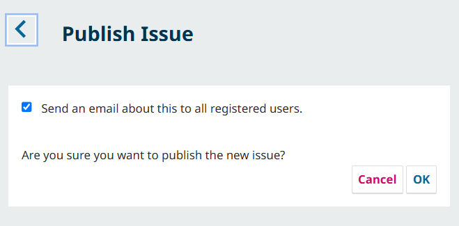
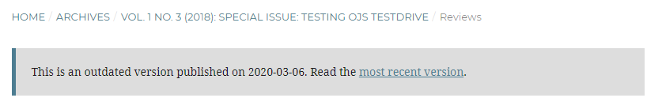

# Publication & Post-Publication: Create and Publish Issues {#publication}
After the submission has gone through all four stages in the workflow, it is ready to be published.

In this chapter, we will explain:
* How create an issue
* How to edit the metadata of an issue (key information such as title, cover image, etc.)
* How to schedule an article for publication
* How to add an article to a category

The role involved in this stage is typically a Journal Manager or Journal Editor.

## Create an Issue {#create-issue}

OJS works by allowing Editors to create issues, then scheduling select articles for publication in issues. Once an issue is published, all articles scheduled to that issue will be available online. 

From the left menu, select Issues to manage all of the issues for your journal.

You will see two tabs:
* **Future Issues**: Lists all unpublished issues. You can create as many of these as you wish, and schedule submissions to any of them.
* **Back Issues**: Lists all published issues.

To create a new issue, click the **Create Issue** button on the Future Issues tab and fill in the relevant fields.

Enter volume, number, year, and title information (e.g. “Special Issue on Topic”). If you don’t want to enter information for one of these fields, uncheck it in the list below the fields.

You can also add a description and cover image. These will appear at the top of the issue page on your site.

Lastly, you can optionally specify a unique URL path for the issue.

>Generally, object IDs are used in the URL of an issue or article, for example: workshop.publicknowledgeproject.org/index.php/plan-s/issue/view/**41**
>
> In this example, **41** is the object ID. We could enter “vol-01” in the URL path, which would result in the following URL for our galley: workshop.publicknowledgeproject.org/index.php/plan-s/issue/view/**vol-01**

When you’re finished, click **Save**.

Issues can be further edited and managed, but first, you’ll want to add the submissions you want to publish.

## Schedule Articles for Publication {#schedule-article}

Now that you have an issue to act as a container for the articles you want to publish, you can schedule your articles.

Access the submission record for an article you wish to schedule for publication, and click the Schedule for Publication button from the list of actions. This will bring you to the Title & Abstract screen of the Publication menu, where you can make any last-minute changes before clicking Schedule for Publication once again.

Choose your desired issue from the dropdown menu and click Save. 

> You can choose a future issue or choose a back issue to immediately publish the content in an issue that is already online.
{:.tip}

> If you choose the wrong issue, click the Issue item under the Publication menu to change it.

### Finalize Scheduled Article Details: Specify Section, Category, Publication Date {#schedule-details}

Lastly, you may wish to change details about the article’s publication, such as the section of the issue, associated category, publication date, article cover image, and more. 

> Note: If the issue containing the article has already been published, it will need to be unpublished before you can edit these details. Click Unpublish at the top right of the window, make your changes, and click Schedule for Publication to publish it once again.
{:.warning}

Click the Issue item under the Publication menu.

Here you can edit the following:
* **Issue**: Change the issue the article has been assigned to.
* **Section**: Choose the section the article should belong to.
* **Categories**: Choose one or more categories the article should belong to. This option only appears for journals with categories enabled. Read more about categories in [Learning OJS for Journal Managers](../journal-managers).
* **Cover Image**: Upload an optional cover image for the article. This will display in the issue’s table of contents.
* **Pages**: Enter an optional page range corresponding to the articles. This generally corresponds with the pages of the article in a full issue galley or print version of the issue.
* **URL Path**: Enter an optional custom URL path to use in place of the article ID.
* **Date Published**: Enter a custom publication date for the article. A backdate should only be used if the article was previously published elsewhere. Enter a future date to schedule the article to be published to the specified issue on that date. (The future dated publication date will not change if the submission is unscheduled from the issue.)

Click Save to record your changes.

## Manage and Publish Issues {#manage-issue}

Once you have added all articles you wish to publish to an issue, you will return to the Issues menu.

Click the blue arrow next to the relevant issue to reveal the options to Edit, Preview, Publish Issue, or Delete.

### Edit an Issue: Order Table of Contents, Add Issue Galley {#edit-issue}

Click Edit to ensure all issue details are correct before publishing, or to edit the details of a published issue.

The Edit menu contains four tabs:

**Table of Contents**: All published or scheduled articles are listed in this tab. Click the blue arrow next to a submission to reveal links to view the submission record or remove the submission from the issue.

You can also use the Order button to organize the articles and sections. Drag and drop the articles to the desired place or use the arrows to move the article or section up and down the list, then click Done to confirm.

**Issue Data**: Edit the volume, issue, number, and other data you entered when first creating the issue.

**Issue Galleys**: This allows you to upload galleys for the complete issue – e.g., a PDF containing all articles. This will be linked from the issue landing page.

### Preview the Issue {#preview-issue}

Select the Preview option to view the issue as it will appear to readers before publishing. In addition to previewing the issue page and its table of contents, you can click each article and galley in the preview to view. Use this to ensure all details of your issue are in order before publishing.
### Publish Your Issue {#publish-issue}

Once you are satisfied, click the **Publish Issue** link to publish the issue on your OJS website. 

In addition to confirming the publication, you will be presented with an option to send a notification to users about the new issue.

If you **do not** want to send a notification, uncheck the box beside “Send notification email to all registered users” before pressing **OK**.

> The content of the announcement is generated automatically and cannot be edited. Consider using the [Announcements feature](URL) to send a publication announcement with customized content.
{:.tip}

Your newly published issue will now be available as the Current Issue on your journal’s site. Congratulations!

### Unpublish or Delete an Issue {#unpublish-delete}

Articles in the Back Issues tab will have an option to **Unpublish Issue**. Use this to remove the issue and all of its content from public view. The issue will return to the Future Issues tab. 

You can also use the **Delete** link to remove the issue entirely. Not only will this unpublish a published issue, but it will delete all information about the issue. Assigned articles will not be deleted, but will be returned to the Production stage.

## Post-Publication Tasks: Versioning and Statistics {#postpublication}

Once you have published your content online, you may need to make substantial changes to published articles (e.g. retractions, amendments, etc.) or track statistical information about published content. 

This section teaches Journal Managers and Journal Editors how to effectively version articles and track article statistics. 

### Use Versioning for Substantial Changes to Published Content {#versioning}

Once an article is published, neither its metadata nor galleys can be edited. 

While articles can be unpublished and republished for small corrections to galleys metadata, e.g., misspellings, formatting errors, etc., we **strongly recommend** creating a new version of the article if a substantial change is needed.

A substantial change might include:
* Retracting an article
* Adding or removing significant content to the article text
* Adding, removing, or editing information that changes the findings, meaning, or significance of the article
* Adding or removing previously uncredited/credited contributors

To create a new version of a submission, navigate to the submission record of a published submission and access any item in the Publication menu. Click the “Create New Version” button. You will now be able to make any changes necessary before clicking “Publish” to publish the new version.

> If scheduled into a published issue, the new version will be immediately available. No notification is sent for new versions. If you need to communicate with readers about the changes, consider using the [Announcements feature](URL).

The current version will be clearly displayed at the top, along with a dropdown to view previous versions. Each version is identified by a number and date published (or the “Unpublished” label if not yet published). 

#### How Versions Appear to Readers {#version-view}

When an article has multiple versions, the list of prior versions and the dates they were published will be listed on article page.

Readers will be able to access previous versions. They will see a message on the article and galley pages advising them that it is an outdated version and pointing them to the most recent version.

Example of an outdated version message on the article page:

Example of an outdated version message on the PDF galley page:

The article URL will always point to the most recent version, with earlier versions being available at the same URL with the version at the end of the URL (e.g. /version/1234/).

#### DOIs and Indexing of Versions {#version-dois}

If a DOI was assigned to the original version, it will not be changed automatically. Previously deposited CrossRef metadata will not be automatically updated. If article metadata was changed, we recommend updating CrossRef metadata in the CrossRef XML Export Plugin by manually depositing the updated article. For instructions on how to manually deposit an article see the PKP’s [CrossRef Plugin Guide - Manual Deposits](https://docs.pkp.sfu.ca/crossref-ojs-manual/en/config#manual-deposits).

Indexing services and repositories that use OAI to harvest metadata will need to harvest the article metadata again in order to update to the new version.

The new version will be tagged properly to be recognized and updated by Google Scholar's index, but the harvester will need to visit your site again in order to find the new version.

### Capture Statistics {#statistics}

Updated information on statistics will be available here at a later date. For now, you may wish to consult the [Learning OJS 3.4 chapter on statistics](https://docs.pkp.sfu.ca/learning-ojs/en/statistics) to learn how to view and manage statistics about articles and readership.

