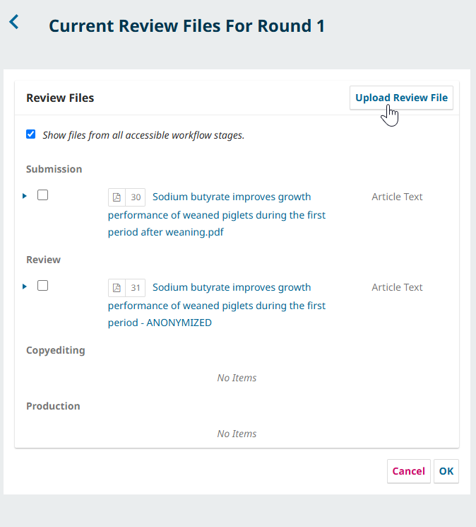
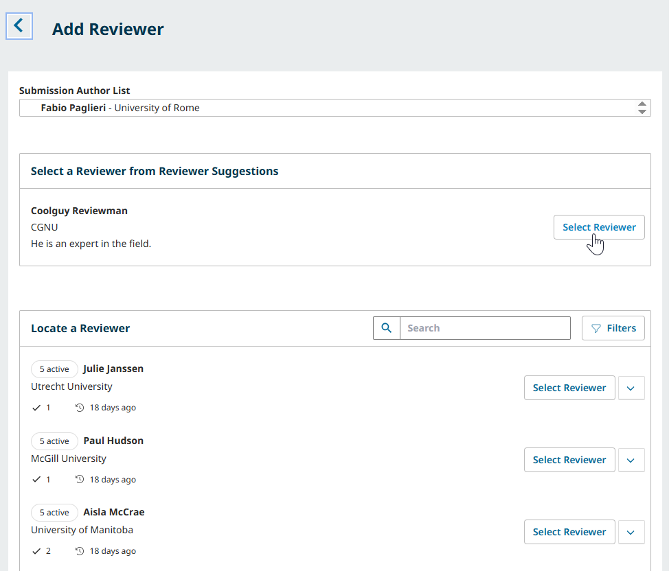
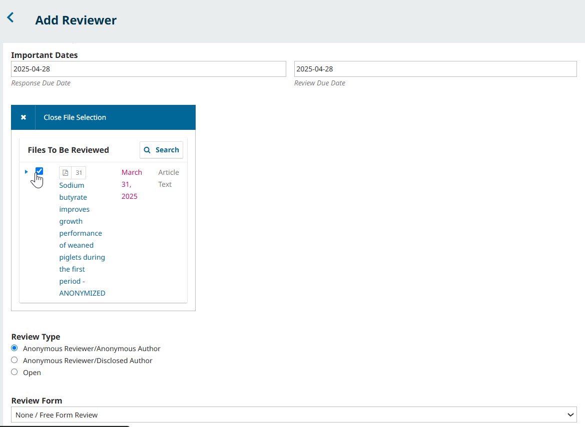
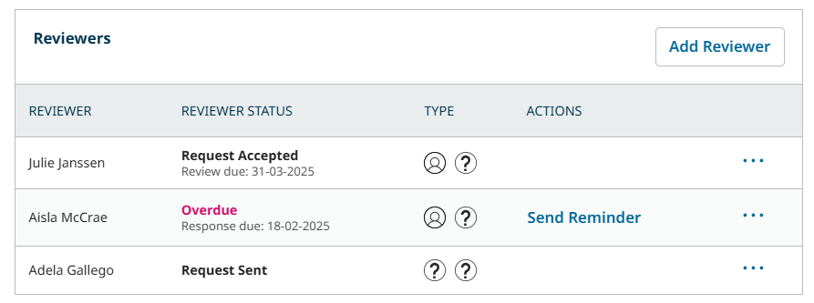
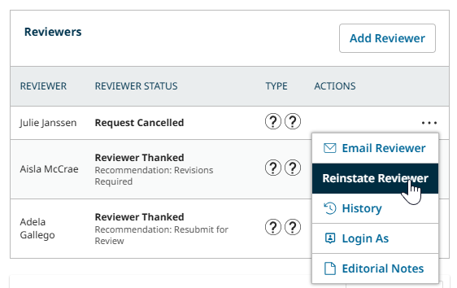
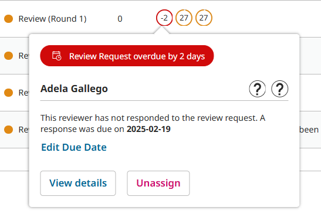
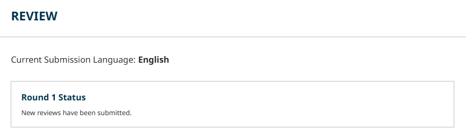
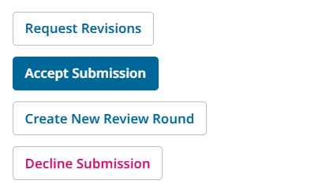
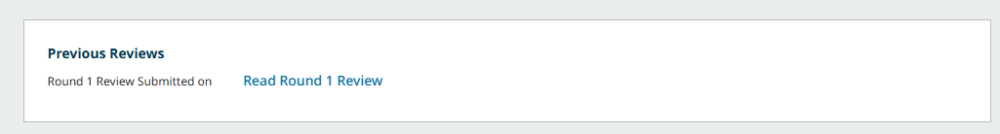

# The Review Stage: Assign Reviewers and Make an Editorial Decision

The second stage of the Editorial Workflow is the Review stage. Editors can choose to move a submission to this stage to receive peer review.

In this chapter, we will explain:
* How to prepare files for review
* How Editors can assign reviewers and track the status of reviews
* How to open a new review round
* How to request revisions from an author
* How to make a final editorial decision

The roles involved in this stage are typically: Editors, Reviewers, and Authors.

If you are an author who has been asked to submit revisions, please view [Learning OJS for Authors](../../author/en). If you are a reviewer tasked with completing a review in an OJS journal, please view [Learning OJS for Reviewers](../../reviewer/en).

## Prepare Files for Review {#prepare-for-review}

OJS is able to accommodate different types of reviews and has built-in steps to ensure anonymity, but it is the responsibility of the Editors to ensure the anonymity of reviewers and authors as required.

>Note: All participant information will be visible to Editors regardless of the type of review selected. 

Although the type of review be automatically selected based on what has been configured by the Journal Manager, editors can also choose from the following review type options when sending review requests:

* Anonymous Reviewer/Anonymous Author:  The identity of both the author and the reviewer is kept hidden.
* Anonymous Reviewer/Disclosed Author: The identity of the author is known to the reviewer, but the identity of the reviewer is kept hidden.
* Open: The identities of the author and reviewer are known.

If you select Anonymous Reviewer/Anonymous Author, you will need to ensure that identifying information has been removed from the files for review.

### Remove Identifying Information {#anonymize-info}

While OJS protects the information of anonymous authors and/or reviewers within the system, additional steps are often needed to fully anonymize a submission. 

In addition to author names being included in title pages, article text, footnotes, references, and other areas of the document, the software used to draft the submission files may include information that could identify the author(s) within the document properties.

Depending on your journal’s policy, authors may be required to submit anonymized submission files, or you as the assigned editor may be required to anonymize the submission files yourself.

If you need help anonymizing a Microsoft Word file or PDF, please view this [instructional PDF on Anonymizing files from Evidence Based Library and Information Practice](https://journals.library.ualberta.ca/eblip/index.php/EBLIP/libraryFiles/downloadPublic/7).

### Upload the Anonymized Document {#upload-anonymized}

If you have anonymized a document for your reviewers, you can upload to the the Review files by clicking **Upload/Select Files** in the _Files for review_ section of the central panel.

Click **Upload Review File**. You can use the “Show files from all accessible workflow stages” to access files from other stages.

Use the “Article Component” dropdown to indicate the type of file, click Upload and select your file, then click Continue.

On the Review Details screen that appears next, you can rename the file before continuing and confirming the upload. The file can also be renamed later by clicking the three dot icon on the right side of the file name in the _Files for review_ section and selecting Edit.

Now that you have the files for review ready, you can assign reviewers.

> Note: If your Reviewers will be providing files that could potentially contain identifying information in an Anonymous Reviewer/Anonymous Author or Anonymous Reviewer/Disclosed Author review, such as a Microsoft Word document with comments or tracked changes, you may wish to advise them 

## Assign Reviewers {#assign-reviewer}

When the submission enters the Review stage, a notification indicates that Reviewers need to be assigned. You can also see which submissions in the Review stage require reviewer assignments from the “Needs reviewers” Dashboard view, or the presence of the “Assign Reviewers” button under the Editorial Activity column of other Dashboard views.

Click the “Assign Reviewers” button to jump directly to the Add Reviewer screen, or open the relevant submission record to find the “Reviewers” section in the central panel and click “Add Reviewer”.

This will open a new window listing Reviewers for selection, with details such as their affiliation, number of active reviews, and the number of days since they were last assigned a review. If the Author suggested any potential Reviewers, they will also be listed here for your consideration.

> As seen in the screenshot above, Editors who have been assigned to the submission in a capacity that allows them to see the author’s identity will not be immediately selectable for review. If you would like to assign yourself or another Editor as a reviewer, you can click “Unlock” next to the warning to reveal the option to select them.
{:.notice}
 
Clicking on the blue arrow reveals more information about their review history, including how many active reviews they are currently assigned, how many reviews they have completed or declined, etc. If the user has added a Biography or Reviewing Interests, this information will also be displayed.

> Journal Editors can also add private Editorial Notes. This note will appear in the reviewer details on the Add Reviewer screen, but will not be visible to the reviewer or non-Editor roles.

In addition to the “Select Reviewer” option beside each Reviewer, you can scroll down to the bottom of the list to find options to:

**Create New Reviewer**: You can use this button to register a brand new account to the system as a Reviewer. Use this when you would like to invite someone who is not currently registered to be a reviewer.

**Enroll Existing User**: You can use this search for an existing user who is not currently a Reviewer. This will grant them the Reviewer role.

In this case, we will select one of our existing reviewers using the “Select Reviewer” button.

This will open a new window where you can see the selected Reviewer, edit the prepared email notification for the Reviewer, set a due date for the response to the review request, set a due date for completion of the review, select files for review, and specify the review type.

Choose a Response Due Date to specify when the reviewer must accept or decline the invitation to review, and choose a Review Due Date to specify when the review must submit their review.

Click the “Files to be Reviewed” button and make sure that all files relevant to the review have been selected. Make sure that only anonymized files are selected if the author’s identity is not disclosed.

By default, Reviewers will be provided with an extended text box to type in their comments. However, Journal Managers or Editors may also provide review forms through the Review Form feature. (Read [how to configure Review Forms in Learning OJS for Journal Managers](URL).) Select the form under the **Review Form** dropdown to provide it to the Reviewer.

Click the **Add Reviewer** button to send the message and send the assignment request to the Reviewer.

## Manage Reviewers {#manage}

Once you have added your reviewers, they will appear in the Reviewers section. This is where you can easily determine the status of your current review assignments and make changes.

The Reviewers section shows:
* The name of the reviewer
* The status of the review request and relevant deadlines
* Icons indicating the type of review - a question mark indicates an anonymous party. In this case, the first two reviews are disclosed author/anonymous reviewers, and the last review is anonymous author/anonymous reviewer)
* Actions allowing you to send reminders when applicable
* The three dots menu allowing you to edit review assignments.

Clicking the three dots menu will reveal more options for managing review assignments:

**Review Details**: View review details. Here you can view any files, comments, discussions, and decisions shared between you and the reviewer. You can also rate the Reviewer.

**Email Reviewer**: Allows you to send an email to the Reviewer.

**Edit**: Allows you to edit the request response or review due dates, review type, and files to be reviewed.

**Cancel/Unassign Reviewer**: You can unassign a reviewer if they have not accepted the review assignment. If they have accepted the review, they can be canceled as a reviewer. You will be prompted to send an email to the Reviewer notifying them of the change when choosing to unassign or cancel a reviewer.

When a Reviewer is cancelled, their name will remain on the Reviewers list while being marked as "cancelled".

> Cancelled reviews will be recorded in the Reviewer’s stats.
{:.notice} 

**Reinstate Reviewer**: This action will appear in the menu for cancelled reviewers. If they previously accepted the review assignment, they will automatically be reinstated. If they previously declined the assignment, they will need to accept this new invitation.

**History**: Provides a brief history of the review.

**Editorial Notes**: Journal Editors can add private Editorial Notes about reviewers. This note will appear in the reviewer details on the Add Reviewer screen, but will not be visible to the reviewer or non-Editor roles.

**Login As**: This option will appear for Journal Managers.

> Note: All actions taken when logged in as another user will be logged.
{:.warning}

## Cancel a Review Round {#cancel}

The “Cancel Review Round” button will appear in the actions menu when there are no reviewers assigned. Unassign or cancel all reviewer assignments to cancel a review round. 

> If this is the first and only review round, the submission will return to the Submission stage.
{:.tip}

## Track Review Status from the Dashboard {#track-reviews}

If you are tasked with multiple submissions in the review stage, you can use the dashboard to easily assess the status of each review.

Use the following Dashboard views to manage your reviews:
* **All in peer review**: View all submissions in the review stage.
* **Needs reviewers**: View all submissions with no reviewers assigned. 
* **Awaiting reviews**: View all submissions with reviewers assigned, but no completed reviews.
* **Reviews submitted**: View all submissions with some or all reviews submitted. 

Additionally, the icons that appear in the Editorial Activity column will help you understand the status of each review assignment. Let’s look at the example below.

Each circle icon in the Editorial Activity column corresponds to a review assignment. The possible icons are:
* **Yellow Circle with Number**: The number inside the circle represents the number of days remaining before a review response is due.
* **Outlined Red Circle**: The number inside the circle represents the number of days that a response to a review request is overdue.
* **Pink Circle with Circle-Slash Symbol**:  Represents a declined review request.
* **Pink Circle with X Symbol**:  Represents a cancelled review.
* **Outlined Blue Circle**: Represents an ongoing review. The number represents the number of days remaining until the review is due.
* **Filled Red Circle**: The number inside the circle represents the number of days that a review is overdue.
* **Green Mail Symbol**: The reviewer has submitted their review and recommendation, but an Editor confirmation is required.
* **Green Checkmark**: Used for reviews that have been confirmed by an Editor.

You can click a circle icon to view more details and relevant options for completing the task. In the sample below, we have a review request that is overdue. We can adjust the due date, unassign the reviewer, or view the details of the review.

## Respond to a Review {#respond}

Once the Reviewers have completed their work, you will need to view the results of their reviews. In addition to a notification to your Tasks and the envelope icons on your Dashboard view, you will also find a notice on the submission record when a new review is submitted.

Use the _Read Review_ link beside the reviewer’s name in the Reviewers panel to read the comments from the Reviewers, as well as any attached files.

You can use the discussion option if you would like to further communicate with the reviewer about the review.

When you are ready to accept the review, click _Confirm_ at the bottom of the screen. The review will now be marked as complete in the Reviewers section.

You will also find new options:
* **Thank Reviewer**: Select this option to send a thank you email to the reviewer.
* **Revert Decision**: Select this option to unconfirm the review and restore the Read Review option.

## Make an Editorial Decision {#make-decision}

After confirming all Reviewer recommendations, you can use the action buttons to make a decision.

Options include:

**Request Revisions**: Use this to request revisions (changes to the submission) from the author. You will be able to choose whether the revised submission will require a new round of review. (However, regardless of your selection, you can always manually open a new round of review later.)

**Accept Submission**: Use this to accept the submission without further revisions. This will move the submission to the Copyediting stage.

**Create New Review Round**: Use this to open a new review round. You can open as many review rounds as necessary to come to a decision. 

**Decline Submission**: Use this to decline the submission. This means the submission has not passed peer review and is unsuitable for further consideration. The submission will be moved to the Declined dashboard view visible only to Editors.

> To revert a decision to decline, locate the submission in the Declined dashboard view and open the submission record. You will find the option to Revert Decline in the action list. This will restore the submission to the previous stage.
{:.notice}

### Accept Submission and Send to Copyediting

Choose Accept Submission to open the Accept Submission window. You will be prompted to send a notification to the author. Use the suggested email template, or choose a different email template using Find Template on the left. 

> If the journal requires Article Processing Charges, the prompt to request or waive the fee will appear in an additional screen before author notification. Payment details can be accessed at any time from the Payments button on the submission record.

In the next step, you can optionally notify reviewers of the decision. 

Lastly, you will choose the files to be copyedited in [the next stage](./copyediting.md).

### Request Revisions

Choose Request Revisions to open the Request Revisions window. You will first need to decide if the revised manuscript requires another round of revisions.

In the next screen, you can notify the author using the suggested email template, or choose a different email template using Find Template on the left. 

Next, you can optionally notify reviewers of the decision. Finally, hit “Record Decision” to send the message.

You must now wait for the Author to respond with their revisions.

#### Respond to Revisions

Once the Author has made the revisions, you will be notified via email, the Editorial Activity column of your Dashboard view, and potentially through discussion activity.

You can now access the revised file in the Revisions submitted section of the submission record.

After reviewing the revisions, you can:
* Use Discussions to further communicate with the author
* Assign Reviewers for a new round of review
* Make a final editorial decision

### Open a New Round of Review

You can open as many review rounds as necessary to come to a decision. You may also choose to subject a revised manuscript to a new round of review.

> Note: It is recommended that you open a new round of review **after** an author has uploaded their revisions. Otherwise, authors may not be able to upload their revisions to the correct round.
{:.warning}

To start an additional round of review, click the **Create New Review Round** action.

You will be prompted to send a notification to the author. Use the suggested email template and edit or attach any relevant files as needed, or choose a different email template using Find Template on the left.  

Next, you will choose the file(s) to be reviewed in the new round.

You will only be able to select from files included in the Revisions Uploaded section of the submission record. If you require files from the previous round, upload them to the Revisions Uploaded panel before opening the new review round.

A new round will be added under Review in the Workflow menu.

You can now assign Reviewers just as you did in the previous round. You can assign the same reviewers or different reviewers. Proceed until you are able to make a decision to decline or accept the submission.

Previous reviews from earlier rounds will be provided to Reviewers for their reference. You can see how this will appear to Reviewers below.

> Read [Cancel a Review Round](./#cancel) to learn how to cancel a round after it has been started.
{:.notice} 

