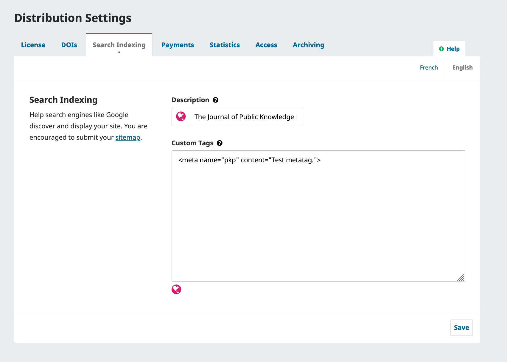

# Archiving and Search Engine Optimization

In this chapter, you'll explore settings related to preserving your journal content and making your journal findable by search engines. Discoverability and impact is very important for journals. While we'll only cover basic configurations here, we recommend checking out [Introduction: Getting Found, Staying Found, Increasing Impact: Enhancing Readership and Preserving Content for OJS Journals, Second Edition](https://docs.pkp.sfu.ca/getting-found-staying-found/en/) to develop your strategy once you've published some content.

## Archive Your Journal {#archive}
OJS allows journals to preserve their content in archiving networks including [LOCKSS](https://www.lockss.org/), [CLOCKKS](https://clockss.org/), and the PKP Preservation Network (PN). Activate your journal in these archive networks by clicking “Distribution” under the Settings menu in the sidebar and navigating to the Archiving tab.

This PKP School video explains how to enable archiving in OJS. To watch other videos in this series, visit [PKP’s YouTube channel](https://www.youtube.com/playlist?list=PLg358gdRUrDVTXpuGXiMgETgnIouWoWaY).



If you are a member of a LOCKSS or CLOCKSS network, use this tab to activate your journal. 


If you are interested in using the PKP PN Plugin to deposit your content in the PKP Preservation Network (PN), see the [PKP Preservation Network Guide](/pkp-pn/en/).

## Set up Search Engine Optimization {#seo}

Journal managers can configure search engine optimization by clicking “Distribution” under the Settings menu in the sidebar and navigating to the Search Indexing tab.

This PKP School video explains how to enhance search indexing in OJS. To watch other videos in this series, visit [PKP’s YouTube channel](https://www.youtube.com/playlist?list=PLg358gdRUrDVTXpuGXiMgETgnIouWoWaY).



This is where you can enter information to make your content more discoverable to search enginers.



Use **Description** to provide a brief description of your journal for search engines.

Use **Custom Tags** to add custom HTML header tags to the header of every page of your journal, which can help your site get indexed by search engines. Tags **must** be added as HTML elements or they will display improperly. Here is an example of HTML formatted-tags that could be entered in this field:

```html
<meta name="description" content="The Journal of Public Knowledge. Publication of the Public Knowledge Project - PKP and Simon Fraser University - SFU" />
<meta name="keywords" content="open access, scholarly publishing, open source software, non-profit organizations, scholarly journals, free software" />
<meta name="author" content="metatags generator">
<meta name="robots" content="index, follow">
<meta name="revisit-after" content="3 month">
```

Learn more about [HTML meta tags from W3Schools](https://www.w3schools.com/tags/tag_meta.asp).

