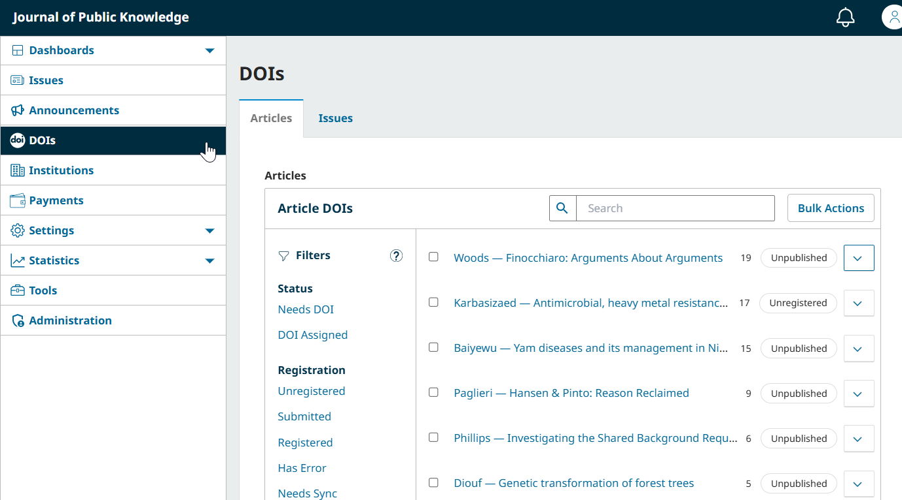
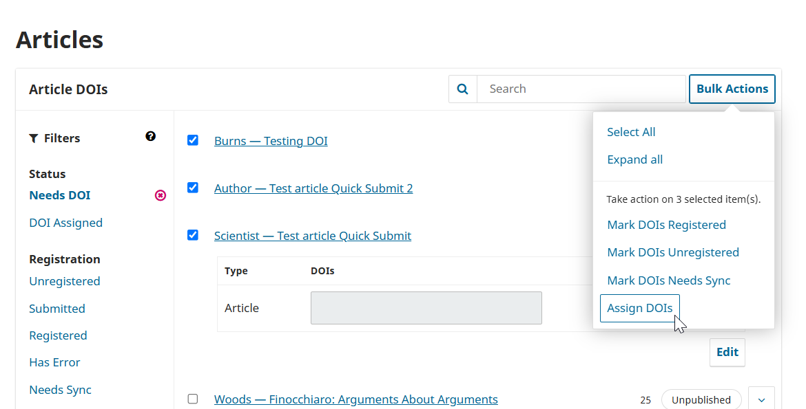
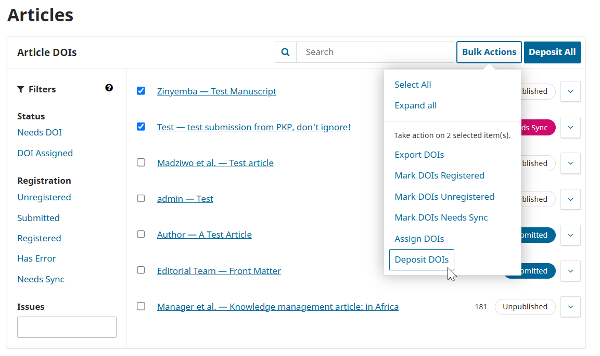
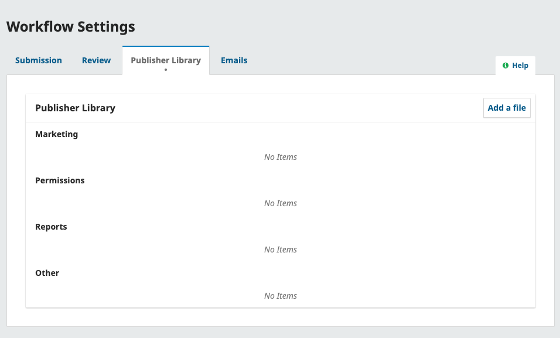
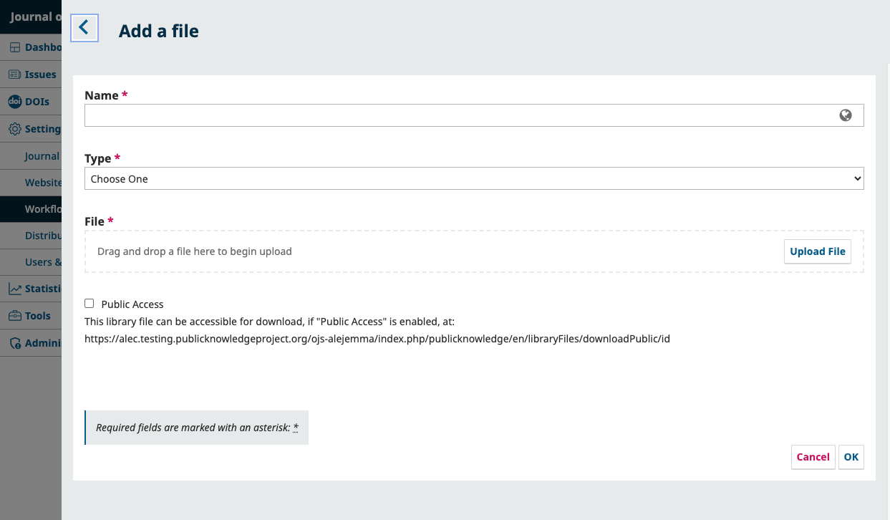

# Other Useful Tools
There are some additional tools to explore that may be useful as you start publishing. This chapter will cover:
* DOI configuration using the DOI management tool.
* Import/export tools for moving users and published content between journals
* Using the Publisher Library for frequently used documents

## Configure DOIs {#dois}

> New in OJS 3.4 and 3.5: DOI management is now a core feature, replacing the DOI plugin.
{:.tip}

You may wish to register Digital Object Identifiers (DOIs) to your journal’s content. To learn more about DOIs and DOI Registration Agencies, see PKP's documentation on [Digital Object Identifiers](https://docs.pkp.sfu.ca/doi-plugin/en/chapter1).

> To use DOIs, you’ll need to be a member of a DOI registration agency such as Crossref, DataCite, or mEDRA.
{:.notice}

### Step 1: Configure DOI Settings {#doi-settings}
First, navigate to the “DOIs” tab under Settings > Distribution in the sidebar.

Under the “Setup” section, you’ll choose the content that will be assigned DOIs, and specify details about DOI assignment.

**DOIs**: Click “Allow DOIs to be assigned to work published in this journal”. This will add the DOIs menu item to the left hand sidebar and reveal additional settings.

**Items with DOIs**: Select the content in your journal that should receive DOIs. You can select from Articles, Issues, and Galleys (i.e.. PDFs, images, and other files associated with an article).

**DOI Prefix**: Enter the prefix assigned to you by your chosen DOI registration agency. 

**Automatic DOI Assignment**: Choose if and when DOIs should be automatically assigned. You can choose to have them automatically assigned at the copyediting stage, upon publication, or never.

**DOI Format**: Choose a format for your DOIs. Journals should select Default unless their specific situation requires a manually selected format or custom format.

Next, navigate to the “Registration” section under the DOIs tab.

> The registration tab requires one or more registration agency plugins enabled, such as the CrossRef Manager Plugin, Datacite Manager Plugin, or Medra Manager Plugin. For information about installing and enabling plugins, read the [Plugin Guide and Inventory](https://docs.pkp.sfu.ca/plugin-inventory/en/#introduction).
{:.notice}

Here, you can select your chosen registration agency. Click “Enable automatic depositing” if DOIs should be automatically submitted to the registration agency, then follow the directions in the software to enter your membership credentials.

### Step 2: Assign and Manage DOIs {#assign-dois}

To manage and assign your DOIs, click the DOIs item in the sidebar menu.

 

From here, you can see the status of all Article, Issue, or Galley DOIs by navigating to the relevant tab. 

The filters on the left side of the window will help you manage your DOIs. In this step, we will focus on the two Status filters - **Needs DOI** and **DOI Assigned**. Click **Needs DOI** to only display articles that do not yet have a DOI assigned.

To assign DOIs, click the checkbox next to any articles you wish to assign DOIs to, click the “Bulk Actions” button, then choose Assign DOIs. You can also click the “Bulk Actions” button and choose “Select All” to select all articles on the screen.

Confirm that you wish to assign the DOIs. To view a DOI, locate the article using the Search or filters, and click the blue arrow button.

> It is also possible to edit or manually enter a DOI by clicking the Edit button next to the DOI field. **This is generally not recommended**, unless you are associating an existing DOI with previously published content you have moved to OJS. 
{:.notice}
### Step 3: Deposit Your DOIs {#register-dois}

Lastly, you’ll register your DOIs with the registration agency. This is known as “depositing” DOIs. This may not be necessary if you have configured automatic depositing in Step 1, but can be useful for troubleshooting any failed automatic deposits.

Use one or more filters under the registration heading to locate relevant articles:
**Unregistered**: Items with DOIs that have not been submitted.
**Submitted**: Items with DOIs that have been submitted, but may not be operational yet. Please allow the process time to complete.
**Registered**: Items with functioning DOIs.
**Has Error**: Items that were submitted, but returned an error. These items may need metadata such as title, abstract, author details, etc. to be adjusted to ensure valid information is being sent to the registration agency.
**Needs Sync**: Items that should be resubmitted to update the record with the registration agency.

To deposit DOIs, click the checkbox next to any articles you wish to deposit, click the “Bulk Actions” button, then choose Deposit DOIs. You can also click the “Deposit All” button to deposit all unregistered items.

Confirm that you wish to deposit the items, and their status will be updated to “Submitted”. When the task completes and the DOIs are functional, the status will update once again to “Registered”. 

## Use Import/Export Tools {#import-export}

Selecting Tools from the sidebar menu allows you to access import and export tools. These can be useful for exporting XML files for specified indexers, or for exporting and importing users and articles from other OJS installations.

## Use the Publisher Library for Documents {#publisher-library}

Journal Managers and Editors may upload frequently used documents to share with other Editorial board members in the Publisher Library. Any document added in this area will be visible within a user’s Document Library in their manuscript’s Submission Library.

You can also upload a file here that you would like to be publicly accessible via a URL, which you can link to from other parts of your site, including the author guidelines, submission checklist, or a static page.

Suggested forms that can be uploaded in this area can include the galley approval form, supplemental material cover page, and other forms related to your journal's workflow.

This PKP School video explains how to use the Publisher Library in OJS. To watch other videos in this series, visit [PKP’s YouTube channel](https://www.youtube.com/playlist?list=PLg358gdRUrDVTXpuGXiMgETgnIouWoWaY).



To access the Publisher Library, navigate to Settings > Workflow, and choose the “Publisher Library” tab.

To add a file, click ‘Add a file’ on the top right corner of the Publisher Library box.

**Name**: Enter a title for the document to identify it from the list of documents.

**Type**: Select a type from Marketing, Permission, Reports, or Other.

**Public Access**: Enabling this will allow users to download this file using the provided URL.
