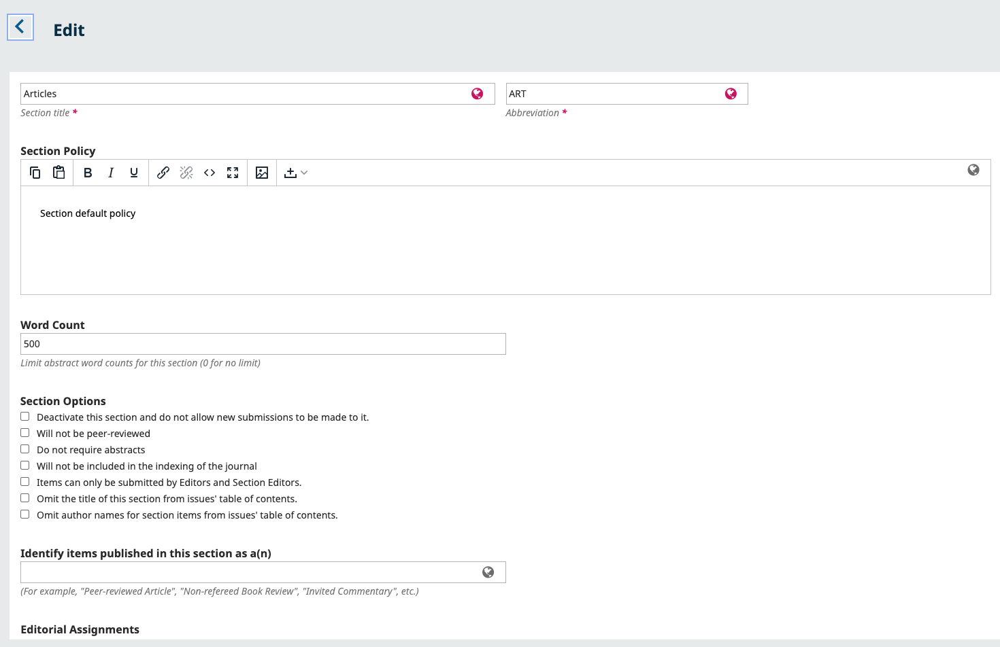
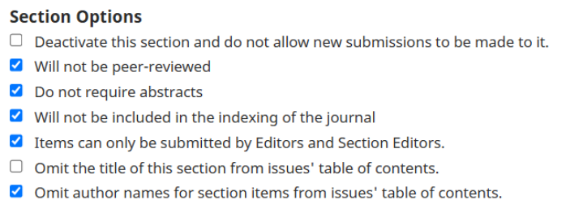
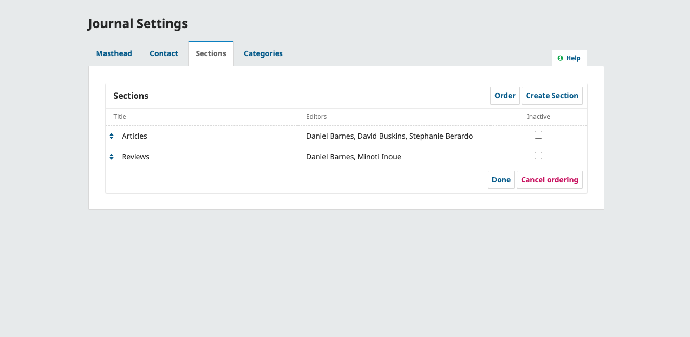
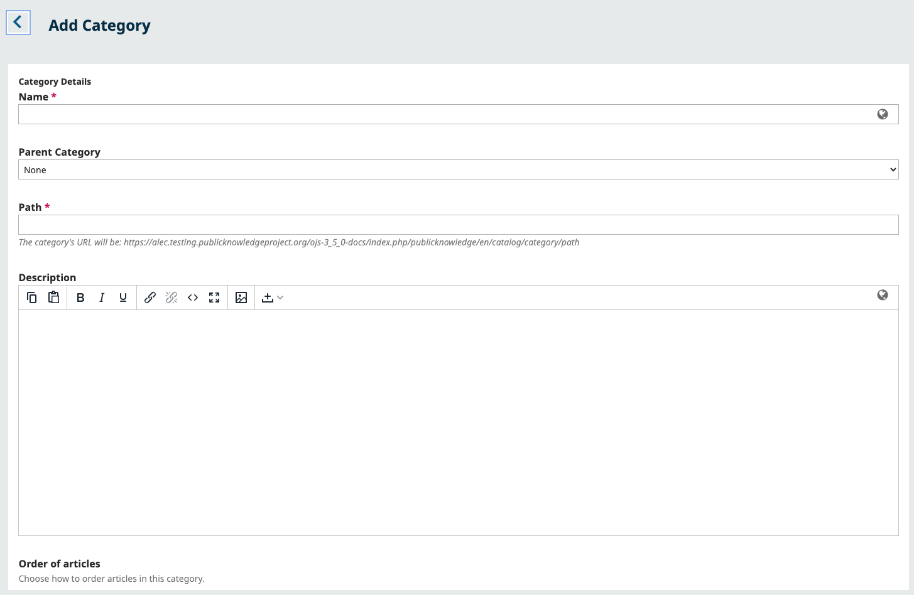
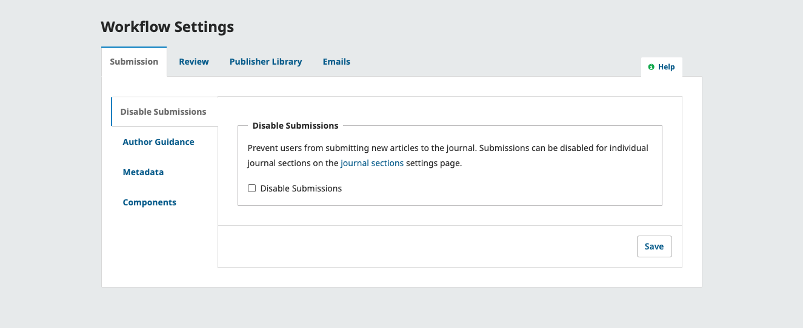
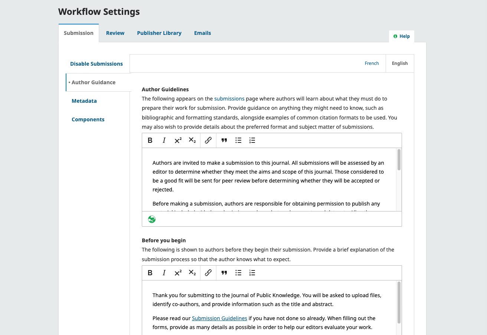
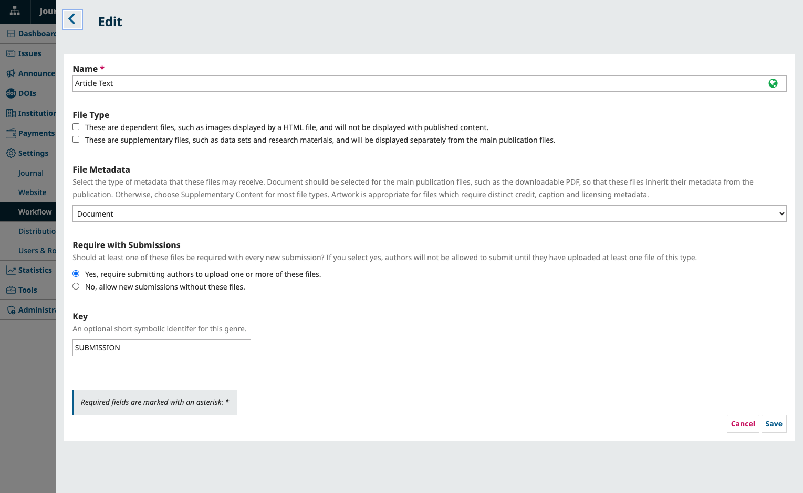
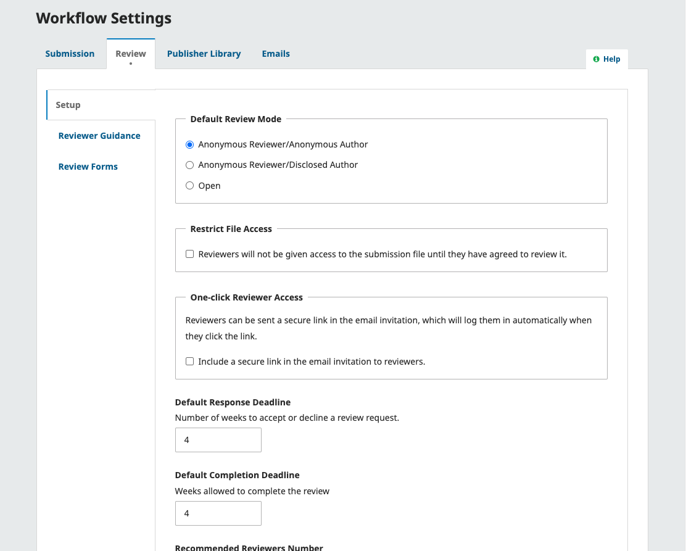
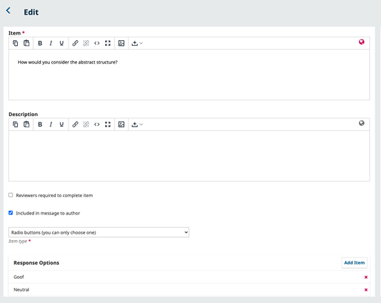
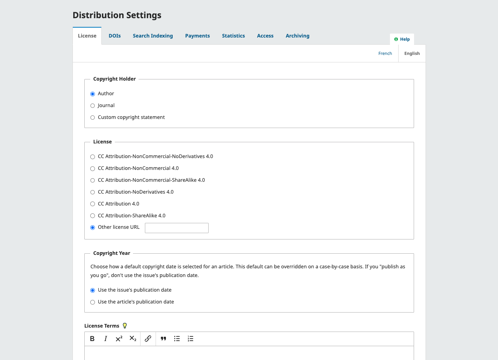

# Configure Your Submission, Review, and Licensing Policies
In this section, you’ll perform setup related to receiving peer-reviewed submissions. This includes:

* Configuring submission settings
* Setting up journal sections
* Disabling/enabling submissions
* Preparing submission guidelines
* Defining what kind of information authors should provide about their submissions
* Defining what kind of files authors can include with their submissions
* Configuring peer review settings
* Adding review guidelines
* Adding review forms (rubrics)
* Configuring copyright and licensing terms.

## Configure Submission Settings and Author Guidelines {#submission-settings}

First, we’ll explore the settings that allow you to control what types of content are submitted to your journal, as well as provide guidance to authors to ensure they adhere to your journal’s submission policies.

### What Content Does Your Journal Publish?: Creating and Editing Journal Sections {#sections}

Before letting authors submit to your journal, you may want to organize the sections of your journal to correspond to the types of content you’ll be publishing. Sections (such as Articles, Editorials, Reviews, etc.) will appear for an author to select when they make a submission. They are also used to organize the articles in your published issues. You can also assign editors to specific sections. 

This PKP School video explains how to configure Sections in OJS. To watch other videos in this series, visit [PKP’s YouTube channel](https://www.youtube.com/playlist?list=PLg358gdRUrDVTXpuGXiMgETgnIouWoWaY).



Navigate to the **Sections** tab under **Journal Settings** to configure the different sections of your journal. 

Here, you can create new sections, edit existing sections, or delete sections.

> OJS **requires at least one section**, and creates an "Articles" section by default. 
{:.notice}

Individual sections can be marked as “Inactive” in the section settings.This will disable submissions. Use this for sections no longer being used in order to prevent articles from being submitted.

You can modify sections by clicking on the blue arrow to the left of the section name. This will reveal options to edit or delete the section.

#### Edit a Section {#edit-section}

Select the edit link to open a new window with configuration options.

From here, you can change the name or abbreviation of the section, as well as other details.

**Section Policy**: Use this field to add important details such as submission requirements, peer review, etc.

**Word Count**: Use this to limit the number of words for abstracts in this section.

**Review Form**: If you have created any [review forms](/#review-forms), you can select one as the default review form for the section.

**Section Options**: Use these settings to decide if a section should be indexed in search results, peer-reviewed, restrict submissions, or listed in the table of contents.

For example, settings for a Front Matter section that will not be peer-reviewed, will not require abstracts, will not need to be included in indexed search results, and will only accept submissions from Editors and Section Editors might look like this:

> Note: If the "Items can only be submitted by Editors and Section Editors" checkbox is checked for all sections, authors will not be able to submit to the journal.
{:.notice}

**Identify items published in this section as a\(n\)**: This optional field is for journals adopting certain cataloguing and tagging standards, such as [JATS](https://jats.nlm.nih.gov/archiving/tag-library/1.1/attribute/article-type.html) or [Dublin Core](https://www.dublincore.org/specifications/dublin-core/dcmi-terms/#section-7). 

**Section Editors**: Here, you can assign editors registered to your journal to the section. This means any submissions made to the section are automatically assigned to the editor, saving you from manually assigning an editor.

Hit the **Save** button to save your changes and return to the Sections page.

#### Create Sections {#create-section}

To create a brand new section, from the Sections tab, select the Create Section link. This will open a new window with same options seen when editing an existing section.

Fill in the details and hit Save to record your work.

#### Order Sections {#order-section}

An Order link will appear when you have more than one section. Use this to edit the order of sections. This will affect the order of the sections in the Table of Contents of your journal's issues.

Hit the **Done** button when you are finished.

#### Delete Sections {#delete-section}

> **You can only delete a section if there are no articles assigned to it**. If you want to delete a section that has articles assigned to it, you will need to move the articles to a different section first. 
{:.notice}

Click the blue arrow below the section name to reveal the **Delete** option. Confirm the deletion in the window that appears to delete the section.

### Organize your Articles into Thematic Collections: Creating Categories {#categories}

Organize your articles into thematic collections by creating Categories. Categories provide readers with another way to access your published content. They can be displayed as a browse block on your journal site, allowing readers to select a category and view all articles within it.

Once your categories are created, you can assign an article to a specific category from the Publication tab of the submission record. which is explained in the [‘Finalize Scheduled Article Details: Specify Section, Category, Publication Date’ chapter of the Learning OJS for Editors](URL).

Access category settings from the Categories tab under Journal Settings.

To create a new category:

1. Click Add Category
2. Enter a name for your category
3. If applicable, choose a Parent Category. If none is selected, the new category will become a Parent Category. This will allow additional categories to become subcategories later. (For example, you might have a "Surgery" parent category with a "Neurosurgery" subcategory.)
4. Enter a path for the category’s URL on your site. This are typically a single word or words separated by hyphens.
5. Enter a description which will appear above the list of articles in the category.
6. You can optionally change the sort order of included articless.
7. You can optionally add an image which will appear at the top of the category page.
8. You can optionally select an editorial user who should be assigned automatically to all new submissions to this category.
9. Click Save.

To edit a category:

1. Click the arrow next to the name of the category you want to edit
2. Click Edit
3. Make your changes.
4. Click OK

To remove a category:

1. Click the blue arrow next to the category you want to remove
2. Click the Remove button that appears below
3. Confirm that you want to remove the category

> In order to display categories on your website,  you'll to turn the Browse block in the Plugin gallery and enable it on your sidebar from Website Settings > Appearance > Setup.
{:.tip}

### Configure Submission Settings {#submission-settings}

Once the sections of the journal are configured, Journal Managers can configure settings related to receiving submissions by clicking “Workflow” under the Settings menu in the sidebar, where they’ll be brought to the Submissions tab.

This PKP School video will walk you through each individual setting in the Submissions tab of the Workflow settings. To watch other videos in this series, visit [PKP’s YouTube channel](https://www.youtube.com/playlist?list=PLg358gdRUrDVTXpuGXiMgETgnIouWoWaY).


### Disable Submissions {#disable-submissions}

In addition to being able to disable submissions to specific sections as seen above, journal managers can also disable submissions for the journal as a whole.

Once the setting is enabled, a notification is displayed indicating that submissions have been disabled. When this setting is enabled, users will no longer be able to make submissions in the journal.

### Prepare Guidelines for Submitting Authors {#author-guidelines}

The Author Guidelines tab of the Submission setting section is where you’ll be able to provide guidelines and requirements to authors as they make a submission. You can freely customize the text seen on the Submissions page, the submission checklist, the copyright agreement, and other text prompts seen as authors move through the submission process.

Take the time to review the default text and make any edits to reflect your journal’s requirements and policies. You may also wish to make a test submission after saving your edits to review your changes and see how these guidelines will appear to authors.

### Define Additional Metadata to be Collected from Authors {#metadata-settings}

The Metadata tab is where you can configure what additional information you’d like authors or editors to provide for submissions. This includes keywords, subjects, references, and more. Review each option and enable any that suit your journal’s disciplines and policies. 

These options will appear when authors make a submission and in the [Publication tab of the Editorial Workflow](URL).

Some indexing agencies have specific requirements for metadata. See [Better Practices in Journal Metadata](https://docs.pkp.sfu.ca/metadata-practices/) for guidelines.

### Manage Submission File Labels: Components {#components}

Components are used to label and identify submission files uploaded by authors. A typical submission will include a file with the “article text” component type at minimum, but may include additional files that can be labeled using components such as interview transcripts, data, images, etc. 

This PKP School video explains how to manage Components in OJS. To watch other videos in this series, visit [PKP’s YouTube channel](https://www.youtube.com/playlist?list=PLg358gdRUrDVTXpuGXiMgETgnIouWoWaY).



The components available for the author to choose from when making their submission are listed in the Component tab of the Submissions section.

Using the links provided, you can change the **Order** of the components \(how they will be listed to the submitting author\), **Add a Component** \(if something you need is not included by default -- e.g., Video\), or **Restore the Defaults** \(if someone has made too many modifications and you just want to reset everything\).

#### Edit Components {#edit-component}

> **WARNING**: Editing component types is not necessary or recommended for journals that do not expect to receive submissions with a large variety of supplementary files. **Do NOT delete components that are in use** without first reassigning any files using that component type to a new component, as this **will** result in the loss of access to any files associated with the deleted component type.
{:.warning}

You can edit each component by selecting the blue arrow to the left of the component name. This will reveal an Edit link and a Delete link. **Use extreme caution when deleting components as per the warning above**.

- **Name**: This is the name of the component, as presented to the author.

- **File Type**: Choose how the files associated with this component will be treated and displayed. Anything that is marked as a Dependent file will not be published.

- **File Metadata**: Select the type of metadata that these files may receive. Document should be selected for the main publication files, such as the downloadable PDF, so that these files inherit their metadata from the publication. Otherwise, choose Supplementary Content for most file types. Artwork is appropriate for files which require distinct credit, caption and licensing metadata.

- **Key**: Optional short symbol for the component.

## Configure Review Settings and Reviewer Guidelines {#review-settings}
Journal Managers can configure settings related to peer review by clicking “Workflow” under the Settings menu in the sidebar and navigating to the Review tab.

### Configure Basic Review Settings {#basic-review-settings}
The Setup tab is where you can configure items such as the default review type for your journal, review file access, and timing for email reminders to reviewers.

**Default Review Mode**: Select whether your journal will follow an anonymous reviewer/anonymous author, anonymous reviewer/disclosed author, or open review process.

**Restrict File Access**: Check this off if you want to require the reviewer to respond to the request before accessing the submission files.

**One-click Reviewer Access**: Enable this option to provide reviewers with one-click access to the review, bypassing the need to login to the site and locate the submission on the dashboard. 

> For security reasons, editors are not able to modify email addresses or add CCs or BCCs prior to sending invitations to reviewers when this option is enabled.
{:.tip}

**Reviewer Suggestion at Submission**: Enable this option to allow authors to choose suggested reviewers when they make a submission. You can also customize instructions for suggesting reviewers from Settings - Workflow > Submission > Author Guidance.

**Default Response Deadline**: Enter the number of weeks reviewers will have to decide to accept or decline a review request from the editor. 

**Default Completion Deadline**: Enter the number of weeks reviewers will have to complete a review.

**Recommended Reviewers Number**: Enter the minimum number of reviewers needed before making a decision. Editors will be warned if they attempt to make a decision before the minimum number has been reached.

**Set Reminders for Review**: Specify the number of days to send an email reminder before or after a review request response due date (if the reviewer has not yet responded) or before or after a review submission due date (if the reviewer has not yet submitted their review).
To select the number of days, click on the dot above **None** and drag it to the desired number of days (up to 14).

Hit the **Save** button to record your changes.

> Note: Email configuration must be completed by the System Administrator in order for the system to send automated reminder emails to users. See the [Administrator's Guide](https://docs.pkp.sfu.ca/admin-guide/en/deploy-email) for more information.
{:.warning}
### Add Your Review Guidelines and Competing Interest Disclosure Policy {#review-guidelines}

In the Reviewer Guidance, you can enter information that will help reviewers complete reviews that comply with your policies and expectations.

**Review Guidelines**: Here, you can provide your reviewers with criteria for judging a submission's suitability for publication. These will be displayed whenever a reviewer responds to a review request.

**Competing Interests**: Here, you can add your competing interest disclosure policy for reviewers.

**Present a link to how to ensure all files are anonymized during upload**: Enable this to provide participants with instructions for stripping identifying information from files for review. This is **highly recommended** for journals using review modes with Anonymous Reviewers.

### Create Review Forms {#review-forms}

The Review Forms tab is where you can create specific sets of questions, instructions, or other information that can be optionally sent to reviewers. For example, you might create a review form with questions relevant to the review process of a specific section for the reviewer to answer when making their recommendation. 

**Create Review Form**: Use the Create Review Form button to make a new form.

Enter a title for your review form in the Title field, and then enter any content you’d like the reviewer to see in the Description and Instructions field.

Remember to hit the **Save** button to record your changes.

Use the blue arrow beside your newly created form to Edit, Copy, Preview the form as it will appear to reviewers, or Delete the form. Click Edit to add items to your form. 

> Once you’ve sent the form to a reviewer, you will no longer be able to edit it. If you want to make changes, copy the form and create a new updated version.
{:.notice}

You can use the **Form Items** tab to add individual questions to be answered by reviewers.

You can choose whether to make the question mandatory for reviewers and visible to the author.

You can then choose the type of response, including:

* a single word text box
* a single line text box
* an extended text box \(for longer answers\)
* checkboxes \(where the reviewer can select multiple possible responses\)
* radio buttons \(where the reviewer can only select one possible answer\)
* dropdown menu \(also where reviewers can only select one possible answer\)

**Response Options** are the selections you make available for the checkboxes, radio buttons, or dropdown menus. A good example of a checkbox response is a [Likert scale](https://en.wikipedia.org/wiki/Likert_scale), where the reviewer must choose only one option: E.g., Good, Neutral, Bad.

Remember to hit the **Save** button to record your changes.

Use the **Preview** tab to see how your form will appear to reviews.

Lastly, you will need to activate the review form from the list. **Once a form is activated and assigned to a review, it can no longer be deactivated**.

> Once you’ve activated a review form, you can select it from the Section options to make it the default review form for that section. See [Edit Sections](./#edit-section) for details.

## Configure Copyright and Licensing {#copyright-licensing}

Journal Managers can configure settings related to journal content copyright and licensing by clicking “Distribution” under the Settings menu in the sidebar and navigating to the Licensing tab.

This PKP School video explains how to configure copyright and licensing terms in OJS. To watch other videos in this series, visit [PKP’s YouTube channel](https://www.youtube.com/playlist?list=PLg358gdRUrDVTXpuGXiMgETgnIouWoWaY).



The Licensing tab will allow you to configure the copyright holder, license type, copyright year, and licensing terms.

**Copyright Holder**: Select who holds copyright to the articles published by your journal. The trend in open access publishing is to allow authors to retain copyright of their work.

**License**: Select the license for your journal. CC Attribution 4.0 is a widely used license for open access journals, allowing for maximum sharing and reuse. For definitions of different Creative Commons licenses, see the [Creative Commons website](https://creativecommons.org/).

The license you select will be automatically added to each article's metadata and displayed on the article page of each published article.

**Copyright Year**: Select whether you want the copyright year to come by default from the article's publication date or the issue's publication date.

> If you use a continuous publishing model, select the article's publication date. If you use a traditional, issue-based publishing model, select the issue's publication date.
{:.tip}

This default can be overridden on a case-by-case basis through the [copyright and licensing tab of an individual submission](URL).

**License Terms**: Enter any additional license terms you would like to display alongside the license selected above on the published article page.

Good work! In the next chapter, you’ll learn to how to invite and manage users.
