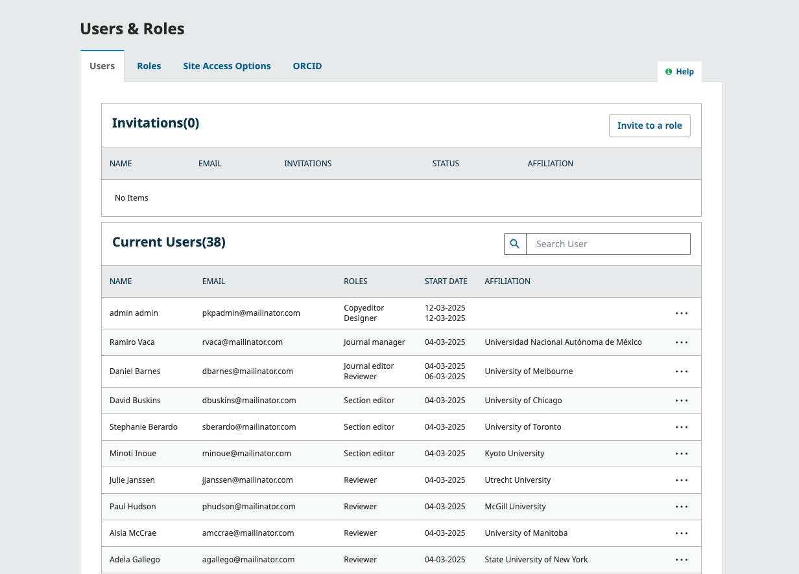
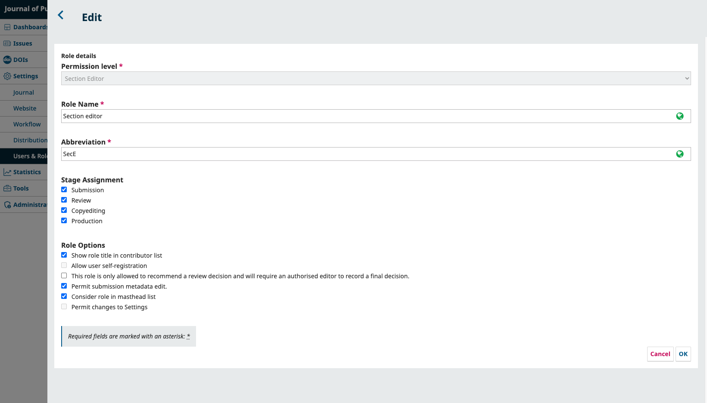
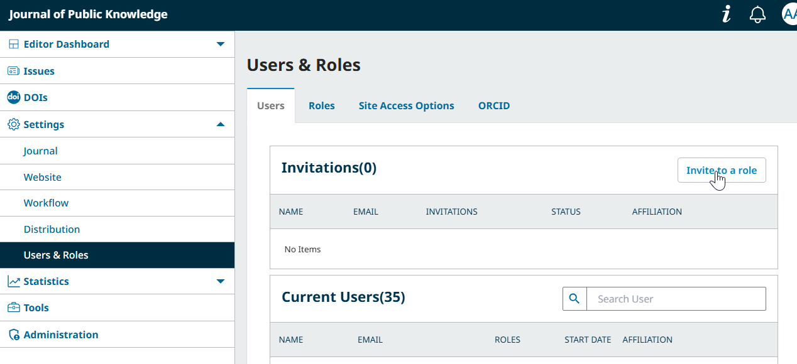
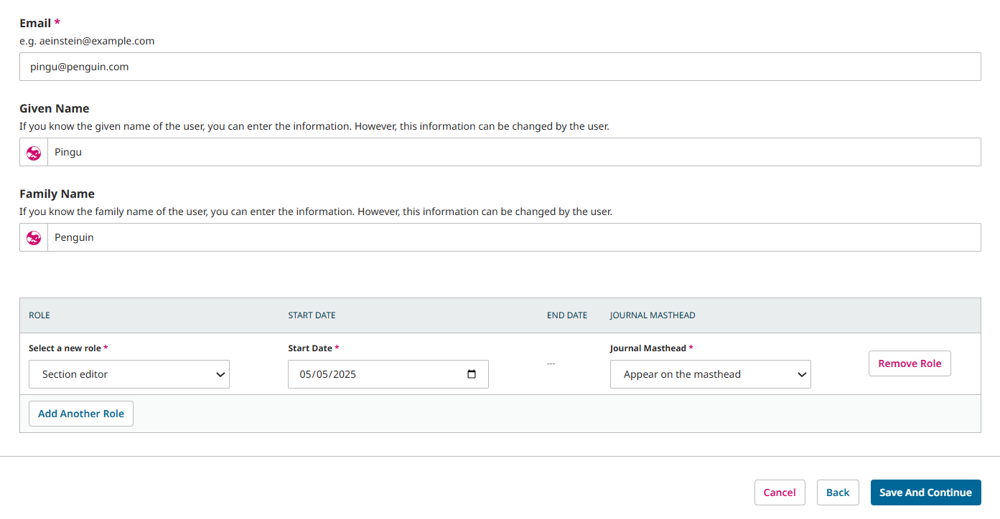
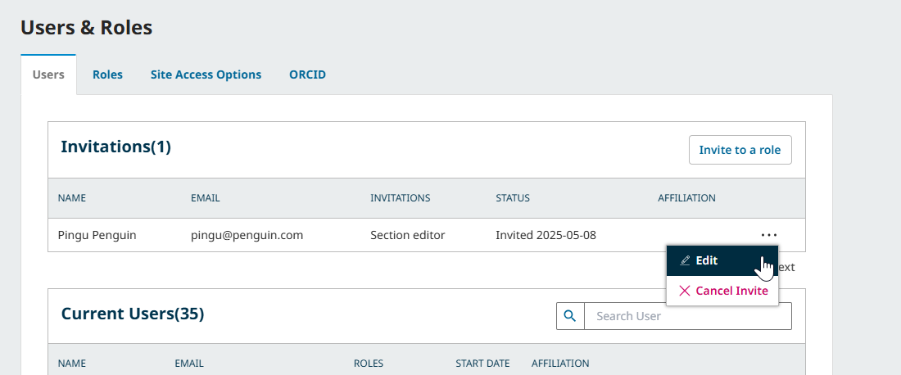
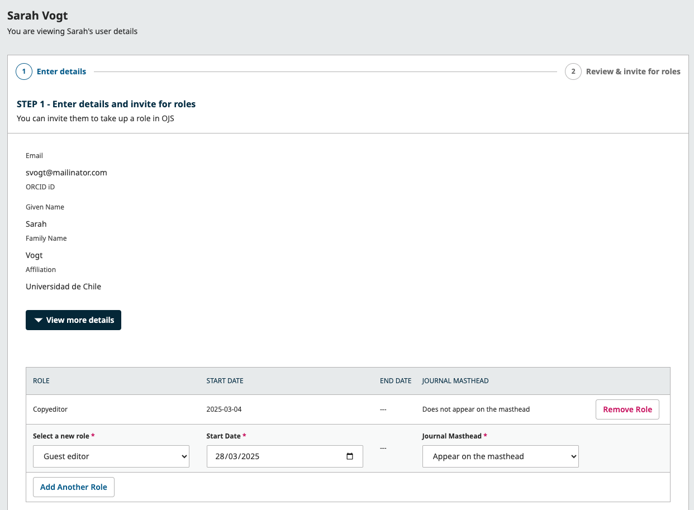
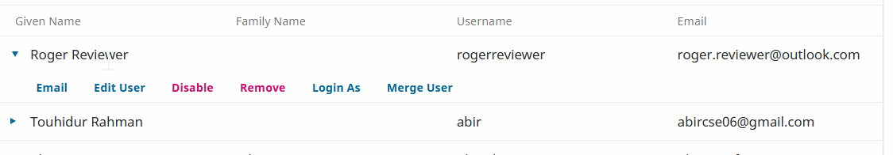

# Manage Users and Roles {#manage-users}
Next, you’ll learn how to invite members of your Editorial board, or configure the way that roles are used in your journal. Roles allow you to control who gets access to what options and workflow stages.

Navigating to Users & Roles from the left menu will allow you to manage all user accounts registered to your journal, including inviting new users and making changes to roles and permissions levels.

## Get to Know Permissions and Roles {#permissions-roles}

OJS uses **roles** to give users different levels of access and responsibility in the publishing workflow. Every user must have at least one role, but you can have more than one. For example, you might be a Journal Manager, Editor, and Author at the same time.

Each role starts with a **permission level** that controls what parts of the journal a user can access. You can then customize each role by changing its name and choosing which stages of the editorial workflow it can access.

OJS includes several predefined roles you can use or edit. Here’s a breakdown of the main roles, grouped by their permission levels: 

* The **Site Administrator** is a single user responsible for administration of the entire OJS installation. This permissions level will not appear in user lists or in role settings. Site administrators, by default, have access to all journals within a given instance and can take any actions that can be undertaken by Journal Managers.
* **Journal Managers** have access to the entire Editorial Workflow, as well as all other journal settings.
Available predefined roles with Journal Manager permissions: Journal Manager, Journal Editor, and Production Manager. (Access to journal settings can be removed/restored to Journal Editor and Production Manager roles.)
* **Section Editors** have access to the entire Editorial Workflow, but cannot make any changes to journal settings.
Available predefined Section Editor roles: Section Editor, *Guest Editor*
* **Assistants** can access only the parts of the Editorial Workflow assigned to their role.
Available predefined Assistant roles and their assigned editorial workflow stages:
    * Submission & Review stages: *Funding coordinator*
    * Copyediting stage: Copyeditor, *Marketing and sales coordinator*
    * Production Stage: *Designer*, *Indexer*, Layout Editor, Proofreader
* **Reviewers** are users who appear when you're assigning reviews in the Editorial Workflow and have access to that stage when they're assigned.
* **Authors** can make new submissions.
* **Readers** can access the reader-facing website. This is the minimum permission level granted to all users.
* **Subscription Managers** can edit site access settings as well as settings related to subscriptions.

You can see all predefined and custom roles from the Roles tab.

From this page, you can see each role, and the editorial stage each role can access. A good example of this is the Copyeditor role, which can only access the copyediting stage. Copyeditors cannot jump to the Review stage to see what happened during the peer review process. See the Editorial Workflow chapter for more information about the different editorial stages.

In addition to assigning and editing the predefined roles, you can also create new roles or rename existing ones. 

### Edit or Add a Role {#edit-role}

From the Roles tab, you can grant or remove access to specific workflow stages by checking or unchecking the relevant stage. 

You can create new roles by clicking the “Create New Role” button, or edit an existing role by clicking the blue arrow next to a role and selecting “Edit”. 

**Permission Level**: As described in the previous section, this indicates the level of permissions granted to this role.

**Role Name**: You can use this field to easily rename any role.

**Abbreviation**: Each role must have a unique abbreviation. This is used as a short identifier for participants assigned in the Editorial workflow.

**Stage Assignment**: Select the Editorial workflow stages this role will have access to, if applicable.

**Role Options**: Configure specific options related to the role.
* **Show role title in contributor lists**: Users with this role will have their title included in the contributor list when making submissions.
* **Allow user self-registration**: Allow users to register freely for this role. Useful for allowing users register as Authors or Reviewers. Be very careful not to enable this option for roles that have access to sensitive information, such as Editors or Journal Managers.
* **This role is only allowed to recommend a review decision and will require an authorised editor to record a final decision**: Enable this to limit a role’s ability to make editorial decisions.
* **Consider role in masthead list**: Select this to automatically include anyone with this role on the list of Editorial Board members.
* **Permit changes to Settings**: Select this to allow the role access to all journal settings and configurations.

## Invite a New User {#invite-user}

> Email configuration must be completed by a system administrator in order for the system to send invitation and registration confirmation emails to users. See the [Administrator's Guide](https://docs.pkp.sfu.ca/admin-guide/en/deploy-email) for more information.
{:.warning}

While users can self-register accounts for roles like Reader and Author (or other roles specified by you in the previous section), you can also invite users to take on new roles. This is especially useful for inviting members of your Editorial Board to have the correct permissions they need to work in your journal.

From Settings > Users & Roles, click Invite to a Role.

First, you’ll be asked to search for the user. You can enter their email, username, or ORCID to ensure that they’re not already registered. If they aren’t, you’ll be prompted to invite them.

Enter their email, first and/or last name, and select the role(s) you wish to assign them. You can use the “Add Another Role” button to assign multiple roles. The user can also self-register for additional roles later from their user settings. Enter a start date for the role and choose whether it should appear on the masthead (the automatically generated page listing editorial board members).

Click Save and Continue. On the final screen, you can preview and edit the email message that will be sent to the invitee.

When you are ready, click “Invite user to the role”.

You can see the status of the invitation from the Invitations list. You can edit your invitation (to add or adjust roles), or cancel your invite.

### Add and Remove Roles from a User {#add-roles}

Once a user has self-registered or accepted an invite, you can edit their profile to adjust their roles. Just like sending an invite, you can select a start date and choose whether the user will appear in the Journal Masthead.

To edit a user:
1. Navigate to Settings > Users & Roles
2. Search for the user you wish to assign a role to under Current Users, click the three dots, and select **Edit*
3. Click **Add Another Role** 
4. Select a new role
5. Choose a Start Date
6. Indicate whether this user should appear on the journal’s Masthead
7. Click **Save and Continue** 

When you remove a role from a user, the End Date will automatically be set to the current date.
If you select the user to appear in the Journal Masthead, their name and affiliation will be displayed in the Editorial Masthead section of the journal.

The role end date will be automatically registered when the role is removed from the user.

## Find and Edit an Existing User {#edit-user}

You can browse the list of users to locate a user, or use the Search option to search by their complete or partial family name, given name, username, or email. 

Once you’ve located the user, click the blue arrow beside their information.

This opens a menu with options to Email, Edit User, Disable, Remove, Login As, and Merge User.

**Edit User** allows you to make changes to that user's account information.

**Disable** keeps the account in place, but blocks the user from accessing it. You can reenable the account later by selecting “Enable User”.

**Remove** un-enrolls the user from all roles in the journal. Note that their user account will remain in the system. To fully remove a user account from your system, follow the instructions in [**Merge Users** below](/#merge-users).

**Login As** allows you to temporarily log in as that user, for example, to complete an outstanding task. Please note that this activity will be logged.

### Email Individual Users {#email-users}

> If you want to email a user about a particular submission, you should use the Discussion feature in the submission. Use this option when you want to send an email to a user without associating it with a particular task or submission.
{:.tip}

> If you wish to notify all users, see [Configure and Send Announcements](./communications.md). If you wish to email all users with a specific role, see [Send Email Notifications to All Users with a Specific Role](./communications.md#bulk-emails).
{:.notice}

Click the blue arrow next to a user and select the “Email” option to open a composer and draft your message.

### Merge Users {#merge-users}

The Merge User feature lets you fold a user account, including any submissions or assignments, into another user account on your system. You can use this feature to merge accounts you wish to delete into a dummy user account under your control.

To merge users:

1. At Users & Roles > Users, find the user account you want to remove
2. Click the blue arrow next to the username
3. Click **Merge User** from the menu that appears below
4. Find the user account that you want to merge this user account to. This will be the user that is maintained in the system.
5. Click the blue arrow next to username
6. Click **Merge into this user**
7. Press **OK** to confirm

### If a User Can't Log In {#troubleshoot}

If a user can't log in to your journal site, tell them to select **Forgot your password** on the Login page. They will then receive a reset password link by email and will be able to reset their password. 

It is also possible that they are not receiving emails from your journal. Ask them to check their spam folder or whitelist the email used by your installation to send notifications.

If the user still cannot log in, their account may have been disabled. To re-enable it:

1. Go to Users & Roles > Users
2. Find the user who can't log in and click the three dots next to their name
3. If the “Enable User” option appears, the account has been disabled. Click Enable User to enable the account one again.

## Allow Users to Connect with ORCID {#orcid}

ORCID is now a core function of OJS. To enable ORCID integration, click the checkbox, then enter your credentials. If you are unsure of your credentials or need assistance obtaining them, you can read more from the [Installation and Setup chapter of the ORCiD plugin](https://docs.pkp.sfu.ca/orcid/en/installation-setup), as instructions remain the same. 

Once you have enabled and configured your ORCID integration, your users can connect their ORCID in a few different ways: 

A) Registered users can go to the Identity tab of their user profile and connect their ID.

B) When making or managing a submission, the submitting author or the Editor assigned to the submission can use the ‘Request verification’ button found in the Contributor window to ask an author to verify their account.

C) New users can choose to verify their ORCID when creating their OJS user account. 

