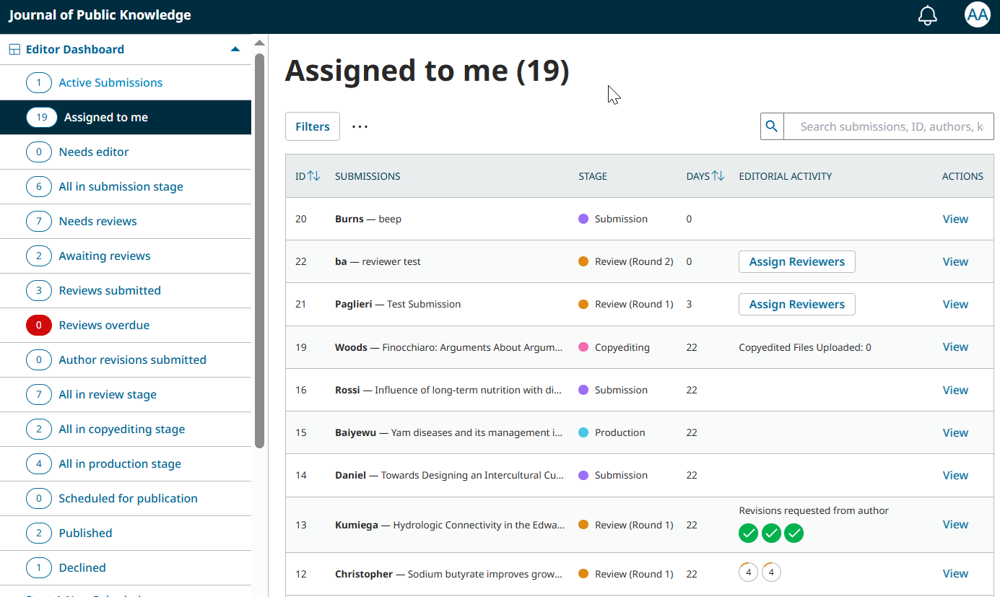
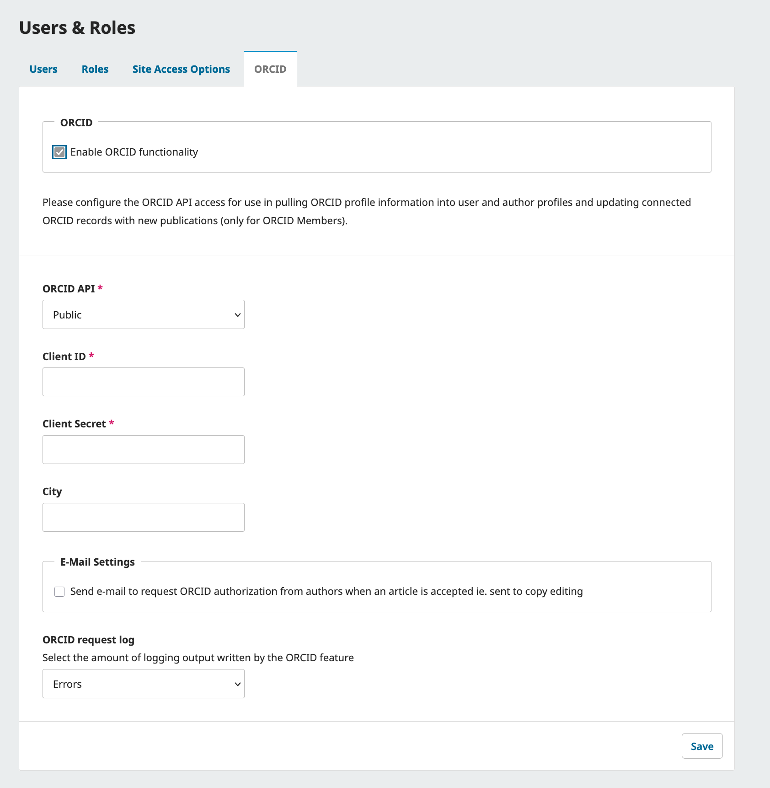
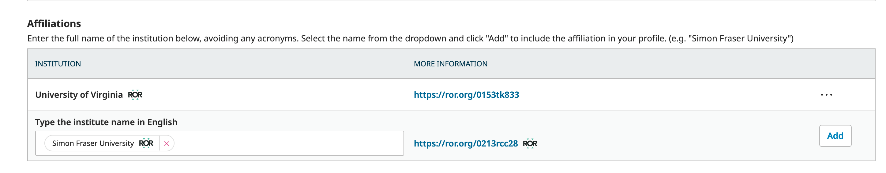
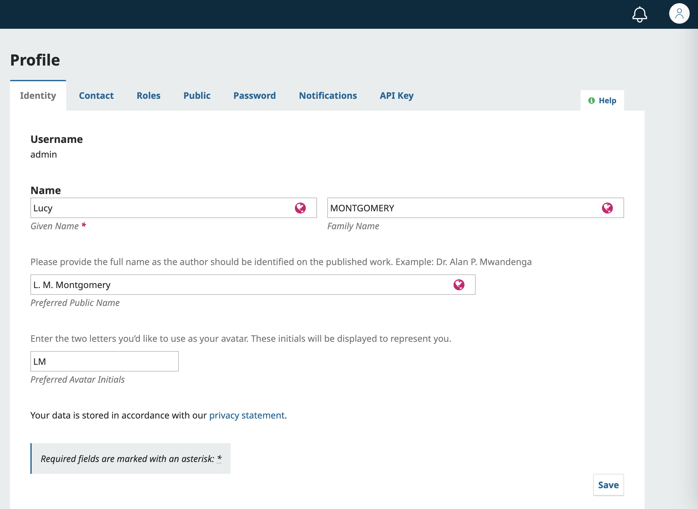

# About Open Journal Systems 3.5 (OJS) 

Open Journal Systems \(OJS\) is an open source solution to managing and publishing scholarly journals online. OJS is a highly flexible editor-operated journal management and publishing system that can be downloaded for free and installed on a local Web server.

It has been designed to reduce the time and energy devoted to the clerical and managerial tasks associated with editing a journal, while improving the record-keeping and efficiency of editorial processes. It seeks to improve the scholarly and public quality of journal publishing through a number of innovations, including enhancing the reader experience, making journal policies more transparent, and improving indexing.

This brief introductory guide covers OJS version 3.5, released in June 2025, and features significant enhancements over the previous versions of the software.

This guide is part of a series. Additional guides in the series will teach you how to use the software to accomplish tasks specific to your role.
* [Learning OJS 3.5 for Site Administrators](../../site-admin/en/) - Learn how to manage an OJS installation and create new journals as a Site Administrator.
* [Learning OJS 3.5 for Journal Managers](../../journal-managers/en/) - Learn how to configure and prepare a journal to publish from start to finish as a Journal Manager. 
* [Learning OJS 3.5: The Editorial Workflow](../../editorial-workflow/en/) - Learn how to take a submission through review, copyediting, production, and publication. Recommended for Editors, Copyeditors, and Layout Designers.
* [Learning OJS 3.5 for Reviewers](../../reviewer/en/) - Learn how to respond to a review request and complete a review in OJS as a Reviewer.
* [Learning OJS 3.5 for Authors](../../author/) - Learn how make a submission to an OJS journal and respond to requests for revisions as an Author.

## Key Software Features {#features}

OJS covers all aspects of online journal publishing, from establishing a journal website to operational tasks such as the author’s submission process, peer review, editing, publication, archiving, and indexing of the journal, enhancing the reader experience, making journal policies more transparent, and improving indexing. 

Visit our website to learn more about [Open Journal Systems](https://pkp.sfu.ca/software/ojs) and what it has to offer the whole researcher-to-reader workflow, from submission and peer review through to production and distribution.

## Install and Upgrade  {#install-upgrade}

OJS is easy to install and configure. However, running a web service requires a systems administrator who knows how to deploy web applications. Our Administrator's Guide provides full instructions on how to [download, install and configure OJS](https://docs.pkp.sfu.ca/admin-guide/en/).

> If you do not have the expertise, staff or desire to install and manage OJS on your own, [PKP Publishing Services](https://pkp.sfu.ca/hosting-services) provides complete hosting solutions for every budget.
{:.tip}

## What’s New in OJS 3.5 {#whats-new}

3.5 adds a number of new features to improve the user experience. Explore the key additions to the software below.

### Manage Submissions in the Redesigned Editorial Dashboard {#dashboard}
The Editorial Dashboard has been significantly revamped to make tracking submissions easier than ever. Use the filtered dashboard views to access submissions in specific stages. Review status icons and action buttons allow you to easily identify and complete editorial tasks.

See [Learning OJS 3.5: Editorial Workflow - The Editorial Dashboard](../../editorial-workflow/en/dashboard.md) for an in-depth look at these changes..

### Manage and Track Editorial Board History {#editorial-board}
OJS can now automatically compile a list of editorial board members, replacing the need to manually document the members of your team. Simply select which roles should be captured in the masthead and configure start and end dates for board members.

See [Learning OJS 3.5 for Journal Managers - Manage Users and Roles](../../journal-managers/en/users.md) for more details on how to configure and manage this new feature.

### Invite Users {#invite-users}
Manual registration of users has been replaced with an invite feature. This change allows for increased user privacy and control. Invite new users to participate in your journal with the roles of your choosing. (Note that this does not replace the ability of users to self-register for specified roles.)

See [Learning OJS 3.5 for Journal Managers: Invite a New User](../../journal-managers/en/users.md#invite-user) for more details.

### Fill in User Information Automatically with ORCID {#orcid}
In Settings, the Users & Roles screen now has an additional tab for ORCID where authorized representatives of ORCID member organizations can enable and configure automatic exchange of data between a journal and ORCID profiles. This means that instead of asking a user to fill in basic information about themselves, you can simply ask the user to approve automatic exchange of data.

Keep in mind that only ORCID member organizations and consortia can use this feature.

*ORCID is now a core functionality in OJS 3.5 and no longer depends on a plugin.

### Allow Authors to Suggest Reviewers {#suggest-reviewers}
Journal Managers can now choose to allow Authors to suggest reviewers when they make a submission. Find this option under Settings - Workflow > Review > Setup. Click the checkbox under “Reviewer Suggestion at Submission”. 

Journal Managers can also customize instructions for suggesting reviewers from Settings - Workflow > Submission > Author Guidance.

Suggested Reviewers will be shown when assigning Reviewers in the Editorial Workflow.

See the [Configure Your Submission, Review, and Licensing Policies Chapter](../../journal-managers/en/policies.md#basic-review-settings) of Learning OJS for Journal Managers for configuration details, and [Learning OJS 3.5 for Authors](../../author/en) for more details on how to suggest reviewers as an author.

### Use Highlights to Draw Attention to Big News {#highlights}
Highlights allow you to feature images and information on your journal home page. Use this to draw attention to a Call for Papers or to highlight a particular manuscript. If you add multiple highlights, they will be added to a carousel display that rotates between highlights. **This feature may not work for all themes.**

See [Learning OJS 3.5 for Journal Managers - Create a Journal Highlight](../../journal-managers/en/appearance.md#highlights) for more details.

### Other Notable Changes {#other-changes}
Below are some other changes in 3.5 you should be aware of:

**Editorial Workflow**
* Bulk delete incomplete submission: Journal Managers and Editors can remove all submissions with the Incomplete status by pressing the three dots next to the “Filter” button and choosing “Delete Incomplete Submissions”.
* Journal Managers can grant or revoke the Journal Editor role access to the Settings menu by editing the role's options.

**Contributor Affiliations and ROR**
* The use of [Research Organization Registry (ROR)](https://ror.org) identifiers for contributor affiliations is now a core functionality in OJS and no longer depends on a plugin.
* Contributors can now have more than one affiliation.

See [Learning OJS 3.5 for Authors - Add Contributors](../../author/en/#contributors) for more details.

**Reviews**
* You can now send reminders *before* review response and review submission deadlines. Previously, OJS only allowed for reminders after a due date had passed. Make your configurations from [Settings - Workflow > Review > Setup](../../journal-managers/en/policies.md#basic-review-settings).
* Reviews can now be downloaded in PDF and Excel formats.
* Reviewers can now access their reviews from previous review rounds.

**Multilingualism**
* Users can now make submissions in any language enabled by the site, regardless of their chosen UI language.
* Published content now has distinct URLs for each language it is published in, allowing specific languages to be linked and indexed.
* A submission’s language can now be changed in the Publication tab.

### Skipped OJS 3.4? {#skipped-34}

If you’re coming to OJS 3.5 without experiencing 3.4, there are a few key changes that will be new to you.

* **Centralized DOI management**: Management of DOIs has been simplified and centralized in a dedicated DOIs menu item. [Read more about setting up DOIs and using the DOI management area here](../../journal-managers/en/other-tools.md#dois).
* **Redesigned Submission wizard**: The submission form’s design has been improved. Authors can consult [Learning OJS 3.5 for Authors](../../author/en) for step-by-step guidance.
* **Submission title formatting**: Submission titles can now contain limited formatting, including bold, italic, underline, superscript and subscript.
* **Improved email templates**: Email composition tools have been expanded to allow users more freedom when selecting and editing email templates. Emails include a glossary of available variables that can be inserted using the ‘Insert Content’ button. These variables allow you to include context-dependent information: for example, the ($submissionTitle) variable will be automatically replaced with the title of the relevant submission. Additionally, you can now add CC/BCC when sending select emails in the system.
* **Cancel a review round or move a submission to a prior stage**: You can freely cancel accidentally opened review rounds or return a submission to a previous stage.

### More Information {#more}
For a summary of changes in OJS 3.5 that are relevant to developers and development, please see the [Release Notebook for OJS OJS/OMP/OPS v3.5](https://docs.pkp.sfu.ca/dev/release-notebooks/en/3.5-release-notebook).

## The Basics of Open Journal Systems {#basics}
Open Journal Systems (OJS) is a publishing platform that supports the editorial workflow for scholarly journals. It includes both a public-facing website — where readers can access articles, browse issues, and learn about the journal — and a behind-the-scenes dashboard where users take part and contribute to the publication process.
To do anything beyond reading on an OJS-powered journal site, you'll need to register for an account and have a role.

### Roles in OJS {#roles}
Roles determine what you can do in OJS. Each role comes with a specific set of permissions. For example, Authors can submit manuscripts, Reviewers can respond to review requests, and Editors can manage the editorial workflow.
There are two main ways to get a role:
* **Self-registration**: Most journals allow users to register and choose certain roles, like Author or Reviewer.

* **Invitation or assignment**: More advanced roles — such as Editor or Journal Manager — must be assigned to you by someone who already has the appropriate permissions, usually a Journal Manager.

If you're not sure what your role is, or what you’re allowed to do, check with your journal's editorial team. 
You can also consult the relevant guide below:
* [Learning OJS 3.5 for Authors](../../author/en/) - – Learn how to submit and manage your manuscript as an Author.
* [Learning OJS 3.5 for Reviewers](../../reviewer/en/)  – Learn how to accept review assignments and complete peer reviews.
* [Learning OJS 3.5: The Editorial Workflow](../../editorial-workflow/en/) – Recommended for Editors, Copyeditors, Layout Editors, and any other editorial board members working through the publishing stages.
* [Learning OJS 3.5 for Journal Managers](../../journal-managers/en/) – Learn how to configure your journal and manage the editorial team.
* [Learning OJS 3.5 for Site Administrators](../../site-admin/en/) – For those managing the overall OJS installation and creating new journals.

### Create and Manage Your Account {#create-manage-account}
To participate in a journal as more than a reader, you’ll need to **create an account**.
Many journals allow open registration — meaning you can sign up yourself as a Reader, Author, and/or Reviewer. If registration is disabled, you’ll see a message saying it’s currently closed. In that case, you'll need to be invited or added by a Journal Manager.
Once you have an account, you can update your profile, change your email or password, and set notification preferences from your dashboard.

#### Register Your Account {#register-account}
To register an account with a journal, click the Register link on the upper right corner of the journal’s site. 

This will open the Registration Form for you to complete with all required information.

All fields with an asterisk (Given Name, Affiliation, Country, Email, Username, Password, Repeat Password) are mandatory. Note that affiliation fields in user profiles are plain text, but contributor affiliations attached to a publication are managed with [Research Organization Registry (ROR)](https://ror.org) identifiers. 

#### Edit Your Profile {#edit-profile}

To view and edit your profile, log in and click your username in the upper right corner. From the dropdown menu, choose Edit Profile.

From here, you can add and change information about yourself and configure your preferences in each of the different tabs:

* **Identity**: Manage your Given Name, Family Name, Preferred Public Name, Preferred Avatar Initials, and Create or Connect your ORCID iD.
* **Contact**: Manage your Email, Signature, Phone, Affiliation, Mailing Address, Country, and Working Languages.
* **Roles**: Change or add new roles to your account (select Reader, Author, or Reviewer) and set your Reviewing Interests, register for additional roles on other journals hosted on the installation.
* **Public**: Manage your Profile Image, Bio Statement, and Homepage URL.
* **Password**: Change your password by entering your current password and a new password.
* **Notifications**: Enable/disable system and email notifications related to Public Announcements, Submission Events, Reviewing Events, and notifications for Editors. 
* **API Key**: Store an API key that will allow use you to OJS’s REST API to interact with external applications. Most users will not use the API and can safely ignore this tab.

#### Reset Your Password {#reset-password}
If you're already logged in, you can change your password by going to Edit Profile and clicking the Password tab.
If you've forgotten your password, you can reset it as long as you still have access to your email:
1. Click Login at the top-right corner of the site.
2. Click Forgot your password?
3. Enter your email address and click Reset Password.
4. Check your email (including your spam/junk folder) for a confirmation message.
5. Click the link in the email to confirm the reset.
6. A second email will be sent with a temporary password.
7. Log in using the temporary password and follow the prompt to create a new one.

If you're stuck, contact the journal’s editorial team — contact information is usually listed on the About page.

## Contribute to the Community {#contribute}

We warmly welcome contributions from the community. If you are interested in getting involved in making OJS even better, we welcome your participation! [Visit our website](https://pkp.sfu.ca/community/get-involved/) to learn how to contribute code, share tips with other users on the community forum, or translate the software into your regional language.

## Get Support {#get-support}

PKP offers the following free support resources for OJS:

* [PKP Docs Hub](https://docs.pkp.sfu.ca/): User guides, developer documentation and publishing tips for all of our software. Also includes links to community developed videos.
* [PKP Community Forum](https://forum.pkp.sfu.ca/): An online discussion board where you can ask questions, answer questions, and share ideas.
* [PKP School](https://pkpschool.sfu.ca/): A collection of online, open, and self-paced courses designed by PKP experts in English and Spanish. Includes video tutorials on Setting up Your Journal; the Editorial Workflow in OJS 3; and Becoming an Editor.
For questions about a specific journal using OJS, contact that journal directly, using the contact information listed on the journal’s **About** page.
