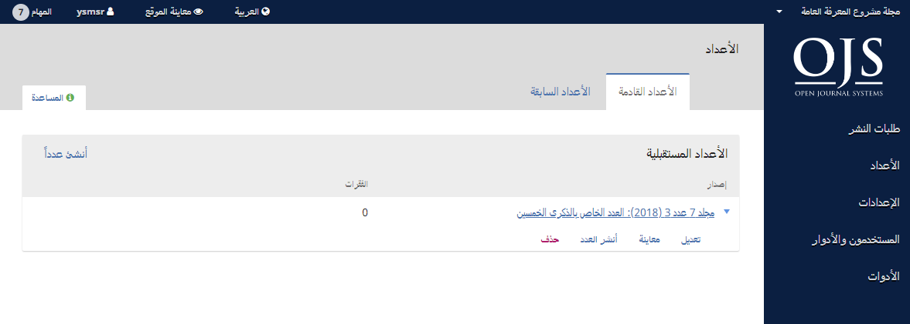

# الفصل 6: الأعداد

من القائمة اليمنى، إختر الأعداد لإدارة كل أعداد مجلتك.

## الأعداد القادمة

الإعداد القادمة هي كل الأعداد التي لم تنشر بعد. بإمكانك إنشاء ما تريده منها لتجدول طلبات النشر إلى أي منها.

### إنشاء عدد

لإنشاء عدد جديد، استعمل رابط **إنشاء عدد** وإملأ حقول النموذج.

هناك ستقوم بتحديد المجلد، رقم العدد، السنة، والعنوان \(مثلاً، العدد الخاص \#1\)، فضلاً عن الوصف وصورة الغلاف \(إن لزم الأمر\).

### تعديل العدد

يمكنك تعديل أي عدد مستقبلي عبر اختيار السهم الأزرق على يمين سطر العدد من صفحة الأعداد القادمة.

هذا سيظهر رابط التعديل، حيث سيفتح نافذة جديدة من المعلومات.

**جدول المحتويات**: بالنسبة للعدد المنشأ حديثاً، سيكون فارغاً، ولكن بالنسبة إلى الأعداد التي تضم مقالات مجدولة للنشر، سيكون متضمناً لقائمة بها.

استعمل السهم الأزرق المجاور لكل طلب نشر لكشف روابط تذهب بك مباشرة إلى بيانات الطلب \(المزيد عن ذلك تجده في الفصل 10\) أو لحذفه.

بإمكانك أيضاً استعمال رابط الفرز لإعادة فرز إدخالات الجدول.

**بيانات العدد**: هذا يوصلك إلى المجلد، رقم العدد، وغيرها من البيانات التي أنشأت بها العدد.

**الألواح الطباعية للعدد**: هذا يتيح لك رفع ملف اللوح الطباعي الكامل للعدد - أي ملف PDF واحد يضم كل المقالات. سيظهر له رابط على صفحة العدد.

**المعرفات**: إستعمل هذا الموضع لإضافة معرف المكون الرقمي DOI للعدد، إذا كانت مجلتك تدعم المعرفات على مستوى الأعداد.

### معاينة العدد

مستعملاً نفس السهم الأزرق ستتوصل إلى رابط المعاينة، حيث يمكنك الاطلاع على العدد قبل نشره.

### نشر العدد

إذا كنت راضياً عن ذلك العدد، أنقر رابط نشره على موقع مجلتك.

### حذف العدد

يمكنك استعمال رابط الحذف للتخلص من العدد. كل المقالات المخصصة له ستعود إلى حالة انتظار النشر.

## الأعداد السابقة

هذا التبويب يدرج كل أعدادك المنشورة.

كما في الأعداد القادمة، استعمال السهم الأزرق سيكشف خيارات مماثلة لما سبق توضيحه أعلاه \(التعديل، المعاينة... إلخ.\).
