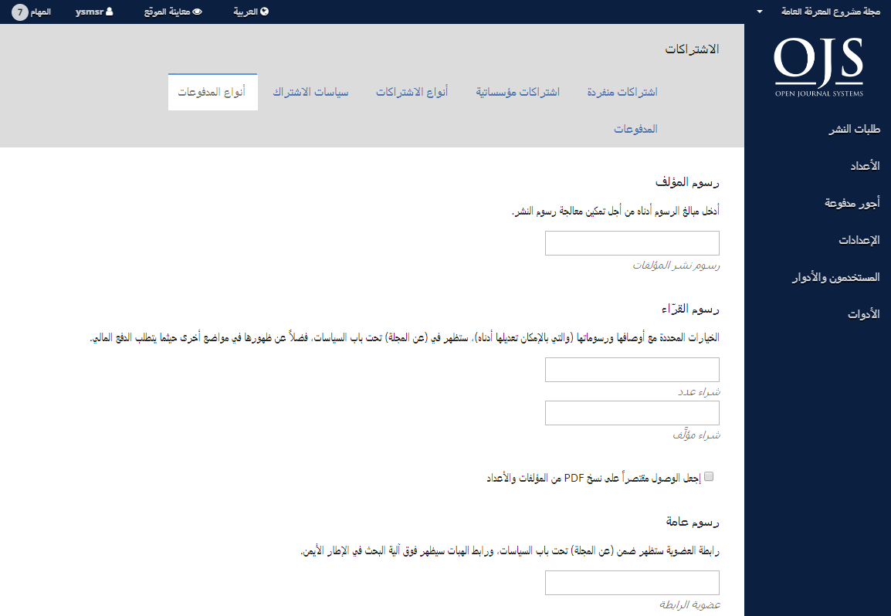

# الفصل 9: الاشتراكات

نظام المجلات المفتوحة 3.1 يسمح لك بأن تجعل بعضاً أو كلاً من محتوى المجلة مقتصراً على المشتركين فيها. لتمكين الاشتراكات، إذهب أولاً إلى [الإعدادات، ثم التوزيع، ثم الوصول](./journal-setup.md#الوصول).

## سياسات الاشتراك

إملأ تفاصيل سياسات الاشتراكات في هذه الصفحة.

- **مدير الاشتراكات**: أضف بعض البيانات الشخصية عن الشخص المسؤول.
- **معلومات الاشتراكات**: أضف تفاصيل تتعلق بسياسة الاشتراكات لتظهر على موقع المجلة.
- **انتهاء صلاحية الاشتراك**: حدد فيما لو أن الاشتراكات السابقة ستكون لها صلاحيات الوصول إلى المحتوى القديم في المجلة.
- **التذكيرات بانتهاء صلاحيات الاشتراكات**: قم بتهيئة رسائل وإشعارات التذكير التلقائي بشأن قرب انتهاء صلاحية الاشتراكات.
- **إشعارات الدفع عبر الإنترنت**: أبق مدير الاشتراكات على علم بفعاليات الدفع عبر الإنترنت.
- **خيارات الوصول المفتوح بالنسبة إلى المجلات العاملة بالاشتراكات**: حسب ما تراه مناسباً، حدد عدد الأشهر التي يستمر بها تقييد الوصول المفتوح وجعله مقتصراً على المشتركين في المجلة، على اعتبار أن المحتوى الأقدم سيصير متاحاً للعامة بشكل تلقائي.

## أنواع الاشتراكات

الخطوة التالية في إدارة الاشتراكات هي تعريف أنواع الاشتراكات التي تقدمها المجلة.

عادة ما توفر المجلات اشتراكات فردية وأخرى مؤسساتية. بعض المجلات قد تقدم عروضاً خاصة لأعضاء منظمات معينة أو للطلبة. نظام المجلات المفتوحة سيدعم إدارة الاشتراكات بشكليها الورقي والتي على الإنترنت. يمكن إنشاء أكثر من نوع واحد من الاشتراكات لتغطية فترات زمنية أطول \(12 شهراً، 36 شهراً\).

إختر **إنشاء نوع اشتراك جديد** لإضافته إلى أنواع الاشتراكات.

- **تسمية النوع**: أعط نوع الاشتراك هذا اسماً فريداً \(مثلاً، للطلبة\).
- **الوصف**: أعط وصفاً موجزاً ليظهر على الموقع.
- **الكلفة**: إختر نوع العملة ومقدار المبلغ.
- **الصيغة**: إختر الكيفية المعنية \(مثلاً، عبر الإنترنت\)
- **الفترة**: أدخل عدد الأشهر التي سيغطيها هذا النوع \(مثلاً، 12\).
- **صنف الاشتراك**: يحدد فيما لو كان هذا النوع مخصصاً للأفراد أم للمؤسسات.
- **الخيارات**: إختر الخيارات المناسبة \(إذا توفرت\).

## طرق الدفع

إذا لم يسبق لك القيام بذلك، إذهب إلى [الإعدادات، ثم التوزيع، ثم المدفوعات](./journal-setup.md#المدفوعات) وحدد العملة المناسبة وطريقة الدفع \(مثلاً، Paypal\).

إستعمل هذه الصفحة لتعريف المبالغ المستحقة إزاء كل من الرسوم التي تعمل بها المجلة.

- **خيارات عامة**: أشر هناك للسماح بجمع المدفوعات.
- **رسوم المؤلف**: حدد المبلغ المستحق لقاء معالجة طلب التقديم \(APC\).
- **رسوم القراء**: استعمل ذلك لمطالبة القراء برسوم مغايرة لرسوم الاشتراكات.
- **رسوم عامة**: إستعملها لفرض رسوم إضافية، مثل رسوم العضوية.

## المدفوعات

كلما تم استحصال مبالغ المدفوعات، سيتم إدراجها ضمن هذا التبويب.

## الاشتراكات الفردية

كل أنواع الاشتراكات الفردية سيتم إدراجها هنا.

بإمكانك إنشاء اشتراك فردي جديد عبر استعمال رابط إنشاء اشتراك جديد. أولاً، لا بد لك أن تقوم بإنشاء حساب مستخدم لذلك الشخص ضمن [باب المستخدمون، ثم الأدوار](./user-accounts.md#أدوار-النظام). بمجرد إكمال ذلك، يمكنك البحث عن ذلك الحساب هنا وتطبيق باقي الإعدادات عليه.

**نوع الاشتراك**: إختر النوع المناسب لهذا المشترك الجديد \(مثلاً، للطلبة\) وحالته \(مثلا، فعال\).

> أنواع الاشتراكات تم تبيانها سلفاً في هذا الفصل.

**التأريخ**: حدد يومي بدء الاشتراك وانتهائه.

**العضوية**: إذا كان المشترك مرتبطاً بأي عضوية ذات صلة، أضف تلك المعلومة هنا \(إختياري\).

**الرقم المرجعي**: إذا كان هذا الاشتراك مرتبطاً بأي رقم مرجعي \(مثل رقم فاتورة الدفع\)، أضف تلك المعلومة هنا \(إختياري\).

**ملاحظات**: إذا كانت لديك أي ملاحظات ذات صلة، أدرجها هنا \(إختياري\).

## الاشتراكات المؤسساتية

كل أنواع الاشتراكات المؤسساتية سيتم إدراجها هنا.

تتم إدارة الاشتراكات المؤسساتية بشكل مماثل للاشتراكات الفردية، ولكنها عادة ما تخصص للمكتبات، المؤسسات البحثية، وغيرها من المنظمات التي تشترك في مجلتك.

يمكنك إنشاء اشتراك مؤسساتي جديد عبر استعمال رابط إنشاء اشتراك جديد. أولاً، لا بد لك أن تقوم بإنشاء حساب مستخدم للشخص المعني بالاتصال في تلك المؤسسة ضمن [باب المستخدمون، ثم الأدوار](./user-accounts.md#أدوار-النظام). بمجرد إكمال ذلك، يمكنك البحث عن ذلك الحساب هنا وتطبيق باقي الإعدادات عليه.

- **نوع الاشتراك**: إختر النوع المناسب لهذا المشترك الجديد \(مثلاً، مكتبة\) وحالته \(مثلاً، فعال\).
> (أنواع الاشتراكات تم تبيانها سلفاً في هذا الفصل.)
- **التأريخ**: حدد يومي بدء الاشتراك وانتهائه.
-  **المؤسسة**: أضف اسم المؤسسة المخصص لها هذا الاشتراك \(مثلاً، مكتبة جامعة الصراط المستقيم\).
- **عنوان المراسلة البريدية**: أضف عنوان مراسلة المؤسسة.
- **المجال**: القراء الذين سيدخلون إلى النظام عبر مجال بهذه التسمية، سيحصلون تلقائياً على صلاحية الوصول \(مثلاً، sfu.ca\). هذا سيشمل المستخدمين المقيمين في المجمع.
- **مدى عنوان IP**: قد تقدم لك المؤسسة مديات من عناوين IP. القراء الذين يدخلون من شبكات تستعمل تلك المديات، سيحصلون تلقائياً على صلاحية الوصول.
- **ملاحظات**: إذا كانت لديك أي ملاحظات ذات صلة، أدرجها هنا \(إختياري\).
