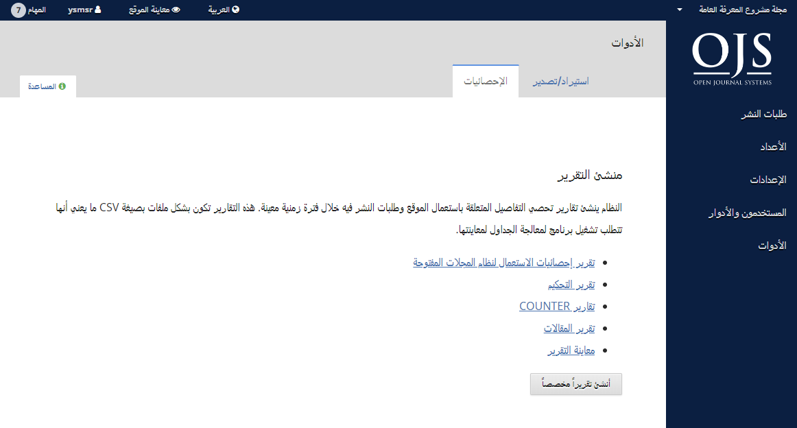

# ÇáİÕá 8: ÇáÃÏæÇÊ

ãŞØÚ ÇáÃÏæÇÊ íãßä ÇáæÕæá Åáíå ãä ÇáÔÑíØ ÇáÌÇäÈí ÇáÃíãä.

ÇáÃÏæÇÊ ÊÊÖãä ÊÈæíÈ ÇáÇÓÊíÑÇÏ/ÇáÊÕÏíÑ æÊÈæíÈ ÇáÇÍÕÇÆíÇÊ.

## ÇáÇÓÊíÑÇÏ/ÇáÊÕÏíÑ

ÇáÇÓÊíÑÇÏ/ÇáÊÕÏíÑ ÊÊíÍ áß ÅÏÎÇá ÇáÈíÇäÇÊ Åáì äÙÇã ÇáãÌáÇÊ ÇáãİÊæÍÉ İÖáÇğ Úä ÅÎÑÇÌåÇ ãäå.

ÈÚÖ ÇáÃÏæÇÊ ÊÓãÍ áß ÈÇáÊÕÏíÑ Åáì  ØÑİ ËÇáË ãä ÇáÃäÙãÉ ãËá PubMed Ãæ DOAJ. æÛíÑåÇ íÓãÍ ÈÇÓÊíÑÇÏ æÊÕÏíÑ ÈíÇäÇÊ ÇáãÓÊÎÏãíä æÇáãŞÇáÇÊ. 

ááÍÕæá Úáì ÊÚáíãÇÊ ÊİÕíáíÉ Úä ÇáÇÓÊíÑÇÏ æÇáÊÕÏíÑ¡ ÃäÙÑ [Ïáíá ÇáãÔÑİ](https://docs.pkp.sfu.ca/admin-guide/en/data-import-and-export).

ááãÒíÏ ãä ÇáãÚáæãÇÊ Úä ÅÖÇİÉ ÇáÊÕÏíÑ Crossref XML¡ ÃäÙÑ [Ïáíá ãÔÑæÚ ÇáãÚÑİÉ ÇáÚÇãÉ Úä Crossref](https://docs.pkp.sfu.ca/crossref-ojs-manual/en/).

## ÇáÅÍÕÇÆíÇÊ

ÕİÍÉ ÇáÇÍÕÇÆíÇÊ ÊÊíÍ ÇáæÕæá Åáì ÇáÚÏíÏ ãä ÇáÊŞÇÑíÑ áãÌáÊß.

íŞæã ÇáäÙÇã ÈÅäÔÇÁ ÇáÊŞÇÑíÑ ÇáÊí ÊÊÇÈÚ ÇáÊİÇÕíá ÇáãÊÚáŞÉ ÈÇÓÊÚãÇá ÇáãæŞÚ æØáÈÇÊ ÇáÊŞÏíã ÚÈÑ İÊÑÉ ÒãäíÉ ãÍÏÏÉ.  íÊã ÅäÔÇÁ ÇáÊŞÇÑíÑ ÈÕíÛÉ CSV æÇáÊí ÊÊØáÈ ÊØÈíŞÇğ áãÚÇáÌÉ ÇáÌÏÇæá áãÚÇíäÊåÇ.

- **ÊŞÑíÑ ÇáãÚÇíäÉ**: ÊæİÑ ÊŞÑíÑÇğ Úä ãÚÇíäÇÊ ÇááæÍ ÇáØÈÇÚí æÇáãáÎÕ ãä ŞÈá ÇáŞÑÇÁ \(Ãí¡ ßã ãÑÉ ÊãÊ ãÚÇíäÉ ãáİ PDF áãŞÇáÉ ãÚíäÉ\).
- **ÊŞÑíÑ ÇáÊÍßíã**: ÊæİÑ ÌÏæáÇğ Úä ßá äÔÇØÇÊ ÇáÊÍßíã.
- **ÊŞÑíÑ ÇáÇÔÊÑÇßÇÊ**: ÊæİÑ ÌÏæáÇğ Úä äÔÇØ ÇáÇÔÊÑÇßÇÊ.
- **ÊŞÇÑíÑ COUNTER**: ÊæİÑ ÈíÇäÇÊ COUNTER.
- **ÊŞÑíÑ ÇáãŞÇáÇÊ**: ÊæİÑ ÌÏæáÇğ Úä ßá ÇáãŞÇáÇÊ ÇáãäÔæÑÉ.
- **ÊŞÑíÑ ÅÍÕÇÆíÇÊ ÇÓÊÚãÇá ãÔÑæÚ ÇáãÚÑİÉ ÇáÚÇãÉ**: ÊæİÑ ÇáÅÍÕÇÆíÇÊ ÇáÃÓÇÓíÉ Úä ÇÓÊÚãÇá ãÌáÊß.

### ÅäÔÇÁ ÊŞÑíÑ ãÎÕÕ

ÅÓÊÚãá åĞå ÇáãíÒÉ áÅäÔÇÁ ÊŞÇÑíÑß ÇáÎÇÕÉ.

ãÒíÏ ãä ÇáãÚáæãÇÊ Úä ßíİíÉ ÅäÔÇÁ æÅÏÇÑÉ ÇáÇÍÕÇÆíÇÊ İí äÙÇã ÇáãÌáÇÊ ÇáãİÊæÍÉ ÊÊæİÑ İí [Ïáíá ÇáãÔÑİ](https://docs.pkp.sfu.ca/admin-guide/en/statistics).
