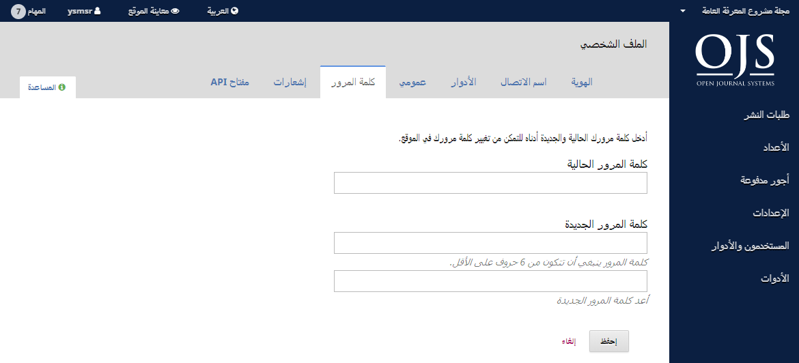

# الفصل 3: حسابات المستخدمين

نظام المجلات المفتوحة يستعمل نظام أدوار شامل لتوزيع الأعمال بين المستخدمين، توجيه انسيابية العمل، وتقنين صلاحيات الوصول إلى أجزاء النظام.

بما أن تنصيباً واحداً لنظام المجلات المفتوحة يمكنه استضافة عدة مجلات، يمكن أن يكون للمستخدمين أدوار متباينة عبر تلك المجلات. على سبيل المثال، يمكن لمستخدم واحد أن يكون محرراً ومؤلفاً ضمن نفس المجلة، مع كونه مؤلفاً فقط ضمن مجلة أخرى، ومحكماً في ثالثة، ومحرراً في رابعة... وهكذا.

عندما يقوم المستخدم بتسجيل دخوله إلى النظام، يأخذه الأخير إلى لوحة القيادة. من هنا، سيقدم له النظام كل الوظائف المتاحة له. على سبيل المثال، المحكم يستطيع معاينة طلبات التقديم التي تم تعيينه لها حصراً، بينما المحرر يستطيع رؤية كل طلبات التقديم ضمن مجريات أعمال التحرير.

## التسجيل في مجلة

الزوار غير المسجلين في موقع المجلة يمكنهم بطبيعة الحال التسجيل بصفة قراء، مؤلفين، و/أو محكمين. رئيس التحرير يمكنه منع الزوار من ميزة التسجيل الذاتي، وعند ذلك، ستظهر على الموقع ملحوظة تشير إلى أن التسجيل فيه معلق حالياً (أنظر إعدادات المجلة)، لكن يمكن لرؤساء التحرير تسجيل المستخدمين دائماً وفي أي وقت ومنحهم أي أدوار.

للتسجيل في مجلة، أنقر رابط التسجيل في الزاوية العليا اليسرى.

هذا من شأنه أن يفتح نموذج التسجيل لإكمال ما يتضمنه من حقول.

كل الحقول المعلمة بنجمة هي حقول إجبارية (الاسم الأول، الاسم الأخير، الانتماء، البلد، البريد الالكتروني، اسم المستخدم، كلمة المرور مع إعادتها). إذا كانت المجلة متعددة اللغات، سيكون عليك اختيار لغتك المفضلة.

سيتم تسجيلك تلقائياً بمثابة قارئ ومؤلف. سيكون لك خيار التسجيل بمثابة محكم أيضاً.

لكن لن يكون متاحاً لك التسجيل في أدوار التحرير (أي، مدير التحرير، محرر القسم، المدقق، المحرر الطباعي، المصحح، أو رئيس التحرير). إذا كنت تريد الحصول على أدوار من هذا المستوى، راسل رئيس التحرير الحالي للمجلة أو المشرف على موقعها.

## معاينة ملفك الشخصي وتعديله

لمعاينة ملفك الشخصي وتعديله، سجل دخولك في الموقع وانقر على رابط اسم المستخدم في الزاوية العليا اليسرى. إختر رابط معاينة الملف الشخصي.

من هنا، وعبر التنقل بين علامات التبويب المختلفة، يمكنك تعديل معلوماتك الشخصية، معلومات الاتصال، تغيير أدوارك، إضافة صورتك الشخصية \(حيث أن بعض المجلات تقوم بنشرها مع أعمالك أو ضمن قائمة المحررين\)، تحديد إعدادات إشعاراتك، أو تغيير كلمة مرورك.

إن علامة التبويب API ضمن صفحة الملف الشخصي تسمح للمستخدم في نظام المجلات المفتوحة بالاستفادة من خدمة REST API للتعامل مع تطبيقات خارجية. مع ذلك، معظم المستخدمين لن يبادروا إلى استعمال API ويمكن لهم تجاهل علامة التبويب تلك.

## إعادة تعيين كلمة مرورك

يمكنك إعادة تعيين كلمة مرورك عبر:

1. تسجيل الدخول إلى الموقع
2. إختيار اسم دخولك ومعاينة ملفك الشخصي من الزاوية العليا اليسرى من الشاشة
3. إختيار علامة التبويب الخاصة بكلمة المرور
4. إدخال كلمة مرورك الحالية، من ثم كلمة المرور الجديدة مرتين
5. النقر على حفظ

كلمة مرورك قد تغيرت الآن.
