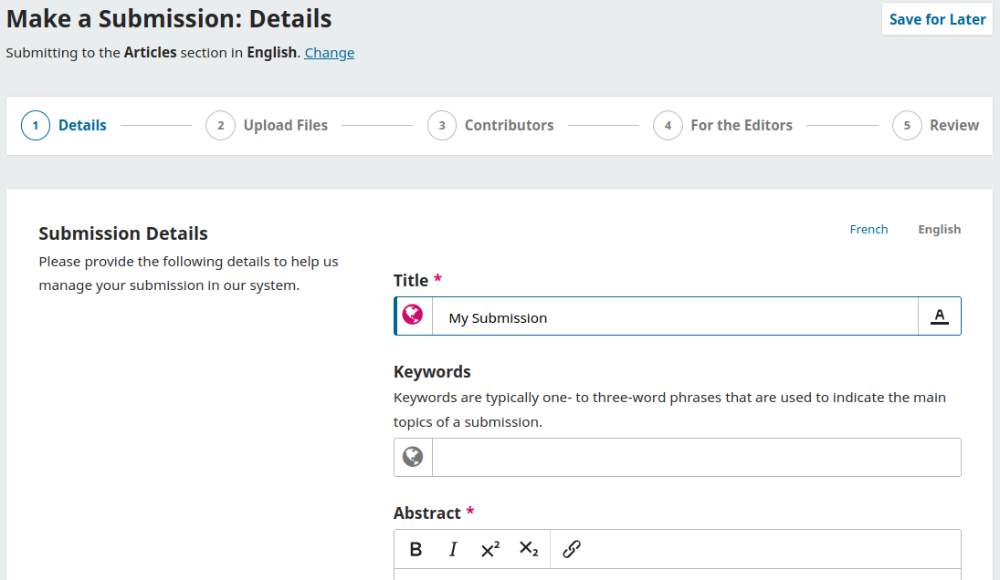
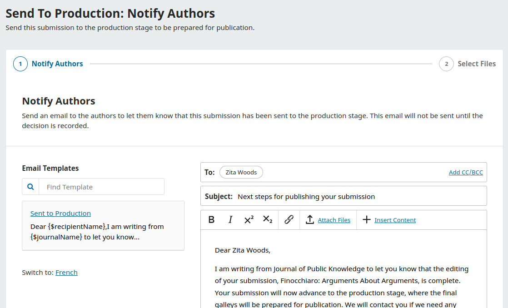
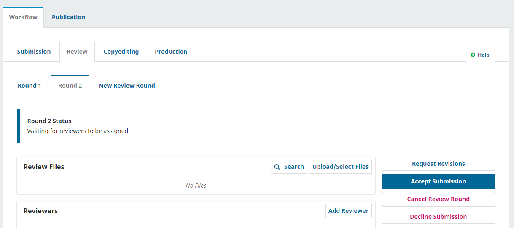
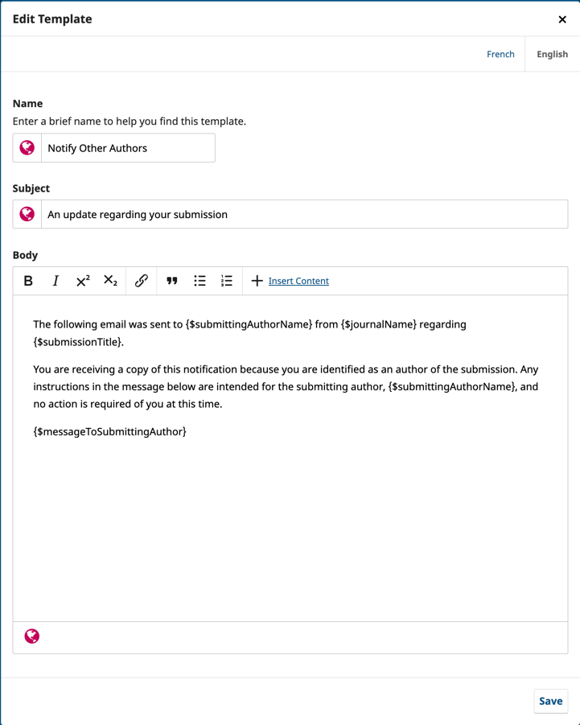

# About Open Journal Systems (OJS) {#about-ojs}

Open Journal Systems \(OJS\) is an open source solution to managing and publishing scholarly journals online. OJS is a highly flexible editor-operated journal management and publishing system that can be downloaded for free and installed on a local Web server.

It has been designed to reduce the time and energy devoted to the clerical and managerial tasks associated with editing a journal, while improving the record-keeping and efficiency of editorial processes. It seeks to improve the scholarly and public quality of journal publishing through a number of innovations, including enhancing the reader experience, making journal policies more transparent, and improving indexing.

This guide covers OJS version 3.3, released in February 2021, and features significant enhancements over the previous versions of the software. We hope you find it helpful for your publishing projects.

## Background

This PKP School video explains the background on PKP and OJS. To watch other videos in this series, visit [PKP’s YouTube channel](https://www.youtube.com/playlist?list=PLg358gdRUrDVTXpuGXiMgETgnIouWoWaY).



*OJS is a journal/web site management/publishing system*. OJS covers all aspects of online journal publishing, from establishing a journal website to operational tasks such as the author's submission process, peer review, editing, publication, archiving, and indexing of the journal. OJS also helps to manage the people aspects of organizing a journal, including keeping track of the work of editors, reviewers, and authors, notifying readers, and assisting with the correspondence.

*OJS is flexible and scalable*. A single installation of OJS can support the operation of one or many journals. Each journal has its own unique URL as well as its own look and feel. OJS can enable a single editor to manage all aspects of a journal and the journal's website, or OJS will support an international team of editors with diverse responsibilities for a journal's multiple sections.

*OJS supports the principle of extending access*. This system is intended not only to assist with journal publishing, but to demonstrate how the costs of journal publishing can be reduced to the point where providing readers with "open access" to the contents of the journal becomes a viable option. The case for open access is spelled out over a wide series of articles stemming from this project which are freely available under Research > Publications on the [Public Knowledge Project](https://pkp.sfu.ca/) website.

*The origins of OJS*. The system was first released in 2001 as a research and development initiative at the University of British Columbia, with the support of the Social Sciences and Humanities Research Council of Canada, the Max Bell Foundation, the Pacific Press Endowment, and the MacArthur Foundation. Its continuing development is currently overseen by the Simon Fraser University Library. For more information, see the [Public Knowledge Project website](https://pkp.sfu.ca).

## OJS Features

Visit our website to learn more about [Open Journal Systems](https://pkp.sfu.ca/software/ojs) and what it has to offer the whole researcher-to-reader workflow, from submission and peer review through to production and distribution.

## Install and Upgrade

OJS is easy to install and configure. However, running a web service requires a systems administrator who knows how to deploy web applications. Our Administrator's Guide provides full instructions on how to [download, install and configure OJS](/admin-guide/en).

> If you do not have the expertise, staff or desire to install and manage OJS on your own, [PKP Publishing Services](https://pkp.sfu.ca/hosting-services) provides complete hosting solutions for every budget.
{:.tip}

## What's New in OJS 3.4 {#whats-new}

### Workflow

OJS 3.4 introduces several workflow changes, including:

**A new and improved submission wizard**

Among other improvements, it is now possible to save/autosave a submission in progress, change a submission language, and make a submission file (component) required.

See the [Making a Submission](./authoring#making-a-submission) section and [Component](./settings-workflow#components) settings for more details.

**An improved process for recording editorial decisions**

As part of recording an editorial decision, it’s possible to add any email in CC/BCC fields of the author notification, as well as insert other content. A copy of the notification can be sent to reviewers in a separate screen that uses a reviewer-specific email template, maintaining anonymity from authors.

See the [Making the Decision](./editorial-workflow#making-the-decision) section for more details.

**An option to cancel a stage or a review round**

It is now possible to cancel an accidentally started review round, unless a reviewer has completed a review. It is also possible to cancel a stage and move the submission to a previous stage, e.g. from Copyediting to Review, with an option to notify the author about this change.

See the [Additional Round of Review](./editorial-workflow#additional-round-of-review) section for more details.

**Enhanced email template tools**

OJS 3.4 introduces new tools for email composition, including the ability to write and select between multiple templates. Each email comes with a glossary of available variables that can be inserted using the ‘Insert Content’ button. The values of variables, such as the author's name, can be previewed before the email is sent.

The default set of email templates that is included with OJS has been rewritten to be more inclusive and friendly.

See the [Email Setup](./settings-workflow#email-setup) section for more details.

The editorial decision toolset leverages these new tools, and they will be rolled out to other areas of the system in future releases.

For more information on the new editorial decisions workflow, see [slide deck](https://docs.google.com/presentation/d/e/2PACX-1vTpSVv_zY4RShrh3EfBZjHcRSYKVqDkzejDnESh6Bkg7uMgM8zFYZz-ha7j3iz_csTKump2_rI3YNWS/pub#slide=id.g16f0bb3e17f_0_26) and [video recording](https://youtu.be/JEJJ1FVpao0?t=1798).

### Statistics

COUNTER support has been updated to [COUNTER Release 5](https://www.projectcounter.org/counter-release-5/), including tools to report on readership on based on region and institutional access. This has also introduced basic [ROR (Research Object Registry)](https://ror.org/) support for institutional subscriptions.

(See [slide deck](https://docs.google.com/presentation/d/e/2PACX-1vTpSVv_zY4RShrh3EfBZjHcRSYKVqDkzejDnESh6Bkg7uMgM8zFYZz-ha7j3iz_csTKump2_rI3YNWS/pub#slide=id.g16f0bb3e17f_0_44) and [video recording](https://youtu.be/JEJJ1FVpao0?t=122).)

### Persistent Identifiers

DOI and Crossref support has been comprehensively rewritten in consultation with Crossref and to address common sources of confusion with the previous implementation.

(See [slide deck](https://docs.google.com/presentation/d/e/2PACX-1vTpSVv_zY4RShrh3EfBZjHcRSYKVqDkzejDnESh6Bkg7uMgM8zFYZz-ha7j3iz_csTKump2_rI3YNWS/pub#slide=id.g16f0bb3e17f_0_14) and [video recording](https://youtu.be/JEJJ1FVpao0?t=501).)

### Multi-Journal Installations

Site Administrators now have the same managerial access as Journal Managers regardless of whether they also have that role. This is intended to distinguish more clearly between Site Administrators (who are often system administrators or technical support, but are not active in journal workflow) from Journal Managers (who participate in workflow); in previous releases it was often necessary for administrators to have both roles assigned to be effective. [Github issue #7392](https://github.com/pkp/pkp-lib/issues/7392)

Starting with OJS 3.4.0, Journal Managers now have the ability to control user enrolment in their journal regardless of whether the user is active in other journals. In previous releases, it was often necessary to escalate enrolment issues to Site Administrators when a user was active in multiple journals. [Github issue #7391](https://github.com/pkp/pkp-lib/issues/7391)

### Submission title formatting

Submission titles can now contain limited formatting, including bold, italic, underline, superscript and subscript. This is particularly important for articles referencing taxonomical names (which are typically formatted in italics) and for review articles (which may reference the reviewed resource by underlined title). [Github issue #2564]([https://github.com/pkp/pkp-lib/issues/2564](https://github.com/pkp/pkp-lib/issues/2564))

### Other Notable Changes

* The submission full-text index is no longer updated at the moment the user performs a new upload. In previous releases this was a frequent source of frustration and the update process could be time-consuming.
* Data availability statement can now be enabled as one of the metadata fields.
* A direct “Unsubscribe” link is now added to system notification emails that support unsubscribing, such as new issue, announcement, discussion notifications, etc.

### More Information

For more detailed information on these changes, see the December 2022 Development Update presentation by the PKP Development Team, available as a [slide deck](https://docs.google.com/presentation/d/e/2PACX-1vTpSVv_zY4RShrh3EfBZjHcRSYKVqDkzejDnESh6Bkg7uMgM8zFYZz-ha7j3iz_csTKump2_rI3YNWS/pub) and [video recording](https://www.youtube.com/watch?v=JEJJ1FVpao0).

For a summary of changes in OJS 3.4 that are relevant to developers and development, please see the [Release Notebook for OJS OJS/OMP/OPS v3.4](https://docs.pkp.sfu.ca/dev/release-notebooks/en/3.4-release-notebook).

## Community Contributions

The OJS team encourages contributions from the developer community. If you are interested in getting involved in making OJS even better, we welcome your participation.

Excellent examples of community contributions include the vast array of languages that OJS is available in; and third-party plugins posted to the [community forum](https://forum.pkp.sfu.ca/) and the archived forum page.

We also welcome software testing and bug reporting contributions.

## Support

PKP offers the following free support resources for OJS:

* [PKP Docs Hub](https://docs.pkp.sfu.ca/): User guides, developer documentation and publishing tips for all of our software. Also includes links to community developed videos.
* [PKP Community Forum](https://forum.pkp.sfu.ca/): An online discussion board where you can ask questions, answer questions, and share ideas.
* [PKP School](https://pkpschool.sfu.ca/): A collection of online, open, and self-paced courses designed by PKP experts in English and Spanish. Includes video tutorials on Setting up Your Journal; the Editorial Workflow in OJS 3; and Becoming an Editor.

There is also a “Help” link on the top right corner of every page in OJS, OMP, and OPS where you can find information about the current page and its functions.

For questions about a particular journal site, such as submission requirements, contact that journal directly, using the contact information listed on the journal's **About** page.
