# Authoring

This chapter describes registering with a journal, making a submission, responding to peer review, and proofreading the publication-ready version of the manuscript in OJS as an author. 

If you are submitting to a journal using the OJS platform and are unfamiliar with the platform, you can refer to this chapter to learn how to proceed with your manuscript at any stage.

## Registering with the Journal

To make a submission to an OJS journal, you will first need to register a user account with a journal and log in \(see [Registering with a Journal](./user-accounts#registering-with-a-journal)\). After that, when you login, you will be taken to your Dashboard.

It is currently empty as you have made no submissions.

## Making a Submission

Start a new submission by clicking the **New Submission** button on the right side of the screen. You will be taken to the submission wizard where you can upload and describe your submission.

### Preliminary Information

First, you will provide preliminary information about your submission

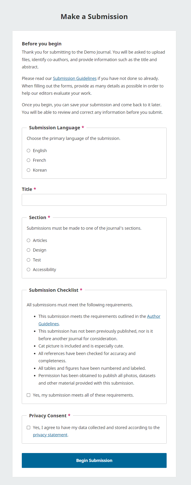

If the journal allows submissions in multiple languages, you will first need to select the appropriate language for your submission. (For Journal Managers: Additional Submission languages can be enabled in Website Settings -> Setup -> Language.)

Provide a title for your submission, then select the appropriate section for your submission \(e.g., article, review, etc.\)..

Review the submission checklist and ensure that your submission meets the journal’s requirements. 

Lastly, review the privacy statement and agree to the journal’s data collection policy in order to begin your submission. Once you click the Start Submission button, you will be able to save your incomplete submission for later and return to it from your dashboard at any time.

### Step 1: Details

In step one, you will provide some basic information about your submission, including the abstract, and optionally, keywords and a list of references.

As of OJS 3.4, limited HTML tags are supported for the formatting of manuscript titles and subtitles. Supported tags include ``<b>`` (bold), ``<i>`` (italics), ``<u>`` (underline), ```` (superscript), and ```` (subscript). These formatting options are also now available in the rich text editor when entering titles and subtitles.

To enter keywords, type the keyword or keyphrase and hit the Enter key. The word or phrase will be formatted as a keyword. There is no need to separate by commas or other punctuation.

If you have translated titles, abstracts or keywords to include, you can open additional fields for other languages by clicking the language in the upper right corner.

### Step 2: Upload Files

In **Step 2**, a window will open allowing you to upload your submission file(s).

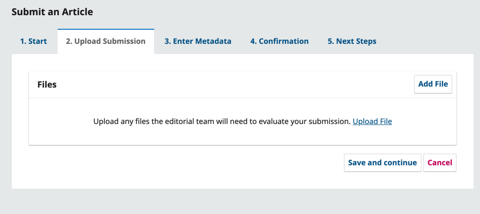

You can upload multiple files at once, as well as drag-and-drop files.

<figure class="video_container">
  <video controls="true" allowfullscreen="true">
    <source src="./assets/submission3.3-files.mp4" type="video/mp4">
  </video>
  <figcaption>How to drag and drop multiple files.</figcaption>
</figure>

Once you've uploaded all your files you will be asked to indicate the file type for each one. and metadata such as a description or license can be entered during the workflow.

Once you have finished uploading and indicating a type for all of your submission files, click the **Continue** button to move to the next step, adding contributor information.

### Step 3: Contributors

In this step, you will be asked to add more information about contributors (i.e. authors and translators) involved in the submission. By default, your details will already be added as the primary contributor.

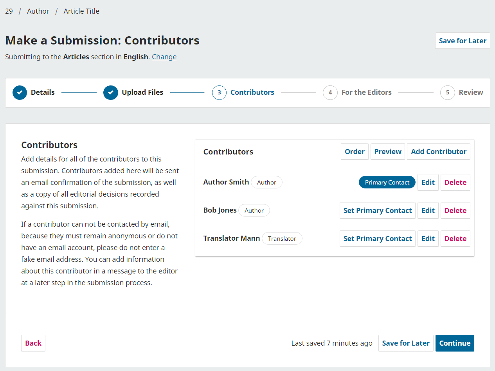

You can add additional contributors (e.g., co-authors), by clicking the **Add Contributors** link. This will open a new window with fields to enter their information. It is important to note that all contributors will receive an email confirmation of the submission. Note that the instructions state false email addresses should not be used for contributors if there is no valid contact for the contributor. It is recommended that you inform editors about any contributors without valid email addresses in the next step of the process as a note to the editor.

Hit **Save**, and the new contributor will be added to the list.

As of OJS 3.4, you are also able to alter the order of the list of contributors from the Order button. Click Order and press the up and down arrows beside a contributor to move them in the list. Click the Save Order button when you are done.

You can then preview the order in various forms, by using the “Preview Option” with options displayed for Abbreviated, Publication Lists, and Full order. 

Once all contributors have been added and ordered to suit your preferences,  click **Continue** to proceed.

### Step 4: Data Availability

Next, you’ll be asked to fill in optional fields to provide any information about the availability of your datasets (used when research data is shared in open data repositories) and comments to the editor. 

Enter any information about your data’s availability or comments to the editor and click **Continue** to proceed.

### Step 5: Review Your Submission

Finally, you’ll be given a chance to review all of the information you’ve entered for your submission. If there are any required fields not filled out, you will be warned on this screen and given the opportunity to make corrections.

After reviewing the details of your submission, you will be asked to read and agree to the copyright terms for submissions to the journal. 

Click the checkbox to agree and click the **Submit** button.

A box will pop up asking you to confirm you are finished. Click **Submit**.

Your submission is now complete! The editor has been notified of your submission. At this point, you can follow the links to:

* Review this submission
* Create a new submission
* Return to your dashboard

### Accessing and Tracking Your Submission

The submission will now be listed on your dashboard for future access, where you can track its progress.

Once you complete a submission, you cannot make changes to it. If you wish to replace the file you submitted or make other changes to the submission, you will need to contact the editor through the Pre-Review Discussions tool accessible by clicking the “View” button next to the submission on your dashboard.

Immediately after submission, your submission will remain in the Submission stage until an editor accepts it for review, where it will move into the Review stage. If accepted for publication after review, it will later move into the Copyediting and Production stages before being published.

## Editing Submission Information 

Depending on the settings of the journal and its policies, you may be able to edit the information about your manuscript such as the title, contributors, keywords, etc. (referred to as “metadata” in the software) at different stages of the editorial workflow. Changes might include updated abstracts, correcting spelling errors, or adding additional contributors.

To make edits to your submitted manuscript, click on the Publication tab of your submission.

> If the ‘Save’ button at the bottom of the page is grey and inactive, this means you will have to request permission from the Editor to make changes to your submission or ask them to make the changes for you. {:.notice}

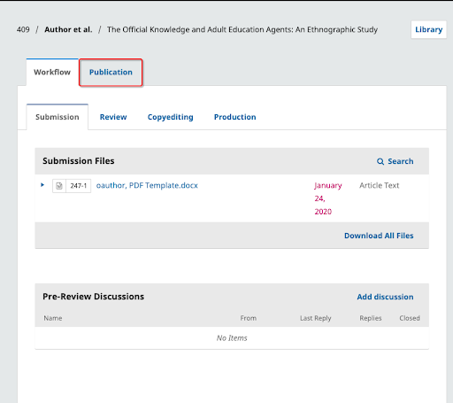

Make changes to any of the information about your submission by clicking the related tab in the sidebar. If you have editing permissions, you will be able to make changes to the following sections on the Publication tab: Title & Abstract, Contributors, and Metadata.

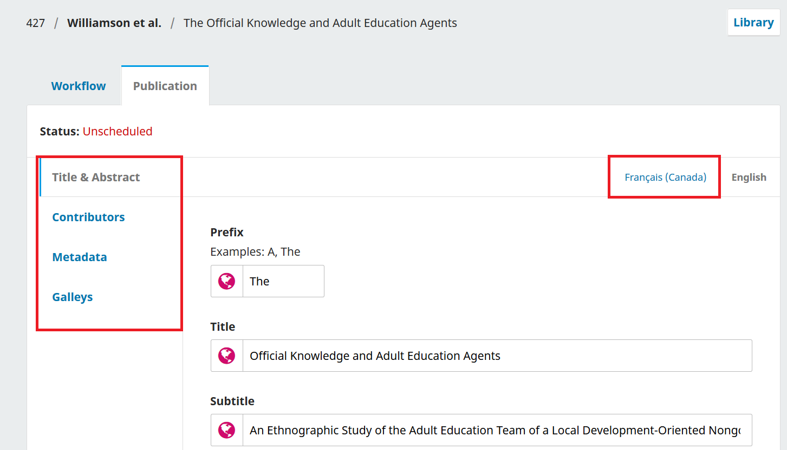

If multiple languages are enabled for the journal, you will be able to edit metadata in those languages by clicking on the relevant language tab in the top right. Click ‘Save’ once you’re done making your changes.

To learn more about creating quality metadata for your submissions, see [the Better Practices in Journal Metadata guide](/metadata-practices/en/).

## Responding to Requests for Revision or Resubmission After a Review


This PKP School video explains how an editor responds to a review and how an author can upload revisions (starting from 3:51). To watch other videos in this series, visit [PKP’s YouTube channel](https://www.youtube.com/playlist?list=PLg358gdRUrDUKJbWtr4bgy133_jwoiqoF).

Once the review process has been completed, you will be notified of the editor’s decision via email.

After receiving the email with the decision, click the provided link or login and access the relevant manuscript from the dashboard.

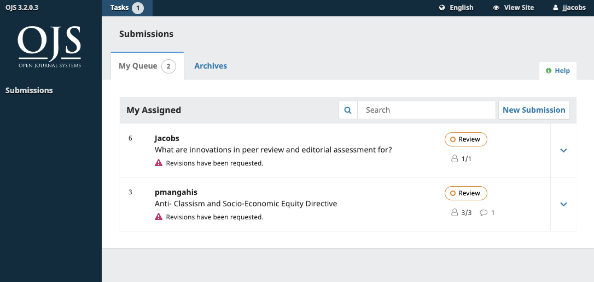

In the Review tab of the manuscript, you will also see a copy of the Editorial Decision under Notifications. 

> Depending on the type of peer review used by the journal, you may see less information on the Review tab of the journal. (The image below shows an open peer review wherein authors can see the identity of the reviewer.) {:.notice}

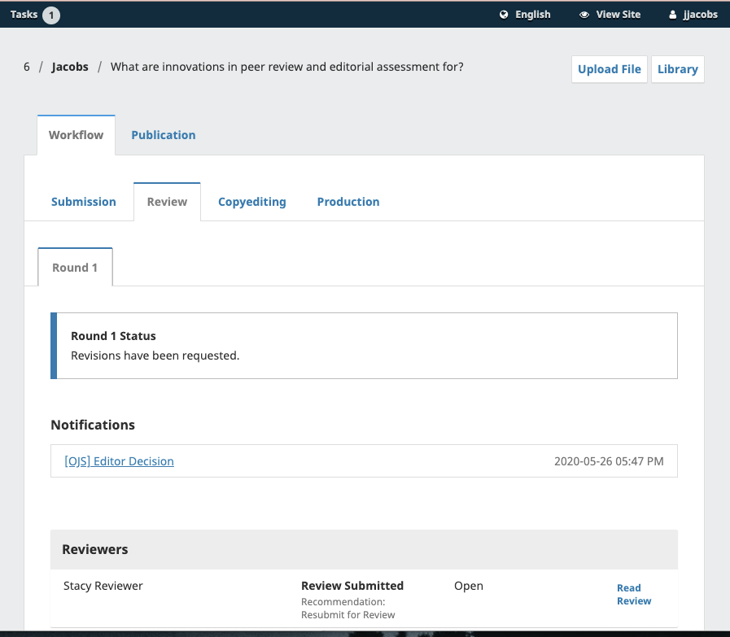

To view the Editorial decision, click the link under notifications.

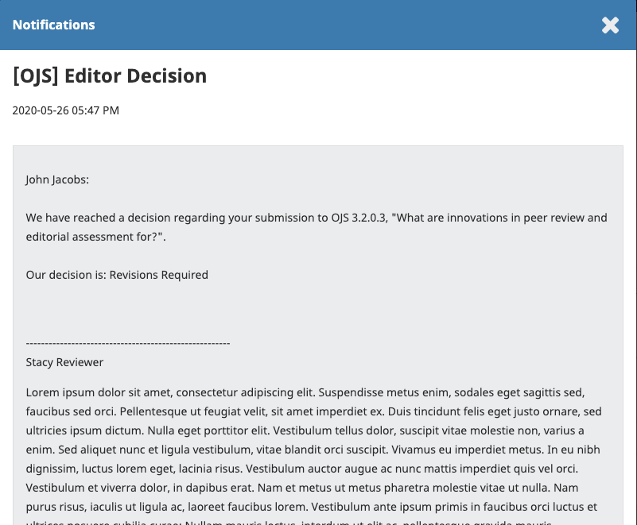

Based on the information in the editor's message in this example, you must now prepare your revisions.

### Uploading the Revised File

Once you’re ready to upload the revised file, scroll down the page and find the panel for **Revisions**.

Use the *Upload a File* link to upload your revised manuscript.

Use the dropdown menu to choose that you are uploading a revision of an existing file.

Then upload the revised file and hit **Continue**.

Check the file details and hit **Continue** again.

If you have any additional files to upload, do so now. Otherwise, hit **Complete**. The editor will receive a notification about the new file(s) being uploaded

Your revised file is now visible in the Revisions panel.

In addition to your revised files, you may want to provide additional details or directly inform the editor via the Review Discussion panel as explained below.

Click the *Add Discussion* link from the Review Discussions panel.

Select the user(s) you want to notify under Participants.

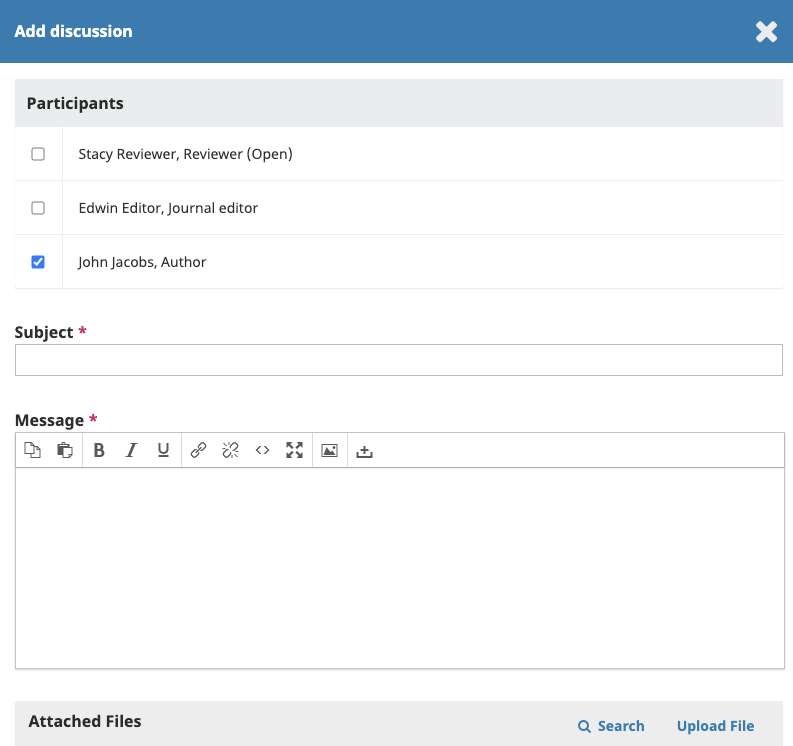

Add a subject line and a message.

Hit **OK** to send the message.

An email has now been sent to the editor and you and the selected participants can see the message in the Review Discussions panel.

If the editor’s decision was to resubmit for review, your revisions will be subject to another round of review before the decision to accept or decline is made. You may need to make further revisions by repeating the above procedure after the additional round of review.

At this stage, you must wait for the editor to contact you with further instructions or their final decision.

### Revisions Accepted

In the event that the revisions you’ve made to your submitted manuscript are accepted, you will receive an email notification as well as a  notification on your dashboard.

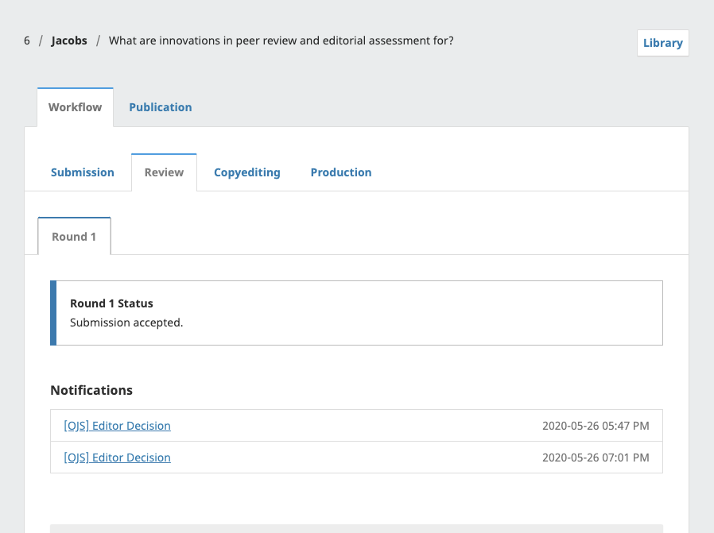

The notifications show up in order from oldest to most recent, meaning the most recent one will be on the bottom. Click on it to open the message (which is the same as the email you would have also received).

Use the **X** in the upper right corner to close the window.

Further down your dashboard, you will also see a discussion reply from the editor.

Clicking the discussion title will open it up.

Congratulations! You've been accepted and your submission file will be copyedited and prepared for publication by the journal’s editorial board.

## Responding to a Copyediting or Proofreading Request

 
This PKP School video explains the copyediting process, including how an editor can respond to a copyediting or proofreading request. To watch other videos in this series, visit [PKP’s YouTube channel](https://www.youtube.com/playlist?list=PLg358gdRUrDUKJbWtr4bgy133_jwoiqoF).

Throughout the copyediting process, you may be asked to inspect copyedited files in the copyediting stage or to review publication-ready copies of your submitted manuscript in the production stage. 

You will be notified by email and through a notification on your OJS dashboard whenever there is a copyedited file or publication-ready file for you to review.

You can either click the link in the email or notification, or visit your dashboard and click the “View” button next to the relevant submission to access the current editorial stage and view any files that require your revision.

From here, you can view both the discussions and the files for the current stage of the editorial workflow. Any files requiring your review will be shared below the discussions panel.

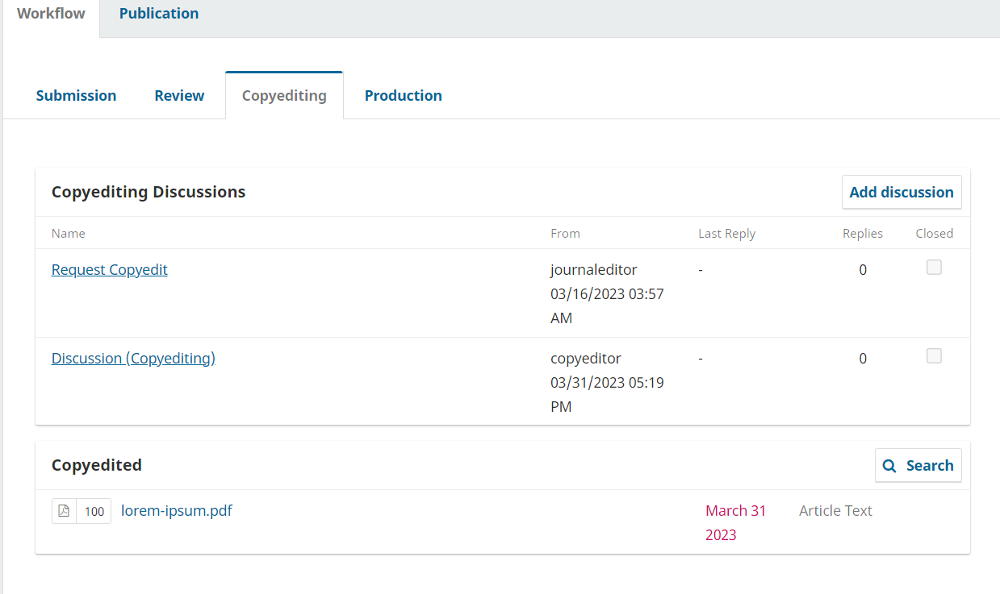

Once you have downloaded and reviewed the attached files, click on the title of the discussion to open the message.

Click “Add message” and indicate any required changes or give your approval. If needed, you can also attach a revision.

After reviewing and approving the copyedited files and final galleys (e.g., PDFs, HTML, etc.) before publication as requested, your role in the editorial workflow is now completed!
