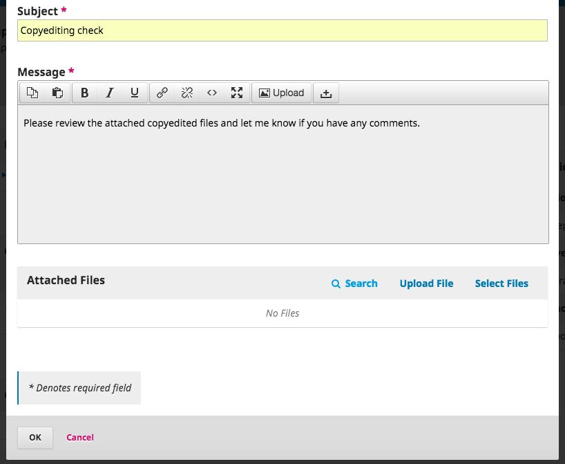
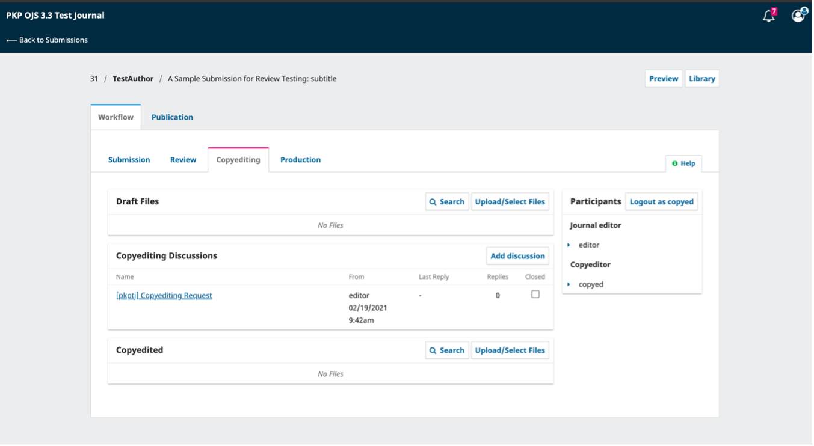
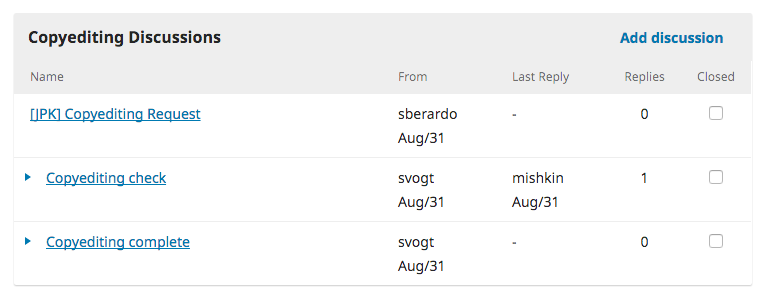

# Copyediting

When a submission is approved in the Review Stage, it will automatically move to the Copyediting stage.

## Adding a Copyeditor

When the submission enters the Copyediting Stage, a notification indicates that a Copyeditor needs to be assigned. Copyeditors can be assigned using the *Add* link on the Participants panel.

This will open a new window.

You can use the role dropdown to choose Copyeditor and hit the **Search** button. This will bring up all Copyeditors.

Select one of the Copyeditors for this submission.

Choose a prepared message.

Make any changes needed to the message.

Hit **Send**.

You can now see the new notification that the submission is awaiting copyedits, the Copyeditor is now included in the Participants list, and the request is visible in the Copyediting Discussions.

You can now wait for the Copyeditor to do her work.

## Copyeditor

The Copyeditor will receive an email message from the Section Editor requesting her to take on the submission.

To get started, she must login and find the submission from her dashboard.

Then, she can click the Copyediting link next to the submission name. This will take her directly to the Copyediting stage for this submission.

From here, she can see the Draft Files. These are the files that require copyediting. Clicking on the linked title will download the file to her desktop.

Outside of OJS, she will do her copyediting work.

To check the submission metadata, use the Metadata link in the blue bar at the top.

This would include checking the article title, abstract, author names, keywords, etc.

If any changes are made, hit the **Save** button before exiting this window.

### Consult with the Author

Once she has finished copyediting, she will run the changes past the Author by adding a new discussion, using the Copyediting Discussions panel's *Add discussion* link.

From the Add Discussion window, she must choose the Author and add a subject line and message.

Further down that same window, she must upload a copy of her copyedited file.

To do so, use the *Upload File* link. This will open a new window where you must choose the *Article Component* (e.g., article text) and upload the file.

Hit **Continue** to proceed.

This will open the next step, where you can edit the filename if needed.

Next, you can upload more files if necessary, or hit **Complete**.

Back on the Add window, you can now see the attached file.

Hit **OK** to send the message to the author.

It is now visible in the Copyediting Discussions.

You can now wait for the author's response.

## Author Responds

Once you hear back from the author, you can review his feedback by checking the discussion reply.

From here, you can see no further changes are required.

## The Final Copyedited File

Now you can go ahead and upload the final copyedited version to the Copyedited panel, near the bottom of the screen.

Use the Upload/Select Files link to upload the final copyedited version.

It is important to note here that you have a few choices.

1. You can use the Upload File link to upload a new file (e.g., a file with some recent changes since you showed it to the author).
2. You can select the Author's original version (unlikely).
3. You can select the Copyeditor version, which is the version you sent to the author (if you made no further changes, choose this one).

For this demonstration, we will select the Copyeditor version **by checking the box** to the left of that file.

Hit **OK**.

The file is now visible in the *Copyedited* panel (near the bottom of the screen), indicating to the editor that this is the final version, which is ready for the Production stage.

## Inform the Section Editor

The final step is for you to inform the Section Editor that the copyediting is complete.

To do so, start a new Copyediting Discussion by using the *Add Discussion* link.

In the discussion window, add the Section Editor, a subject line, and a message.

Hit **OK** to send the message.

Returning to the Copyediting stage, you can see the message is posted.

You work as the Copyeditor is now complete!

## Moving to Production

The Section Editor will receive an email that the copyediting is complete, and see a notification in the discussions.

You can download and review the final copyedited version from the Copyedited panel.

At this point you could communicate further with the Copyeditor, or, if you are satisfied, move the submission to the Production stage.

To do so, select the blue **Send to Production** button.

This will generate an official notice to the Authors that the submission is moving to the next stage.

Notice that the appropriate file, from the Copyedited panel, is included and will be automatically transferred to Production.

Hit **Record Editorial Decision** to proceed.

The Copyediting stage is now complete.
