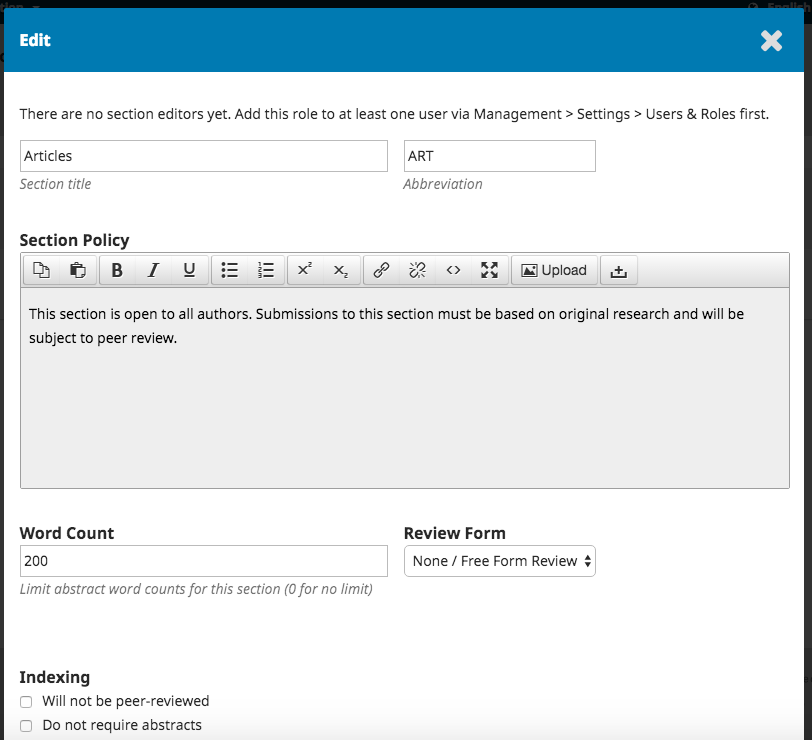
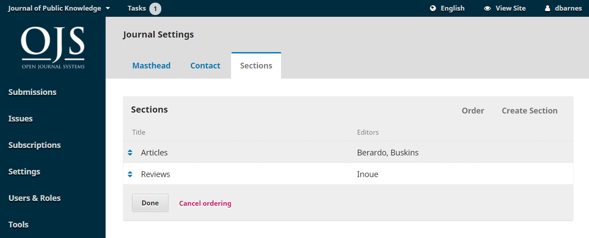
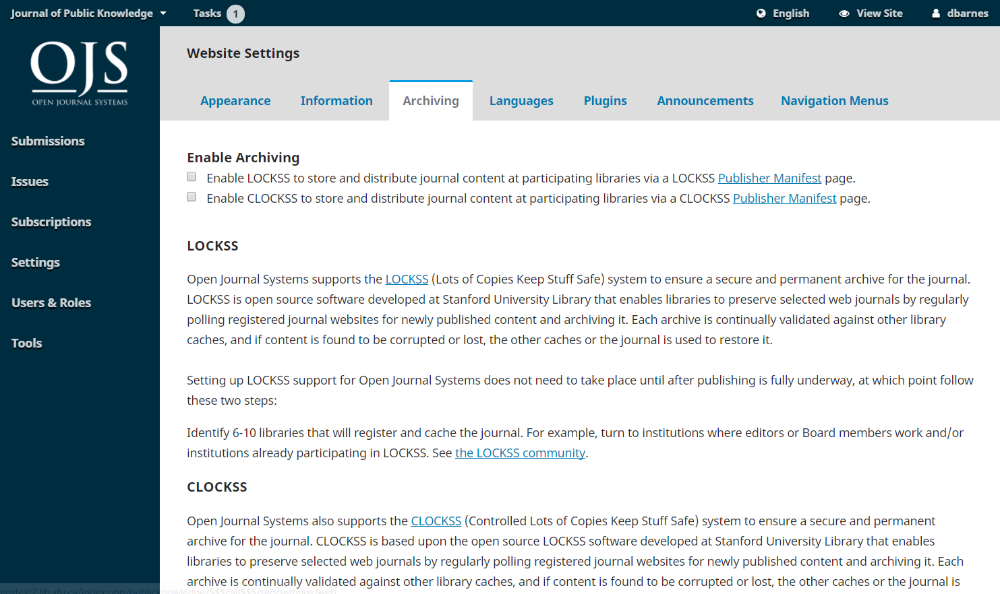
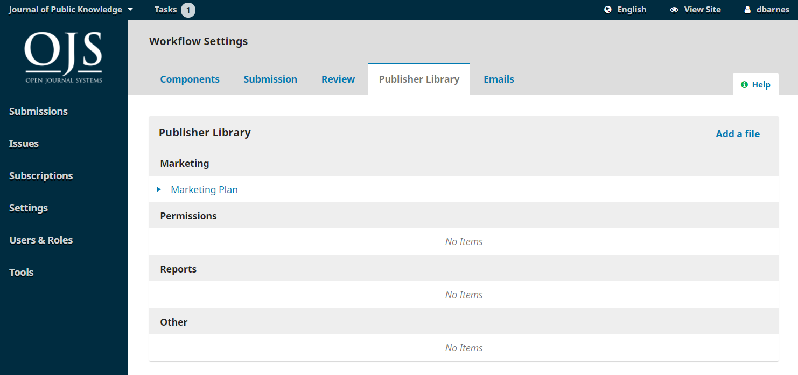
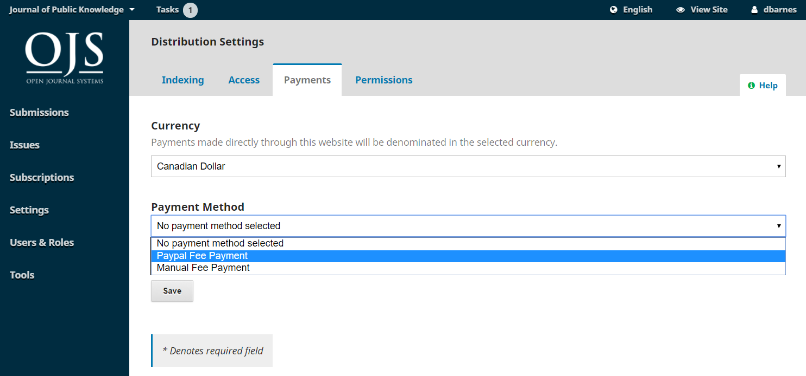
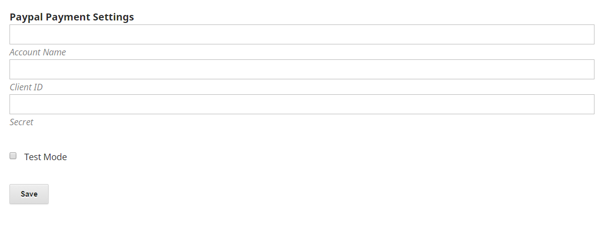

# Chapter 5: Settings

The Settings section allows you to configure your OJS installation to best meet your publishing needs.

You can find the Settings in the left menu panel when you are logged in as a user with Journal Manager permissions.

It consists of Journal Settings, Website Settings, Workflow Settings, and Distribution Settings, each of which will be covered in this chapter.

## Journal Settings

The Journal Settings page includes details about the journal.

Use the tabs to navigate to the different sections of Journal Settings: Masthead, Contact, Sections.

### Masthead

**Journal Name** is the name of your journal. E.g., Journal of Software Documentation

**Journal Initials** are the initials of the journal. E.g., JSD.

**Journal Abbreviation** is the abbreviation of your journal name. E.g., JSoftDoc.

**Publisher** is the name of the organization publishing the journal.

**ISSN** \(International Standard Serial Number\) is an eight-digit number which identifies journals. It is managed by a world wide network of National Centres coordinated by an International Centre based in Paris, backed by Unesco and the French Government. A number can be obtained from the [ISSN web site](http://www.issn.org/). This can be done at any point in operating the journal.

OJS journals will typically have an online ISSN, but some may also publish a print version, which requires a different print ISSN.

**Journal Summary** is a brief description of your journal. If you are on an OJS installation with multiple journals, this text will appear with your journal listing.

**Masthead** allows you to add the names of your editorial team or anyone else you wish to mention. This will appear on the public website under About &gt; Editorial Team.

**About the Journal** is a space to add any information about your journal which may be of interest to readers, authors, or reviewers.

This could include your open access policy, the focus and scope of the journal, copyright notice, sponsorship disclosure, history of the journal, a privacy statement, and inclusion in any LOCKSS or CLOCKSS archival system.

Hit the **Save** button to save your changes.

### Contact

Use this section to add journal contacts.

**Mailing Address**: Add your journal's official mailing address here. This will appear on the journal's Contact page.

**Principal Contact**: Add contact information for the journal's main contact person.

**Technical Support Contact**: Add contact information for the journal's technical support person. This information will appear on the journal's Contact page and also in different points in the workflow to offer assistance to users.

Hit the **Save** button to save your changes.

### Sections

Use this page to configure the different sections of your journal. E.g., Articles, Editorials, Reviews, Commentary, etc.

All of your existing sections will appear here. OJS requires at least one section, and creates an "Articles" section by default.

You can modify sections by clicking on the blue arrow to the left of the section name. This will reveal options to edit or delete the section.

#### Editing a Section

Selecting the edit link will open a new window with different configuration options.

From here, you can change the name or abbreviation of the section.

**Section Policy**: Use this field to add important details such as submission requirements, peer review, etc.

**Word Count**: Use this to limit the number of words for abstracts in this section.

**Review Form**: You can select specific review forms for each section. Learn more about Review Forms here.

**Indexing**: Each section can have different indexing settings. For example, an Editorial section will not typically be peer-reviewed.

**Identify items published in this section as a\(n\)**: This used by some indexing systems. Note that it is not a required field.

Hit the **Save** button to save your changes and return to the Sections page.

#### Create Section

From the sections page, select the Create Section link to open a blank window, exactly the same as the window used for editing a section described above.

Fill in the details and hit Save to record your work.

#### Ordering Sections

When you have more than one section created, you will see an Order link. Use that to reorder how those sections display on your journal website.

Hit the **Done** button when you are finished.

## Website Settings

The Website Settings allow you to configure how your journal's website looks and operates. It consists of tabs for Appearance, Information, Archiving, Languages, Plugins, Announcements, and Navigation Menus.

### Appearance

**Logo**: Use this space to upload a journal logo to the upper left corner of your reader interface.

**Page Footer**: This allows you to display text at the bottom of each page of your website.

**Theme**: As new themes become available, you can enable them here.

**Typography**: Quickly choose the fonts for your journal.

**Colour**: Quickly change the colour of your journal's header.

**Journal Style Sheet**: Use this to upload a unique style sheet for your journal.

**Sidebar Management**: This allows you to move different blocks in or out of the sidebar in the reader interface.

**Homepage Image**: Uploading an image here will will place it on your journal's home page.

**Journal Favicon**: Add a [favicon](https://en.wikipedia.org/wiki/Favicon) to display in the reader's browser address bar.

**Additional Content**: Any text entered here will appear on your homepage.

**Lists**: Limit the number of items \(for example, submissions, users, or editing assignments\) to show in a list before showing subsequent items in another page. Also, limit the number of links to display to subsequent pages of the list.

**Journal thumbnail**: Upload a small logo or image representative of the journal that will be used in lists of journals on this OJS installation. This will only be used on OJS installations with multiple journals.

Hit **Save** to record your changes.

### Information

Use these fields to modify the text in the For Readers, For Authors, For Librarians pages on the journal website.

Remember to hit **Save** to record any changes.

### Archiving

If you are a member of a LOCKSS or CLOCKSS network, use this page to activate your journal.

### Languages

Use this page to configure the languages used by your journal.

**Primary Locale**: One language must be set as primary.

**UI**: This will enable all selected languages to appear on the reader interface.

**Submission**: This will enable all selected languages to be available to submitting authors.

**Forms**: This will enable all selected languages to be available when filling in online forms.

If a language is unavailable on this page, contact the Site Administrator to add it for you. See Site Administration for details in Chapter 4.

### Plugins

Use this page to see all of the installed plugins and find new plugins.

#### Installed Plugins

All of the plugins listed here are available in your OJS installation. Use the Enable link to use them.

You will notice that some plugins are required for the system and cannot be disabled.

#### Plugin Gallery

The Plugin Gallery provides access to externally-created plugins, that may not be included in your OJS installation, but are available for download and activation.

Selecting the plugin title will provide additional details, including the author, status, description, and compatibility.

### Announcements

This section allows you to create and display news announcements on the journal's website.

**Announcements**: Configure how announcements will appear on your journal website.

**Announcement Types**: You can create different types of announcements \(e.g., News, New Issue Alert, etc.\). Use the _Add Annoucment Type_ link to create them.

**Announcements**: Use the _Add Announcement_ link to create a new announcement for your Announcements page.

#### Navigation Menus

This section allows you to configure your navigation menus, such as including new links.

**Navigation Menus**: Configure the User Menu \(which includes Language, View Site, and Username\) or the Primary Menu \(on the journal home page, including Current, Archive, About, etc.\).

**Navigation Menu Items**: These are programmed links you can add to either menu above. If you wish to add a link to the Primary Menu \(e.g., "Our Society"\), add it here using the _Add Item_ link.

It will now appear in the list of Navigation Menu Items. Next, go to the desired Navigation Menu \(e.g., Primary\), use the blue arrow to reveal the options, and choose Edit. You can now drag and drop it from Unassigned Menu Items to Assigned Menu Items and into the appropriate location on the menu.

Hit Save to record the change.

## Workflow Settings

The Workflow Settings allow you to configure various parts of the journal's editorial workflow. Its tabs include Components, Submission, Review, Publisher Library, and Emails.

### Components

When an author makes a submission, they can upload multiple files. Typically, one file will be the article text, and others can include interview transcripts, data, images, etc. Each of these files is a **component** of the submission. The components available for the author to choose from when making her submission are listed here.

Using the links provided, you can change the **Order** of the components \(how they will be listed to the submitting author\), **Add a Component** \(if something you need is not included by default -- e.g., Video\), or **Restore the Defaults** \(if someone has made too many modifications and you just want to reset everything\).

#### Edit Component

You can also edit each component by selecting the blue arrow to the left of the component name. This will reveal an Edit link and a Delete link.

**Name**: This is the name of the component, as presented to the author.

**Options**: Choose how the files associated with this component will be treated and displayed.

**File Type Grouping**: Determine whether this component is associated with the submission document, artwork, or is a supplementary file.

### Submission

Use this section to configure the submission process.

**Author Guidelines**: Use this field to add guidelines for your authors. This information will be displayed on the journal website.

**Submission Preparation Checklist**: Authors must check off that they agree with each item on this list. Use the _Order_ link to change the order of the items, use the _Add Item_ link to create a new item, and use the blue arrow to the left of the item name to _Edit_ an exiting item.

**Notification of Author Submission**: Add an email address here to be contacted whenever there is a new submission.

**Submission Metadata**: This section allows you to determine which metadata fields to use for your journal.

Each entry is a different metadata type available for every article in your journal.

Some journals may want to activate all of them, but many will wish to keep it simple and just choose Keywords.

If you choose _Enabled_, that metadata type will be added to your submissions for completion by an editor.

If you choose _Submission Form_, that metadata type will also be presented to your authors for them to fill in during their submission.

Remember to hit the **Save** button to record any changes to this page.

**Privacy Statement**: The default privacy statement can be modified if you wish.

### Review

This tab allows you to configure your journal's review process.

**Default Review Deadlines**: Indicate how long reviewers have to decide to accept or decline a review request from the editor, and how long they have to make a recommendation.

**Automated Email Reminders**: Set automatic reminder email messages to be sent to late reviewers. Note that some system settings must be configured by the Site Administrator. See the [Administrator's Guide](https://docs.pkp.sfu.ca/admin-guide/en/email) for more information.

**Review Forms**: Review forms provide reviewers with a set of questions to respond to. This can help focus their feedback in ways that is more useful to you.

**Create Review Form**: Use the Create Review Form link to make a new form.

The Description and Instructions provide information about the form and when to use it for Journal Managers and Editors. This content is not included on the form that reviewers see. You can add instructions and guidelines for reviewers under Review Guidelines \(below\).

Back at the Review Forms page, select the blue arrow to the left of the form name to reveal the Edit link.

Select the Edit link and complete the form.

**Items** are form questions.

You can choose whether to make the question required and visible to the author.

You can then choose the type of response, including:

* a single word text box
* a single line text box
* an extended text box \(for longer answers\)
* checkboxes \(where the reviewer can select multiple possible reponses\)
* radio buttons \(where the reviewer can only select one possible answer\)
* dropdown menu \(also where reviewers can only select one possible answer\)

**Response Options** are the selections you make available for the checkboxes, radio buttons, or dropdown menus. A good example of a checkbox response is a [Likert scale](https://en.wikipedia.org/wiki/Likert_scale), where the reviewer must choose only one option: E.g., Good, Neutral, Bad.

Remember to hit the **Save** button to record your changes.

Use the **Preview** tab to test out the form.

Once you send the form to a reviewer you will no longer be able to edit it because that would change the record for existing reviews using that form. If you want to make changes to the review form at that point you can copy the existing form and create a new updated version.

**Blind Review**: Check this box to display a link for instructions on ensuring all submission files are anonymized.

**Competing Interests**: Add your competing interest disclosure policy statement here.

**Reviewer Competing Interest statement**: Add a checkbox that reviewers agree to comply with your competing interest statement.

**Review Guidelines** Provide your reviewers with criteria for judging a submission's suitability for publication in the press, which may include instructions for preparing an effective and helpful review.

**Review Options**: Select whether your journal will follow an double blind, blind, or open review process.

**Reviewer Access**: Enable the first option to provide reviewers with one-click access to the review, by-passing the need to go to the website, login, and find the submission. For security reasons with this option, editors are not able to modify email addresses or add CCs or BCCs prior to sending invitations to reviewers.

Enabling the second option will limit access to submission files until after the reviewer has agreed to do the review.

Hit the **Save** button to record your changes.

### Publisher Library

Use the Publisher Library to store important documents, such as your journal's Marketing Plan, and share them with your editorial team.

### Emails

The section allows you to configure the emails that are sent out from the system. 

**Signature**: The information in this field will be added to the bottom of every email sent out by the system.

**Bounce Address**: A notice will be sent to this email address of any system-sent emails that fail to deliver, such as when the targeted email address is no longer valid.

**Prepared Email Tempates**: Pre-written emails are an important part of OJS. You see all of them here, and use the Edit link \(as always, found by selecting the blue arrow to the left of the template name\) to make any modifications.

Some configuation is required to send email. See the [Administrator's Guide](https://docs.pkp.sfu.ca/admin-guide/en/email) for more information.

## Distribution Settings

The Distribution Settings focus on helping to raise the visibility of your journal. The tabs consist of Indexing, Access, Payments, and Permissions.

### Indexing

This section helps you enhance your search engine optimization.

Use **Description** to provide a brief description of your journal for search engines.

Use **Custom Tags** to add custom HTML header tags to the header of every page of your journal \(e.g., META tags to temporarily block search engine indexing\).

### Access

OJS provides a number of security-related options that can be used to restrict the journal's contents, and maintain additional information about submissions for auditing purposes.

By default, the open access option is selected. However, if you wish to only use OJS for a subscription journal, choose the second option. This will also enable the Subscription section in the left sidebar \(more on Subscription Management in an upcoming chapter\).

For editorial management and not for publishing, select the last option.

### Payments

OJS provides the ability to collect online payments. Use this section to determine the default **Currency** type \(e.g., Canadian Dollars, Euros, etc.\) and **Payment Method** \(e.g., Paypal\).

Choosing **Manual Fee Payment** will allow you to type in some instructions to your users \(e.g., where to mail a cheque\).

Choosing **Paypal Fee Payment** will enable some additional settings where you can add the details from your Paypal account.

### Permissions

This section covers copyright issues for your journal.

**Copyright Notice**: Add your journal's copyright statement here. It will be visible on the journal website.

Check the box to require authors to agree to your copyright statement.

**Base new article's copyright year on**: Choose whether the copyright date is based on the issue \(under a traditional, issue-based publishing model\) or on the article \(based on a continuous publishing model\).

**Copyright Holder**: Select who holds copyright to the articles published by your journal. The trend in open access publishing is to allow authors to retain copyright of their work.

**License**: Select the license for your journal. CC Attribution 4.0 is a widely used license for open access journals, allowing for maximum sharing and reuse.

**Reset Article Permissions**: If you journal later changes its licensing policy, use this button to reset the copyright on all published content.
