# Chapter 15: Production and Publication

With the completion of the Copyediting stage, the submission now moves to Production. From here, the copyedited files will be converted to publishable formats in the form of galley files (e.g., PDF, HTML) and proofread before publishing. A new journal issue will be created and the article will be scheduled for publication in the issue. This chapter explains the steps in that process, as well as how to use the versioning feature in OJS 3.2 to publish a new version of an article if significant changes are made. 

OJS also offers a straightforward way to bypass the editorial workflow described in the previous chapter and submit content directly into production, where it can be added to an issue and published. You can do this via Quick Submit plugin. See the detailed [Quick Submit plugin instructions under the Data Import & Export chapter](./tools.md#importexport).

To start working in Production, the Section Editor or Journal Editor must login to the system and choose the submission from their dashboard.

Clicking on the article will open the submission record.

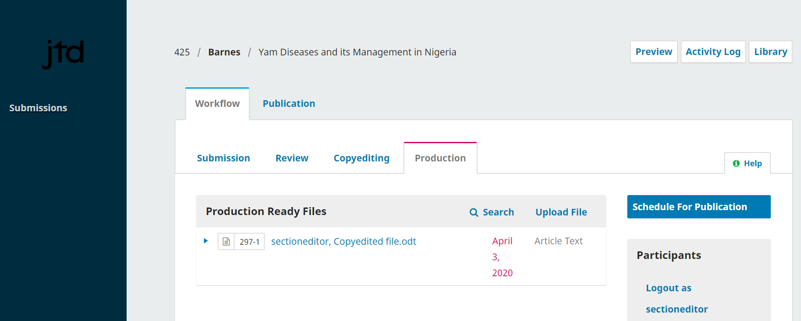

You will see the copyedited files are now available in the **Production Ready Files** panel. 

In the **Production** tab, you can assign participants (such as a Layout Editor) to the Production stage of the workflow and communicate with participants in the **Production Discussions** panel.

## Publication Tabs
Everything related to publishing a submission is done under the Publication tab. The Publication tab allows you to edit or add information about the submission, including contributors, metadata, and identifiers. It is also where you will upload the final Galley files for publication in the journal.

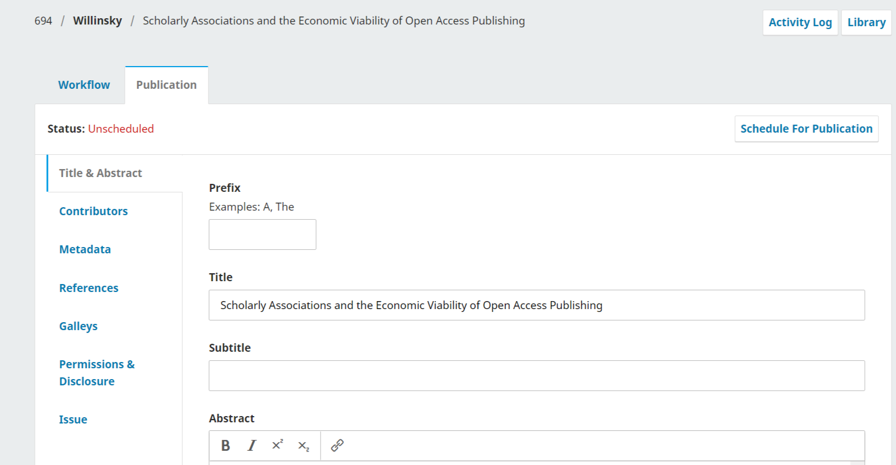

Here is an overview of what the different tabs in this section are for. Detailed instructions on some of these are available later in the chapter.

learning-ojs-3.2-production-publication-tab.png

**Title & Abstract**
Use this tab to edit the article title, subtitle, and abstract.

If any changes are made, click Save before exiting this window.

**Contributors**
Use this tab to add, edit, or remove article contributors.

**Metadata**
Use this tab to add or edit article keywords. 

If any changes are made, click Save before exiting this window.

**Identifiers**
Use the Identifiers tab to view or add a unique identifier, such as a DOI. More information about assigning and managing DOIs is available in the [DOI Plugin Guide](https://docs.pkp.sfu.ca/doi-plugin/en/).  

**Galleys**
Use the Galleys tab to upload the final file for publication. This is explained below.

**Permissions & Disclosure**
Include details about the copyright holder and link to the article license, if applicable. This will be automatically filled in according to your [Distribution Settings](./settings-distribution.md).  

**Issues**
Use the Issues tab to assign the article to a journal issue. This is explained below.

### Multilingual submissions

The Title & Abstract, Metadata, Permissions & Disclosure, and Issue tabs have options for adding and editing metadata in multiple languages. Languages must first be turned on in Website Settings -> Setup -> Languages.

Select the desired language tab below the “Schedule for Production” button, and complete the metadata fields in the selected language. 

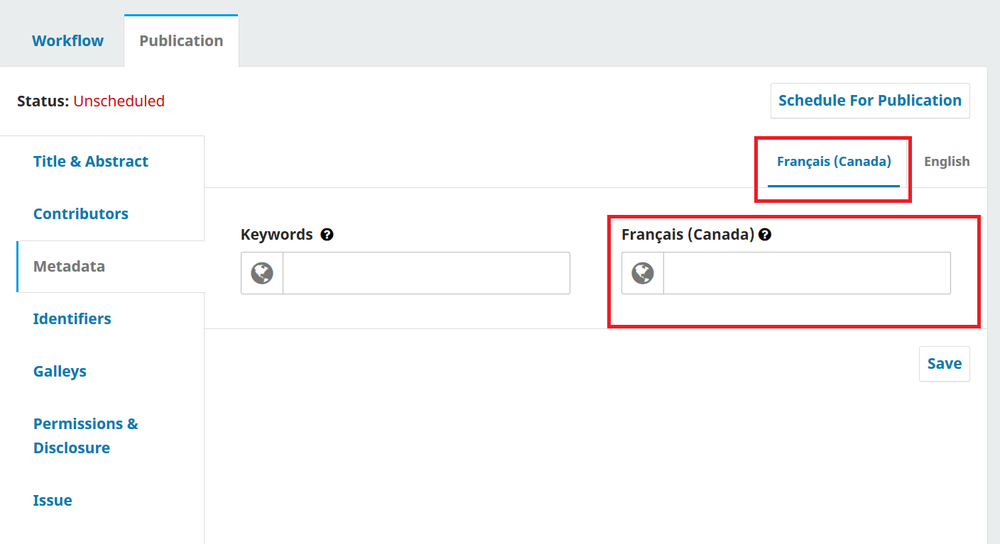

The “Issue” tab allows you to upload multiple cover images in selected languages.

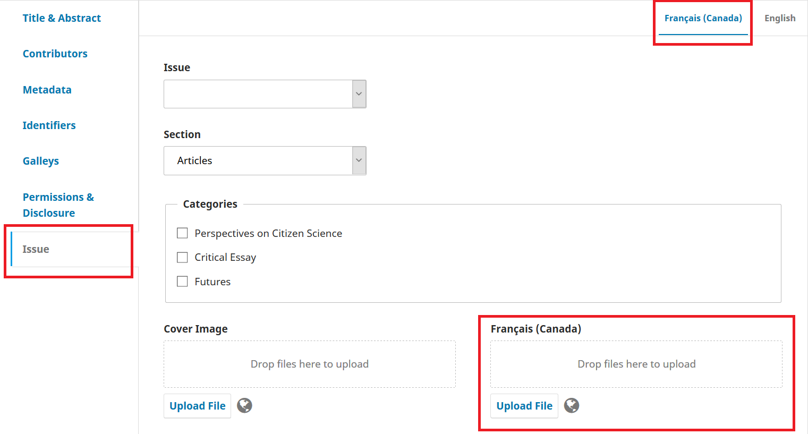

## Format Article for Publication

### Assign Layout Editor
A notification banner indicates that you must assign someone to create the galley files (e.g., the PDFs, HTML, etc.) from the production ready files.

This can vary from journal to journal – you may have layout editors or production assistants to do this work. Some journals use an external graphic design or typesetting service. If you would like to communicate with your layout editor, production assistant, graphic designer, or typesetter through OJS and manage the production process with them in OJS, ensure they have a user account and add them as a participant to the submission. 

To make the assignment, use the **Assign** link in the Participants list. This will open a new window.

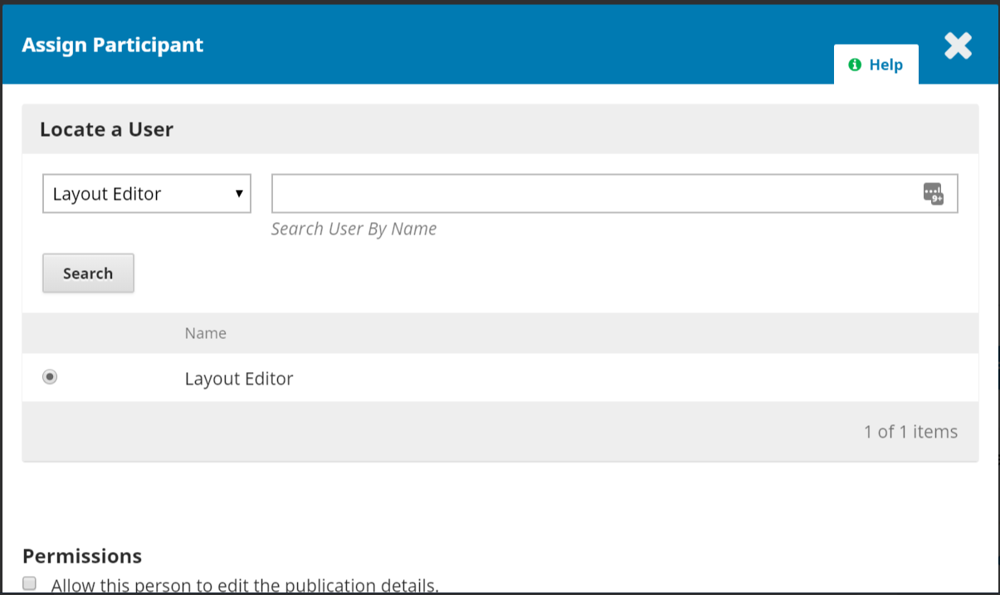

Use the role selector and search button to find appropriate users. Select the user and choose a predefined message, then click **OK** to send.

The user has now been notified via email and in the dashboard.

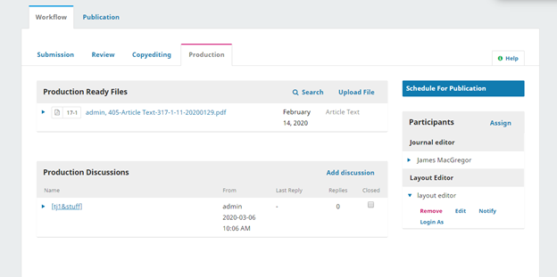

You can now see the Layout Editor in the Participants list, and you can see the request notice in the Production Discussions panel.
You can now wait for the Layout Editor to complete their tasks.

### Layout Editing
As a Layout Editor, you will have received a message inviting you to create the galleys for the submission.
To get started, login to the system and go to your dashboard.

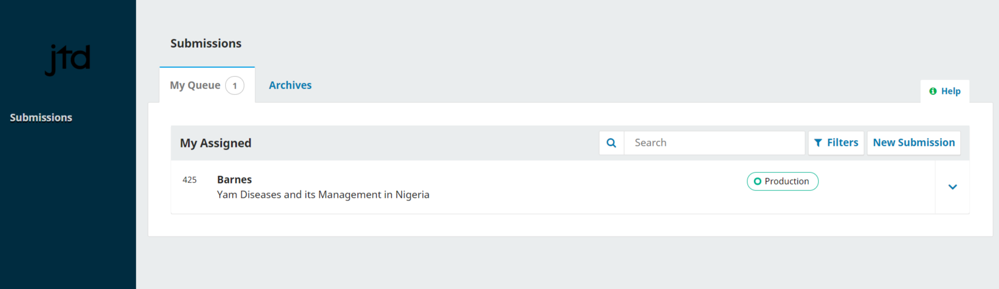

From here, find the submission and select the **Production** link. This will take you to the submission record.

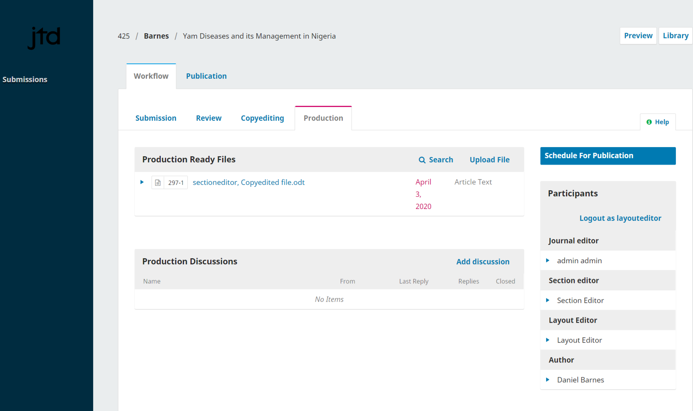

From the Production Ready Files panel, download the files to your desktop and work outside of OJS to convert them to galley files. The next section explains galley file formats and preparation.

> Note: PKP is currently working on a project to automate the conversion of Microsoft Word documents into other formats, including XML, HTML, PDF, EPUB, etc. Keep an eye on our blog for updates.

### Prepare and add galley files
A Galley is the final publication-ready file that has been prepared for readers and will be published on the article page. Galleys should be in a stable non-editable format (e.g., HTML, PDF, ePub, or XML) versions of the full-text article. Galley files can also include supplementary material such as multimedia files and research data. You can publish a galley file for an article and for an entire issue.

#### Galley file component types
When you upload a galley file, you will need to select a **Component Type**. These are the same component types that authors select from when they upload submission files. You can configure component types under Workflow Settings > Submission > Components, according to whether you want the component type to be published and whether you want a link to it to appear on the article landing page or in the table of contents. The configurations are as follows:
* Dependent: the link will not appear with published content at all
* Supplementary: The link will appear on the article landing page
* Neither supplementary nor dependent: The link will appear on the article landing page and in the table of contents

#### Galley file formats
Online journals publish their articles in a variety of file types. The most common are PDF and HTML, but increasingly additional formats are being used, such as ePub, MP3, and XML. 

Plugins in OJS allow PDF, HTML, and XML files to be viewed in a web browser or downloaded. If the files are being downloaded instead of displayed in the browser, you may need to enable one of these plugins under Website Settings > Plugins:

* PDF.JS PDF Viewer provides rendering support for PDF Article files.
* eLife Lens Article Viewer provides rendering support for JATS XML Article files using eLife Lens.
* HTML Article Galley plugin provides rendering support for HTML Article files.

Other formats may require additional plugins or can be downloaded directly. Alternatively, you may host the full-text content on a different platform and embed a remote URL by choosing the checkbox: “This galley will be available at a separate website.”

#### Using templates 
Requiring all submissions to use a document template that is pre-formatted with your journal’s publication styles (e.g., the font face, font size, boldness, placement, etc., of the header, body, footers, etc.) can make your document conversion much easier.
Microsoft provides a brief overview for creating templates in MS Word [here](https://support.office.com/en-us/article/create-a-template-86a1d089-5ae2-4d53-9042-1191bce57deb).

Once you’ve created a template that matches your journal style, it may be useful for submitting authors, layout editors, or other users. 
Here’s an example of an OJS journal that requires authors to download and use a template file: [Paideusis](https://journals.sfu.ca/pie/index.php/pie#authorGuidelines).

Ideally, your template should be created using styles rather than direct formatting. This not only ensures consistency throughout your documents, but will also aid in any conversions to other formats (e.g., HTML). Here’s an  [explanation of the difference between styles and direct formatting in Word](https://support.office.com/en-us/article/Style-basics-in-Word-d382f84d-5c38-4444-98a5-9cbb6ede1ba4?CorrelationId=1b00844c-a9dc-4d62-98df-a966f30d4b20&ui=en-US&rs=en-US&ad=US&ocmsassetID=HA010230882)

#### PDF files 
A PDF is the easiest type of file to create from a Word document. Current versions of Microsoft Word (and other word processors) let you “Save As” or “Export As” a PDF. The majority of OJS journals publish their articles as PDFs.

PDFs are also popular with many readers as they most closely recreate the printed page. However, PDFs are often less flexible on mobile devices and do not always handle links or embedded media (such as sound or video files) particularly well. With the widespread usage of mobile devices, ensuring your audience can read your articles on their phones or tablets is increasingly important.

Example (see PDF link at bottom of page): [Irish Journal of Technology Enhanced Learning](http://www.journal.ilta.ie/index.php/telji/article/view/22/51)

#### HTML Files

#### ePUB Files
Similar to HTML files, ePub files are ideal for mobile devices but require specialized coding to create. Conversion tools are available, such as [Calibre](https://calibre-ebook.com/). More detailed HOW TO instructions for creating ePub files are [available here](https://www.wikihow.com/Convert-a-Word-Document-to-Epub).

Like HTML files, some additional cleanup may be required after conversion and [require some knowledge](http://www.jedisaber.com/eBooks/Introduction.shtml) of the format.

Example (see EPUB link at bottom of the page): [International Review of Research in Open and Distance Learning](http://www.irrodl.org/index.php/irrodl/article/view/2895)

#### XML Files
XML files are structured files in which each part of the article is tagged as a distinct element. This allows the reader to easily navigate through and access figures, images, metadata, references, and parts of the article text. Creating XML files is a very efficient way to publish in multiple formats. When you create an XML file, you can then automatically generate PDFs, HTML, ePub, and other formats.

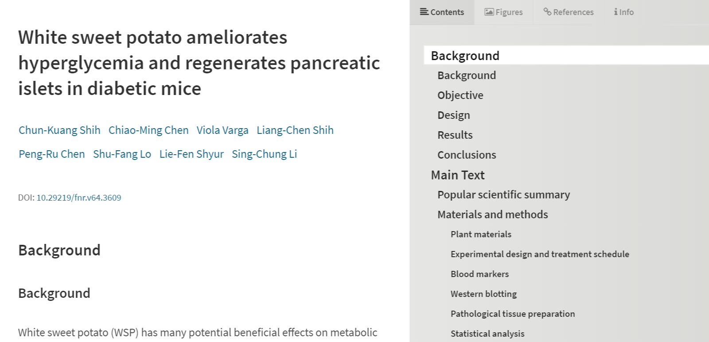 
PKP is developing tools that will allow you to create, convert, and edit XML files within OJS. Currently you need to create and edit the files outside of OJS. If you want to produce XML galley files for your journal, you can use the services of a graphic designer or typesetter, or if you have some XML expertise you can create the files yourself. W3schools has excellent tutorials on XML.

Example [Food and Nutrition Research](https://foodandnutritionresearch.net/index.php/fnr/article/view/3609/10173)

#### Multimedia Files

### Contact the Author
Next, you will want to share the PDF with the author for a final look and sign off. To do so, use the **Add Discussion** link in the Production Discussion panel. This will open a new window.

Remember to add the author at the top of the window and then add a subject and a message.

Before sending, attach a copy of the PDF file using the **Upload File** link. This will make it available to the author.

Remember to select the correct Article Component and then upload the PDF. 

Click **Continue**.

Next, make any changes to the file name (usually you don’t need to do anything here).

Then, you can upload additional files, if necessary.

Once you are done, hit **Complete**.

The file is now attached and you can send the message using the **OK** button.

The Author has now been notified and you can await their response.

### Author Response

Once the author has had a chance to review the galleys and respond, you will receive an email notification and will see a reply in the Production Discussions.

### Add Galleys 

Now that the Author has proofread the galleys, you can make any final changes, and then upload them to the submission. To upload galleys, go to the Publication tab, then Galleys.

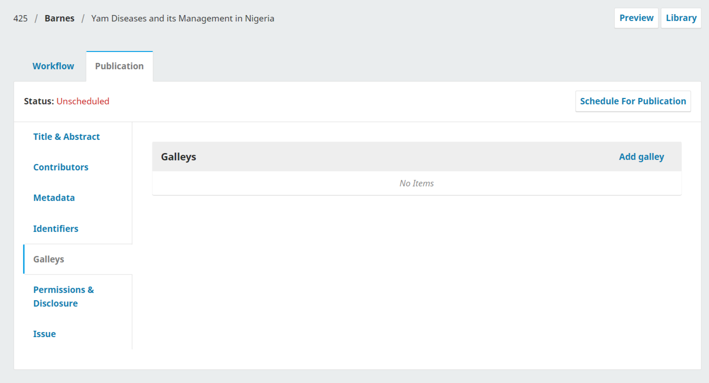

Then click **Add galley**, which will open a new window.

Add an appropriate label \(e.g., PDF, HTML, etc.\) and click **Save**.

From this window, choose the appropriate article componenet \(e.g., article text\) and upload the galley file. Click **Continue**.

If necessary, change the filename. Click **Continue**.

If you have more files, upload them now. Otherwise click **Complete**.

You can now see the galleys in the Galley panel.

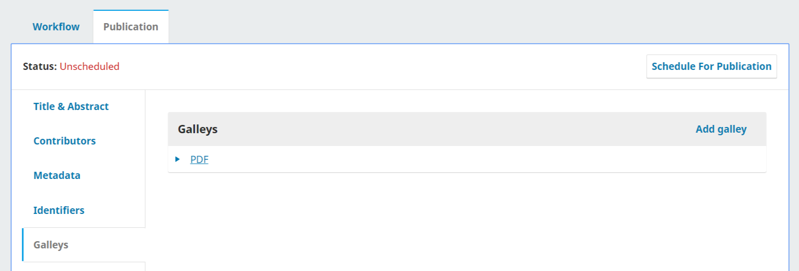

You can make changes to the upload by selecting the blue arrow to the left of the galley label, which reveals options to edit, change the file, or delete.

### Inform the Section Editor
Finally, you will need to inform the Section Editor that the galleys have been completed. To do so, use the Production Discussion panel and choose the **Add Discussion** link.

Add the Section Editor to the top of the page, and then include a subject line and message. Click **OK** to send the message.

You can now see the final discussion.

### Section Editor Informs Editor

At this point, the Section Editor receives the notification from the Layout Editor and reviews the galley files.

They can either ask the Layout Editor to make additional changes \(using the Production Discussions\) or inform the Editor that the galleys are ready for publication.

To inform the Editor, use the Production Discussion panel's **Add Discussion** link.

The next step in publishing the submission is to check and finalize the metadata. 

## Finalize metadata

Before publishing the submission, you should check that the metadata for the article is complete and accurate in OJS and matches the metadata on the PDF. This is important for ensuring that the content is indexed by Google Scholar, discoverable by other services, and accessible to readers.

You can check the metadata for the submission by going to **Submissions**, opening the submission, going to the **Publication** tab, and checking the **Title**, **Contributors**, and **Metadata** tabs.

At this point you can also add the article to a category to display it on a thematic category page on your site and extract and save references (if you have not already).

### Add the Article to a Category
Categories can be used to organize your articles into thematic collections. If you use categories in your journal, you can optionally add the article to a category or categories. For instructions on how to create categories see the [Journal Settings chapter](./journalsetup.md). You can add the article to a category by editing its metadata.

* In the article submission, go to the **Publication** tab
* Click **Issue**
* In the **Categories** box, check the category or categories that you want to add the article to
* Click **Save**

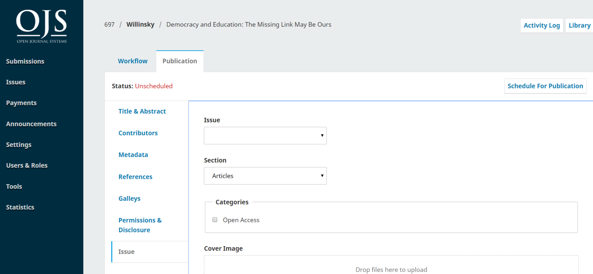

<!---### Extract and Save References--->

## Create Issue
When you are ready to publish the article, you have to create an issue to publish it in first. Then you will schedule articles for publication in the issue. The articles will not be published until you publish the issue as a whole. This section explains how to create and edit issues.

From the left menu, select Issues to manage all of the issues for your journal.

You will see tabs for Future Issues and Back Issues. 

**Future Issues** are all of your unpublished issues. You can create as many of these as you wish, and schedule submissions to any of them.

**Back Issues** lists all of your published issues.

To create a new issue, use the **Create Issue** link and fill in the form.

There are spaces to add volume, number, year, and title information (e.g., Special Issue #1), as well as a description, cover image, and custom URL. The cover image and description will appear at the top of the issue page on your site, if you add them. If you have volume, number, and title checked off below, you will be required to fill something into each field.

When you’re finished, click **Save**.

### Edit Issue
You can also edit an existing future issue by selecting the blue arrow to the left of the issue entry on the Future Issues page.

This will reveal an **Edit** link, which will open a new window of information.

**Table of Contents**: For a new issue, this will be empty, but for issues that have had submissions scheduled, they will be listed here.

Use the blue arrow next to each submission to reveal links to go directly to the submission record (more about this in Chapter 10) or remove it.

**Issue Data**: This provides access to the volume, issue, number data you entered when first creating the issue.

**Issue Galleys**: This allows you to upload galley of the complete issue – e.g., one PDF containing all articles. This will be linked from the issue web page.

**Identifiers**: Use this space to add a DOI for the issue, if your journal supports issue-level identifiers.

### Order sections and articles
When you publish an issue, articles will be displayed under your journal’s sections. 

If you go to Journal Settings > Sections and edit a section, you can configure how it will appear on your published issue page, including whether the title of the section is displayed. 

You can also drag and drop the sections to change the order of how they will appear on your published issue.

If you want to change the order of sections on a per issue basis or the order of articles within a section:
* Go to **Issues** and open the issue you want to edit
* Click **Order**
* Drag and drop the sections and articles where you want them
* Click **Done** when you are finished

### Preview issue and articles
If you want to see what your issue and the articles in it will look like on your site before publishing it, you can use the Preview feature:
* Click the blue arrow next to the future issue
* Click **Preview** 
* The issue preview page will open. To preview an article, click the article title in the table of contents.

### Publish issue
Once you are happy with the issue hit the **Publish Issue** link to publish it on your journal website.

### Notify readers
By default, all registered users will be notified via email when a new issue is published from the list of Future Issues. 

To not send a notification of a new issue published, uncheck the box beside “Send notification email to all registered users” before pressing OK.

### Unpublish Issue
Use the **Unpublish Issue** link to remove the issue and all of its content from public view. The issue will revert to the Future Issues tab.

### Delete Issue
You can use the **Delete** link to remove the issue entirely. Not only will the issue be unpublished, the organizational structure and any issue metadata will also be removed. Any assigned articles will revert to their unpublished status.

## Add the Article to an Issue
Now that you have created an issue, you can add the article to it. Please note that the article will not be published until the issue is published. In this step you are assigning the article to an issue. 

* Go back to **Submissions**
* Find and open the submission you want to publish
* Go to the **Publication** tab > **Issue**
* In the **Issue** field, select the issue you want to publish the article in
* The **Section** will be filled in automatically based on the submission metadata but you can change it if needed
* You can select a **Category** if you haven’t already done so (explained above)
* If you want an image to appear on the article page, upload it under **Cover Image**
* You can add **Page Numbers**, which will be included in the metadata and on the table of contents
* **Date Published** will be set automatically when the issue is published. Do not enter a publication date unless the article was previously published elsewhere and you need to backdate it.
* Click **Save** when you are finished

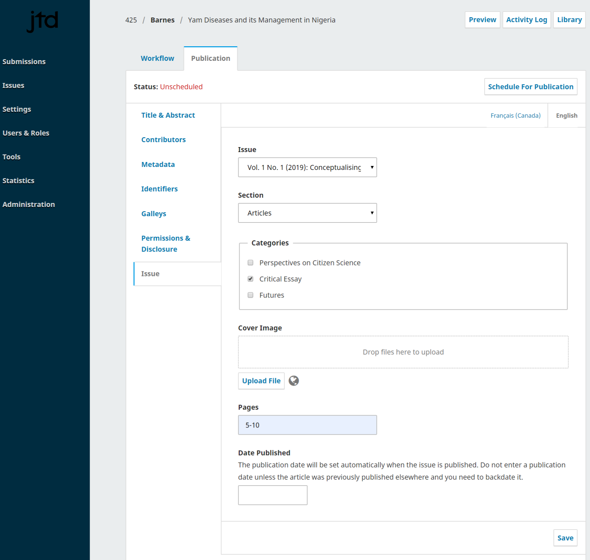

### Continuous publishing
OJS is currently designed for a traditional publishing model where articles are published in issues. However, continuous publishing is a popular alternative way to publish scholarly research, in which articles are published as they are ready. You can use a continuous publishing model within OJS.  

You can create an issue with a title like “Current Publications,” publish it, and add articles to it as they become available. The articles will be published immediately on the current issue page of your site. 

When the “Current Publications” issue gets full, you can rename it with an issue number (e.g., Vol 1, Issue )] and create a new “Current Publications” issue for the next batch of new articles.

If you would like to notify your readers when each new article is published, you will have to create an individual **Announcement**, as the automatic notification message for a new publication can only be sent when a new issue is published. See the [Website Settings chapter](./settings-website.md#announcements) for information about Announcements.

