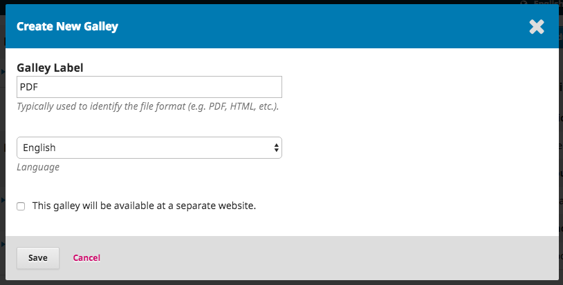
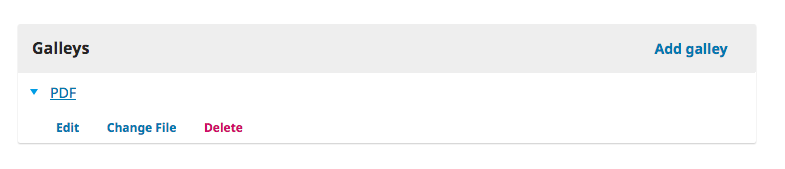

# Production

With the completion of the Copyediting stage, the submission now moves to Production. From here, the copyedit files \(often Microsoft Word files\) will be converted to publishable formats \(e.g., PDF, HTML\) and proofread before publishing.

To start working in Production, the Section Editor must login to the system and choose the submission from her dashboard.

Choosing the Production link will open the submission record.

You will see the copyedited files are now available in the _Production Ready Files_ panel.

A notification banner also indicates that you must assign someone to create the galley files \(e.g., the PDFs, HTML, etc.\) from those production ready files.

This can vary from journal to journal -- you may have layout editors or production assistants to do this work.

To make the assignment, use the _Add_ link in the Participants list. This will open a new window.

Use the role selector and search button to find appropriate users, select one, choose a predefined message, and hit **OK** to send.

The user has now been notified via email and in his dashboard.

Notice that the notification now indicates the submission is "Awaiting Galleys". You can see the layout editor in the Participants list, and you can see the request notice in the Production Discussions panel.

You can now wait for the Layout Editor to complete his tasks.

## Layout Editing

As the Layout Editor, you will have received a message inviting you to create the galleys for the submission.

To get started, login to the system and go to your dashboard.

From here, find the submission and select the Production link.

This will take you to the submission record.

From the Production Ready Files panel, download the files to your desktop and work outside of OJS to convert them to the formats appropriate for your journal \(e.g., HTML, PDF, etc.\).

> Note: PKP is currently working on a project to automate the conversion of Microsoft Word documents into other formats, including XML, HTML, PDF, EPUB, etc. Keep an eye on our blog for updates.

## Deciding on Article File Formats

Online journals today publish their articles in a variety of file types. Most common are the PDF and HTML, but increasingly additional formats are being used, such as ePub, MP3, and XML.

The majority of author submissions come in as Microsoft Word documents \(.doc or .docx\), and typically move through the OJS workflow \(review, revision, copyediting\) in that format. Other formats sometimes include text \(.txt\), rich text format \(.rtf\), or Open Office \(.odt\). These aren't suitable for final publication, so will need to eventually be converted into a more reader-friendly format.

### Working from Templates

Requiring all submissions to use a template that is pre-formatted with your journal's publication styles \(e.g., the font face, font size, boldness, placement, etc. of the header, body, footers, etc.\) will make your document conversion much easier.

Microsoft provides a brief overview for creating templates [here](https://www.gitbook.com/book/pkp/ojs3/edit#).

Once you've created a template that matches your journal style, you should link it from your Author Guidelines, along with a brief explanation of the need to use the template. This means that all of your submissions will come in already formatted, saving your layout editor a significant amount of work.

Here's an example of an OJS journal that requires authors to download and use a template file: [Paideusis](https://journals.sfu.ca/pie/index.php/pie#authorGuidelines).

Ideally, your template should be created using styles rather than direct formatting. This not only ensures consistency throughout your documents, but will also aid in any conversions to other formats \(e.g., HTML\). Here's an [explanation of the difference between styles and direct formatting in Word](https://support.office.com/en-us/article/Style-basics-in-Word-d382f84d-5c38-4444-98a5-9cbb6ede1ba4?CorrelationId=1b00844c-a9dc-4d62-98df-a966f30d4b20&ui=en-US&rs=en-US&ad=US&ocmsassetID=HA010230882).

### Creating PDF files

A PDF is the easiest type of file to create from a Word document. Current versions of Microsoft Word \(and other word processors\) let you simply "Save As" a PDF. The majority of OJS journals publish their articles as PDFs.

PDFs are also popular with many readers, as they most closely recreate the printed page. However, PDFs are often less flexible on mobile devices and do not always handle links or embedded media \(such as sound or video files\) particularly well. With the growing importance of mobile computing, ensuring your audience can easily read your articles on their phones or tablets is increasingly important.

Example \(see PDF link at bottom of page\): [Irish Journal of Technology Enhanced Learning](http://www.journal.ilta.ie/index.php/telji/article/view/22/51)

### Creating HTML Files

HTML files have the advantage of flexibility. They handle linking and multimedia very well, and can fit on just about any screen - including phones and tablets. They do, however, look different than a printed page, so some readers continue to prefer a PDF. The ideal situation is to provide both PDF and HTML files to best meet the needs of your different users.

We saw in the previous section that creating a PDF from a submitted Word file is easy. Unfortunately, creating HTML files is a little more time consuming. Word processors do not have effective tools for doing a "Save As" to HTML. Microsoft Word tries to do this, but the results are not useful for uploading to OJS. Instead, try following this workflow:

1. Convert the Word document. You can use this [free online tool](https://word2cleanhtml.com/) to do an initial conversion.
2. Open the resulting HTML files in a text editor \(e.g., NotePad in Windows\) or HTML editor \(e.g., Adobe Dreamweaver\). From here, you will need to make any final clean up or formatting. Understanding the basics of HTML is required. Its not hard and there are many [free tutorials](https://www.w3schools.com/html/), but it does take some time.
3. Keep the HTML formatting basic. Just focus on paragraphs, line breaks, headings, and links. Don't worry about fonts, colours, or other design elements - OJS will take care of all of that automatically as part of the overall journal design.
4. Upload to OJS as an HTML galley file

Example \(see HTML link at bottom of the page\): [Forum Qualitative Sozialforschung](http://www.qualitative-research.net/index.php/fqs/article/view/2577)

### Creating ePUB Files

Similar to HTML files, ePub files are ideal for mobile devices, but require specialized coding to create. Conversion tools are available, such as [Calibre](https://calibre-ebook.com/). More detailed HOW TO instructions for creating ePub files are [available here](https://www.wikihow.com/Convert-a-Word-Document-to-Epub).

Like HTML files, some additional cleanup may be required after conversion and [require some knowledge](http://www.jedisaber.com/eBooks/Introduction.shtml) of the format.

Example \(see EPUB link at bottom of the page\): [International Review of Research in Open and Distance Learning](http://www.irrodl.org/index.php/irrodl/article/view/2895)

### Creating Audio Files

Although not common, some journals also create audio files of their articles, to allow for users to listen to the content. This is particularly helpful to the visually impaired, but many people enjoy podcasts and audio books while traveling or doing other activities.

Creating audio files can either be done manually, by having someone read the article into a voice recorder, or automatically using Text to Speech software.

Example \(see MP3 link at bottom of the page\): [International Review of Research in Open and Distance Learning](http://www.irrodl.org/index.php/irrodl/article/view/3279)

### Creating XML Files

Creating XML files is a very efficient way to publish in multiple formats. When you create an XML file, you can then automatically generate PDFs, HTML, ePub, and other formats. PKP is developing an XML conversion tool called the [Open Typesetting Stack](https://pkp.sfu.ca/open-typesetting-stack/), which is currently available in beta. You can also learn how to create XML files yourself. [Excellent tutorials](https://www.w3schools.com/xml/) are available online, but will require a significant time investment to become proficient.

Example \(see XML link on top right of the page\): [Journal of Medical Research and Innovation](https://jmri.org.in/jmri/article/view/e000084)

## Contact the Author

Next, you will want to share the PDF with the author for a final look and sign-off.

To so, use the _Add Discussion_ link in the Production Discussion panel. This will open a new window.

Remember to add the author at the top of the window, and then add a subject and a message.

Before sending, however, attach a copy of the PDF file using the _Upload File_ link. This will make it available to the author.

Remember to select the correct Article Component, and then upload the PDF.

Hit **Continue**.

Next, make any changes to the file name \(usually you don't need to do anything here\).

And then, you can upload additional files, if necessary.

Once you are done, hit **Complete**.

The file is now attached and you can send the message using the **OK** button.

The Author has now been notified and you can await his response.

## Author Response

Once the author has had a chance to review the galleys and respond, you will receive an email notification and will see a reply in the Production Discussions.

## Add Galleys

Now that the Author has proofread the galleys, you can make any final changes, an then upload them to the Galleys panel.

To do so, use the _Add Galley_ link, which will open a new window.

Add an appropriate label \(e.g., PDF, HTML, etc.\) and Hit **Save**.

From this window, choose the appropriate article componenet \(e.g., article text\) and upload the galley file. Hit **Continue**.

If necessary, change the filename. Hit **Continue**.

If you have more files, upload them now. Otherwise hit **Complete**.

You can now see the galleys in the Galley panel.

You can make changes to the upload by selecting the blue arrow to the left of the galley label, which reveals options to edit, change the file, or delete.

## Inform the Section Editor

Finally, you will need to inform the Section Editor that the galleys have been completed. To do so, use the Production Discussion panel and choose the _Add Discussion_ link.

Add the Section Editor to the top of the page, and then include a subject line and message. Hit **OK** to send the message.

You can now see the final discussion.

## Section Editor Informs Editor

At this point, the Section Editor receives the notification from the Layout Editor and reviews the galley files.

She can either ask the Layout Editor to make additional changes \(using the Production Discussions\) or inform the Editor that the galleys are ready for publication.

To inform the Editor, use the Production Discussion panel's _Add Discussion_ link.

## Scheduling for Publication

Upon receiving notification of the completed galleys, the editor logs into the submission record, and checks the uploaded galley files.

If the galleys look ready, the editor can hit the blue **Schedule for Publication** action button.

Selecting this button opens a Publication window.

Use this to add the submission to a future or back issue of the journal.

You also have the option to add page numbers, permission, and licensing information.

Hitting **Save** will publish the submission to the selected issue. If the issue is already published, the submission will be immediately available to readers.

Congratulations! You have now come to the end of the editorial workflow.
