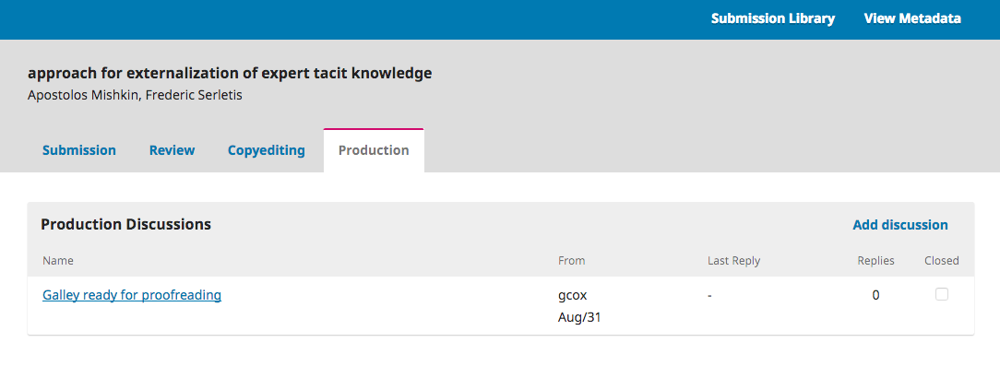

# Responding to a Proofreading Request

The next step in the workflow is to inspect your submission files that have been converted into galleys (e.g., PDF, HTML, etc.).

You will receive an email indicating that files are available. To see them, login to the journal and go to your dashboard.

You can see your entry in the My Authored panel. Select the Production link to go to the full submission record, including the notification in the Production Discussions panel.

Click on the linked discussion to open it, read the message, and open the attached file.

Once you have read the attached file, you can respond to the Layout Editor indicating any required changes or your approval.

That's it! Your role in the editorial workflow is now completed.
