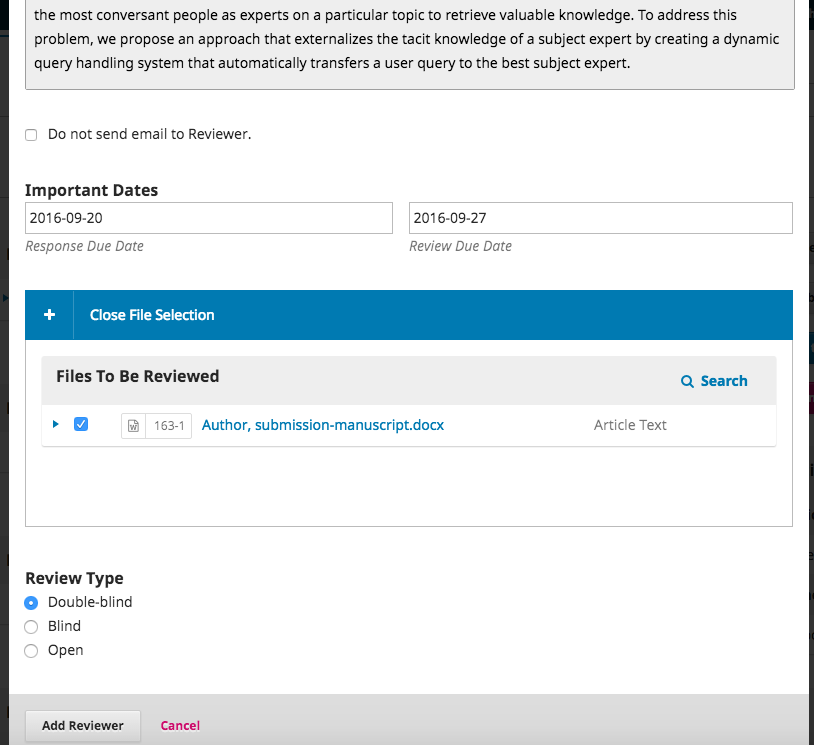
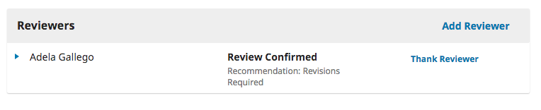
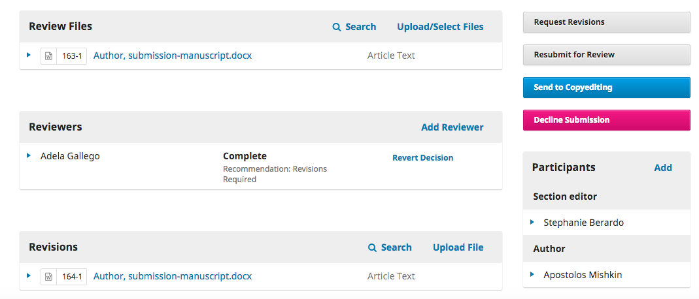

# Review

When the submission enters the Review Stage, a notification indicates that Reviewers need to be assigned.

> Note: In the screenshot above, we see the Section Editor's view. Notice the limited Action buttons \(only Make Recommendation is available\). If we were logged in as an Editor, we would see more Action buttons \(Request Revisions, Resubmit for Review, Send to Copyediting, Decline Submission\).

From the Reviewers panel, you can select Add Reviewer to assign a new Reviewer.

This opens a new window, where Reviewers are listed and can be selected one at a time.

Note the details visible about the Reviewers, including their interests, past assignments, etc.

At the bottom of this form, you will see options to:

**Select Reviewer**: Use this to confirm your selection once you have picked a Reviewer from the list.

**Create New Reviewer**: If none of the Reviewers are suitable, you can use this button to create a new Reviewer. This is a new account in the system.

**Enroll Existing User**: If none of the Reviewers are suitable, you can enroll an existing user as a Reviewer.

For this demonstration, we will pick Adela as our Reviewer and hit the **Select Reviewer** button.

This initiates a new window with a message for the Reviewer.

You can revise any of the prepared text.

If you are using a Blind Review method, ensure that the files you send to the Reviewer are stripped of any identifying information about the Author.

Further down the form, you will see the additional details that are sent to the Reviewer including title, abstract, important dates, and a link to the files to be reviewed.

By default, Reviewers will be provided with an extended text box to type in their comments. However, the Journal Manager can create Review Forms in [**Workflow Settings &gt; Review**](https://pkp.gitbooks.io/ojs3/content/en/workflow_settings.html) to ask more focused questions. If you would like the Reviewer to fill out a review form, select it under **Review Form**.

Hit the **Add Reviewer** button to send the message and assign the Reviewer.

Back on the Review Stage, we can see the Reviewer is now listed.

You can make additional changes using the blue arrow toggle next to the Reviewer's name.

**Review Details**: Provides details on the review.

**Email Reviewer**: Allows you to send a message to the Reviewer.

**Edit Review**: Allows you to change the review dates and files.

**Unassign Reviewer**: Allows you to unassign the Reviewer.

**History**: Provides a brief history of the review.

At this point, we could add additional Reviewers, and then wait for their recommendations to come in.

## Responding to Reviews

Once the Reviewers have completed their work, the Section Editor can see the results in their dashboard.Here they will see notifications that new reviews have been submitted and whether all reviews are in.

Use the _Read Review_ link in the Reviewers panel to read the comments from the Reviewers, including those for both the Author and Editor as well as for the Editor only.

Select the _Confirm_ link at the bottom of the screen.

In the Reviewers panel, you can now see a _Thank Reviewer_ link. Choose that to thank the Reviewer.

Hit the **Thank Reviewer** button to send the message.

## Making the Decision

Based on the Reviewer recommendations, you can use the action buttons to make a decision.

Options include:

**Request Revisions**: This will require the Author to make minor changes, but no further peer review is required.

**Resubmit for Review**: This will require the Author to make major changes and another round of review will need to take place.

**Send to Copyediting**: This means the submission is accepted without revisions and can proceed to the Copyediting stage.

**Decline Submission**: This means that the submission has not passed peer review and is unsuitable for further consideration. The submission would then move to the Archives.

## Request Revisions

In this demonstration, we are going to request that the Author make some minor revisions before acceptance.

To do so, select the **Request Revisions** button. This results in a new message window.

You can modify any of the text before sending the message.

Use the **Add Reviews** button to import the Reviewer's comments from the Editor and Author field. Comments in the Editor only field will not be displayed.

If there are any attachments, such as marked up file created by a Reviewer, you can attach it here \(as long as it has been anonymized\).

Hit the **Record Editorial Decision** button to send the message.

You must now wait for the Author to respond with her revisions.

## Author Responds

Once the Author has made the revisions, you should receive a message \(via email and the Review Discussions panel\).

You will also see the revised file in the Revisions panel.

At this point, you can download the revised file, check to make sure it is ready, and communicate with the Author using the Review Discussions panel.

In this case, we're going to inform the Author that we are accepting the revisions. To do so, click on the linked title of the discussion. This will open the discussion box.

Use the **Add Message** button to reply.

Another option would be to ask for further revisions, but at this point, we're ready to move on.

## Moving to Copyediting

The submission is now ready to be moved to copyediting. To do so, use the blue **Send to Copyediting** button.

This will open a new window.

Hit the **Record Editorial Decision** button at the bottom of the window.

The submission is automatically moved to the Copyediting stage.
