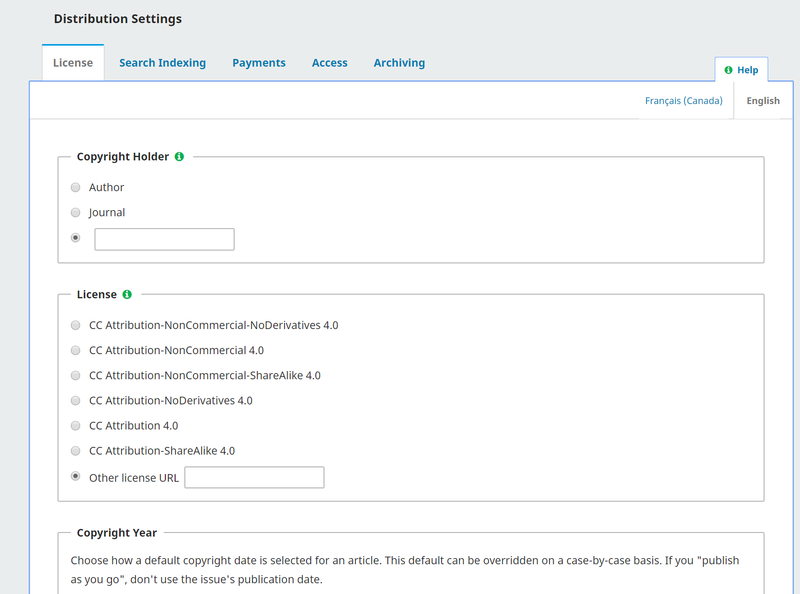
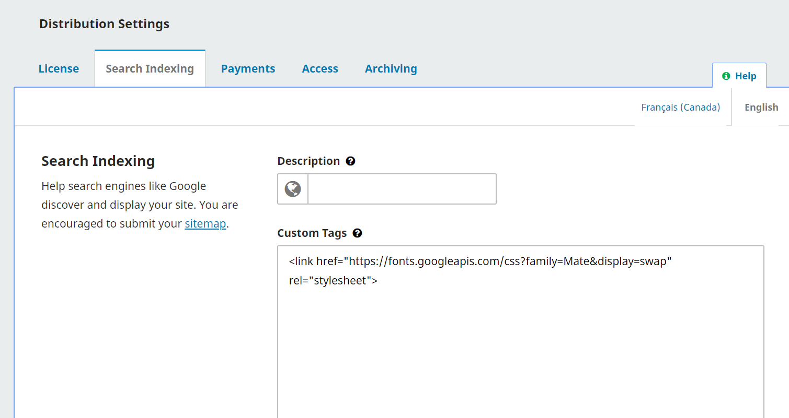
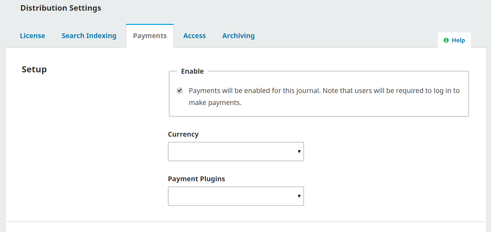
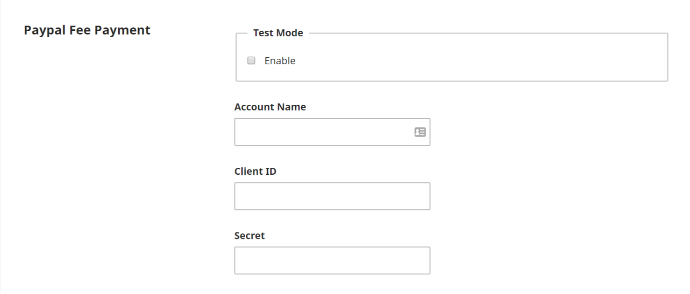
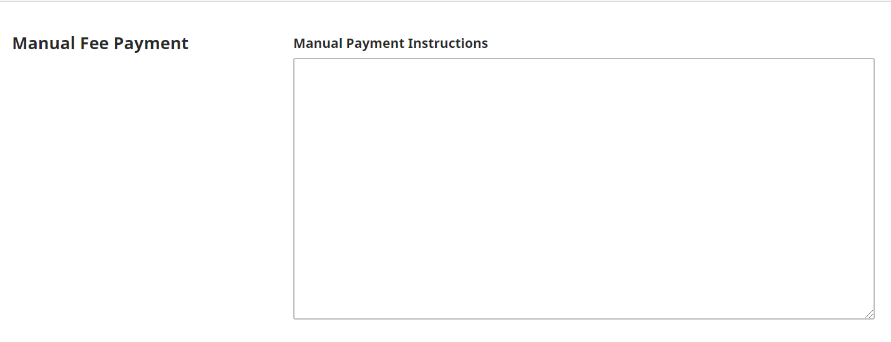
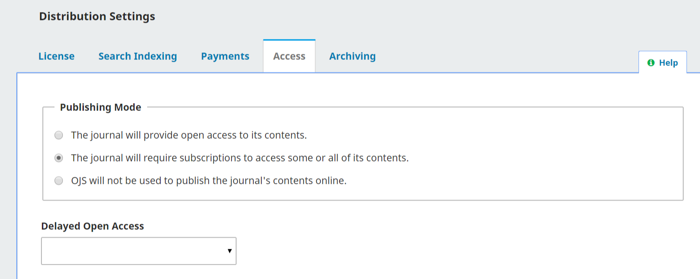
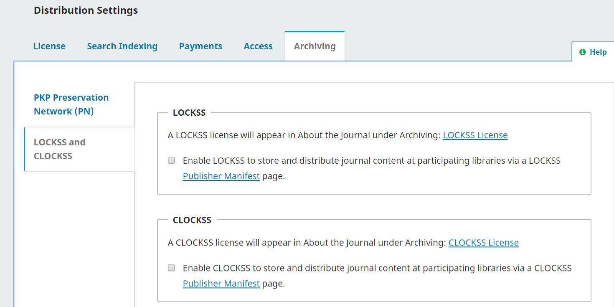

# Distribution Settings

The Distribution Settings focus on access to and visibility of your journal. The tabs consist of License, Search Indexing, Payments, Access, and Archiving.

Please note that if your journal is multilingual and you have Forms enabled for multiple languages in the language settings, you will have to configure some of this information for each language. You can switch to another languages by selecting the language under the Help link on the top right.

## License



This PKP School video explains how to configure the license settings. To watch other videos in this series, visit [PKP’s YouTube channel](https://www.youtube.com/playlist?list=PLg358gdRUrDVTXpuGXiMgETgnIouWoWaY).

In this section you can configure copyright and licensing terms for your journal's content.



**Copyright Holder**: Select who holds copyright to the articles published by your journal. The trend in open access publishing is to allow authors to retain copyright of their work.

**License**: Select the license for your journal. CC Attribution 4.0 is a widely used license for open access journals, allowing for maximum sharing and reuse. For definitions of different Creative Commons licenses, see the [Creative Commons website](https://creativecommons.org/).

The license you select will be automatically added to each article's metadata and displayed on the article page of each published article.

**Copyright Year**: Select whether you want the copyright year to come by default from the article's publication date or the issue's publication date.

If you use a continuous publishing model, select the article's publication date. If you use a traditional, issue-based publishing model, select the issue's publication date.

This default can be overridden on a case-by-case basis.

**License Terms**: Enter any additional license terms you would like to display alongside the license selected above on the published article page.

## Search Indexing



This PKP School video explains how to configure the index settings. To watch other videos in this series, visit [PKP’s YouTube channel](https://www.youtube.com/playlist?list=PLg358gdRUrDVTXpuGXiMgETgnIouWoWaY).

This section helps you enhance your search engine optimization and make your content more discoverable.



Use **Description** to provide a brief description of your journal for search engines.

Use **Custom Tags** to add custom HTML header tags to the header of every page of your journal, which can help your site get indexed by search engines. Tags need to be added as HTML elements. If you simply enter words they will appear at the top of every page of your site instead of in the site's metadata. Here is an example of text that could be entered in this field:

```html
<meta name="description" content="The Journal of Public Knowledge. Publication of the Public Knowledge Project - PKP and Simon Fraser University - SFU" />
<meta name="keywords" content="open access, scholarly publishing, open source software, non-profit organizations, scholarly journals, free software" />
<meta name="author" content="metatags generator">
<meta name="robots" content="index, follow">
<meta name="revisit-after" content="3 month">
```

## Payments



This PKP School video explains how to configure the payment settings. To watch other videos in this series, visit [PKP’s YouTube channel](https://www.youtube.com/playlist?list=PLg358gdRUrDVTXpuGXiMgETgnIouWoWaY).

OJS provides the ability to collect online payments and manage subscriptions and author fee payments.

Using the PayPal plugin, you can accept payments through PayPal, or you can accept manual payments (such as cheque, email transfer, etc.), but they must be made outside of OJS and are not automatically recorded in OJS.  If you would like to use a different payment service you will have to create your own plugin.

### Enable Payments

To use payments and subscriptions features, you first have to enable payments under this tab. After you check off **Enable**, additional configuration settings will appear below.



Select the currency you will use.

Select the fee payment method you will use under **Payment Plugins**.

If you select **PayPal Fee Payment**, additional fields will appear.

To accept PayPal payments, you will need to go to Website Settings > Plugins and enable the PayPal Plugin, then do additional setup and configuration explained in the [PayPal Plugin Guide](https://docs.pkp.sfu.ca/using-paypal-for-ojs-and-ocs/en/). Through this process you will get the values for the **Account Name**, **Client ID**, and **Secret** fields.



If you select **Manual Fee Payment** under **Payment Plugins**, a field will appear where you can enter instructions that will appear to users who are making a manual payment.  For example, “Send a cheque payable to the Public Knowledge Project” to ______.”



You will also need to enable the Manual Payment Plugin under Website Settings > Plugins to accept manual payments.

Click **Save**.

A new menu item will appear on the main dashboard menu called **Payments**.

Go to the [Subscriptions Chapter](./subscriptions.md) for further instructions on managing subscriptions and payments.

If you plan to make your journal or articles available by subscription, go to Distribution Settings > Access and check off “The journal will require subscriptions to access some or all of its contents.”


### Donations

In OJS 3.x there is not an option to set up a payment type for donations, to manage donations with the Payments module, or to use the PayPal plugin to accept donations. You can add the Donations block to your sidebar, but it will have to link to an external site where donation payments can be made.

## Access



This PKP School video explains how to configure the access settings. To watch other videos in this series, visit [PKP’s YouTube channel](https://www.youtube.com/playlist?list=PLg358gdRUrDVTXpuGXiMgETgnIouWoWaY).

Under the Access tab you can configure whether you want your journal contents to be open access, available by subscription, or a combination. By default, the open access option is selected. However, if you wish to use OJS for a subscription journal, choose the second option (see above section on Payments for further information). Selecting the second option will allow you to further delay open access by different periods of time.



If you are only using OJS to manage your submission workflow and not publish your content, you can select "OJS will not be used to publish the journal's contents online."

OJS allows you to configure how and when content can be accessed at an article and issue level. When you create an issue, there is a tab called **Access** under which you can set the **Access Status** as **Subscription** or **Open Access**.


If you set it as **Subscription**, underneath that a box will appear where you can optionally enter an **Open Access Date**, at which the content will become open access.

Once you set it as **Subscription**, on the **Table of Contents** tab, a checkbox will appear beside each article under **Open Access**, where you can optionally set individual articles as open access, even if the rest of the issue remains available by subscription.


**Enable OAI** will be enabled by default, as this is an important protocol used by indexing services and other applications to harvest your journal's metadata. However, if you are not using OJS to publish your journal's content you may want to disable OAI.


## Archiving



This PKP School video explains how to configure the archiving settings. To watch other videos in this series, visit [PKP’s YouTube channel](https://www.youtube.com/playlist?list=PLg358gdRUrDVTXpuGXiMgETgnIouWoWaY).

If you are a member of a LOCKSS or CLOCKSS network, use this tab to activate your journal. The PKP PN Plugin, which deposits your content in the PKP Preservation Network(PN), is available for OJS 3.1.2 or newer.

For instructions on enabling the PKP PN, see the [PKP Preservation Network Guide](https://docs.pkp.sfu.ca/pkp-pn/).

If you use another network, enabling it here will make your content available to the network, but you will also need to contact the network to make it aware of your journal.


