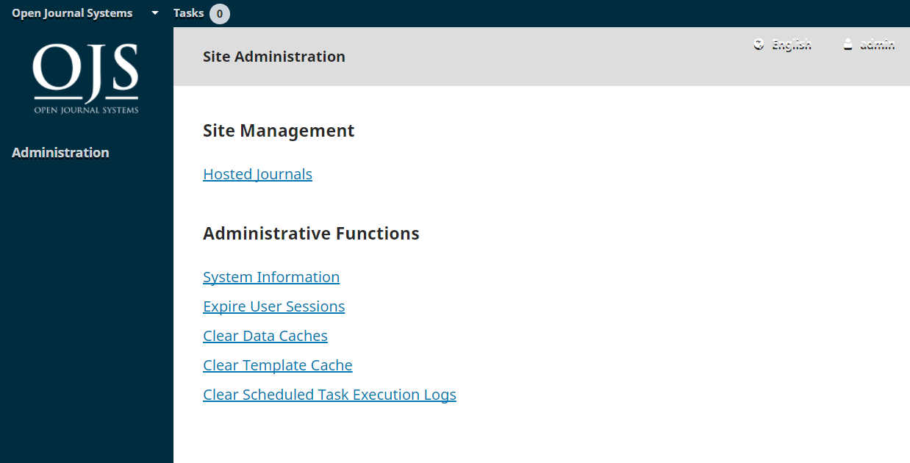
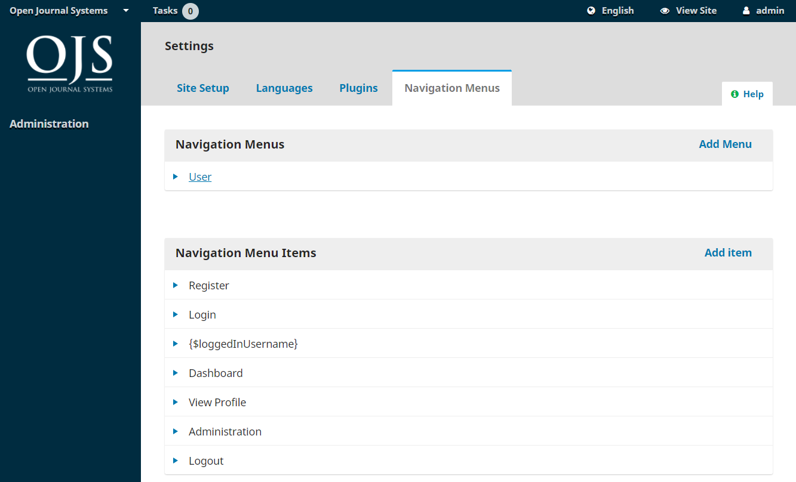

# Site Management

To get to Site Management, login as the Site Administrator, and choose Administration from the left menu.

## Hosted Journals

From here, choose Hosted Journals. One the resulting page, you will see all of the journals in this OJS installation. In the example, below, there is only one.

To edit the existing journal, click on the blue arrow to the left of the journal name. You will see options to edit, remove, or update the settings.

**Edit** will let you change the title, description, or path.

**Remove** will let you delete the journal from the installation. You will be asked to confirm that you really do want to do this, as it is irreverisible.

**Settings Wizard** will take you to the various settings options for that journal. We'll go over these settings in detail in Chapter 5.

**Users** will allow you to add and manage users associated with this journal.

Back on the Hosted Journals page, you can use the Create Journal link to add a new journal to this OJS installation. From the resulting form, fill in the fields with the new information.

> Note: If you do not want the new journal to be visible yet, uncheck the _Enable this journal to appear publicly on the site_ box.

## Site Settings

This section will appear if you have two or more journals, and allow you to add information regarding your overall OJS installation, not individual journals.

### Site Setup

This includes the name of your site, a site logo, an introductory statement about your site, a site footer, a redirect option \(if you only plan to have one journal on this installation\), contact information, a minimum password length for registered users, style sheet and theme options, and sidebar management.

You will have the opportunity to provide details about your individual journal\(s\) at a later stage.

### Languages

OJS is a multilingual system and you can add additional languages to your site here, making them available to all of the journals on your installation.

OJS 3.1 doesn't yet have as many translations as OJS 2, but we expect to have more contributed over time. Contributions are always welcome.

### Plugins

From here, you can choose to enable or disable various plugins, making them available \(or not\) to all of the journals on this OJS installation.

### Navigation Menus

Use this section to modify your site-wide menus. You can learn more about configuring menus in Chapter 5.

## Next Steps

Once you've created a journal and configured the site settings, you may want to create a user account for the Journal Manager or Editor -- see [Chapter 7](./users_and_roles.md) for details.
